# 聊天界面实现

<cite>
**本文档引用的文件**
- [PROJECT_CONTEXT.md](file://PROJECT_CONTEXT.md)
- [docker-compose.yml](file://docker-compose.yml)
- [sql/init.sql](file://sql/init.sql)
- [config/milvus_collection.yaml](file://config/milvus_collection.yaml)
- [scripts/init_milvus.py](file://scripts/init_milvus.py)
- [tests/test_milvus_connection.py](file://tests/test_milvus_connection.py)
</cite>

## 目录
1. [简介](#简介)
2. [项目结构](#项目结构)
3. [核心组件](#核心组件)
4. [架构总览](#架构总览)
5. [详细组件分析](#详细组件分析)
6. [依赖关系分析](#依赖关系分析)
7. [性能考虑](#性能考虑)
8. [故障排除指南](#故障排除指南)
9. [结论](#结论)

## 简介

本项目是面向 NetData 监控数据的智能运维问答与执行系统的前端聊天界面实现。基于 Vue3 + Element Plus 技术栈，为用户提供实时的运维问答、故障诊断和命令执行审批的交互体验。

该聊天界面采用 Orchestrator-Subagent 模式架构，支持：
- 实时 WebSocket 通信（告警、审批通知）
- 多 Agent 协同处理（问答、诊断、执行）
- Markdown 渲染和富文本支持
- 响应式设计和移动端适配
- 自定义主题配置和 Element Plus 组件集成

## 项目结构

基于项目上下文信息，前端项目采用模块化的目录结构：

```mermaid
graph TB
subgraph "前端项目结构"
Frontend[netdata-ai-frontend/]
Views[views/]
Components[components/]
Assets[assets/]
Chat[Chat.vue]
Alert[AlertDashboard.vue]
Knowledge[KnowledgeBase.vue]
Execution[ExecutionApproval.vue]
WS[websocket/]
API[api/]
Utils[utils/]
Views --> Chat
Views --> Alert
Views --> Knowledge
Views --> Execution
Frontend --> Views
Frontend --> Components
Frontend --> Assets
end
subgraph "后端集成"
Backend[netdata-ai-backend/]
WS_API[websocket/]
REST_API[controller/]
Backend --> WS_API
Backend --> REST_API
end
Chat <- --> Backend
Alert <- --> Backend
Knowledge <- --> Backend
Execution <- --> Backend
```

**图表来源**
- [PROJECT_CONTEXT.md:141-148](file://PROJECT_CONTEXT.md#L141-L148)

**章节来源**
- [PROJECT_CONTEXT.md:120-149](file://PROJECT_CONTEXT.md#L120-L149)

## 核心组件

### 聊天界面组件架构

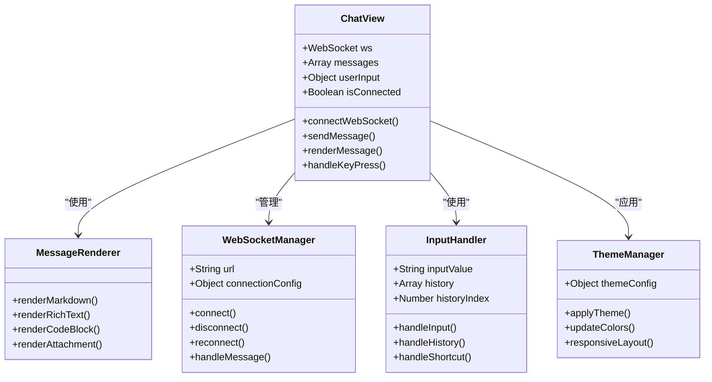

**图表来源**
- [PROJECT_CONTEXT.md:141-148](file://PROJECT_CONTEXT.md#L141-L148)

### 状态管理架构

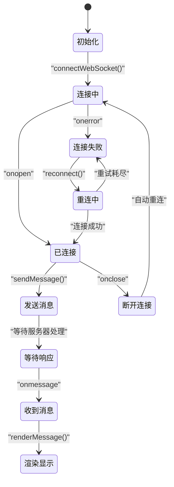

**图表来源**
- [PROJECT_CONTEXT.md:131](file://PROJECT_CONTEXT.md#L131)

## 架构总览

### 整体系统架构

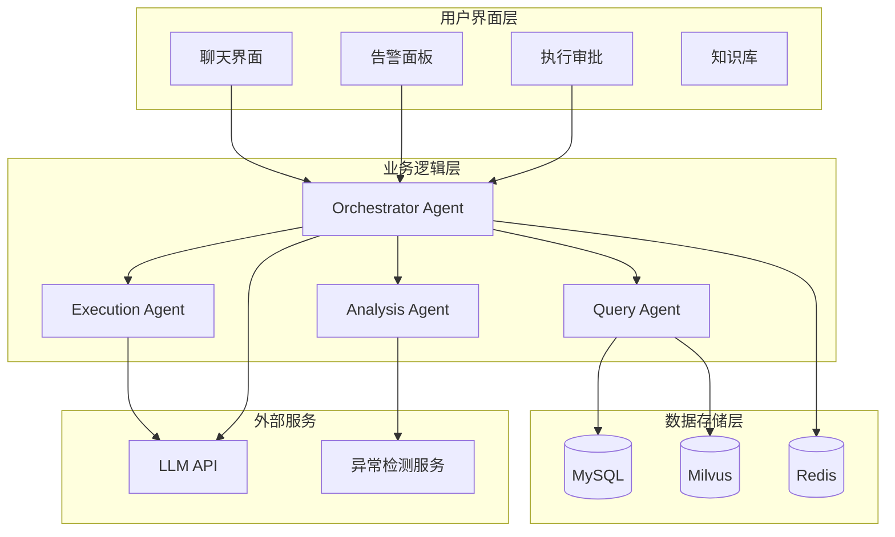

**图表来源**
- [PROJECT_CONTEXT.md:43-61](file://PROJECT_CONTEXT.md#L43-L61)
- [PROJECT_CONTEXT.md:124-133](file://PROJECT_CONTEXT.md#L124-L133)

### 聊天界面技术架构

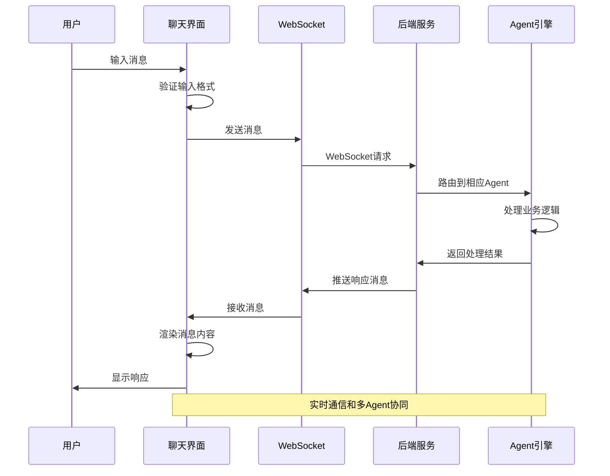

**图表来源**
- [PROJECT_CONTEXT.md:131](file://PROJECT_CONTEXT.md#L131)

## 详细组件分析

### WebSocket 实时通信组件

#### 连接管理机制

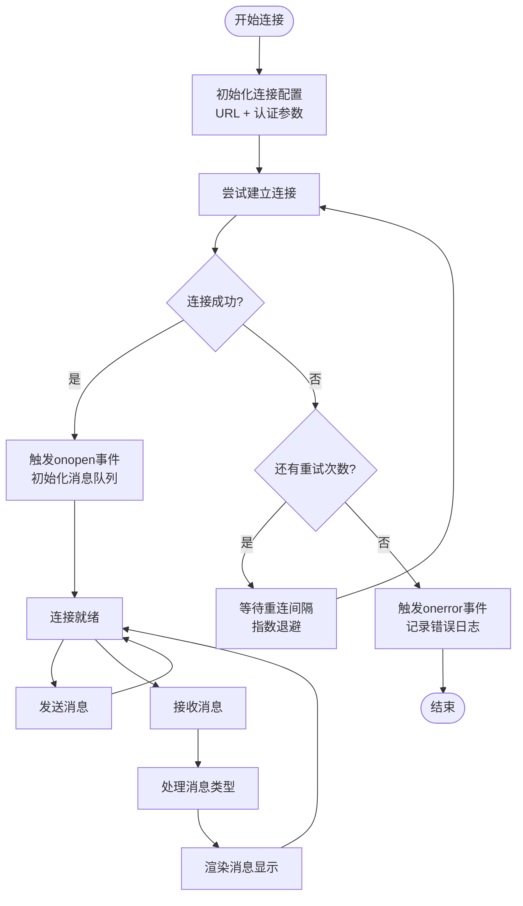

**图表来源**
- [PROJECT_CONTEXT.md:131](file://PROJECT_CONTEXT.md#L131)

#### 消息处理流程

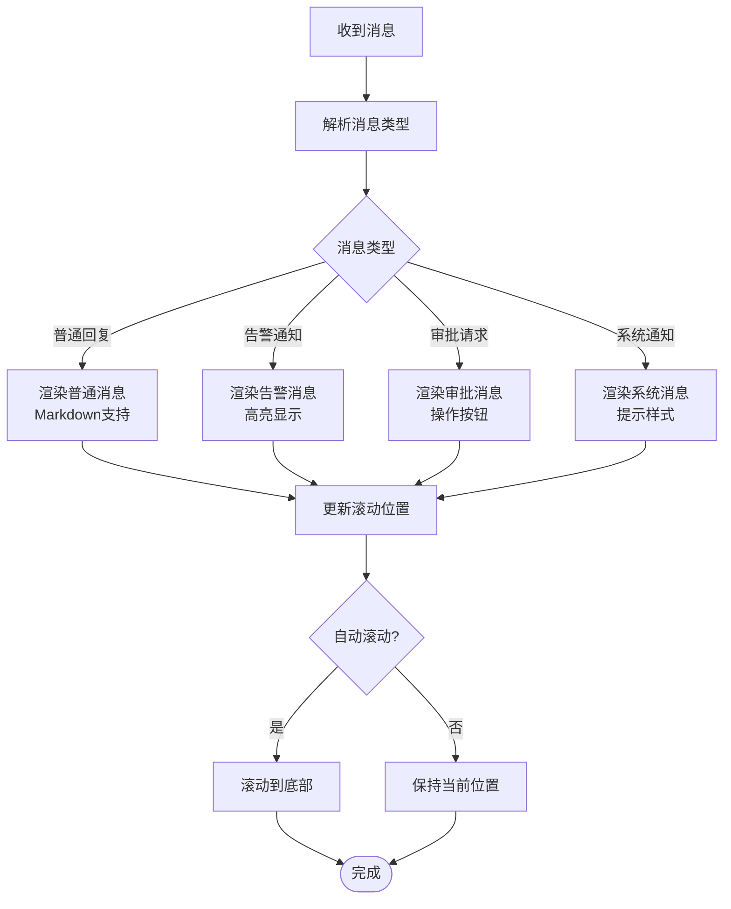

**图表来源**
- [PROJECT_CONTEXT.md:141-148](file://PROJECT_CONTEXT.md#L141-L148)

### 消息渲染组件

#### Markdown 渲染架构

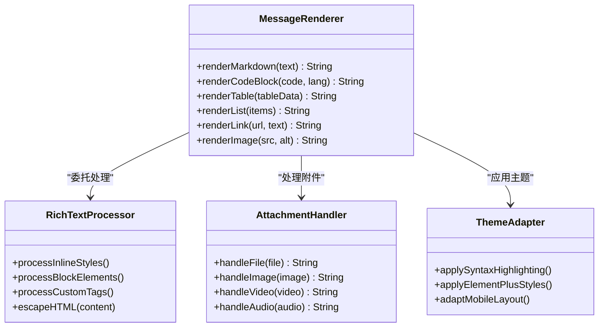

**图表来源**
- [PROJECT_CONTEXT.md:35](file://PROJECT_CONTEXT.md#L35)

#### 富文本支持实现

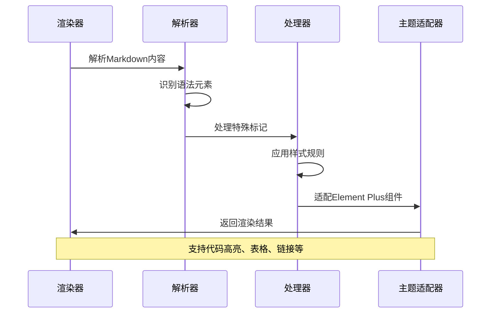

**图表来源**
- [PROJECT_CONTEXT.md:35](file://PROJECT_CONTEXT.md#L35)

### 用户交互组件

#### 输入处理机制

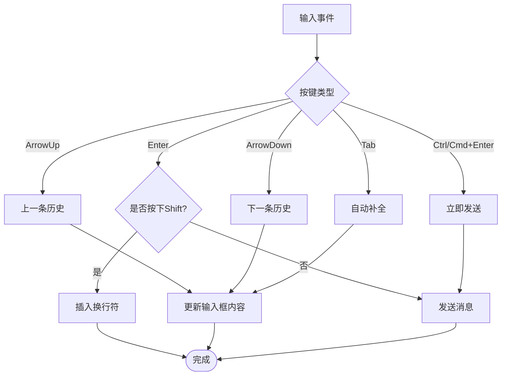

**图表来源**
- [PROJECT_CONTEXT.md:141-148](file://PROJECT_CONTEXT.md#L141-L148)

#### 快捷键支持

| 快捷键组合 | 功能描述 | 使用场景 |
|------------|----------|----------|
| Enter | 发送消息 | 常规消息发送 |
| Shift + Enter | 插入换行符 | 多行文本编辑 |
| Ctrl/Cmd + Enter | 立即发送 | 快速发送长文本 |
| Arrow Up | 查看上一条历史 | 编辑历史消息 |
| Arrow Down | 查看下一条历史 | 恢复历史消息 |
| Tab | 自动补全 | 提示输入建议 |

### 主题配置组件

#### Element Plus 集成

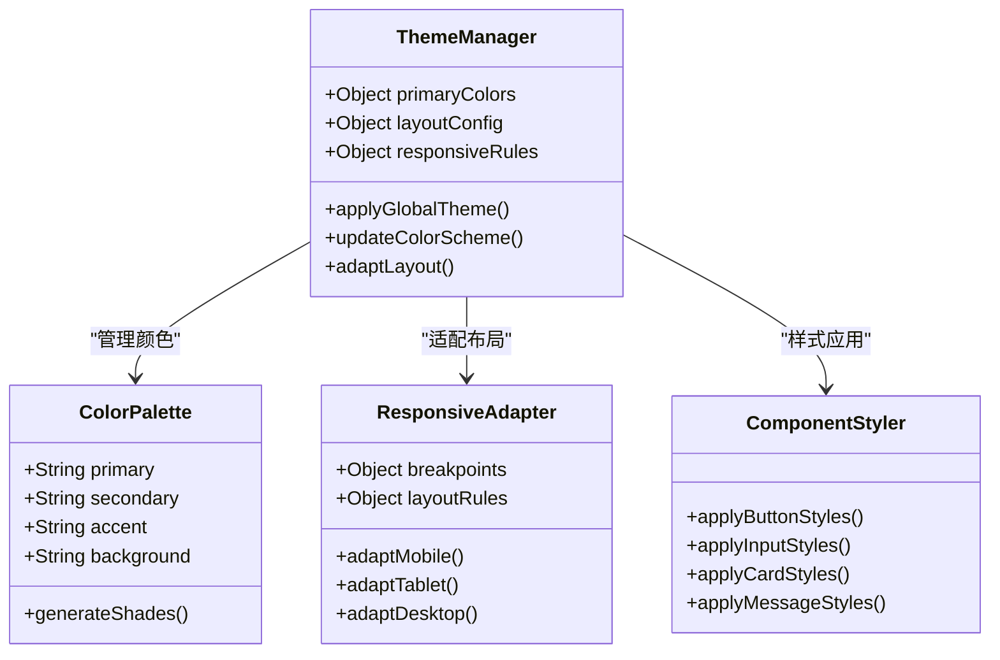

**图表来源**
- [PROJECT_CONTEXT.md:35](file://PROJECT_CONTEXT.md#L35)

#### 响应式设计实现

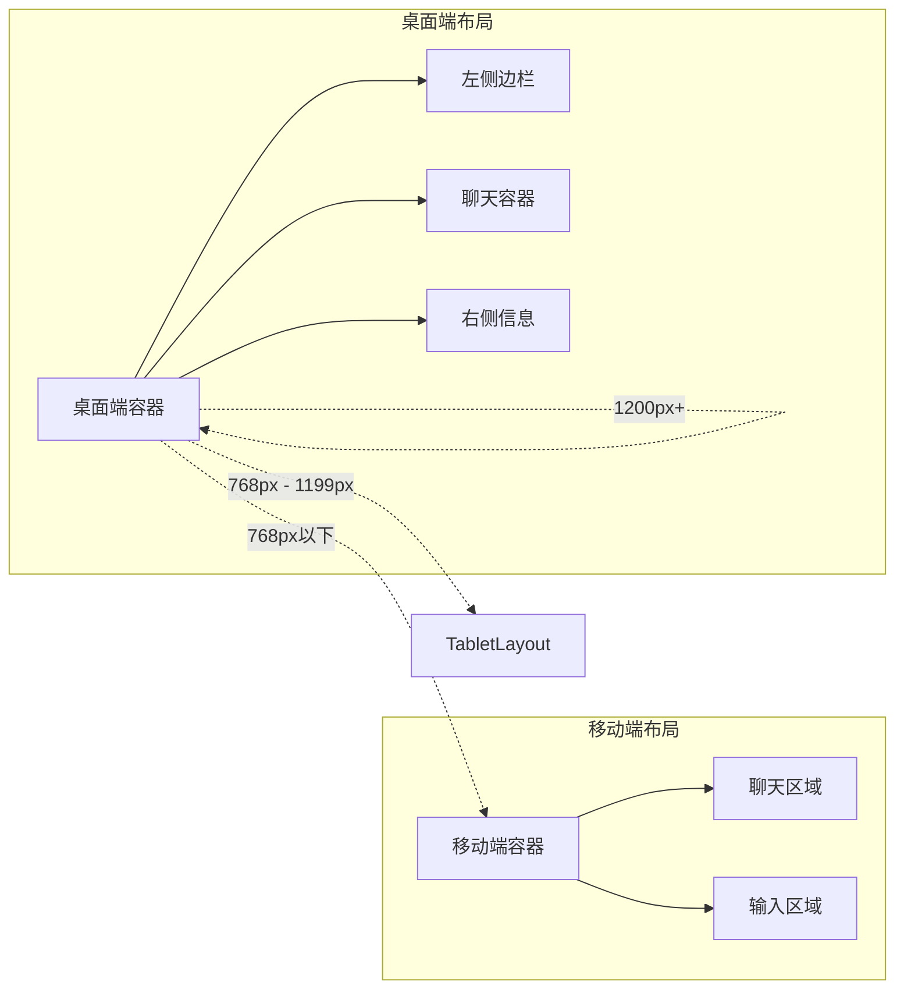

**图表来源**
- [PROJECT_CONTEXT.md:35](file://PROJECT_CONTEXT.md#L35)

## 依赖关系分析

### 技术栈依赖

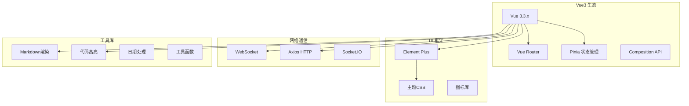

**图表来源**
- [PROJECT_CONTEXT.md:25-40](file://PROJECT_CONTEXT.md#L25-L40)

### 后端接口依赖

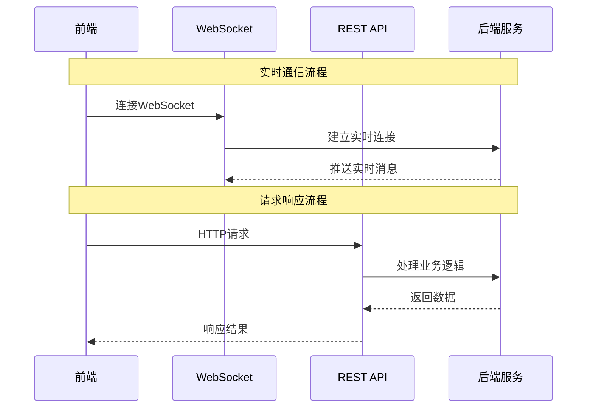

**图表来源**
- [PROJECT_CONTEXT.md:124-133](file://PROJECT_CONTEXT.md#L124-L133)

**章节来源**
- [PROJECT_CONTEXT.md:25-40](file://PROJECT_CONTEXT.md#L25-L40)
- [PROJECT_CONTEXT.md:124-133](file://PROJECT_CONTEXT.md#L124-L133)

## 性能考虑

### WebSocket 连接优化

- **连接池管理**：维护多个连接实例，避免单点故障
- **心跳检测**：定期发送 ping/pong 保持连接活跃
- **消息批处理**：批量发送消息减少网络开销
- **连接复用**：同一会话复用连接避免频繁重建

### 渲染性能优化

- **虚拟列表**：大量消息时使用虚拟滚动
- **懒加载**：图片和附件按需加载
- **防抖处理**：输入事件防抖减少重渲染
- **组件缓存**：常用组件启用缓存机制

### 内存管理

- **消息队列限制**：设置最大消息数量防止内存溢出
- **定时清理**：定期清理过期消息和临时数据
- **垃圾回收**：及时释放不再使用的对象引用

## 故障排除指南

### WebSocket 连接问题

**常见问题及解决方案：**

1. **连接超时**
   - 检查网络连接状态
   - 验证服务器地址配置
   - 查看防火墙设置

2. **频繁断线**
   - 检查心跳机制配置
   - 验证服务器负载情况
   - 调整重连策略参数

3. **消息丢失**
   - 实现消息确认机制
   - 添加本地消息缓存
   - 设置消息重发队列

### 渲染问题

**常见问题及解决方案：**

1. **Markdown 渲染异常**
   - 检查渲染库版本兼容性
   - 验证输入内容格式
   - 查看浏览器控制台错误

2. **富文本样式错乱**
   - 检查主题CSS冲突
   - 验证Element Plus版本
   - 查看自定义样式的优先级

3. **移动端显示问题**
   - 检查响应式断点配置
   - 验证触摸事件处理
   - 测试不同设备分辨率

### 性能问题

**常见问题及解决方案：**

1. **页面卡顿**
   - 检查消息渲染性能
   - 优化图片加载策略
   - 减少不必要的重渲染

2. **内存泄漏**
   - 检查事件监听器清理
   - 验证定时器清理
   - 查看组件销毁钩子

3. **网络延迟**
   - 优化WebSocket连接
   - 实现消息压缩
   - 调整请求频率

**章节来源**
- [PROJECT_CONTEXT.md:110-117](file://PROJECT_CONTEXT.md#L110-L117)

## 结论

Vue3 聊天界面实现了现代化的运维问答系统前端架构，具有以下特点：

### 技术优势
- **实时通信**：基于 WebSocket 的低延迟通信机制
- **多Agent协同**：支持复杂的业务逻辑处理流程
- **响应式设计**：适配多种设备和屏幕尺寸
- **主题定制**：灵活的样式配置和品牌化支持

### 架构特色
- **模块化设计**：清晰的组件层次和职责分离
- **状态管理**：完善的全局状态和局部状态管理
- **错误处理**：健壮的异常捕获和恢复机制
- **性能优化**：多层面的性能优化策略

### 未来扩展
- **插件系统**：支持第三方功能扩展
- **国际化**：多语言支持能力
- **离线模式**：增强的离线数据同步
- **AI集成**：更深度的人工智能功能

该聊天界面为整个 NetData 监控系统的智能化运维提供了优秀的用户交互体验，为后续的功能扩展和性能优化奠定了坚实的基础。