# 审批流程界面

<cite>
**本文档引用的文件**
- [PROJECT_CONTEXT.md](file://PROJECT_CONTEXT.md)
- [init.sql](file://sql/init.sql)
- [shared-safety-constraints.md](file://docs/prompts/shared-safety-constraints.md)
- [orchestrator-system-prompt.md](file://docs/prompts/orchestrator-system-prompt.md)
</cite>

## 目录
1. [简介](#简介)
2. [项目结构](#项目结构)
3. [核心组件](#核心组件)
4. [架构概览](#架构概览)
5. [详细组件分析](#详细组件分析)
6. [依赖关系分析](#依赖关系分析)
7. [性能考虑](#性能考虑)
8. [故障排除指南](#故障排除指南)
9. [结论](#结论)

## 简介

审批流程界面是智能运维问答与执行系统中的关键组件，负责处理高风险操作的人工审批流程。该界面实现了完整的审批生命周期管理，包括审批状态显示、操作按钮控制、流程节点推进、权限验证和通知机制等功能。

系统基于 Vue3 + Element Plus 技术栈构建，采用 WebSocket 实现实时通信，确保审批状态的即时更新和用户体验的流畅性。

## 项目结构

审批流程界面位于前端项目的 views 目录下，与聊天界面、告警仪表板、知识库等其他功能模块并列：

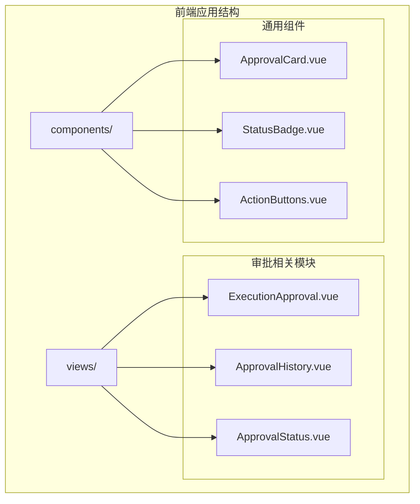

**图表来源**
- [PROJECT_CONTEXT.md:141-144](file://PROJECT_CONTEXT.md#L141-L144)

**章节来源**
- [PROJECT_CONTEXT.md:120-149](file://PROJECT_CONTEXT.md#L120-L149)

## 核心组件

### 审批状态管理系统

审批状态管理系统是整个界面的核心，负责维护和显示审批流程的实时状态。系统支持多种状态转换，包括待审批、已批准、已拒绝、执行中、已完成、失败等状态。

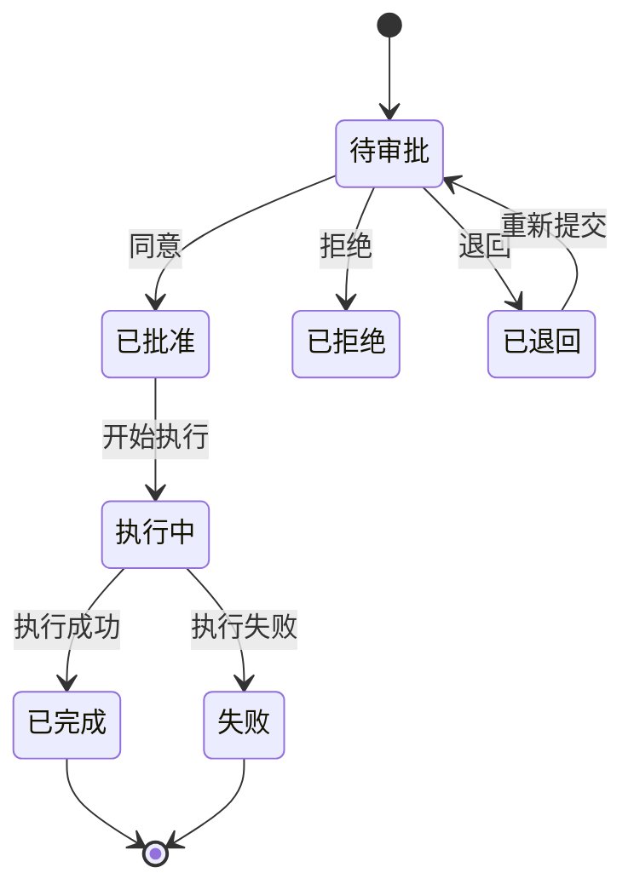

**图表来源**
- [init.sql:124](file://sql/init.sql#L124)

### 审批操作按钮组件

审批操作按钮组件提供了直观的操作界面，包含同意、拒绝、退回等核心操作按钮。每个按钮都具有相应的状态管理和事件处理机制。

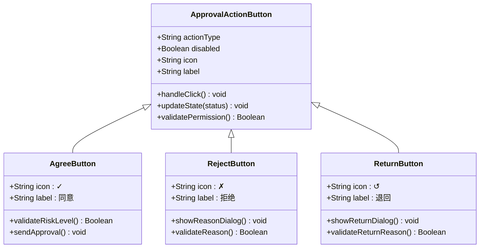

**图表来源**
- [shared-safety-constraints.md:237-258](file://docs/prompts/shared-safety-constraints.md#L237-L258)

**章节来源**
- [shared-safety-constraints.md:233-258](file://docs/prompts/shared-safety-constraints.md#L233-L258)

## 架构概览

审批流程界面采用分层架构设计，确保系统的可维护性和扩展性：

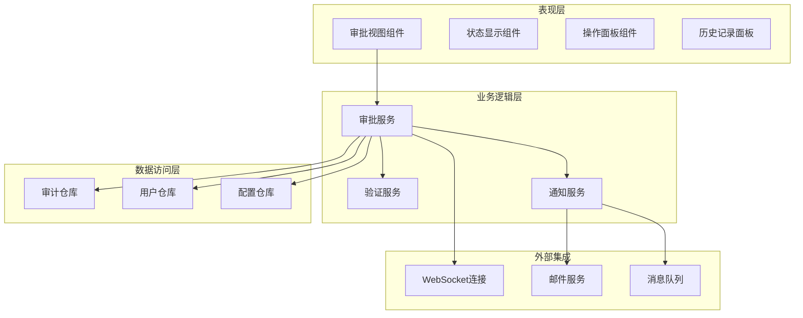

**图表来源**
- [PROJECT_CONTEXT.md:124-133](file://PROJECT_CONTEXT.md#L124-L133)

## 详细组件分析

### 审批状态显示组件

审批状态显示组件负责实时展示审批流程的当前状态和相关信息。该组件具有以下特性：

#### 状态标签样式设计

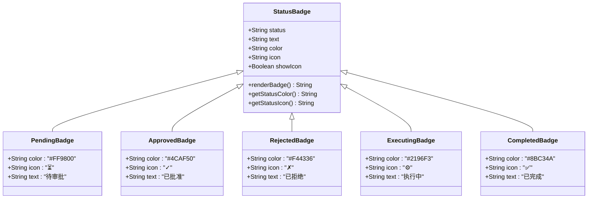

**图表来源**
- [init.sql:124](file://sql/init.sql#L124)

#### 状态图标系统

状态图标系统采用统一的视觉语言，确保用户能够快速理解当前状态：

| 状态 | 图标 | 颜色 | 说明 |
|------|------|------|------|
| 待审批 | ⏳ | 橙色 | 等待审批人处理 |
| 已批准 | ✓ | 绿色 | 审批通过，准备执行 |
| 已拒绝 | ✗ | 红色 | 审批被拒绝 |
| 执行中 | ⚙️ | 蓝色 | 正在执行命令 |
| 已完成 | ✅ | 深绿色 | 执行成功完成 |
| 失败 | ❌ | 深红色 | 执行过程中出现错误 |

**章节来源**
- [init.sql:115-138](file://sql/init.sql#L115-L138)

### 审批操作按钮设计

审批操作按钮组件提供了三种核心操作：同意、拒绝、退回。每种操作都有其特定的业务逻辑和验证要求。

#### 同意按钮实现

同意按钮是最常用的审批操作，当用户点击同意时，系统需要进行以下验证：

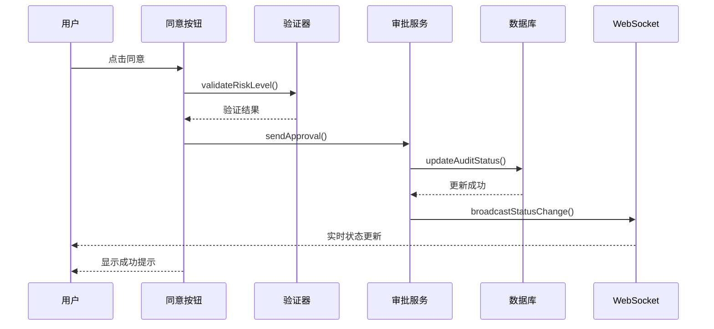

**图表来源**
- [shared-safety-constraints.md:246-258](file://docs/prompts/shared-safety-constraints.md#L246-L258)

#### 拒绝按钮实现

拒绝按钮需要用户提供拒绝原因，并进行原因验证：

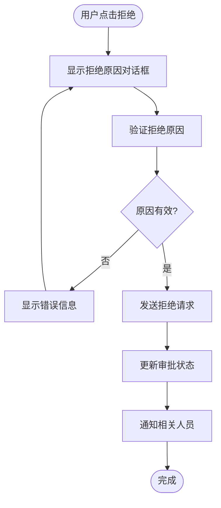

**图表来源**
- [shared-safety-constraints.md:237-258](file://docs/prompts/shared-safety-constraints.md#L237-L258)

#### 退回按钮实现

退回操作允许将审批流程退回给申请人，通常用于需要补充材料或修改的情况：

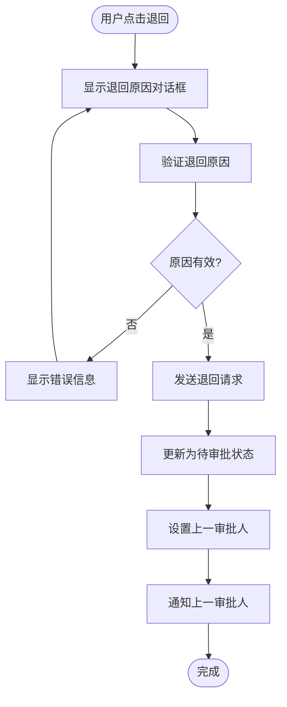

**章节来源**
- [shared-safety-constraints.md:233-258](file://docs/prompts/shared-safety-constraints.md#L233-L258)

### 审批流程控制机制

审批流程控制机制确保审批流程按照预定的规则和权限进行推进。系统支持多级审批和越权审批功能。

#### 流程节点定义

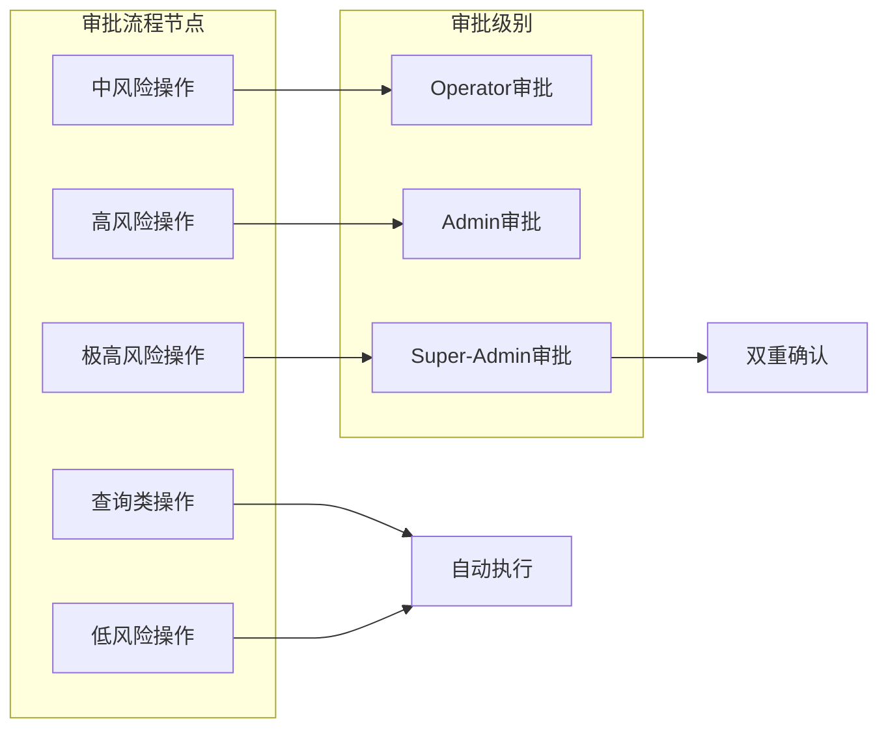

**图表来源**
- [shared-safety-constraints.md:246-258](file://docs/prompts/shared-safety-constraints.md#L246-L258)

#### 权限验证机制

权限验证机制基于角色矩阵实现，确保只有具有相应权限的用户才能进行审批操作：

| 角色 | 知识问答 | 故障诊断 | 自动执行命令 | 审批执行命令 |
|------|---------|---------|-------------|-------------|
| viewer | ✅ | ✅ | ❌ | ❌ |
| operator | ✅ | ✅ | ✅ | ✅ |
| admin | ✅ | ✅ | ✅ | ✅ |
| super-admin | ✅ | ✅ | ✅ | ✅ + 越权审批 |

**章节来源**
- [shared-safety-constraints.md:237-242](file://docs/prompts/shared-safety-constraints.md#L237-L242)

### 审批意见输入功能

审批意见输入功能提供了完整的审批评论系统，包括文本输入框、字数限制和必填验证。

#### 文本输入框设计

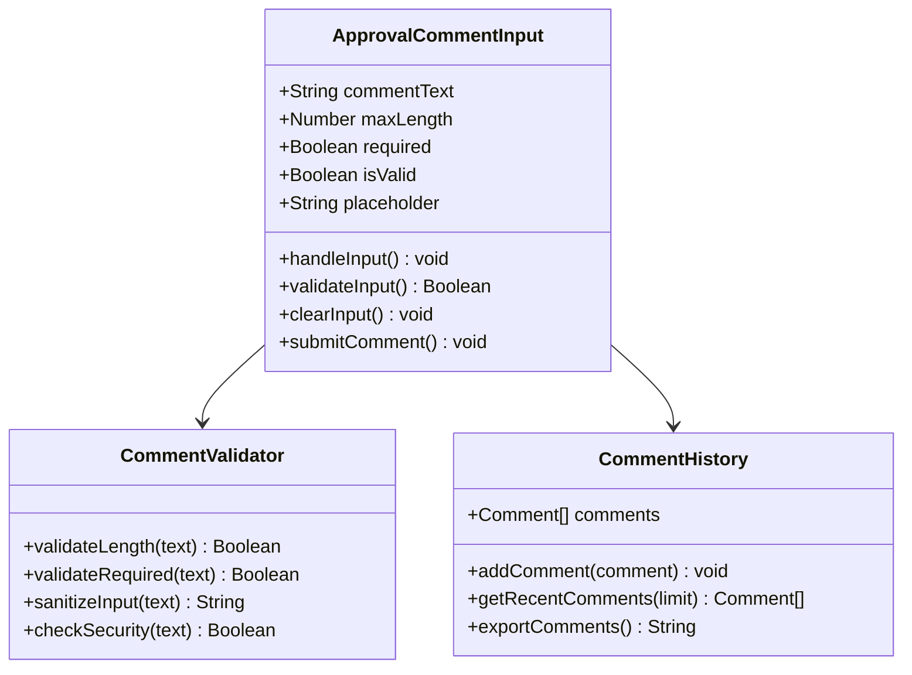

**图表来源**
- [shared-safety-constraints.md:222-230](file://docs/prompts/shared-safety-constraints.md#L222-L230)

#### 字数限制和验证

系统实现了多层次的输入验证机制：

| 类型 | 最大长度 | 验证规则 | 安全措施 |
|------|---------|----------|----------|
| 用户问题 | 10000 字符 | 长度检查、字符过滤 | XSS防护、SQL注入防护 |
| 命令参数 | 1000 字符 | 参数化查询 | 输入白名单验证 |
| 文件路径 | 500 字符 | 路径规范化 | 相对路径限制 |
| 主机名 | 100 字符 | DNS格式验证 | 特殊字符过滤 |

**章节来源**
- [shared-safety-constraints.md:201-230](file://docs/prompts/shared-safety-constraints.md#L201-L230)

### 审批历史记录展示

审批历史记录展示了完整的审批轨迹，包括所有审批人的操作记录和状态变更历史。

#### 历史记录数据模型

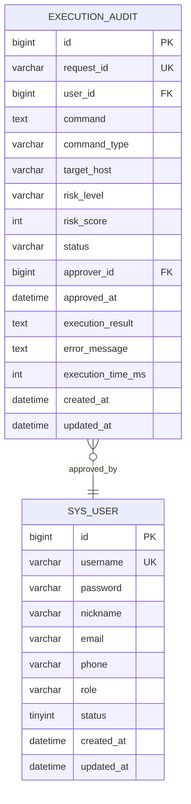

**图表来源**
- [init.sql:115-138](file://sql/init.sql#L115-L138)

#### 历史记录查询功能

历史记录查询支持多种筛选条件和排序方式：

- 时间范围筛选
- 审批状态筛选
- 风险等级筛选
- 审批人筛选
- 命令类型筛选

**章节来源**
- [init.sql:134-137](file://sql/init.sql#L134-L137)

### 审批通知机制

审批通知机制通过多种渠道确保相关人员能够及时收到审批状态变更的通知。

#### 通知渠道设计

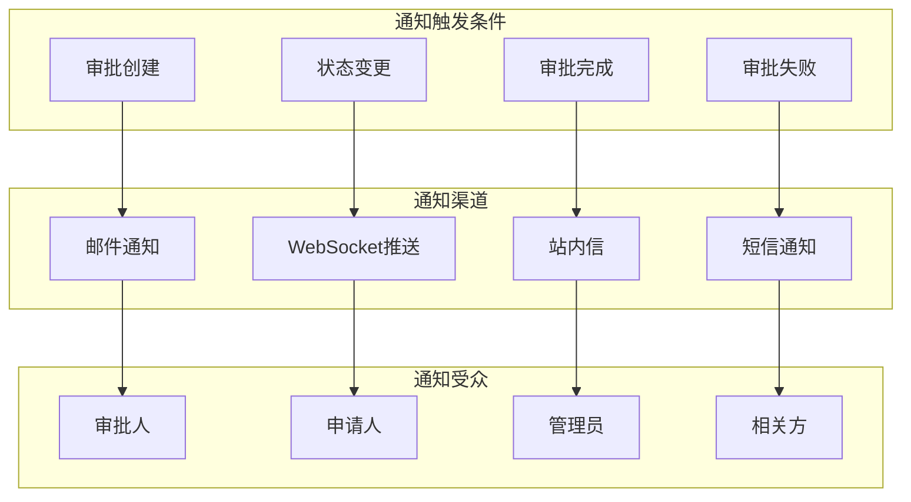

**图表来源**
- [PROJECT_CONTEXT.md:131](file://PROJECT_CONTEXT.md#L131)

#### 通知内容模板

系统支持动态通知内容模板，根据不同状态和角色生成个性化的通知内容。

**章节来源**
- [PROJECT_CONTEXT.md:131](file://PROJECT_CONTEXT.md#L131)

## 依赖关系分析

审批流程界面与其他系统组件存在密切的依赖关系：

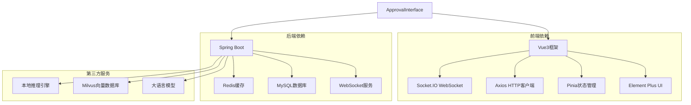

**图表来源**
- [PROJECT_CONTEXT.md:27-39](file://PROJECT_CONTEXT.md#L27-L39)

**章节来源**
- [PROJECT_CONTEXT.md:27-39](file://PROJECT_CONTEXT.md#L27-L39)

## 性能考虑

### 实时通信优化

系统采用 WebSocket 实现实时状态更新，减少轮询开销：

- 心跳检测机制
- 断线重连策略
- 消息队列缓冲
- 连接池管理

### 数据加载优化

- 分页加载历史记录
- 懒加载审批卡片
- 缓存常用数据
- 预加载相关资源

### 响应式设计

- 移动端适配
- 动画性能优化
- DOM操作最小化
- 事件委托机制

## 故障排除指南

### 常见问题及解决方案

#### 审批状态不更新

**症状**: 审批状态变更后界面没有反映

**排查步骤**:
1. 检查 WebSocket 连接状态
2. 验证后端服务运行状态
3. 查看浏览器控制台错误
4. 确认网络连接正常

**解决方案**:
- 重启 WebSocket 服务
- 清除浏览器缓存
- 检查防火墙设置
- 验证服务器负载

#### 审批按钮无响应

**症状**: 点击审批按钮没有任何反应

**排查步骤**:
1. 检查用户权限
2. 验证审批状态
3. 查看控制台错误
4. 确认网络连接

**解决方案**:
- 更新用户权限
- 重新加载页面
- 检查 JavaScript 错误
- 验证 API 可用性

#### 通知未送达

**症状**: 审批状态变更后未收到通知

**排查步骤**:
1. 检查通知配置
2. 验证用户联系方式
3. 查看通知日志
4. 测试不同通知渠道

**解决方案**:
- 更新通知配置
- 验证邮箱设置
- 检查短信网关
- 测试通知服务

**章节来源**
- [shared-safety-constraints.md:262-292](file://docs/prompts/shared-safety-constraints.md#L262-L292)

## 结论

审批流程界面作为智能运维系统的重要组成部分，通过精心设计的架构和完善的功能实现，为用户提供了安全、可靠、高效的审批体验。系统不仅满足了基本的审批需求，还通过实时通信、多渠道通知、严格的权限控制等特性，确保了审批流程的安全性和可控性。

随着系统的不断完善和优化，审批流程界面将继续提升用户体验，为企业级运维管理提供强有力的技术支撑。