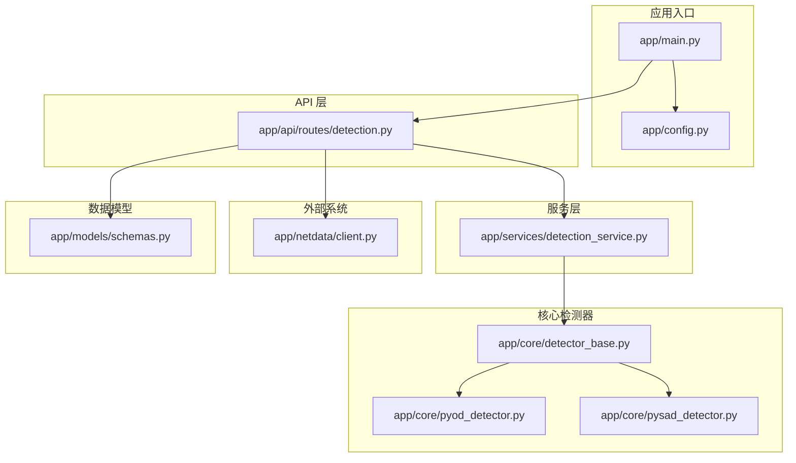
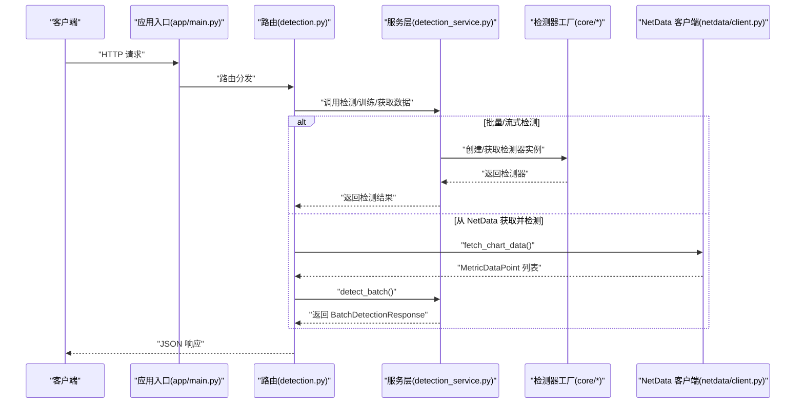
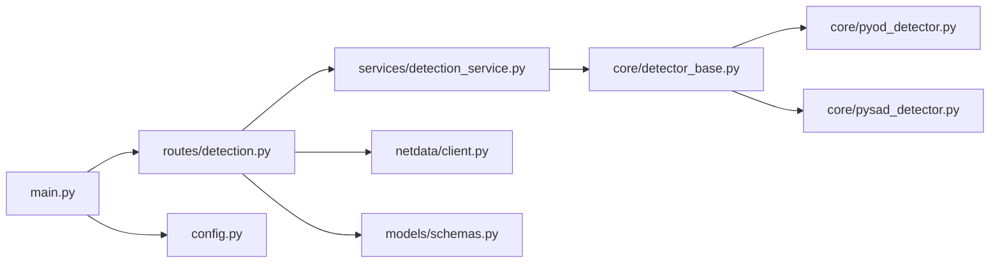
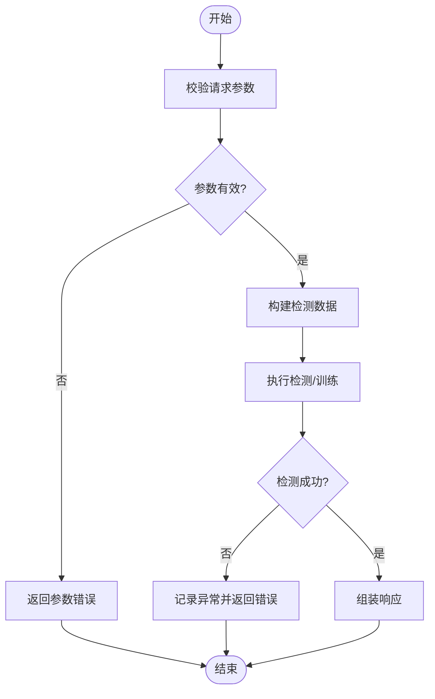

# 工单管理功能

<cite>
**本文引用的文件**
- [app/main.py](file://anomaly-detection-service/app/main.py)
- [app/config.py](file://anomaly-detection-service/app/config.py)
- [app/models/schemas.py](file://anomaly-detection-service/app/models/schemas.py)
- [app/api/routes/detection.py](file://anomaly-detection-service/app/api/routes/detection.py)
- [app/services/detection_service.py](file://anomaly-detection-service/app/services/detection_service.py)
- [app/netdata/client.py](file://anomaly-detection-service/app/netdata/client.py)
- [app/core/detector_base.py](file://anomaly-detection-service/app/core/detector_base.py)
- [app/core/pyod_detector.py](file://anomaly-detection-service/app/core/pyod_detector.py)
- [app/core/pysad_detector.py](file://anomaly-detection-service/app/core/pysad_detector.py)
</cite>

## 目录
1. [简介](#简介)
2. [项目结构](#项目结构)
3. [核心组件](#核心组件)
4. [架构总览](#架构总览)
5. [详细组件分析](#详细组件分析)
6. [依赖关系分析](#依赖关系分析)
7. [性能考虑](#性能考虑)
8. [故障排查指南](#故障排查指南)
9. [结论](#结论)
10. [附录](#附录)

## 简介
本文件围绕“工单管理功能”的实现进行系统化技术文档整理，结合现有代码库中的异常检测服务，给出工单管理在数据表格、分页与排序、筛选与搜索、状态管理、创建与编辑、权限与角色、后端 API 交互与错误处理、以及用户体验与性能优化等方面的实践建议与实现蓝图。由于仓库中未发现直接的“工单管理”业务模块，本文以现有异常检测服务为基础，提供可复用的工程化能力与最佳实践，便于在实际项目中扩展为完整的工单管理系统。

## 项目结构
该服务采用典型的分层架构：入口应用负责路由注册与中间件配置；API 层定义对外接口；服务层封装业务逻辑；核心层提供检测器抽象与具体实现；模型层定义数据结构与校验；配置层集中管理参数；NetData 客户端提供外部系统集成。

**图示来源**
- [app/main.py:1-217](file://anomaly-detection-service/app/main.py#L1-L217)
- [app/config.py:1-183](file://anomaly-detection-service/app/config.py#L1-L183)
- [app/models/schemas.py:1-329](file://anomaly-detection-service/app/models/schemas.py#L1-L329)
- [app/api/routes/detection.py:1-378](file://anomaly-detection-service/app/api/routes/detection.py#L1-L378)
- [app/services/detection_service.py:1-334](file://anomaly-detection-service/app/services/detection_service.py#L1-L334)
- [app/netdata/client.py:1-301](file://anomaly-detection-service/app/netdata/client.py#L1-L301)
- [app/core/detector_base.py:1-339](file://anomaly-detection-service/app/core/detector_base.py#L1-L339)
- [app/core/pyod_detector.py:1-287](file://anomaly-detection-service/app/core/pyod_detector.py#L1-L287)
- [app/core/pysad_detector.py:1-358](file://anomaly-detection-service/app/core/pysad_detector.py#L1-L358)

**章节来源**
- [app/main.py:1-217](file://anomaly-detection-service/app/main.py#L1-L217)
- [app/config.py:1-183](file://anomaly-detection-service/app/config.py#L1-L183)

## 核心组件
- 应用入口与中间件：负责生命周期管理、CORS、请求日志与全局异常处理，并注册路由。
- 配置中心：集中管理数据库、缓存、检测阈值、性能参数等配置项。
- 数据模型：定义请求/响应模型、枚举类型（检测器类型、异常等级、检测状态），并内置字段级校验。
- API 路由：提供批量检测、流式检测、训练检测器、从 NetData 获取并检测等接口。
- 服务层：协调检测器实例、提供统一的检测接口、模型持久化与统计信息。
- 检测器核心：抽象基类定义统一接口与工具方法；离线/在线检测器实现；工厂模式创建检测器。
- NetData 客户端：异步 HTTP 客户端，封装 NetData API 的数据获取与图表查询。

**章节来源**
- [app/main.py:1-217](file://anomaly-detection-service/app/main.py#L1-L217)
- [app/config.py:1-183](file://anomaly-detection-service/app/config.py#L1-L183)
- [app/models/schemas.py:1-329](file://anomaly-detection-service/app/models/schemas.py#L1-L329)
- [app/api/routes/detection.py:1-378](file://anomaly-detection-service/app/api/routes/detection.py#L1-L378)
- [app/services/detection_service.py:1-334](file://anomaly-detection-service/app/services/detection_service.py#L1-L334)
- [app/core/detector_base.py:1-339](file://anomaly-detection-service/app/core/detector_base.py#L1-L339)
- [app/core/pyod_detector.py:1-287](file://anomaly-detection-service/app/core/pyod_detector.py#L1-L287)
- [app/core/pysad_detector.py:1-358](file://anomaly-detection-service/app/core/pysad_detector.py#L1-L358)
- [app/netdata/client.py:1-301](file://anomaly-detection-service/app/netdata/client.py#L1-L301)

## 架构总览
下图展示了从客户端到后端 API、服务层与检测器实现的整体交互流程，以及与外部 NetData 系统的集成。

**图示来源**
- [app/main.py:1-217](file://anomaly-detection-service/app/main.py#L1-L217)
- [app/api/routes/detection.py:1-378](file://anomaly-detection-service/app/api/routes/detection.py#L1-L378)
- [app/services/detection_service.py:1-334](file://anomaly-detection-service/app/services/detection_service.py#L1-L334)
- [app/netdata/client.py:1-301](file://anomaly-detection-service/app/netdata/client.py#L1-L301)
- [app/core/detector_base.py:1-339](file://anomaly-detection-service/app/core/detector_base.py#L1-L339)
- [app/core/pyod_detector.py:1-287](file://anomaly-detection-service/app/core/pyod_detector.py#L1-L287)
- [app/core/pysad_detector.py:1-358](file://anomaly-detection-service/app/core/pysad_detector.py#L1-L358)

## 详细组件分析

### 数据表格、分页与排序（实现蓝图）
- 数据表格组件
  - 建议以“列表 + 表格”形式展示工单数据，列包括：编号、标题、状态、优先级、创建人、负责人、创建时间、更新时间等。
  - 使用后端分页参数（页码、每页条数）与排序参数（字段、方向）驱动数据拉取。
- 分页机制
  - 接口约定：page/page_size 或 cursor 方式；返回 total、items、has_more 等元信息。
  - 前端按需加载，避免一次性渲染大量数据。
- 排序功能
  - 支持多字段排序（如按创建时间降序、状态升序）；后端按字段白名单与默认排序策略处理。
- 参考现有实现
  - API 层已具备统一的响应模型与异常处理，可直接复用为工单列表的响应结构。

**章节来源**
- [app/models/schemas.py:1-329](file://anomaly-detection-service/app/models/schemas.py#L1-L329)
- [app/api/routes/detection.py:1-378](file://anomaly-detection-service/app/api/routes/detection.py#L1-L378)

### 工单筛选与搜索（实现蓝图）
- 多条件筛选
  - 支持状态、优先级、创建人、负责人、时间范围等维度；后端以过滤器组合与 SQL/ORM 查询实现。
- 模糊搜索
  - 标题/描述关键词模糊匹配；建议使用全文检索或 LIKE + 索引优化。
- 高级搜索选项
  - 复合条件组合（AND/OR）、区间查询（金额、时间）、自定义字段等。
- 参考现有实现
  - API 层已内置请求模型与字段校验，可扩展为工单查询模型。

**章节来源**
- [app/models/schemas.py:1-329](file://anomaly-detection-service/app/models/schemas.py#L1-L329)
- [app/api/routes/detection.py:1-378](file://anomaly-detection-service/app/api/routes/detection.py#L1-L378)

### 工单状态管理（实现蓝图）
- 状态枚举定义
  - 建议定义：新建、处理中、已解决、已关闭、已撤销等；每个状态具备明确语义与约束。
- 状态转换规则
  - 严格的状态机：仅允许合法的前序状态与目标状态之间的转换；例如“新建”只能转“处理中”，“已解决”只能转“已关闭”。
- 状态更新逻辑
  - 事务性更新与审计日志；并发场景下使用乐观锁或分布式锁保证一致性。
- 参考现有实现
  - 检测状态枚举与异常等级枚举可作为状态管理的建模范本。

**章节来源**
- [app/models/schemas.py:44-58](file://anomaly-detection-service/app/models/schemas.py#L44-L58)

### 工单创建与编辑（实现蓝图）
- 表单验证
  - 必填字段、长度、格式校验；与 Pydantic 模型一致的校验风格。
- 数据绑定
  - 前端表单与后端模型双向绑定；后端统一序列化/反序列化。
- 提交处理
  - 创建：写入数据库并记录初始状态；编辑：校验变更合法性并落库。
- 参考现有实现
  - 请求/响应模型与字段校验可直接迁移为工单创建/编辑模型。

**章节来源**
- [app/models/schemas.py:95-183](file://anomaly-detection-service/app/models/schemas.py#L95-L183)

### 权限控制与角色管理（实现蓝图）
- 角色与权限
  - 定义角色：访客、普通用户、运维人员、管理员；为每个操作定义最小权限集。
- 鉴权与授权
  - JWT/会话鉴权；资源级授权（仅可见/可操作自己的工单）；RBAC 策略。
- 操作审计
  - 记录关键操作（创建、编辑、状态变更）与操作者、时间、原因。
- 参考现有实现
  - 可在应用入口中间件中集成鉴权与授权逻辑。

**章节来源**
- [app/main.py:107-140](file://anomaly-detection-service/app/main.py#L107-L140)

### 后端 API 数据交互与错误处理（实现蓝图）
- 数据交互模式
  - RESTful 接口：GET/POST/PUT/DELETE；统一响应体结构；分页/排序/筛选参数规范。
- 错误处理机制
  - 全局异常处理器捕获未处理异常；参数错误单独处理；返回标准化错误结构。
- 参考现有实现
  - 应用入口已提供全局异常处理与中间件日志；API 路由层对异常进行包装。

**章节来源**
- [app/main.py:145-172](file://anomaly-detection-service/app/main.py#L145-L172)
- [app/api/routes/detection.py:147-152](file://anomaly-detection-service/app/api/routes/detection.py#L147-L152)

### 用户体验与性能优化（实现蓝图）
- 用户体验
  - 列表懒加载、骨架屏、空状态提示；搜索联想与防抖；批量操作与进度反馈。
- 性能优化
  - 后端：分页与索引、缓存热点数据、异步任务；前端：虚拟滚动、图片懒加载、CDN。
- 参考现有实现
  - 配置中心提供缓存 TTL、批量上限等参数，可迁移为工单列表性能参数。

**章节来源**
- [app/config.py:142-146](file://anomaly-detection-service/app/config.py#L142-L146)

## 依赖关系分析
- 组件耦合
  - API 路由依赖服务层；服务层依赖检测器工厂与配置；NetData 客户端独立于业务逻辑。
- 外部依赖
  - PyOD 与 PySAD 提供离线/在线检测能力；httpx 提供异步 HTTP 客户端；loguru 提供日志。
- 潜在循环依赖
  - 当前结构清晰，无明显循环导入风险。

**图示来源**
- [app/api/routes/detection.py:1-378](file://anomaly-detection-service/app/api/routes/detection.py#L1-L378)
- [app/services/detection_service.py:1-334](file://anomaly-detection-service/app/services/detection_service.py#L1-L334)
- [app/core/detector_base.py:1-339](file://anomaly-detection-service/app/core/detector_base.py#L1-L339)
- [app/core/pyod_detector.py:1-287](file://anomaly-detection-service/app/core/pyod_detector.py#L1-L287)
- [app/core/pysad_detector.py:1-358](file://anomaly-detection-service/app/core/pysad_detector.py#L1-L358)
- [app/netdata/client.py:1-301](file://anomaly-detection-service/app/netdata/client.py#L1-L301)
- [app/models/schemas.py:1-329](file://anomaly-detection-service/app/models/schemas.py#L1-L329)
- [app/main.py:1-217](file://anomaly-detection-service/app/main.py#L1-L217)
- [app/config.py:1-183](file://anomaly-detection-service/app/config.py#L1-L183)

**章节来源**
- [app/api/routes/detection.py:1-378](file://anomaly-detection-service/app/api/routes/detection.py#L1-L378)
- [app/services/detection_service.py:1-334](file://anomaly-detection-service/app/services/detection_service.py#L1-L334)
- [app/core/detector_base.py:1-339](file://anomaly-detection-service/app/core/detector_base.py#L1-L339)
- [app/core/pyod_detector.py:1-287](file://anomaly-detection-service/app/core/pyod_detector.py#L1-L287)
- [app/core/pysad_detector.py:1-358](file://anomaly-detection-service/app/core/pysad_detector.py#L1-L358)
- [app/netdata/client.py:1-301](file://anomaly-detection-service/app/netdata/client.py#L1-L301)
- [app/models/schemas.py:1-329](file://anomaly-detection-service/app/models/schemas.py#L1-L329)
- [app/main.py:1-217](file://anomaly-detection-service/app/main.py#L1-L217)
- [app/config.py:1-183](file://anomaly-detection-service/app/config.py#L1-L183)

## 性能考虑
- 检测性能参数
  - 批量检测最大数量、在线窗口大小、阈值与告警阈值等可通过配置中心统一管理。
- 缓存与异步
  - 利用缓存减少重复计算；对长耗时任务采用异步队列与轮询。
- 监控与可观测性
  - 记录处理耗时、成功率、错误分布；结合日志与指标进行性能分析。

**章节来源**
- [app/config.py:114-146](file://anomaly-detection-service/app/config.py#L114-L146)
- [app/services/detection_service.py:110-118](file://anomaly-detection-service/app/services/detection_service.py#L110-L118)

## 故障排查指南
- 全局异常处理
  - 应用入口提供通用异常与参数错误处理，确保错误信息结构化返回。
- API 层异常包装
  - 路由层对业务异常进行包装，返回标准 HTTP 状态码与错误体。
- 日志与追踪
  - 请求中间件记录请求/响应与耗时；服务层记录关键操作与耗时。

**章节来源**
- [app/main.py:145-172](file://anomaly-detection-service/app/main.py#L145-L172)
- [app/api/routes/detection.py:147-152](file://anomaly-detection-service/app/api/routes/detection.py#L147-L152)
- [app/main.py:119-139](file://anomaly-detection-service/app/main.py#L119-L139)

## 结论
本文件基于现有异常检测服务的工程化实践，为“工单管理功能”提供了可落地的实现蓝图：从数据表格与分页排序、筛选与搜索、状态管理、创建与编辑、权限控制与角色管理，到后端 API 交互与错误处理、用户体验与性能优化。建议在现有模型与路由基础上扩展工单专用模型与接口，复用服务层与配置中心能力，快速搭建稳定高效的工单管理子系统。

## 附录
- 关键流程图（以现有服务为例）

**图示来源**
- [app/api/routes/detection.py:62-152](file://anomaly-detection-service/app/api/routes/detection.py#L62-L152)
- [app/services/detection_service.py:76-118](file://anomaly-detection-service/app/services/detection_service.py#L76-L118)