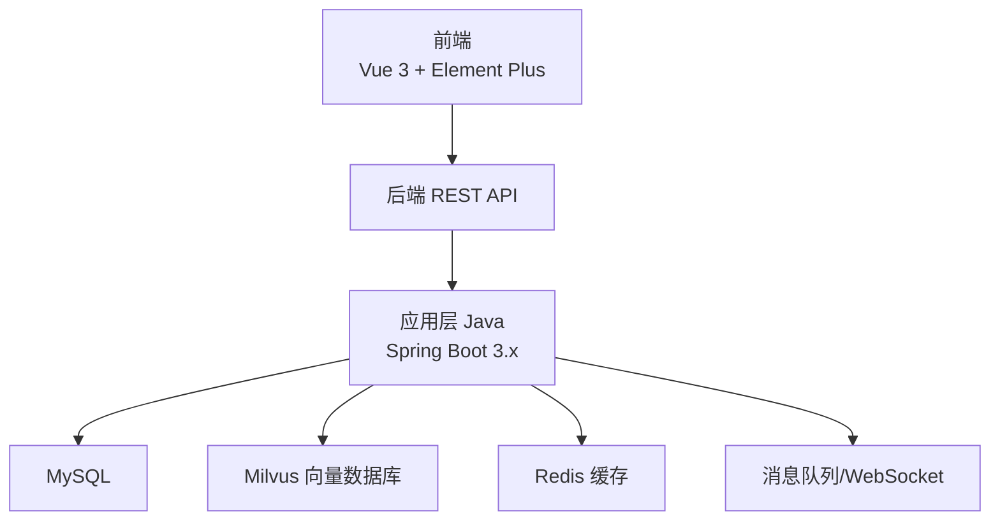
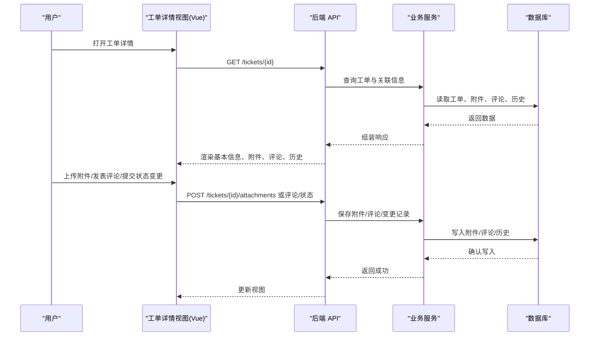
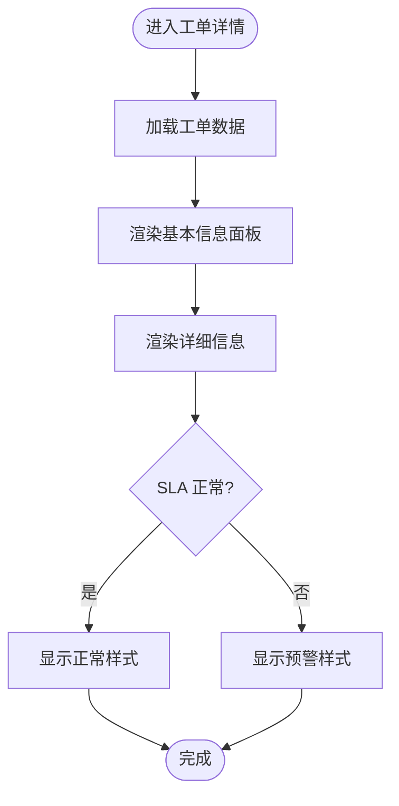
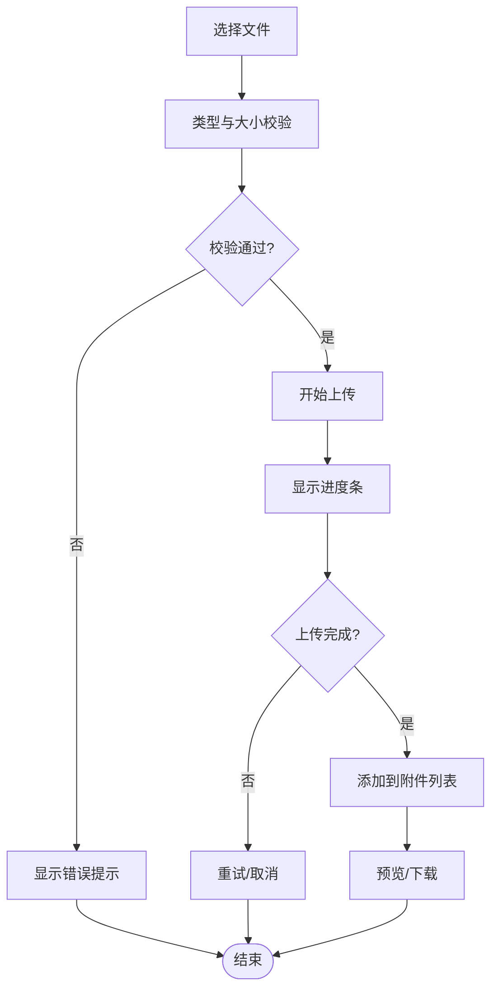
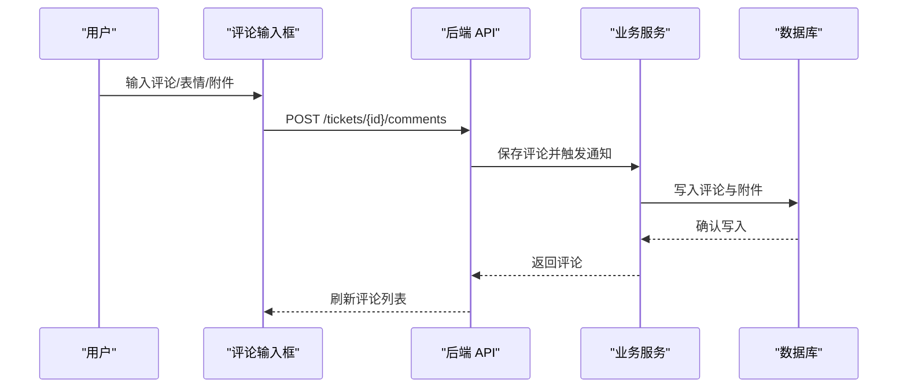
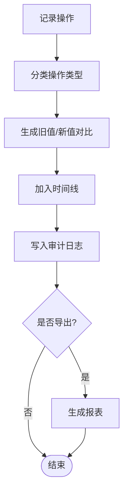
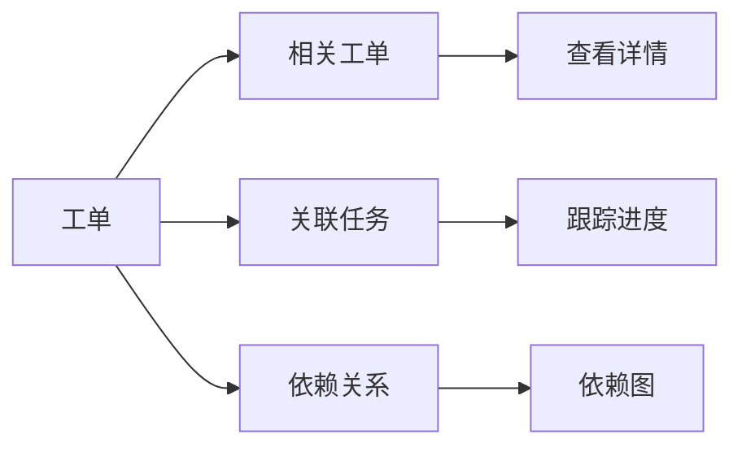
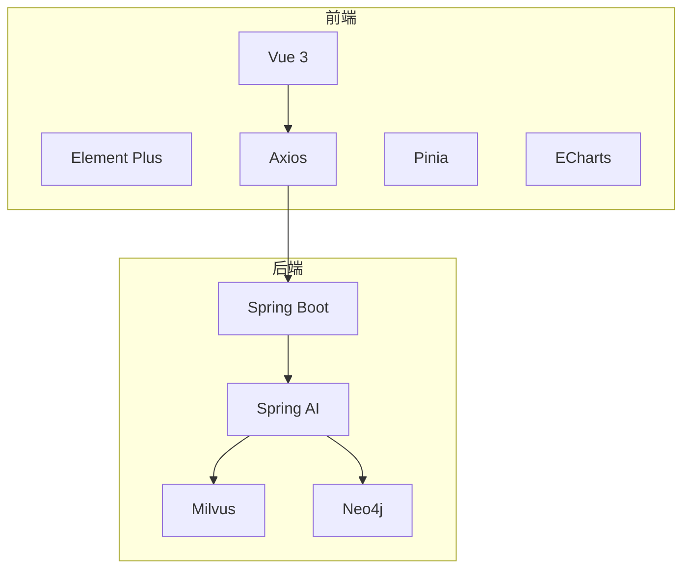

# 工单详情页面

<cite>
**本文引用的文件**
- [PROJECT_CONTEXT.md](file://PROJECT_CONTEXT.md)
- [开题报告_精简版.md](file://开题报告_精简版.md)
- [2026-03-31.md](file://.workbuddy/memory/2026-03-31.md)
</cite>

## 目录
1. [简介](#简介)
2. [项目结构](#项目结构)
3. [核心组件](#核心组件)
4. [架构总览](#架构总览)
5. [详细组件分析](#详细组件分析)
6. [依赖分析](#依赖分析)
7. [性能考虑](#性能考虑)
8. [故障排查指南](#故障排查指南)
9. [结论](#结论)
10. [附录](#附录)

## 简介
本文件围绕“工单详情页面”的功能需求，结合仓库中的项目上下文与开题报告，给出面向前端实现的系统化文档。内容涵盖：
- 工单信息展示：基本信息面板、详细信息展示与数据格式化
- 附件上传：文件选择、上传进度、类型与大小限制
- 评论功能：评论列表、输入框、表情支持与回复
- 操作历史：时间线、操作人与详情
- 关联信息：相关工单、关联任务与依赖关系
- 状态变更历史与审计
- 页面布局优化与移动端适配

说明：当前仓库未包含前端源码，本文以“系统定位”“技术栈”“架构”“模块设计”为基础，提供可落地的前端实现蓝图与交互规范。

## 项目结构
- 项目定位：基于 NetData 监控数据的智能运维问答与执行系统，前端采用 Vue 3 + Element Plus。
- 技术栈：前端 Vue 3 + Element Plus；后端 Spring Boot 3.x；AI 框架 Spring AI；向量数据库 Milvus；RAG 检索；容器编排 Docker Compose。
- 前端目录：netdata-ai-frontend/src/views/ 下包含 Chat、AlertDashboard、KnowledgeBase、ExecutionApproval 等视图，工单详情页面应归类于运维工单界面。

章节来源
- [PROJECT_CONTEXT.md: 25-40:25-40](file://PROJECT_CONTEXT.md#L25-L40)
- [PROJECT_CONTEXT.md: 120-149:120-149](file://PROJECT_CONTEXT.md#L120-L149)
- [开题报告_精简版.md: 118-152:118-152](file://开题报告_精简版.md#L118-L152)

## 核心组件
- 工单基本信息面板：展示工单编号、标题、优先级、状态、创建人、负责人、创建时间、截止时间、SLA 状态等。
- 详细信息展示：描述、影响范围、受影响系统、根因分析摘要、建议措施、执行结果摘要等。
- 附件区域：文件列表、上传入口、进度条、删除按钮、预览与下载链接。
- 评论区：评论列表、输入框、表情选择、回复与楼层结构、@提及。
- 操作历史：时间线视图，记录状态变更、评论、附件上传、负责人变更、处理动作等。
- 关联信息：相关工单、关联任务、依赖关系（上游/下游）。
- 状态变更与审计：记录每次变更的时间、操作人、旧值/新值、备注与审计日志导出。

章节来源
- [PROJECT_CONTEXT.md: 16-22:16-22](file://PROJECT_CONTEXT.md#L16-L22)
- [开题报告_精简版.md: 118-152:118-152](file://开题报告_精简版.md#L118-L152)

## 架构总览
工单详情页面属于前端视图层，通过 REST API 与后端交互，获取工单数据、附件、评论与历史记录，并支持上传附件、提交评论与状态变更操作。后端提供统一的 API，前端负责数据渲染与交互体验。

## 详细组件分析

### 1. 工单信息展示
- 基本信息面板
  - 字段：工单编号、标题、优先级、状态、创建人、负责人、创建时间、截止时间、SLA 状态、影响范围、受影响系统。
  - 展示形式：卡片式布局，字段分组，关键信息突出显示。
  - 数据格式化：时间字段本地化格式；优先级/状态使用颜色标识；负责人/创建人支持头像与点击跳转。
- 详细信息展示
  - 描述：富文本或 Markdown 渲染，支持链接与图片。
  - 影响范围/受影响系统：标签化展示，支持搜索过滤。
  - 根因分析摘要/建议措施：折叠展开，支持复制与导出。
  - 执行结果摘要：包含执行时间、执行人、结果状态与截图/日志链接。

章节来源
- [开题报告_精简版.md: 118-152:118-152](file://开题报告_精简版.md#L118-L152)

### 2. 附件上传功能
- 文件选择
  - 支持拖拽与点击选择，多文件批量选择。
  - 文件类型限制：通过白名单控制（如图片、PDF、压缩包等），后缀校验与 MIME 类型二次校验。
  - 大小控制：单文件大小上限与总大小上限，实时提示。
- 上传进度
  - 上传进度条（百分比/字节），支持暂停/取消。
  - 上传失败重试与错误提示（网络、权限、格式、大小）。
- 文件管理
  - 列表展示：名称、大小、上传时间、上传人、操作（预览、下载、删除）。
  - 删除权限：仅限创建人或管理员。
- 预览与下载
  - 图片在线预览，PDF 在线阅读器，其他类型提供下载链接。

章节来源
- [开题报告_精简版.md: 118-152:118-152](file://开题报告_精简版.md#L118-L152)

### 3. 评论功能
- 评论列表
  - 时间倒序展示，支持分页加载。
  - 楼层结构：支持回复与 @ 提及，缩进与分割线。
  - 操作：点赞、回复、编辑、删除（仅本人或管理员）。
- 评论输入框
  - 支持 Markdown/富文本，实时预览。
  - 表情面板：快捷插入表情，支持搜索与收藏。
  - 附件：支持在评论中附加图片/文件。
- 通知与提醒
  - @ 提及自动通知被提及人。
  - 评论状态变更（如置顶、删除）同步通知相关人。

章节来源
- [开题报告_精简版.md: 118-152:118-152](file://开题报告_精简版.md#L118-L152)

### 4. 操作历史记录与审计
- 历史记录
  - 时间线视图：按时间倒序，区分状态变更、评论、附件、处理动作等类型。
  - 操作详情：旧值/新值对比（富文本差异或表格对比）。
  - 操作人：显示用户名与头像，支持跳转至个人主页。
- 审计功能
  - 记录字段：操作类型、时间、操作人、对象、旧值、新值、备注。
  - 导出：支持导出为 CSV/PDF，按时间范围筛选。
  - 权限：仅管理员可查看与导出审计日志。

章节来源
- [开题报告_精简版.md: 118-152:118-152](file://开题报告_精简版.md#L118-L152)

### 5. 关联信息展示
- 相关工单：基于关键字/标签/根因相似度推荐，支持跳转与对比。
- 关联任务：与工单绑定的任务清单，支持状态与进度跟踪。
- 依赖关系：上游/下游工单/任务，使用关系图或列表展示，支持展开查看详细依赖链。

章节来源
- [开题报告_精简版.md: 118-152:118-152](file://开题报告_精简版.md#L118-L152)

### 6. 状态变更历史与审计
- 状态变更历史
  - 展示每次状态切换的时间、操作人、原因、备注。
  - 对比变更前后字段，支持差异高亮。
- 审计日志
  - 记录所有关键字段变更与系统动作，支持全文检索与筛选。
  - 与操作历史联动，便于回溯。

章节来源
- [开题报告_精简版.md: 118-152:118-152](file://开题报告_精简版.md#L118-L152)

### 7. 页面布局优化与移动端适配
- 布局优化
  - 信息密度：重要信息优先，次要信息折叠。
  - 响应式网格：在中等屏幕自动换列，小屏单列堆叠。
  - 滚动与锚点：时间线滚动与锚点跳转，提升长列表可读性。
- 移动端适配
  - 触摸友好：按钮与输入框尺寸增大，间距充足。
  - 快捷操作：底部工具栏聚合常用操作（评论、附件、状态变更）。
  - 离线提示：弱网状态下的提示与重试机制。

章节来源
- [开题报告_精简版.md: 118-152:118-152](file://开题报告_精简版.md#L118-L152)

## 依赖分析
- 前端依赖
  - Vue 3 + Element Plus：组件库与主题样式。
  - Axios：HTTP 请求封装，拦截器处理鉴权与错误。
  - Pinia：状态管理，集中管理工单、附件、评论、历史等状态。
  - ECharts：监控数据可视化（若页面包含图表）。
- 后端依赖
  - Spring Boot：REST API 与 WebSocket。
  - Spring AI：与 LLM 集成（若涉及智能建议）。
  - Milvus/Neo4j：RAG 与知识图谱（若涉及根因分析与知识检索）。
- 通信
  - REST API：GET/POST/PUT/DELETE，分页与分段加载。
  - WebSocket：实时通知与增量更新。

章节来源
- [PROJECT_CONTEXT.md: 25-40:25-40](file://PROJECT_CONTEXT.md#L25-L40)
- [开题报告_精简版.md: 118-152:118-152](file://开题报告_精简版.md#L118-L152)

## 性能考虑
- 数据懒加载：附件、评论、历史采用分页或虚拟滚动，减少首屏压力。
- 缓存策略：Pinia 缓存工单基础数据，附件与评论按需刷新。
- 上传优化：断点续传、并发限制、进度合并上报。
- 渲染优化：Element Plus 组件按需引入，避免全局样式污染。
- 网络优化：请求去抖、重试退避、离线缓存与同步。

## 故障排查指南
- 附件上传失败
  - 检查类型与大小限制是否匹配。
  - 查看网络状态与后端日志，确认权限与存储。
- 评论无法显示
  - 确认分页参数与权限。
  - 检查富文本渲染与 Markdown 解析。
- 操作历史缺失
  - 核对审计日志开关与权限。
  - 检查时间线数据源与字段映射。
- 移动端显示异常
  - 检查媒体查询与触摸事件。
  - 确认字体与图标在小屏下的可读性。

## 结论
工单详情页面应以“信息清晰、操作直观、可审计、可扩展”为目标，结合 Vue 3 + Element Plus 的组件体系与后端 API，实现从信息展示到操作闭环的完整体验。通过合理的数据格式化、附件与评论管理、历史与审计记录，以及移动端适配，可显著提升运维工单的处理效率与透明度。

## 附录
- 术语
  - 工单：运维事件的最小处理单元。
  - 根因分析：定位故障本质原因的过程与结果。
  - 审计：对系统操作的记录与追溯。
- 参考
  - 项目上下文与技术栈：见 PROJECT_CONTEXT.md
  - 系统架构与模块设计：见 开题报告_精简版.md