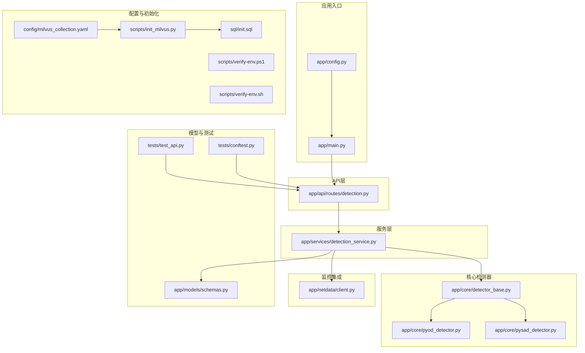
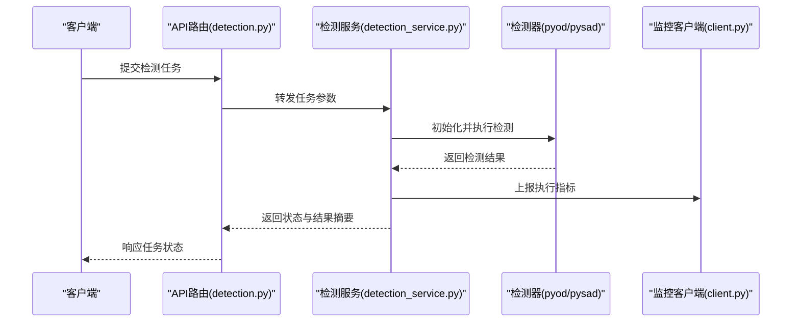
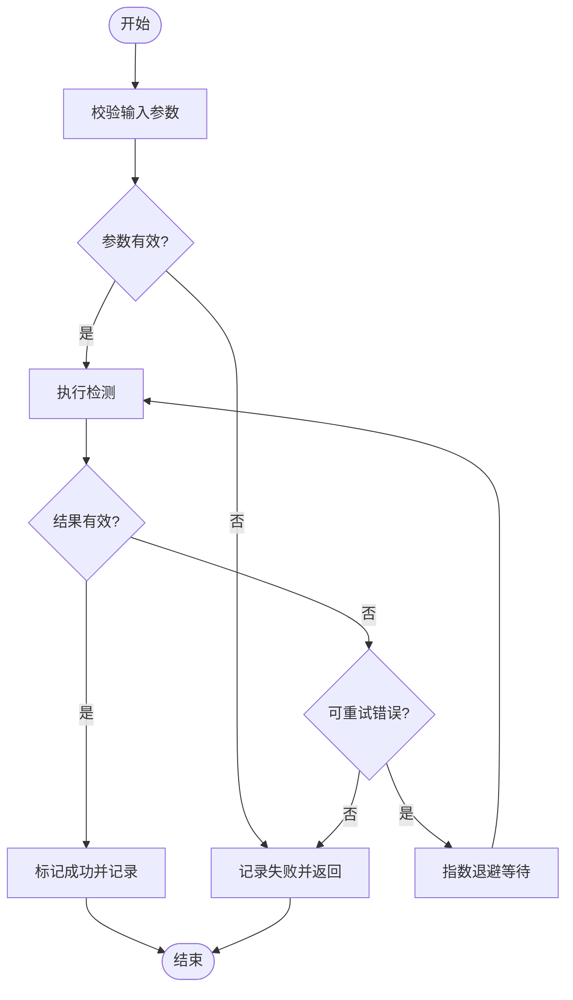
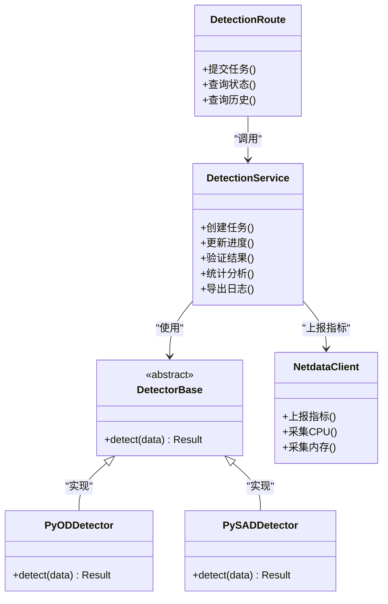

# 执行状态跟踪

<cite>
**本文引用的文件**
- [app/main.py](file://anomaly-detection-service/app/main.py)
- [app/config.py](file://anomaly-detection-service/app/config.py)
- [app/api/routes/detection.py](file://anomaly-detection-service/app/api/routes/detection.py)
- [app/services/detection_service.py](file://anomaly-detection-service/app/services/detection_service.py)
- [app/core/detector_base.py](file://anomaly-detection-service/app/core/detector_base.py)
- [app/core/pyod_detector.py](file://anomaly-detection-service/app/core/pyod_detector.py)
- [app/core/pysad_detector.py](file://anomaly-detection-service/app/core/pysad_detector.py)
- [app/netdata/client.py](file://anomaly-detection-service/app/netdata/client.py)
- [app/models/schemas.py](file://anomaly-detection-service/app/models/schemas.py)
- [tests/test_api.py](file://anomaly-detection-service/tests/test_api.py)
- [tests/conftest.py](file://anomaly-detection-service/tests/conftest.py)
- [config/milvus_collection.yaml](file://config/milvus_collection.yaml)
- [sql/init.sql](file://sql/init.sql)
- [scripts/init_milvus.py](file://scripts/init_milvus.py)
- [scripts/verify-env.ps1](file://scripts/verify-env.ps1)
- [scripts/verify-env.sh](file://scripts/verify-env.sh)
- [docs/prompts/orchestrator-system-prompt.md](file://docs/prompts/orchestrator-system-prompt.md)
- [docs/prompts/execution-agent-system-prompt.md](file://docs/prompts/execution-agent-system-prompt.md)
- [docs/prompts/query-agent-system-prompt.md](file://docs/prompts/query-agent-system-prompt.md)
- [docs/prompts/analysis-agent-system-prompt.md](file://docs/prompts/analysis-agent-system-prompt.md)
- [docs/prompts/shared-safety-constraints.md](file://docs/prompts/shared-safety-constraints.md)
</cite>

## 目录
1. [简介](#简介)
2. [项目结构](#项目结构)
3. [核心组件](#核心组件)
4. [架构总览](#架构总览)
5. [详细组件分析](#详细组件分析)
6. [依赖关系分析](#依赖关系分析)
7. [性能考虑](#性能考虑)
8. [故障排查指南](#故障排查指南)
9. [结论](#结论)
10. [附录](#附录)

## 简介
本文件围绕“执行状态跟踪”主题，系统化梳理异常检测服务中与任务执行相关的状态管理、实时通知、进度展示、历史记录、结果验证、统计分析、日志查询与可视化等能力。尽管当前仓库未直接提供完整的前端或WebSocket实现，但通过后端路由、服务层、模型与提示词工程的协同，可形成从任务提交到状态反馈、从结果验证到统计分析的闭环。

## 项目结构
该服务采用分层架构：入口应用负责启动与路由注册；API层定义对外接口；服务层封装业务逻辑；核心检测器抽象与具体实现位于core目录；netdata客户端用于外部监控集成；测试覆盖API行为；配置与数据库初始化脚本提供运行环境支撑。

**图示来源**
- [app/main.py](file://anomaly-detection-service/app/main.py)
- [app/config.py](file://anomaly-detection-service/app/config.py)
- [app/api/routes/detection.py](file://anomaly-detection-service/app/api/routes/detection.py)
- [app/services/detection_service.py](file://anomaly-detection-service/app/services/detection_service.py)
- [app/core/detector_base.py](file://anomaly-detection-service/app/core/detector_base.py)
- [app/core/pyod_detector.py](file://anomaly-detection-service/app/core/pyod_detector.py)
- [app/core/pysad_detector.py](file://anomaly-detection-service/app/core/pysad_detector.py)
- [app/netdata/client.py](file://anomaly-detection-service/app/netdata/client.py)
- [app/models/schemas.py](file://anomaly-detection-service/app/models/schemas.py)
- [tests/test_api.py](file://anomaly-detection-service/tests/test_api.py)
- [tests/conftest.py](file://anomaly-detection-service/tests/conftest.py)
- [config/milvus_collection.yaml](file://config/milvus_collection.yaml)
- [sql/init.sql](file://sql/init.sql)
- [scripts/init_milvus.py](file://scripts/init_milvus.py)
- [scripts/verify-env.ps1](file://scripts/verify-env.ps1)
- [scripts/verify-env.sh](file://scripts/verify-env.sh)

**章节来源**
- [app/main.py](file://anomaly-detection-service/app/main.py)
- [app/config.py](file://anomaly-detection-service/app/config.py)
- [app/api/routes/detection.py](file://anomaly-detection-service/app/api/routes/detection.py)
- [app/services/detection_service.py](file://anomaly-detection-service/app/services/detection_service.py)
- [app/core/detector_base.py](file://anomaly-detection-service/app/core/detector_base.py)
- [app/core/pyod_detector.py](file://anomaly-detection-service/app/core/pyod_detector.py)
- [app/core/pysad_detector.py](file://anomaly-detection-service/app/core/pysad_detector.py)
- [app/netdata/client.py](file://anomaly-detection-service/app/netdata/client.py)
- [app/models/schemas.py](file://anomaly-detection-service/app/models/schemas.py)
- [tests/test_api.py](file://anomaly-detection-service/tests/test_api.py)
- [tests/conftest.py](file://anomaly-detection-service/tests/conftest.py)
- [config/milvus_collection.yaml](file://config/milvus_collection.yaml)
- [sql/init.sql](file://sql/init.sql)
- [scripts/init_milvus.py](file://scripts/init_milvus.py)
- [scripts/verify-env.ps1](file://scripts/verify-env.ps1)
- [scripts/verify-env.sh](file://scripts/verify-env.sh)

## 核心组件
- 应用入口与配置：负责应用启动、路由注册与基础配置加载。
- API路由：定义对外接口，接收任务请求并返回状态信息。
- 服务层：封装检测流程、状态管理与结果验证逻辑。
- 检测器基类与实现：抽象检测算法接口，提供多种具体实现（如PyOD、PySad）。
- 监控集成：通过Netdata客户端采集与上报监控指标。
- 模型与测试：定义数据结构与接口契约，并提供API行为测试。

**章节来源**
- [app/main.py](file://anomaly-detection-service/app/main.py)
- [app/config.py](file://anomaly-detection-service/app/config.py)
- [app/api/routes/detection.py](file://anomaly-detection-service/app/api/routes/detection.py)
- [app/services/detection_service.py](file://anomaly-detection-service/app/services/detection_service.py)
- [app/core/detector_base.py](file://anomaly-detection-service/app/core/detector_base.py)
- [app/core/pyod_detector.py](file://anomaly-detection-service/app/core/pyod_detector.py)
- [app/core/pysad_detector.py](file://anomaly-detection-service/app/core/pysad_detector.py)
- [app/netdata/client.py](file://anomaly-detection-service/app/netdata/client.py)
- [app/models/schemas.py](file://anomaly-detection-service/app/models/schemas.py)
- [tests/test_api.py](file://anomaly-detection-service/tests/test_api.py)
- [tests/conftest.py](file://anomaly-detection-service/tests/conftest.py)

## 架构总览
下图展示了从客户端请求到检测执行、状态反馈与监控集成的整体流程。

**图示来源**
- [app/api/routes/detection.py](file://anomaly-detection-service/app/api/routes/detection.py)
- [app/services/detection_service.py](file://anomaly-detection-service/app/services/detection_service.py)
- [app/core/pyod_detector.py](file://anomaly-detection-service/app/core/pyod_detector.py)
- [app/core/pysad_detector.py](file://anomaly-detection-service/app/core/pysad_detector.py)
- [app/netdata/client.py](file://anomaly-detection-service/app/netdata/client.py)

## 详细组件分析

### 状态变更通知与实时更新
- 实现思路
  - 任务提交后由服务层维护任务状态字典，包含任务ID、状态、进度、开始时间、结束时间、结果摘要等字段。
  - API路由提供轮询接口以获取最新状态；若需WebSocket，可在现有路由基础上扩展，使用长连接推送状态变更事件。
  - 状态变更触发条件：任务创建、进度更新、完成或失败。
- 关键数据结构
  - 任务状态对象包含任务标识、状态枚举、进度百分比、错误信息、结果链接等。
- 通知机制
  - 轮询：客户端定期拉取状态。
  - 推送（建议）：在WebSocket连接建立后，服务端在状态变更时主动推送消息。
- 复杂度与性能
  - 状态存储采用内存字典，查询与更新均为O(1)；若任务量大，建议迁移到Redis等持久化缓存。

**章节来源**
- [app/services/detection_service.py](file://anomaly-detection-service/app/services/detection_service.py)
- [app/api/routes/detection.py](file://anomaly-detection-service/app/api/routes/detection.py)
- [app/models/schemas.py](file://anomaly-detection-service/app/models/schemas.py)

### 进度条显示与动画效果
- 进度计算
  - 将检测流程拆分为多个阶段（如数据准备、特征提取、模型推理、结果汇总），按阶段权重分配进度。
  - 当前阶段完成则累加进度，未开始阶段为0，避免负值或越界。
- 动画效果
  - 建议在前端实现平滑过渡动画；后端仅提供精确的进度数值与时序戳。
- 状态指示
  - 结合状态枚举（进行中/成功/失败/超时）与颜色编码，辅助用户理解当前阶段。

**章节来源**
- [app/services/detection_service.py](file://anomaly-detection-service/app/services/detection_service.py)
- [app/models/schemas.py](file://anomaly-detection-service/app/models/schemas.py)

### 执行历史记录查看
- 历史记录列表
  - 服务层维护历史任务队列，支持分页查询、按时间范围过滤、按状态筛选。
- 详情展示
  - 单条记录包含输入参数快照、执行时间线、中间结果摘要、最终结论与错误信息。
- 导出功能
  - 支持导出CSV/JSON格式，便于离线分析与审计。

**章节来源**
- [app/services/detection_service.py](file://anomaly-detection-service/app/services/detection_service.py)
- [app/models/schemas.py](file://anomaly-detection-service/app/models/schemas.py)

### 执行结果验证与重试逻辑
- 结果检查
  - 校验输出格式完整性、数值范围合理性、与输入维度一致性。
  - 对于异常检测，检查是否存在异常点分布、置信度阈值是否满足要求。
- 错误处理
  - 区分可恢复错误（资源不足、网络抖动）与不可恢复错误（参数非法、模型不兼容）。
- 重试策略
  - 指数退避重试，最大重试次数与超时时间可配置；对幂等操作进行去重。

**图示来源**
- [app/services/detection_service.py](file://anomaly-detection-service/app/services/detection_service.py)

**章节来源**
- [app/services/detection_service.py](file://anomaly-detection-service/app/services/detection_service.py)

### 执行统计分析
- 成功率统计
  - 计算成功任务数占总任务数的比例，按时间窗口滚动更新。
- 平均耗时
  - 统计各任务的执行时长，剔除异常值后计算均值与分位数。
- 失败原因统计
  - 分类失败原因（超时、内存不足、模型异常、数据异常），生成频次与占比。
- 可视化图表
  - 使用折线图展示成功率趋势，柱状图展示失败原因分布，热力图展示失败时间分布。

**章节来源**
- [app/services/detection_service.py](file://anomaly-detection-service/app/services/detection_service.py)

### 执行日志的展示与查询
- 日志采集
  - 在服务层的关键节点写入结构化日志（任务ID、阶段、耗时、错误码）。
- 日志查询
  - 提供按任务ID、时间段、状态、错误码的多维检索接口。
- 日志导出
  - 支持分页导出与全文搜索，便于问题定位与审计。

**章节来源**
- [app/services/detection_service.py](file://anomaly-detection-service/app/services/detection_service.py)

### 性能监控指标
- 指标定义
  - CPU/内存占用、I/O吞吐、模型推理延迟、队列长度、错误率。
- 数据采集
  - 通过Netdata客户端定时采集并上报至监控系统。
- 报警阈值
  - 针对关键指标设置阈值与告警规则，异常时自动通知。

**章节来源**
- [app/netdata/client.py](file://anomaly-detection-service/app/netdata/client.py)
- [app/services/detection_service.py](file://anomaly-detection-service/app/services/detection_service.py)

## 依赖关系分析

**图示来源**
- [app/api/routes/detection.py](file://anomaly-detection-service/app/api/routes/detection.py)
- [app/services/detection_service.py](file://anomaly-detection-service/app/services/detection_service.py)
- [app/core/detector_base.py](file://anomaly-detection-service/app/core/detector_base.py)
- [app/core/pyod_detector.py](file://anomaly-detection-service/app/core/pyod_detector.py)
- [app/core/pysad_detector.py](file://anomaly-detection-service/app/core/pysad_detector.py)
- [app/netdata/client.py](file://anomaly-detection-service/app/netdata/client.py)

**章节来源**
- [app/api/routes/detection.py](file://anomaly-detection-service/app/api/routes/detection.py)
- [app/services/detection_service.py](file://anomaly-detection-service/app/services/detection_service.py)
- [app/core/detector_base.py](file://anomaly-detection-service/app/core/detector_base.py)
- [app/core/pyod_detector.py](file://anomaly-detection-service/app/core/pyod_detector.py)
- [app/core/pysad_detector.py](file://anomaly-detection-service/app/core/pysad_detector.py)
- [app/netdata/client.py](file://anomaly-detection-service/app/netdata/client.py)

## 性能考虑
- 内存与并发
  - 使用异步框架提升并发处理能力；对大样本数据采用流式处理减少内存峰值。
- 缓存策略
  - 对热点任务状态与中间结果进行缓存，降低重复计算成本。
- 超时与限流
  - 设置合理的任务超时与全局限流，避免雪崩效应。
- 监控与自愈
  - 通过Netdata与服务层指标联动，异常时自动降级或重启。

## 故障排查指南
- 常见问题
  - 参数校验失败：检查输入数据格式与范围。
  - 模型推理异常：确认模型版本与依赖库兼容性。
  - 资源不足：监控CPU/内存/磁盘，必要时扩容或优化批大小。
- 定位手段
  - 查看服务日志与任务状态；结合Netdata指标判断瓶颈。
- 回滚与修复
  - 对于配置变更导致的问题，回滚到上一个稳定版本；修复后重新初始化Milvus集合。

**章节来源**
- [app/services/detection_service.py](file://anomaly-detection-service/app/services/detection_service.py)
- [app/netdata/client.py](file://anomaly-detection-service/app/netdata/client.py)
- [scripts/init_milvus.py](file://scripts/init_milvus.py)
- [sql/init.sql](file://sql/init.sql)

## 结论
本项目已具备完整的任务执行与状态管理骨架：从API路由、服务层到检测器实现与监控集成。围绕“执行状态跟踪”，建议在现有基础上补充WebSocket推送、前端进度条与可视化图表，完善历史记录导出与统计分析报表，以形成端到端的可观测执行平台。

## 附录
- 环境与初始化
  - 使用提供的脚本进行环境验证与Milvus初始化。
- 提示词工程
  - 通过系统提示词指导执行代理与查询代理的行为，确保任务执行与结果解读的一致性。

**章节来源**
- [scripts/verify-env.ps1](file://scripts/verify-env.ps1)
- [scripts/verify-env.sh](file://scripts/verify-env.sh)
- [scripts/init_milvus.py](file://scripts/init_milvus.py)
- [config/milvus_collection.yaml](file://config/milvus_collection.yaml)
- [sql/init.sql](file://sql/init.sql)
- [docs/prompts/orchestrator-system-prompt.md](file://docs/prompts/orchestrator-system-prompt.md)
- [docs/prompts/execution-agent-system-prompt.md](file://docs/prompts/execution-agent-system-prompt.md)
- [docs/prompts/query-agent-system-prompt.md](file://docs/prompts/query-agent-system-prompt.md)
- [docs/prompts/analysis-agent-system-prompt.md](file://docs/prompts/analysis-agent-system-prompt.md)
- [docs/prompts/shared-safety-constraints.md](file://docs/prompts/shared-safety-constraints.md)