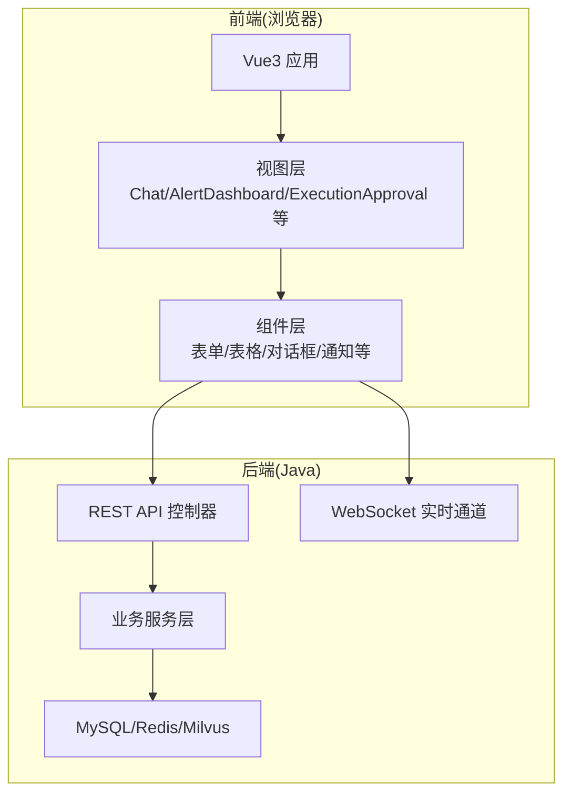
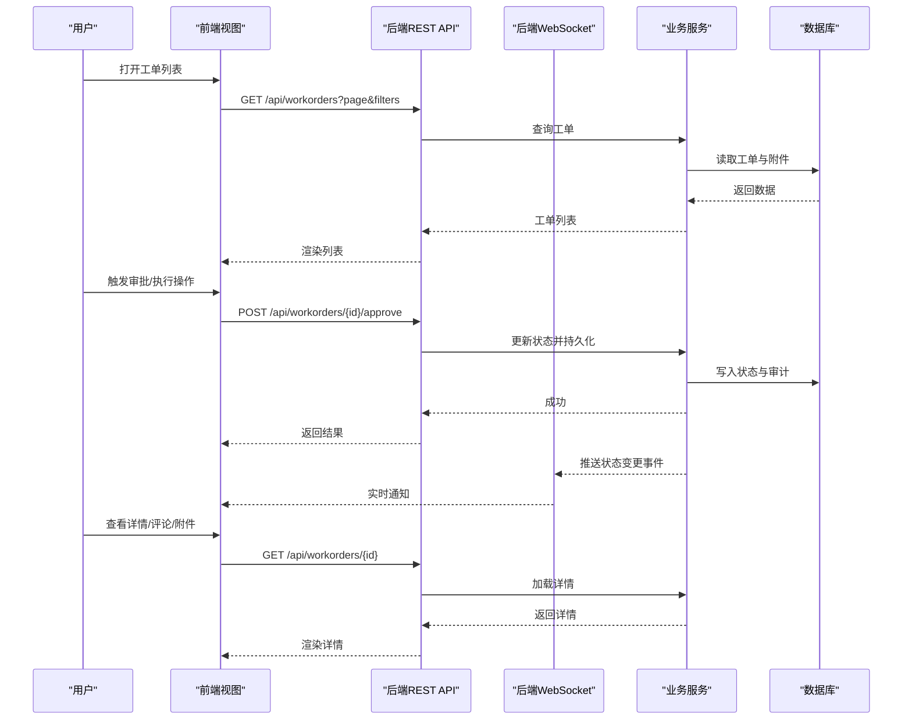
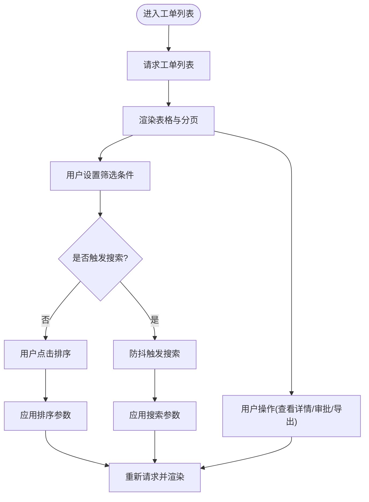
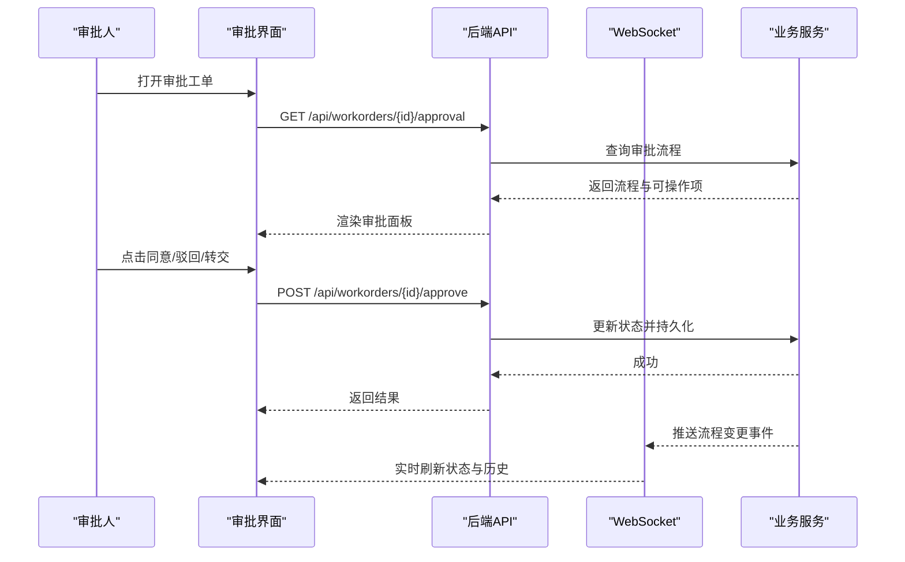
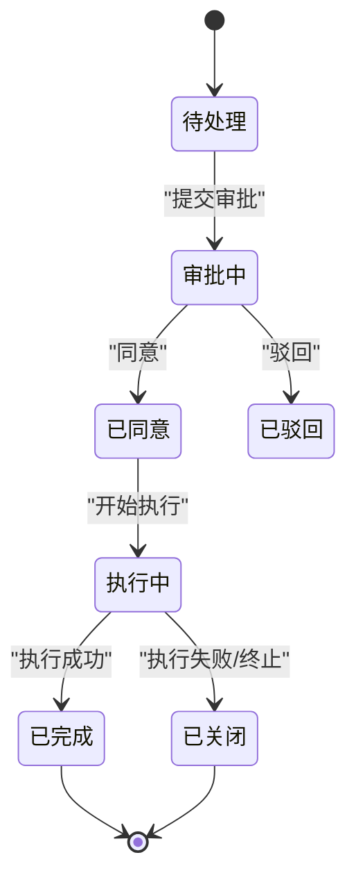
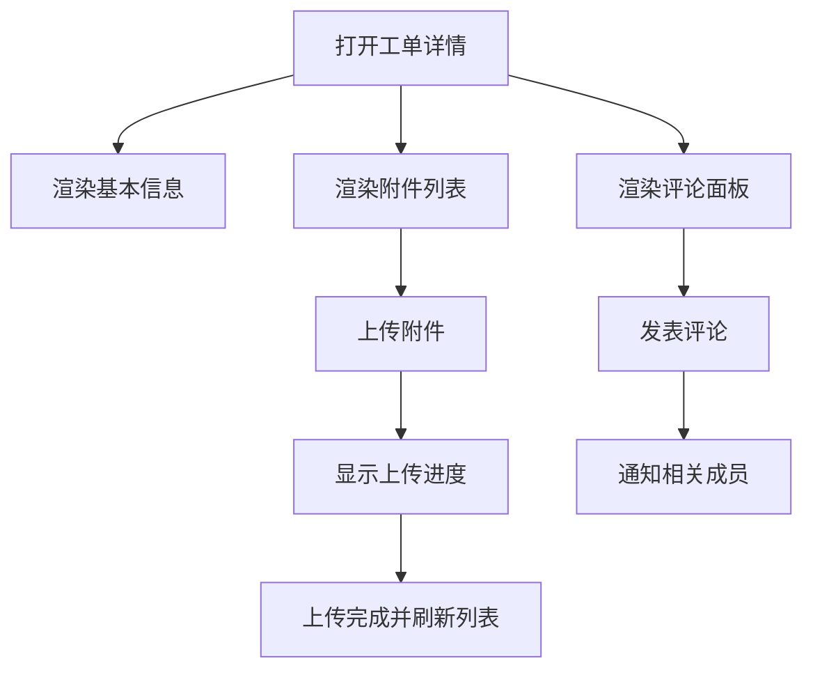
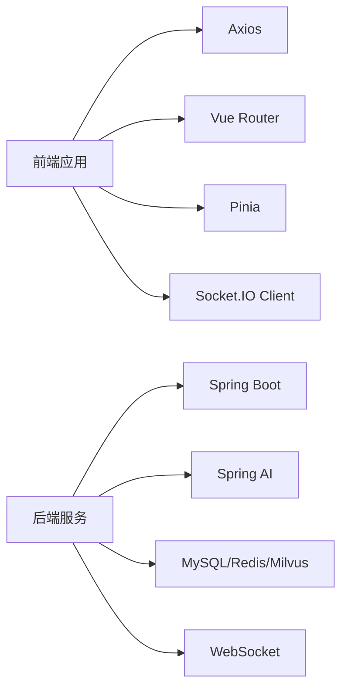

# 运维工单界面

<cite>
**本文引用的文件**
- [PROJECT_CONTEXT.md](file://PROJECT_CONTEXT.md)
- [开题报告_精简版.md](file://开题报告_精简版.md)
- [修改说明.md](file://修改说明.md)
- [docker-compose.yml](file://docker-compose.yml)
</cite>

## 目录
1. [简介](#简介)
2. [项目结构](#项目结构)
3. [核心组件](#核心组件)
4. [架构总览](#架构总览)
5. [详细组件分析](#详细组件分析)
6. [依赖分析](#依赖分析)
7. [性能考虑](#性能考虑)
8. [故障排查指南](#故障排查指南)
9. [结论](#结论)
10. [附录](#附录)

## 简介
本文件面向“运维工单界面”的功能文档需求，结合项目上下文与开题报告中的技术方案，系统化阐述工单管理功能的实现思路与前端集成要点。根据项目文档，系统采用“前端聊天界面 + 运维工单界面”的双视图设计，并以 Vue 3 + Element Plus 作为前端技术栈。运维工单界面将承载以下关键能力：
- 工单列表展示、筛选排序与搜索
- 审批流程界面：状态显示、操作按钮与流程控制
- 执行状态跟踪：状态变更通知、进度条与历史记录
- 工单详情页：信息展示、附件上传、评论功能
- 表单验证与数据绑定
- 权限控制与角色管理集成
- 与后端 API 的数据交互模式与错误处理
- 用户体验优化与性能提升策略

由于当前工作区未包含前端源码，本文以概念性与架构性描述为主，重点给出实现蓝图、交互流程与最佳实践，便于后续前端开发落地。

## 项目结构
根据项目上下文，系统采用前后端分离架构，前端位于 netdata-ai-frontend 目录，包含 views 与 components。运维工单界面属于 views 下的一个独立视图，配合后端 Spring Boot 提供的 REST API 与 WebSocket 实时通道，实现完整的工单生命周期管理。

**图表来源**
- [PROJECT_CONTEXT.md:141-148](file://PROJECT_CONTEXT.md#L141-L148)

**章节来源**
- [PROJECT_CONTEXT.md:120-149](file://PROJECT_CONTEXT.md#L120-L149)

## 核心组件
围绕运维工单界面，建议的核心前端组件包括：

- 工单列表组件
  - 支持分页、排序、筛选与搜索
  - 行内状态标识与快捷操作
- 审批流程组件
  - 流水线式状态展示
  - 操作按钮（同意/驳回/转交/撤销）
  - 审批意见与附件上传
- 执行跟踪组件
  - 进度条与状态节点
  - 实时通知与历史记录
- 工单详情组件
  - 信息卡片与附件列表
  - 评论面板与附件上传
- 表单组件
  - 校验规则与联动
  - 数据绑定与提交
- 权限与角色组件
  - 角色菜单与按钮级权限
  - 路由守卫与指令控制

上述组件均通过 Element Plus 的表格、表单、对话框、进度条等基础组件组合实现，遵循单一职责与可复用原则。

**章节来源**
- [开题报告_精简版.md:383-389](file://开题报告_精简版.md#L383-L389)

## 架构总览
运维工单界面与后端的交互采用“REST API + WebSocket”的双通道模式：
- REST API：负责工单 CRUD、审批流转、状态查询、附件上传下载等
- WebSocket：负责实时通知（审批状态变更、执行进度更新）

**图表来源**
- [PROJECT_CONTEXT.md:129-133](file://PROJECT_CONTEXT.md#L129-L133)
- [开题报告_精简版.md:383-389](file://开题报告_精简版.md#L383-L389)

## 详细组件分析

### 工单列表展示、筛选排序与搜索
- 列表渲染
  - 使用表格组件展示工单编号、主题、申请人、所属团队、优先级、状态、截止时间等字段
  - 行内状态标签与颜色区分（待处理/审批中/执行中/已完成/已关闭）
  - 快捷操作：查看详情、发起审批、转交、导出
- 筛选与排序
  - 多条件筛选：状态、优先级、申请人、时间范围、关键词
  - 排序：按创建时间、截止时间、优先级等
- 搜索
  - 支持关键词搜索（标题/描述/附件名）
  - 防抖搜索与空结果提示
- 分页与加载
  - 服务端分页，懒加载与骨架屏优化
  - 大数据量场景下启用虚拟滚动

**图表来源**
- [开题报告_精简版.md:383-389](file://开题报告_精简版.md#L383-L389)

**章节来源**
- [开题报告_精简版.md:383-389](file://开题报告_精简版.md#L383-L389)

### 审批流程界面：状态显示、操作按钮与流程控制
- 状态展示
  - 流水线式状态节点：创建/待审批/审批中/已同意/已驳回/执行中/已完成/已关闭
  - 当前节点高亮，历史节点完成态
- 操作按钮
  - 同意/驳回：输入审批意见并提交
  - 转交：选择下一审批人
  - 撤销：仅限发起人或管理员
- 流程控制
  - 根据角色与权限动态显示可用操作
  - 审批通过后自动推进至下一节点
  - 驳回后退回申请人并允许修改

**图表来源**
- [PROJECT_CONTEXT.md:129-133](file://PROJECT_CONTEXT.md#L129-L133)

**章节来源**
- [PROJECT_CONTEXT.md:129-133](file://PROJECT_CONTEXT.md#L129-L133)

### 执行状态跟踪：状态变更通知、进度条与历史记录
- 状态变更通知
  - WebSocket 接收后端推送的执行状态事件
  - 弹窗/顶部通知栏提醒，支持跳转详情
- 进度条
  - 任务阶段进度条，支持百分比与阶段名称
  - 实时刷新，避免频繁轮询
- 历史记录
  - 按时间倒序展示状态变更、审批意见、执行日志
  - 支持展开查看详细信息与附件

**图表来源**
- [开题报告_精简版.md:268-301](file://开题报告_精简版.md#L268-L301)

**章节来源**
- [开题报告_精简版.md:268-301](file://开题报告_精简版.md#L268-L301)

### 工单详情页面：信息展示、附件上传与评论
- 工单信息
  - 基本信息卡片：主题、描述、优先级、创建时间、截止时间、申请人、处理人
  - 流程历史：状态节点与时间线
- 附件上传
  - 支持拖拽/选择上传，限制大小与类型
  - 上传进度与失败重试
  - 附件列表与在线预览
- 评论功能
  - 实时评论与回复
  - 支持@提及与表情
  - 评论历史与编辑/删除权限控制

**图表来源**
- [开题报告_精简版.md:383-389](file://开题报告_精简版.md#L383-L389)

**章节来源**
- [开题报告_精简版.md:383-389](file://开题报告_精简版.md#L383-L389)

### 表单验证与数据绑定
- 表单组件
  - 使用表单校验器，覆盖必填、长度、格式、数值范围等
  - 联动校验：如截止时间需晚于创建时间
- 数据绑定
  - 双向绑定与受控组件，避免脏值
  - 提交前统一序列化与清理
- 错误处理
  - 字段级错误提示与全局错误弹窗
  - 服务端返回的错误码映射为友好文案

**章节来源**
- [开题报告_精简版.md:383-389](file://开题报告_精简版.md#L383-L389)

### 权限控制与角色管理集成
- 角色与权限
  - 角色：申请人、处理人、审批人、管理员
  - 权限矩阵：查看、编辑、审批、执行、导出、删除
- 路由与菜单
  - 路由守卫根据角色过滤不可见菜单
  - 按钮级权限指令控制操作按钮显示
- 操作审计
  - 记录每个操作的执行者、时间、IP、结果

**章节来源**
- [开题报告_精简版.md:383-389](file://开题报告_精简版.md#L383-L389)

### 与后端 API 的数据交互模式与错误处理
- 数据交互模式
  - REST API：GET/POST/PUT/DELETE，统一响应结构
  - WebSocket：订阅工单状态变更事件
- 错误处理
  - 网络错误：重试与降级提示
  - 业务错误：解析错误码并引导用户操作
  - 服务端异常：统一兜底提示与日志上报

**章节来源**
- [开题报告_精简版.md:383-389](file://开题报告_精简版.md#L383-L389)

## 依赖分析
- 前端依赖
  - Vue 3 + Element Plus：UI 与组件生态
  - Axios：HTTP 请求封装
  - Vue Router / Pinia：路由与状态管理
  - Socket.IO Client：WebSocket 客户端
- 后端依赖
  - Spring Boot + Spring AI：应用框架与 LLM 集成
  - MySQL/Redis/Milvus：数据与缓存
  - WebSocket：实时通知

**图表来源**
- [PROJECT_CONTEXT.md:27-40](file://PROJECT_CONTEXT.md#L27-L40)

**章节来源**
- [PROJECT_CONTEXT.md:27-40](file://PROJECT_CONTEXT.md#L27-L40)

## 性能考虑
- 前端性能
  - 组件懒加载与路由分割
  - 列表虚拟滚动与分页
  - 图片与附件懒加载
  - 缓存策略：分页结果缓存、附件 CDN
- 网络性能
  - 请求合并与防抖
  - WebSocket 长连接复用
  - 二进制传输优化（附件）
- 后端性能
  - 分页查询与索引优化
  - 缓存热点数据（审批人、附件元数据）
  - 异步处理耗时操作（批量导出、统计报表）

[本节为通用性能建议，不直接分析具体文件]

## 故障排查指南
- 常见问题
  - 工单列表为空：检查筛选条件与分页参数
  - 审批按钮不可用：核对角色权限与当前状态
  - 附件上传失败：检查大小/类型限制与网络
  - 实时通知不生效：确认 WebSocket 连接状态
- 排查步骤
  - 打开浏览器开发者工具，查看网络与控制台
  - 核对后端日志与 WebSocket 事件
  - 检查鉴权与权限配置
- 错误码映射
  - 401/403：权限不足，引导重新登录或申请权限
  - 404：资源不存在（工单/附件）
  - 5xx：服务异常，提示稍后重试并记录日志

**章节来源**
- [开题报告_精简版.md:383-389](file://开题报告_精简版.md#L383-L389)

## 结论
运维工单界面作为智能运维系统的重要入口，应以“状态驱动 + 权限可控 + 实时反馈”为核心设计理念。通过 REST API 与 WebSocket 的双通道交互，结合完善的表单校验与权限控制，可实现从创建到执行闭环的高效工单管理。建议在后续开发中优先完成核心视图与交互原型，再逐步完善细节与性能优化。

[本节为总结性内容，不直接分析具体文件]

## 附录
- 相关技术栈
  - 前端：Vue 3 + Element Plus + Axios + Socket.IO Client
  - 后端：Spring Boot + Spring AI + MySQL/Redis/Milvus
- 开发进度
  - 当前阶段：环境搭建（Milvus + MySQL + Redis + Ollama）
  - 前端开发：计划于第 7-8 周完成聊天界面与运维工单界面
- 对标项目
  - IncidentFox：基于 Slack 的智能运维问答系统，本系统在 NetData 数据基础上提供国内生态适配与自动化执行能力

**章节来源**
- [PROJECT_CONTEXT.md:96-107](file://PROJECT_CONTEXT.md#L96-L107)
- [开题报告_精简版.md:400-410](file://开题报告_精简版.md#L400-L410)
- [修改说明.md:48-57](file://修改说明.md#L48-L57)