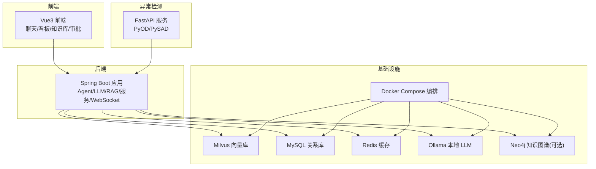
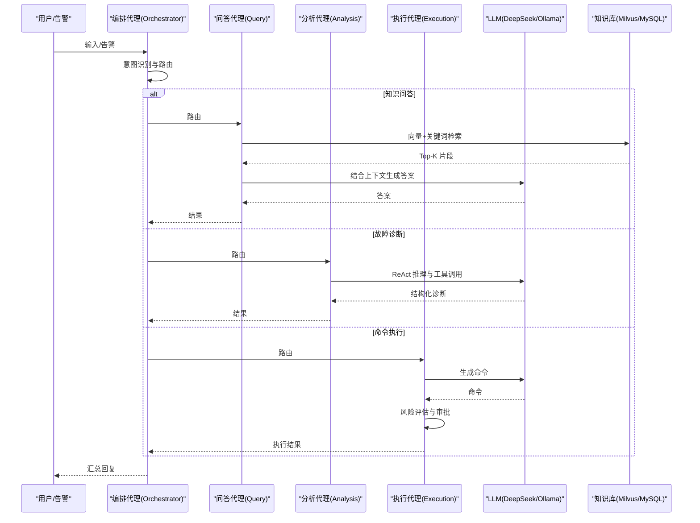
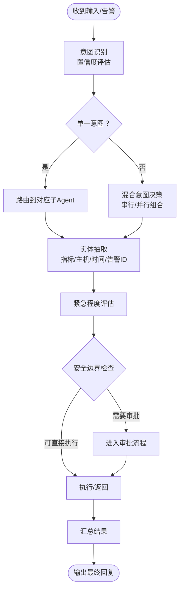
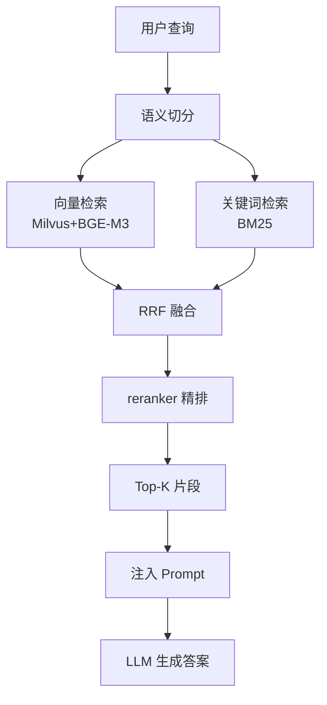
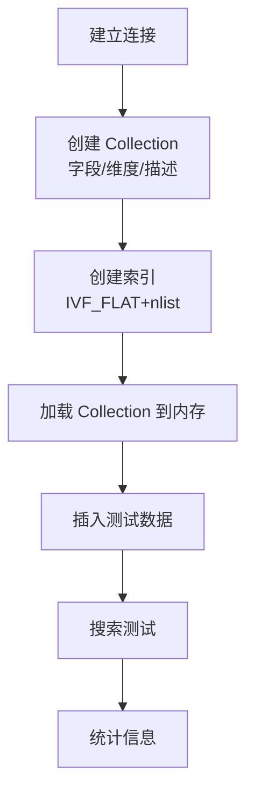
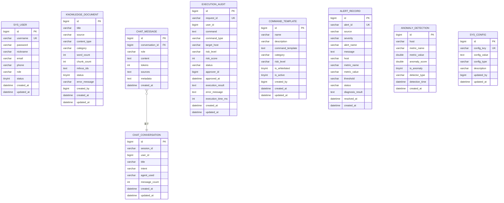
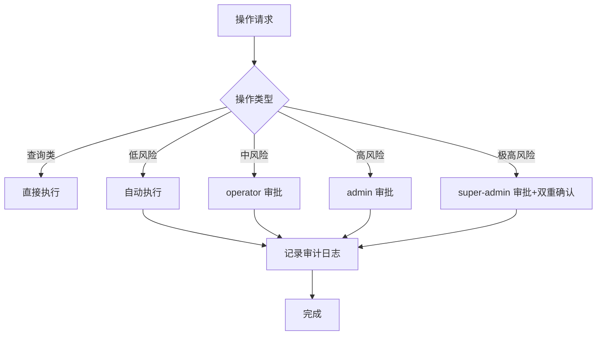
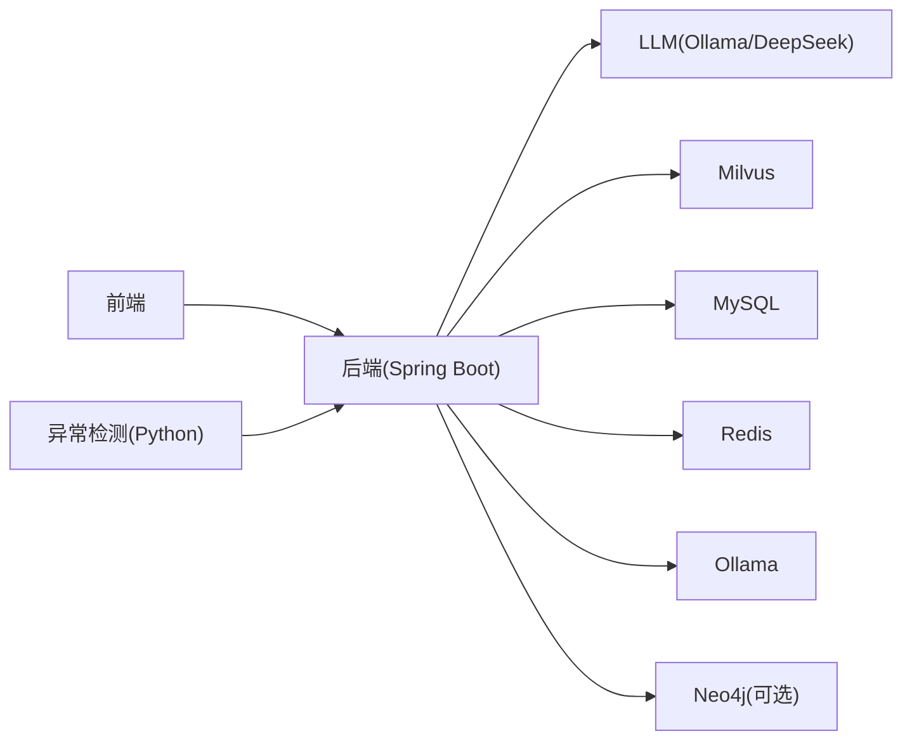

# 参考材料

<cite>
**本文引用的文件**
- [PROJECT_CONTEXT.md](file://PROJECT_CONTEXT.md)
- [开题报告_精简版.md](file://开题报告_精简版.md)
- [文献\文献综述汇编.md](file://文献\文献综述汇编.md)
- [文献\文献知识库_完整版.md](file://文献\文献知识库_完整版.md)
- [docker-compose.yml](file://docker-compose.yml)
- [config\milvus_collection.yaml](file://config/milvus_collection.yaml)
- [scripts\init_milvus.py](file://scripts/init_milvus.py)
- [sql\init.sql](file://sql/init.sql)
- [docs\prompts\orchestrator-system-prompt.md](file://docs/prompts/orchestrator-system-prompt.md)
- [docs\prompts\shared-safety-constraints.md](file://docs/prompts/shared-safety-constraints.md)
</cite>

## 目录
1. [简介](#简介)
2. [项目结构](#项目结构)
3. [核心组件](#核心组件)
4. [架构总览](#架构总览)
5. [详细组件分析](#详细组件分析)
6. [依赖分析](#依赖分析)
7. [性能考虑](#性能考虑)
8. [故障排查指南](#故障排查指南)
9. [结论](#结论)
10. [附录](#附录)

## 简介
本参考材料面向“面向 NetData 监控数据的智能运维问答与执行系统”，围绕学术文献综述、开源案例借鉴、技术实现参考与最佳实践、常见问题解答、术语定义、专利与论文、学习资源等方面，形成系统化的参考资料。文档同时给出架构与组件的可视化说明，帮助读者快速理解系统设计与实现思路。

## 项目结构
项目采用多模块分层组织，包含后端（Spring Boot）、异常检测（Python FastAPI）、前端（Vue3）、容器编排（Docker Compose）以及知识库与检索（Milvus、MySQL、Redis、可选 Neo4j）。核心目录与职责如下：
- 后端（netdata-ai-backend）：Agent 架构、RAG、LLM、嵌入与提示词管理、控制器、业务服务、WebSocket 实时通信、配置
- 异常检测服务（anomaly-detection-service）：FastAPI 接口、PyOD/PySAD 模型封装、NetData 数据适配
- 前端（netdata-ai-frontend）：聊天界面、告警看板、知识库、执行审批
- 基础设施：docker-compose 一键编排 Milvus、MySQL、Redis、Ollama、可选 Neo4j
- 数据与检索：Milvus 向量集合配置、初始化脚本、MySQL 表结构与视图、RAG 检索流程

图表来源
- [docker-compose.yml:1-357](file://docker-compose.yml#L1-L357)
- [PROJECT_CONTEXT.md:120-166](file://PROJECT_CONTEXT.md#L120-L166)

章节来源
- [PROJECT_CONTEXT.md:120-166](file://PROJECT_CONTEXT.md#L120-L166)
- [docker-compose.yml:1-357](file://docker-compose.yml#L1-L357)

## 核心组件
- Orchestrator-Subagent 模式：用户输入/告警事件经编排代理识别意图并路由到 Query/Analysis/Execution 子代理，汇总结果
- RAG 检索：向量检索（Milvus + BGE-M3）+ 关键词检索（BM25）+ RRF 融合 + reranker 精排
- LLM 集成：Spring AI ChatClient（注意版本与配置切换）
- 异常检测：Python FastAPI + PyOD/PySAD，与 Java 后端通过 REST 通信
- 安全与审计：共享安全约束、命令白名单/黑名单、审批流程、审计日志

章节来源
- [PROJECT_CONTEXT.md:43-61](file://PROJECT_CONTEXT.md#L43-L61)
- [PROJECT_CONTEXT.md:64-82](file://PROJECT_CONTEXT.md#L64-L82)
- [开题报告_精简版.md:118-152](file://开题报告_精简版.md#L118-L152)

## 架构总览
系统采用“Orchestrator-Subagent”多代理协同，结合 RAG 增强的 LLM 推理与人类在环（Human-in-the-Loop）审批，实现从“告警/问题”到“诊断/建议/执行”的闭环。

图表来源
- [PROJECT_CONTEXT.md:43-61](file://PROJECT_CONTEXT.md#L43-L61)
- [开题报告_精简版.md:118-152](file://开题报告_精简版.md#L118-L152)

## 详细组件分析

### Agent 架构与编排
- 编排代理负责意图识别（知识问答/故障诊断/命令执行/混合意图）、路由决策（串行/并行）、实体抽取与紧急程度评估
- 输出严格遵循 JSON 结构，便于上层系统解析与展示
- 安全边界：涉及删除/修改/重启等操作必须进入执行代理并触发人工审批

图表来源
- [docs\prompts\orchestrator-system-prompt.md:26-136](file://docs/prompts/orchestrator-system-prompt.md#L26-L136)

章节来源
- [docs\prompts\orchestrator-system-prompt.md:1-291](file://docs/prompts/orchestrator-system-prompt.md#L1-L291)

### RAG 检索与重排
- 文档切分：语义切分（Semantic Chunking），避免固定长度带来的语义割裂
- 检索策略：向量检索（Milvus + BGE-M3 1024 维）+ 关键词检索（BM25）
- 融合与精排：RRF 融合重排序 + reranker 精排
- 返回 Top-K 注入 Prompt，交由 LLM 生成最终答案

图表来源
- [PROJECT_CONTEXT.md:64-82](file://PROJECT_CONTEXT.md#L64-L82)
- [开题报告_精简版.md:191-221](file://开题报告_精简版.md#L191-L221)

章节来源
- [PROJECT_CONTEXT.md:64-82](file://PROJECT_CONTEXT.md#L64-L82)
- [开题报告_精简版.md:191-221](file://开题报告_精简版.md#L191-L221)

### 向量数据库（Milvus）配置与初始化
- Collection 名称、字段定义、索引类型（IVF_FLAT）、nlist/nprobe、Top-K、输出字段等
- 初始化脚本：连接、创建 Collection、创建索引、加载、插入测试数据、搜索测试、统计信息
- 重要约束：向量维度创建后不可更改，务必与 Embedding 模型一致

图表来源
- [scripts\init_milvus.py:106-516](file://scripts/init_milvus.py#L106-L516)
- [config\milvus_collection.yaml:19-186](file://config/milvus_collection.yaml#L19-L186)

章节来源
- [scripts\init_milvus.py:1-516](file://scripts/init_milvus.py#L1-L516)
- [config\milvus_collection.yaml:1-186](file://config/milvus_collection.yaml#L1-L186)

### 关系数据库（MySQL）与执行审计
- 表结构覆盖：用户、知识库文档、对话历史、命令执行审计、命令模板、告警记录、异常检测、系统配置
- 视图：告警统计、执行统计，便于运营分析
- 配置项：LLM 提供商/模型/温度/最大 Token、RAG 参数、执行策略等

图表来源
- [sql\init.sql:22-274](file://sql/init.sql#L22-L274)

章节来源
- [sql\init.sql:1-274](file://sql/init.sql#L1-L274)

### 安全与审计（共享安全约束）
- 命令黑名单/白名单/自动执行清单
- 权限矩阵与审批流程分级
- 输入验证、日志脱敏、URL 白名单、审计日志格式
- 应急响应流程与联系人

图表来源
- [docs\prompts\shared-safety-constraints.md:244-258](file://docs/prompts/shared-safety-constraints.md#L244-L258)

章节来源
- [docs\prompts\shared-safety-constraints.md:1-396](file://docs/prompts/shared-safety-constraints.md#L1-L396)

### Docker Compose 编排与服务依赖
- Milvus Standalone + etcd + MinIO
- MySQL 8.0、Redis 7.x、Ollama（本地 LLM）、可选 Neo4j
- 网络隔离、资源限制、健康检查、数据持久化

章节来源
- [docker-compose.yml:1-357](file://docker-compose.yml#L1-L357)

## 依赖分析
- 技术栈耦合与分层：后端（Java）+ 异常检测（Python）+ 前端（Vue3）+ 基础设施（Docker Compose）
- 组件内聚：Agent、RAG、LLM、安全模块相对独立，通过统一的提示词与配置管理耦合
- 外部依赖：Milvus（向量检索）、MySQL（关系数据）、Redis（缓存/锁）、Ollama/DeepSeek API（LLM）

图表来源
- [docker-compose.yml:23-357](file://docker-compose.yml#L23-L357)
- [PROJECT_CONTEXT.md:25-40](file://PROJECT_CONTEXT.md#L25-L40)

章节来源
- [docker-compose.yml:1-357](file://docker-compose.yml#L1-L357)
- [PROJECT_CONTEXT.md:25-40](file://PROJECT_CONTEXT.md#L25-L40)

## 性能考虑
- 向量检索性能：索引类型（IVF_FLAT）、nlist/nprobe、Top-K、输出字段裁剪
- 检索融合：RRF 融合与 reranker 精排的权衡
- LLM 推理：提示词模板管理、温度/最大 Token 控制、模型切换（Profile）
- Python-Java 通信：超时与重试、批量/流式处理
- 缓存策略：Redis 缓存检索结果、会话与锁

## 故障排查指南
- Milvus 初始化失败：检查连接参数、索引参数、内存资源、健康检查
- 向量维度不匹配：确认 Embedding 模型与 Collection 维度一致
- Python 服务超时：调整超时与重试、拆分批量、异步处理
- LLM 切换无效：确认配置文件 Profile、API Key、模型名称
- 审批流程卡住：检查 Redis 锁、审批状态、审计日志

章节来源
- [scripts\init_milvus.py:106-516](file://scripts/init_milvus.py#L106-L516)
- [PROJECT_CONTEXT.md:110-117](file://PROJECT_CONTEXT.md#L110-L117)

## 结论
本项目以“Orchestrator-Subagent”为核心，结合 RAG 增强与人类在环审批，构建面向 NetData 监控数据的智能运维问答与执行系统。通过容器化编排与模块化设计，兼顾可扩展性与可维护性。建议在后续阶段完善异常检测服务与前端联调，并持续优化检索与推理性能。

## 附录

### 学术文献综述与案例借鉴
- 智能运维大模型与多智能体：集成诊断/预后/决策、多智能体运维框架、跨域故障定位、报警风暴与根因定位
- RAG 增强与知识图谱：Hybrid RAG、知识图谱增强推理、动态知识图谱协同
- 开源项目参考：IncidentFox（Slack）、NetData（监控）、PyOD/PySAD（异常检测）

章节来源
- [开题报告_精简版.md:39-67](file://开题报告_精简版.md#L39-L67)
- [文献\文献综述汇编.md:1-800](file://文献\文献综述汇编.md#L1-L800)
- [文献\文献知识库_完整版.md:1-623](file://文献\文献知识库_完整版.md#L1-L623)

### 技术术语定义
- 意图识别：对用户输入进行分类（知识问答/故障诊断/命令执行/混合意图）
- ReAct：推理与行动循环（思考→行动→观察→再思考）
- RAG：检索增强生成，结合检索到的知识与 LLM 推理
- Hybrid RAG：向量检索与关键词检索的混合策略
- RRF：Reciprocal Rank Fusion，用于检索结果融合
- 人类在环（Human-in-the-Loop）：关键操作需人工审批与确认

章节来源
- [开题报告_精简版.md:325-334](file://开题报告_精简版.md#L325-L334)
- [PROJECT_CONTEXT.md:64-82](file://PROJECT_CONTEXT.md#L64-L82)

### 专利、论文与获奖
- 文献索引与摘要：涵盖智能运维、多智能体、RAG、知识图谱、跨域故障定位等主题
- 论文引用：多篇会议论文与期刊文章，体现相关研究进展

章节来源
- [开题报告_精简版.md:413-430](file://开题报告_精简版.md#L413-L430)
- [文献\文献综述汇编.md:8-32](file://文献\文献综述汇编.md#L8-L32)
- [文献\文献知识库_完整版.md:1-623](file://文献\文献知识库_完整版.md#L1-L623)

### 进一步学习资源
- Docker 与容器编排：官方文档、最佳实践
- Spring Boot 与 Spring AI：框架指南、版本兼容性
- Milvus 向量检索：官方文档、索引与性能调优
- RAG 与 LLM：Prompt 工程、检索策略、安全与伦理
- Vue3 前端：组件化开发、状态管理、实时通信

（本节为通用学习建议，不直接分析具体文件）