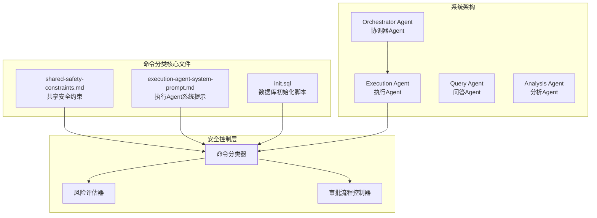
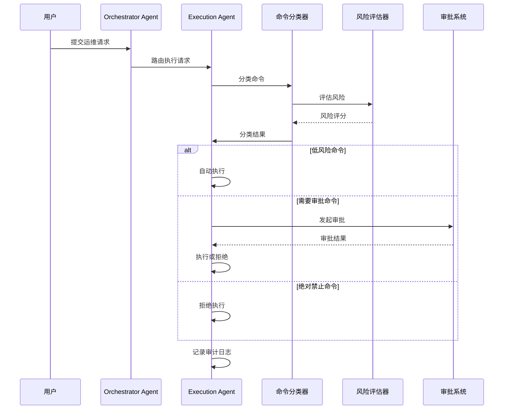
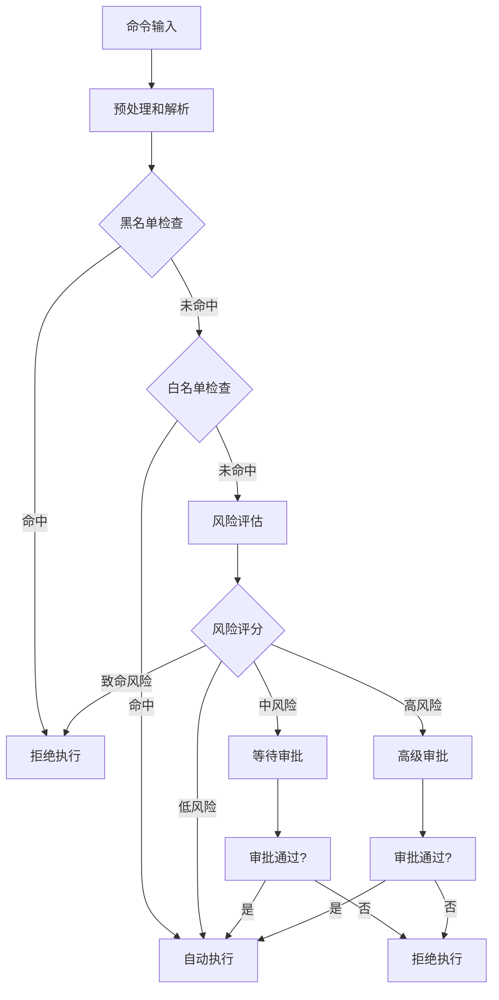
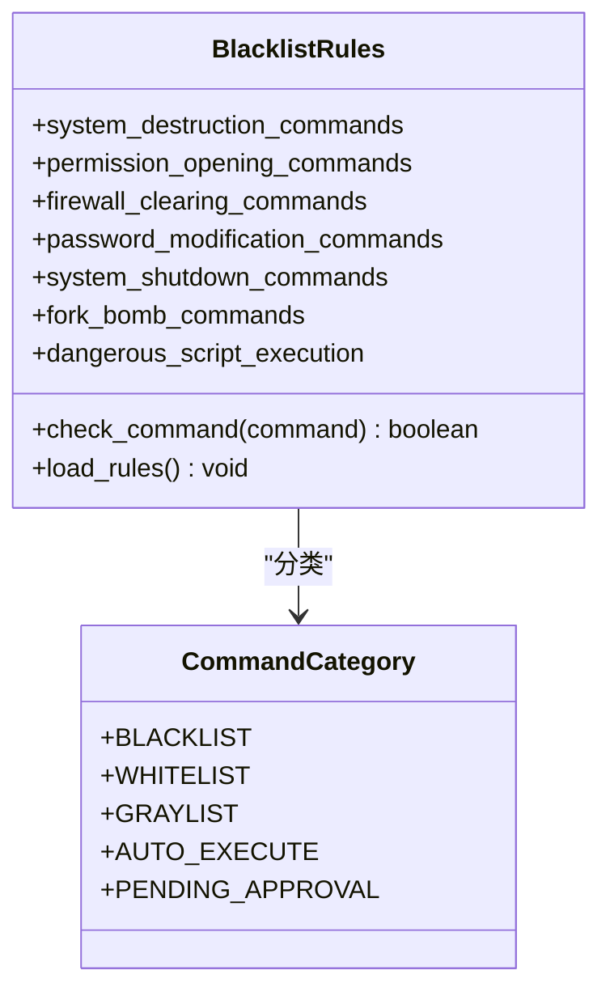
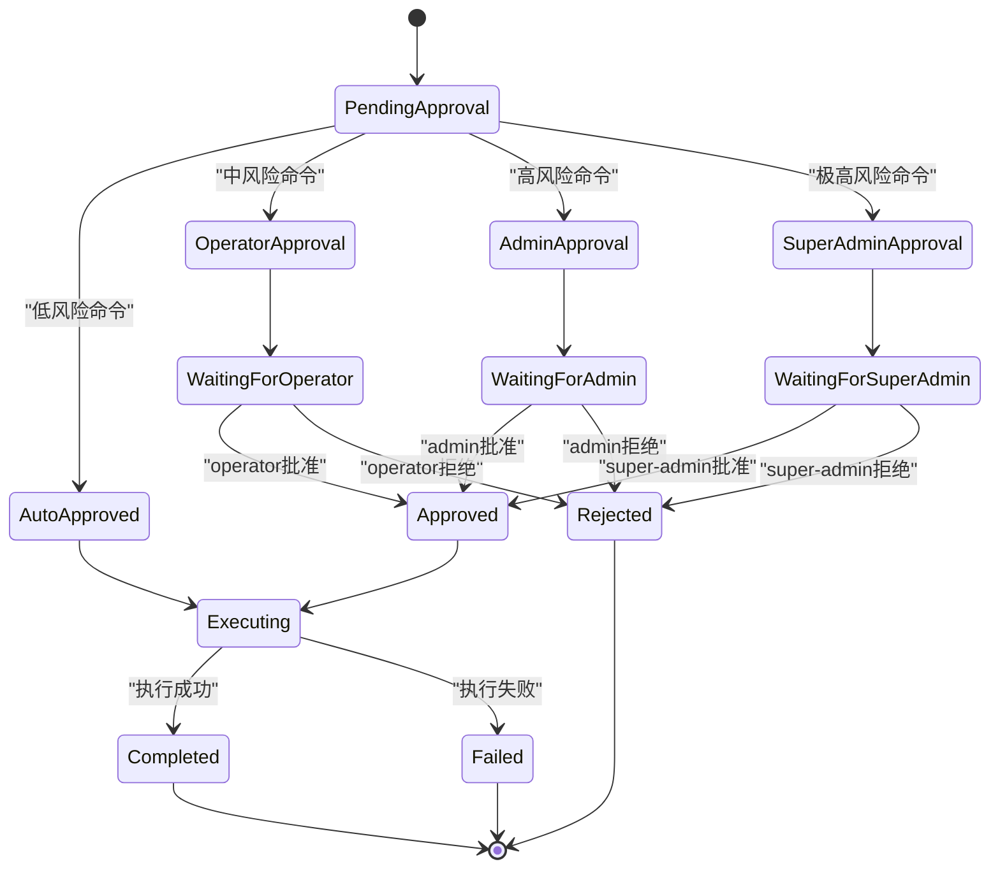
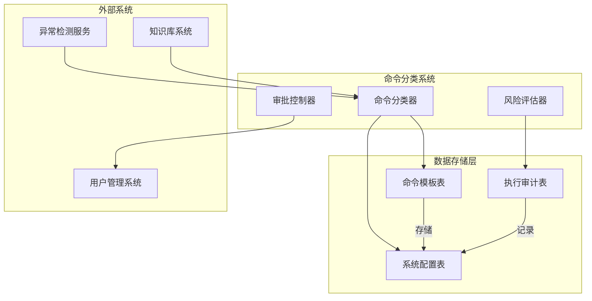

# 命令分类体系

<cite>
**本文档引用的文件**
- [PROJECT_CONTEXT.md](file://PROJECT_CONTEXT.md)
- [开题报告_精简版.md](file://开题报告_精简版.md)
- [shared-safety-constraints.md](file://docs/prompts/shared-safety-constraints.md)
- [execution-agent-system-prompt.md](file://docs/prompts/execution-agent-system-prompt.md)
- [init.sql](file://sql/init.sql)
- [detector_base.py](file://anomaly-detection-service/app/core/detector_base.py)
- [detection_service.py](file://anomaly-detection-service/app/services/detection_service.py)
- [config.py](file://anomaly-detection-service/app/config.py)
</cite>

## 目录
1. [简介](#简介)
2. [项目结构](#项目结构)
3. [核心组件](#核心组件)
4. [架构概览](#架构概览)
5. [详细组件分析](#详细组件分析)
6. [依赖分析](#依赖分析)
7. [性能考虑](#性能考虑)
8. [故障排除指南](#故障排除指南)
9. [结论](#结论)
10. [附录](#附录)

## 简介

本文件为智能运维系统中的命令分类体系提供全面的技术文档。该体系基于三层分类模型：绝对禁止命令、需要审批命令和自动执行命令，旨在确保系统在自动化运维过程中的安全性、可控性和可追溯性。

智能运维系统采用多Agent协同架构，其中Execution Agent专门负责命令执行的安全控制。系统通过严格的命令分类机制，将运维操作分为三个风险等级，并为每个等级提供相应的处理策略和安全控制措施。

## 项目结构

智能运维系统的命令分类体系建立在以下核心文件之上：

**图表来源**
- [shared-safety-constraints.md:1-396](file://docs/prompts/shared-safety-constraints.md#L1-L396)
- [execution-agent-system-prompt.md:1-377](file://docs/prompts/execution-agent-system-prompt.md#L1-L377)
- [init.sql:1-274](file://sql/init.sql#L1-L274)

**章节来源**
- [PROJECT_CONTEXT.md:120-166](file://PROJECT_CONTEXT.md#L120-L166)
- [开题报告_精简版.md:118-152](file://开题报告_精简版.md#L118-L152)

## 核心组件

### 命令分类三层模型

系统采用三层命令分类体系，每层都有明确的判定标准和处理逻辑：

#### 绝对禁止命令层
- **判定标准**：系统级破坏性操作，包括系统销毁、权限开放、防火墙清空、密码修改等
- **处理策略**：无条件拒绝，永不执行
- **风险等级**：致命风险（Critical）

#### 需要审批命令层
- **判定标准**：可能影响业务连续性的操作，包括服务启停、配置修改、网络操作等
- **处理策略**：触发人工审批流程，根据风险等级分配审批权限
- **风险等级**：高风险（High）至中等风险（Medium）

#### 自动执行命令层
- **判定标准**：信息查询、日志查看、状态检查等非破坏性操作
- **处理策略**：自动执行，无需人工干预
- **风险等级**：低风险（Low）

**章节来源**
- [shared-safety-constraints.md:31-126](file://docs/prompts/shared-safety-constraints.md#L31-L126)
- [execution-agent-system-prompt.md:19-57](file://docs/prompts/execution-agent-system-prompt.md#L19-L57)

## 架构概览

命令分类体系在整体系统架构中的位置如下：

**图表来源**
- [execution-agent-system-prompt.md:62-95](file://docs/prompts/execution-agent-system-prompt.md#L62-L95)
- [shared-safety-constraints.md:246-258](file://docs/prompts/shared-safety-constraints.md#L246-L258)

## 详细组件分析

### 命令分类器实现

命令分类器是整个系统的核心组件，负责对输入的命令进行分类和风险评估。

#### 分类算法流程

**图表来源**
- [execution-agent-system-prompt.md:99-118](file://docs/prompts/execution-agent-system-prompt.md#L99-L118)
- [execution-agent-system-prompt.md:62-95](file://docs/prompts/execution-agent-system-prompt.md#L62-L95)

#### 风险评估算法

系统采用多维度风险评估算法，总分为1-10分：

| 评估维度 | 权重 | 评分标准 | 风险等级 |
|---------|------|---------|---------|
| 命令类型 | 40% | 删除(10)、修改(7)、查询(2)、只读(1) | 1-3: Low, 4-6: Medium, 7-8: High, 9-10: Critical |
| 影响范围 | 30% | 全局(10)、单机(7)、单服务(4)、单文件(2) | |
| 可逆性 | 20% | 不可逆(10)、难恢复(7)、可恢复(3)、易恢复(1) | |
| 执行频率 | 10% | 首次(10)、罕见(7)、偶尔(4)、频繁(1) | |

**章节来源**
- [execution-agent-system-prompt.md:101-118](file://docs/prompts/execution-agent-system-prompt.md#L101-L118)

### 命令分类规则实现

#### 绝对禁止命令规则

系统维护了完整的黑名单规则，涵盖以下危险操作类别：

**图表来源**
- [shared-safety-constraints.md:35-66](file://docs/prompts/shared-safety-constraints.md#L35-L66)

#### 需要审批命令规则

灰名单规则涵盖可能影响业务连续性的操作：

| 操作类别 | 示例命令 | 审批原因 |
|---------|---------|---------|
| 服务启停 | `systemctl stop/restart service` | 可能影响业务 |
| 配置修改 | 修改配置文件、环境变量 | 可能导致异常 |
| 网络操作 | 修改防火墙规则、路由 | 影响连通性 |
| 数据操作 | 数据库命令、文件移动 | 数据风险 |
| 进程操作 | `kill -9 pid`、`pkill process` | 可能导致数据丢失 |

**章节来源**
- [shared-safety-constraints.md:72-95](file://docs/prompts/shared-safety-constraints.md#L72-L95)

#### 自动执行命令规则

白名单规则包含可安全自动执行的命令：

| 操作类别 | 示例命令 | 用途 |
|---------|---------|------|
| 信息查询 | `top`、`ps aux`、`netstat -tlnp` | 状态查看 |
| 日志查看 | `tail -f`、`grep`、`journalctl` | 日志分析 |
| 服务查询 | `systemctl status`、`docker ps` | 状态检查 |
| 磁盘清理 | `rm -rf /tmp/*` | 空间释放 |
| 服务重启 | `systemctl restart nginx` | 服务恢复 |
| 磁盘空间 | `df -h`、`du -sh` | 空间查看 |
| 内存查看 | `free -m`、`vmstat` | 内存监控 |

**章节来源**
- [shared-safety-constraints.md:101-126](file://docs/prompts/shared-safety-constraints.md#L101-L126)

### 审批流程控制系统

系统实现了多层次的审批控制机制：

**图表来源**
- [shared-safety-constraints.md:246-258](file://docs/prompts/shared-safety-constraints.md#L246-L258)

**章节来源**
- [shared-safety-constraints.md:237-258](file://docs/prompts/shared-safety-constraints.md#L237-L258)

## 依赖分析

命令分类体系与其他系统组件的依赖关系如下：

**图表来源**
- [init.sql:143-159](file://sql/init.sql#L143-L159)
- [init.sql:114-138](file://sql/init.sql#L114-L138)
- [init.sql:222-244](file://sql/init.sql#L222-L244)

**章节来源**
- [init.sql:143-244](file://sql/init.sql#L143-L244)

## 性能考虑

### 命令分类性能优化

系统在命令分类过程中采用了多项性能优化策略：

1. **缓存机制**：命令模板和分类规则使用LRU缓存，减少重复计算
2. **异步处理**：高风险命令的审批流程采用异步处理，避免阻塞主线程
3. **批量处理**：多个低风险命令可批量执行，提高整体吞吐量
4. **超时控制**：所有命令执行设置合理的超时时间，防止长时间阻塞

### 数据库性能优化

命令分类相关的数据库操作优化：

- **索引优化**：在风险等级、状态、创建时间等字段上建立索引
- **查询优化**：使用参数化查询，避免SQL注入同时提高查询性能
- **连接池**：使用连接池管理数据库连接，减少连接开销

## 故障排除指南

### 常见问题及解决方案

#### 命令分类错误

**问题现象**：命令被错误地分类到错误的风险级别

**排查步骤**：
1. 检查命令是否在黑名单中
2. 验证命令是否符合白名单规则
3. 确认风险评估参数设置
4. 查看审计日志中的分类决策过程

**解决方案**：
- 更新命令模板表中的分类规则
- 调整风险评估权重参数
- 添加新的分类规则到配置文件

#### 审批流程异常

**问题现象**：审批请求无法正常流转或审批超时

**排查步骤**：
1. 检查用户权限配置
2. 验证审批流程配置
3. 查看审批超时设置
4. 检查审批人可用性

**解决方案**：
- 更新系统配置表中的审批参数
- 重新配置用户角色权限
- 检查审批流程状态

**章节来源**
- [shared-safety-constraints.md:328-356](file://docs/prompts/shared-safety-constraints.md#L328-L356)

## 结论

智能运维系统的命令分类体系通过三层分类模型实现了对运维操作的精细化管控。该体系不仅确保了系统的安全性，还提供了灵活的自动化执行能力。

系统的核心优势包括：
1. **严格的安全边界**：通过绝对禁止命令确保系统安全
2. **智能化的风险评估**：基于多维度算法的动态风险评估
3. **灵活的审批流程**：根据风险等级自动分配审批权限
4. **完整的审计追踪**：所有操作都有完整的审计日志

该体系为智能运维系统的安全可靠运行提供了坚实的基础，为后续的功能扩展和系统优化奠定了良好的架构基础。

## 附录

### 命令分类规则维护指南

#### 规则更新流程

#### 规则维护最佳实践

1. **定期审查**：每季度审查一次命令分类规则的有效性
2. **风险评估**：新增规则前必须进行详细的风险评估
3. **测试验证**：在测试环境中充分验证规则的正确性
4. **文档更新**：及时更新相关技术文档和用户手册
5. **培训教育**：对相关人员进行规则变更培训

**章节来源**
- [execution-agent-system-prompt.md:231-257](file://docs/prompts/execution-agent-system-prompt.md#L231-L257)