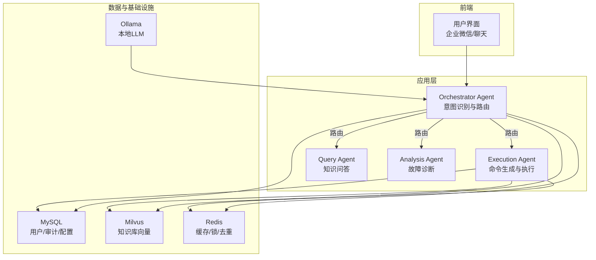
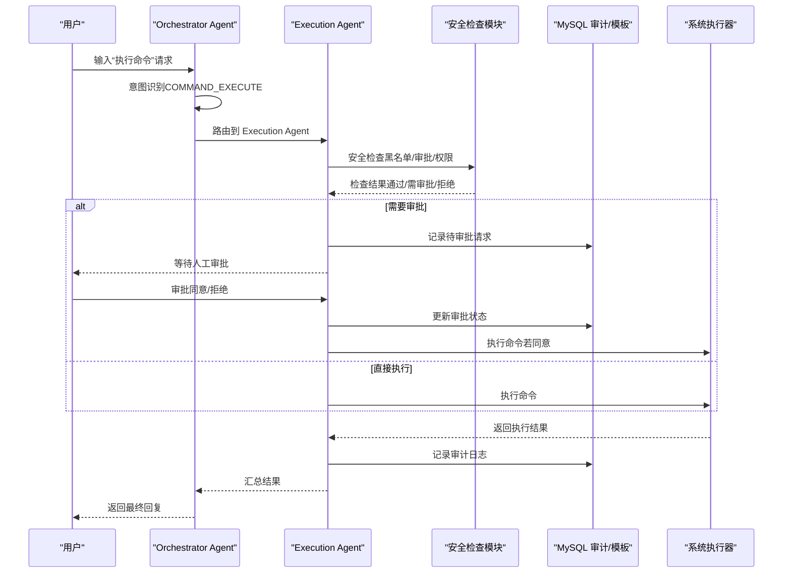
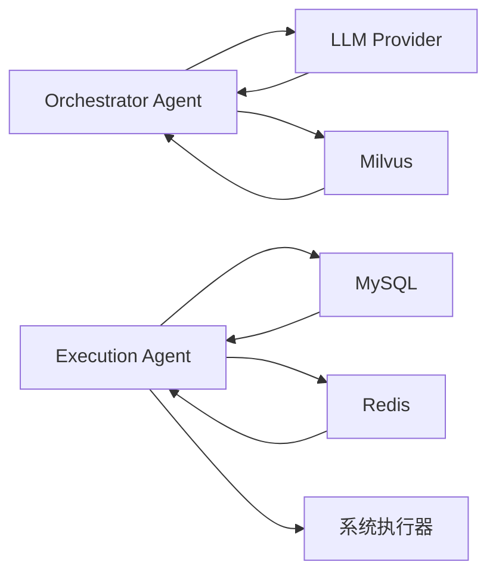

# 命令执行安全

<cite>
**本文档引用的文件**
- [PROJECT_CONTEXT.md](file://PROJECT_CONTEXT.md)
- [开题报告_精简版.md](file://开题报告_精简版.md)
- [docs/prompts/orchestrator-system-prompt.md](file://docs/prompts/orchestrator-system-prompt.md)
- [docs/prompts/shared-safety-constraints.md](file://docs/prompts/shared-safety-constraints.md)
- [docker-compose.yml](file://docker-compose.yml)
- [sql/init.sql](file://sql/init.sql)
- [config/milvus_collection.yaml](file://config/milvus_collection.yaml)
- [scripts/verify-env.sh](file://scripts/verify-env.sh)
- [scripts/verify-env.ps1](file://scripts/verify-env.ps1)
</cite>

## 目录
1. [简介](#简介)
2. [项目结构](#项目结构)
3. [核心组件](#核心组件)
4. [架构总览](#架构总览)
5. [详细组件分析](#详细组件分析)
6. [依赖分析](#依赖分析)
7. [性能考虑](#性能考虑)
8. [故障排除指南](#故障排除指南)
9. [结论](#结论)
10. [附录](#附录)

## 简介
本文件围绕“智能运维系统”的命令执行安全展开，基于仓库中的系统设计文档与安全约束，系统化梳理命令分类体系、安全检查机制、执行全流程管理、异常处理与应急响应，并提供实现路径与配置指南。目标是帮助开发者与运维人员在保障安全的前提下，实现从“建议—审批—执行—审计”的闭环流程。

## 项目结构
该项目采用多模块分层架构，命令执行安全贯穿 Orchestrator、Execution Agent、数据库与基础设施层，形成“意图识别—风险评估—人工审批—执行—审计”的整体流程。

图表来源
- [PROJECT_CONTEXT.md:120-149](file://PROJECT_CONTEXT.md#L120-L149)
- [docker-compose.yml:23-357](file://docker-compose.yml#L23-L357)

章节来源
- [PROJECT_CONTEXT.md:120-149](file://PROJECT_CONTEXT.md#L120-L149)
- [开题报告_精简版.md:118-152](file://开题报告_精简版.md#L118-L152)

## 核心组件
- Orchestrator Agent：负责意图识别、路由与汇总，强制将涉及“删除、修改、重启”等高风险操作路由至 Execution Agent，并触发 Human-in-the-loop 审批流程。
- Execution Agent：负责命令生成、安全检查、风险评估、人工审批与执行，并记录审计日志。
- 数据层：MySQL 提供用户、命令模板、执行审计、系统配置等持久化；Redis 提供缓存、分布式锁与实时告警去重；Milvus 提供知识库检索。
- 安全约束：共享安全约束文档定义了命令分类、权限矩阵、审批流程、审计日志与应急响应。

章节来源
- [docs/prompts/orchestrator-system-prompt.md:16-137](file://docs/prompts/orchestrator-system-prompt.md#L16-L137)
- [docs/prompts/shared-safety-constraints.md:29-260](file://docs/prompts/shared-safety-constraints.md#L29-L260)
- [sql/init.sql:112-159](file://sql/init.sql#L112-L159)

## 架构总览
命令执行安全的总体流程如下：

图表来源
- [docs/prompts/orchestrator-system-prompt.md:16-137](file://docs/prompts/orchestrator-system-prompt.md#L16-L137)
- [docs/prompts/shared-safety-constraints.md:244-258](file://docs/prompts/shared-safety-constraints.md#L244-L258)
- [sql/init.sql:112-159](file://sql/init.sql#L112-L159)

## 详细组件分析

### 命令分类体系
- 绝对禁止命令：任何情况下不允许执行，涵盖系统销毁、权限开放、防火墙清空、密码修改、系统关机/重启、Fork 炸弹、危险脚本执行等。
- 需要审批命令：涉及服务操作、进程操作、配置修改、数据操作、网络操作等，必须经人工审批。
- 自动执行命令：信息查询、日志查看、服务状态、临时文件清理等低风险命令，可在满足条件时自动执行。

章节来源
- [docs/prompts/shared-safety-constraints.md:31-127](file://docs/prompts/shared-safety-constraints.md#L31-L127)

### 安全检查机制
- 黑名单过滤：在安全检查模块中维护“绝对禁止命令”清单，匹配命令关键字或正则表达式，一旦命中立即拒绝。
- 风险评估算法：对命令进行风险评分（如基于命令类型、目标主机、参数复杂度等），结合系统配置（如是否自动批准低风险命令）决定是否进入审批流程。
- 审批流程设计：根据风险等级与用户角色，设定审批层级（operator/admin/super-admin），支持双重确认与回滚策略。

章节来源
- [docs/prompts/shared-safety-constraints.md:29-260](file://docs/prompts/shared-safety-constraints.md#L29-L260)
- [sql/init.sql:235-244](file://sql/init.sql#L235-L244)

### 命令执行全流程安全管理
- 执行前验证：命令解析与参数校验、权限检查、黑名单过滤、风险评估、审计日志初始化。
- 执行中监控：设置超时控制、实时日志采集、异常中断保护、回滚策略。
- 执行后审计：记录执行结果、错误信息、耗时、审批人、IP 地址、会话 ID 等，支持审计视图与报表。

章节来源
- [docs/prompts/shared-safety-constraints.md:296-324](file://docs/prompts/shared-safety-constraints.md#L296-L324)
- [sql/init.sql:112-159](file://sql/init.sql#L112-L159)

### 命令模板与白名单
- 命令模板表提供可复用的命令模板，支持变量替换与分类标注，默认风险等级与是否白名单标记。
- 白名单命令可直接自动执行，减少审批环节，提高效率。

章节来源
- [sql/init.sql:141-171](file://sql/init.sql#L141-L171)

### 审批流程与权限矩阵
- 角色权限矩阵：viewer、operator、admin、super-admin，分别对应不同的操作权限。
- 审批流程：查询类操作直接执行；低风险自动执行；中风险需 operator 审批；高风险需 admin 审批；极高风险需 super-admin 审批并双重确认。

章节来源
- [docs/prompts/shared-safety-constraints.md:235-258](file://docs/prompts/shared-safety-constraints.md#L235-L258)

### 审计日志规范
- 审计字段：时间戳、事件类型、用户、动作、资源、结果、IP、会话 ID、耗时等。
- 必须记录事件：登录/登出、命令生成、风险评估、审批决策、命令执行、配置变更、数据访问等。

章节来源
- [docs/prompts/shared-safety-constraints.md:296-324](file://docs/prompts/shared-safety-constraints.md#L296-L324)

### 异常处理与应急响应
- 错误信息脱敏：对外返回用户友好的错误信息，内部详细日志记录。
- 异常恢复：执行失败时自动回滚，记录回滚结果与异常信息。
- 应急响应：发现安全事件立即阻断可疑操作、记录事件详情、通知安全团队、评估影响范围、执行修复措施、生成事件报告。

章节来源
- [docs/prompts/shared-safety-constraints.md:262-378](file://docs/prompts/shared-safety-constraints.md#L262-L378)

## 依赖分析
- Orchestrator Agent 依赖 LLM（DeepSeek/Ollama）与 RAG（Milvus）进行意图识别与知识检索。
- Execution Agent 依赖 MySQL（审计/模板）、Redis（缓存/锁）、系统执行器（实际命令执行）。
- 基础设施层：Docker Compose 编排 Milvus、MySQL、Redis、Ollama，提供健康检查与资源限制。

图表来源
- [docker-compose.yml:23-357](file://docker-compose.yml#L23-L357)
- [config/milvus_collection.yaml:19-186](file://config/milvus_collection.yaml#L19-L186)

章节来源
- [docker-compose.yml:23-357](file://docker-compose.yml#L23-L357)
- [config/milvus_collection.yaml:19-186](file://config/milvus_collection.yaml#L19-L186)

## 性能考虑
- Milvus 索引与搜索参数：根据数据规模选择合适索引类型（如 IVF_FLAT），合理设置 nlist/nprobe 以平衡精度与速度。
- 缓存策略：Redis 缓存检索结果与会话状态，减少重复计算与数据库压力。
- 超时与并发：为命令执行设置最大等待时间，避免长时间阻塞；使用分布式锁防止重复执行。

章节来源
- [config/milvus_collection.yaml:54-101](file://config/milvus_collection.yaml#L54-L101)
- [sql/init.sql:235-244](file://sql/init.sql#L235-L244)

## 故障排除指南
- 环境检查：使用 verify-env.sh/verify-env.ps1 检查 Docker、端口占用、配置文件与健康状态。
- 健康检查：通过 docker-compose logs 查看服务日志，定位启动失败或异常。
- 数据库初始化：首次启动会自动执行 init.sql，确保表结构与默认配置正确。
- 知识库构建：确认 Milvus 集合维度与索引配置，避免后续检索异常。

章节来源
- [scripts/verify-env.sh:64-286](file://scripts/verify-env.sh#L64-L286)
- [scripts/verify-env.ps1:35-227](file://scripts/verify-env.ps1#L35-L227)
- [sql/init.sql:18-246](file://sql/init.sql#L18-L246)
- [config/milvus_collection.yaml:19-186](file://config/milvus_collection.yaml#L19-L186)

## 结论
本系统通过“意图识别—风险评估—人工审批—执行—审计”的闭环设计，结合严格的命令分类与安全约束，实现了命令执行的全流程安全管理。配合 MySQL 审计、Redis 缓存与 Milvus 知识库，既保证了安全性，也兼顾了可扩展性与可维护性。建议在开发过程中持续完善安全检查规则、审批流程与应急响应预案，确保系统在真实生产环境中稳定可靠。

## 附录

### 命令分类与判定标准
- 绝对禁止命令：见“共享安全约束”中的“绝对禁止的命令”章节。
- 需要审批命令：见“共享安全约束”中的“需要审批的命令”章节。
- 自动执行命令：见“共享安全约束”中的“自动执行的命令”章节。

章节来源
- [docs/prompts/shared-safety-constraints.md:31-127](file://docs/prompts/shared-safety-constraints.md#L31-L127)

### 审批流程与权限矩阵
- 角色权限矩阵与审批流程详见“共享安全约束”中的“权限控制”与“操作审批流程”。

章节来源
- [docs/prompts/shared-safety-constraints.md:235-258](file://docs/prompts/shared-safety-constraints.md#L235-L258)

### 审计日志字段与记录范围
- 审计字段与必须记录事件详见“共享安全约束”中的“审计日志规范”。

章节来源
- [docs/prompts/shared-safety-constraints.md:296-324](file://docs/prompts/shared-safety-constraints.md#L296-L324)

### 环境验证与配置指南
- 使用 verify-env.sh/verify-env.ps1 进行环境验证与健康检查。
- Docker Compose 编排服务，首次启动自动执行 init.sql 初始化数据库。
- Milvus 集合配置与索引参数可根据数据规模调整。

章节来源
- [scripts/verify-env.sh:64-286](file://scripts/verify-env.sh#L64-L286)
- [scripts/verify-env.ps1:35-227](file://scripts/verify-env.ps1#L35-L227)
- [docker-compose.yml:23-357](file://docker-compose.yml#L23-L357)
- [sql/init.sql:18-246](file://sql/init.sql#L18-L246)
- [config/milvus_collection.yaml:19-186](file://config/milvus_collection.yaml#L19-L186)