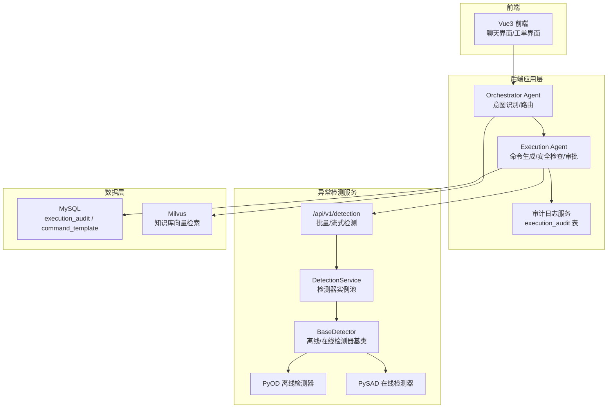
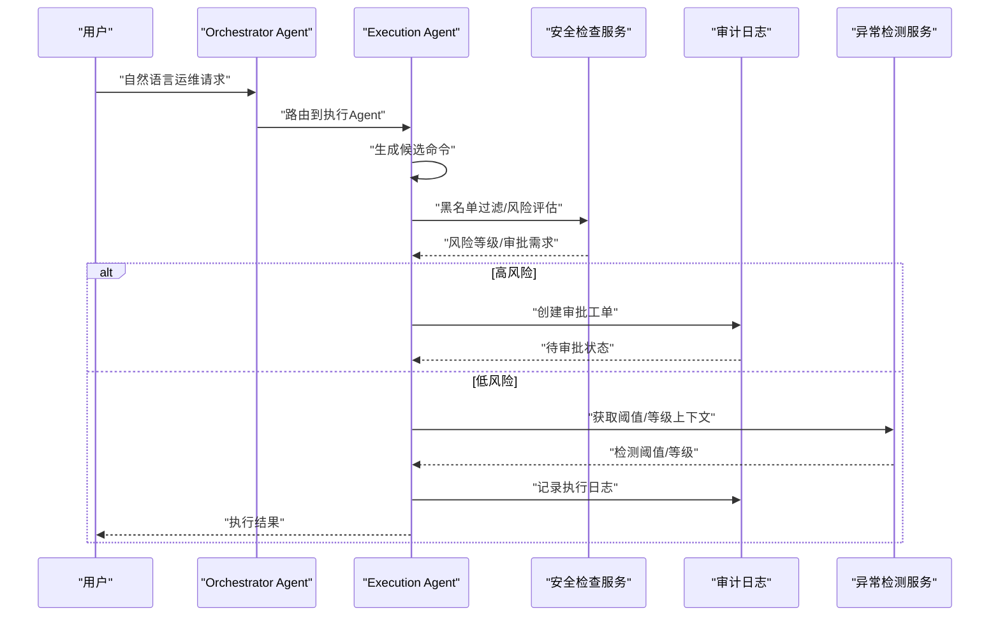
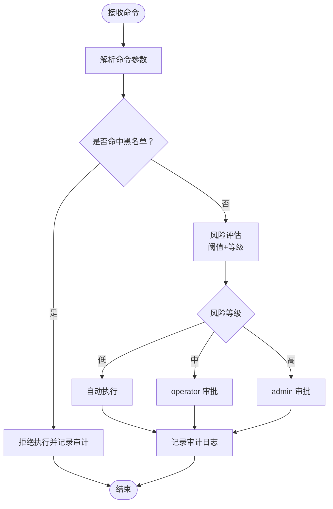
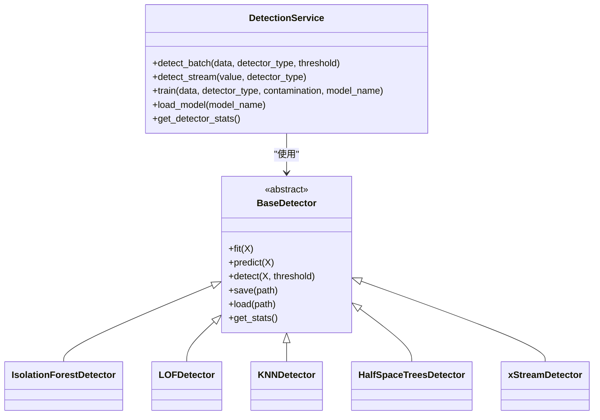
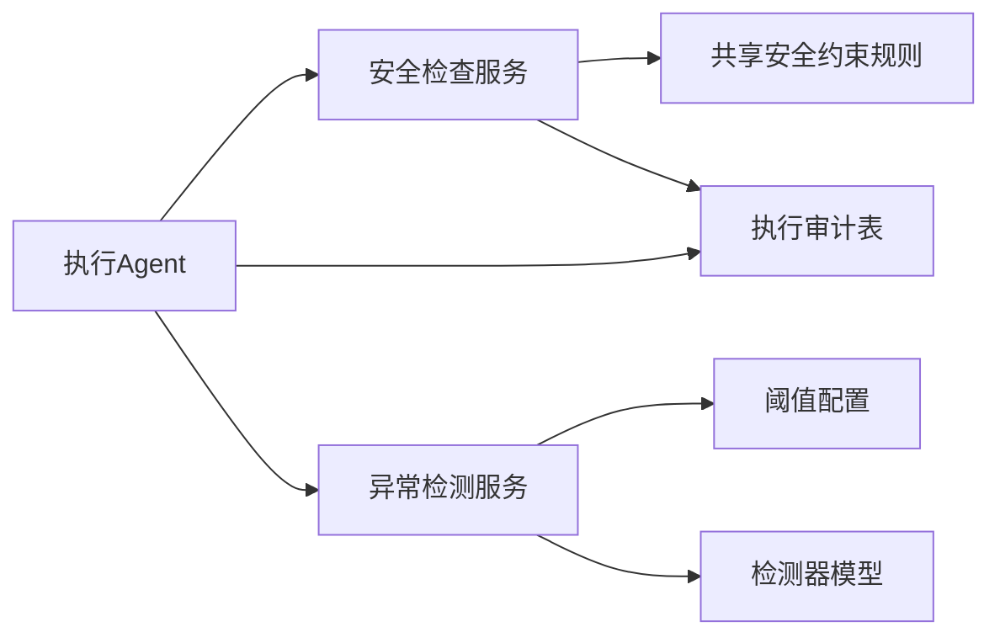

# 安全检查机制

<cite>
**本文引用的文件**
- [PROJECT_CONTEXT.md](file://PROJECT_CONTEXT.md)
- [开题报告_精简版.md](file://开题报告_精简版.md)
- [shared-safety-constraints.md](file://docs/prompts/shared-safety-constraints.md)
- [init.sql](file://sql/init.sql)
- [detection.py](file://anomaly-detection-service/app/api/routes/detection.py)
- [detection_service.py](file://anomaly-detection-service/app/services/detection_service.py)
- [detector_base.py](file://anomaly-detection-service/app/core/detector_base.py)
- [pyod_detector.py](file://anomaly-detection-service/app/core/pyod_detector.py)
- [pysad_detector.py](file://anomaly-detection-service/app/core/pysad_detector.py)
- [schemas.py](file://anomaly-detection-service/app/models/schemas.py)
- [config.py](file://anomaly-detection-service/app/config.py)
- [main.py](file://anomaly-detection-service/app/main.py)
</cite>

## 目录
1. [简介](#简介)
2. [项目结构](#项目结构)
3. [核心组件](#核心组件)
4. [架构总览](#架构总览)
5. [详细组件分析](#详细组件分析)
6. [依赖关系分析](#依赖关系分析)
7. [性能考虑](#性能考虑)
8. [故障排查指南](#故障排查指南)
9. [结论](#结论)
10. [附录](#附录)

## 简介
本文件围绕智能运维系统中的“命令安全检查机制”展开，系统性阐述从命令接收、初步过滤、深度分析到人工审批与执行的全流程安全防护体系。文档重点覆盖：
- 黑名单过滤：基于规则库的绝对禁止与需要审批的命令清单
- 风险评估算法：结合阈值与等级划分的评分机制
- 输入验证机制：参数校验、长度限制与注入防护
- 动态更新机制：规则与模型的热更新与版本演进
- 可视化展示：审计日志、风险等级与审批流程的可视化呈现

该机制与系统整体的“Orchestrator-Subagent 模式”相契合，确保在“自然语言问答—智能诊断—人工审批—执行”的闭环中，命令执行始终处于受控与可追溯的状态。

## 项目结构
系统采用前后端分离与多模块协作的架构，安全检查贯穿异常检测服务与后端应用层。关键模块如下：
- 异常检测服务（Python FastAPI）：负责实时/离线异常检测，提供检测阈值、等级划分与模型管理
- 后端应用层（Spring Boot）：负责意图识别、诊断与执行审批，其中包含命令安全检查与审计日志
- 数据层（MySQL）：存储命令模板、执行审计与知识库

图表来源
- [开题报告_精简版.md:118-152](file://开题报告_精简版.md#L118-L152)
- [detection.py:1-378](file://anomaly-detection-service/app/api/routes/detection.py#L1-L378)
- [detection_service.py:1-334](file://anomaly-detection-service/app/services/detection_service.py#L1-L334)
- [detector_base.py:1-339](file://anomaly-detection-service/app/core/detector_base.py#L1-L339)
- [pyod_detector.py:1-287](file://anomaly-detection-service/app/core/pyod_detector.py#L1-L287)
- [pysad_detector.py:1-358](file://anomaly-detection-service/app/core/pysad_detector.py#L1-L358)
- [init.sql:111-167](file://sql/init.sql#L111-L167)

章节来源
- [PROJECT_CONTEXT.md:120-149](file://PROJECT_CONTEXT.md#L120-L149)
- [开题报告_精简版.md:118-152](file://开题报告_精简版.md#L118-L152)

## 核心组件
- 安全检查服务（后端应用层）：负责命令黑名单过滤、风险评估、审批流程与审计日志
- 异常检测服务（Python）：提供检测阈值与等级划分，辅助安全检查的上下文信息
- 数据模型与规则：命令模板表、执行审计表与共享安全约束规则
- 配置与中间件：统一的阈值、日志与异常处理

章节来源
- [开题报告_精简版.md:275-301](file://开题报告_精简版.md#L275-L301)
- [shared-safety-constraints.md:1-396](file://docs/prompts/shared-safety-constraints.md#L1-L396)
- [init.sql:111-167](file://sql/init.sql#L111-L167)

## 架构总览
安全检查机制在“命令生成—风险评估—人工审批—执行—审计”的全链路中实施，异常检测服务提供阈值与等级作为风险评估的输入。

图表来源
- [开题报告_精简版.md:275-301](file://开题报告_精简版.md#L275-L301)
- [detection.py:55-146](file://anomaly-detection-service/app/api/routes/detection.py#L55-L146)
- [detection_service.py:76-118](file://anomaly-detection-service/app/services/detection_service.py#L76-L118)

## 详细组件分析

### 命令安全检查服务（后端应用层）
- 黑名单过滤：基于共享安全约束规则，对命令进行绝对禁止与需要审批的分类
- 风险评估：结合异常检测阈值与等级，确定命令风险等级
- 审批流程：根据风险等级与角色权限，触发相应审批级别
- 审计日志：记录命令、风险等级、审批状态与执行结果

图表来源
- [shared-safety-constraints.md:29-127](file://docs/prompts/shared-safety-constraints.md#L29-L127)
- [init.sql:111-167](file://sql/init.sql#L111-L167)

章节来源
- [开题报告_精简版.md:275-301](file://开题报告_精简版.md#L275-L301)
- [shared-safety-constraints.md:1-396](file://docs/prompts/shared-safety-constraints.md#L1-L396)
- [init.sql:111-167](file://sql/init.sql#L111-L167)

### 异常检测服务（阈值与等级）
异常检测服务提供统一的阈值与等级划分，为安全检查提供上下文信息：
- 阈值配置：异常阈值与告警阈值
- 等级划分：正常/警告/严重
- 检测器类型：离线（Isolation Forest、LOF、KNN）、在线（Half-Space Trees、xStream）

图表来源
- [detection_service.py:37-334](file://anomaly-detection-service/app/services/detection_service.py#L37-L334)
- [detector_base.py:31-339](file://anomaly-detection-service/app/core/detector_base.py#L31-L339)
- [pyod_detector.py:31-287](file://anomaly-detection-service/app/core/pyod_detector.py#L31-L287)
- [pysad_detector.py:37-358](file://anomaly-detection-service/app/core/pysad_detector.py#L37-L358)

章节来源
- [detection.py:55-146](file://anomaly-detection-service/app/api/routes/detection.py#L55-L146)
- [detection_service.py:76-118](file://anomaly-detection-service/app/services/detection_service.py#L76-L118)
- [config.py:108-137](file://anomaly-detection-service/app/config.py#L108-L137)

### 输入验证与注入防护
- 用户输入验证：长度限制、类型约束与字段校验
- 命令注入防护：参数化执行、禁止字符串拼接
- SQL 注入防护：参数化查询
- XSS 防护：HTML 转义

章节来源
- [shared-safety-constraints.md:200-230](file://docs/prompts/shared-safety-constraints.md#L200-L230)
- [schemas.py:63-236](file://anomaly-detection-service/app/models/schemas.py#L63-L236)

### 动态更新机制
- 规则更新：通过共享安全约束文档集中维护，版本化管理
- 模型更新：异常检测服务支持模型训练与加载，动态替换检测器
- 配置热更新：通过配置中心或环境变量覆盖，实现阈值与参数的动态调整

章节来源
- [shared-safety-constraints.md:390-396](file://docs/prompts/shared-safety-constraints.md#L390-L396)
- [detection_service.py:154-213](file://anomaly-detection-service/app/services/detection_service.py#L154-L213)
- [config.py:28-183](file://anomaly-detection-service/app/config.py#L28-L183)

### 可视化展示
- 审计日志可视化：执行审计表记录命令、风险等级、审批状态与执行结果
- 风险等级可视化：告警阈值与等级划分在前端以颜色与图标直观呈现
- 审批流程可视化：工单状态流转（待审批/已批准/已拒绝/执行中/已完成）

章节来源
- [init.sql:111-167](file://sql/init.sql#L111-L167)
- [detection.py:111-128](file://anomaly-detection-service/app/api/routes/detection.py#L111-L128)

## 依赖关系分析
- 安全检查服务依赖共享安全约束规则与命令模板表
- 执行Agent依赖安全检查服务与审计日志服务
- 异常检测服务为安全检查提供阈值与等级上下文
- 数据层通过 MySQL 存储审计与模板，支撑可视化展示

图表来源
- [shared-safety-constraints.md:1-396](file://docs/prompts/shared-safety-constraints.md#L1-L396)
- [init.sql:111-167](file://sql/init.sql#L111-L167)
- [detection.py:55-146](file://anomaly-detection-service/app/api/routes/detection.py#L55-L146)
- [config.py:108-137](file://anomaly-detection-service/app/config.py#L108-L137)

章节来源
- [开题报告_精简版.md:275-301](file://开题报告_精简版.md#L275-L301)
- [detection_service.py:315-334](file://anomaly-detection-service/app/services/detection_service.py#L315-L334)

## 性能考虑
- 检测阈值与等级划分：通过合理的阈值设置减少误报与漏报，提高审批效率
- 在线检测器：半空间树与 xStream 适合实时流式检测，降低延迟
- 模型持久化：定期保存检测器状态，避免频繁训练带来的性能损耗
- 日志与审计：异步写入与批量落库，减少对主流程的影响

## 故障排查指南
- 命令被拒绝：检查是否命中黑名单或需要审批；核对用户角色权限
- 风险评估异常：检查阈值配置与检测器类型；确认模型是否已训练
- 审计日志缺失：检查数据库连接与写入权限；确认审计服务状态
- 异常检测失败：查看异常检测服务日志；确认数据格式与参数校验

章节来源
- [main.py:145-172](file://anomaly-detection-service/app/main.py#L145-L172)
- [detection.py:147-152](file://anomaly-detection-service/app/api/routes/detection.py#L147-L152)

## 结论
本安全检查机制通过“黑名单过滤—风险评估—人工审批—审计日志”的多层防护，结合异常检测服务提供的阈值与等级上下文，确保命令执行在可控范围内。配合动态更新与可视化展示，系统能够在保障安全的同时，提升运维效率与可追溯性。

## 附录
- 共享安全约束规则：包含命令执行安全规则、数据安全规则、网络安全规则、用户输入安全与权限控制
- 命令模板与审计表：提供命令模板与执行审计的结构化存储
- 异常检测阈值与等级：提供阈值配置与等级划分的实现依据

章节来源
- [shared-safety-constraints.md:1-396](file://docs/prompts/shared-safety-constraints.md#L1-L396)
- [init.sql:111-167](file://sql/init.sql#L111-L167)
- [config.py:108-137](file://anomaly-detection-service/app/config.py#L108-L137)