# 审批流程设计

<cite>
**本文档引用的文件**
- [PROJECT_CONTEXT.md](file://PROJECT_CONTEXT.md)
- [开题报告_精简版.md](file://开题报告_精简版.md)
- [docker-compose.yml](file://docker-compose.yml)
- [config/milvus_collection.yaml](file://config/milvus_collection.yaml)
- [sql/init.sql](file://sql/init.sql)
- [anomaly-detection-service/app/main.py](file://anomaly-detection-service/app/main.py)
- [anomaly-detection-service/app/api/routes/detection.py](file://anomaly-detection-service/app/api/routes/detection.py)
- [anomaly-detection-service/app/services/detection_service.py](file://anomaly-detection-service/app/services/detection_service.py)
- [anomaly-detection-service/app/core/pyod_detector.py](file://anomaly-detection-service/app/core/pyod_detector.py)
- [anomaly-detection-service/app/core/pysad_detector.py](file://anomaly-detection-service/app/core/pysad_detector.py)
- [anomaly-detection-service/app/models/schemas.py](file://anomaly-detection-service/app/models/schemas.py)
- [docs/prompts/shared-safety-constraints.md](file://docs/prompts/shared-safety-constraints.md)
</cite>

## 目录
1. [简介](#简介)
2. [项目结构](#项目结构)
3. [核心组件](#核心组件)
4. [架构概览](#架构概览)
5. [详细组件分析](#详细组件分析)
6. [依赖分析](#依赖分析)
7. [性能考虑](#性能考虑)
8. [故障排除指南](#故障排除指南)
9. [结论](#结论)
10. [附录](#附录)

## 简介

本文档为智能运维系统创建完整的审批流程设计文档。该系统基于 NetData 监控数据，构建多 Agent 协同的智能运维平台，具备自然语言问答、智能故障诊断和命令执行等功能。

系统采用 Orchestrator-Subagent 模式，其中 Execution Agent 负责生成命令、风险评估、人工审批和执行。审批流程设计重点关注基于角色的权限矩阵、自动化决策链路和安全控制机制。

## 项目结构

智能运维系统采用分层架构设计，包含以下主要组件：

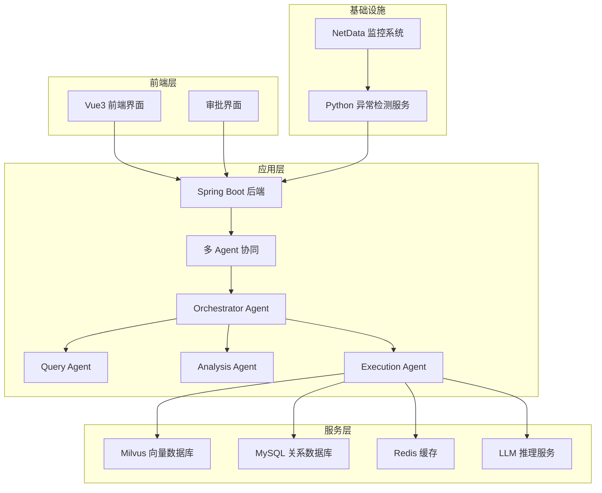

**图表来源**
- [PROJECT_CONTEXT.md:120-149](file://PROJECT_CONTEXT.md#L120-L149)
- [docker-compose.yml:23-357](file://docker-compose.yml#L23-L357)

**章节来源**
- [PROJECT_CONTEXT.md:16-166](file://PROJECT_CONTEXT.md#L16-L166)
- [docker-compose.yml:1-357](file://docker-compose.yml#L1-357)

## 核心组件

### 审批流程核心组件

系统中的审批流程涉及多个核心组件，每个组件都有明确的职责分工：

#### 1. 用户权限管理系统
- **角色定义**：admin、operator、viewer、super-admin
- **权限矩阵**：基于角色的细粒度权限控制
- **安全约束**：输入验证、命令注入防护、URL 安全验证

#### 2. 命令执行审计系统
- **审计表结构**：完整的命令执行生命周期跟踪
- **状态管理**：pending、approved、rejected、executing、completed、failed
- **风险评估**：low、medium、high、critical 等级

#### 3. 审批控制机制
- **自动审批**：低风险命令的自动化处理
- **人工审批**：中高风险命令的分级审批
- **越权审批**：super-admin 的特殊权限

**章节来源**
- [docs/prompts/shared-safety-constraints.md:235-242](file://docs/prompts/shared-safety-constraints.md#L235-L242)
- [sql/init.sql:114-138](file://sql/init.sql#L114-L138)

## 架构概览

审批流程在整个系统架构中的位置和交互关系如下：

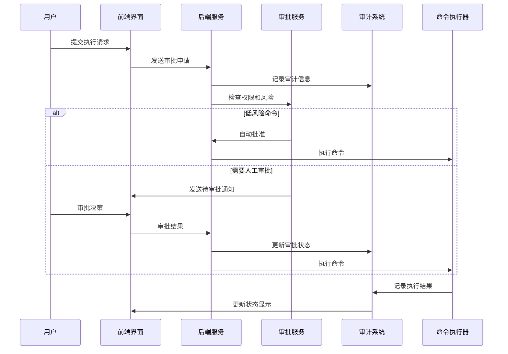

**图表来源**
- [开题报告_精简版.md:268-301](file://开题报告_精简版.md#L268-L301)
- [docs/prompts/shared-safety-constraints.md:235-242](file://docs/prompts/shared-safety-constraints.md#L235-L242)

## 详细组件分析

### 基于角色的审批权限矩阵

系统采用严格的基于角色的访问控制（RBAC）模型，定义了清晰的权限矩阵：

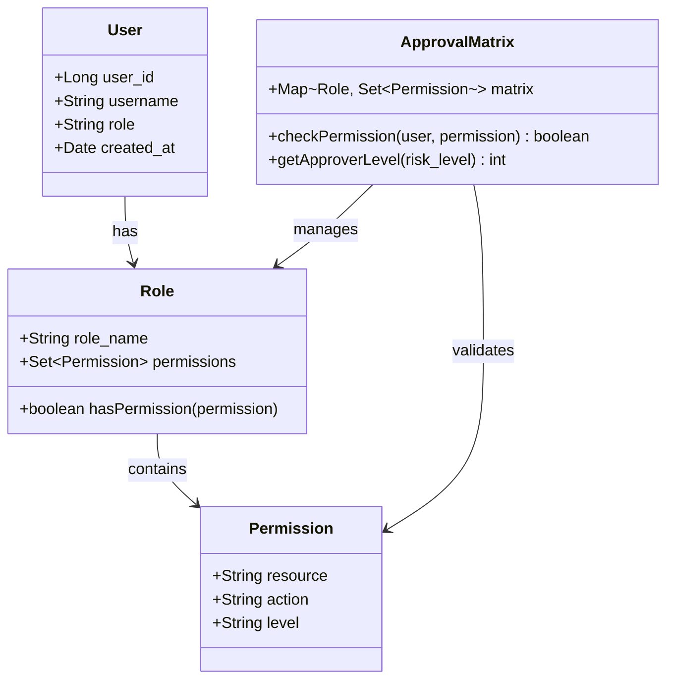

**图表来源**
- [docs/prompts/shared-safety-constraints.md:235-242](file://docs/prompts/shared-safety-constraints.md#L235-L242)
- [sql/init.sql:26-41](file://sql/init.sql#L26-L41)

#### 角色权限详细定义

| 角色 | 知识问答 | 故障诊断 | 自动执行命令 | 审批执行命令 | 越权审批 |
|------|---------|---------|-------------|-------------|---------|
| viewer | ✅ | ✅ | ❌ | ❌ | ❌ |
| operator | ✅ | ✅ | ✅ | ✅ | ❌ |
| admin | ✅ | ✅ | ✅ | ✅ | ❌ |
| super-admin | ✅ | ✅ | ✅ | ✅ + 越权审批 | ✅ |

**章节来源**
- [docs/prompts/shared-safety-constraints.md:235-242](file://docs/prompts/shared-safety-constraints.md#L235-L242)

### 审批流程自动化设计

#### 风险评估引擎

系统实现了多层次的风险评估机制：

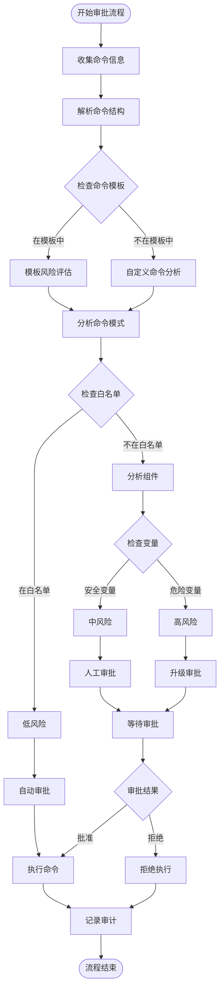

**图表来源**
- [开题报告_精简版.md:268-301](file://开题报告_精简版.md#L268-L301)
- [sql/init.sql:143-159](file://sql/init.sql#L143-L159)

#### 审批决策链路

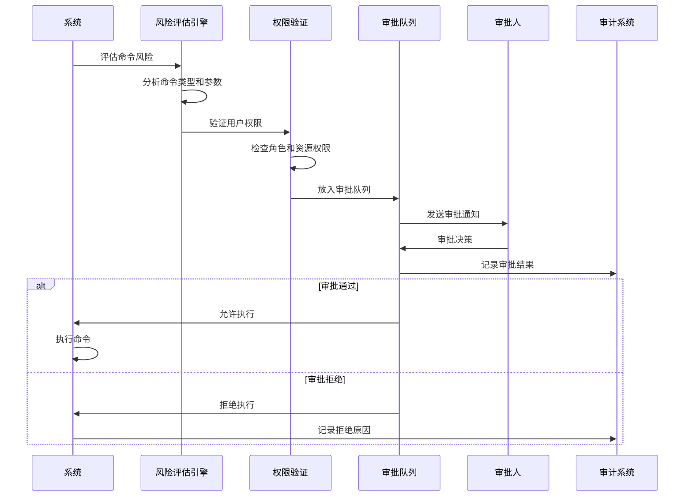

**图表来源**
- [docs/prompts/shared-safety-constraints.md:235-242](file://docs/prompts/shared-safety-constraints.md#L235-L242)
- [sql/init.sql:114-138](file://sql/init.sql#L114-L138)

### 审批规则引擎实现

#### 命令模板系统

系统通过命令模板实现标准化的风险控制：

| 模板类别 | 命令示例 | 风险等级 | 白名单 |
|---------|---------|---------|--------|
| 状态检查 | systemctl status {{service_name}} | low | ✅ |
| 日志查看 | journalctl -u {{service_name}} -n {{lines:100}} | low | ✅ |
| 进程查询 | ps aux \| grep {{process_name}} | low | ✅ |
| 服务重启 | systemctl restart {{service_name}} | medium | ❌ |
| 日志清理 | find {{log_path}} -name "*.log" -mtime +{{days:7}} -delete | medium | ❌ |

#### 风险评估规则

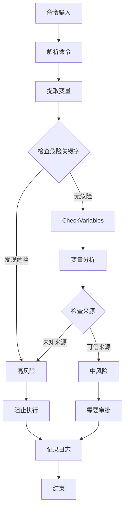

**图表来源**
- [sql/init.sql:162-170](file://sql/init.sql#L162-L170)

**章节来源**
- [sql/init.sql:143-170](file://sql/init.sql#L143-L170)

### 权限验证机制

#### 输入安全验证

系统实现了多层安全验证机制：

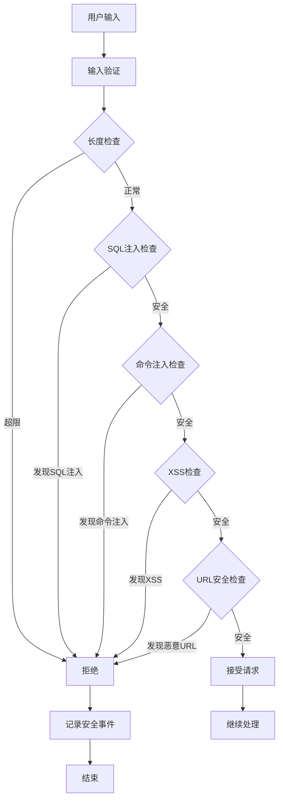

**图表来源**
- [docs/prompts/shared-safety-constraints.md:182-230](file://docs/prompts/shared-safety-constraints.md#L182-L230)

#### URL 安全验证

系统实现了严格的 URL 安全验证：

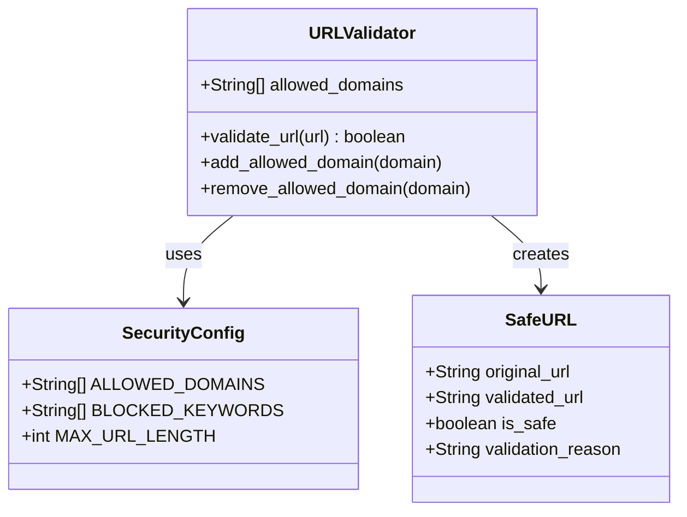

**图表来源**
- [docs/prompts/shared-safety-constraints.md:185-195](file://docs/prompts/shared-safety-constraints.md#L185-L195)

**章节来源**
- [docs/prompts/shared-safety-constraints.md:172-230](file://docs/prompts/shared-safety-constraints.md#L172-L230)

### 流程控制逻辑

#### 审批状态管理

系统实现了完整的审批状态管理：

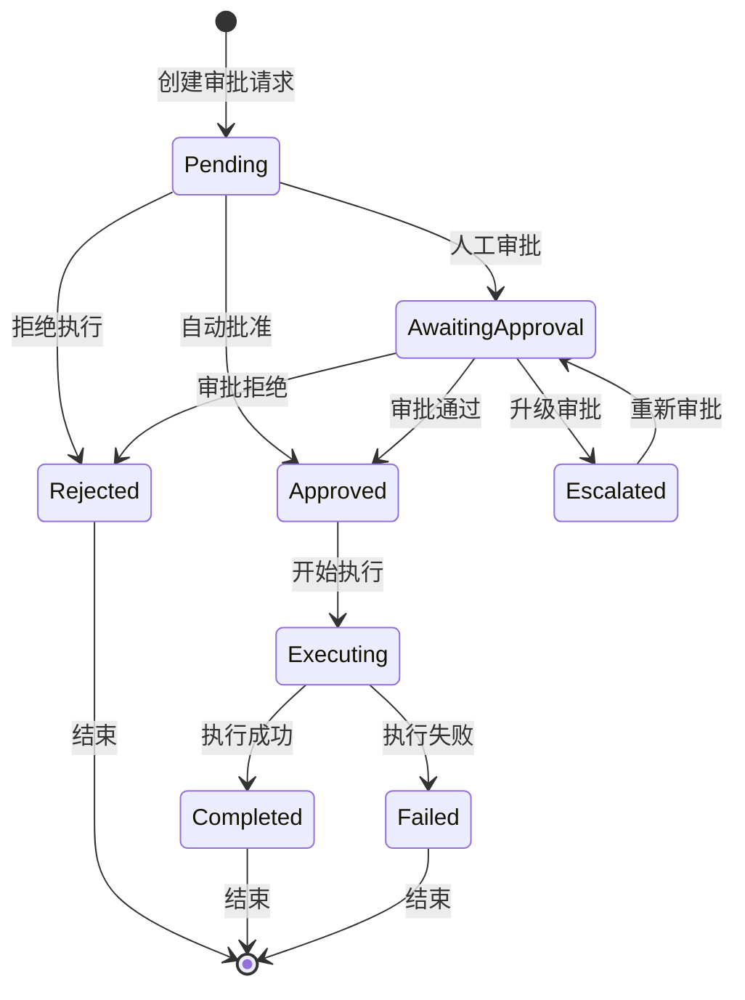

**图表来源**
- [sql/init.sql:124-124](file://sql/init.sql#L124-L124)

#### 审批队列管理

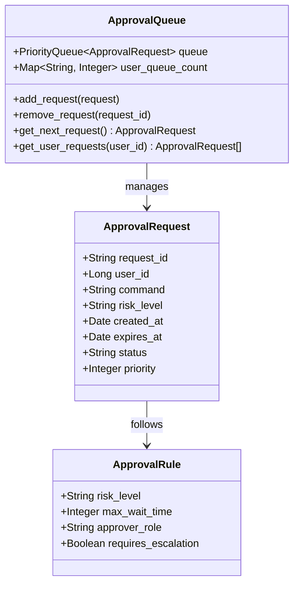

**图表来源**
- [sql/init.sql:114-138](file://sql/init.sql#L114-L138)

**章节来源**
- [sql/init.sql:114-138](file://sql/init.sql#L114-L138)

## 依赖分析

### 组件耦合关系

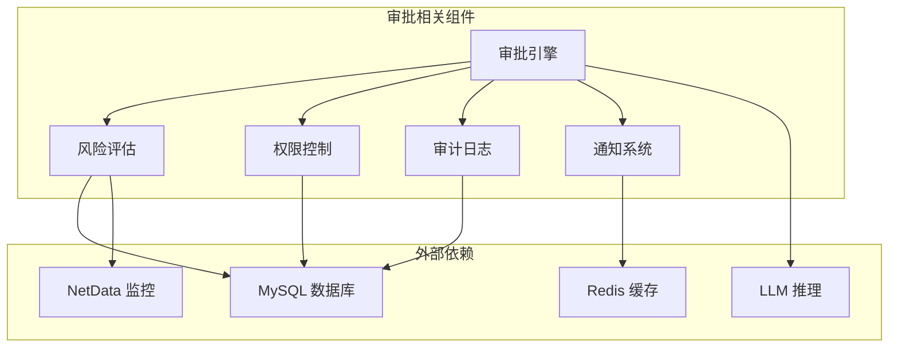

**图表来源**
- [docker-compose.yml:23-357](file://docker-compose.yml#L23-L357)
- [PROJECT_CONTEXT.md:120-149](file://PROJECT_CONTEXT.md#L120-L149)

### 数据流依赖

系统中的数据流依赖关系如下：

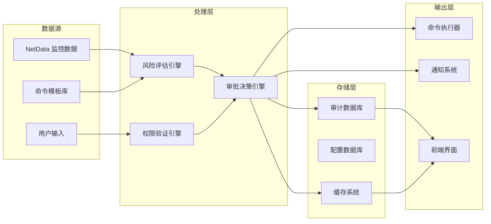

**图表来源**
- [开题报告_精简版.md:268-301](file://开题报告_精简版.md#L268-L301)
- [sql/init.sql:114-138](file://sql/init.sql#L114-L138)

**章节来源**
- [docker-compose.yml:23-357](file://docker-compose.yml#L23-L357)
- [sql/init.sql:114-138](file://sql/init.sql#L114-L138)

## 性能考虑

### 审批流程性能优化

系统在审批流程中采用了多项性能优化策略：

1. **异步处理**：审批请求采用异步队列处理，避免阻塞主线程
2. **缓存机制**：频繁访问的权限信息和配置数据使用 Redis 缓存
3. **批量处理**：多个审批请求可以批量处理以提高效率
4. **负载均衡**：审批服务支持水平扩展以应对高并发场景

### 监控和统计功能

系统提供了完善的监控和统计功能：

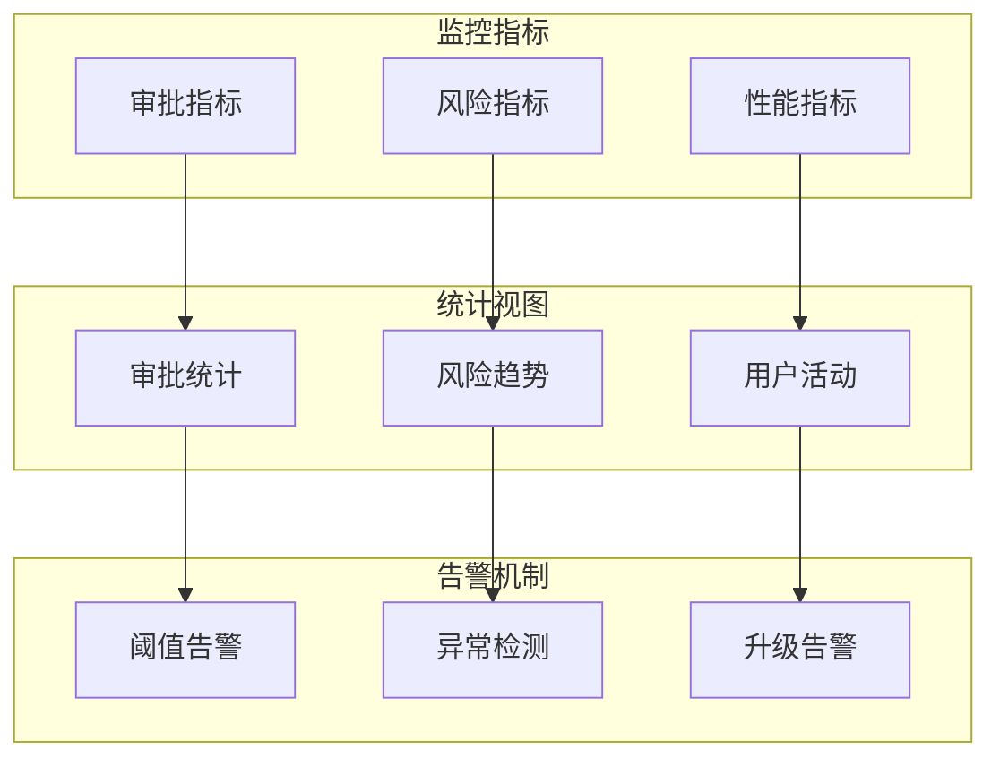

**图表来源**
- [sql/init.sql:249-274](file://sql/init.sql#L249-L274)

**章节来源**
- [sql/init.sql:249-274](file://sql/init.sql#L249-L274)

## 故障排除指南

### 审批异常处理机制

系统实现了多层次的异常处理机制：

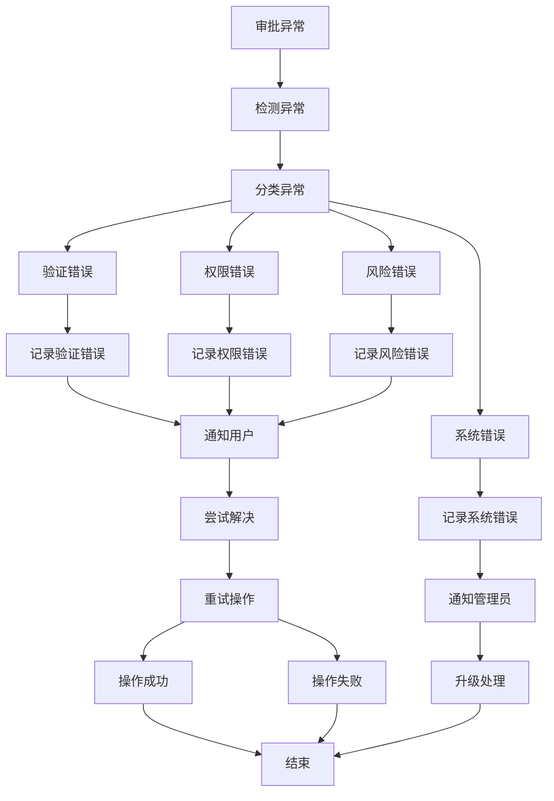

**图表来源**
- [docs/prompts/shared-safety-constraints.md:360-378](file://docs/prompts/shared-safety-constraints.md#L360-L378)

### 常见问题诊断

#### 审批流程常见问题

| 问题类型 | 症状 | 可能原因 | 解决方案 |
|---------|------|---------|---------|
| 审批超时 | 审批请求长时间未处理 | 审批队列拥堵、审批人离线 | 检查审批队列状态、通知审批人 |
| 权限不足 | 审批被拒绝 | 用户角色权限不够 | 提升用户角色、检查权限配置 |
| 风险评估错误 | 风险等级判定不准确 | 风险评估规则配置错误 | 调整风险评估参数、更新规则 |
| 系统异常 | 审批服务不可用 | 服务宕机、数据库连接失败 | 检查服务状态、重启服务 |

**章节来源**
- [docs/prompts/shared-safety-constraints.md:360-378](file://docs/prompts/shared-safety-constraints.md#L360-L378)

## 结论

本文档详细阐述了智能运维系统的审批流程设计，包括基于角色的权限矩阵、自动化审批决策链路、安全控制机制和监控统计功能。系统通过多层次的安全验证、严格的权限控制和完善的审计机制，确保了审批流程的安全性和可靠性。

审批流程设计充分考虑了实际运维场景的需求，既保证了操作的安全性，又提高了运维效率。通过自动化的风险评估和分级审批机制，系统能够在保证安全的前提下，最大化地减少人工干预，提高整体运维效率。

## 附录

### 审批流程配置选项

系统提供了灵活的配置选项，支持不同场景下的审批需求：

| 配置项 | 默认值 | 说明 |
|-------|--------|------|
| llm.provider | deepseek | LLM 提供商选择 |
| llm.model | deepseek-chat | LLM 模型名称 |
| execution.auto_approve_low_risk | true | 是否自动批准低风险命令 |
| execution.max_wait_time | 3600 | 命令执行最大等待时间（秒） |

**章节来源**
- [sql/init.sql:236-244](file://sql/init.sql#L236-L244)