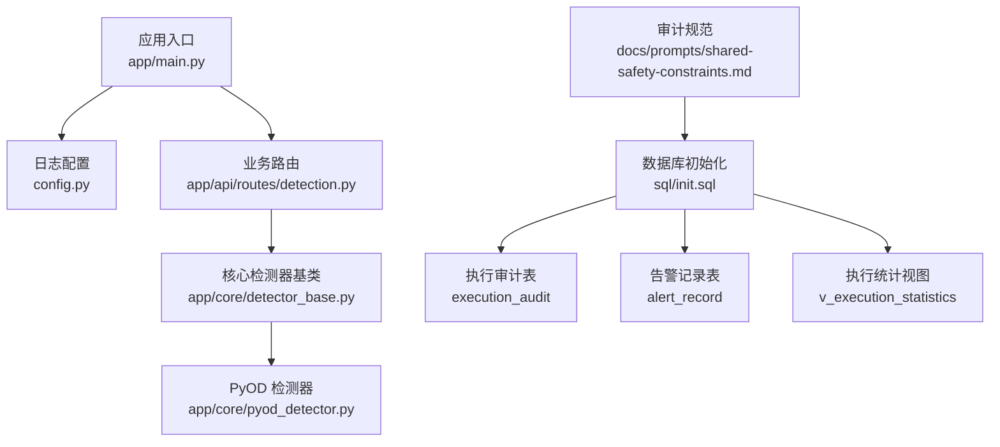
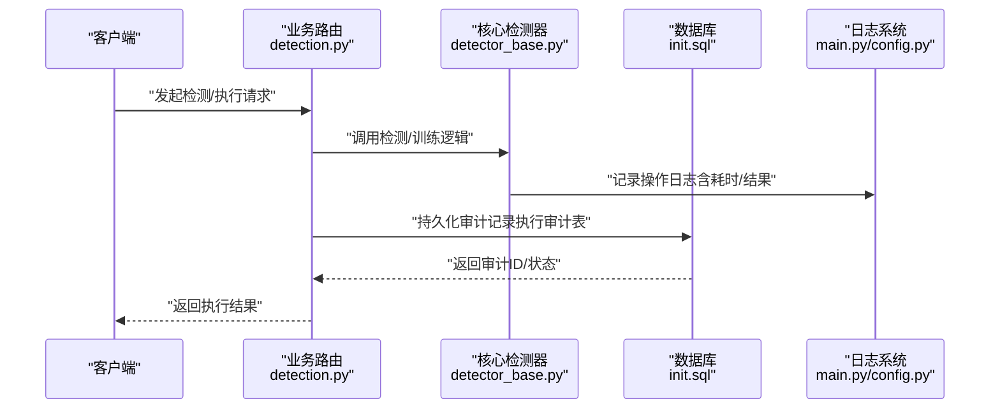
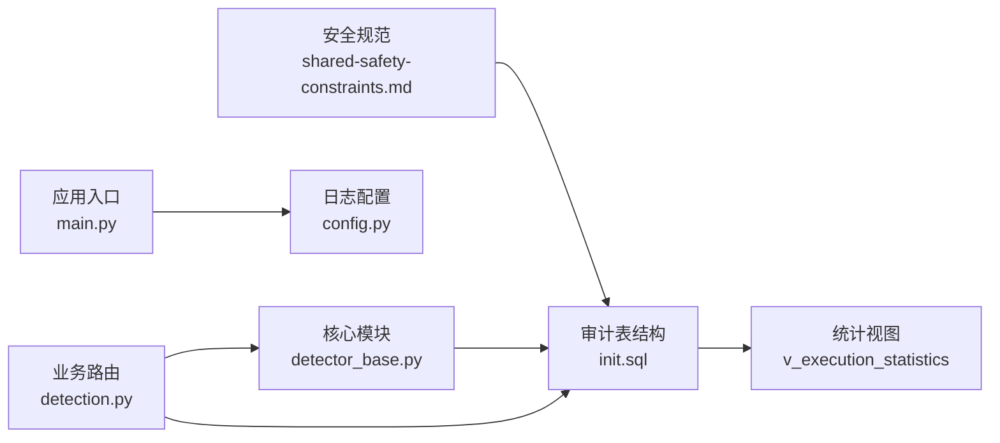

# 审计日志管理

<cite>
**本文引用的文件**
- [shared-safety-constraints.md](file://docs/prompts/shared-safety-constraints.md)
- [init.sql](file://sql/init.sql)
- [main.py](file://anomaly-detection-service/app/main.py)
- [config.py](file://anomaly-detection-service/app/config.py)
- [detection.py](file://anomaly-detection-service/app/api/routes/detection.py)
- [detector_base.py](file://anomaly-detection-service/app/core/detector_base.py)
- [pyod_detector.py](file://anomaly-detection-service/app/core/pyod_detector.py)
</cite>

## 目录
1. [简介](#简介)
2. [项目结构](#项目结构)
3. [核心组件](#核心组件)
4. [架构总览](#架构总览)
5. [详细组件分析](#详细组件分析)
6. [依赖关系分析](#依赖关系分析)
7. [性能考虑](#性能考虑)
8. [故障排查指南](#故障排查指南)
9. [结论](#结论)
10. [附录](#附录)

## 简介
本文件围绕智能运维系统的审计日志管理进行系统化说明，覆盖审计日志的完整生命周期：生成、存储、查询与归档；明确数据结构设计（必填/可选/扩展字段）；给出日志格式标准化、异步写入与批量处理的实现思路；并提供查询接口设计、权限控制与合规性要求的实践建议。文档以仓库中的安全规范、数据库初始化脚本与日志配置为依据，结合实际代码位置进行定位与说明。

## 项目结构
与审计日志管理直接相关的文件与职责如下：
- 安全与审计规范：定义日志格式、必须记录事件、权限矩阵与审批流程等
- 数据库初始化：提供审计表结构、索引与视图，支撑审计数据的持久化与查询
- 应用入口与日志配置：集中配置日志级别、轮转与保留策略
- 业务路由与核心模块：在关键操作点产生审计日志，体现“生成”环节
- 查询接口设计：基于数据库视图与表，设计审计查询能力

图表来源
- [main.py:1-217](file://anomaly-detection-service/app/main.py#L1-L217)
- [config.py:1-183](file://anomaly-detection-service/app/config.py#L1-L183)
- [detection.py:1-400](file://anomaly-detection-service/app/api/routes/detection.py#L1-L400)
- [detector_base.py:1-350](file://anomaly-detection-service/app/core/detector_base.py#L1-L350)
- [pyod_detector.py:1-220](file://anomaly-detection-service/app/core/pyod_detector.py#L1-L220)
- [shared-safety-constraints.md:296-324](file://docs/prompts/shared-safety-constraints.md#L296-L324)
- [init.sql:111-138](file://sql/init.sql#L111-L138)
- [init.sql:173-196](file://sql/init.sql#L173-L196)
- [init.sql:262-274](file://sql/init.sql#L262-L274)

章节来源
- [main.py:1-217](file://anomaly-detection-service/app/main.py#L1-L217)
- [config.py:148-154](file://anomaly-detection-service/app/config.py#L148-L154)
- [shared-safety-constraints.md:296-324](file://docs/prompts/shared-safety-constraints.md#L296-L324)
- [init.sql:111-138](file://sql/init.sql#L111-L138)
- [init.sql:173-196](file://sql/init.sql#L173-L196)
- [init.sql:262-274](file://sql/init.sql#L262-L274)

## 核心组件
- 审计日志规范与事件清单：定义标准日志格式与必须记录的事件类型，确保审计覆盖面与一致性
- 审计数据表结构：提供执行审计表与相关统计视图，支撑审计数据的存储与查询
- 日志配置与轮转：统一的日志级别、轮转大小与保留策略，保障审计日志的长期可用性
- 业务操作日志：在关键业务流程（如检测、训练、执行）中记录操作上下文，形成审计证据链
- 查询接口设计：基于数据库视图与表，提供按时间、风险等级、状态等维度的审计查询能力

章节来源
- [shared-safety-constraints.md:296-324](file://docs/prompts/shared-safety-constraints.md#L296-L324)
- [init.sql:111-138](file://sql/init.sql#L111-L138)
- [init.sql:262-274](file://sql/init.sql#L262-L274)
- [config.py:148-154](file://anomaly-detection-service/app/config.py#L148-L154)
- [detection.py:1-400](file://anomaly-detection-service/app/api/routes/detection.py#L1-L400)

## 架构总览
下图展示了审计日志在系统中的生成、存储与查询路径，以及与安全规范的对应关系：

图表来源
- [detection.py:1-400](file://anomaly-detection-service/app/api/routes/detection.py#L1-L400)
- [detector_base.py:1-350](file://anomaly-detection-service/app/core/detector_base.py#L1-L350)
- [init.sql:111-138](file://sql/init.sql#L111-L138)
- [main.py:46-53](file://anomaly-detection-service/app/main.py#L46-L53)
- [config.py:148-154](file://anomaly-detection-service/app/config.py#L148-L154)

## 详细组件分析

### 审计日志数据结构设计
- 必填字段
  - 时间戳：记录事件发生的确切时刻
  - 事件类型：标识审计事件类别（如命令执行、风险评估、审批决策等）
  - 用户标识：记录操作人或会话主体
  - 操作动作：具体的操作内容或命令
  - 资源标识：受影响的资源（主机、服务、配置项等）
  - 结果状态：成功/失败/进行中等
- 可选字段
  - IP地址：来源IP，便于溯源
  - 会话ID：关联同一会话的连续事件
  - 持续时间：毫秒级，用于性能审计
  - 审批人/审批时间：用于审批流程审计
  - 错误信息：失败原因摘要
- 扩展字段
  - 风险等级与分数：用于风险评估与统计
  - 执行耗时：毫秒级，用于性能审计
  - 执行结果：执行后的输出或状态
  - 其他业务上下文：如目标主机、命令类型等

章节来源
- [shared-safety-constraints.md:296-324](file://docs/prompts/shared-safety-constraints.md#L296-L324)

### 审计日志生成与落库
- 生成时机
  - 用户登录/登出、命令生成、风险评估、审批决策、命令执行、配置变更、数据访问等关键节点
- 生成内容
  - 标准化日志格式，包含必填/可选字段
  - 在核心检测器与业务路由中记录关键操作（如训练开始/结束、检测完成、异常判定等）
- 落库策略
  - 将审计记录写入执行审计表，包含请求ID、用户ID、命令、风险等级、状态、耗时、错误信息等
  - 通过唯一请求ID保证幂等性与关联性

章节来源
- [shared-safety-constraints.md:296-324](file://docs/prompts/shared-safety-constraints.md#L296-L324)
- [init.sql:111-138](file://sql/init.sql#L111-L138)
- [detector_base.py:150-200](file://anomaly-detection-service/app/core/detector_base.py#L150-L200)
- [detection.py:80-150](file://anomaly-detection-service/app/api/routes/detection.py#L80-L150)

### 审计日志存储与归档
- 存储结构
  - 执行审计表：记录命令执行的全过程，支持按状态、风险等级、时间等维度查询
  - 告警记录表：记录告警触发与解决过程，便于关联审计
  - 执行统计视图：按日期与风险等级聚合统计，辅助归档与报表
- 归档策略
  - 基于时间维度的冷热分层：近期高频查询的数据保留在热存储，历史数据迁移至归档存储
  - 基于风险等级的分级存储：高风险事件优先保留更长时间
  - 定期清理：超过保留期限的数据进行删除或迁移

章节来源
- [init.sql:111-138](file://sql/init.sql#L111-L138)
- [init.sql:173-196](file://sql/init.sql#L173-L196)
- [init.sql:262-274](file://sql/init.sql#L262-L274)

### 审计日志查询接口设计
- 查询维度
  - 时间范围：创建时间、审批时间
  - 用户/会话：用户ID、会话ID
  - 状态/结果：状态、结果
  - 风险等级：低/中/高/极高
  - 资源：目标主机、命令类型
- 接口建议
  - 分页查询：支持按时间倒序分页
  - 过滤条件：多条件组合过滤
  - 聚合统计：通过视图提供按日期与风险等级的统计
  - 导出能力：支持CSV/JSON导出用于合规审查

章节来源
- [init.sql:111-138](file://sql/init.sql#L111-L138)
- [init.sql:262-274](file://sql/init.sql#L262-L274)

### 权限控制与合规性
- 权限矩阵
  - 不同角色对审计日志的查看与导出权限不同，遵循最小权限原则
- 合规要求
  - 日志保留期限不少于90天
  - 敏感信息脱敏（如密码、密钥），避免在日志中泄露
  - 审批流程与越权审批需在日志中留痕

章节来源
- [shared-safety-constraints.md:23-26](file://docs/prompts/shared-safety-constraints.md#L23-L26)
- [shared-safety-constraints.md:132-157](file://docs/prompts/shared-safety-constraints.md#L132-L157)
- [shared-safety-constraints.md:233-258](file://docs/prompts/shared-safety-constraints.md#L233-L258)

### 日志格式标准化、异步写入与批量处理
- 格式标准化
  - 采用统一JSON结构，包含时间戳、事件类型、用户、动作、资源、结果、IP、会话ID、耗时等字段
- 异步写入
  - 使用日志库的异步能力，将审计日志写入队列，降低对主业务的影响
- 批量处理
  - 将多个审计事件合并为批次，减少数据库写入压力
  - 结合数据库事务与批量插入，提升吞吐量

章节来源
- [shared-safety-constraints.md:296-312](file://docs/prompts/shared-safety-constraints.md#L296-L312)
- [main.py:46-53](file://anomaly-detection-service/app/main.py#L46-L53)
- [config.py:148-154](file://anomaly-detection-service/app/config.py#L148-L154)

## 依赖关系分析
审计日志相关的关键依赖与耦合关系如下：
- 安全规范与数据库表结构强关联：规范定义的事件类型与字段映射到数据库表结构
- 应用入口与日志配置：统一的日志级别、轮转与保留策略，保障审计日志的长期可用性
- 业务路由与核心模块：在关键操作点产生审计日志，形成完整的证据链
- 查询接口与统计视图：通过视图与表联合查询，满足审计与合规需求

图表来源
- [shared-safety-constraints.md:296-324](file://docs/prompts/shared-safety-constraints.md#L296-L324)
- [init.sql:111-138](file://sql/init.sql#L111-L138)
- [init.sql:262-274](file://sql/init.sql#L262-L274)
- [main.py:46-53](file://anomaly-detection-service/app/main.py#L46-L53)
- [config.py:148-154](file://anomaly-detection-service/app/config.py#L148-L154)
- [detection.py:1-400](file://anomaly-detection-service/app/api/routes/detection.py#L1-L400)
- [detector_base.py:1-350](file://anomaly-detection-service/app/core/detector_base.py#L1-L350)

章节来源
- [shared-safety-constraints.md:296-324](file://docs/prompts/shared-safety-constraints.md#L296-L324)
- [init.sql:111-138](file://sql/init.sql#L111-L138)
- [init.sql:262-274](file://sql/init.sql#L262-L274)
- [main.py:46-53](file://anomaly-detection-service/app/main.py#L46-L53)
- [config.py:148-154](file://anomaly-detection-service/app/config.py#L148-L154)
- [detection.py:1-400](file://anomaly-detection-service/app/api/routes/detection.py#L1-L400)
- [detector_base.py:1-350](file://anomaly-detection-service/app/core/detector_base.py#L1-L350)

## 性能考虑
- 日志轮转与保留：合理设置轮转大小与保留周期，平衡磁盘占用与查询效率
- 批量写入：将多条审计记录合并提交，减少数据库往返开销
- 索引优化：在常用查询字段（如创建时间、状态、风险等级）上建立索引，提升查询性能
- 异步处理：将日志写入与业务处理解耦，避免阻塞主流程

## 故障排查指南
- 日志无法写入
  - 检查日志配置（级别、轮转、保留）是否正确
  - 确认日志目录权限与磁盘空间
- 审计数据缺失
  - 核对业务关键节点是否记录日志
  - 检查数据库连接与事务提交
- 查询性能差
  - 为常用查询字段添加索引
  - 使用分页与条件过滤，避免全表扫描

章节来源
- [config.py:148-154](file://anomaly-detection-service/app/config.py#L148-L154)
- [main.py:46-53](file://anomaly-detection-service/app/main.py#L46-L53)
- [init.sql:111-138](file://sql/init.sql#L111-L138)

## 结论
本文件基于仓库中的安全规范与数据库脚本，给出了审计日志的全生命周期管理方案：从数据结构设计、生成与落库、存储与归档，到查询接口与权限控制，并结合日志配置与性能优化建议，形成了一套可落地的实施框架。建议在后续开发中严格遵循规范，完善关键节点的日志记录，并通过视图与接口支撑审计与合规需求。

## 附录
- 审计事件清单（摘自安全规范）
  - 用户登录/登出
  - 命令生成
  - 风险评估
  - 审批决策
  - 命令执行
  - 配置变更
  - 数据访问

章节来源
- [shared-safety-constraints.md:314-322](file://docs/prompts/shared-safety-constraints.md#L314-L322)