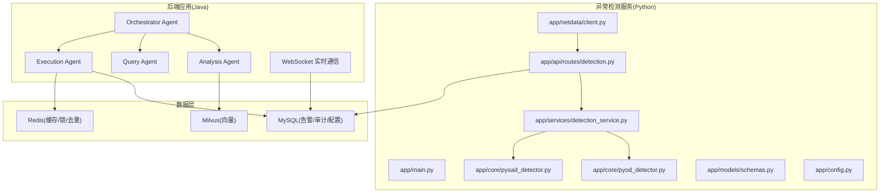
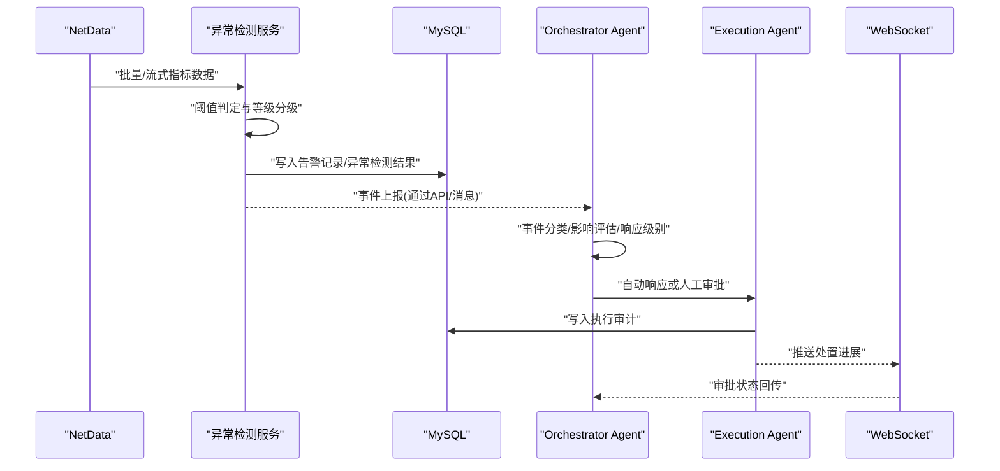
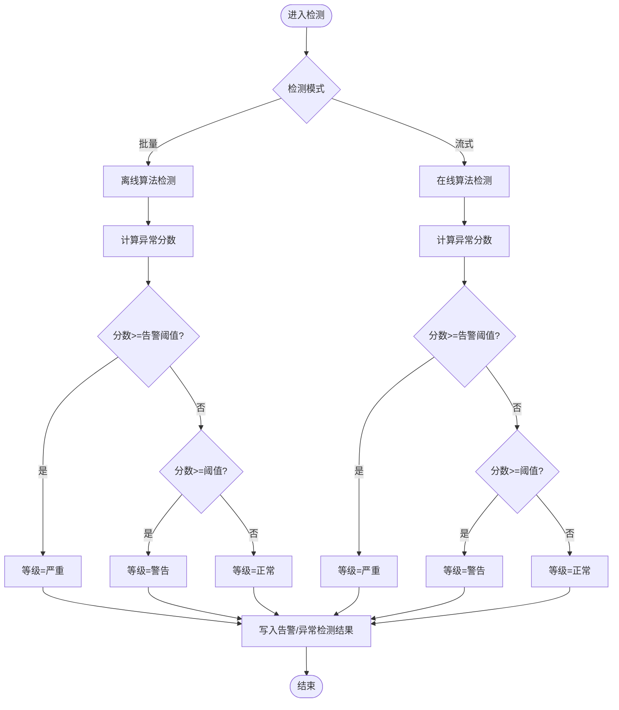
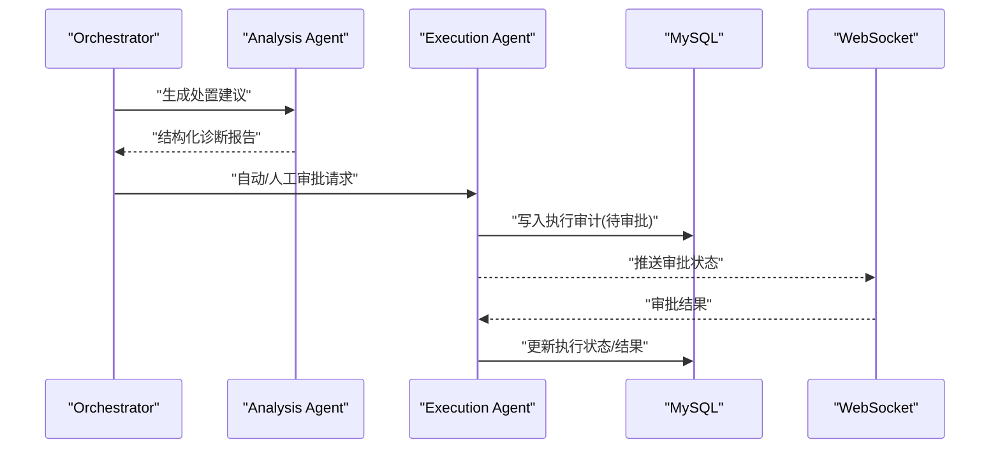
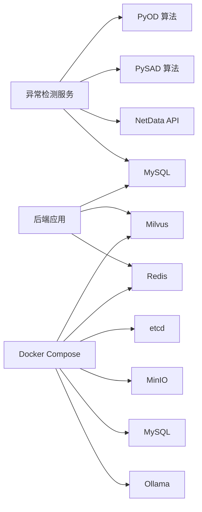

# 应急响应流程

<cite>
**本文引用的文件**
- [PROJECT_CONTEXT.md](file://PROJECT_CONTEXT.md)
- [开题报告_精简版.md](file://开题报告_精简版.md)
- [docker-compose.yml](file://docker-compose.yml)
- [anomaly-detection-service/app/main.py](file://anomaly-detection-service/app/main.py)
- [anomaly-detection-service/app/api/routes/detection.py](file://anomaly-detection-service/app/api/routes/detection.py)
- [anomaly-detection-service/app/core/pyod_detector.py](file://anomaly-detection-service/app/core/pyod_detector.py)
- [anomaly-detection-service/app/core/pysad_detector.py](file://anomaly-detection-service/app/core/pysad_detector.py)
- [anomaly-detection-service/app/services/detection_service.py](file://anomaly-detection-service/app/services/detection_service.py)
- [anomaly-detection-service/app/models/schemas.py](file://anomaly-detection-service/app/models/schemas.py)
- [anomaly-detection-service/app/config.py](file://anomaly-detection-service/app/config.py)
- [anomaly-detection-service/app/netdata/client.py](file://anomaly-detection-service/app/netdata/client.py)
- [sql/init.sql](file://sql/init.sql)
- [scripts/verify-env.sh](file://scripts/verify-env.sh)
- [scripts/verify-env.ps1](file://scripts/verify-env.ps1)
</cite>

## 目录
1. [简介](#简介)
2. [项目结构](#项目结构)
3. [核心组件](#核心组件)
4. [架构总览](#架构总览)
5. [详细组件分析](#详细组件分析)
6. [依赖分析](#依赖分析)
7. [性能考虑](#性能考虑)
8. [故障排查指南](#故障排查指南)
9. [结论](#结论)
10. [附录](#附录)

## 简介
本文件面向“智能运维问答与执行系统”的应急响应流程设计，围绕安全事件的识别、报告与处置闭环展开，结合系统已实现的异常检测能力与数据库审计能力，给出事件分类、影响评估、响应级别确定、技术手段（系统隔离、威胁阻断、数据恢复）、自动与人工协同机制，以及演练与持续改进方案。文档严格基于仓库现有代码与配置，避免臆造。

## 项目结构
系统采用多模块分层组织，核心与应急响应相关的关键模块如下：
- 异常检测服务（Python FastAPI）：提供批量/流式异常检测、NetData 集成、阈值分级与结果落库
- 后端应用（Java Spring Boot）：Agent 架构、RAG、执行审批、WebSocket 实时通信
- 数据层：MySQL（告警、执行审计、配置等）、Milvus（向量检索）、Redis（缓存/锁/去重）
- 前端：Vue3（聊天、工单、知识库）

**图表来源**
- [anomaly-detection-service/app/main.py:1-217](file://anomaly-detection-service/app/main.py#L1-L217)
- [anomaly-detection-service/app/api/routes/detection.py:1-378](file://anomaly-detection-service/app/api/routes/detection.py#L1-L378)
- [anomaly-detection-service/app/services/detection_service.py:1-334](file://anomaly-detection-service/app/services/detection_service.py#L1-L334)
- [anomaly-detection-service/app/core/pyod_detector.py:1-287](file://anomaly-detection-service/app/core/pyod_detector.py#L1-L287)
- [anomaly-detection-service/app/core/pysad_detector.py:1-358](file://anomaly-detection-service/app/core/pysad_detector.py#L1-L358)
- [anomaly-detection-service/app/models/schemas.py:1-329](file://anomaly-detection-service/app/models/schemas.py#L1-L329)
- [anomaly-detection-service/app/config.py:1-183](file://anomaly-detection-service/app/config.py#L1-L183)
- [anomaly-detection-service/app/netdata/client.py:1-301](file://anomaly-detection-service/app/netdata/client.py#L1-L301)
- [sql/init.sql:173-217](file://sql/init.sql#L173-L217)
- [docker-compose.yml:23-357](file://docker-compose.yml#L23-L357)

**章节来源**
- [PROJECT_CONTEXT.md:120-149](file://PROJECT_CONTEXT.md#L120-L149)
- [开题报告_精简版.md:118-152](file://开题报告_精简版.md#L118-L152)

## 核心组件
- 异常检测服务：提供批量/流式检测、阈值分级、NetData 集成、结果落库，支撑事件识别与初步分级
- 执行审计与告警：MySQL 表结构定义了告警记录与执行审计，支持事件状态流转与溯源
- 配置中心：集中管理阈值、检测器参数、日志与缓存等，便于应急响应参数化调整
- 健康检查与环境验证：Docker Compose 与脚本提供服务健康检查与端口占用检查，保障应急通道畅通

**章节来源**
- [anomaly-detection-service/app/api/routes/detection.py:55-378](file://anomaly-detection-service/app/api/routes/detection.py#L55-L378)
- [anomaly-detection-service/app/services/detection_service.py:37-334](file://anomaly-detection-service/app/services/detection_service.py#L37-L334)
- [anomaly-detection-service/app/config.py:107-146](file://anomaly-detection-service/app/config.py#L107-L146)
- [sql/init.sql:173-217](file://sql/init.sql#L173-L217)
- [scripts/verify-env.sh:63-286](file://scripts/verify-env.sh#L63-L286)
- [scripts/verify-env.ps1:35-227](file://scripts/verify-env.ps1#L35-L227)

## 架构总览
应急响应以“异常检测→事件上报→分级评估→自动处置/人工审批→结果审计”为主线，结合系统现有模块形成闭环：

**图表来源**
- [anomaly-detection-service/app/netdata/client.py:138-198](file://anomaly-detection-service/app/netdata/client.py#L138-L198)
- [anomaly-detection-service/app/api/routes/detection.py:55-220](file://anomaly-detection-service/app/api/routes/detection.py#L55-L220)
- [sql/init.sql:173-217](file://sql/init.sql#L173-L217)
- [PROJECT_CONTEXT.md:43-61](file://PROJECT_CONTEXT.md#L43-L61)

## 详细组件分析

### 事件识别与阈值分级
- 批量检测：支持 isolation_forest、lof、knn 等离线算法，按阈值与告警阈值输出 NORMAL/WARNING/CRITICAL 等级
- 流式检测：支持 half_space_trees、xstream 在线算法，单值评分并归一化
- NetData 集成：直接拉取指标数据进行检测，便于与系统监控联动
- 结果落库：异常检测结果与告警记录表结构一致，便于统一查询与审计

**图表来源**
- [anomaly-detection-service/app/api/routes/detection.py:79-152](file://anomaly-detection-service/app/api/routes/detection.py#L79-L152)
- [anomaly-detection-service/app/api/routes/detection.py:181-218](file://anomaly-detection-service/app/api/routes/detection.py#L181-L218)
- [anomaly-detection-service/app/config.py:132-136](file://anomaly-detection-service/app/config.py#L132-L136)
- [sql/init.sql:173-217](file://sql/init.sql#L173-L217)

**章节来源**
- [anomaly-detection-service/app/api/routes/detection.py:55-378](file://anomaly-detection-service/app/api/routes/detection.py#L55-L378)
- [anomaly-detection-service/app/config.py:132-136](file://anomaly-detection-service/app/config.py#L132-L136)
- [anomaly-detection-service/app/models/schemas.py:44-58](file://anomaly-detection-service/app/models/schemas.py#L44-L58)

### 事件分类、影响评估与响应级别
- 事件分类：依据指标类型（CPU/内存/网络/磁盘/进程）与异常等级（严重/警告/正常）进行初步分类
- 影响评估：结合异常持续时间、主机范围、业务关联度进行评估（建议在上层 Agent 中扩展）
- 响应级别：建议采用“严重/紧急/一般”三级，结合阈值与持续时间动态调整

[本节为流程设计说明，不直接分析具体文件]

### 技术手段与实现要点
- 系统隔离：通过 Execution Agent 的风险评估与人工审批，对高危命令进行阻断；对高风险主机/实例进行临时限流或熔断（建议在 Agent 中扩展）
- 威胁阻断：利用 Redis 分布式锁与去重，避免重复执行；结合防火墙/安全组策略（建议在 Agent 中扩展）
- 数据恢复：基于执行审计记录与命令模板，实现可逆操作与回滚（建议在 Agent 中扩展）

**章节来源**
- [开题报告_精简版.md:268-301](file://开题报告_精简版.md#L268-L301)
- [sql/init.sql:112-138](file://sql/init.sql#L112-L138)

### 自动响应与人工干预协调
- 自动响应：低风险命令（如查看状态、清理日志）可自动执行，阈值与模板由配置驱动
- 人工干预：中高风险命令需审批，审批状态通过 WebSocket 推送至前端与后端
- 协调机制：Orchestrator Agent 路由到 Analysis/Execution Agent，结合数据库状态与实时通信实现闭环

**图表来源**
- [PROJECT_CONTEXT.md:43-61](file://PROJECT_CONTEXT.md#L43-L61)
- [开题报告_精简版.md:268-301](file://开题报告_精简版.md#L268-L301)
- [sql/init.sql:112-138](file://sql/init.sql#L112-L138)

**章节来源**
- [PROJECT_CONTEXT.md:43-61](file://PROJECT_CONTEXT.md#L43-L61)
- [开题报告_精简版.md:268-301](file://开题报告_精简版.md#L268-L301)

### 应急响应实现代码示例（路径引用）
- 事件检测（批量/流式/NetData集成）：[anomaly-detection-service/app/api/routes/detection.py:55-378](file://anomaly-detection-service/app/api/routes/detection.py#L55-L378)
- 检测器工厂与算法封装：[anomaly-detection-service/app/core/pyod_detector.py:31-287](file://anomaly-detection-service/app/core/pyod_detector.py#L31-L287)、[anomaly-detection-service/app/core/pysad_detector.py:37-358](file://anomaly-detection-service/app/core/pysad_detector.py#L37-L358)
- 检测服务编排与模型持久化：[anomaly-detection-service/app/services/detection_service.py:37-334](file://anomaly-detection-service/app/services/detection_service.py#L37-L334)
- 阈值与等级定义：[anomaly-detection-service/app/config.py:132-136](file://anomaly-detection-service/app/config.py#L132-L136)、[anomaly-detection-service/app/models/schemas.py:44-58](file://anomaly-detection-service/app/models/schemas.py#L44-L58)
- 告警与执行审计表结构：[sql/init.sql:173-217](file://sql/init.sql#L173-L217)

**章节来源**
- [anomaly-detection-service/app/api/routes/detection.py:55-378](file://anomaly-detection-service/app/api/routes/detection.py#L55-L378)
- [anomaly-detection-service/app/core/pyod_detector.py:31-287](file://anomaly-detection-service/app/core/pyod_detector.py#L31-L287)
- [anomaly-detection-service/app/core/pysad_detector.py:37-358](file://anomaly-detection-service/app/core/pysad_detector.py#L37-L358)
- [anomaly-detection-service/app/services/detection_service.py:37-334](file://anomaly-detection-service/app/services/detection_service.py#L37-L334)
- [anomaly-detection-service/app/config.py:132-136](file://anomaly-detection-service/app/config.py#L132-L136)
- [anomaly-detection-service/app/models/schemas.py:44-58](file://anomaly-detection-service/app/models/schemas.py#L44-L58)
- [sql/init.sql:173-217](file://sql/init.sql#L173-L217)

## 依赖分析
- 检测服务依赖：PyOD/PySAD 算法库、NetData API、MySQL（结果落库）
- 上层应用依赖：Milvus（RAG）、Redis（缓存/锁）、MySQL（审计/配置）
- 部署依赖：Docker Compose 编排 etcd/MinIO/Milvus/MySQL/Redis/Ollama

**图表来源**
- [anomaly-detection-service/app/core/pyod_detector.py:24-26](file://anomaly-detection-service/app/core/pyod_detector.py#L24-L26)
- [anomaly-detection-service/app/core/pysad_detector.py:28-34](file://anomaly-detection-service/app/core/pysad_detector.py#L28-L34)
- [anomaly-detection-service/app/netdata/client.py:109-129](file://anomaly-detection-service/app/netdata/client.py#L109-L129)
- [sql/init.sql:173-217](file://sql/init.sql#L173-L217)
- [docker-compose.yml:32-146](file://docker-compose.yml#L32-L146)

**章节来源**
- [docker-compose.yml:23-357](file://docker-compose.yml#L23-L357)
- [anomaly-detection-service/app/core/pyod_detector.py:24-26](file://anomaly-detection-service/app/core/pyod_detector.py#L24-L26)
- [anomaly-detection-service/app/core/pysad_detector.py:28-34](file://anomaly-detection-service/app/core/pysad_detector.py#L28-L34)

## 性能考虑
- 检测延迟：批量检测使用 PyOD 并行加速，流式检测使用在线算法，建议结合 Redis 缓存与批量聚合
- 端到端延迟：异常检测服务与后端应用通过 REST/WebSocket 通信，建议设置合理的超时与重试策略
- 资源占用：Milvus/MySQL/Redis/Ollama 均为内存密集型，建议在 Docker 中合理分配资源

[本节提供通用指导，不直接分析具体文件]

## 故障排查指南
- 环境检查：使用脚本检查 Docker、端口占用、配置文件与服务健康状态
- 健康检查：Docker Compose 中各服务自带健康检查，可直接查看状态
- 日志定位：异常检测服务与后端应用均支持日志配置，建议开启 DEBUG 以便排查

**章节来源**
- [scripts/verify-env.sh:63-286](file://scripts/verify-env.sh#L63-L286)
- [scripts/verify-env.ps1:35-227](file://scripts/verify-env.ps1#L35-L227)
- [docker-compose.yml:47-138](file://docker-compose.yml#L47-L138)
- [anomaly-detection-service/app/config.py:149-154](file://anomaly-detection-service/app/config.py#L149-L154)

## 结论
本应急响应流程以异常检测为核心入口，结合 MySQL 审计与执行闭环，形成“识别→报告→处置→审计→改进”的完整链路。通过阈值分级、风险评估与人工审批，既保证处置效率，又确保安全可控。建议在后续阶段完善事件分类、影响评估与自动处置策略，并建立演练与持续改进机制。

[本节为总结性内容，不直接分析具体文件]

## 附录

### 应急演练计划
- 演练目标：验证事件识别、上报、处置与审计全流程
- 演练场景：CPU/内存/磁盘/网络异常，结合真实/模拟指标数据
- 演练步骤：
  1) 准备阶段：启用异常检测服务、后端应用与数据库
  2) 触发阶段：制造异常事件（脚本/模拟数据）
  3) 识别阶段：确认异常检测与告警入库
  4) 处置阶段：自动/人工审批与执行
  5) 审计阶段：核对执行审计与告警状态
  6) 评估阶段：统计处置时延、误报率、漏报率
  7) 改进阶段：优化阈值、算法与处置策略

[本节为流程设计说明，不直接分析具体文件]

### 效果评估与持续改进
- 评估指标：MTTR、MTBF、误报率、漏报率、处置成功率
- 持续改进：定期回顾处置记录，调整阈值与算法参数，优化 Agent 路由与审批策略

[本节为流程设计说明，不直接分析具体文件]