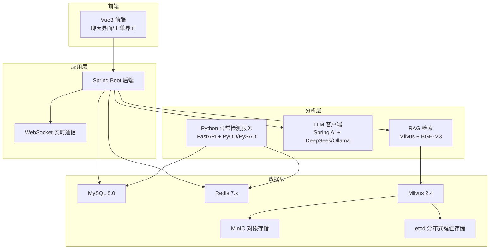
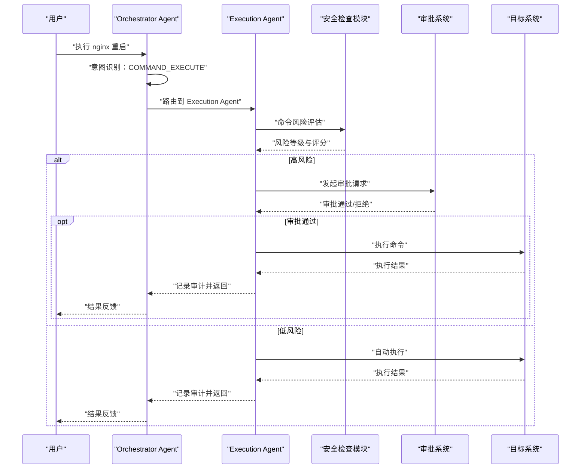
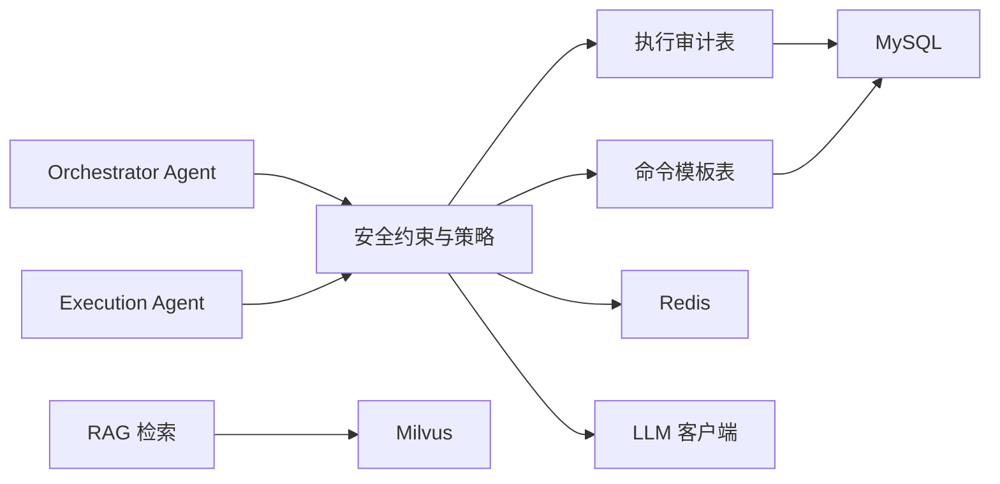

# 安全与权限控制

<cite>
**本文档引用的文件**
- [PROJECT_CONTEXT.md](file://PROJECT_CONTEXT.md)
- [开题报告_精简版.md](file://开题报告_精简版.md)
- [shared-safety-constraints.md](file://docs/prompts/shared-safety-constraints.md)
- [orchestrator-system-prompt.md](file://docs/prompts/orchestrator-system-prompt.md)
- [init.sql](file://sql/init.sql)
- [milvus_collection.yaml](file://config/milvus_collection.yaml)
- [init_milvus.py](file://scripts/init_milvus.py)
- [docker-compose.yml](file://docker-compose.yml)
- [verify-env.sh](file://scripts/verify-env.sh)
- [verify-env.ps1](file://scripts/verify-env.ps1)
</cite>

## 目录
1. [简介](#简介)
2. [项目结构](#项目结构)
3. [核心组件](#核心组件)
4. [架构总览](#架构总览)
5. [详细组件分析](#详细组件分析)
6. [依赖分析](#依赖分析)
7. [性能考虑](#性能考虑)
8. [故障排除指南](#故障排除指南)
9. [结论](#结论)
10. [附录](#附录)

## 简介
本文件围绕智能运维系统在安全与权限控制方面的设计与实现展开，重点覆盖以下方面：
- 安全策略设计：最小权限原则、防御优先机制、审计追溯要求
- 命令执行安全机制：禁止命令清单、审批流程设计、执行结果验证
- 用户权限管理体系：角色定义、权限分配、访问控制策略
- 数据安全保护：敏感信息加密、传输安全、存储安全
- 安全事件监控与响应：事件发现、阻断、评估与修复流程
- Human-in-the-Loop 安全机制：风险评估算法与人工审批流程
- 安全配置最佳实践与常见威胁防护

## 项目结构
系统采用多层架构与容器化部署，后端以 Spring Boot 为核心，结合 Milvus 向量数据库、MySQL 关系数据库、Redis 缓存、Ollama/DeepSeek LLM 等组件，形成“异常检测 + RAG + 多智能体 + 人机协同执行”的整体能力。

图表来源
- [PROJECT_CONTEXT.md:120-149](file://PROJECT_CONTEXT.md#L120-L149)
- [开题报告_精简版.md:118-152](file://开题报告_精简版.md#L118-L152)
- [docker-compose.yml:23-357](file://docker-compose.yml#L23-L357)

章节来源
- [PROJECT_CONTEXT.md:16-166](file://PROJECT_CONTEXT.md#L16-L166)
- [开题报告_精简版.md:118-152](file://开题报告_精简版.md#L118-L152)
- [docker-compose.yml:23-357](file://docker-compose.yml#L23-L357)

## 核心组件
- Orchestrator Agent：意图识别、任务路由、结果汇总，强制执行 Human-in-the-Loop 审批流程
- Execution Agent：命令生成、风险评估、人工审批、执行与审计
- 安全约束与策略：共享安全约束文档定义了最小权限、防御优先、审计追溯、命令黑名单、审批流程、数据脱敏与网络安全规则
- 权限与审计：MySQL 初始化脚本定义用户表、命令模板表、执行审计表、系统配置表，支撑权限与审计
- 数据与索引：Milvus Collection 配置与初始化脚本，确保向量维度与索引参数符合安全与性能要求
- 环境与容器：Docker Compose 编排各组件，环境验证脚本保障端口、资源与健康状态

章节来源
- [orchestrator-system-prompt.md:1-291](file://orchestrator-system-prompt.md#L1-L291)
- [shared-safety-constraints.md:1-396](file://shared-safety-constraints.md#L1-L396)
- [init.sql:23-274](file://init.sql#L23-L274)
- [milvus_collection.yaml:19-186](file://milvus_collection.yaml#L19-L186)
- [init_milvus.py:106-319](file://init_milvus.py#L106-L319)
- [docker-compose.yml:23-357](file://docker-compose.yml#L23-L357)
- [verify-env.sh:63-287](file://verify-env.sh#L63-L287)
- [verify-env.ps1:35-227](file://verify-env.ps1#L35-L227)

## 架构总览
系统在“意图识别 → 任务路由 → 结果汇总”之外，将“命令执行”置于严格的“Human-in-the-Loop”安全框架内，所有涉及删除、修改、重启等高风险操作必须经审批后方可执行，并全程记录审计日志。

图表来源
- [orchestrator-system-prompt.md:119-137](file://orchestrator-system-prompt.md#L119-L137)
- [shared-safety-constraints.md:68-127](file://shared-safety-constraints.md#L68-L127)
- [init.sql:112-138](file://init.sql#L112-L138)

## 详细组件分析

### 安全策略设计
- 最小权限原则：仅授予完成任务所需的最小权限，禁止使用 root 执行非必要操作，敏感操作必须审批
- 防御优先机制：遇到不确定情况选择更安全方案，宁可拒绝操作，任何可疑操作需人工确认
- 审计追溯原则：所有操作必须记录日志，包含操作人、时间、内容、结果，日志保留至少 90 天

章节来源
- [shared-safety-constraints.md:7-26](file://shared-safety-constraints.md#L7-L26)

### 命令执行安全机制
- 绝对禁止命令清单：系统销毁、权限开放、防火墙清空、密码修改、系统关机/重启、Fork 炸弹、危险脚本执行等
- 需要审批的命令：服务操作、进程操作、配置修改、数据操作、网络操作等
- 自动执行的命令：信息查询、日志查看、服务状态、临时文件清理等
- 执行结果验证：记录执行耗时、结果、错误信息，支持回滚与重试策略

章节来源
- [shared-safety-constraints.md:29-127](file://shared-safety-constraints.md#L29-L127)
- [init.sql:112-138](file://init.sql#L112-L138)

### 用户权限管理体系
- 角色定义：viewer、operator、admin、super-admin
- 权限矩阵：不同角色在知识问答、故障诊断、自动执行命令、审批执行命令上的权限差异
- 审批流程：查询类操作直接执行；低风险自动执行；中风险 operator 审批；高风险 admin 审批；极高风险 super-admin 审批并双重确认

章节来源
- [shared-safety-constraints.md:233-258](file://shared-safety-constraints.md#L233-L258)
- [init.sql:23-41](file://init.sql#L23-L41)

### 数据安全保护措施
- 敏感数据识别：密码、证书、包含密码的配置、PII 用户数据
- 数据脱敏规则：密码、API 密钥、数据库连接字符串等脱敏展示
- 日志安全：避免在日志中暴露敏感信息，错误信息对用户友好化
- 网络安全：外部 API 调用仅允许白名单域名，禁止未知来源下载执行，禁止开放高危端口

章节来源
- [shared-safety-constraints.md:130-196](file://shared-safety-constraints.md#L130-L196)

### 审计与日志规范
- 审计表字段：请求 ID、用户 ID、命令、命令类型、目标主机、风险等级、状态、审批人、执行结果、错误信息、执行耗时等
- 审计视图：告警统计视图与执行统计视图，便于运营与安全部门进行合规与风险分析
- 日志格式：包含时间戳、事件类型、用户、动作、资源、结果、IP 地址、会话 ID、耗时等

章节来源
- [init.sql:112-138](file://init.sql#L112-L138)
- [init.sql:249-274](file://init.sql#L249-L274)

### Human-in-the-Loop 安全机制与风险评估算法
- 机制实现：Execution Agent 在生成命令后进行风险评估，高风险命令进入审批流程，低风险自动执行
- 风险评估算法：综合命令类型、目标主机、历史执行记录、系统配置（如 auto_approve_low_risk、max_wait_time）进行评分与分级
- 审批流程：根据风险等级与角色权限，路由至相应审批人，支持双重确认

章节来源
- [shared-safety-constraints.md:68-127](file://shared-safety-constraints.md#L68-L127)
- [init.sql:235-244](file://init.sql#L235-L244)

### 安全事件监控与响应
- 监控：通过告警记录表与异常检测结果表，结合 Redis 去重与 RAG 检索，实现异常事件的快速识别
- 响应：发现安全事件后立即阻断可疑操作、记录事件详情、通知安全团队、评估影响范围、执行修复措施、生成事件报告

章节来源
- [init.sql:173-196](file://init.sql#L173-L196)
- [init.sql:198-217](file://init.sql#L198-L217)
- [shared-safety-constraints.md:360-378](file://shared-safety-constraints.md#L360-L378)

### 安全配置最佳实践
- 容器资源：Milvus、Ollama 等内存密集型服务分配足够资源，建议 Docker 至少 8GB 内存
- 端口与网络：避免端口冲突，严格限制高危端口开放，使用自定义桥接网络隔离服务
- 凭据管理：MySQL、MinIO 等组件的 root/业务用户密码必须修改，使用 .env 管理敏感配置
- 健康检查：各服务均配置健康检查，启动顺序依赖 etcd、minio 后再启动 Milvus

章节来源
- [docker-compose.yml:17-21](file://docker-compose.yml#L17-L21)
- [docker-compose.yml:106-108](file://docker-compose.yml#L106-L108)
- [docker-compose.yml:164-176](file://docker-compose.yml#L164-L176)
- [docker-compose.yml:109-118](file://docker-compose.yml#L109-L118)
- [docker-compose.yml:139-144](file://docker-compose.yml#L139-L144)

## 依赖分析
系统安全与权限控制的关键依赖关系如下：

图表来源
- [orchestrator-system-prompt.md:119-137](file://orchestrator-system-prompt.md#L119-L137)
- [shared-safety-constraints.md:29-127](file://shared-safety-constraints.md#L29-L127)
- [init.sql:112-159](file://init.sql#L112-L159)
- [milvus_collection.yaml:19-101](file://milvus_collection.yaml#L19-L101)

章节来源
- [orchestrator-system-prompt.md:119-137](file://orchestrator-system-prompt.md#L119-L137)
- [shared-safety-constraints.md:29-127](file://shared-safety-constraints.md#L29-L127)
- [init.sql:112-159](file://init.sql#L112-L159)
- [milvus_collection.yaml:19-101](file://milvus_collection.yaml#L19-L101)

## 性能考虑
- Milvus 索引与搜索参数：根据数据规模选择合适索引类型（IVF_FLAT/HNSW），nlist 与 nprobe 平衡精度与性能
- 缓存与去重：Redis 用于会话缓存、RAG 结果缓存、分布式锁与实时告警去重
- 资源分配：容器资源限制与保留值确保关键服务稳定运行，避免资源争用导致的安全与性能问题

章节来源
- [milvus_collection.yaml:54-101](file://milvus_collection.yaml#L54-L101)
- [docker-compose.yml:147-154](file://docker-compose.yml#L147-L154)
- [docker-compose.yml:240-246](file://docker-compose.yml#L240-L246)

## 故障排除指南
- 环境检查：使用 verify-env.sh/verify-env.ps1 检查 Docker、Compose、端口占用、配置文件、数据目录与服务健康状态
- 健康检查：Milvus、MySQL、Redis、Ollama 均配置健康检查，不健康时查看对应日志
- 快速连接测试：提供 MySQL、Redis、Milvus、Ollama 的连接测试命令，便于快速定位问题

章节来源
- [verify-env.sh:63-287](file://verify-env.sh#L63-L287)
- [verify-env.ps1:35-227](file://verify-env.ps1#L35-L227)
- [docker-compose.yml:132-138](file://docker-compose.yml#L132-L138)
- [docker-compose.yml:193-199](file://docker-compose.yml#L193-L199)
- [docker-compose.yml:231-237](file://docker-compose.yml#L231-L237)
- [docker-compose.yml:274-280](file://docker-compose.yml#L274-L280)

## 结论
本系统通过“共享安全约束 + 审计日志 + Human-in-the-Loop 审批 + 容器化与健康检查”的组合，构建了覆盖命令执行、用户权限、数据安全与事件响应的全链路安全体系。建议在后续开发中持续完善风险评估算法、强化输入校验与错误脱敏、定期进行渗透测试与安全审计，确保系统在生产环境中的安全与稳定。

## 附录
- 安全配置清单：检查 .env 凭据、端口占用、容器资源、健康状态与日志输出
- 常见威胁与防护：命令注入、SQL 注入、XSS、敏感信息泄露、未授权访问、拒绝服务攻击
- 审计与合规：执行审计表字段与统计视图，满足审计追溯与合规要求

章节来源
- [shared-safety-constraints.md:199-231](file://shared-safety-constraints.md#L199-L231)
- [shared-safety-constraints.md:296-324](file://shared-safety-constraints.md#L296-L324)
- [init.sql:112-138](file://init.sql#L112-L138)
- [init.sql:249-274](file://init.sql#L249-L274)