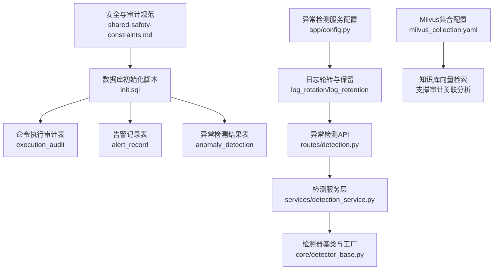
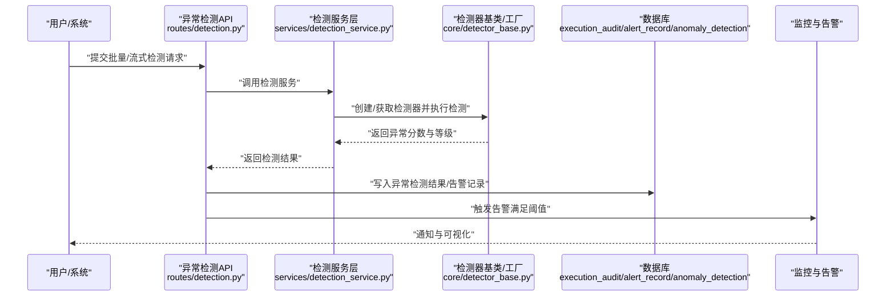
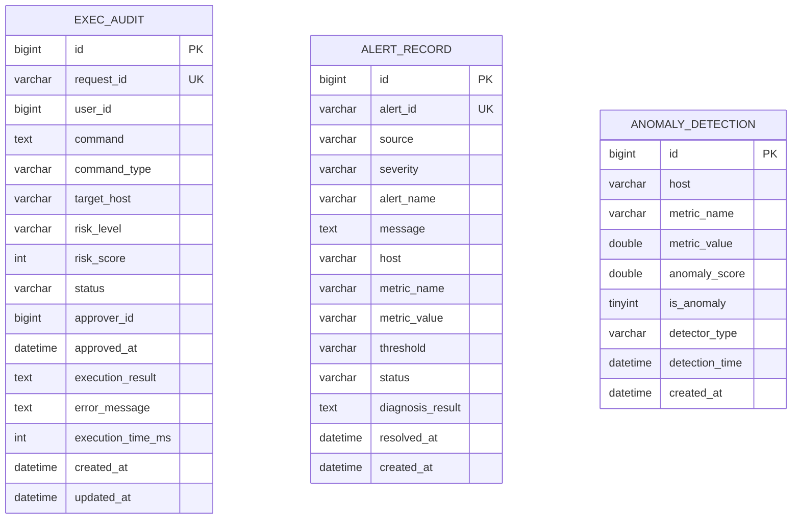
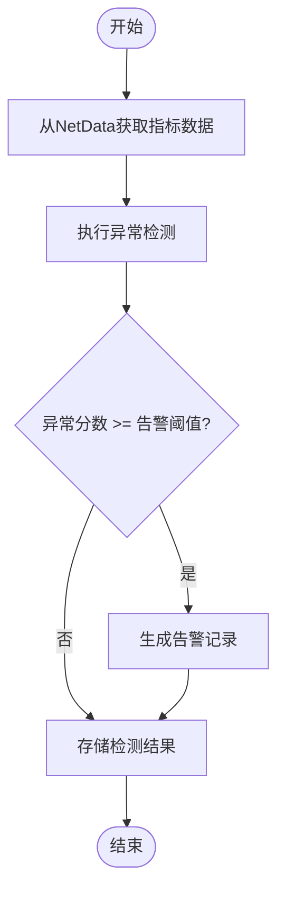
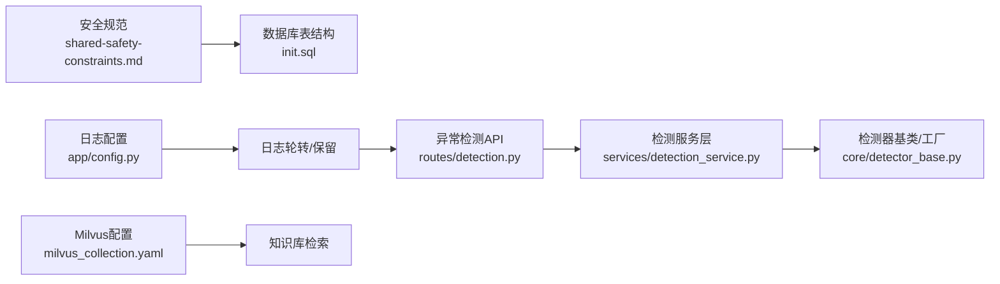

# 审计日志监控

<cite>
**本文引用的文件**
- [共享安全约束.md](file://docs/prompts/shared-safety-constraints.md)
- [init.sql](file://sql/init.sql)
- [milvus_collection.yaml](file://config/milvus_collection.yaml)
- [anomaly-detection-service/app/config.py](file://anomaly-detection-service/app/config.py)
- [anomaly-detection-service/app/api/routes/detection.py](file://anomaly-detection-service/app/api/routes/detection.py)
- [anomaly-detection-service/app/services/detection_service.py](file://anomaly-detection-service/app/services/detection_service.py)
- [anomaly-detection-service/app/core/detector_base.py](file://anomaly-detection-service/app/core/detector_base.py)
</cite>

## 目录
1. [简介](#简介)
2. [项目结构](#项目结构)
3. [核心组件](#核心组件)
4. [架构总览](#架构总览)
5. [组件详细分析](#组件详细分析)
6. [依赖关系分析](#依赖关系分析)
7. [性能考量](#性能考量)
8. [故障排查指南](#故障排查指南)
9. [结论](#结论)
10. [附录](#附录)

## 简介
本文件面向智能运维系统，围绕“审计日志监控”主题，系统化阐述审计日志的格式规范、字段标准化、完整性保障、必须记录的事件类型、存储与保留策略、访问权限控制、实时监控与告警机制，以及审计数据分析与合规性检查方法。文档基于仓库现有安全规范、数据库表结构与异常检测服务的日志配置，结合运维场景给出可落地的实施建议。

## 项目结构
本项目包含以下与审计日志密切相关的部分：
- 安全与审计规范文档：定义日志格式、必须记录事件、保留期限与安全要求
- 数据库初始化脚本：定义审计表结构（命令执行审计、告警记录、异常检测结果等）
- 异常检测服务：提供日志配置、轮转与保留策略，支撑实时监控与告警
- Milvus 向量集合配置：为知识库检索提供基础，间接支撑审计关联分析

**图表来源**
- [共享安全约束.md:296-324](file://docs/prompts/shared-safety-constraints.md#L296-L324)
- [init.sql:114-138](file://sql/init.sql#L114-L138)
- [init.sql:175-196](file://sql/init.sql#L175-L196)
- [init.sql:201-217](file://sql/init.sql#L201-L217)
- [anomaly-detection-service/app/config.py:148-154](file://anomaly-detection-service/app/config.py#L148-L154)
- [anomaly-detection-service/app/api/routes/detection.py:55-153](file://anomaly-detection-service/app/api/routes/detection.py#L55-L153)
- [anomaly-detection-service/app/services/detection_service.py:37-118](file://anomaly-detection-service/app/services/detection_service.py#L37-L118)
- [anomaly-detection-service/app/core/detector_base.py:31-100](file://anomaly-detection-service/app/core/detector_base.py#L31-L100)
- [milvus_collection.yaml:22-101](file://config/milvus_collection.yaml#L22-L101)

**章节来源**
- [共享安全约束.md:1-396](file://docs/prompts/shared-safety-constraints.md#L1-L396)
- [init.sql:1-274](file://sql/init.sql#L1-L274)
- [anomaly-detection-service/app/config.py:1-183](file://anomaly-detection-service/app/config.py#L1-L183)
- [anomaly-detection-service/app/api/routes/detection.py:1-378](file://anomaly-detection-service/app/api/routes/detection.py#L1-L378)
- [anomaly-detection-service/app/services/detection_service.py:1-334](file://anomaly-detection-service/app/services/detection_service.py#L1-L334)
- [anomaly-detection-service/app/core/detector_base.py:1-339](file://anomaly-detection-service/app/core/detector_base.py#L1-L339)
- [milvus_collection.yaml:1-186](file://config/milvus_collection.yaml#L1-L186)

## 核心组件
- 审计日志规范与事件清单：明确日志格式字段与必须记录的事件类型
- 审计数据存储：命令执行审计表、告警记录表、异常检测结果表
- 日志配置与轮转：异常检测服务的日志级别、轮转大小与保留天数
- 实时监控与告警：基于异常检测服务的阈值与等级划分
- 知识库检索：Milvus 向量集合配置，支撑审计关联分析与证据检索

**章节来源**
- [共享安全约束.md:296-324](file://docs/prompts/shared-safety-constraints.md#L296-L324)
- [init.sql:114-138](file://sql/init.sql#L114-L138)
- [init.sql:175-196](file://sql/init.sql#L175-L196)
- [init.sql:201-217](file://sql/init.sql#L201-L217)
- [anomaly-detection-service/app/config.py:148-154](file://anomaly-detection-service/app/config.py#L148-L154)
- [milvus_collection.yaml:22-101](file://config/milvus_collection.yaml#L22-L101)

## 架构总览
下图展示了审计日志从产生、落库、到实时监控与告警的整体流程。

**图表来源**
- [anomaly-detection-service/app/api/routes/detection.py:55-153](file://anomaly-detection-service/app/api/routes/detection.py#L55-L153)
- [anomaly-detection-service/app/services/detection_service.py:76-118](file://anomaly-detection-service/app/services/detection_service.py#L76-L118)
- [anomaly-detection-service/app/core/detector_base.py:31-100](file://anomaly-detection-service/app/core/detector_base.py#L31-L100)
- [init.sql:114-138](file://sql/init.sql#L114-L138)
- [init.sql:175-196](file://sql/init.sql#L175-L196)
- [init.sql:201-217](file://sql/init.sql#L201-L217)

## 组件详细分析

### 审计日志格式规范与字段标准化
- 日志格式：采用结构化 JSON，包含时间戳、事件类型、主体、动作、资源、结果、来源 IP、会话标识、耗时等字段
- 字段标准化：
  - 时间戳：统一使用 UTC
  - 事件类型：枚举化（如 COMMAND_EXECUTION、LOGIN、LOGOUT、CONFIG_CHANGE、DATA_ACCESS 等）
  - 结果：SUCCESS/FAILED
  - 风险等级：low/medium/high/critical（用于命令执行审计）
  - 会话标识：便于跨请求关联
- 完整性保障：
  - 唯一标识：请求 ID/告警 ID
  - 时间序列：创建与更新时间
  - 关联字段：用户 ID、目标主机、审批人 ID 等

**章节来源**
- [共享安全约束.md:298-312](file://docs/prompts/shared-safety-constraints.md#L298-L312)
- [init.sql:114-138](file://sql/init.sql#L114-L138)
- [init.sql:175-196](file://sql/init.sql#L175-L196)
- [init.sql:201-217](file://sql/init.sql#L201-L217)

### 必须记录的事件类型
- 用户行为：登录/登出、查询、数据访问
- 系统操作：命令生成、命令执行、配置变更、模板使用
- 安全事件：审批决策、风险评估、异常检测触发、告警产生与解决

**章节来源**
- [共享安全约束.md:314-322](file://docs/prompts/shared-safety-constraints.md#L314-L322)

### 审计数据存储策略
- 命令执行审计表（execution_audit）：记录请求 ID、用户 ID、命令、类型、目标主机、风险等级/分数、状态、审批信息、执行结果/错误、耗时、时间戳
- 告警记录表（alert_record）：记录告警 ID、来源、严重程度、名称、消息、主机、指标、阈值、状态、诊断结果、解决时间
- 异常检测结果表（anomaly_detection）：记录主机、指标、值、异常分数、是否异常、检测器类型、检测时间

**图表来源**
- [init.sql:114-138](file://sql/init.sql#L114-L138)
- [init.sql:175-196](file://sql/init.sql#L175-L196)
- [init.sql:201-217](file://sql/init.sql#L201-L217)

**章节来源**
- [init.sql:114-138](file://sql/init.sql#L114-L138)
- [init.sql:175-196](file://sql/init.sql#L175-L196)
- [init.sql:201-217](file://sql/init.sql#L201-L217)

### 审计日志的实时监控与告警机制
- 异常检测服务提供批量与流式检测接口，支持阈值与等级划分（NORMAL/WARNING/CRITICAL），并可直接从 NetData 获取指标数据进行检测
- 当异常分数达到告警阈值时，系统可将检测结果写入异常检测结果表，并触发告警
- 告警记录表支持按严重程度与状态聚合统计，便于监控面板展示

**图表来源**
- [anomaly-detection-service/app/api/routes/detection.py:285-378](file://anomaly-detection-service/app/api/routes/detection.py#L285-L378)
- [anomaly-detection-service/app/services/detection_service.py:76-118](file://anomaly-detection-service/app/services/detection_service.py#L76-L118)
- [init.sql:175-196](file://sql/init.sql#L175-L196)
- [init.sql:201-217](file://sql/init.sql#L201-L217)

**章节来源**
- [anomaly-detection-service/app/api/routes/detection.py:55-153](file://anomaly-detection-service/app/api/routes/detection.py#L55-L153)
- [anomaly-detection-service/app/api/routes/detection.py:158-219](file://anomaly-detection-service/app/api/routes/detection.py#L158-L219)
- [anomaly-detection-service/app/api/routes/detection.py:224-279](file://anomaly-detection-service/app/api/routes/detection.py#L224-L279)
- [anomaly-detection-service/app/api/routes/detection.py:285-378](file://anomaly-detection-service/app/api/routes/detection.py#L285-L378)
- [anomaly-detection-service/app/services/detection_service.py:37-118](file://anomaly-detection-service/app/services/detection_service.py#L37-L118)
- [init.sql:175-196](file://sql/init.sql#L175-L196)
- [init.sql:201-217](file://sql/init.sql#L201-L217)

### 审计数据分析与合规性检查
- 数据分析：利用视图对告警与执行统计进行聚合，支持按日期、严重程度、风险等级、状态等维度分析
- 合规性检查：基于审计事件清单与日志字段标准化，定期比对关键事件是否完整记录；结合保留策略与访问控制，确保可追溯与可审计

**章节来源**
- [init.sql:249-274](file://sql/init.sql#L249-L274)
- [共享安全约束.md:21-25](file://docs/prompts/shared-safety-constraints.md#L21-L25)

## 依赖关系分析
- 审计规范驱动数据库表设计与字段命名
- 异常检测服务提供日志轮转与保留策略，支撑审计日志的长期留存与检索
- Milvus 向量集合配置为知识库检索提供基础，有助于审计证据的关联与溯源

**图表来源**
- [共享安全约束.md:296-324](file://docs/prompts/shared-safety-constraints.md#L296-L324)
- [init.sql:114-138](file://sql/init.sql#L114-L138)
- [anomaly-detection-service/app/config.py:148-154](file://anomaly-detection-service/app/config.py#L148-L154)
- [anomaly-detection-service/app/api/routes/detection.py:55-153](file://anomaly-detection-service/app/api/routes/detection.py#L55-L153)
- [anomaly-detection-service/app/services/detection_service.py:37-118](file://anomaly-detection-service/app/services/detection_service.py#L37-L118)
- [anomaly-detection-service/app/core/detector_base.py:31-100](file://anomaly-detection-service/app/core/detector_base.py#L31-L100)
- [milvus_collection.yaml:22-101](file://config/milvus_collection.yaml#L22-L101)

**章节来源**
- [共享安全约束.md:296-324](file://docs/prompts/shared-safety-constraints.md#L296-L324)
- [init.sql:114-138](file://sql/init.sql#L114-L138)
- [anomaly-detection-service/app/config.py:148-154](file://anomaly-detection-service/app/config.py#L148-L154)
- [anomaly-detection-service/app/api/routes/detection.py:55-153](file://anomaly-detection-service/app/api/routes/detection.py#L55-L153)
- [anomaly-detection-service/app/services/detection_service.py:37-118](file://anomaly-detection-service/app/services/detection_service.py#L37-L118)
- [anomaly-detection-service/app/core/detector_base.py:31-100](file://anomaly-detection-service/app/core/detector_base.py#L31-L100)
- [milvus_collection.yaml:22-101](file://config/milvus_collection.yaml#L22-L101)

## 性能考量
- 日志轮转与保留：通过配置项控制日志文件大小与保留周期，避免磁盘压力
- 检测阈值与等级：合理设置异常分数阈值与等级划分，平衡误报与漏报
- 批量与流式检测：根据场景选择批量离线分析或流式实时检测，降低延迟与资源消耗

**章节来源**
- [anomaly-detection-service/app/config.py:148-154](file://anomaly-detection-service/app/config.py#L148-L154)
- [anomaly-detection-service/app/api/routes/detection.py:55-153](file://anomaly-detection-service/app/api/routes/detection.py#L55-L153)

## 故障排查指南
- 异常检测失败：检查日志异常捕获与错误返回，定位具体异常原因
- NetData 数据获取失败：确认 NetData API 地址、端口与超时配置
- 模型训练失败：检查训练数据有效性与检测器参数

**章节来源**
- [anomaly-detection-service/app/api/routes/detection.py:147-152](file://anomaly-detection-service/app/api/routes/detection.py#L147-L152)
- [anomaly-detection-service/app/api/routes/detection.py:213-218](file://anomaly-detection-service/app/api/routes/detection.py#L213-L218)
- [anomaly-detection-service/app/api/routes/detection.py:274-279](file://anomaly-detection-service/app/api/routes/detection.py#L274-L279)
- [anomaly-detection-service/app/api/routes/detection.py:372-377](file://anomaly-detection-service/app/api/routes/detection.py#L372-L377)

## 结论
本文件基于仓库现有安全规范与系统实现，给出了审计日志的格式规范、事件清单、存储策略、实时监控与告警机制，以及数据分析与合规性检查方法。建议在生产环境中结合日志轮转与保留策略、严格的访问控制与定期合规审查，确保审计数据的完整性、可用性与可追溯性。

## 附录
- 审计日志字段清单与示例格式参见安全规范文档
- 命令执行审计、告警记录、异常检测结果的表结构参见数据库初始化脚本
- 日志轮转与保留策略参见异常检测服务配置
- Milvus 向量集合配置参见 Milvus 配置文件

**章节来源**
- [共享安全约束.md:298-312](file://docs/prompts/shared-safety-constraints.md#L298-L312)
- [init.sql:114-138](file://sql/init.sql#L114-L138)
- [init.sql:175-196](file://sql/init.sql#L175-L196)
- [init.sql:201-217](file://sql/init.sql#L201-L217)
- [anomaly-detection-service/app/config.py:148-154](file://anomaly-detection-service/app/config.py#L148-L154)
- [milvus_collection.yaml:22-101](file://config/milvus_collection.yaml#L22-L101)