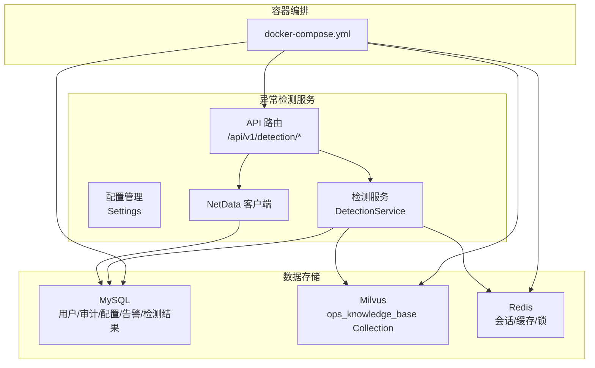
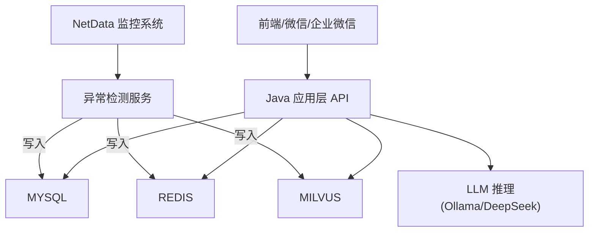
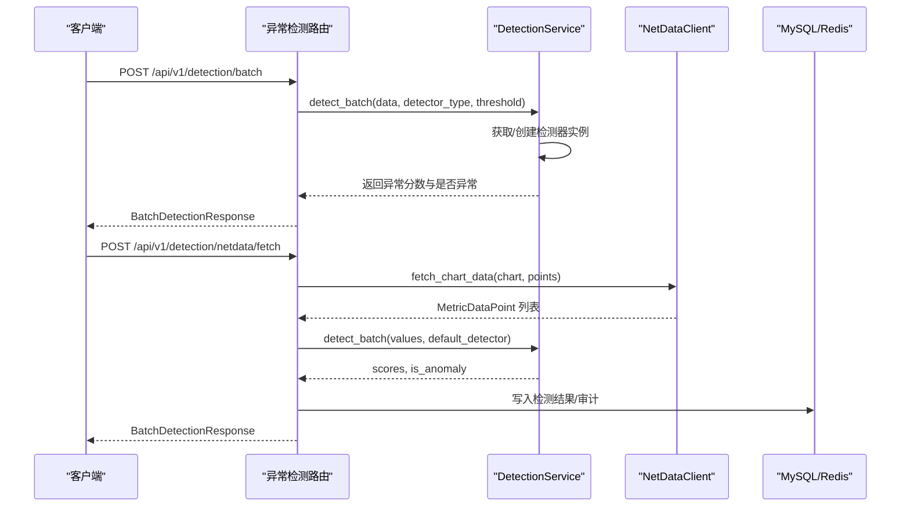
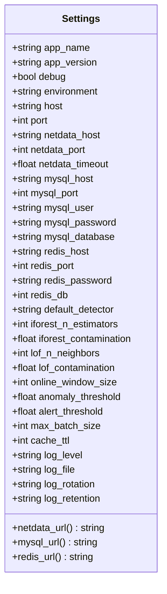
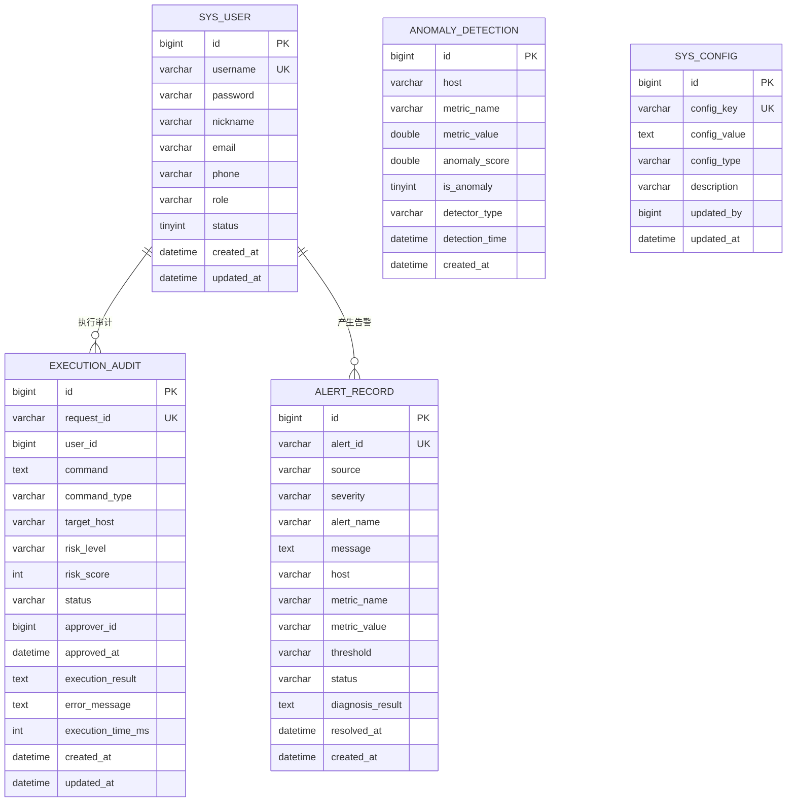
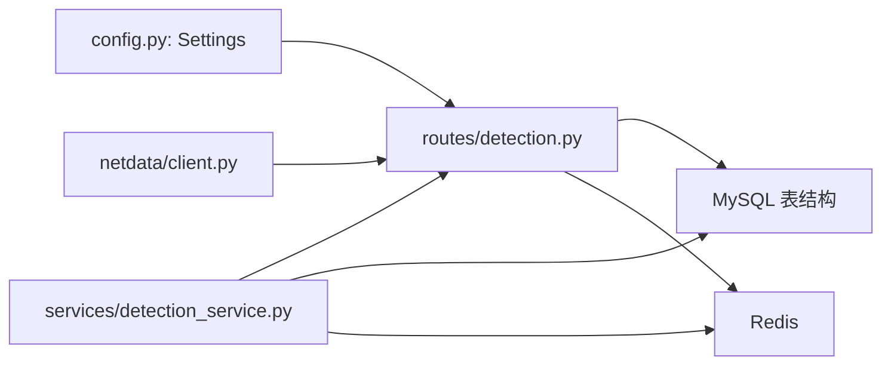

# 敏感数据识别

<cite>
**本文引用的文件**
- [PROJECT_CONTEXT.md](file://PROJECT_CONTEXT.md)
- [开题报告_精简版.md](file://开题报告_精简版.md)
- [docker-compose.yml](file://docker-compose.yml)
- [config/milvus_collection.yaml](file://config/milvus_collection.yaml)
- [scripts/init_milvus.py](file://scripts/init_milvus.py)
- [sql/init.sql](file://sql/init.sql)
- [anomaly-detection-service/app/main.py](file://anomaly-detection-service/app/main.py)
- [anomaly-detection-service/app/config.py](file://anomaly-detection-service/app/config.py)
- [anomaly-detection-service/app/api/routes/detection.py](file://anomaly-detection-service/app/api/routes/detection.py)
- [anomaly-detection-service/app/models/schemas.py](file://anomaly-detection-service/app/models/schemas.py)
- [anomaly-detection-service/app/services/detection_service.py](file://anomaly-detection-service/app/services/detection_service.py)
- [anomaly-detection-service/app/netdata/client.py](file://anomaly-detection-service/app/netdata/client.py)
</cite>

## 目录
1. [简介](#简介)
2. [项目结构](#项目结构)
3. [核心组件](#核心组件)
4. [架构总览](#架构总览)
5. [详细组件分析](#详细组件分析)
6. [依赖分析](#依赖分析)
7. [性能考虑](#性能考虑)
8. [故障排查指南](#故障排查指南)
9. [结论](#结论)
10. [附录](#附录)

## 简介
本文件面向“面向 NetData 监控数据的智能运维问答与执行系统”，聚焦于系统中的敏感数据识别与治理。通过对项目上下文、容器编排、数据库与 Milvus 配置、异常检测服务以及相关配置文件的综合分析，给出敏感数据的分类标准、识别方法、分级与处理策略，并提供自动化与手动检查的实施建议。

## 项目结构
系统采用多模块分层架构，包含：
- 异常检测服务（Python FastAPI）
- 向量数据库（Milvus）
- 关系数据库（MySQL）
- 缓存（Redis）
- LLM 推理（Ollama/DeepSeek）

**图表来源**
- [docker-compose.yml:1-357](file://docker-compose.yml#L1-L357)
- [anomaly-detection-service/app/api/routes/detection.py:1-378](file://anomaly-detection-service/app/api/routes/detection.py#L1-L378)
- [anomaly-detection-service/app/config.py:1-183](file://anomaly-detection-service/app/config.py#L1-L183)
- [anomaly-detection-service/app/services/detection_service.py:1-334](file://anomaly-detection-service/app/services/detection_service.py#L1-L334)
- [anomaly-detection-service/app/netdata/client.py:1-301](file://anomaly-detection-service/app/netdata/client.py#L1-L301)
- [sql/init.sql:1-274](file://sql/init.sql#L1-L274)
- [config/milvus_collection.yaml:1-186](file://config/milvus_collection.yaml#L1-L186)

**章节来源**
- [PROJECT_CONTEXT.md:120-166](file://PROJECT_CONTEXT.md#L120-L166)
- [开题报告_精简版.md:118-152](file://开题报告_精简版.md#L118-L152)

## 核心组件
- 异常检测服务：提供批量/流式检测、训练、NetData 集成等能力，涉及大量配置与外部服务交互。
- 配置管理：集中管理应用配置，支持环境变量覆盖，包含数据库、Redis、NetData 等敏感连接信息。
- 数据库与 Milvus：MySQL 存储用户、审计、配置、告警、检测结果等；Milvus 存储知识库向量。
- 容器编排：统一管理各服务的启动、健康检查与资源限制。

**章节来源**
- [anomaly-detection-service/app/main.py:1-217](file://anomaly-detection-service/app/main.py#L1-L217)
- [anomaly-detection-service/app/config.py:1-183](file://anomaly-detection-service/app/config.py#L1-L183)
- [sql/init.sql:1-274](file://sql/init.sql#L1-L274)
- [config/milvus_collection.yaml:1-186](file://config/milvus_collection.yaml#L1-L186)
- [docker-compose.yml:1-357](file://docker-compose.yml#L1-L357)

## 架构总览
系统围绕“监控数据采集—异常检测—知识检索—智能问答—执行审计”的闭环展开。敏感数据贯穿各环节，需在采集、传输、存储、检索与展示全链路进行识别与保护。

**图表来源**
- [开题报告_精简版.md:118-152](file://开题报告_精简版.md#L118-L152)
- [docker-compose.yml:1-357](file://docker-compose.yml#L1-L357)

## 详细组件分析

### 异常检测服务（Python FastAPI）
- 职责：提供批量/流式异常检测、模型训练、NetData 数据抓取与检测一体化。
- 关键点：配置集中化、日志记录、异常处理、路由注册、中间件（CORS、请求日志）。
- 敏感数据风险：配置文件中可能包含数据库、Redis、NetData 的连接信息；API 返回结果可能携带指标值，需结合阈值与等级进行脱敏。

**图表来源**
- [anomaly-detection-service/app/api/routes/detection.py:1-378](file://anomaly-detection-service/app/api/routes/detection.py#L1-L378)
- [anomaly-detection-service/app/services/detection_service.py:1-334](file://anomaly-detection-service/app/services/detection_service.py#L1-L334)
- [anomaly-detection-service/app/netdata/client.py:1-301](file://anomaly-detection-service/app/netdata/client.py#L1-L301)
- [anomaly-detection-service/app/main.py:1-217](file://anomaly-detection-service/app/main.py#L1-L217)

**章节来源**
- [anomaly-detection-service/app/main.py:76-217](file://anomaly-detection-service/app/main.py#L76-L217)
- [anomaly-detection-service/app/api/routes/detection.py:55-378](file://anomaly-detection-service/app/api/routes/detection.py#L55-L378)
- [anomaly-detection-service/app/services/detection_service.py:76-334](file://anomaly-detection-service/app/services/detection_service.py#L76-L334)
- [anomaly-detection-service/app/netdata/client.py:138-198](file://anomaly-detection-service/app/netdata/client.py#L138-L198)

### 配置管理（Settings）
- 作用：集中管理应用配置，支持环境变量覆盖，类型安全校验。
- 敏感项：数据库凭据（MySQL 用户/密码）、Redis 密码、NetData 主机与端口、LLM 提供商与模型等。
- 建议：将敏感配置置于环境变量或密钥管理服务，避免硬编码在代码或配置文件中。

**图表来源**
- [anomaly-detection-service/app/config.py:28-183](file://anomaly-detection-service/app/config.py#L28-L183)

**章节来源**
- [anomaly-detection-service/app/config.py:28-183](file://anomaly-detection-service/app/config.py#L28-L183)

### 数据库与 Milvus
- MySQL：存储用户、对话、命令执行审计、告警、知识库文档、异常检测结果、系统配置等。
- Milvus：ops_knowledge_base Collection，存储知识库向量，包含 content、embedding、source、title、chunk_index、created_at 等字段。
- 敏感数据：用户密码（BCrypt 加密）、命令执行内容、告警消息、异常检测分数与原始指标值等。

**图表来源**
- [sql/init.sql:26-274](file://sql/init.sql#L26-L274)

**章节来源**
- [sql/init.sql:26-274](file://sql/init.sql#L26-L274)
- [config/milvus_collection.yaml:105-140](file://config/milvus_collection.yaml#L105-L140)

### 容器编排与敏感暴露面
- Milvus/MinIO/etcd：对外暴露端口与凭证，需严格限制访问来源与网络隔离。
- MySQL/Redis/Ollama：通过 Docker Compose 管理，注意默认密码与持久化卷的访问控制。
- 建议：生产环境禁用默认凭证，启用 TLS/认证，限制容器间访问，使用只读挂载与最小权限。

**章节来源**
- [docker-compose.yml:23-357](file://docker-compose.yml#L23-L357)

## 依赖分析
- 异常检测服务依赖配置模块、检测服务层、NetData 客户端与数据库/缓存。
- 检测服务层依赖检测器工厂与具体算法实现，负责模型生命周期管理与持久化。
- API 路由依赖检测服务与 NetData 客户端，负责请求参数校验与响应组装。

**图表来源**
- [anomaly-detection-service/app/config.py:28-183](file://anomaly-detection-service/app/config.py#L28-L183)
- [anomaly-detection-service/app/api/routes/detection.py:39-50](file://anomaly-detection-service/app/api/routes/detection.py#L39-L50)
- [anomaly-detection-service/app/services/detection_service.py:24-34](file://anomaly-detection-service/app/services/detection_service.py#L24-L34)
- [anomaly-detection-service/app/netdata/client.py:26-27](file://anomaly-detection-service/app/netdata/client.py#L26-L27)
- [sql/init.sql:26-274](file://sql/init.sql#L26-L274)

**章节来源**
- [anomaly-detection-service/app/api/routes/detection.py:39-50](file://anomaly-detection-service/app/api/routes/detection.py#L39-L50)
- [anomaly-detection-service/app/services/detection_service.py:24-34](file://anomaly-detection-service/app/services/detection_service.py#L24-L34)
- [anomaly-detection-service/app/netdata/client.py:26-27](file://anomaly-detection-service/app/netdata/client.py#L26-L27)

## 性能考虑
- 检测阈值与等级划分：通过异常分数与告警阈值区分 normal/warning/critical，避免误报与漏报。
- 检索性能：Milvus 索引参数（nlist/nprobe）与搜索 top_k 影响检索速度与精度，需结合数据规模调优。
- 缓存与批处理：Redis 缓存与批量检测可降低外部依赖压力，提高吞吐。

**章节来源**
- [anomaly-detection-service/app/api/routes/detection.py:110-117](file://anomaly-detection-service/app/api/routes/detection.py#L110-L117)
- [config/milvus_collection.yaml:70-101](file://config/milvus_collection.yaml#L70-L101)
- [anomaly-detection-service/app/config.py:132-146](file://anomaly-detection-service/app/config.py#L132-L146)

## 故障排查指南
- 全局异常处理：捕获未处理异常并返回结构化错误响应，便于定位问题。
- 参数错误处理：对非法参数返回明确错误信息，减少无效请求。
- 请求日志中间件：记录请求/响应与耗时，辅助性能与安全审计。
- 健康检查：各服务提供健康检查端点，便于容器编排与运维监控。

**章节来源**
- [anomaly-detection-service/app/main.py:145-172](file://anomaly-detection-service/app/main.py#L145-L172)
- [anomaly-detection-service/app/main.py:119-139](file://anomaly-detection-service/app/main.py#L119-L139)
- [docker-compose.yml:47-138](file://docker-compose.yml#L47-L138)

## 结论
本系统在多处涉及敏感数据的采集、传输与存储，需建立完善的识别与分级治理机制。通过集中配置管理、严格的容器安全策略、数据库与 Milvus 的访问控制、以及 API 层的异常与日志治理，可有效降低敏感数据泄露风险。建议在开发与生产环境中均落实最小权限、只读挂载、凭证外置与定期审计。

## 附录

### 敏感数据识别与分级指南

- 分类标准
  - 密码与凭证：数据库密码、Redis 密码、MinIO 凭证、MySQL 用户名等。
  - API 密钥与令牌：外部服务访问令牌、LLM 提供商密钥等。
  - SSL/TLS 证书与密钥：服务间通信证书、私钥等。
  - 配置文件：包含敏感连接串与密钥的配置文件。
  - PII 个人信息：用户邮箱、手机号、真实姓名等。

- 识别方法
  - 自动化扫描：基于正则表达式与模式匹配识别常见格式（如数据库连接串、JWT、证书头部等）。
  - 静态分析：检查配置文件、Docker Compose、初始化 SQL、向量集合配置等。
  - 动态审计：通过 API 日志与数据库审计表追踪敏感数据的读写路径。

- 分级与处理策略
  - 高风险：密码、API 密钥、证书、PII。处理措施：强制外置密钥管理、禁止明文存储、最小权限访问、定期轮换。
  - 中风险：连接串、日志中的敏感字段。处理措施：脱敏输出、访问审计、传输加密。
  - 低风险：公开的阈值、等级标签等。处理措施：最小暴露面、避免在日志中打印完整数据。

- 自动化工具与手动检查
  - 自动化工具：Git hooks + 正则扫描、CI 安全扫描、Docker 安全镜像扫描、数据库审计工具。
  - 手动检查：审查配置文件、容器编排、初始化脚本、API 响应与日志，核对敏感字段是否被正确脱敏或移除。

- 识别示例与判断标准
  - 配置文件中的连接串：若出现用户名/密码/主机/端口组合，且未使用密钥管理，则判定为中高风险。
  - API 响应中的原始指标值：若未结合阈值与等级进行脱敏，可能构成中风险。
  - Milvus 集合字段：content/embedding 等字段本身不包含明文敏感信息，但需关注写入来源与访问控制。
  - 命令执行审计：命令模板与执行结果需脱敏处理，避免在日志与 UI 中直接展示。

**章节来源**
- [anomaly-detection-service/app/config.py:73-103](file://anomaly-detection-service/app/config.py#L73-L103)
- [sql/init.sql:114-138](file://sql/init.sql#L114-L138)
- [config/milvus_collection.yaml:112-140](file://config/milvus_collection.yaml#L112-L140)
- [anomaly-detection-service/app/api/routes/detection.py:110-117](file://anomaly-detection-service/app/api/routes/detection.py#L110-L117)