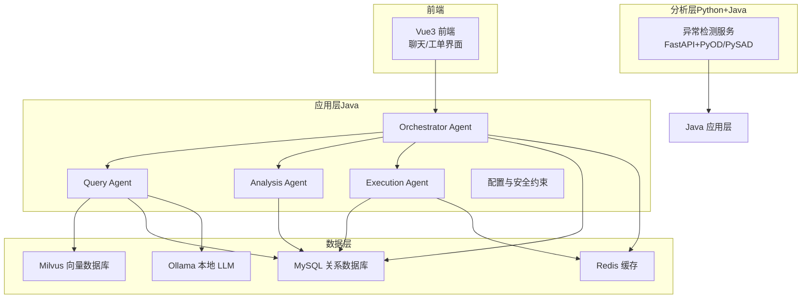
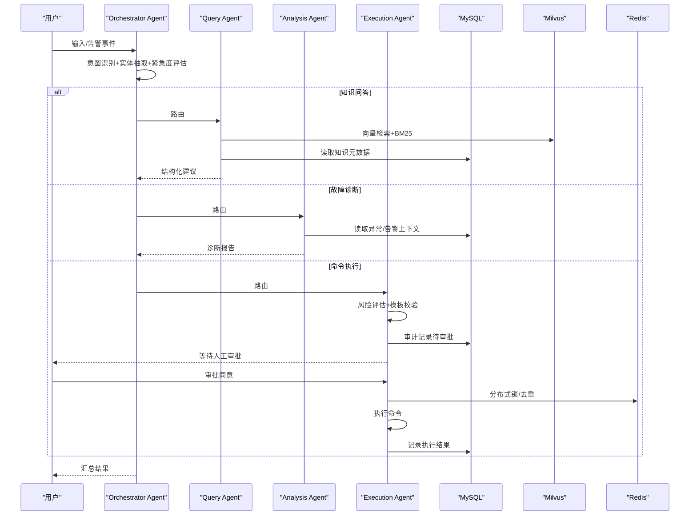
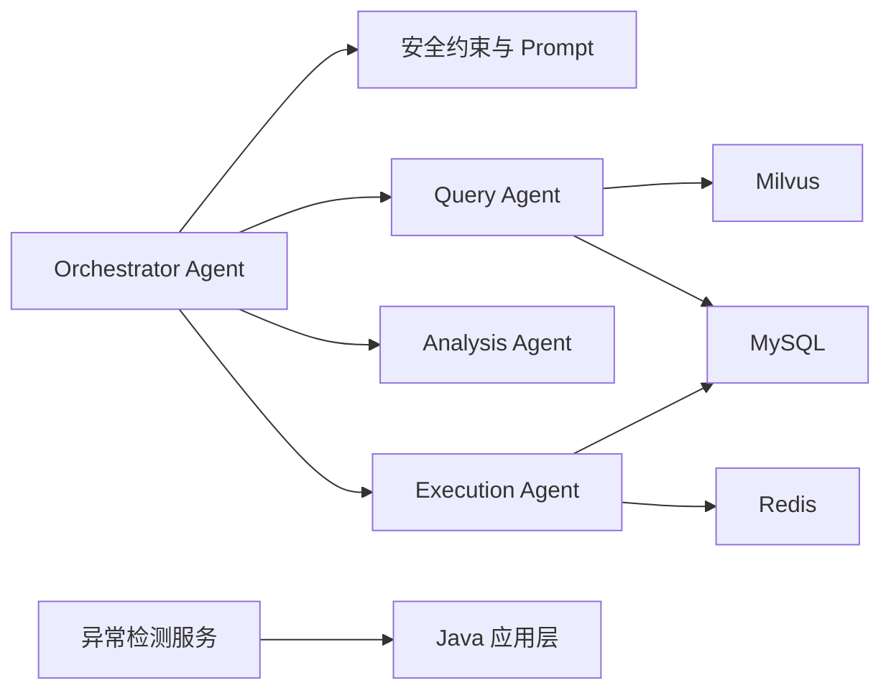

# 数据安全保护

<cite>
**本文引用的文件**
- [PROJECT_CONTEXT.md](file://PROJECT_CONTEXT.md)
- [开题报告_精简版.md](file://开题报告_精简版.md)
- [docker-compose.yml](file://docker-compose.yml)
- [config/milvus_collection.yaml](file://config/milvus_collection.yaml)
- [sql/init.sql](file://sql/init.sql)
- [docs/prompts/orchestrator-system-prompt.md](file://docs/prompts/orchestrator-system-prompt.md)
- [docs/prompts/shared-safety-constraints.md](file://docs/prompts/shared-safety-constraints.md)
</cite>

## 目录
1. [简介](#简介)
2. [项目结构](#项目结构)
3. [核心组件](#核心组件)
4. [架构总览](#架构总览)
5. [详细组件分析](#详细组件分析)
6. [依赖分析](#依赖分析)
7. [性能考虑](#性能考虑)
8. [故障排除指南](#故障排除指南)
9. [结论](#结论)
10. [附录](#附录)

## 简介
本文件面向“面向 NetData 监控数据的智能运维问答与执行系统”，聚焦数据安全保护，围绕以下目标展开：
- 敏感数据识别标准：数据分类、敏感级别划分、数据生命周期管理
- 数据脱敏技术实现：正则表达式脱敏、结构化脱敏、动态脱敏策略
- 日志安全规范：日志内容脱敏、日志格式标准化、日志存储安全
- 数据加密存储与传输安全
- 数据访问控制与数据泄露防护最佳实践

系统采用 Spring Boot + Spring AI + Milvus + MySQL + Redis + Ollama 的混合架构，结合 Prompt 管理与安全约束，形成从“意图识别—风险评估—人工审批—执行—审计”的闭环。

## 项目结构
系统采用多模块分层组织，后端以 Spring Boot 为核心，前后端分离，容器化编排。关键安全相关的位置如下：
- 后端 Java 模块：核心 Agent、RAG、AI 客户端、配置与安全约束
- 异常检测 Python 微服务：与后端通过 REST 通信
- 向量数据库 Milvus：存储知识库向量
- 关系数据库 MySQL：存储用户、对话、命令审计、告警等结构化数据
- 缓存 Redis：会话、检索结果缓存、分布式锁
- LLM：DeepSeek API（主）+ Ollama（本地调试）

图表来源
- [docker-compose.yml:1-357](file://docker-compose.yml#L1-L357)
- [PROJECT_CONTEXT.md:120-149](file://PROJECT_CONTEXT.md#L120-L149)

章节来源
- [PROJECT_CONTEXT.md:16-40](file://PROJECT_CONTEXT.md#L16-L40)
- [开题报告_精简版.md:118-152](file://开题报告_精简版.md#L118-L152)
- [docker-compose.yml:23-357](file://docker-compose.yml#L23-L357)

## 核心组件
- Orchestrator Agent：意图识别、路由、紧急度评估、实体抽取
- Query Agent：RAG 检索 + LLM 推理，生成运维建议
- Analysis Agent：ReAct 模式，多步工具调用，输出结构化诊断报告
- Execution Agent：命令生成→风险评估→人工审批→执行→记录
- 安全约束与 Prompt：统一的安全边界、最小权限、防御优先、审计追溯
- 数据库与缓存：MySQL 存储结构化数据，Redis 缓存与锁
- 向量数据库：Milvus 存储知识库向量，支持 COSINE 相似度检索

章节来源
- [PROJECT_CONTEXT.md:43-61](file://PROJECT_CONTEXT.md#L43-L61)
- [开题报告_精简版.md:223-301](file://开题报告_精简版.md#L223-L301)
- [docs/prompts/orchestrator-system-prompt.md:1-291](file://docs/prompts/orchestrator-system-prompt.md#L1-L291)
- [docs/prompts/shared-safety-constraints.md:1-396](file://docs/prompts/shared-safety-constraints.md#L1-L396)

## 架构总览
系统整体安全架构强调“最小权限、防御优先、审计追溯”。Agent 之间通过受控路由协作，命令执行必须经风险评估与人工审批，日志与审计严格脱敏与标准化，数据库与缓存均需安全配置与访问控制。

图表来源
- [docs/prompts/orchestrator-system-prompt.md:37-137](file://docs/prompts/orchestrator-system-prompt.md#L37-L137)
- [docs/prompts/shared-safety-constraints.md:29-258](file://docs/prompts/shared-safety-constraints.md#L29-L258)
- [sql/init.sql:114-138](file://sql/init.sql#L114-L138)

## 详细组件分析

### 敏感数据识别与生命周期管理
- 敏感数据识别
  - 密码、API 密钥、证书（私钥）、包含密码的配置、PII 用户数据
  - 处理方式：加密存储、日志脱敏、最小访问
- 敏感级别划分
  - 高敏：私钥、密码、PII
  - 中敏：API 密钥、含密码配置
  - 低敏：公开文档、日志摘要
- 生命周期管理
  - 创建：最小化采集与处理
  - 使用：最小权限访问、参数化/白名单
  - 存储：加密存储、访问控制、定期轮换
  - 传输：TLS/HTTPS、签名/鉴权
  - 归档与销毁：按法规与策略执行

章节来源
- [docs/prompts/shared-safety-constraints.md:130-171](file://docs/prompts/shared-safety-constraints.md#L130-L171)
- [sql/init.sql:220-244](file://sql/init.sql#L220-L244)

### 数据脱敏技术实现
- 正则表达式脱敏
  - 适用：IP、端口、邮箱、URL、路径等
  - 策略：保留前缀/后缀，中间用掩码替换
- 结构化脱敏
  - 数据库连接串、日志字段：脱敏后展示
  - 配置文件：移除明文密码，使用密钥管理服务
- 动态脱敏策略
  - 按角色与场景动态调整脱敏粒度
  - 审计日志中仅记录必要字段，避免敏感信息落盘

章节来源
- [docs/prompts/shared-safety-constraints.md:143-171](file://docs/prompts/shared-safety-constraints.md#L143-L171)

### 日志安全规范
- 日志内容脱敏
  - 禁止记录密码、API 密钥、私钥、PII
  - 使用占位符或掩码
- 日志格式标准化
  - 统一 JSON 结构，包含时间戳、事件类型、用户、动作、资源、结果、IP、会话 ID、耗时
- 日志存储安全
  - 本地落盘：只保留必要字段，限制保留期
  - 远程集中：TLS 传输、访问鉴权、只读权限

章节来源
- [docs/prompts/shared-safety-constraints.md:296-325](file://docs/prompts/shared-safety-constraints.md#L296-L325)

### 数据加密存储与传输安全
- 存储加密
  - MySQL：启用 TLS 连接、使用加密存储引擎（如 TDE）
  - Milvus：对象存储 MinIO 使用 HTTPS/密钥管理
  - Redis：启用访问控制与网络隔离
- 传输加密
  - 所有外部 API 调用使用 HTTPS
  - LLM 通信使用 API 密钥与签名
- 密钥管理
  - 使用环境变量或密钥管理服务（KMS）管理密钥
  - 定期轮换，最小化暴露面

章节来源
- [docker-compose.yml:64-98](file://docker-compose.yml#L64-L98)
- [docker-compose.yml:163-208](file://docker-compose.yml#L163-L208)
- [docker-compose.yml:218-246](file://docker-compose.yml#L218-L246)
- [config/milvus_collection.yaml:155-162](file://config/milvus_collection.yaml#L155-L162)

### 数据访问控制与数据泄露防护
- 访问控制
  - 角色权限矩阵：viewer、operator、admin、super-admin
  - 最小权限：仅授予完成任务所需权限
- 泄露防护
  - 输入验证：SQL 注入、命令注入、XSS 防护
  - URL 白名单：仅允许白名单域名
  - 审计与告警：异常行为自动告警与阻断
- 审批与回滚
  - 高风险命令必须人工审批
  - 执行失败自动回滚，记录审计日志

章节来源
- [docs/prompts/shared-safety-constraints.md:233-258](file://docs/prompts/shared-safety-constraints.md#L233-L258)
- [docs/prompts/shared-safety-constraints.md:199-231](file://docs/prompts/shared-safety-constraints.md#L199-L231)
- [docs/prompts/shared-safety-constraints.md:262-293](file://docs/prompts/shared-safety-constraints.md#L262-L293)

## 依赖分析
系统安全相关依赖与耦合关系如下：
- Orchestrator 依赖安全约束与 Prompt，确保路由与实体抽取符合安全边界
- Query Agent 依赖 Milvus 与 MySQL，需最小权限访问与参数化查询
- Execution Agent 依赖 MySQL 审计、Redis 分布式锁与安全命令模板
- Python 异常检测服务与 Java 层通过 REST 通信，需 TLS 与鉴权

图表来源
- [docs/prompts/orchestrator-system-prompt.md:109-137](file://docs/prompts/orchestrator-system-prompt.md#L109-L137)
- [docs/prompts/shared-safety-constraints.md:29-258](file://docs/prompts/shared-safety-constraints.md#L29-L258)
- [docker-compose.yml:23-357](file://docker-compose.yml#L23-L357)

章节来源
- [docs/prompts/orchestrator-system-prompt.md:1-291](file://docs/prompts/orchestrator-system-prompt.md#L1-L291)
- [docs/prompts/shared-safety-constraints.md:1-396](file://docs/prompts/shared-safety-constraints.md#L1-L396)
- [docker-compose.yml:23-357](file://docker-compose.yml#L23-L357)

## 性能考虑
- 检索性能：Milvus 索引参数（nlist/nprobe）与 Top-K 需平衡精度与速度
- 缓存命中：Redis 缓存检索结果与会话，减少重复计算
- 数据库优化：合理索引、参数化查询、连接池与只读副本
- 日志异步：审计日志异步写入，避免阻塞主流程

## 故障排除指南
- 命令执行失败
  - 检查审批状态与风险等级
  - 查看审计表中的错误信息与执行耗时
  - 启用回滚并记录事件
- 日志泄露风险
  - 审核日志字段，确保未记录敏感信息
  - 使用脱敏模板与白名单
- 权限不足
  - 核对角色权限矩阵
  - 检查最小权限策略与审批流程
- 数据库连接异常
  - 检查 TLS 与认证配置
  - 校验参数化查询与输入长度限制

章节来源
- [sql/init.sql:114-138](file://sql/init.sql#L114-L138)
- [docs/prompts/shared-safety-constraints.md:262-293](file://docs/prompts/shared-safety-constraints.md#L262-L293)

## 结论
本系统通过“安全约束 + Prompt 管理 + 数据库/缓存/向量库安全配置 + 审计与审批”形成闭环数据安全体系。建议在后续实现中：
- 将 Prompt 与安全约束模块化，便于版本演进
- 引入密钥管理与审计日志集中化
- 建立安全基线与自动化扫描机制
- 持续优化检索与缓存策略，兼顾性能与安全

## 附录
- 系统技术栈与部署：Spring Boot、Spring AI、Milvus、MySQL、Redis、Ollama、Docker Compose
- 数据库初始化脚本涵盖：用户、对话、命令审计、告警、异常检测、系统配置等表
- 向量集合配置：固定维度、COSINE 相似度、索引类型与搜索参数

章节来源
- [PROJECT_CONTEXT.md:25-40](file://PROJECT_CONTEXT.md#L25-L40)
- [sql/init.sql:18-274](file://sql/init.sql#L18-L274)
- [config/milvus_collection.yaml:19-186](file://config/milvus_collection.yaml#L19-L186)