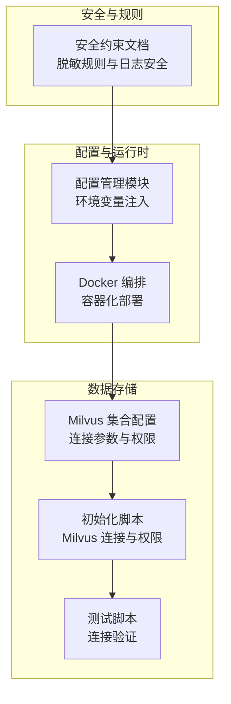
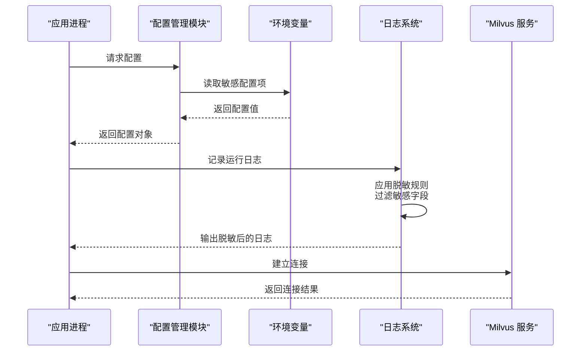
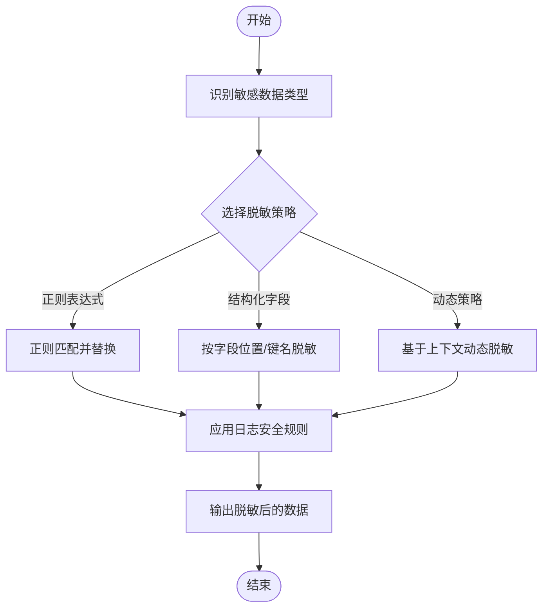
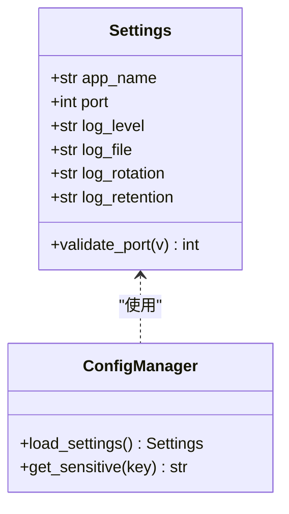
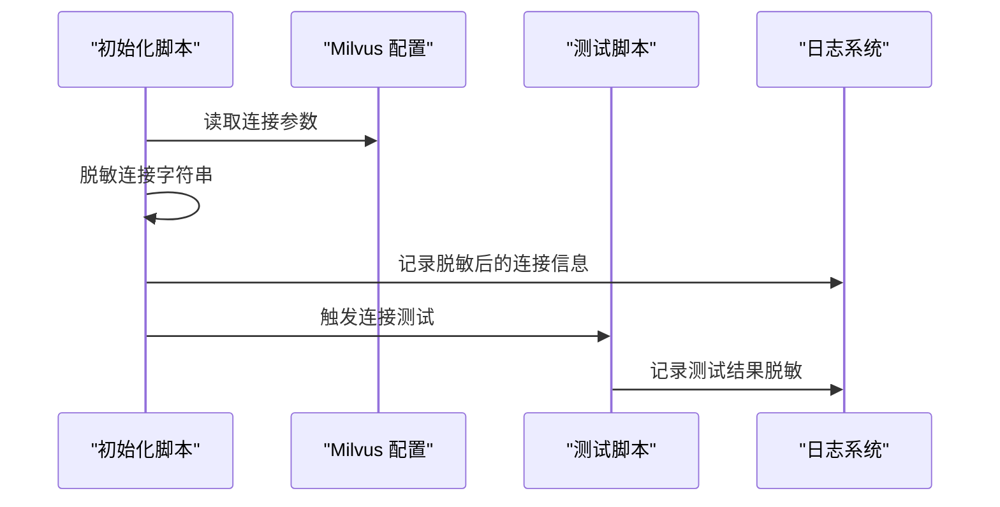
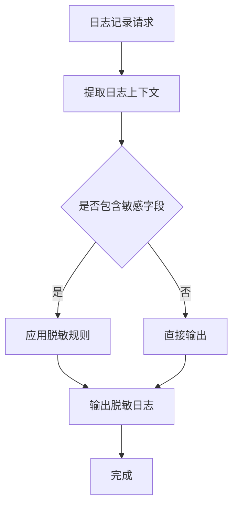
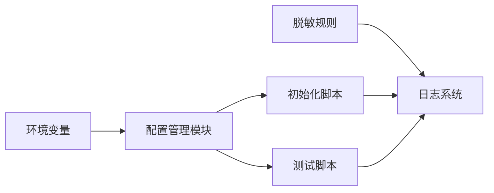

# 数据脱敏规则

<cite>
**本文引用的文件**
- [config.py](file://anomaly-detection-service/app/config.py)
- [shared-safety-constraints.md](file://docs/prompts/shared-safety-constraints.md)
- [milvus_collection.yaml](file://config/milvus_collection.yaml)
- [docker-compose.yml](file://docker-compose.yml)
- [init_milvus.py](file://scripts/init_milvus.py)
- [test_milvus_connection.py](file://tests/test_milvus_connection.py)
</cite>

## 目录
1. [引言](#引言)
2. [项目结构](#项目结构)
3. [核心组件](#核心组件)
4. [架构总览](#架构总览)
5. [详细组件分析](#详细组件分析)
6. [依赖关系分析](#依赖关系分析)
7. [性能考虑](#性能考虑)
8. [故障排除指南](#故障排除指南)
9. [结论](#结论)
10. [附录](#附录)

## 引言
本文件面向智能运维系统，系统性梳理数据脱敏规则与实践方法，涵盖正则表达式脱敏、结构化脱敏与动态脱敏策略，并结合项目现有配置与安全约束文档，给出密码、API密钥、数据库连接字符串等敏感数据的脱敏示例与实现建议。目标是在不显著影响数据可用性的前提下，有效保护敏感信息，满足日志安全与数据最小化披露的要求。

## 项目结构
围绕数据脱敏与安全的相关文件分布如下：
- 安全与脱敏规则：位于安全约束文档中，定义了敏感数据类型、脱敏策略与日志安全要求
- 配置管理：集中管理应用配置，支持环境变量注入，避免将敏感信息硬编码到代码或配置文件中
- Milvus 配置：向量数据库集合配置，涉及连接参数与权限设置
- Docker 编排：容器化部署，便于隔离与权限控制
- 初始化脚本：Milvus 初始化流程，涉及连接与权限初始化
- 测试脚本：Milvus 连接测试，用于验证配置与网络连通性

**图表来源**
- [shared-safety-constraints.md:130-171](file://docs/prompts/shared-safety-constraints.md#L130-L171)
- [config.py:1-182](file://anomaly-detection-service/app/config.py#L1-L182)
- [milvus_collection.yaml](file://config/milvus_collection.yaml)
- [docker-compose.yml](file://docker-compose.yml)
- [init_milvus.py](file://scripts/init_milvus.py)
- [test_milvus_connection.py](file://tests/test_milvus_connection.py)

**章节来源**
- [shared-safety-constraints.md:130-171](file://docs/prompts/shared-safety-constraints.md#L130-L171)
- [config.py:1-182](file://anomaly-detection-service/app/config.py#L1-L182)

## 核心组件
- 安全约束与脱敏规则：明确敏感数据类型与脱敏策略，强调日志中不得直接输出敏感字段
- 配置管理：通过环境变量加载配置，避免将密码、密钥等敏感信息写入代码或默认配置
- Milvus 配置与初始化：连接参数与权限设置，确保最小权限原则
- Docker 编排：容器化部署，便于隔离与权限控制，减少敏感信息泄露面

**章节来源**
- [shared-safety-constraints.md:130-171](file://docs/prompts/shared-safety-constraints.md#L130-L171)
- [config.py:1-182](file://anomaly-detection-service/app/config.py#L1-L182)
- [milvus_collection.yaml](file://config/milvus_collection.yaml)
- [docker-compose.yml](file://docker-compose.yml)

## 架构总览
下图展示了从配置加载到数据存储的端到端流程，以及脱敏规则在各环节的应用点：

**图表来源**
- [config.py:1-182](file://anomaly-detection-service/app/config.py#L1-L182)
- [shared-safety-constraints.md:130-171](file://docs/prompts/shared-safety-constraints.md#L130-L171)
- [milvus_collection.yaml](file://config/milvus_collection.yaml)

## 详细组件分析

### 组件A：安全约束与脱敏规则
- 敏感数据识别：密码、API密钥、证书、配置文件、用户数据（PII）等
- 脱敏策略示例：
  - 密码：显示前若干位，其余用占位符替代
  - API密钥：显示前缀与后缀，中间部分脱敏
  - 数据库连接字符串：对密码部分进行脱敏
- 日志安全：禁止在日志中直接输出敏感字段，采用占位或脱敏格式

**图表来源**
- [shared-safety-constraints.md:130-171](file://docs/prompts/shared-safety-constraints.md#L130-L171)

**章节来源**
- [shared-safety-constraints.md:130-171](file://docs/prompts/shared-safety-constraints.md#L130-L171)

### 组件B：配置管理与敏感信息处理
- 配置加载优先级：环境变量 > .env 文件 > 默认值
- 设计原则：敏感信息从环境变量读取，避免硬编码；提供类型验证与端口范围校验
- 实践建议：将密码、API密钥、数据库连接字符串等放入环境变量，应用启动时自动注入

**图表来源**
- [config.py:28-182](file://anomaly-detection-service/app/config.py#L28-L182)

**章节来源**
- [config.py:1-182](file://anomaly-detection-service/app/config.py#L1-L182)

### 组件C：Milvus 配置与连接脱敏
- 集合配置：涉及连接参数与权限设置，应避免在日志中打印原始连接字符串
- 初始化脚本：建立连接并进行必要的权限初始化
- 测试脚本：验证连接是否成功，确保配置正确

**图表来源**
- [milvus_collection.yaml](file://config/milvus_collection.yaml)
- [init_milvus.py](file://scripts/init_milvus.py)
- [test_milvus_connection.py](file://tests/test_milvus_connection.py)

**章节来源**
- [milvus_collection.yaml](file://config/milvus_collection.yaml)
- [init_milvus.py](file://scripts/init_milvus.py)
- [test_milvus_connection.py](file://tests/test_milvus_connection.py)

### 组件D：日志安全与脱敏实施
- 日志记录规范：禁止直接输出敏感字段；采用占位或脱敏格式
- 实施要点：在日志拦截层统一应用脱敏规则，确保所有输出均经过处理

**图表来源**
- [shared-safety-constraints.md:159-168](file://docs/prompts/shared-safety-constraints.md#L159-L168)

**章节来源**
- [shared-safety-constraints.md:159-168](file://docs/prompts/shared-safety-constraints.md#L159-L168)

## 依赖关系分析
- 配置模块依赖于环境变量，确保敏感信息不被硬编码
- Milvus 初始化与测试脚本依赖配置模块提供的连接参数
- 日志系统依赖脱敏规则，确保输出内容安全

**图表来源**
- [config.py:1-182](file://anomaly-detection-service/app/config.py#L1-L182)
- [shared-safety-constraints.md:130-171](file://docs/prompts/shared-safety-constraints.md#L130-L171)

**章节来源**
- [config.py:1-182](file://anomaly-detection-service/app/config.py#L1-L182)
- [shared-safety-constraints.md:130-171](file://docs/prompts/shared-safety-constraints.md#L130-L171)

## 性能考虑
- 脱敏操作的复杂度通常与输入长度线性相关，建议在日志拦截层批量处理，避免重复计算
- 对于高频日志场景，可采用缓存机制减少重复脱敏成本
- 在容器化环境中，合理设置日志轮转与保留策略，降低磁盘占用与扫描开销

## 故障排除指南
- 症状：日志中出现明文敏感信息
  - 排查：检查日志拦截层是否正确应用脱敏规则
  - 处理：统一接入脱敏中间件，确保所有输出均经过脱敏
- 症状：连接失败或权限错误
  - 排查：确认环境变量中的连接参数是否正确，连接字符串是否已脱敏
  - 处理：使用初始化脚本验证连接，必要时重新注入环境变量

**章节来源**
- [shared-safety-constraints.md:159-168](file://docs/prompts/shared-safety-constraints.md#L159-L168)
- [config.py:1-182](file://anomaly-detection-service/app/config.py#L1-L182)
- [init_milvus.py](file://scripts/init_milvus.py)
- [test_milvus_connection.py](file://tests/test_milvus_connection.py)

## 结论
通过将脱敏规则嵌入到配置管理、日志系统与数据存储流程中，可以在保证系统可观测性与可用性的前提下，有效降低敏感信息泄露风险。建议持续完善脱敏策略与自动化检测，确保在多环境部署中保持一致的安全基线。

## 附录
- 敏感数据类型与处理方式参考：[安全约束文档:130-171](file://docs/prompts/shared-safety-constraints.md#L130-L171)
- 配置加载与环境变量注入参考：[配置管理模块:1-182](file://anomaly-detection-service/app/config.py#L1-L182)
- Milvus 连接与初始化参考：[Milvus 集合配置](file://config/milvus_collection.yaml)，[初始化脚本](file://scripts/init_milvus.py)，[测试脚本](file://tests/test_milvus_connection.py)
- 容器化部署参考：[Docker 编排](file://docker-compose.yml)