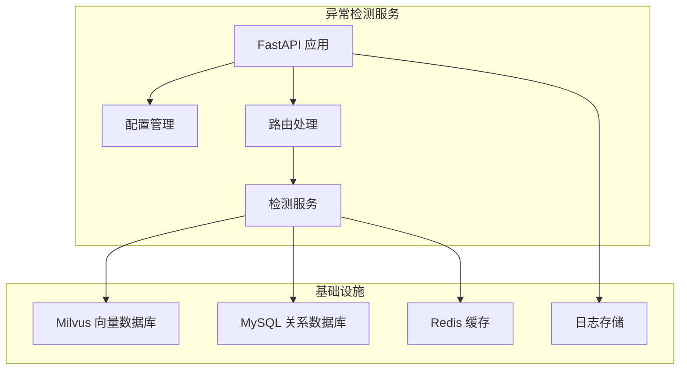
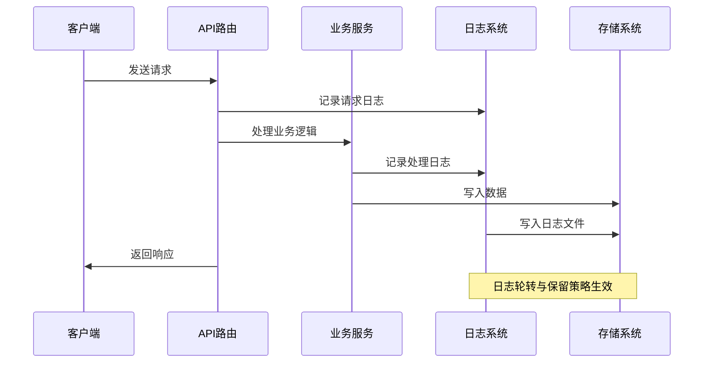
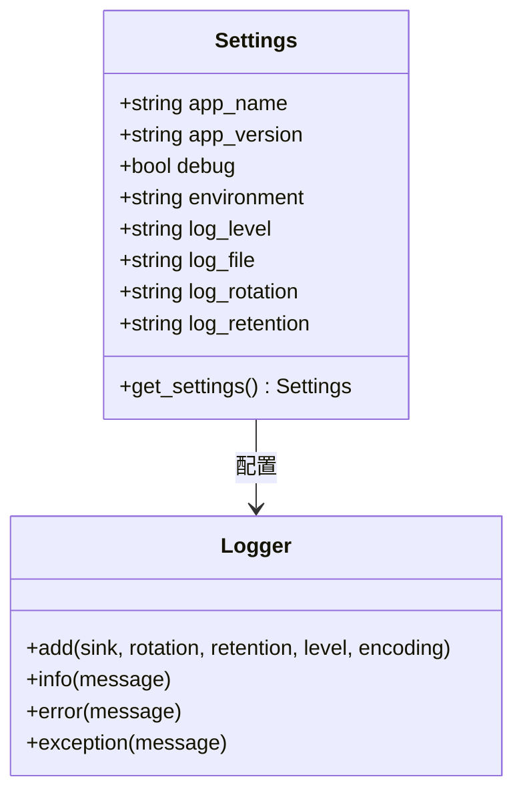
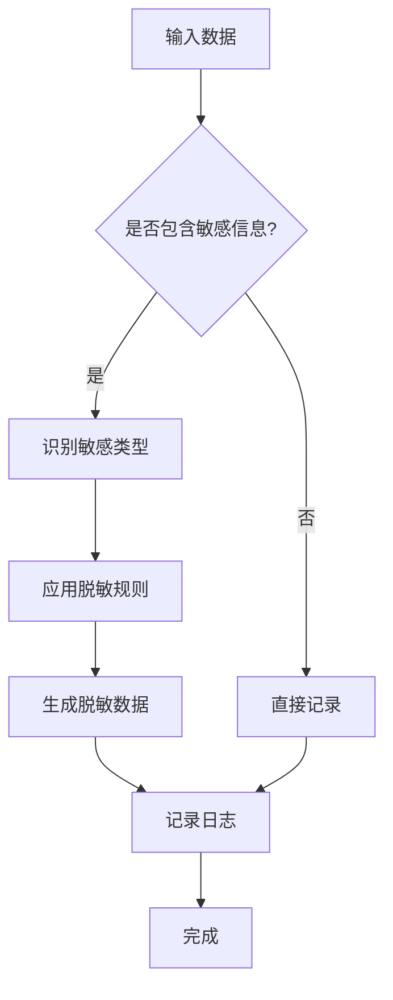
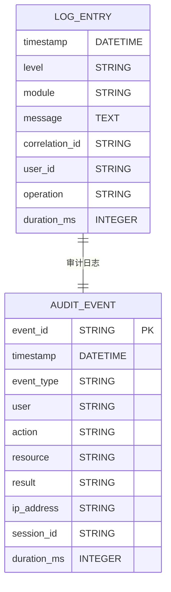
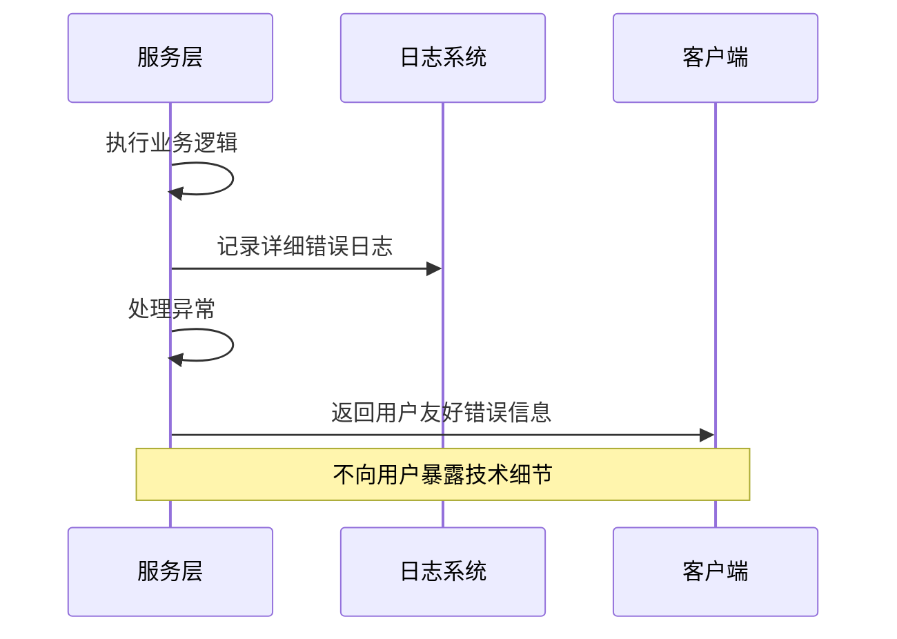
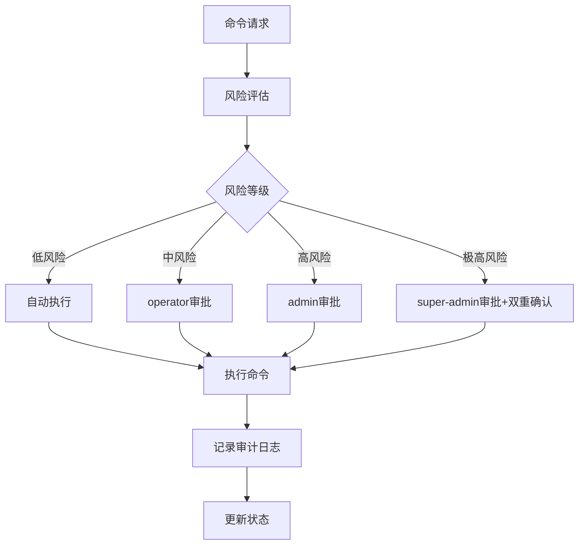
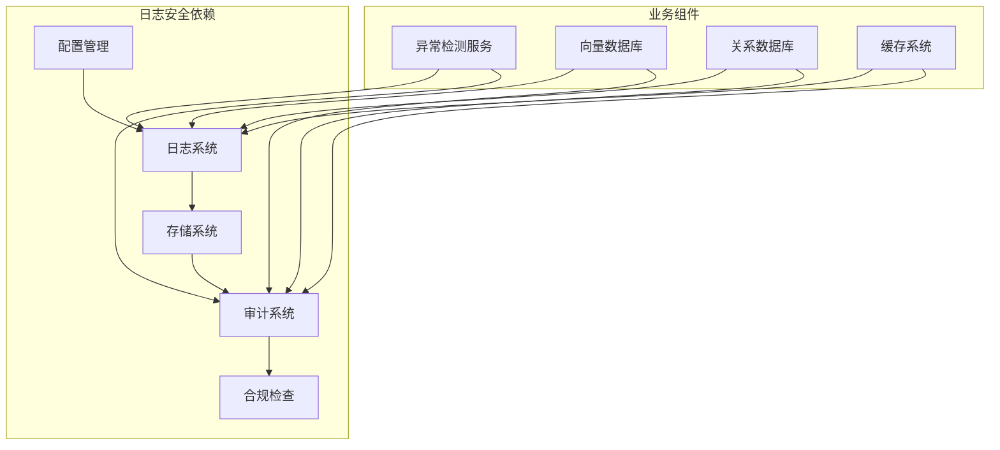

# 日志安全规范

<cite>
**本文档引用的文件**
- [PROJECT_CONTEXT.md](file://PROJECT_CONTEXT.md)
- [shared-safety-constraints.md](file://docs/prompts/shared-safety-constraints.md)
- [config.py](file://anomaly-detection-service/app/config.py)
- [main.py](file://anomaly-detection-service/app/main.py)
- [detection.py](file://anomaly-detection-service/app/api/routes/detection.py)
- [detection_service.py](file://anomaly-detection-service/app/services/detection_service.py)
- [schemas.py](file://anomaly-detection-service/app/models/schemas.py)
- [milvus_collection.yaml](file://config/milvus_collection.yaml)
- [docker-compose.yml](file://docker-compose.yml)
- [init.sql](file://sql/init.sql)
</cite>

## 目录
1. [简介](#简介)
2. [项目结构](#项目结构)
3. [核心组件](#核心组件)
4. [架构概览](#架构概览)
5. [详细组件分析](#详细组件分析)
6. [依赖分析](#依赖分析)
7. [性能考虑](#性能考虑)
8. [故障排除指南](#故障排除指南)
9. [结论](#结论)
10. [附录](#附录)

## 简介
本规范旨在为智能运维系统提供全面的日志安全处理指南，涵盖敏感信息脱敏、日志格式标准化以及日志存储安全要求。通过对项目现有代码库的深入分析，结合共享安全约束文档，形成可操作的日志安全实践标准，确保在系统开发与运维过程中有效保护敏感信息，满足合规性要求。

## 项目结构
项目采用多服务架构，包含异常检测服务、向量数据库、关系数据库、缓存系统等基础设施。日志安全规范需覆盖各服务的日志生成、传输、存储与审计全流程。

**图表来源**
- [docker-compose.yml:23-357](file://docker-compose.yml#L23-L357)
- [PROJECT_CONTEXT.md:120-149](file://PROJECT_CONTEXT.md#L120-L149)

**章节来源**
- [PROJECT_CONTEXT.md:120-149](file://PROJECT_CONTEXT.md#L120-L149)
- [docker-compose.yml:1-357](file://docker-compose.yml#L1-357)

## 核心组件
日志安全规范涉及以下核心组件：

### 异常检测服务日志
异常检测服务使用 Loguru 框架进行日志管理，支持配置化的日志级别、轮转和保留策略。

### 配置管理系统
集中化的配置管理确保日志配置的一致性和安全性，支持环境变量覆盖。

### 数据模型与验证
Pydantic 数据模型提供输入验证，防止敏感信息进入日志系统。

**章节来源**
- [config.py:147-154](file://anomaly-detection-service/app/config.py#L147-L154)
- [main.py:46-53](file://anomaly-detection-service/app/main.py#L46-L53)
- [schemas.py:63-130](file://anomaly-detection-service/app/models/schemas.py#L63-L130)

## 架构概览
系统日志流通过以下路径实现安全处理：

**图表来源**
- [main.py:118-139](file://anomaly-detection-service/app/main.py#L118-L139)
- [detection.py:81-152](file://anomaly-detection-service/app/api/routes/detection.py#L81-L152)

## 详细组件分析

### 日志配置与管理
异常检测服务采用集中式日志配置管理：

**图表来源**
- [config.py:28-183](file://anomaly-detection-service/app/config.py#L28-L183)
- [main.py:46-53](file://anomaly-detection-service/app/main.py#L46-L53)

#### 日志级别与安全策略
- DEBUG: 仅在开发环境启用，包含详细的技术信息
- INFO: 生产环境默认级别，记录正常业务流程
- WARNING/ERROR: 记录异常和错误信息

#### 日志轮转与保留
- 文件大小轮转：10MB
- 保留周期：7天
- 编码格式：UTF-8

**章节来源**
- [config.py:147-154](file://anomaly-detection-service/app/config.py#L147-L154)
- [main.py:46-53](file://anomaly-detection-service/app/main.py#L46-L53)

### 敏感信息脱敏策略
根据共享安全约束文档，实施多层次的敏感信息保护：

**图表来源**
- [shared-safety-constraints.md:132-168](file://docs/prompts/shared-safety-constraints.md#L132-L168)

#### 敏感数据识别
- 密码：数据库密码、API密钥
- 证书：SSL证书、私钥
- 配置：包含密码的配置文件
- 用户数据：个人身份信息(PII)

#### 脱敏规则应用
- 密码：显示前4位，其余用星号替换
- API密钥：显示前3位和后4位
- 数据库连接串：隐藏密码部分

**章节来源**
- [shared-safety-constraints.md:132-168](file://docs/prompts/shared-safety-constraints.md#L132-L168)

### 日志格式标准化
建立统一的日志格式规范，确保审计和合规需求：

**图表来源**
- [shared-safety-constraints.md:298-323](file://docs/prompts/shared-safety-constraints.md#L298-L323)

#### 必须记录的事件类型
- 用户登录/登出
- 命令生成
- 风险评估
- 审批决策
- 命令执行
- 配置变更
- 数据访问

#### 日志字段要求
- 时间戳：ISO 8601格式
- 事件类型：标准化枚举
- 用户标识：唯一用户ID
- 操作详情：完整操作描述
- 结果状态：成功/失败
- 耗时信息：毫秒级精度

**章节来源**
- [shared-safety-constraints.md:298-323](file://docs/prompts/shared-safety-constraints.md#L298-L323)

### 错误处理与安全
实现安全的错误处理机制，防止敏感信息泄露：

**图表来源**
- [shared-safety-constraints.md:264-279](file://docs/prompts/shared-safety-constraints.md#L264-L279)

#### 错误信息脱敏原则
- 技术细节：记录在系统日志中
- 用户可见：简洁友好的错误信息
- 敏感信息：完全移除或脱敏

**章节来源**
- [shared-safety-constraints.md:264-279](file://docs/prompts/shared-safety-constraints.md#L264-L279)

### 命令执行审计
建立完整的命令执行审计体系：

**图表来源**
- [shared-safety-constraints.md:244-258](file://docs/prompts/shared-safety-constraints.md#L244-L258)

#### 审计日志表结构
- 执行审计表：记录命令执行的完整生命周期
- 命令模板表：管理可执行的命令模板
- 审计字段：包含风险等级、执行结果、耗时等

**章节来源**
- [shared-safety-constraints.md:244-258](file://docs/prompts/shared-safety-constraints.md#L244-L258)
- [init.sql:114-138](file://sql/init.sql#L114-L138)

## 依赖分析
日志安全规范涉及多个组件间的依赖关系：

**图表来源**
- [config.py:167-183](file://anomaly-detection-service/app/config.py#L167-L183)
- [docker-compose.yml:23-357](file://docker-compose.yml#L23-L357)

**章节来源**
- [config.py:167-183](file://anomaly-detection-service/app/config.py#L167-L183)
- [docker-compose.yml:23-357](file://docker-compose.yml#L23-L357)

## 性能考虑
日志系统的性能优化策略：

### 日志轮转策略
- 文件大小限制：10MB
- 自动轮转：基于文件大小
- 保留策略：7天
- 编码格式：UTF-8

### 日志级别优化
- 生产环境：INFO级别
- 开发环境：DEBUG级别
- 异常处理：ERROR级别

### 存储优化
- 分层存储：热数据内存，冷数据磁盘
- 压缩存储：减少磁盘占用
- 异步写入：提高写入性能

## 故障排除指南
常见日志安全问题及解决方案：

### 日志泄露问题
**问题症状**：敏感信息出现在日志中
**解决方案**：
1. 检查日志格式化字符串
2. 验证敏感信息过滤规则
3. 审核日志级别设置

### 日志轮转失败
**问题症状**：日志文件过大或无法轮转
**解决方案**：
1. 检查磁盘空间
2. 验证轮转配置
3. 确认文件权限

### 审计日志缺失
**问题症状**：审计记录不完整
**解决方案**：
1. 检查审计触发点
2. 验证数据库连接
3. 确认事务完整性

**章节来源**
- [config.py:147-154](file://anomaly-detection-service/app/config.py#L147-L154)
- [main.py:145-172](file://anomaly-detection-service/app/main.py#L145-L172)

## 结论
本日志安全规范通过标准化的日志处理流程、严格的敏感信息脱敏策略和完善的审计机制，为智能运维系统提供了全面的安全保障。实施这些规范将有效防止敏感信息泄露，满足合规性要求，并为系统的安全运维提供可靠支撑。

## 附录

### 最佳实践清单
- 始终使用脱敏后的数据进行日志记录
- 定期审查日志配置和轮转策略
- 建立日志安全培训机制
- 实施定期的日志安全审计

### 错误示例对比
**禁止的做法**：
- 直接记录敏感字段
- 暴露系统内部路径
- 记录完整的错误堆栈

**推荐的做法**：
- 使用占位符记录脱敏数据
- 提供用户友好的错误信息
- 记录必要的诊断信息

**章节来源**
- [shared-safety-constraints.md:159-168](file://docs/prompts/shared-safety-constraints.md#L159-L168)
- [shared-safety-constraints.md:264-279](file://docs/prompts/shared-safety-constraints.md#L264-L279)