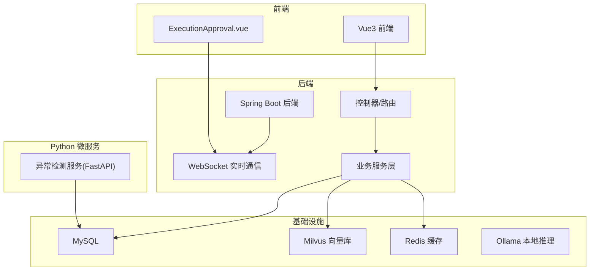
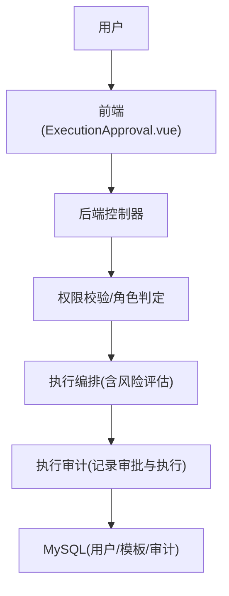
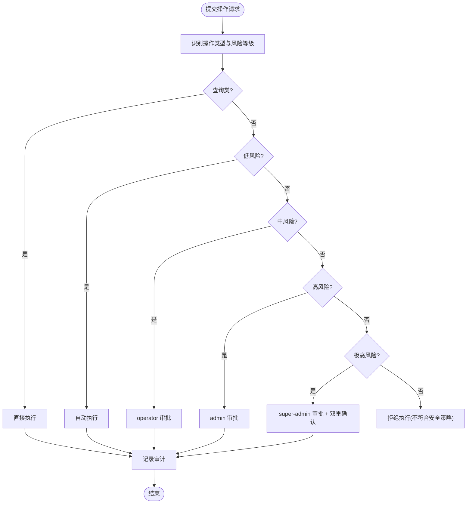
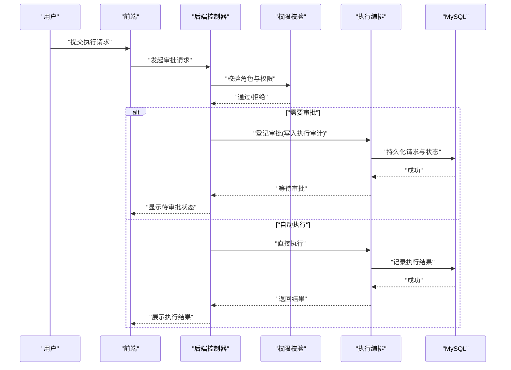
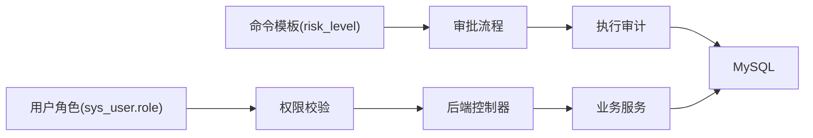

# 权限控制与审批

<cite>
**本文引用的文件**
- [PROJECT_CONTEXT.md](file://PROJECT_CONTEXT.md)
- [docker-compose.yml](file://docker-compose.yml)
- [init.sql](file://sql/init.sql)
- [shared-safety-constraints.md](file://docs/prompts/shared-safety-constraints.md)
</cite>

## 目录
1. [简介](#简介)
2. [项目结构](#项目结构)
3. [核心组件](#核心组件)
4. [架构总览](#架构总览)
5. [详细组件分析](#详细组件分析)
6. [依赖分析](#依赖分析)
7. [性能考虑](#性能考虑)
8. [故障排查指南](#故障排查指南)
9. [结论](#结论)

## 简介
本文件围绕智能运维问答与执行系统中的“权限控制与审批”主题，结合项目上下文、数据库初始化脚本与安全约束文档，系统化阐述角色权限矩阵、操作审批分级机制、最小权限原则的落地方式，并给出可执行的实现建议与流程图示。

## 项目结构
- 后端采用 Spring Boot（Java），包含 Agent、RAG、AI 客户端、WebSocket、配置等模块。
- 异常检测服务采用 Python FastAPI，独立部署。
- 前端包含执行审批页面（ExecutionApproval.vue），用于展示与交互。
- 数据库采用 MySQL，提供用户、命令模板、执行审计、告警等核心表。
- 安全约束文档明确了最小权限、审批流程与审计要求。



图表来源
- [docker-compose.yml:1-357](file://docker-compose.yml#L1-L357)
- [PROJECT_CONTEXT.md:120-149](file://PROJECT_CONTEXT.md#L120-L149)

章节来源
- [PROJECT_CONTEXT.md:16-166](file://PROJECT_CONTEXT.md#L16-L166)
- [docker-compose.yml:23-357](file://docker-compose.yml#L23-L357)

## 核心组件
- 用户与角色：系统用户表包含角色字段，支持 viewer、operator、admin 等角色，便于在后端进行权限判定。
- 命令模板与风险等级：命令模板表包含风险等级字段，用于区分低、中、高、极高等级，支撑审批分级。
- 执行审计：执行审计表记录请求ID、用户、命令、风险等级、状态、审批人等，形成完整的审批与执行闭环。
- 审批流程：安全约束文档定义了从查询类到极高风险操作的分级审批流程。
- 最小权限原则：安全约束文档明确最小权限与防御优先原则，指导系统设计与实现。

章节来源
- [init.sql:23-47](file://sql/init.sql#L23-L47)
- [init.sql:141-171](file://sql/init.sql#L141-L171)
- [init.sql:112-138](file://sql/init.sql#L112-L138)
- [shared-safety-constraints.md:233-258](file://docs/prompts/shared-safety-constraints.md#L233-L258)

## 架构总览
系统围绕“最小权限 + 分级审批”的安全基线展开，前端负责交互与通知，后端负责权限校验与业务编排，数据库承载用户、模板、审计等数据，微服务与基础设施提供能力支撑。



图表来源
- [PROJECT_CONTEXT.md:141-145](file://PROJECT_CONTEXT.md#L141-L145)
- [init.sql:112-138](file://sql/init.sql#L112-L138)
- [shared-safety-constraints.md:233-258](file://docs/prompts/shared-safety-constraints.md#L233-L258)

## 详细组件分析

### 角色权限矩阵设计与实施
- 角色定义：viewer、operator、admin 等角色由用户表 role 字段承载，便于后端统一鉴权。
- 权限覆盖范围：安全约束文档定义了不同角色在“知识问答、故障诊断、自动执行命令、审批执行命令”上的权限边界。
- 实施要点：
  - 在后端控制器层对每个接口进行角色校验，拒绝越权访问。
  - 对需要审批的操作，强制进入审批流程，记录审批人与审批意见。
  - 对高风险操作，引入“越权审批”能力（super-admin）并进行二次确认。

```mermaid
classDiagram
class SysUser {
+bigint id
+string username
+string password
+string role
+tinyint status
+datetime created_at
+datetime updated_at
}
class CommandTemplate {
+bigint id
+string name
+string category
+string risk_level
+text command_template
+tinyint is_whitelisted
+tinyint is_active
}
class ExecutionAudit {
+bigint id
+string request_id
+bigint user_id
+text command
+string command_type
+string target_host
+string risk_level
+int risk_score
+string status
+bigint approver_id
+datetime approved_at
+text execution_result
+text error_message
+int execution_time_ms
}
SysUser ||--o{ ExecutionAudit : "创建/审批"
CommandTemplate ||--o{ ExecutionAudit : "模板关联"
```

图表来源
- [init.sql:23-47](file://sql/init.sql#L23-L47)
- [init.sql:141-171](file://sql/init.sql#L141-L171)
- [init.sql:112-138](file://sql/init.sql#L112-L138)

章节来源
- [init.sql:23-47](file://sql/init.sql#L23-L47)
- [shared-safety-constraints.md:233-244](file://docs/prompts/shared-safety-constraints.md#L233-L244)

### 操作审批流程的分级机制
- 查询类操作：直接执行，无需审批。
- 低风险操作：自动执行，记录审计。
- 中风险操作：operator 审批。
- 高风险操作：admin 审批。
- 极高风险操作：super-admin 审批 + 双重确认。



图表来源
- [shared-safety-constraints.md:244-258](file://docs/prompts/shared-safety-constraints.md#L244-L258)

章节来源
- [shared-safety-constraints.md:244-258](file://docs/prompts/shared-safety-constraints.md#L244-L258)

### 权限控制的实现方法
- 最小权限原则：
  - 仅授予完成任务所需的最小权限，避免使用 root 权限执行非必要操作。
  - 对命令模板进行白名单管理，仅允许受控命令执行。
- 审批流程：
  - 在执行编排层对高风险命令进行拦截与审批登记，审批通过后方可执行。
  - 审批记录与执行结果同步写入执行审计表，保证可追溯。
- 审计与日志：
  - 所有操作必须记录日志，包含操作人、时间、内容、结果，满足审计要求。
  - 前端通过 WebSocket 接收审批状态与执行结果，提升用户体验。



图表来源
- [init.sql:112-138](file://sql/init.sql#L112-L138)
- [shared-safety-constraints.md:233-258](file://docs/prompts/shared-safety-constraints.md#L233-L258)

章节来源
- [shared-safety-constraints.md:7-26](file://docs/prompts/shared-safety-constraints.md#L7-L26)
- [init.sql:112-138](file://sql/init.sql#L112-L138)

### 审批流程的代码示例路径
- 执行审计表结构与字段定义：[execution_audit 表:112-138](file://sql/init.sql#L112-L138)
- 命令模板表结构与风险等级字段：[command_template 表:141-171](file://sql/init.sql#L141-L171)
- 用户表角色字段与默认管理员插入：[sys_user 表:23-47](file://sql/init.sql#L23-L47)
- 审批流程与角色权限矩阵：[共享安全约束:233-258](file://docs/prompts/shared-safety-constraints.md#L233-L258)

章节来源
- [init.sql:112-138](file://sql/init.sql#L112-L138)
- [init.sql:141-171](file://sql/init.sql#L141-L171)
- [init.sql:23-47](file://sql/init.sql#L23-L47)
- [shared-safety-constraints.md:233-258](file://docs/prompts/shared-safety-constraints.md#L233-L258)

## 依赖分析
- 角色与权限依赖：用户表 role 字段是权限判定的基础，控制器层依赖该字段进行访问控制。
- 风险与审批依赖：命令模板表的风险等级字段驱动审批流程的触发与审批人层级。
- 审计与追溯依赖：执行审计表记录审批与执行全过程，为审计与复盘提供数据支撑。
- 基础设施依赖：MySQL 提供持久化能力，Milvus 与 Redis 支撑检索与缓存，Ollama 提供本地推理。



图表来源
- [init.sql:23-47](file://sql/init.sql#L23-L47)
- [init.sql:141-171](file://sql/init.sql#L141-L171)
- [init.sql:112-138](file://sql/init.sql#L112-L138)

章节来源
- [init.sql:23-47](file://sql/init.sql#L23-L47)
- [init.sql:141-171](file://sql/init.sql#L141-L171)
- [init.sql:112-138](file://sql/init.sql#L112-L138)

## 性能考虑
- 审批队列与异步处理：对高并发审批请求采用队列与异步处理，避免阻塞主线程。
- 缓存热点数据：将常用模板、用户角色信息缓存至 Redis，降低数据库压力。
- 审计日志落库优化：批量写入与异步刷盘，减少对主业务的影响。
- 健康检查与资源限制：通过 docker-compose 为各服务设置资源上限，保障系统稳定性。

## 故障排查指南
- 审批状态异常：检查执行审计表的状态流转是否正确，核对审批人与审批时间字段。
- 权限拒绝：确认用户角色是否正确，控制器层权限校验是否生效。
- 审计缺失：检查审计写入逻辑与数据库连接配置，确保关键事件均被记录。
- 前端审批状态不同步：检查 WebSocket 连接与消息推送逻辑，确保审批状态及时刷新。

章节来源
- [init.sql:112-138](file://sql/init.sql#L112-L138)
- [docker-compose.yml:160-208](file://docker-compose.yml#L160-L208)

## 结论
本系统以“最小权限原则”为基础，结合“分级审批机制”，通过用户角色、命令模板风险等级与执行审计三者协同，实现了从查询类到极高风险操作的全链路权限控制与审批闭环。配合完善的审计日志与前端交互，既保障了运维操作的安全可控，也为后续扩展与合规审计提供了坚实基础。