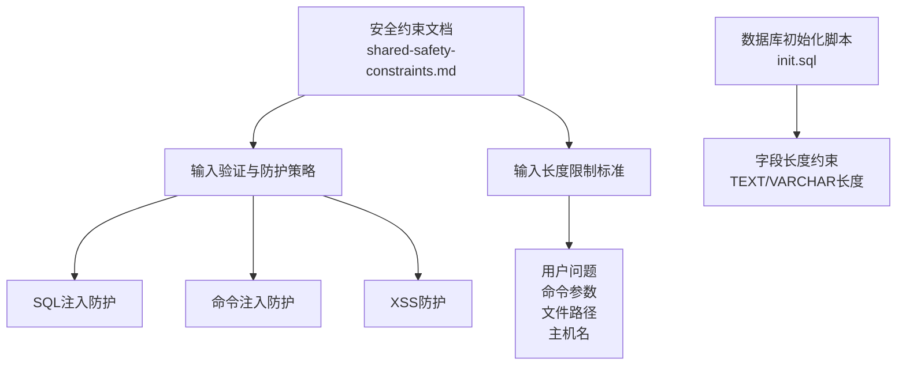
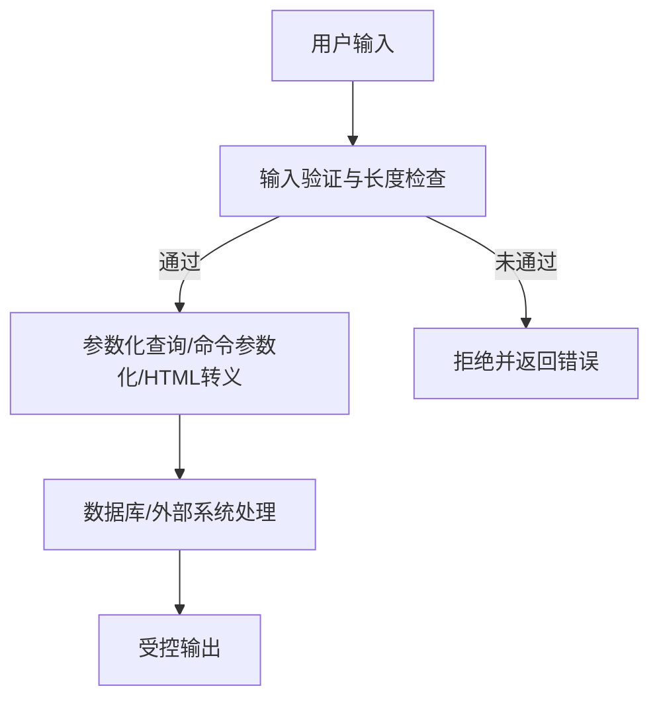
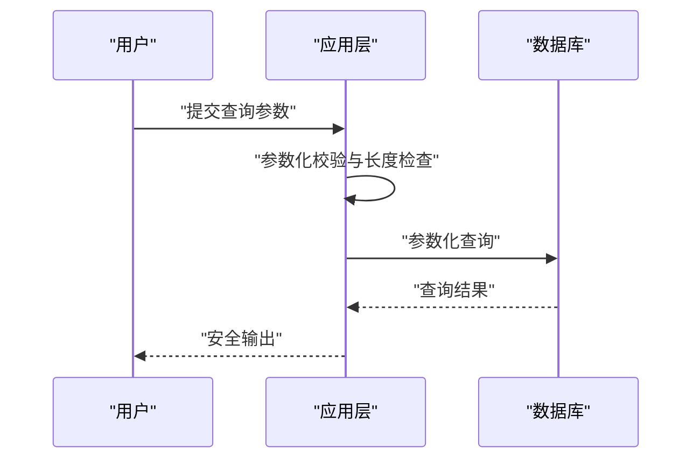
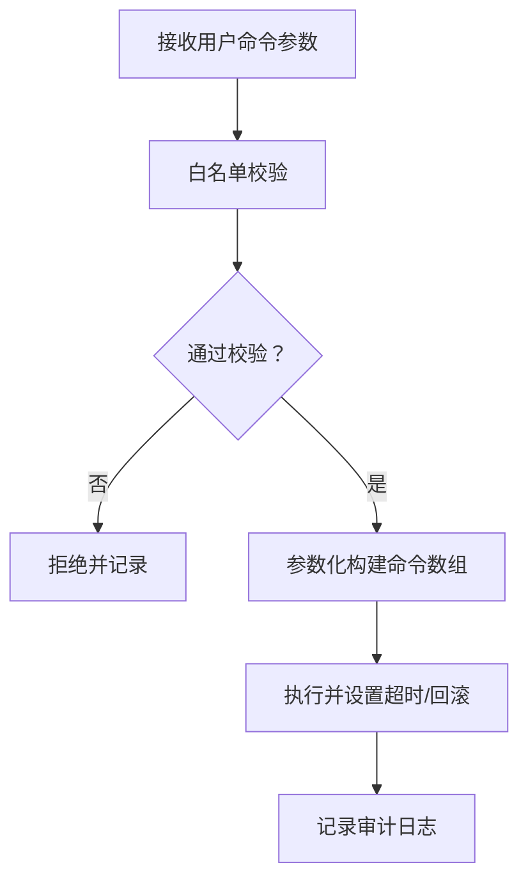
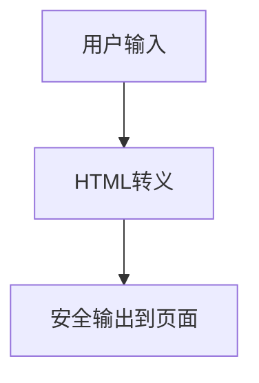
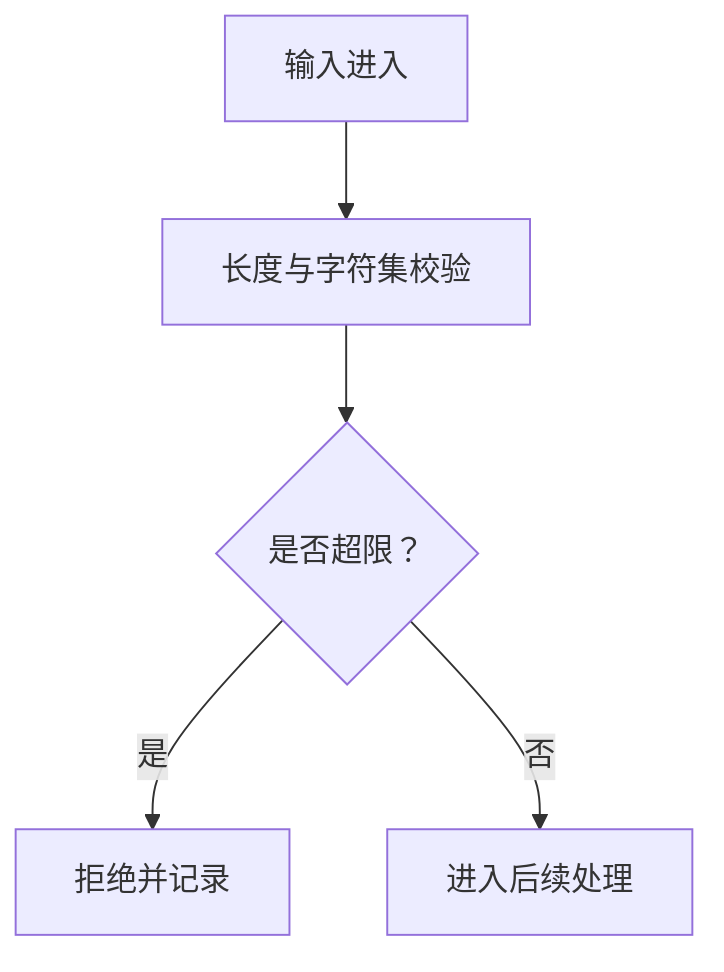
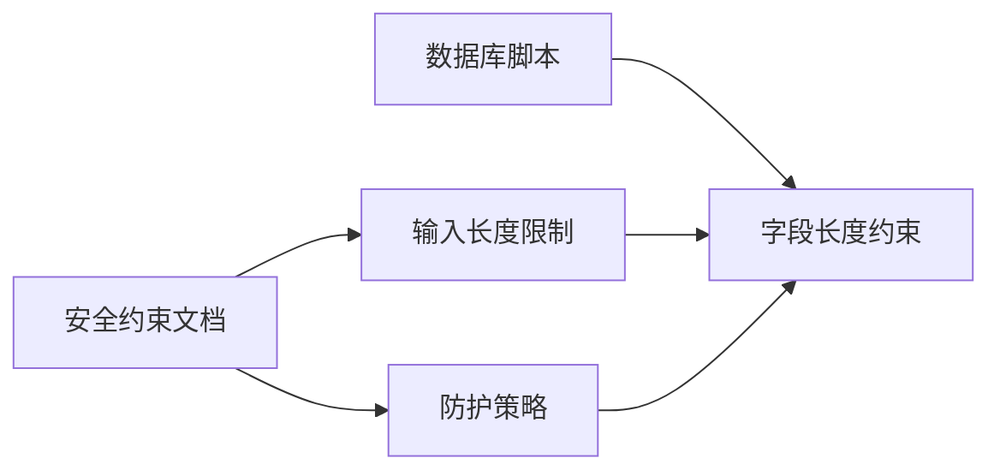

# 用户输入安全

<cite>
**本文引用的文件**
- [共享安全约束.md](file://docs/prompts/shared-safety-constraints.md)
- [初始化SQL脚本.sql](file://sql/init.sql)
</cite>

## 目录
1. [简介](#简介)
2. [项目结构](#项目结构)
3. [核心组件](#核心组件)
4. [架构总览](#架构总览)
5. [详细组件分析](#详细组件分析)
6. [依赖分析](#依赖分析)
7. [性能考虑](#性能考虑)
8. [故障排查指南](#故障排查指南)
9. [结论](#结论)
10. [附录](#附录)

## 简介
本文件聚焦于智能运维系统中的“用户输入安全”，围绕三大核心威胁（SQL 注入、命令注入、XSS）给出防护策略与实现方法，并结合项目现有安全约束文档与数据库设计，明确输入长度限制标准与实施要点。文档同时提供可视化流程图与最佳实践建议，帮助开发与运维人员在不直接暴露源码的前提下理解与落地安全控制。

## 项目结构
本仓库与用户输入安全直接相关的资料主要集中在以下两处：
- 安全约束与输入验证规范：docs/prompts/shared-safety-constraints.md
- 数据库表结构与字段长度约束：sql/init.sql

下图展示了与“用户输入安全”相关的关键文件及其作用：

图表来源
- [共享安全约束.md: 199-230:199-230](file://docs/prompts/shared-safety-constraints.md#L199-L230)
- [初始化SQL脚本.sql: 26-41:26-41](file://sql/init.sql#L26-L41)
- [初始化SQL脚本.sql: 96-109:96-109](file://sql/init.sql#L96-L109)
- [初始化SQL脚本.sql: 144-159:144-159](file://sql/init.sql#L144-L159)

章节来源
- [共享安全约束.md: 199-230:199-230](file://docs/prompts/shared-safety-constraints.md#L199-L230)
- [初始化SQL脚本.sql: 26-41:26-41](file://sql/init.sql#L26-L41)
- [初始化SQL脚本.sql: 96-109:96-109](file://sql/init.sql#L96-L109)
- [初始化SQL脚本.sql: 144-159:144-159](file://sql/init.sql#L144-L159)

## 核心组件
- 输入验证与防护策略
  - SQL 注入防护：采用参数化查询，避免将用户输入直接拼接到 SQL 字符串中。
  - 命令注入防护：对系统命令使用参数数组形式，避免字符串拼接；对输入进行白名单校验与长度限制。
  - XSS 防护：对输出到 HTML 的用户输入进行 HTML 转义。
- 输入长度限制标准
  - 用户问题：10000 字符
  - 命令参数：1000 字符
  - 文件路径：500 字符
  - 主机名：100 字符
- 数据库层面的输入约束
  - TEXT/VARCHAR 字段长度与索引设计，有助于限制输入长度并提升查询效率。
  - 关键业务表（对话消息、命令模板、告警记录等）的字段长度与约束，体现对输入规模的控制。

章节来源
- [共享安全约束.md: 205-220:205-220](file://docs/prompts/shared-safety-constraints.md#L205-L220)
- [共享安全约束.md: 222-230:222-230](file://docs/prompts/shared-safety-constraints.md#L222-L230)
- [初始化SQL脚本.sql: 96-109:96-109](file://sql/init.sql#L96-L109)
- [初始化SQL脚本.sql: 144-159:144-159](file://sql/init.sql#L144-L159)

## 架构总览
下图从“输入进入系统—校验—处理—输出”的视角，展示用户输入在系统中的流转与安全控制点：

图表来源
- [共享安全约束.md: 205-220:205-220](file://docs/prompts/shared-safety-constraints.md#L205-L220)
- [共享安全约束.md: 222-230:222-230](file://docs/prompts/shared-safety-constraints.md#L222-L230)

## 详细组件分析

### SQL 注入防护
- 技术要点
  - 使用参数化查询，将用户输入作为参数传入，而非拼接到 SQL 字符串。
  - 在数据库层，对 TEXT/VARCHAR 字段设置合理长度，避免过长输入导致存储与查询异常。
- 实施建议
  - 在应用层统一使用 ORM 或数据库驱动提供的参数化接口。
  - 对用户输入进行长度与字符集校验，结合数据库字段长度约束。
- 数据库侧约束参考
  - 对话消息内容字段为 TEXT，配合业务侧长度限制共同保障安全与性能。
  - 命令模板字段为 TEXT，需严格控制模板变量替换后的最终长度。

图表来源
- [共享安全约束.md: 207-209:207-209](file://docs/prompts/shared-safety-constraints.md#L207-L209)
- [初始化SQL脚本.sql: 96-109:96-109](file://sql/init.sql#L96-L109)

章节来源
- [共享安全约束.md: 205-220:205-220](file://docs/prompts/shared-safety-constraints.md#L205-L220)
- [初始化SQL脚本.sql: 96-109:96-109](file://sql/init.sql#L96-L109)

### 命令注入防护
- 技术要点
  - 将命令与其参数以数组形式传递给子进程接口，避免字符串拼接引发的注入。
  - 对输入进行白名单校验（仅允许预定义的命令与参数），并限制长度。
- 实施建议
  - 对命令执行进行分级审批与审计，结合超时与回滚机制。
  - 对日志与错误信息进行脱敏，避免泄露系统路径与配置。
- 参考规范
  - 命令黑名单与审批清单、URL 白名单、日志脱敏等安全规则。

图表来源
- [共享安全约束.md: 212-214:212-214](file://docs/prompts/shared-safety-constraints.md#L212-L214)
- [共享安全约束.md: 328-337:328-337](file://docs/prompts/shared-safety-constraints.md#L328-L337)
- [共享安全约束.md: 161-168:161-168](file://docs/prompts/shared-safety-constraints.md#L161-L168)

章节来源
- [共享安全约束.md: 211-215:211-215](file://docs/prompts/shared-safety-constraints.md#L211-L215)
- [共享安全约束.md: 328-337:328-337](file://docs/prompts/shared-safety-constraints.md#L328-L337)
- [共享安全约束.md: 161-168:161-168](file://docs/prompts/shared-safety-constraints.md#L161-L168)

### XSS 防护
- 技术要点
  - 对输出到 HTML 的用户输入进行 HTML 转义，避免脚本注入。
- 实施建议
  - 在模板渲染与前端输出环节统一进行转义。
  - 对富文本场景采用白名单过滤或安全编辑器。

图表来源
- [共享安全约束.md: 217-219:217-219](file://docs/prompts/shared-safety-constraints.md#L217-L219)

章节来源
- [共享安全约束.md: 216-220:216-220](file://docs/prompts/shared-safety-constraints.md#L216-L220)

### 输入长度限制与实施
- 标准
  - 用户问题：10000 字符
  - 命令参数：1000 字符
  - 文件路径：500 字符
  - 主机名：100 字符
- 实施方法
  - 应用层：在路由/服务入口进行长度与字符集校验，超过阈值直接拒绝。
  - 数据库层：通过 VARCHAR/TEXT 字段长度与索引约束，限制存储与查询成本。
  - 业务表字段参考：对话消息内容、命令模板、告警消息等字段长度设计，体现对输入规模的控制。

图表来源
- [共享安全约束.md: 222-230:222-230](file://docs/prompts/shared-safety-constraints.md#L222-L230)
- [初始化SQL脚本.sql: 96-109:96-109](file://sql/init.sql#L96-L109)
- [初始化SQL脚本.sql: 144-159:144-159](file://sql/init.sql#L144-L159)

章节来源
- [共享安全约束.md: 222-230:222-230](file://docs/prompts/shared-safety-constraints.md#L222-L230)
- [初始化SQL脚本.sql: 96-109:96-109](file://sql/init.sql#L96-L109)
- [初始化SQL脚本.sql: 144-159:144-159](file://sql/init.sql#L144-L159)

## 依赖分析
- 安全约束文档与数据库脚本的耦合点
  - 输入长度限制标准与数据库字段长度形成“双保险”，既保证应用层安全，也限制存储与查询开销。
  - 对话消息、命令模板、告警记录等表的字段长度设计，直接影响输入验证策略与用户体验。

图表来源
- [共享安全约束.md: 222-230:222-230](file://docs/prompts/shared-safety-constraints.md#L222-L230)
- [初始化SQL脚本.sql: 96-109:96-109](file://sql/init.sql#L96-L109)
- [初始化SQL脚本.sql: 144-159:144-159](file://sql/init.sql#L144-L159)

章节来源
- [共享安全约束.md: 222-230:222-230](file://docs/prompts/shared-safety-constraints.md#L222-L230)
- [初始化SQL脚本.sql: 96-109:96-109](file://sql/init.sql#L96-L109)
- [初始化SQL脚本.sql: 144-159:144-159](file://sql/init.sql#L144-L159)

## 性能考虑
- 合理的输入长度限制可降低数据库存储与查询压力，避免超长输入导致的慢查询与内存占用。
- 参数化查询与索引设计（如按状态、风险等级、创建时间等）有助于提升查询性能。
- 对日志与错误信息进行脱敏，避免冗余信息影响日志检索与分析效率。

## 故障排查指南
- 常见问题与定位
  - 输入被拒绝：检查是否超出长度限制或包含非法字符。
  - SQL 查询异常：确认是否使用参数化查询，避免字符串拼接。
  - 命令执行失败：检查命令参数是否在白名单内，是否超过长度限制。
  - 输出出现脚本：确认是否对输出进行了 HTML 转义。
- 审计与日志
  - 结合审计日志格式与事件清单，快速定位问题发生的时间、用户、操作与结果。
  - 对错误信息进行脱敏处理，避免泄露系统内部信息。

章节来源
- [共享安全约束.md: 266-279:266-279](file://docs/prompts/shared-safety-constraints.md#L266-L279)
- [共享安全约束.md: 314-323:314-323](file://docs/prompts/shared-safety-constraints.md#L314-L323)
- [共享安全约束.md: 348-356:348-356](file://docs/prompts/shared-safety-constraints.md#L348-L356)

## 结论
通过“应用层输入验证 + 数据库字段约束 + 审计与日志脱敏”的多层防护，智能运维系统能够有效抵御 SQL 注入、命令注入与 XSS 攻击。结合明确的输入长度限制标准与严格的白名单策略，可在保障功能可用性的前提下，显著提升系统的安全性与稳定性。

## 附录
- 安全检查清单（用户输入）
  - 输入是否验证？
  - 是否防 SQL 注入？
  - 是否防命令注入？
  - 是否防 XSS？
  - 长度是否超限？

章节来源
- [共享安全约束.md: 348-356:348-356](file://docs/prompts/shared-safety-constraints.md#L348-L356)