# 网络安全规则

<cite>
**本文档引用的文件**
- [shared-safety-constraints.md](file://docs/prompts/shared-safety-constraints.md)
- [docker-compose.yml](file://docker-compose.yml)
- [PROJECT_CONTEXT.md](file://PROJECT_CONTEXT.md)
- [init.sql](file://sql/init.sql)
- [milvus_collection.yaml](file://config/milvus_collection.yaml)
- [verify-env.sh](file://scripts/verify-env.sh)
</cite>

## 目录
1. [简介](#简介)
2. [项目结构](#项目结构)
3. [核心组件](#核心组件)
4. [架构概览](#架构概览)
5. [详细组件分析](#详细组件分析)
6. [依赖分析](#依赖分析)
7. [性能考虑](#性能考虑)
8. [故障排除指南](#故障排除指南)
9. [结论](#结论)

## 简介
本文件为智能运维系统网络安全规则文档，详细说明网络访问限制策略，包括外部API调用的白名单管理、未知来源文件下载的禁止规则和高危端口的开放限制。文档提供了URL安全验证的实现方法和代码示例，说明如何防止网络相关的安全威胁，并包含网络安全事件的预防和应对措施。

## 项目结构
智能运维系统采用多层架构设计，包含Java后端、Python异常检测服务、Vue3前端以及多种基础设施组件。系统通过Docker Compose进行统一编排，实现了服务间的网络隔离和安全控制。

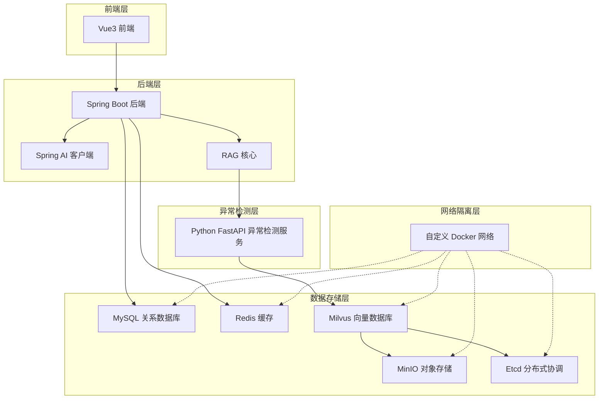

**图表来源**
- [docker-compose.yml:324-340](file://docker-compose.yml#L324-L340)
- [PROJECT_CONTEXT.md:120-149](file://PROJECT_CONTEXT.md#L120-L149)

**章节来源**
- [PROJECT_CONTEXT.md:120-149](file://PROJECT_CONTEXT.md#L120-L149)
- [docker-compose.yml:324-340](file://docker-compose.yml#L324-L340)

## 核心组件
系统网络安全规则的核心组件包括：

### 网络访问控制组件
- **白名单域名管理**：严格限制外部API调用至预定义的安全域名
- **端口访问控制**：禁止开放高危端口，如SSH(22)、远程桌面(3389)
- **文件下载安全**：禁止从未知来源下载和执行文件

### 安全验证组件
- **URL安全验证**：基于域名白名单的URL验证机制
- **输入验证**：防止SQL注入、命令注入和XSS攻击
- **权限控制**：基于角色的最小权限原则

### 审计监控组件
- **操作审计**：完整的命令执行审计日志
- **异常检测**：实时监控和异常行为检测
- **应急响应**：标准化的安全事件响应流程

**章节来源**
- [shared-safety-constraints.md:172-196](file://docs/prompts/shared-safety-constraints.md#L172-L196)
- [shared-safety-constraints.md:296-323](file://docs/prompts/shared-safety-constraints.md#L296-L323)

## 架构概览
系统采用分层安全架构，通过多道防线确保网络安全：

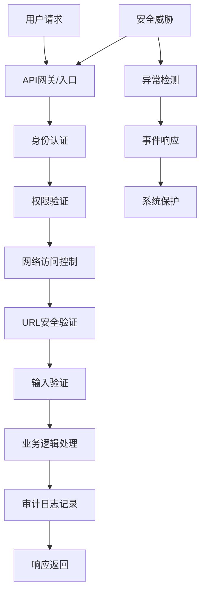

**图表来源**
- [shared-safety-constraints.md:296-323](file://docs/prompts/shared-safety-constraints.md#L296-L323)
- [shared-safety-constraints.md:360-378](file://docs/prompts/shared-safety-constraints.md#L360-L378)

## 详细组件分析

### 网络访问限制策略

#### 外部API调用白名单管理
系统实施严格的外部API调用白名单机制：

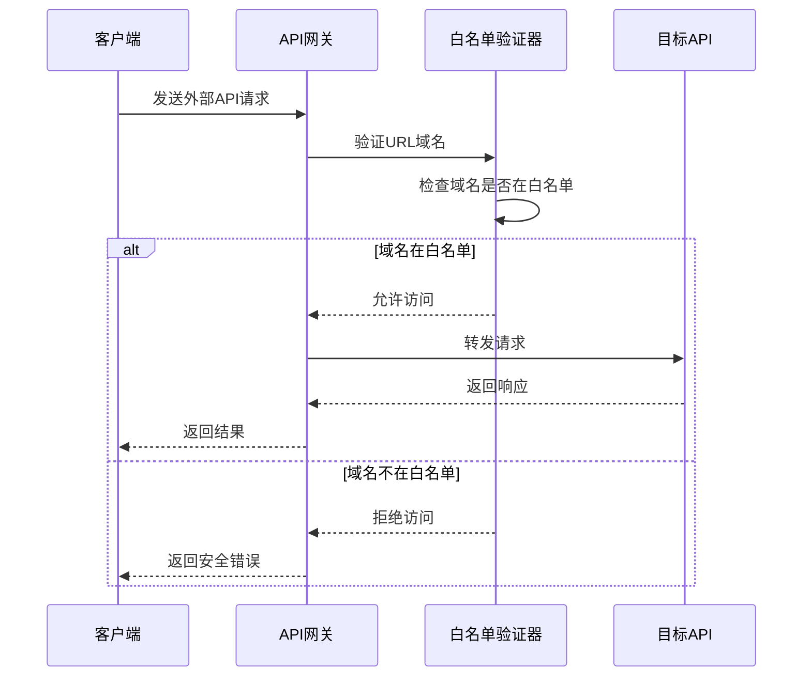

**图表来源**
- [shared-safety-constraints.md:184-195](file://docs/prompts/shared-safety-constraints.md#L184-L195)

#### 未知来源文件下载禁止规则
系统通过多重机制防止未知来源文件下载：

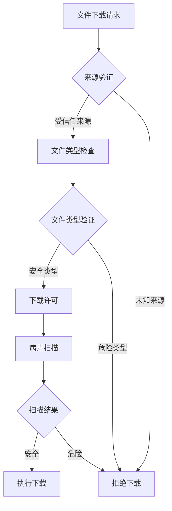

**图表来源**
- [shared-safety-constraints.md:178-180](file://docs/prompts/shared-safety-constraints.md#L178-L180)

#### 高危端口开放限制
系统通过Docker网络隔离和端口配置实现高危端口限制：

**章节来源**
- [shared-safety-constraints.md:174-181](file://docs/prompts/shared-safety-constraints.md#L174-L181)
- [docker-compose.yml:324-340](file://docker-compose.yml#L324-L340)

### URL安全验证实现

#### URL验证算法
系统采用基于域名白名单的URL安全验证机制：

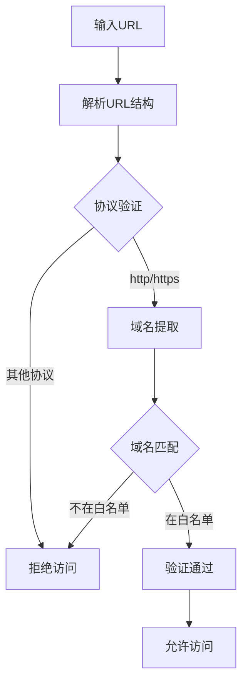

**图表来源**
- [shared-safety-constraints.md:184-195](file://docs/prompts/shared-safety-constraints.md#L184-L195)

#### 白名单配置管理
系统支持动态白名单配置和管理：

**章节来源**
- [shared-safety-constraints.md:182-196](file://docs/prompts/shared-safety-constraints.md#L182-L196)

### 用户输入安全防护

#### 多层次输入验证
系统实施多层次的用户输入安全防护：

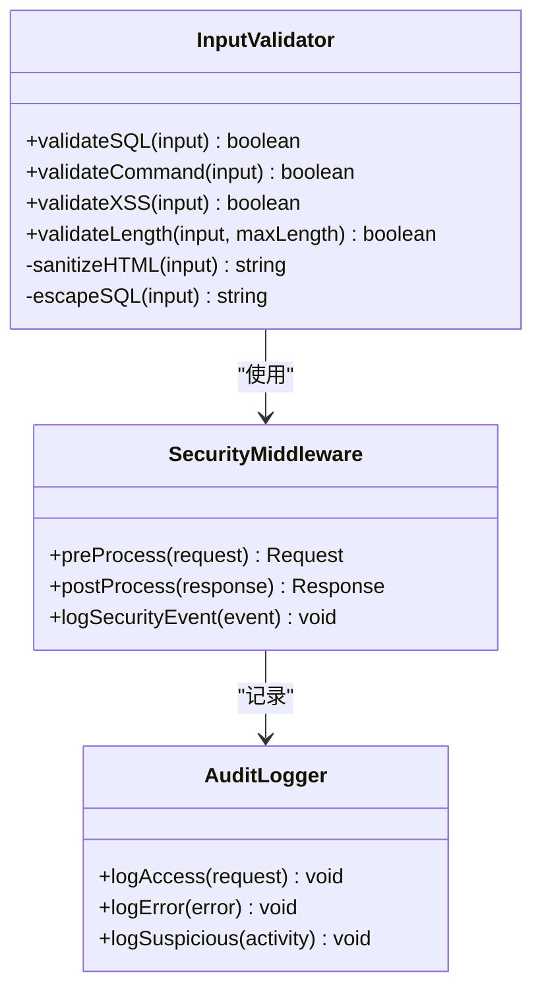

**图表来源**
- [shared-safety-constraints.md:205-220](file://docs/prompts/shared-safety-constraints.md#L205-L220)

#### 输入长度限制策略
系统对不同类型输入实施严格的长度限制：

**章节来源**
- [shared-safety-constraints.md:222-230](file://docs/prompts/shared-safety-constraints.md#L222-L230)

### 权限控制系统

#### 角色权限矩阵
系统采用基于角色的权限控制模型：

| 角色 | 知识问答 | 故障诊断 | 自动执行命令 | 审批执行命令 |
|------|---------|---------|-------------|-------------|
| viewer | ✅ | ✅ | ❌ | ❌ |
| operator | ✅ | ✅ | ✅ | ✅ |
| admin | ✅ | ✅ | ✅ | ✅ |
| super-admin | ✅ | ✅ | ✅ | ✅ + 越权审批 |

#### 操作审批流程
系统实施分级审批机制：

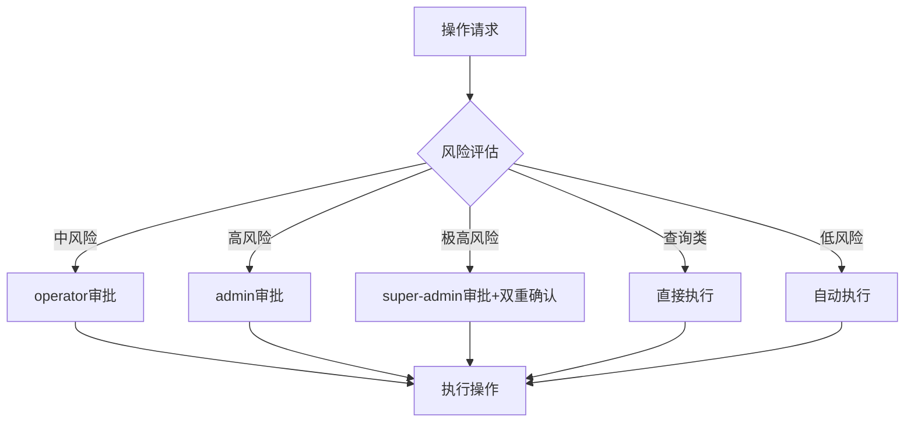

**图表来源**
- [shared-safety-constraints.md:246-258](file://docs/prompts/shared-safety-constraints.md#L246-L258)

**章节来源**
- [shared-safety-constraints.md:233-258](file://docs/prompts/shared-safety-constraints.md#L233-L258)

### 审计日志系统

#### 审计日志规范
系统记录完整的操作审计信息：

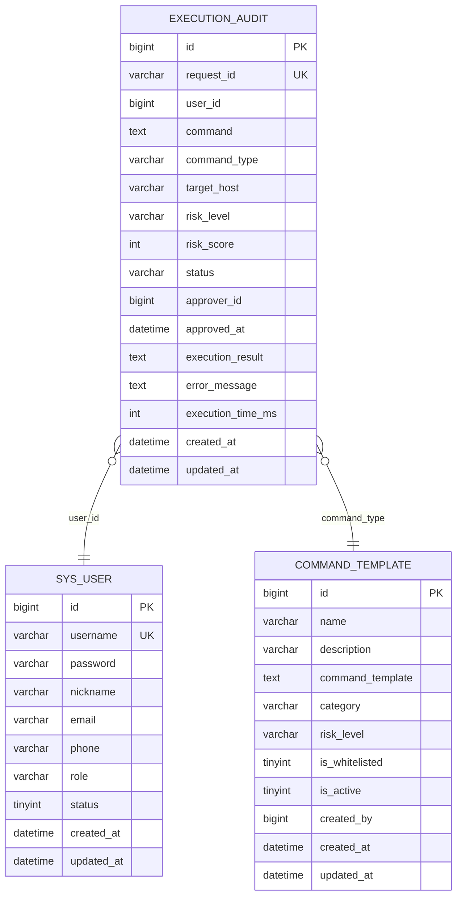

**图表来源**
- [init.sql:114-138](file://sql/init.sql#L114-L138)
- [init.sql:144-159](file://sql/init.sql#L144-L159)

#### 日志格式标准
系统采用标准化的日志格式：

**章节来源**
- [shared-safety-constraints.md:296-323](file://docs/prompts/shared-safety-constraints.md#L296-L323)

### 异常检测与安全监控

#### 异常检测架构
系统集成实时异常检测能力：

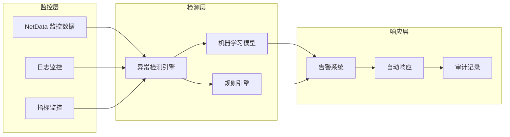

**图表来源**
- [PROJECT_CONTEXT.md:135-139](file://PROJECT_CONTEXT.md#L135-L139)

#### 端口占用检查
系统通过环境验证脚本检查端口占用情况：

**章节来源**
- [verify-env.sh:124-150](file://scripts/verify-env.sh#L124-L150)

## 依赖分析

### 网络依赖关系
系统网络安全规则依赖于多个组件的协同工作：

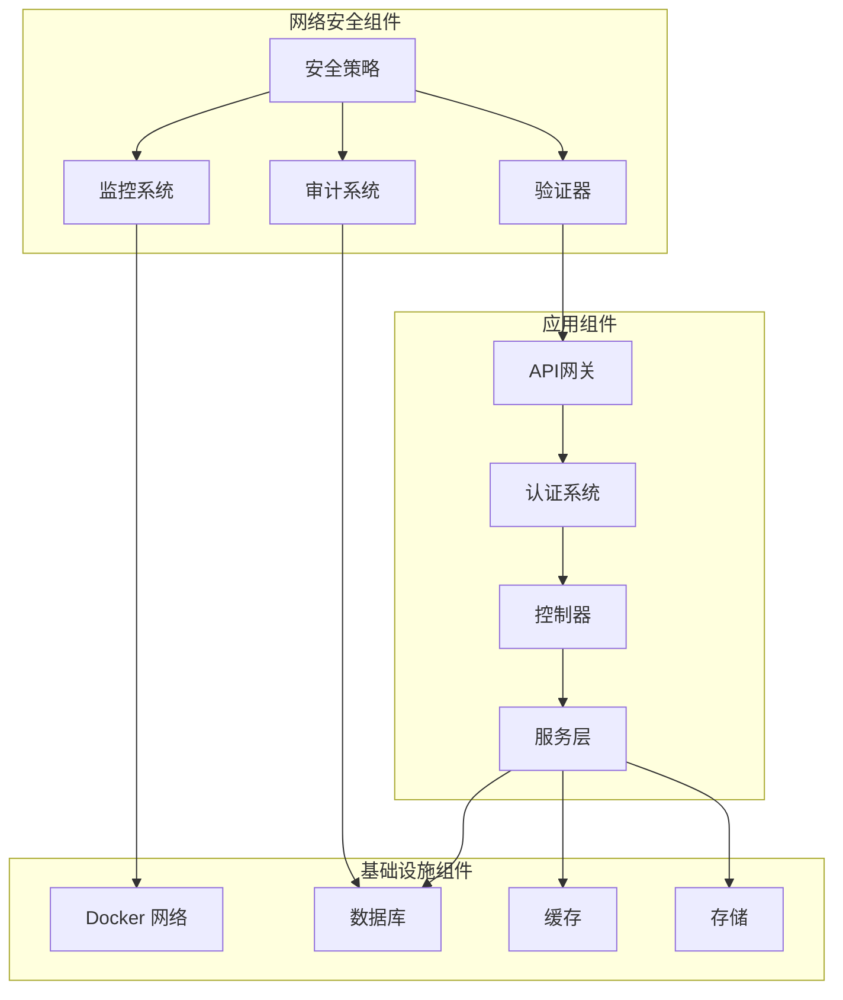

**图表来源**
- [docker-compose.yml:324-340](file://docker-compose.yml#L324-L340)
- [shared-safety-constraints.md:172-196](file://docs/prompts/shared-safety-constraints.md#L172-L196)

### 数据流安全
系统确保数据在传输和存储过程中的安全性：

**章节来源**
- [milvus_collection.yaml:105-140](file://config/milvus_collection.yaml#L105-L140)

## 性能考虑
网络安全规则的实施需要平衡安全性和性能：

### 网络性能优化
- **白名单缓存**：使用内存缓存提高域名验证性能
- **异步处理**：对非关键安全检查采用异步处理
- **连接池管理**：优化数据库和外部API连接池配置

### 审计性能优化
- **批量写入**：审计日志采用批量写入减少I/O开销
- **异步审计**：审计日志异步写入不影响主业务流程
- **日志轮转**：定期清理过期审计日志释放存储空间

## 故障排除指南

### 常见安全问题排查
系统提供标准化的问题排查流程：

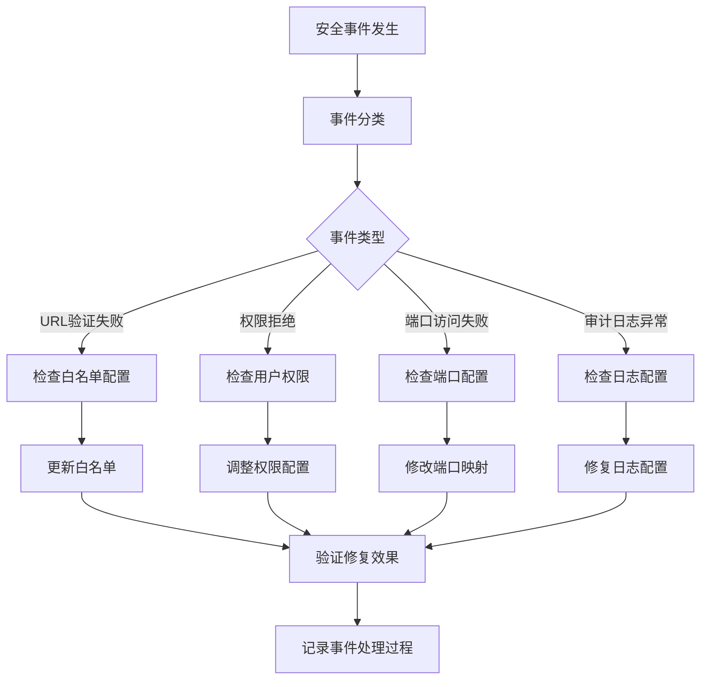

### 环境检查工具
系统提供全面的环境检查工具：

**章节来源**
- [verify-env.sh:63-286](file://scripts/verify-env.sh#L63-L286)

### 应急响应流程
系统建立标准化的应急响应机制：

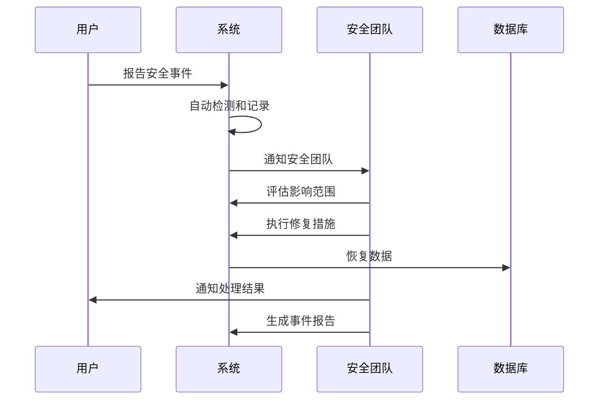

**图表来源**
- [shared-safety-constraints.md:364-378](file://docs/prompts/shared-safety-constraints.md#L364-L378)

**章节来源**
- [shared-safety-constraints.md:360-387](file://docs/prompts/shared-safety-constraints.md#L360-L387)

## 结论
智能运维系统的网络安全规则通过多层防护机制确保系统的安全性。系统采用白名单域名管理、严格的输入验证、完善的权限控制和全面的审计监控，形成了完整的安全防护体系。通过Docker网络隔离和环境检查工具，系统实现了可控的网络访问和可靠的环境配置。标准化的应急响应流程确保了安全事件能够得到及时有效的处理。这些安全规则为系统的稳定运行和数据安全提供了坚实保障。