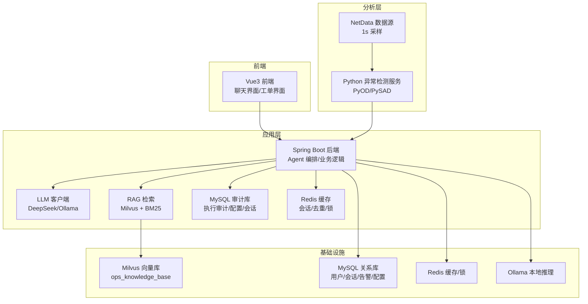
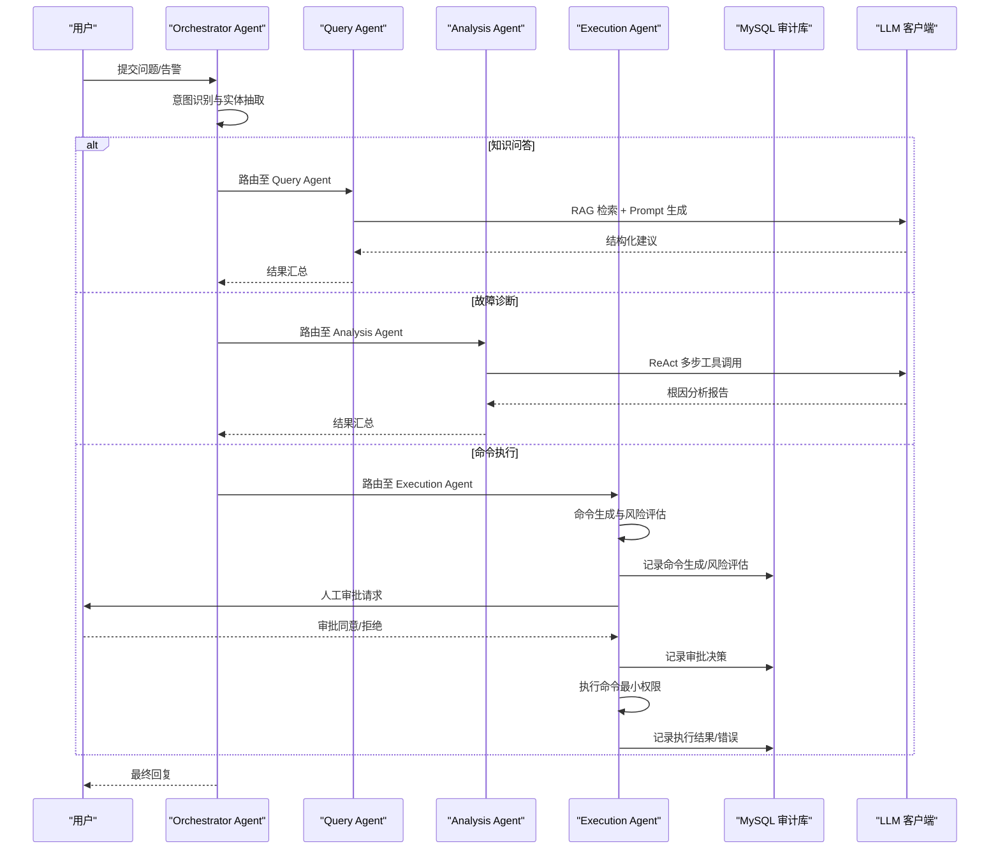
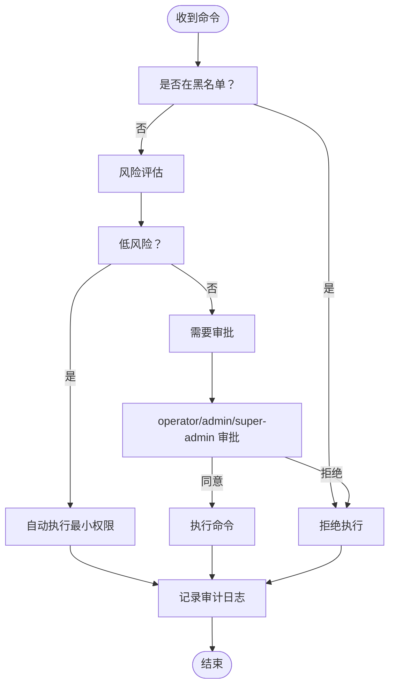
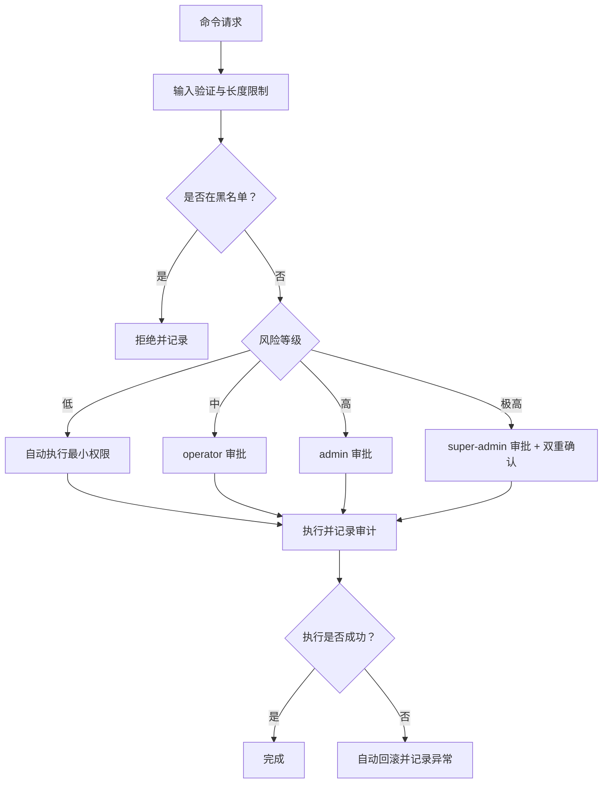
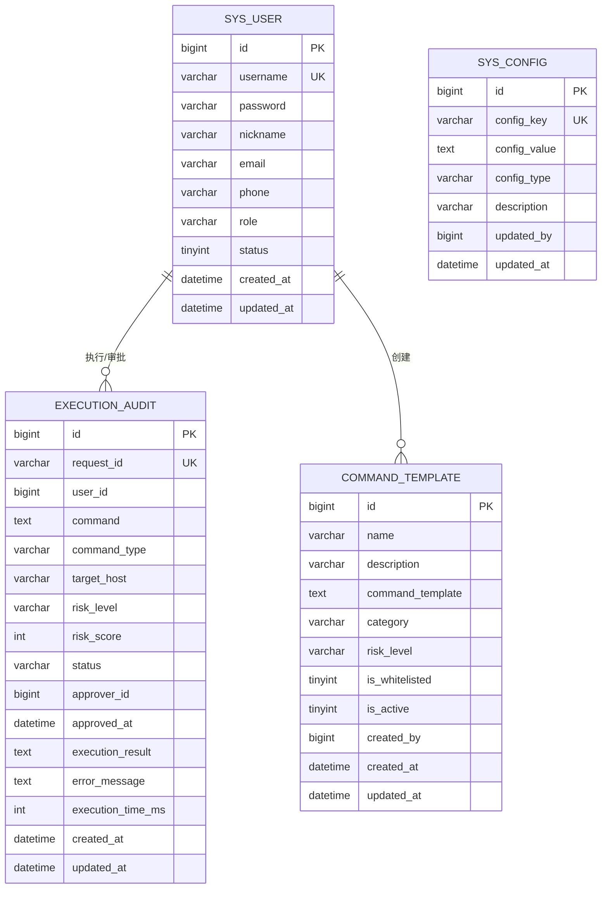
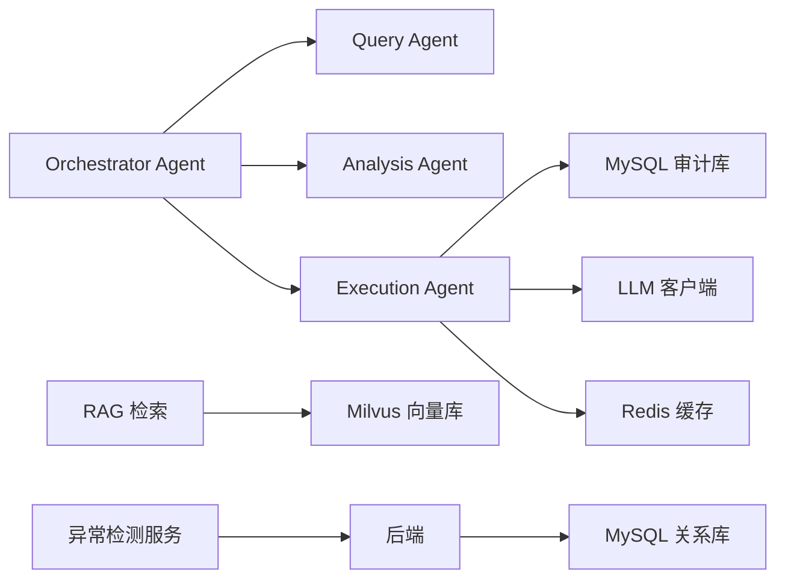

# 核心安全原则

<cite>
**本文档引用的文件**
- [PROJECT_CONTEXT.md](file://PROJECT_CONTEXT.md)
- [开题报告_精简版.md](file://开题报告_精简版.md)
- [docs/prompts/shared-safety-constraints.md](file://docs/prompts/shared-safety-constraints.md)
- [docs/prompts/orchestrator-system-prompt.md](file://docs/prompts/orchestrator-system-prompt.md)
- [docker-compose.yml](file://docker-compose.yml)
- [config/milvus_collection.yaml](file://config/milvus_collection.yaml)
- [sql/init.sql](file://sql/init.sql)
</cite>

## 目录
1. [简介](#简介)
2. [项目结构](#项目结构)
3. [核心组件](#核心组件)
4. [架构总览](#架构总览)
5. [详细组件分析](#详细组件分析)
6. [依赖分析](#依赖分析)
7. [性能考虑](#性能考虑)
8. [故障排除指南](#故障排除指南)
9. [结论](#结论)
10. [附录](#附录)

## 简介
本文件围绕智能运维系统的核心安全原则进行系统化阐述，结合项目上下文与现有安全约束文档，重点覆盖以下三个方面：
- 最小权限原则：权限分配策略与权限最小化实践
- 防御优先原则：风险评估机制与安全决策流程
- 审计追溯原则：日志记录规范、审计追踪机制与合规要求

同时，提供安全原则在实际业务场景中的应用案例与最佳实践，以及安全策略的制定流程与持续改进机制，帮助读者在理解系统架构的同时，建立可落地的安全治理体系。

## 项目结构
系统采用多层架构与多组件协同模式，后端以 Spring Boot 为核心，结合异常检测服务（Python）、RAG 知识库（Milvus）、MySQL 审计与配置、Redis 缓存、Ollama/DeepSeek LLM 等基础设施，形成“感知-分析-决策-执行”的闭环。

图表来源
- [PROJECT_CONTEXT.md:120-149](file://PROJECT_CONTEXT.md#L120-L149)
- [开题报告_精简版.md:118-152](file://开题报告_精简版.md#L118-L152)
- [docker-compose.yml:23-357](file://docker-compose.yml#L23-L357)

章节来源
- [PROJECT_CONTEXT.md:16-166](file://PROJECT_CONTEXT.md#L16-L166)
- [开题报告_精简版.md:69-152](file://开题报告_精简版.md#L69-L152)
- [docker-compose.yml:1-357](file://docker-compose.yml#L1-L357)

## 核心组件
- Orchestrator Agent：意图识别、任务路由、结果汇总，强制将涉及删除/修改/重启的操作路由至执行 Agent，并触发人工审批流程。
- Query Agent：基于 RAG 的知识问答，结合 Milvus 向量检索与 BM25 关键词检索，输出结构化建议。
- Analysis Agent：ReAct 模式进行多步工具调用，输出结构化诊断报告。
- Execution Agent：生成命令→风险评估→人工审批→执行→记录，严格遵循最小权限与防御优先原则。
- MySQL 审计库：记录用户登录/登出、命令生成、风险评估、审批决策、命令执行、配置变更、数据访问等关键事件。
- Milvus 知识库：存储运维知识向量，支撑 RAG 检索与推理。
- Redis 缓存：会话缓存、RAG 结果缓存、分布式锁、实时告警去重。
- LLM 客户端：支持 DeepSeek API 与 Ollama，通过配置切换实现不同环境下的推理能力。

章节来源
- [docs/prompts/orchestrator-system-prompt.md:1-291](file://docs/prompts/orchestrator-system-prompt.md#L1-L291)
- [开题报告_精简版.md:223-301](file://开题报告_精简版.md#L223-L301)
- [sql/init.sql:112-159](file://sql/init.sql#L112-L159)
- [config/milvus_collection.yaml:19-186](file://config/milvus_collection.yaml#L19-L186)
- [docker-compose.yml:23-357](file://docker-compose.yml#L23-L357)

## 架构总览
系统通过 Orchestrator Agent 对用户输入进行意图识别与路由，将查询、诊断、执行等任务分派给专业 Agent，并在执行层严格执行最小权限与防御优先原则，所有关键操作均写入 MySQL 审计库，确保可追溯与合规。

图表来源
- [docs/prompts/orchestrator-system-prompt.md:18-137](file://docs/prompts/orchestrator-system-prompt.md#L18-L137)
- [开题报告_精简版.md:268-301](file://开题报告_精简版.md#L268-L301)
- [sql/init.sql:112-159](file://sql/init.sql#L112-L159)

## 详细组件分析

### 最小权限原则的实施方法
- 权限分配策略
  - 角色权限矩阵：viewer（仅问答/诊断）、operator（可执行低风险命令并审批）、admin（可审批高风险命令）、super-admin（越权审批）。
  - 禁止使用 root 权限执行非必要操作，敏感操作必须经过审批。
- 权限最小化实践
  - 命令模板表提供白名单命令，仅允许低风险查询类命令自动执行；服务操作、进程操作、配置修改、数据操作、网络操作等需审批。
  - 执行层严格限制命令范围，黑名单命令（系统销毁、权限开放、防火墙清空、密码修改、系统关机/重启、Fork 炸弹、危险脚本执行）一律禁止。
  - LLM 侧通过 Prompt 控制输出，避免生成高风险命令；执行前进行风险评估与审批流程。

图表来源
- [docs/prompts/shared-safety-constraints.md:29-126](file://docs/prompts/shared-safety-constraints.md#L29-L126)
- [docs/prompts/shared-safety-constraints.md:233-258](file://docs/prompts/shared-safety-constraints.md#L233-L258)
- [sql/init.sql:141-170](file://sql/init.sql#L141-L170)

章节来源
- [docs/prompts/shared-safety-constraints.md:9-26](file://docs/prompts/shared-safety-constraints.md#L9-L26)
- [docs/prompts/shared-safety-constraints.md:233-258](file://docs/prompts/shared-safety-constraints.md#L233-L258)
- [docs/prompts/shared-safety-constraints.md:29-126](file://docs/prompts/shared-safety-constraints.md#L29-L126)
- [sql/init.sql:141-170](file://sql/init.sql#L141-L170)

### 防御优先原则的具体体现
- 风险评估机制
  - 命令模板表提供默认风险等级（如 medium），执行前根据命令类型与参数进行风险评分与等级划分。
  - 系统配置表支持“自动批准低风险命令”开关，高风险命令必须人工审批。
- 安全决策流程
  - 查询类操作直接执行；低风险自动执行；中风险 operator 审批；高风险 admin 审批；极高风险 super-admin 审批并双重确认。
  - 执行前检查清单：命令是否在黑名单、是否需要审批、用户权限、回滚方案、超时、审计日志。
- 错误处理安全
  - 错误信息脱敏：内部详细日志记录异常，对外返回用户友好的提示。
  - 异常恢复：执行失败自动回滚，记录回滚结果与异常信息。

图表来源
- [docs/prompts/shared-safety-constraints.md:199-230](file://docs/prompts/shared-safety-constraints.md#L199-L230)
- [docs/prompts/shared-safety-constraints.md:244-258](file://docs/prompts/shared-safety-constraints.md#L244-L258)
- [docs/prompts/shared-safety-constraints.md:262-292](file://docs/prompts/shared-safety-constraints.md#L262-L292)
- [sql/init.sql:220-244](file://sql/init.sql#L220-L244)

章节来源
- [docs/prompts/shared-safety-constraints.md:15-20](file://docs/prompts/shared-safety-constraints.md#L15-L20)
- [docs/prompts/shared-safety-constraints.md:244-258](file://docs/prompts/shared-safety-constraints.md#L244-L258)
- [docs/prompts/shared-safety-constraints.md:262-292](file://docs/prompts/shared-safety-constraints.md#L262-L292)
- [sql/init.sql:220-244](file://sql/init.sql#L220-L244)

### 审计追溯原则的实现
- 日志记录规范
  - 审计日志格式包含时间戳、事件类型、操作人、动作、资源、结果、IP、会话 ID、耗时等字段。
  - 必须记录的事件：用户登录/登出、命令生成、风险评估、审批决策、命令执行、配置变更、数据访问。
- 审计追踪机制
  - MySQL 审计表 execution_audit 记录命令请求、执行用户、命令、类型、目标主机、风险等级/分数、状态、审批人、执行结果/错误、耗时等。
  - 命令模板表 command_template 提供可复用的命令模板与默认风险等级，便于审计与合规校验。
  - 系统配置表 sys_config 提供执行相关配置项（如自动批准低风险命令、最大等待时间），便于审计配置变更。
- 合规要求
  - 日志保留期限：至少 90 天。
  - 敏感数据识别与脱敏：密码、API 密钥、证书、配置、PII 等敏感信息加密存储并在日志中脱敏。
  - 网络访问限制：外部 API 调用白名单、禁止未知来源下载执行、禁止开放高危端口。

图表来源
- [sql/init.sql:22-41](file://sql/init.sql#L22-L41)
- [sql/init.sql:112-159](file://sql/init.sql#L112-L159)
- [sql/init.sql:141-170](file://sql/init.sql#L141-L170)
- [sql/init.sql:220-244](file://sql/init.sql#L220-L244)

章节来源
- [docs/prompts/shared-safety-constraints.md:296-323](file://docs/prompts/shared-safety-constraints.md#L296-L323)
- [sql/init.sql:112-159](file://sql/init.sql#L112-L159)
- [docs/prompts/shared-safety-constraints.md:130-168](file://docs/prompts/shared-safety-constraints.md#L130-L168)
- [docs/prompts/shared-safety-constraints.md:172-195](file://docs/prompts/shared-safety-constraints.md#L172-L195)

### 安全原则在实际业务场景中的应用案例与最佳实践
- 场景一：服务重启
  - 用户输入“帮我重启 nginx 服务”，Orchestrator Agent 识别为命令执行意图，路由至 Execution Agent。
  - 命令模板“重启服务”默认风险等级为 medium，自动进入 operator 审批流程。
  - 审批通过后，Execution Agent 以最小权限执行 systemctl restart，记录审计日志并返回结果。
- 场景二：高风险配置修改
  - 用户输入“修改 /etc/nginx/nginx.conf”，Execution Agent 识别为高风险配置修改，进入 admin 审批。
  - 审批通过后，Execution Agent 以最小权限执行修改，记录审计日志并回滚方案。
- 场景三：信息查询
  - 用户输入“查看磁盘使用情况”，Execution Agent 识别为低风险查询，自动执行（最小权限），记录审计日志。
- 最佳实践
  - 使用命令模板与白名单机制，减少误操作风险。
  - 严格区分风险等级，分级审批，避免越权。
  - 所有操作均记录审计日志，确保可追溯与合规。

章节来源
- [docs/prompts/orchestrator-system-prompt.md:37-137](file://docs/prompts/orchestrator-system-prompt.md#L37-L137)
- [docs/prompts/shared-safety-constraints.md:97-126](file://docs/prompts/shared-safety-constraints.md#L97-L126)
- [sql/init.sql:161-170](file://sql/init.sql#L161-L170)

### 安全策略的制定流程与持续改进机制
- 制定流程
  - 风险识别：识别命令类型、操作对象、影响范围与潜在风险。
  - 策略设计：定义命令白名单、默认风险等级、审批流程与权限矩阵。
  - 审批与发布：通过配置表发布策略，定期评审与更新。
- 持续改进
  - 审计数据分析：基于 execution_audit 与 sys_config 统计分析，识别高风险操作与异常趋势。
  - 回滚与修复：执行失败自动回滚，记录异常并生成事件报告。
  - 应急响应：发现安全事件立即阻断、记录详情、通知安全团队、评估影响范围、执行修复并生成事件报告。
  - 安全检查清单：定期执行命令执行前、数据处理、用户输入检查，确保策略落地。

章节来源
- [docs/prompts/shared-safety-constraints.md:326-378](file://docs/prompts/shared-safety-constraints.md#L326-L378)
- [sql/init.sql:220-244](file://sql/init.sql#L220-L244)

## 依赖分析
- 组件耦合与内聚
  - Orchestrator Agent 与各子 Agent 通过消息/HTTP 协议耦合，职责清晰、内聚良好。
  - MySQL 审计库与各组件强耦合，确保审计数据一致与可追溯。
  - Milvus 与 RAG 检索耦合，向量维度固定（1024 维）避免版本不兼容。
- 外部依赖与集成点
  - LLM 客户端支持 DeepSeek API 与 Ollama，通过配置切换实现不同环境下的推理能力。
  - Python 异常检测服务与 Java 后端通过 REST API 通信，注意超时与重试策略。
- 潜在循环依赖
  - 当前架构以单向路由为主，未发现明显循环依赖；若扩展子 Agent，需严格控制依赖方向。

图表来源
- [docs/prompts/orchestrator-system-prompt.md:18-137](file://docs/prompts/orchestrator-system-prompt.md#L18-L137)
- [config/milvus_collection.yaml:19-186](file://config/milvus_collection.yaml#L19-L186)
- [docker-compose.yml:23-357](file://docker-compose.yml#L23-L357)

章节来源
- [config/milvus_collection.yaml:19-186](file://config/milvus_collection.yaml#L19-L186)
- [docker-compose.yml:23-357](file://docker-compose.yml#L23-L357)

## 性能考虑
- 向量检索性能
  - Milvus 配置 IVF_FLAT 索引，nlist 与 nprobe 参数平衡精度与速度；Top-K 与输出字段控制返回量。
- 缓存与去重
  - Redis 用于会话缓存、RAG 结果缓存、分布式锁与实时告警去重，降低后端压力。
- LLM 推理性能
  - 通过配置表控制温度、最大 Token 数、RAG Top-K 与相似度阈值，平衡准确性与响应速度。
- 异常检测性能
  - Python 服务与 Java 后端通信需设置合理超时与重试，避免阻塞。

章节来源
- [config/milvus_collection.yaml:70-101](file://config/milvus_collection.yaml#L70-L101)
- [sql/init.sql:235-244](file://sql/init.sql#L235-L244)
- [开题报告_精简版.md:109-116](file://开题报告_精简版.md#L109-L116)

## 故障排除指南
- 常见问题
  - 命令执行失败：检查风险评估与审批状态、执行结果与错误信息、回滚是否成功。
  - 审计日志缺失：确认审计表字段是否完整、记录是否成功写入、日志保留策略是否生效。
  - LLM 输出异常：检查 Prompt 配置、模型参数、RAG 检索结果与相似度阈值。
- 排查步骤
  - 查看 execution_audit 表定位问题环节。
  - 检查 sys_config 中执行相关配置项。
  - 核对命令模板与风险等级，确认是否越权或误判。
  - 使用 Redis 缓存与 MySQL 会话表核对会话状态与去重逻辑。

章节来源
- [sql/init.sql:112-159](file://sql/init.sql#L112-L159)
- [sql/init.sql:220-244](file://sql/init.sql#L220-L244)
- [开题报告_精简版.md:109-116](file://开题报告_精简版.md#L109-L116)

## 结论
本系统围绕最小权限、防御优先与审计追溯三大核心安全原则，建立了从意图识别、风险评估、审批决策到执行与审计的完整闭环。通过角色权限矩阵、命令模板与白名单、分级审批、审计日志与应急响应等机制，确保系统在复杂运维场景中的安全性与可追溯性。建议在后续开发中持续完善策略制定与持续改进流程，结合审计数据分析与异常回滚机制，不断提升系统的安全水平与稳定性。

## 附录
- 相关文件路径
  - [PROJECT_CONTEXT.md](file://PROJECT_CONTEXT.md)
  - [开题报告_精简版.md](file://开题报告_精简版.md)
  - [docs/prompts/shared-safety-constraints.md](file://docs/prompts/shared-safety-constraints.md)
  - [docs/prompts/orchestrator-system-prompt.md](file://docs/prompts/orchestrator-system-prompt.md)
  - [docker-compose.yml](file://docker-compose.yml)
  - [config/milvus_collection.yaml](file://config/milvus_collection.yaml)
  - [sql/init.sql](file://sql/init.sql)