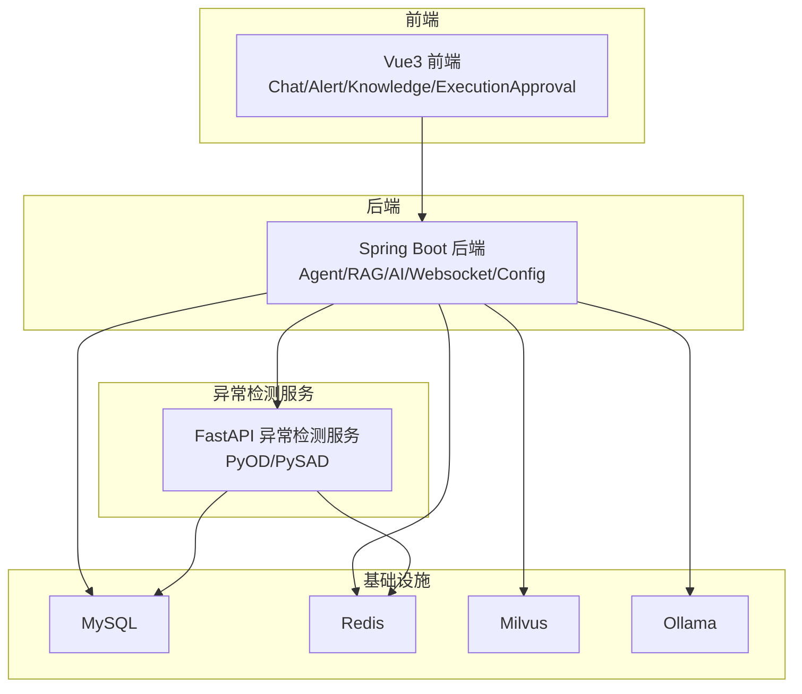
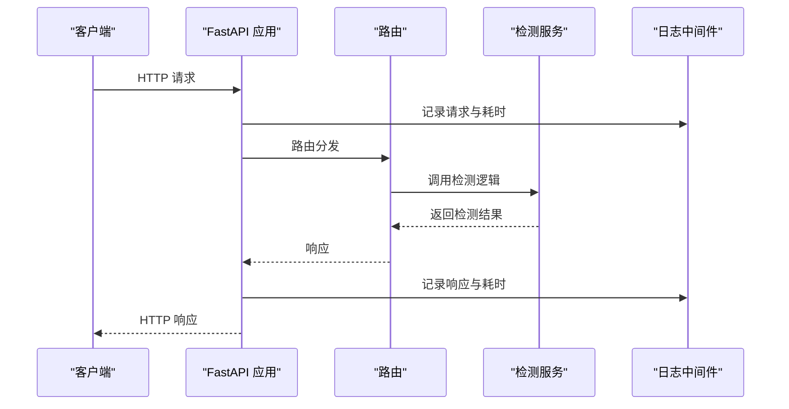
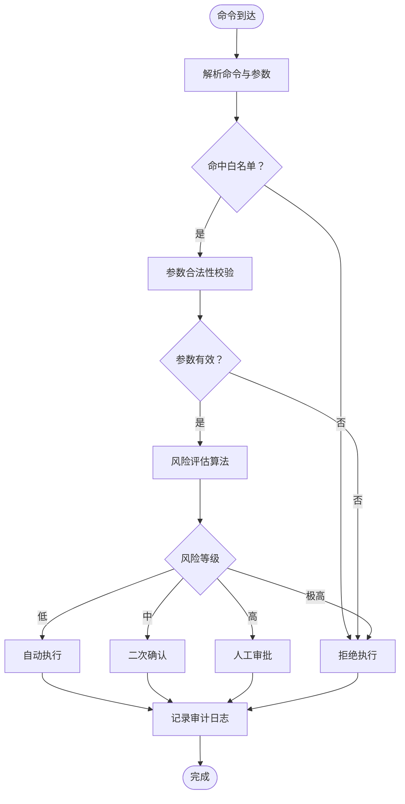
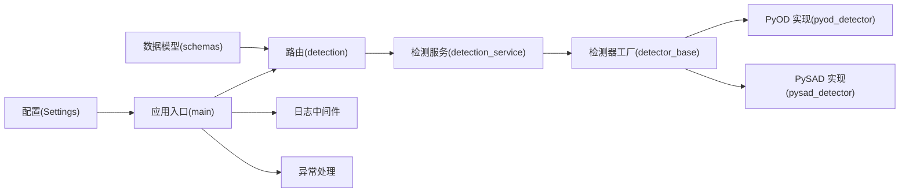

# 命令执行安全

<cite>
**本文引用的文件**
- [PROJECT_CONTEXT.md](file://PROJECT_CONTEXT.md)
- [开题报告_精简版.md](file://开题报告_精简版.md)
- [anomaly-detection-service/app/main.py](file://anomaly-detection-service/app/main.py)
- [anomaly-detection-service/app/api/routes/detection.py](file://anomaly-detection-service/app/api/routes/detection.py)
- [anomaly-detection-service/app/services/detection_service.py](file://anomaly-detection-service/app/services/detection_service.py)
- [anomaly-detection-service/app/config.py](file://anomaly-detection-service/app/config.py)
- [anomaly-detection-service/app/models/schemas.py](file://anomaly-detection-service/app/models/schemas.py)
- [anomaly-detection-service/app/core/detector_base.py](file://anomaly-detection-service/app/core/detector_base.py)
- [anomaly-detection-service/app/core/pyod_detector.py](file://anomaly-detection-service/app/core/pyod_detector.py)
- [anomaly-detection-service/app/core/pysad_detector.py](file://anomaly-detection-service/app/core/pysad_detector.py)
- [scripts/verify-env.sh](file://scripts/verify-env.sh)
- [scripts/verify-env.ps1](file://scripts/verify-env.ps1)
</cite>

## 目录
1. [简介](#简介)
2. [项目结构](#项目结构)
3. [核心组件](#核心组件)
4. [架构总览](#架构总览)
5. [详细组件分析](#详细组件分析)
6. [依赖关系分析](#依赖关系分析)
7. [性能考虑](#性能考虑)
8. [故障排查指南](#故障排查指南)
9. [结论](#结论)
10. [附录](#附录)

## 简介
本文件围绕“智能运维系统”的命令执行安全主题，结合仓库中的上下文与现有代码，系统化地阐述命令分类体系、安全验证机制、风险评估与阈值设定、审计与异常检测。由于当前仓库尚未包含命令执行与审批的具体实现代码，本文在“命令执行”部分以概念性说明为主，并给出与现有代码（异常检测服务）的对接建议与落地路径，确保安全策略与现有技术栈无缝衔接。

## 项目结构
- 后端主体位于 netdata-ai-backend（Java Spring Boot），包含 Agent、RAG、AI 客户端、Websocket、配置等模块。
- 异常检测服务位于 anomaly-detection-service（Python FastAPI），提供实时/离线异常检测能力。
- 前端位于 netdata-ai-frontend（Vue3），包含聊天、告警面板、知识库、执行审批等视图。
- 脚本目录 scripts 提供环境验证脚本，辅助系统部署与健康检查。

**图表来源**
- [PROJECT_CONTEXT.md:120-149](file://PROJECT_CONTEXT.md#L120-L149)
- [开题报告_精简版.md:118-152](file://开题报告_精简版.md#L118-L152)

**章节来源**
- [PROJECT_CONTEXT.md:120-149](file://PROJECT_CONTEXT.md#L120-L149)
- [开题报告_精简版.md:118-152](file://开题报告_精简版.md#L118-L152)

## 核心组件
- 异常检测服务（FastAPI）：提供批量/流式异常检测接口，支持 PyOD/PySAD 算法，具备日志、异常处理、CORS 中间件等基础安全与可观测性能力。
- 配置中心（Settings）：集中管理应用配置，支持环境变量覆盖，提供阈值、超时、端口等关键参数。
- 数据模型（Pydantic）：统一请求/响应模型，内置字段校验与 OpenAPI 文档生成。
- 检测器工厂与抽象基类：定义统一接口与模板方法，便于扩展与替换算法。

**章节来源**
- [anomaly-detection-service/app/main.py:76-102](file://anomaly-detection-service/app/main.py#L76-L102)
- [anomaly-detection-service/app/config.py:28-182](file://anomaly-detection-service/app/config.py#L28-L182)
- [anomaly-detection-service/app/models/schemas.py:28-329](file://anomaly-detection-service/app/models/schemas.py#L28-L329)
- [anomaly-detection-service/app/core/detector_base.py:31-339](file://anomaly-detection-service/app/core/detector_base.py#L31-L339)

## 架构总览
下图展示了异常检测服务的请求处理链路与中间件、异常处理、路由注册等关键环节，体现系统在安全与可观测性方面的基础能力。

**图表来源**
- [anomaly-detection-service/app/main.py:118-139](file://anomaly-detection-service/app/main.py#L118-L139)
- [anomaly-detection-service/app/api/routes/detection.py:55-153](file://anomaly-detection-service/app/api/routes/detection.py#L55-L153)
- [anomaly-detection-service/app/services/detection_service.py:76-118](file://anomaly-detection-service/app/services/detection_service.py#L76-L118)

**章节来源**
- [anomaly-detection-service/app/main.py:118-139](file://anomaly-detection-service/app/main.py#L118-L139)
- [anomaly-detection-service/app/api/routes/detection.py:55-153](file://anomaly-detection-service/app/api/routes/detection.py#L55-L153)
- [anomaly-detection-service/app/services/detection_service.py:76-118](file://anomaly-detection-service/app/services/detection_service.py#L76-L118)

## 详细组件分析

### 命令分类体系（概念性说明）
为满足“命令执行安全”，建议建立如下分类体系（与现有系统对接时可映射到审批与执行流程）：

- 绝对禁止命令
  - 系统级破坏性操作：格式化磁盘、删除根分区、修改系统核心文件、禁用关键服务等。
  - 敏感数据操作：删除数据库表、清空日志、导出凭证等。
  - 网络与安全操作：关闭防火墙、放通高危端口、修改安全策略等。
  - 示例（概念性列举）：rm -rf /、dd if=/dev/zero of=/dev/sda、iptables -P INPUT ACCEPT 等。

- 需要审批命令
  - 高风险变更：重启关键服务、调整核心参数、扩容/缩容、切换主从等。
  - 影响面广的操作：批量修改配置、回滚版本、迁移数据等。
  - 示例（概念性列举）：systemctl restart mysqld、docker-compose down/up 等。

- 自动执行命令
  - 低风险常规操作：清理临时文件、重启非关键服务、查看状态等。
  - 可预设的修复脚本：如清理缓存、释放内存、重启轻量服务等。

说明：以上分类需与“执行审批流程”结合，高风险命令必须进入人工审批通道，低风险命令可在白名单内自动执行。

### 命令安全验证机制（概念性说明）
- 命令白名单
  - 维护允许执行的命令清单，严格匹配命令名与参数集合，拒绝不在白名单内的命令。
  - 与“需要审批命令”联动：若命中白名单但参数超限，则转入审批。

- 参数验证
  - 类型与范围校验：数值参数必须在允许区间，字符串参数禁止特殊字符与注入模式。
  - 上下文绑定：参数必须与当前主机、业务域、时间段等上下文一致。

- 命令注入防护
  - 严格转义与拼接控制：禁止使用 shell 执行，采用参数化调用或沙箱执行。
  - 进程隔离：限制执行用户权限，限定工作目录与环境变量。
  - 输出与错误捕获：记录标准输出与错误输出，防止静默失败。

对接建议：将上述机制映射到后端 Agent 的“执行 Agent”模块，结合现有“人类在环审批”流程，形成闭环。

### 命令执行的风险评估算法与安全阈值（概念性说明）
- 风险评估维度
  - 操作类型权重：破坏性、敏感性、影响面、可逆性。
  - 参数复杂度：参数数量、参数范围、组合爆炸度。
  - 历史风险：同类命令的历史失败率、告警次数、变更频率。
  - 时间与上下文：紧急程度、维护窗口、业务高峰/低谷。

- 风险评分模型（示例）
  - 基础分 = Σ(类型权重_i × 权重系数_i)
  - 参数惩罚 = Σ(参数违规项 × 惩罚系数)
  - 上下文扣分 = 紧急/非维护窗口 × 扣分系数
  - 最终风险分 = 基础分 + 参数惩罚 − 上下文加分
  - 风险等级：低风险（分值低）、中风险（中等）、高风险（需审批）、极高风险（禁止）

- 安全阈值
  - 低风险：自动执行
  - 中风险：二次确认
  - 高风险：人工审批
  - 极高风险：直接拦截

### 审计日志记录与异常检测机制（结合现有异常检测服务）
- 审计日志
  - 记录要素：命令原文、参数、执行者、执行时间、执行结果、返回码、耗时、主机标识、上下文标签。
  - 存储：落库至 MySQL，或写入集中式日志系统（如 ELK）。
  - 查询与告警：支持按时间、用户、主机、命令关键字检索，异常命令触发告警。

- 异常检测（现有能力）
  - 批量检测：离线分析，支持 Isolation Forest、LOF、KNN 等算法。
  - 流式检测：实时单条数据检测，支持 Half-Space Trees、xStream 算法。
  - 阈值管理：异常分数阈值与告警阈值分离，便于分级处理。
  - 日志与中间件：请求/响应日志、耗时统计、全局异常处理。

[本图为概念性流程图，不直接映射具体源码文件]

**章节来源**
- [anomaly-detection-service/app/main.py:118-139](file://anomaly-detection-service/app/main.py#L118-L139)
- [anomaly-detection-service/app/api/routes/detection.py:55-153](file://anomaly-detection-service/app/api/routes/detection.py#L55-L153)
- [anomaly-detection-service/app/config.py:132-136](file://anomaly-detection-service/app/config.py#L132-L136)

## 依赖关系分析
- 配置依赖：异常检测服务通过 Settings 读取阈值、端口、超时等参数，确保全局一致性。
- 模型依赖：Pydantic 模型负责请求/响应校验，减少非法输入进入检测流程。
- 算法依赖：检测器工厂统一创建离线/在线检测器，便于替换与扩展。
- 中间件依赖：CORS、请求日志中间件、全局异常处理器构成基础安全与可观测性。

**图表来源**
- [anomaly-detection-service/app/config.py:28-182](file://anomaly-detection-service/app/config.py#L28-L182)
- [anomaly-detection-service/app/models/schemas.py:28-329](file://anomaly-detection-service/app/models/schemas.py#L28-L329)
- [anomaly-detection-service/app/core/detector_base.py:288-339](file://anomaly-detection-service/app/core/detector_base.py#L288-L339)
- [anomaly-detection-service/app/core/pyod_detector.py:274-287](file://anomaly-detection-service/app/core/pyod_detector.py#L274-L287)
- [anomaly-detection-service/app/core/pysad_detector.py:345-358](file://anomaly-detection-service/app/core/pysad_detector.py#L345-L358)
- [anomaly-detection-service/app/main.py:107-115](file://anomaly-detection-service/app/main.py#L107-L115)

**章节来源**
- [anomaly-detection-service/app/config.py:28-182](file://anomaly-detection-service/app/config.py#L28-L182)
- [anomaly-detection-service/app/models/schemas.py:28-329](file://anomaly-detection-service/app/models/schemas.py#L28-L329)
- [anomaly-detection-service/app/core/detector_base.py:288-339](file://anomaly-detection-service/app/core/detector_base.py#L288-L339)
- [anomaly-detection-service/app/core/pyod_detector.py:274-287](file://anomaly-detection-service/app/core/pyod_detector.py#L274-L287)
- [anomaly-detection-service/app/core/pysad_detector.py:345-358](file://anomaly-detection-service/app/core/pysad_detector.py#L345-L358)
- [anomaly-detection-service/app/main.py:107-115](file://anomaly-detection-service/app/main.py#L107-L115)

## 性能考虑
- 检测阈值与性能平衡：阈值过低会提高误报与处理压力，过高会漏检；建议结合历史数据动态调整。
- 批量与流式选择：离线检测适合历史分析，流式检测适合实时告警；根据场景选择合适算法。
- 资源与并发：合理设置 worker 数量、超时与重试策略，避免异常检测服务成为瓶颈。
- 日志与中间件：请求/响应日志与耗时统计有助于定位性能热点，但需控制日志级别与轮转策略。

[本节为通用性能建议，不直接分析具体源码文件]

## 故障排查指南
- 环境验证脚本
  - Bash 脚本：检查 Docker、Compose、端口占用、配置文件、数据目录、服务健康状态与快速连接测试。
  - PowerShell 脚本：Windows 环境下的等价功能，包含错误/警告计数与总结提示。

- 异常检测服务常见问题
  - 未安装 PySAD：在线检测功能不可用，需安装依赖或降级为离线检测。
  - 参数校验失败：请求模型字段不符合约束，检查输入数据类型与范围。
  - 全局异常：未处理异常会被统一捕获并返回 500，查看日志定位具体原因。

**章节来源**
- [scripts/verify-env.sh:64-286](file://scripts/verify-env.sh#L64-L286)
- [scripts/verify-env.ps1:35-227](file://scripts/verify-env.ps1#L35-L227)
- [anomaly-detection-service/app/main.py:145-171](file://anomaly-detection-service/app/main.py#L145-L171)
- [anomaly-detection-service/app/models/schemas.py:123-129](file://anomaly-detection-service/app/models/schemas.py#L123-L129)

## 结论
- 本仓库提供了完善的异常检测服务基础能力（阈值、中间件、异常处理、模型工厂），可作为命令执行安全的“异常检测”与“审计日志”支撑。
- 命令执行安全的“分类体系、白名单、参数校验、注入防护、风险评估、审批与审计”等机制建议与现有 Agent 架构（执行 Agent + 人类在环审批）结合，形成闭环。
- 建议在后端 Agent 中新增“命令安全模块”，对接现有异常检测服务与审计日志系统，确保命令执行全过程可追踪、可评估、可回溯。

[本节为总结性内容，不直接分析具体源码文件]

## 附录
- 术语
  - 异常检测：通过算法识别偏离正常模式的数据点。
  - 阈值：区分正常与异常的分界线；告警阈值高于异常阈值。
  - 流式检测：对单条数据进行实时检测，适合监控场景。
  - 离线检测：基于历史数据训练模型，适合离线分析。

[本节为概念性说明，不直接分析具体源码文件]