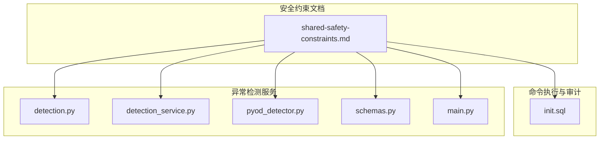
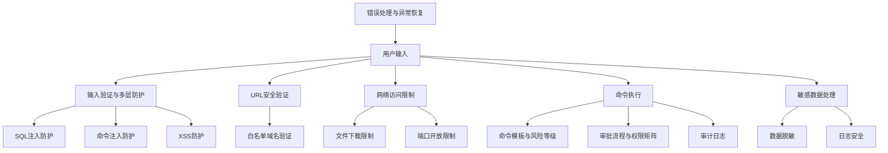
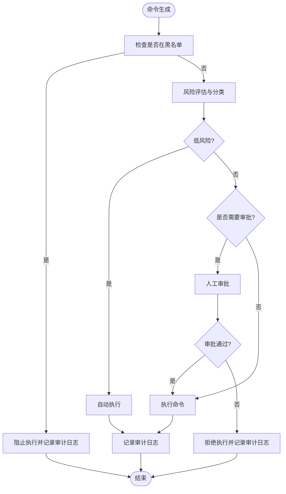
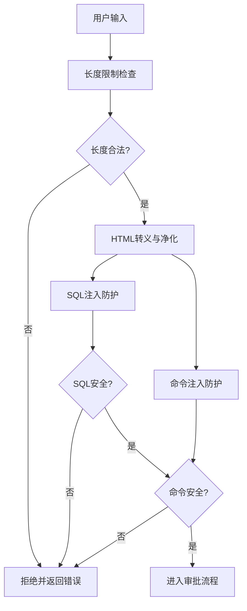
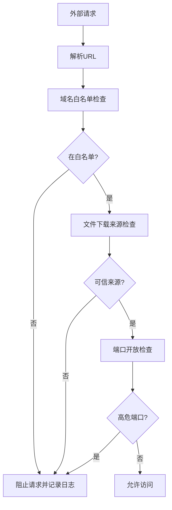
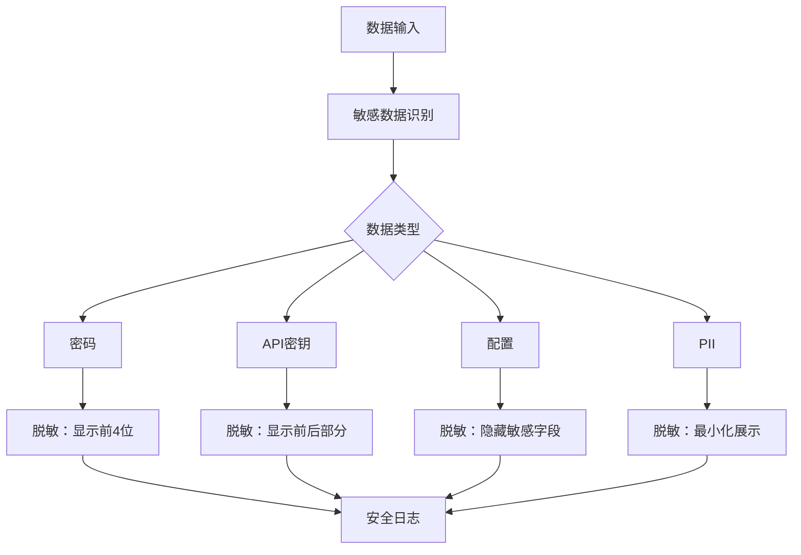
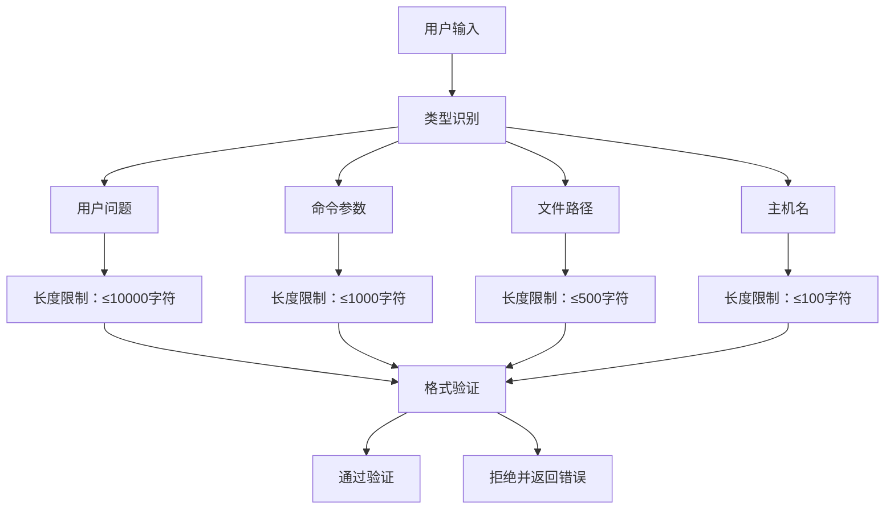
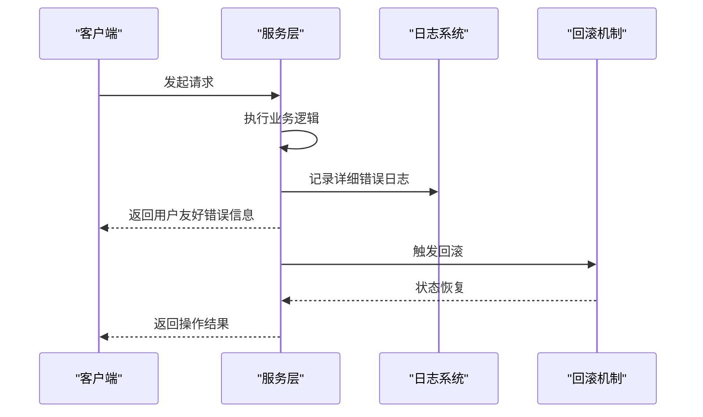
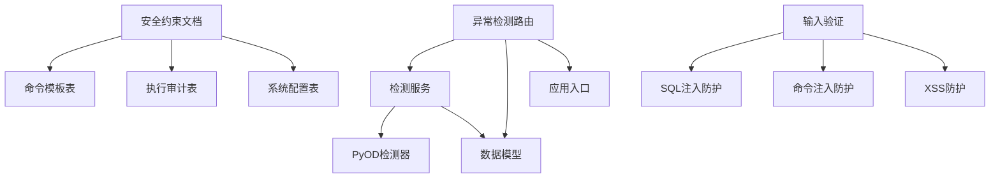

# 安全验证机制

<cite>
**本文档引用的文件**
- [shared-safety-constraints.md](file://docs/prompts/shared-safety-constraints.md)
- [init.sql](file://sql/init.sql)
- [detection.py](file://anomaly-detection-service/app/api/routes/detection.py)
- [detection_service.py](file://anomaly-detection-service/app/services/detection_service.py)
- [pyod_detector.py](file://anomaly-detection-service/app/core/pyod_detector.py)
- [schemas.py](file://anomaly-detection-service/app/models/schemas.py)
- [main.py](file://anomaly-detection-service/app/main.py)
- [PROJECT_CONTEXT.md](file://PROJECT_CONTEXT.md)
</cite>

## 目录
1. [简介](#简介)
2. [项目结构](#项目结构)
3. [核心组件](#核心组件)
4. [架构概览](#架构概览)
5. [详细组件分析](#详细组件分析)
6. [依赖分析](#依赖分析)
7. [性能考虑](#性能考虑)
8. [故障排除指南](#故障排除指南)
9. [结论](#结论)

## 简介

本文件为智能运维系统创建安全验证机制的技术文档，重点阐述命令安全验证、输入验证多层防护体系、URL安全验证与网络访问限制、敏感数据识别与脱敏处理、用户输入长度限制与格式验证规则，以及安全验证的错误处理与异常恢复机制。

系统采用多层安全防护策略，结合白名单命令验证、参数合法性检查、命令注入防护、SQL注入防护、XSS防护、URL安全验证、网络访问限制、敏感数据脱敏、权限控制与审计日志等手段，确保在复杂的运维场景下实现安全可控的操作流程。

## 项目结构

智能运维系统由多个子模块组成，其中与安全验证密切相关的核心模块包括：
- 命令执行与审计模块：通过数据库表结构定义命令模板、执行审计、权限控制等
- 异常检测服务模块：提供数据层面的安全边界，防止异常数据污染与攻击
- 安全约束文档：定义命令白名单、黑名单、审批流程、输入验证规则、URL安全验证、网络访问限制、敏感数据脱敏、错误处理与审计日志等

**图表来源**
- [shared-safety-constraints.md](file://docs/prompts/shared-safety-constraints.md)
- [init.sql](file://sql/init.sql)
- [detection.py](file://anomaly-detection-service/app/api/routes/detection.py)
- [detection_service.py](file://anomaly-detection-service/app/services/detection_service.py)
- [pyod_detector.py](file://anomaly-detection-service/app/core/pyod_detector.py)
- [schemas.py](file://anomaly-detection-service/app/models/schemas.py)
- [main.py](file://anomaly-detection-service/app/main.py)

**章节来源**
- [PROJECT_CONTEXT.md](file://PROJECT_CONTEXT.md)
- [shared-safety-constraints.md](file://docs/prompts/shared-safety-constraints.md)

## 核心组件

### 命令安全验证组件
- 命令白名单与黑名单：系统定义了绝对禁止的命令、需要审批的命令和可自动执行的命令，确保只有受控命令被执行
- 命令模板与风险等级：通过命令模板表定义命令结构、分类、风险等级与白名单标记，便于统一管理和审计
- 审批流程与权限矩阵：根据命令风险等级与用户角色，实施分级审批与权限控制

**章节来源**
- [shared-safety-constraints.md](file://docs/prompts/shared-safety-constraints.md)
- [init.sql](file://sql/init.sql)

### 输入验证与多层防护组件
- SQL注入防护：通过参数化查询避免SQL注入
- 命令注入防护：通过参数列表而非字符串拼接，防止命令注入
- XSS防护：通过HTML转义，防止跨站脚本攻击
- 输入长度限制：对用户问题、命令参数、文件路径、主机名等输入设定最大长度

**章节来源**
- [shared-safety-constraints.md](file://docs/prompts/shared-safety-constraints.md)

### URL安全验证与网络访问限制组件
- URL白名单验证：仅允许白名单域名的外部API调用
- 文件下载限制：禁止从未知来源下载执行
- 端口开放限制：禁止开放高危端口

**章节来源**
- [shared-safety-constraints.md](file://docs/prompts/shared-safety-constraints.md)

### 敏感数据识别与脱敏处理组件
- 敏感数据识别：密码、API密钥、证书、配置、PII等
- 脱敏规则：密码显示前4位，API密钥显示前后部分，数据库连接串脱敏
- 日志安全：禁止在日志中暴露敏感信息

**章节来源**
- [shared-safety-constraints.md](file://docs/prompts/shared-safety-constraints.md)

### 错误处理与异常恢复组件
- 错误信息脱敏：对外返回用户友好的错误信息，内部记录详细日志
- 异常恢复：执行回滚策略，确保操作失败时系统状态可恢复

**章节来源**
- [shared-safety-constraints.md](file://docs/prompts/shared-safety-constraints.md)

## 架构概览

系统安全架构围绕“命令执行安全”、“输入验证安全”、“网络访问安全”、“数据安全”和“审计日志”五大支柱构建，形成完整的安全验证闭环。

**图表来源**
- [shared-safety-constraints.md](file://docs/prompts/shared-safety-constraints.md)
- [init.sql](file://sql/init.sql)

## 详细组件分析

### 命令白名单验证与审批流程

命令白名单验证通过数据库表结构与安全约束文档共同实现：
- 绝对禁止的命令：系统明确列出不允许执行的命令，防止破坏性操作
- 需要审批的命令：对高风险命令实施人工审批，确保操作可控
- 可自动执行的命令：对低风险查询类命令，允许自动执行，提高效率

**图表来源**
- [shared-safety-constraints.md](file://docs/prompts/shared-safety-constraints.md)
- [init.sql](file://sql/init.sql)

**章节来源**
- [shared-safety-constraints.md](file://docs/prompts/shared-safety-constraints.md)
- [init.sql](file://sql/init.sql)

### 参数合法性检查与命令注入防护机制

系统通过以下机制实现参数合法性检查与命令注入防护：
- 参数化查询：使用参数化查询防止SQL注入
- 参数列表：使用参数列表而非字符串拼接，防止命令注入
- HTML转义：对用户输入进行HTML转义，防止XSS攻击
- 输入长度限制：对各类输入设定最大长度，防止缓冲区溢出与资源滥用

**图表来源**
- [shared-safety-constraints.md](file://docs/prompts/shared-safety-constraints.md)

**章节来源**
- [shared-safety-constraints.md](file://docs/prompts/shared-safety-constraints.md)

### URL安全验证与网络访问限制

系统通过URL白名单验证与网络访问限制，确保外部API调用与文件下载的安全性：
- 白名单域名验证：仅允许白名单域名的外部API调用
- 文件下载限制：禁止从未知来源下载执行
- 端口开放限制：禁止开放高危端口（如22、3389）

**图表来源**
- [shared-safety-constraints.md](file://docs/prompts/shared-safety-constraints.md)

**章节来源**
- [shared-safety-constraints.md](file://docs/prompts/shared-safety-constraints.md)

### 敏感数据识别与脱敏处理算法

系统通过以下规则实现敏感数据识别与脱敏处理：
- 敏感数据识别：密码、API密钥、证书、配置、PII等
- 脱敏规则：密码显示前4位，API密钥显示前后部分，数据库连接串脱敏
- 日志安全：禁止在日志中暴露敏感信息

**图表来源**
- [shared-safety-constraints.md](file://docs/prompts/shared-safety-constraints.md)

**章节来源**
- [shared-safety-constraints.md](file://docs/prompts/shared-safety-constraints.md)

### 用户输入长度限制与格式验证规则

系统对用户输入设定严格的长度限制与格式验证规则：
- 用户问题：最大10000字符
- 命令参数：最大1000字符
- 文件路径：最大500字符
- 主机名：最大100字符

**图表来源**
- [shared-safety-constraints.md](file://docs/prompts/shared-safety-constraints.md)

**章节来源**
- [shared-safety-constraints.md](file://docs/prompts/shared-safety-constraints.md)

### 错误处理与异常恢复机制

系统通过错误信息脱敏与异常恢复机制，确保在发生异常时不影响用户体验并保护系统安全：
- 错误信息脱敏：对外返回用户友好的错误信息，内部记录详细日志
- 异常恢复：执行回滚策略，确保操作失败时系统状态可恢复

**图表来源**
- [shared-safety-constraints.md](file://docs/prompts/shared-safety-constraints.md)

**章节来源**
- [shared-safety-constraints.md](file://docs/prompts/shared-safety-constraints.md)

## 依赖分析

系统安全验证机制涉及多个模块之间的协作，主要依赖关系如下：

**图表来源**
- [shared-safety-constraints.md](file://docs/prompts/shared-safety-constraints.md)
- [init.sql](file://sql/init.sql)
- [detection.py](file://anomaly-detection-service/app/api/routes/detection.py)
- [detection_service.py](file://anomaly-detection-service/app/services/detection_service.py)
- [pyod_detector.py](file://anomaly-detection-service/app/core/pyod_detector.py)
- [schemas.py](file://anomaly-detection-service/app/models/schemas.py)
- [main.py](file://anomaly-detection-service/app/main.py)

**章节来源**
- [detection.py](file://anomaly-detection-service/app/api/routes/detection.py)
- [detection_service.py](file://anomaly-detection-service/app/services/detection_service.py)
- [pyod_detector.py](file://anomaly-detection-service/app/core/pyod_detector.py)
- [schemas.py](file://anomaly-detection-service/app/models/schemas.py)
- [main.py](file://anomaly-detection-service/app/main.py)

## 性能考虑

- 异常检测性能：通过批量检测与流式检测相结合，平衡实时性与性能
- 模型训练与加载：支持模型持久化与加载，减少重复训练开销
- 日志记录：采用异步日志记录，避免阻塞主线程
- 超时控制：为外部API调用与命令执行设置合理的超时时间，防止资源泄露

## 故障排除指南

- 命令执行失败：检查命令是否在黑名单、是否需要审批、用户权限是否足够、是否存在回滚方案
- 输入验证失败：检查输入长度是否超限、是否进行了HTML转义、是否使用了参数化查询
- URL访问失败：检查域名是否在白名单、文件来源是否可信、端口是否为高危端口
- 敏感数据泄露：检查日志是否脱敏、是否遵循最小化原则、是否加密存储
- 异常恢复失败：检查回滚命令是否正确、是否及时触发、是否记录审计日志

**章节来源**
- [shared-safety-constraints.md](file://docs/prompts/shared-safety-constraints.md)

## 结论

智能运维系统的安全验证机制通过命令白名单与黑名单、参数合法性检查、URL安全验证、网络访问限制、敏感数据脱敏、权限控制与审计日志等多层防护，构建了完整的安全闭环。系统不仅能够有效防范常见的安全威胁，还能在发生异常时通过错误处理与异常恢复机制保障系统的稳定运行。建议在实际部署中持续完善安全策略，定期审查与更新安全规则，并加强安全监控与审计，确保系统长期安全稳定运行。