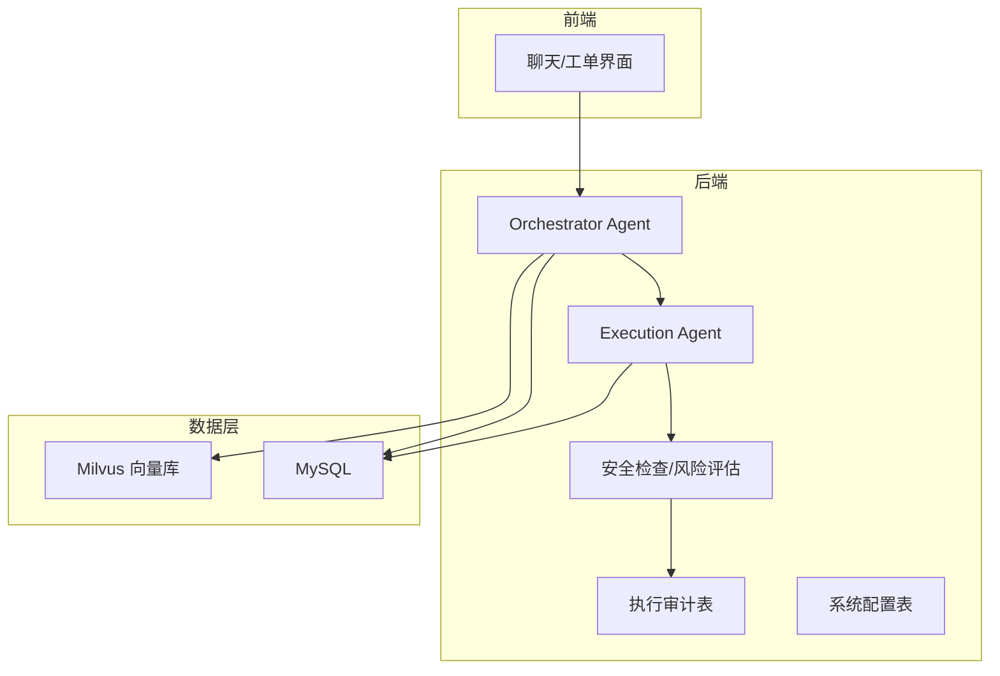
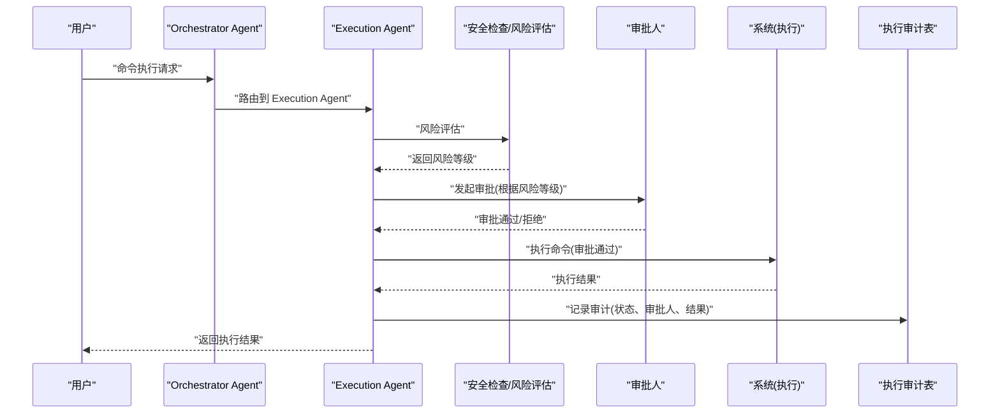
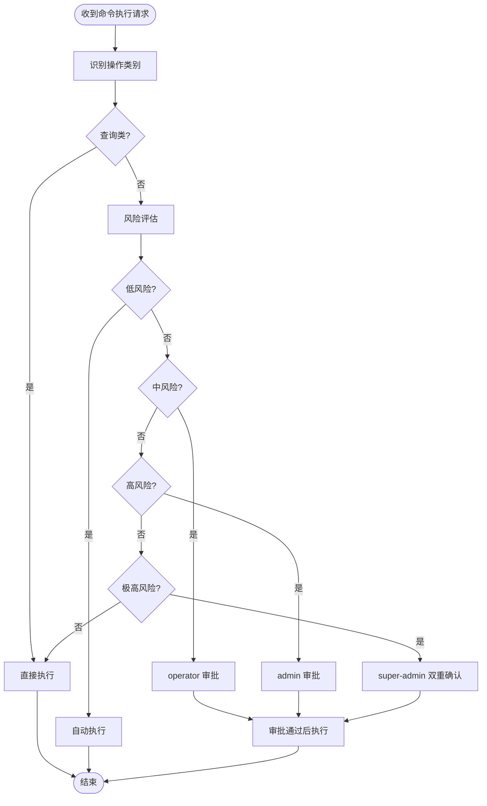
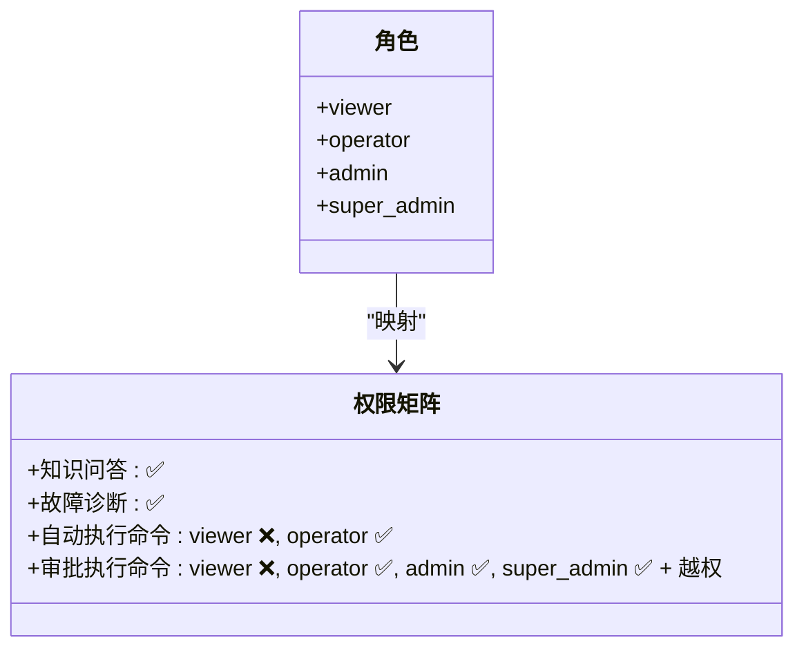
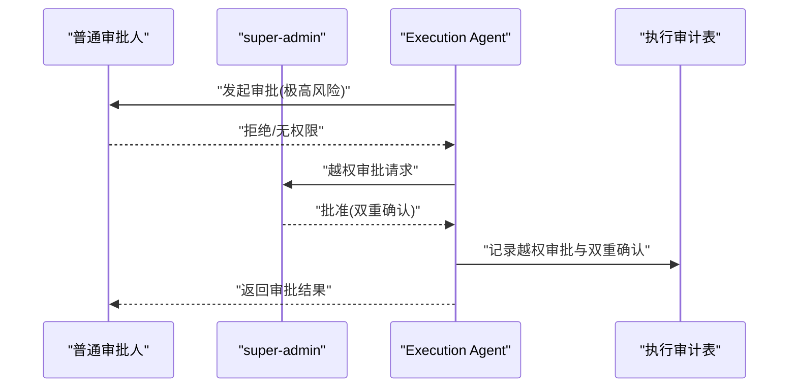
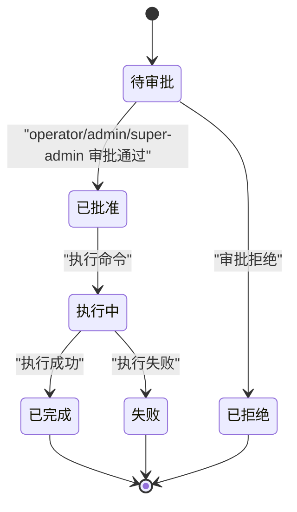
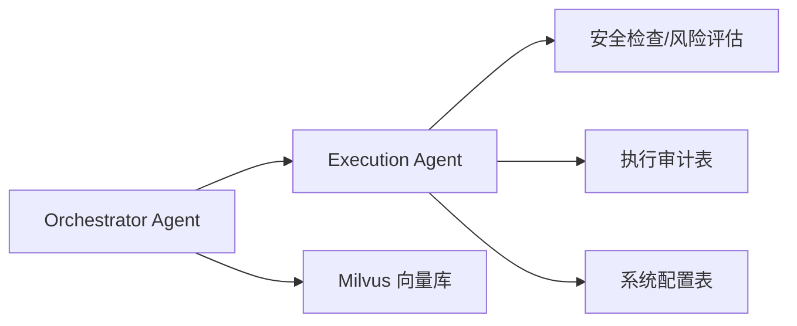
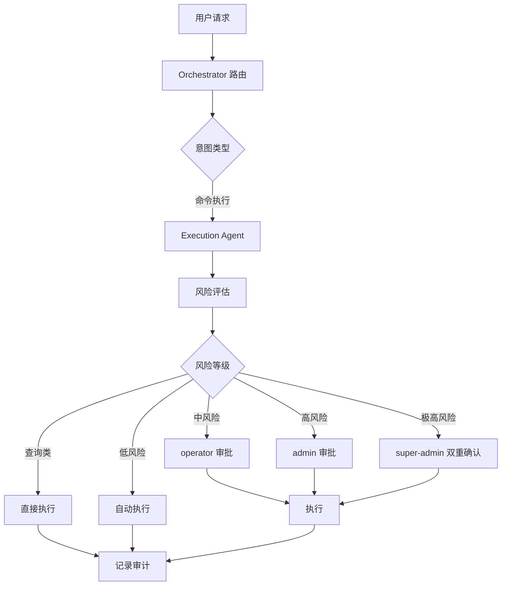

# 审批工作流程

<cite>
**本文引用的文件**
- [PROJECT_CONTEXT.md](file://PROJECT_CONTEXT.md)
- [开题报告_精简版.md](file://开题报告_精简版.md)
- [shared-safety-constraints.md](file://docs/prompts/shared-safety-constraints.md)
- [orchestrator-system-prompt.md](file://docs/prompts/orchestrator-system-prompt.md)
- [init.sql](file://sql/init.sql)
- [milvus_collection.yaml](file://config/milvus_collection.yaml)
</cite>

## 目录
1. [简介](#简介)
2. [项目结构](#项目结构)
3. [核心组件](#核心组件)
4. [架构总览](#架构总览)
5. [详细组件分析](#详细组件分析)
6. [依赖分析](#依赖分析)
7. [性能考虑](#性能考虑)
8. [故障排查指南](#故障排查指南)
9. [结论](#结论)
10. [附录](#附录)

## 简介
本文件面向“智能运维系统”的审批工作流程，聚焦于命令执行的分级审批机制与越权审批、双重确认等安全控制策略。系统以 Orchestrator-Subagent 模式组织，其中 Execution Agent 负责将“命令执行”路由至审批流程，结合风险评估与角色权限矩阵，实现从查询类、低风险、中风险、高风险到极高风险的差异化审批路径。

## 项目结构
- 后端采用 Spring Boot 3.x，包含 Agent 实现、AI 客户端、RAG、控制器、业务服务、WebSocket、配置等模块。
- 前端包含聊天界面、告警看板、知识库与“ExecutionApproval”视图，用于审批交互。
- 数据层包含 MySQL 初始化脚本，定义用户、对话、命令执行审计、命令模板、告警、异常检测、系统配置等表。
- 文档包含共享安全约束与 Orchestrator 系统 Prompt，明确了审批流程与路由规则。

**图表来源**
- [PROJECT_CONTEXT.md:120-149](file://PROJECT_CONTEXT.md#L120-L149)
- [init.sql:112-159](file://sql/init.sql#L112-L159)
- [milvus_collection.yaml:1-186](file://config/milvus_collection.yaml#L1-L186)

**章节来源**
- [PROJECT_CONTEXT.md:120-149](file://PROJECT_CONTEXT.md#L120-L149)
- [开题报告_精简版.md:118-152](file://开题报告_精简版.md#L118-L152)

## 核心组件
- Orchestrator Agent：识别意图、路由至 Query/Analysis/Execution Agent，对涉及“删除、修改、重启”等操作强制进入 Execution Agent，触发 Human-in-the-Loop 审批。
- Execution Agent：生成命令建议→风险评估→人工审批→执行→记录审计。
- 审批配置与状态：通过系统配置项控制低风险自动审批、最大等待时间等；执行审计表记录审批人、审批时间、状态流转。
- 角色与权限：viewer、operator、admin、super-admin，其中 super-admin 支持越权审批；不同风险级别对应不同审批人角色。

**章节来源**
- [orchestrator-system-prompt.md:119-124](file://docs/prompts/orchestrator-system-prompt.md#L119-L124)
- [shared-safety-constraints.md:244-258](file://docs/prompts/shared-safety-constraints.md#L244-L258)
- [init.sql:112-159](file://sql/init.sql#L112-L159)

## 架构总览
审批流程在“命令执行”意图下触发，Orchestrator 将请求路由至 Execution Agent；Execution Agent 调用安全检查模块进行风险评估，随后进入审批流程，审批通过后执行命令并记录审计。

**图表来源**
- [orchestrator-system-prompt.md:119-124](file://docs/prompts/orchestrator-system-prompt.md#L119-L124)
- [shared-safety-constraints.md:244-258](file://docs/prompts/shared-safety-constraints.md#L244-L258)
- [init.sql:112-138](file://sql/init.sql#L112-L138)

## 详细组件分析

### 审批分级机制与路径
- 查询类：直接执行，无需审批。
- 低风险：自动执行，无需人工审批。
- 中风险：operator 审批。
- 高风险：admin 审批。
- 极高风险：super-admin 审批，并引入“双重确认”。

**图表来源**
- [shared-safety-constraints.md:244-258](file://docs/prompts/shared-safety-constraints.md#L244-L258)

**章节来源**
- [shared-safety-constraints.md:244-258](file://docs/prompts/shared-safety-constraints.md#L244-L258)

### 角色与审批权限
- viewer：仅可查看与问答，不可执行或审批。
- operator：可执行低风险命令，可审批中风险命令。
- admin：可审批高风险命令。
- super-admin：可审批极高风险命令，并具备越权审批能力。

**图表来源**
- [shared-safety-constraints.md:235-243](file://docs/prompts/shared-safety-constraints.md#L235-L243)

**章节来源**
- [shared-safety-constraints.md:235-243](file://docs/prompts/shared-safety-constraints.md#L235-L243)

### 越权审批与双重确认
- 越权审批：super-admin 可绕过其原本不具审批权限的风险级别，直接审批。
- 双重确认：极高风险操作需由 super-admin 进行二次确认，确保最高安全级别。

**图表来源**
- [shared-safety-constraints.md:242](file://docs/prompts/shared-safety-constraints.md#L242)
- [init.sql:112-138](file://sql/init.sql#L112-L138)

**章节来源**
- [shared-safety-constraints.md:242](file://docs/prompts/shared-safety-constraints.md#L242)

### 审批状态管理
执行审计表记录审批状态流转，关键字段包括：
- request_id：请求唯一标识
- risk_level：风险等级（low/medium/high/critical）
- status：审批与执行状态（pending/approved/rejected/executing/completed/failed）
- approver_id：审批人ID
- approved_at：审批时间
- execution_result：执行结果
- error_message：错误信息
- execution_time_ms：执行耗时

**图表来源**
- [init.sql:112-138](file://sql/init.sql#L112-L138)

**章节来源**
- [init.sql:112-138](file://sql/init.sql#L112-L138)

### 配置示例
- 自动批准低风险命令开关：execution.auto_approve_low_risk
- 命令执行最大等待时间：execution.max_wait_time（秒）

上述配置位于系统配置表中，可通过管理界面或 API 更新。

**章节来源**
- [init.sql:220-244](file://sql/init.sql#L220-L244)

## 依赖分析
- Orchestrator 将“命令执行”意图路由至 Execution Agent，后者依赖安全检查模块进行风险评估。
- Execution Agent 与执行审计表交互，记录审批与执行状态。
- 系统配置表提供审批相关参数，影响自动审批与等待策略。
- Milvus 用于 RAG 检索，支撑知识问答与建议生成，间接影响审批决策质量。

**图表来源**
- [orchestrator-system-prompt.md:119-124](file://docs/prompts/orchestrator-system-prompt.md#L119-L124)
- [init.sql:112-159](file://sql/init.sql#L112-L159)
- [milvus_collection.yaml:1-186](file://config/milvus_collection.yaml#L1-L186)

**章节来源**
- [orchestrator-system-prompt.md:119-124](file://docs/prompts/orchestrator-system-prompt.md#L119-L124)
- [init.sql:112-159](file://sql/init.sql#L112-L159)
- [milvus_collection.yaml:1-186](file://config/milvus_collection.yaml#L1-L186)

## 性能考虑
- 审批等待时间：通过系统配置项控制最大等待时间，避免长时间阻塞。
- 自动审批：低风险命令自动执行，减少人工干预，提高吞吐。
- 并行与串行：Orchestrator 支持多 Agent 并行/串行组合，审批流程应尽量串行以保证安全，必要时可并行加速非敏感环节。
- 审计查询：执行审计表建立索引，便于按状态、风险等级、时间等维度快速检索。

[本节为通用建议，不直接分析具体文件]

## 故障排查指南
- 审批未触发：确认 Orchestrator 是否将“命令执行”意图路由至 Execution Agent。
- 风险评估异常：检查安全检查模块对命令的判定逻辑与阈值。
- 审批状态停滞：核查执行审计表的状态字段与审批人 ID 是否正确更新。
- 越权审批失败：确认 super-admin 是否具备越权审批权限，且双重确认流程已执行。
- 配置不生效：检查系统配置表中的审批相关键值是否正确设置。

**章节来源**
- [shared-safety-constraints.md:244-258](file://docs/prompts/shared-safety-constraints.md#L244-L258)
- [init.sql:112-138](file://sql/init.sql#L112-L138)

## 结论
本审批工作流程以“最小权限、防御优先、审计追溯”为核心原则，结合风险等级与角色权限矩阵，实现了从查询类到极高风险的全链路审批路径。通过越权审批与双重确认机制，进一步提升了极高风险操作的安全性。配合系统配置与执行审计表，系统可在保证安全的同时提升自动化水平与响应速度。

[本节为总结性内容，不直接分析具体文件]

## 附录
- 审批流程可视化（概念示意）

[本图为概念示意，不直接对应具体源文件]