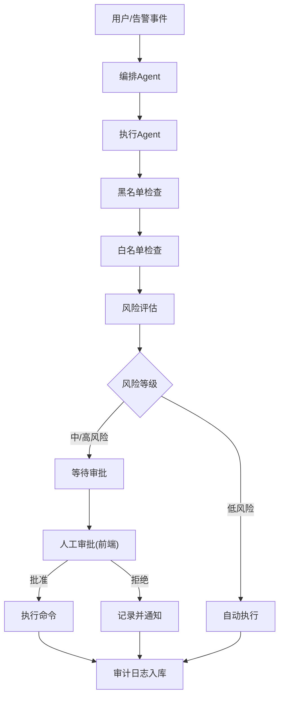
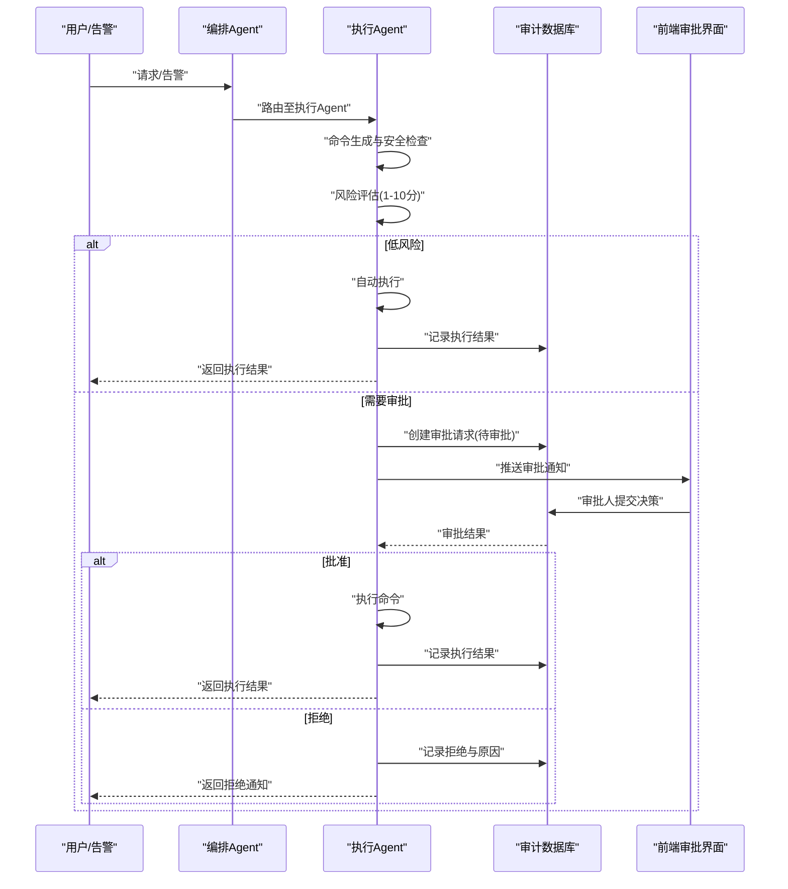
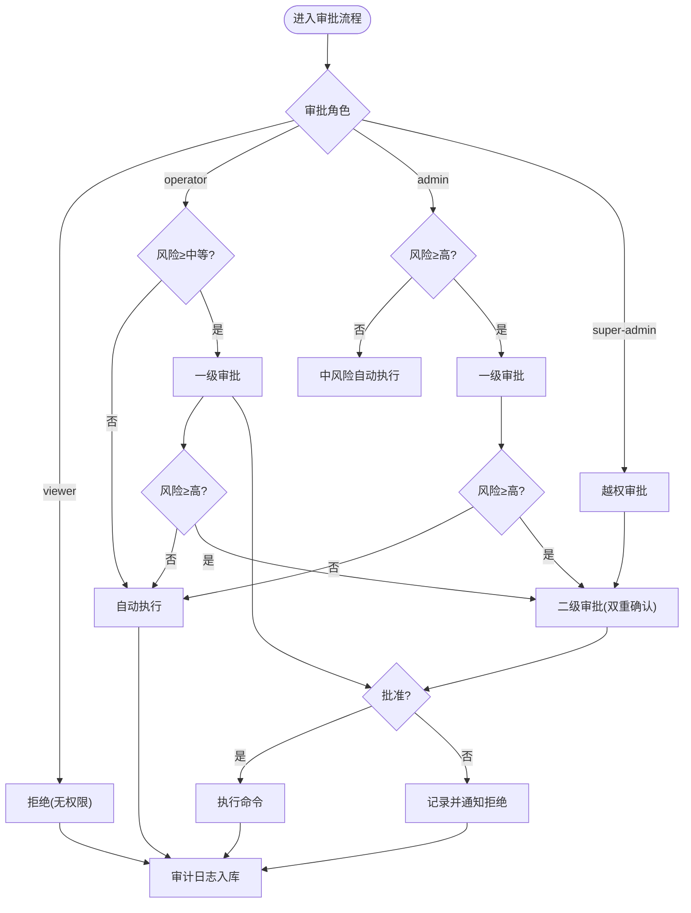
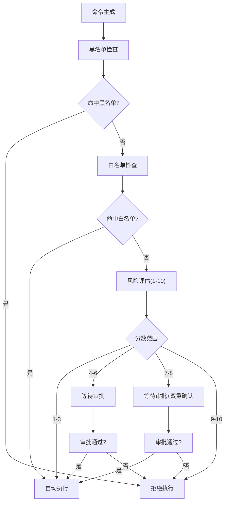
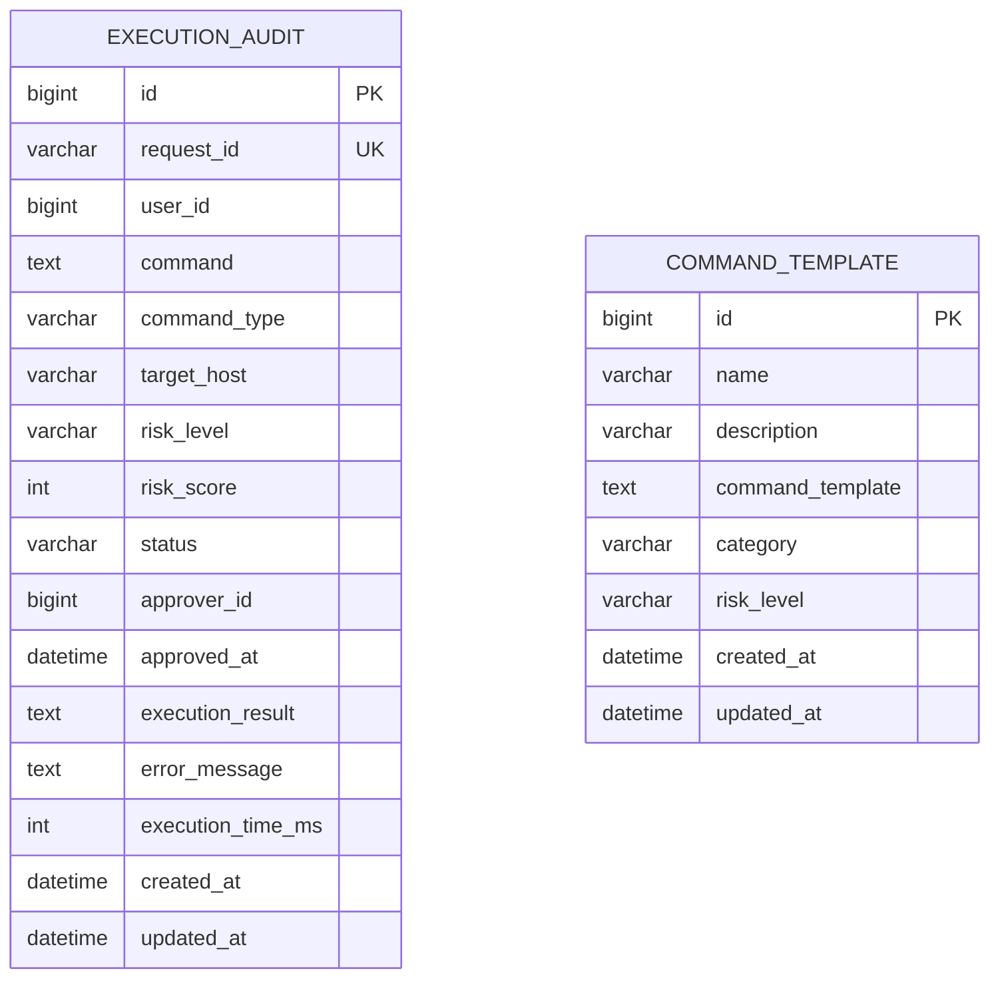
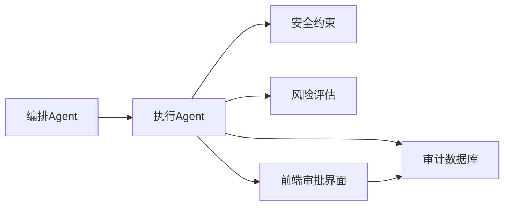

# 审批流程控制

<cite>
**本文引用的文件**   
- [orchestrator-system-prompt.md](file://docs/prompts/orchestrator-system-prompt.md)
- [execution-agent-system-prompt.md](file://docs/prompts/execution-agent-system-prompt.md)
- [shared-safety-constraints.md](file://docs/prompts/shared-safety-constraints.md)
- [development-prompt-library.md](file://docs/prompts/development-prompt-library.md)
- [PROJECT_CONTEXT.md](file://PROJECT_CONTEXT.md)
- [开题报告_精简版.md](file://开题报告_精简版.md)
- [init.sql](file://sql/init.sql)
</cite>

## 目录
1. [简介](#简介)
2. [项目结构](#项目结构)
3. [核心组件](#核心组件)
4. [架构总览](#架构总览)
5. [详细组件分析](#详细组件分析)
6. [依赖分析](#依赖分析)
7. [性能考虑](#性能考虑)
8. [故障排查指南](#故障排查指南)
9. [结论](#结论)
10. [附录](#附录)

## 简介
本文件面向“智能运维系统”的审批流程控制，聚焦于命令执行与人工审批的全流程设计与实现。内容覆盖：
- 各级审批人员的职责分工与权限范围
- 越权审批机制与双重确认流程
- 审批流程的可视化决策树与状态转换图
- 审批超时、自动拒绝、人工干预等流程控制机制
- 审批流程的配置示例与流程监控指标
- 审批记录的保存与审计追踪机制

## 项目结构
系统采用“编排-子Agent”模式，其中执行Agent负责命令生成、风险评估与审批触发；审批流程贯穿于执行Agent内部，结合数据库审计表与前端审批界面实现闭环。

**图表来源**
- [PROJECT_CONTEXT.md:43-61](file://PROJECT_CONTEXT.md#L43-L61)
- [execution-agent-system-prompt.md:60-95](file://docs/prompts/execution-agent-system-prompt.md#L60-L95)

**章节来源**
- [PROJECT_CONTEXT.md:43-61](file://PROJECT_CONTEXT.md#L43-L61)
- [开题报告_精简版.md:91-103](file://开题报告_精简版.md#L91-L103)

## 核心组件
- 编排Agent：识别意图、路由至执行Agent，触发Human-in-the-Loop审批流程
- 执行Agent：命令生成、黑名单/白名单检查、风险评估、审批请求生成、执行与审计
- 审批服务：审批状态管理、超时与拒绝、双重确认
- 审计数据库：execution_audit表记录审批与执行全过程
- 前端审批界面：WebSocket接收审批通知、展示风险详情、提交审批决策

**章节来源**
- [orchestrator-system-prompt.md:109-124](file://docs/prompts/orchestrator-system-prompt.md#L109-L124)
- [execution-agent-system-prompt.md:17-57](file://docs/prompts/execution-agent-system-prompt.md#L17-L57)
- [shared-safety-constraints.md:233-257](file://docs/prompts/shared-safety-constraints.md#L233-L257)
- [init.sql:114-138](file://sql/init.sql#L114-L138)

## 架构总览
审批流程在执行Agent内部完成，遵循“黑名单→白名单→风险评估→审批/自动执行”的决策链，并通过数据库与前端实现可追溯与可干预。

**图表来源**
- [execution-agent-system-prompt.md:60-95](file://docs/prompts/execution-agent-system-prompt.md#L60-L95)
- [execution-agent-system-prompt.md:121-192](file://docs/prompts/execution-agent-system-prompt.md#L121-L192)
- [init.sql:114-138](file://sql/init.sql#L114-L138)

## 详细组件分析

### 审批人员职责与权限范围
- 角色与权限矩阵
  - viewer：仅可查看，不可执行
  - operator：可执行低风险命令，可审批中风险
  - admin：可审批高风险，可执行低/中风险
  - super-admin：可越权审批，可审批极高风险并触发双重确认
- 审批流程映射
  - 低风险：自动执行
  - 中风险：operator审批
  - 高风险：admin审批
  - 极高风险：super-admin审批 + 双重确认

**章节来源**
- [shared-safety-constraints.md:235-258](file://docs/prompts/shared-safety-constraints.md#L235-L258)

### 越权审批机制与双重确认
- 越权审批
  - super-admin可绕过直接审批权限，但需满足更高风险阈值
- 双重确认
  - 高风险（7-8分）及以上触发“审批+双重确认”，由第二审批人复核
- 审批超时
  - 审批超时分钟数可配置，超时自动拒绝并记录

**图表来源**
- [shared-safety-constraints.md:235-258](file://docs/prompts/shared-safety-constraints.md#L235-L258)
- [execution-agent-system-prompt.md:110-118](file://docs/prompts/execution-agent-system-prompt.md#L110-L118)

### 审批流程可视化决策树
- 决策节点
  - 命令类型：删除/修改/查询/只读
  - 影响范围：全局/单机/单服务/单文件
  - 可逆性：不可逆/难恢复/可恢复/易恢复
  - 执行频率：首次/罕见/偶尔/频繁
- 风险等级映射
  - 1-3分：低风险，自动执行
  - 4-6分：中风险，需要审批
  - 7-8分：高风险，需要审批+双重确认
  - 9-10分：禁止执行或需高级权限

**图表来源**
- [execution-agent-system-prompt.md:60-95](file://docs/prompts/execution-agent-system-prompt.md#L60-L95)
- [execution-agent-system-prompt.md:99-118](file://docs/prompts/execution-agent-system-prompt.md#L99-L118)

### 审批超时、自动拒绝与人工干预
- 超时控制
  - 审批超时分钟数可配置，默认值在执行Agent提示中体现
  - 执行超时与最大重试次数可配置，超时后自动终止并记录
- 自动拒绝
  - 黑名单命中、风险评分过高、审批超时均触发自动拒绝
- 人工干预
  - 前端审批界面通过WebSocket接收通知，展示命令详情、风险评估与预期结果，审批人可批准或拒绝
  - 审批记录与执行结果同步写入审计数据库

**章节来源**
- [execution-agent-system-prompt.md:253-265](file://docs/prompts/execution-agent-system-prompt.md#L253-L265)
- [execution-agent-system-prompt.md:149-171](file://docs/prompts/execution-agent-system-prompt.md#L149-L171)
- [development-prompt-library.md:303-336](file://docs/prompts/development-prompt-library.md#L303-L336)

### 审批记录保存与审计追踪
- 审计字段
  - 请求ID、执行用户、命令、命令类型、目标主机、风险等级与分数、状态、审批人、审批时间、执行结果、错误信息、执行耗时、创建/更新时间
- 审计要求
  - 所有执行必须有审计记录，记录保留至少90天
  - 审批决策、命令执行、回滚操作均需记录
- 数据库表结构
  - execution_audit：命令执行审计表
  - command_template：命令模板表（用于标准化命令）

**图表来源**
- [init.sql:114-138](file://sql/init.sql#L114-L138)
- [init.sql:143-170](file://sql/init.sql#L143-L170)

**章节来源**
- [execution-agent-system-prompt.md:196-228](file://docs/prompts/execution-agent-system-prompt.md#L196-L228)
- [shared-safety-constraints.md:296-323](file://docs/prompts/shared-safety-constraints.md#L296-L323)
- [init.sql:114-138](file://sql/init.sql#L114-L138)

### 审批流程配置示例
- 审批超时分钟数：可在执行Agent提示中配置
- 执行超时秒数与最大重试次数：可在执行Agent提示中配置
- 风险评估权重：命令类型40%、影响范围30%、可逆性20%、执行频率10%
- 风险等级映射：1-3分低、4-6分中、7-8分高、9-10分禁止或需高级权限

**章节来源**
- [execution-agent-system-prompt.md:260-265](file://docs/prompts/execution-agent-system-prompt.md#L260-L265)
- [execution-agent-system-prompt.md:99-118](file://docs/prompts/execution-agent-system-prompt.md#L99-L118)

### 流程监控指标
- 审批通过率、拒绝率、超时率
- 平均审批时长、平均执行时长
- 风险分布统计（低/中/高/极高）
- 审计日志查询性能与容量

**章节来源**
- [shared-safety-constraints.md:296-323](file://docs/prompts/shared-safety-constraints.md#L296-L323)

## 依赖分析
- 编排Agent依赖执行Agent进行命令执行与审批触发
- 执行Agent依赖安全约束与风险评估规则
- 审批流程依赖数据库审计表与前端审批界面
- 审批界面通过WebSocket与执行Agent交互

**图表来源**
- [PROJECT_CONTEXT.md:43-61](file://PROJECT_CONTEXT.md#L43-L61)
- [shared-safety-constraints.md:233-257](file://docs/prompts/shared-safety-constraints.md#L233-L257)
- [execution-agent-system-prompt.md:60-95](file://docs/prompts/execution-agent-system-prompt.md#L60-L95)

**章节来源**
- [PROJECT_CONTEXT.md:43-61](file://PROJECT_CONTEXT.md#L43-L61)
- [shared-safety-constraints.md:233-257](file://docs/prompts/shared-safety-constraints.md#L233-L257)

## 性能考虑
- 审批超时与执行超时设置应平衡用户体验与系统稳定性
- 风险评估算法应尽量轻量化，避免成为瓶颈
- 审计日志写入应异步化，减少对主流程的影响
- 前端审批界面应支持批量处理与状态刷新

## 故障排查指南
- 审批未触发
  - 检查编排Agent是否正确路由至执行Agent
  - 检查命令是否命中白名单或黑名单
- 审批超时
  - 调整审批超时配置
  - 检查前端WebSocket连接与通知推送
- 审批拒绝
  - 检查风险评估分数与审批角色权限
  - 检查审计日志中的拒绝原因
- 审计缺失
  - 检查execution_audit表写入逻辑
  - 检查审计字段完整性与索引

**章节来源**
- [execution-agent-system-prompt.md:253-265](file://docs/prompts/execution-agent-system-prompt.md#L253-L265)
- [init.sql:114-138](file://sql/init.sql#L114-L138)

## 结论
本审批流程控制文档基于系统提示与安全约束，明确了各级审批人员的职责与权限、越权审批与双重确认机制、可视化决策树与状态转换图、超时与拒绝控制、人工干预与审计追踪。通过数据库审计表与前端审批界面，实现全流程可追溯、可干预、可监控。

## 附录
- 相关提示与开发模板
  - Orchestrator系统提示：意图识别与路由
  - 执行Agent系统提示：命令生成、风险评估与审批
  - 安全约束：命令黑白灰名单与权限矩阵
  - 开发阶段模板：审批流程核心实现与前端审批界面

**章节来源**
- [orchestrator-system-prompt.md:109-124](file://docs/prompts/orchestrator-system-prompt.md#L109-L124)
- [execution-agent-system-prompt.md:60-95](file://docs/prompts/execution-agent-system-prompt.md#L60-L95)
- [shared-safety-constraints.md:235-258](file://docs/prompts/shared-safety-constraints.md#L235-L258)
- [development-prompt-library.md:303-336](file://docs/prompts/development-prompt-library.md#L303-L336)