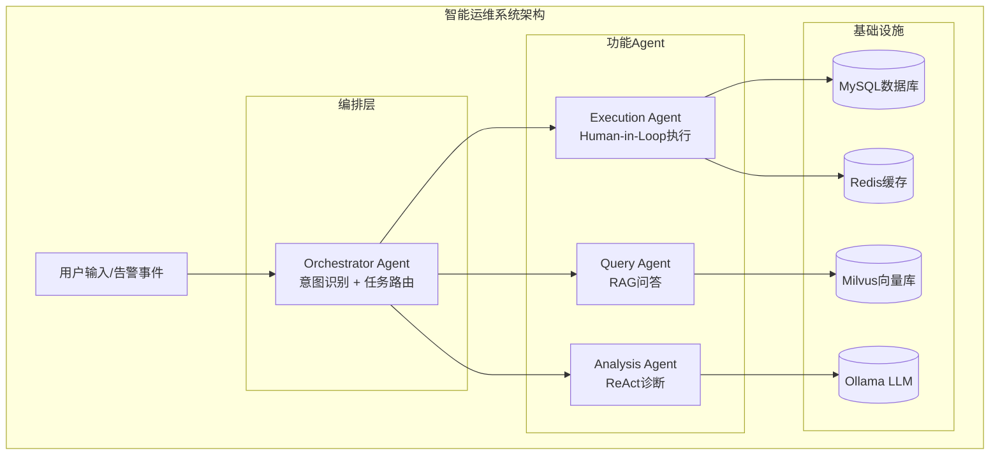
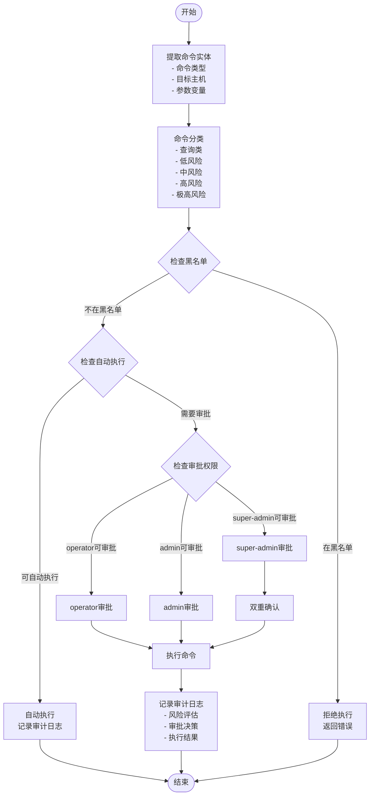
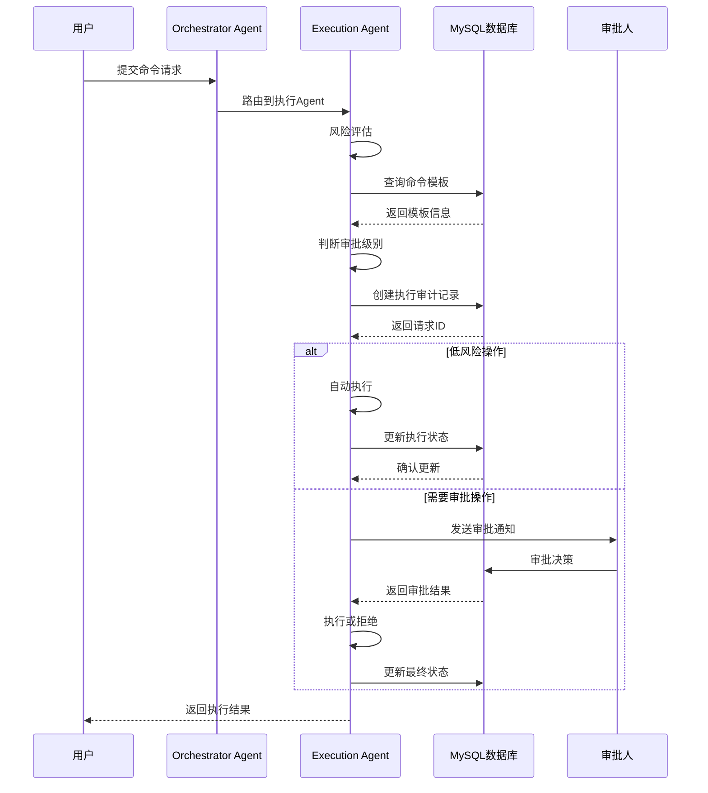
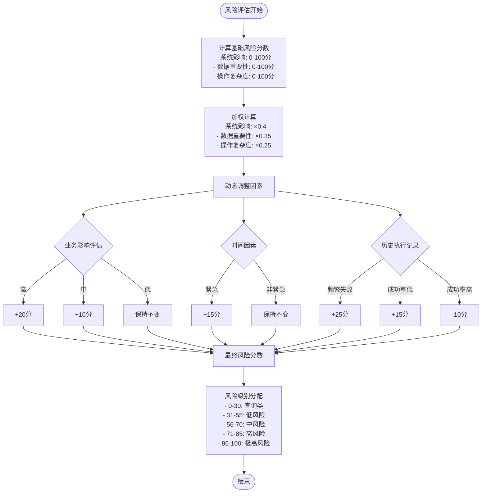
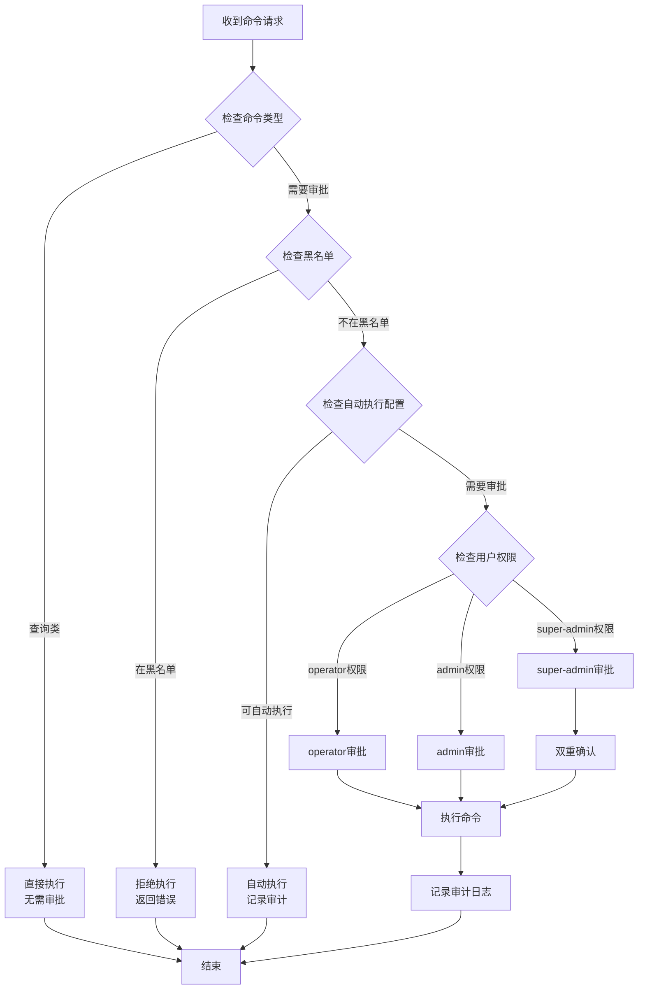
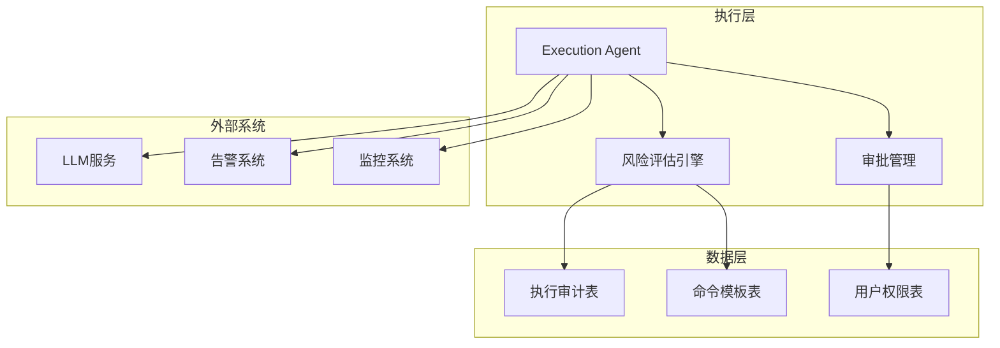

# 审批级别体系

<cite>
**本文档引用的文件**
- [PROJECT_CONTEXT.md](file://PROJECT_CONTEXT.md)
- [shared-safety-constraints.md](file://docs/prompts/shared-safety-constraints.md)
- [orchestrator-system-prompt.md](file://docs/prompts/orchestrator-system-prompt.md)
- [init.sql](file://sql/init.sql)
- [milvus_collection.yaml](file://config/milvus_collection.yaml)
- [docker-compose.yml](file://docker-compose.yml)
</cite>

## 目录
1. [简介](#简介)
2. [项目结构](#项目结构)
3. [核心组件](#核心组件)
4. [架构概览](#架构概览)
5. [详细组件分析](#详细组件分析)
6. [依赖分析](#依赖分析)
7. [性能考虑](#性能考虑)
8. [故障排除指南](#故障排除指南)
9. [结论](#结论)

## 简介

本文档为智能运维系统创建完整的审批级别体系，基于项目现有的安全约束和执行架构，定义了查询类、低风险、中风险、高风险、极高风险五个审批级别的标准和判定依据。该体系结合系统影响范围、数据重要性、操作复杂度等风险评估指标，提供了具体的命令分类示例、动态调整机制和例外情况处理方案。

## 项目结构

智能运维系统采用多Agent协同架构，包含四个核心Agent模块：

**图表来源**
- [PROJECT_CONTEXT.md:43-61](file://PROJECT_CONTEXT.md#L43-L61)
- [docker-compose.yml:23-357](file://docker-compose.yml#L23-L357)

**章节来源**
- [PROJECT_CONTEXT.md:16-61](file://PROJECT_CONTEXT.md#L16-L61)
- [docker-compose.yml:1-357](file://docker-compose.yml#L1-L357)

## 核心组件

### 审批级别定义

基于项目安全约束，系统定义了五个审批级别：

| 审批级别 | 风险等级 | 定义标准 | 判定依据 | 审批要求 |
|---------|---------|---------|---------|---------|
| 查询类 | 低风险 | 仅信息查询，无系统变更 | 不涉及删除、修改、重启等操作 | 直接执行，无需审批 |
| 低风险 | 低风险 | 基础信息查询，影响范围有限 | 仅查看状态、日志、进程等 | 自动执行，记录审计 |
| 中风险 | 中风险 | 需要人工确认的重要操作 | 涉及服务重启、配置修改等 | operator审批 |
| 高风险 | 高风险 | 可能影响服务可用性的操作 | 涉及数据库、网络配置等 | admin审批 |
| 极高风险 | 极高风险 | 可能造成重大影响的操作 | 系统关机、数据删除等 | super-admin审批+双重确认 |

**章节来源**
- [shared-safety-constraints.md:244-258](file://docs/prompts/shared-safety-constraints.md#L244-L258)

### 命令分类体系

#### 查询类命令（直接执行）
- 信息查询：`ps aux`、`top -bn1`、`netstat -tlnp`、`df -h`、`free -m`
- 日志查看：`tail -f /var/log/<logfile>`、`journalctl -u <service>`
- 服务状态：`systemctl status <service>`、`docker ps`

#### 低风险命令（自动执行）
- 进程查询：`ps aux \| grep {{process_name}}`
- 端口检查：`netstat -tulnp \| grep {{port}}`
- 磁盘检查：`df -h`、`du -sh /var/log`
- 内存检查：`free -h`

#### 中风险命令（需要operator审批）
- 服务操作：`systemctl restart {{service_name}}`
- 配置查看：`cat /etc/{{config_file}}`
- 日志清理：`find {{log_path}} -name "*.log" -mtime +{{days:7}} -delete`

#### 高风险命令（需要admin审批）
- 数据库操作：`mysql -e "DROP DATABASE ..."`
- 系统配置：`vim /etc/{{config}}`、`sed -i ... /etc/{{config}}`
- 网络配置：`iptables -A ...`、`route add ...`

#### 极高风险命令（需要super-admin审批+双重确认）
- 系统销毁：`rm -rf /`、`mkfs.ext4 /dev/sda1`
- 权限开放：`chmod 777 /`、`chmod -R 777 /etc`
- 系统关机：`shutdown -h now`、`reboot`

**章节来源**
- [shared-safety-constraints.md:68-126](file://docs/prompts/shared-safety-constraints.md#L68-L126)
- [init.sql:162-170](file://sql/init.sql#L162-L170)

## 架构概览

### 风险评估决策流程

**图表来源**
- [shared-safety-constraints.md:244-258](file://docs/prompts/shared-safety-constraints.md#L244-L258)
- [init.sql:114-138](file://sql/init.sql#L114-L138)

### 审批流程序列图

**图表来源**
- [orchestrator-system-prompt.md:119-123](file://docs/prompts/orchestrator-system-prompt.md#L119-L123)
- [init.sql:114-138](file://sql/init.sql#L114-L138)

## 详细组件分析

### 风险评估指标体系

#### 系统影响范围评估

| 影响范围 | 评估维度 | 分值权重 | 量化标准 |
|---------|---------|---------|---------|
| 个人主机 | 服务数量、进程数量、配置文件数量 | 0.3 | 单一主机内操作 |
| 服务集群 | 服务实例数量、节点数量、网络拓扑 | 0.4 | 多主机协调操作 |
| 生产环境 | 关键服务、SLA影响、业务中断风险 | 0.3 | 影响业务连续性 |

#### 数据重要性评估

| 数据类别 | 评估维度 | 分值权重 | 量化标准 |
|---------|---------|---------|---------|
| 公开数据 | 日志文件、监控数据、临时文件 | 0.2 | 可恢复数据 |
| 一般数据 | 配置文件、应用数据 | 0.3 | 重要但可恢复 |
| 敏感数据 | 用户隐私、财务数据、证书密钥 | 0.4 | 需要严格保护 |
| 核心数据 | 数据库、备份、系统文件 | 0.5 | 业务命脉数据 |

#### 操作复杂度评估

| 复杂度级别 | 评估维度 | 分值权重 | 量化标准 |
|---------|---------|---------|---------|
| 简单操作 | 单命令执行、无依赖关系 | 0.2 | 直接执行 |
| 中等复杂度 | 多步骤操作、有限依赖 | 0.3 | 需要协调 |
| 高复杂度 | 多服务联动、业务流程 | 0.4 | 需要预案 |
| 极高复杂度 | 生产环境变更、业务中断 | 0.5 | 需要演练 |

### 动态调整机制

#### 风险级别动态调整

**图表来源**
- [shared-safety-constraints.md:244-258](file://docs/prompts/shared-safety-constraints.md#L244-L258)
- [init.sql:144-159](file://sql/init.sql#L144-L159)

#### 例外情况处理

| 例外情况类型 | 处理机制 | 审批要求 | 记录要求 |
|---------|---------|---------|---------|
| 紧急故障处理 | 快速通道审批 | super-admin即时审批 | 事后补记录 |
| 开发测试环境 | 简化审批流程 | team leader审批 | 完整审计日志 |
| 第三方维护 | 外包审批流程 | 安全负责人审批 | 合规审查记录 |
| 系统升级 | 计划性变更 | 变更管理委员会审批 | 变更管理记录 |

**章节来源**
- [shared-safety-constraints.md:360-378](file://docs/prompts/shared-safety-constraints.md#L360-L378)

### 决策树算法实现

#### 风险评估决策树

**图表来源**
- [shared-safety-constraints.md:244-258](file://docs/prompts/shared-safety-constraints.md#L244-L258)
- [init.sql:114-138](file://sql/init.sql#L114-L138)

## 依赖分析

### 组件耦合关系

**图表来源**
- [init.sql:114-159](file://sql/init.sql#L114-L159)
- [docker-compose.yml:23-357](file://docker-compose.yml#L23-L357)

### 外部依赖

| 依赖组件 | 版本要求 | 用途 | 配置位置 |
|---------|---------|---------|---------|
| MySQL | 8.0 | 数据持久化 | docker-compose.yml |
| Redis | 7.x | 缓存和会话 | docker-compose.yml |
| Milvus | 2.4 | 向量检索 | docker-compose.yml |
| Ollama | 最新 | LLM推理 | docker-compose.yml |
| Spring Boot | 3.3.x | 后端框架 | PROJECT_CONTEXT.md |
| Spring AI | 1.0.x | AI客户端 | PROJECT_CONTEXT.md |

**章节来源**
- [PROJECT_CONTEXT.md:25-40](file://PROJECT_CONTEXT.md#L25-L40)
- [docker-compose.yml:163-290](file://docker-compose.yml#L163-L290)

## 性能考虑

### 审批流程性能优化

1. **异步审批处理**：审批请求采用异步队列处理，避免阻塞主流程
2. **缓存机制**：常用命令模板和权限信息缓存到Redis
3. **批量处理**：多个低风险操作可批量执行减少数据库压力
4. **超时控制**：审批等待时间限制在合理范围内

### 数据库性能优化

- **索引优化**：执行审计表按风险级别、状态、时间建立复合索引
- **分区策略**：按时间分区存储审计日志
- **连接池**：配置合理的数据库连接池大小
- **查询优化**：使用EXPLAIN分析慢查询并优化

## 故障排除指南

### 常见问题及解决方案

| 问题类型 | 症状 | 原因分析 | 解决方案 |
|---------|---------|---------|---------|
| 审批超时 | 审批请求长时间无响应 | 审批人离线或系统故障 | 检查审批人状态，重启审批服务 |
| 权限不足 | 命令执行被拒绝 | 用户权限不够或角色错误 | 检查用户角色配置，提升权限级别 |
| 风险评估错误 | 命令被错误分类 | 风险评估算法问题 | 检查风险评估配置，更新评估模型 |
| 审计日志缺失 | 执行结果无记录 | 数据库连接问题 | 检查数据库连接，恢复审计功能 |

### 审计日志分析

系统必须记录以下关键事件：
- 用户登录/登出
- 命令生成和执行
- 风险评估结果
- 审批决策过程
- 配置变更记录
- 错误和异常处理

**章节来源**
- [shared-safety-constraints.md:296-323](file://docs/prompts/shared-safety-constraints.md#L296-L323)

## 结论

智能运维系统的审批级别体系通过明确的风险评估标准和动态调整机制，为不同风险级别的操作提供了相应的审批流程和安全保障。系统采用多层次的安全约束，从命令黑名单、权限控制到审计追溯，形成了完整的安全防护体系。

该体系的核心优势在于：
1. **分级明确**：清晰的风险级别划分便于理解和执行
2. **动态适应**：基于业务影响和历史记录的动态调整机制
3. **安全可靠**：多层次的安全约束确保操作安全
4. **可追溯性**：完整的审计日志支持事后追踪和分析

通过实施这套审批级别体系，智能运维系统能够在保证操作效率的同时，最大程度地降低操作风险，为生产环境的稳定运行提供有力保障。