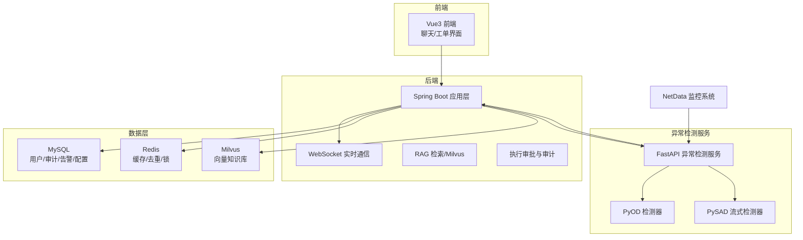
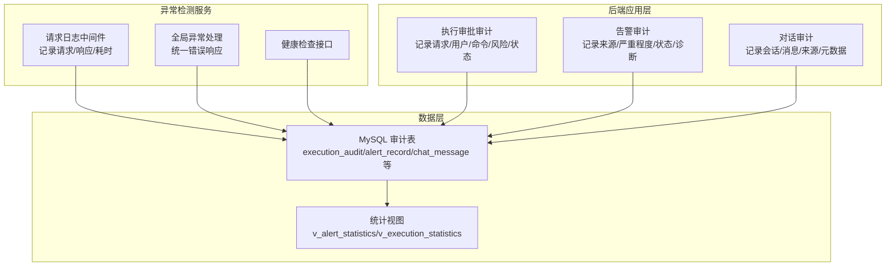
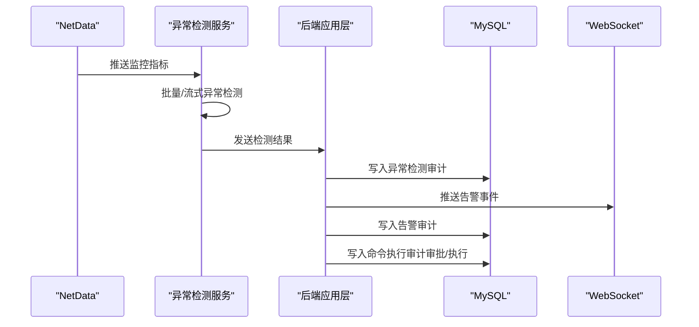
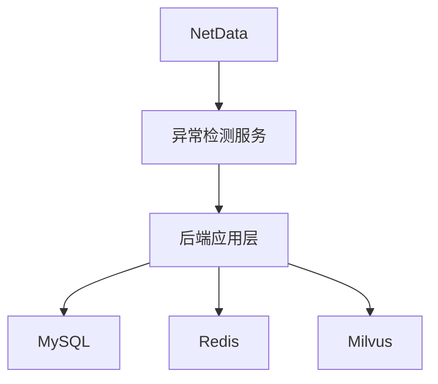

# 审计追踪监控

<cite>
**本文引用的文件**
- [PROJECT_CONTEXT.md](file://PROJECT_CONTEXT.md)
- [开题报告_精简版.md](file://开题报告_精简版.md)
- [docker-compose.yml](file://docker-compose.yml)
- [sql/init.sql](file://sql/init.sql)
- [config/milvus_collection.yaml](file://config/milvus_collection.yaml)
- [anomaly-detection-service/app/main.py](file://anomaly-detection-service/app/main.py)
- [anomaly-detection-service/app/api/routes/detection.py](file://anomaly-detection-service/app/api/routes/detection.py)
- [anomaly-detection-service/app/services/detection_service.py](file://anomaly-detection-service/app/services/detection_service.py)
- [anomaly-detection-service/app/models/schemas.py](file://anomaly-detection-service/app/models/schemas.py)
- [anomaly-detection-service/app/core/pyod_detector.py](file://anomaly-detection-service/app/core/pyod_detector.py)
</cite>

## 目录
1. [简介](#简介)
2. [项目结构](#项目结构)
3. [核心组件](#核心组件)
4. [架构总览](#架构总览)
5. [详细组件分析](#详细组件分析)
6. [依赖分析](#依赖分析)
7. [性能考虑](#性能考虑)
8. [故障排查指南](#故障排查指南)
9. [结论](#结论)
10. [附录](#附录)

## 简介
本文件面向“面向 NetData 监控数据的智能运维问答与执行系统”，聚焦审计追踪监控的设计与实施。文档围绕以下目标展开：
- 明确审计日志的格式规范与必须记录的事件类型
- 规定审计日志的存储策略与保留期限管理
- 提供审计日志的实时监控与异常检测机制
- 给出审计日志的查询接口与分析工具
- 提供审计合规性检查与审计报告生成的方法

系统采用 Java Spring Boot 后端、Python 异常检测服务、MySQL、Redis、Milvus 等技术栈，结合 NetData 的高频监控数据，构建从异常检测到运维执行的闭环，并在关键节点引入审计日志以满足合规与可追溯需求。

## 项目结构
系统采用多模块架构，包含：
- 后端服务（Spring Boot）：负责业务逻辑、RAG、Agent 协同、WebSocket 实时通信、命令执行与审批
- 异常检测服务（FastAPI + PyOD/PySAD）：负责异常检测、流式/批量检测、与后端交互
- 数据层：MySQL（用户、命令执行审计、告警、异常检测结果、系统配置）、Redis（缓存、去重、锁）、Milvus（向量知识库）
- 前端：Vue3 + Element Plus，提供聊天与运维工单界面

图表来源
- [docker-compose.yml:1-357](file://docker-compose.yml#L1-L357)
- [PROJECT_CONTEXT.md:120-149](file://PROJECT_CONTEXT.md#L120-L149)

章节来源
- [PROJECT_CONTEXT.md:16-166](file://PROJECT_CONTEXT.md#L16-L166)
- [docker-compose.yml:23-357](file://docker-compose.yml#L23-L357)

## 核心组件
- 命令执行审计表：记录执行请求、用户、命令、风险等级、审批状态、执行结果、耗时与时间戳，支撑合规审计与责任追溯
- 告警记录表：记录告警来源、严重程度、指标、阈值、状态、诊断结果与解决时间，支撑故障闭环与统计分析
- 异常检测结果表：记录检测器类型、指标、值、异常分数、是否异常与检测时间，支撑异常溯源与趋势分析
- 系统配置表：集中管理 LLM、RAG、执行审批等关键配置，支撑审计配置变更的可追溯
- MySQL 初始化脚本：定义上述表结构与统计视图，提供审计查询与分析基础

章节来源
- [sql/init.sql:112-274](file://sql/init.sql#L112-L274)

## 架构总览
审计贯穿系统的关键环节：
- 异常检测服务：记录请求日志、处理耗时、异常处理与健康检查
- 后端应用层：在执行审批、命令生成、对话记录等关键路径插入审计日志
- 数据层：MySQL 存储结构化审计数据，支持查询、统计与报表

图表来源
- [anomaly-detection-service/app/main.py:118-172](file://anomaly-detection-service/app/main.py#L118-L172)
- [sql/init.sql:112-274](file://sql/init.sql#L112-L274)

## 详细组件分析

### 审计日志格式规范
为确保审计日志的一致性与可查询性，建议统一以下字段规范（以表格形式呈现，便于映射到实际表结构）：

- 基础字段
  - 审计ID：自增主键
  - 请求ID：用于关联一次完整的操作链路
  - 时间戳：创建时间、更新时间
  - 操作类型：事件类别（如命令执行、告警、对话、异常检测等）
  - 操作主体：用户ID、角色、IP地址（可选）
  - 操作客体：目标主机、指标、命令、会话ID等
  - 操作结果：状态（成功/失败/进行中）、错误信息、耗时
  - 上下文信息：风险等级、阈值、检测分数、来源系统等

- 命令执行审计（execution_audit）
  - 关键字段：request_id、user_id、command、command_type、target_host、risk_level、status、approver_id、approved_at、execution_result、error_message、execution_time_ms
  - 用途：合规审计、责任追溯、风险评估

- 告警审计（alert_record）
  - 关键字段：alert_id、source、severity、alert_name、message、host、metric_name、metric_value、threshold、status、diagnosis_result、resolved_at
  - 用途：故障闭环、SLA 统计、根因分析

- 对话审计（chat_message）
  - 关键字段：conversation_id、role、content、tokens、sources、metadata
  - 用途：知识沉淀、对话溯源、合规审查

- 异常检测审计（anomaly_detection）
  - 关键字段：host、metric_name、metric_value、anomaly_score、is_anomaly、detector_type、detection_time
  - 用途：异常溯源、趋势分析、模型效果评估

章节来源
- [sql/init.sql:112-217](file://sql/init.sql#L112-L217)

### 必须记录的事件类型
- 命令执行事件
  - 触发：用户提交执行请求
  - 记录：请求ID、用户、命令、目标主机、风险等级、初始状态
  - 变更：审批通过/拒绝、执行中、完成/失败、耗时、结果
- 告警事件
  - 触发：异常检测或外部系统告警
  - 记录：告警ID、来源、严重程度、指标、阈值、状态、诊断、解决时间
- 对话事件
  - 触发：用户发起对话、Agent 生成回答
  - 记录：会话ID、消息、来源、引用、元数据
- 异常检测事件
  - 触发：批量/流式检测完成
  - 记录：检测器类型、指标、值、异常分数、是否异常、检测时间
- 系统配置变更事件
  - 触发：LLM、RAG、执行策略等配置更新
  - 记录：配置键、旧值、新值、变更人、时间

章节来源
- [sql/init.sql:112-244](file://sql/init.sql#L112-L244)

### 审计日志存储策略与保留期限
- 存储介质
  - 结构化审计数据：MySQL（用户、命令执行、告警、异常检测、系统配置）
  - 向量知识库：Milvus（用于检索增强，不直接作为审计存储）
  - 缓存与去重：Redis（实时告警去重、会话缓存）
- 保留期限
  - 建议按法规与业务需求设定保留周期（如 90/180/365 天），到期后安全删除或归档
  - 可结合 MySQL TTL（如启用）与外部归档策略实现自动化
- 索引与分区
  - 为审计表建立常用过滤字段索引（user_id、status、risk_level、created_at）
  - 可按时间分区（如按月）提升查询与归档效率

章节来源
- [config/milvus_collection.yaml:155-162](file://config/milvus_collection.yaml#L155-L162)
- [sql/init.sql:112-138](file://sql/init.sql#L112-L138)

### 实时监控与异常检测机制
- 异常检测服务日志
  - 请求日志中间件：记录请求/响应与处理耗时，便于性能与可用性监控
  - 全局异常处理：统一错误响应，记录异常堆栈，支持快速定位
  - 健康检查接口：对外暴露健康状态，便于运维监控
- 后端应用层审计
  - 在执行审批、命令生成、对话记录等关键路径插入审计日志
  - 通过 WebSocket 推送审计事件至前端，实现实时告警与可视化
- 异常检测结果审计
  - 将检测器类型、异常分数、是否异常、检测时间写入异常检测表，支撑趋势分析与模型评估

图表来源
- [anomaly-detection-service/app/main.py:118-172](file://anomaly-detection-service/app/main.py#L118-L172)
- [anomaly-detection-service/app/api/routes/detection.py:55-378](file://anomaly-detection-service/app/api/routes/detection.py#L55-L378)
- [sql/init.sql:112-217](file://sql/init.sql#L112-L217)

章节来源
- [anomaly-detection-service/app/main.py:118-172](file://anomaly-detection-service/app/main.py#L118-L172)
- [anomaly-detection-service/app/api/routes/detection.py:55-378](file://anomaly-detection-service/app/api/routes/detection.py#L55-L378)

### 查询接口与分析工具
- 命令执行审计查询
  - 接口：按用户、状态、风险等级、时间段过滤
  - 统计：成功率、平均耗时、高风险命令占比
- 告警审计查询
  - 接口：按严重程度、状态、指标、时间段过滤
  - 统计：告警总量、解决时长、恢复率
- 对话审计查询
  - 接口：按会话ID、用户、时间范围过滤
  - 统计：对话数量、引用来源、Token 消耗
- 异常检测审计查询
  - 接口：按检测器类型、指标、时间段过滤
  - 统计：异常占比、平均分数、检测耗时
- 分析视图
  - v_alert_statistics：按日期与严重程度聚合
  - v_execution_statistics：按日期与风险等级聚合

章节来源
- [sql/init.sql:249-274](file://sql/init.sql#L249-L274)

### 审计合规性检查与报告生成
- 合规性检查
  - 审计范围：命令执行、告警处理、对话记录、异常检测、配置变更
  - 关键指标：审批覆盖率、高风险命令执行审批率、告警平均解决时长、异常检测准确率
  - 合规要求：最小可见性、不可抵赖、可追溯、可审计
- 报告生成
  - 周报/月报：汇总命令执行、告警、异常检测统计
  - 专项报告：高风险命令复盘、根因分析、整改建议
  - 导出：CSV/Excel，支持审计部门审阅

章节来源
- [开题报告_精简版.md:305-322](file://开题报告_精简版.md#L305-L322)

## 依赖分析
- 组件耦合
  - 异常检测服务与后端应用层通过 REST API 交互，日志与异常处理统一
  - 后端应用层依赖 MySQL（审计存储）、Redis（缓存/去重）、Milvus（RAG）
- 外部依赖
  - NetData 提供监控数据源
  - Docker Compose 统一编排基础服务

图表来源
- [docker-compose.yml:23-357](file://docker-compose.yml#L23-L357)

章节来源
- [docker-compose.yml:23-357](file://docker-compose.yml#L23-L357)

## 性能考虑
- 日志写入
  - 异常检测服务采用异步日志记录，避免阻塞请求处理
  - 后端应用层审计采用批量写入与异步推送，降低对主流程影响
- 查询性能
  - 为审计表建立合适索引，避免全表扫描
  - 使用统计视图减少复杂查询成本
- 存储与归档
  - 按时间分区与保留策略，定期归档历史数据
  - 控制审计字段长度与冗余，降低存储压力

## 故障排查指南
- 异常检测服务
  - 请求日志中间件：定位慢请求与错误请求
  - 全局异常处理：统一错误响应，便于前端与监控系统识别
  - 健康检查：确认服务可用性
- 后端应用层
  - 审计日志缺失：检查审计埋点是否覆盖关键路径
  - 审计查询缓慢：检查索引与 SQL 优化
- 数据层
  - MySQL 告警：检查连接数、慢查询日志
  - Redis 告警：检查内存与过期策略

章节来源
- [anomaly-detection-service/app/main.py:118-172](file://anomaly-detection-service/app/main.py#L118-L172)
- [sql/init.sql:112-274](file://sql/init.sql#L112-L274)

## 结论
通过在异常检测、命令执行、告警处理、对话记录等关键路径引入结构化的审计日志，并结合 MySQL 存储、Redis 缓存与 Milvus 检索，系统能够实现从异常检测到运维执行的全流程审计与合规保障。配合统一的日志格式、查询接口与统计视图，可进一步支撑运营分析与审计报告生成，满足企业级智能运维的合规与可追溯需求。

## 附录
- 术语
  - 审计日志：记录系统关键事件的时间戳、主体、客体与结果
  - 合规审计：依据法规与内部政策对系统行为进行审查
  - 统计视图：基于审计数据的聚合视图，支持报表与分析
- 参考
  - 项目上下文与技术栈：[PROJECT_CONTEXT.md](file://PROJECT_CONTEXT.md)
  - 系统架构与模块说明：[开题报告_精简版.md](file://开题报告_精简版.md)
  - 服务编排与依赖：[docker-compose.yml](file://docker-compose.yml)
  - 审计表结构与统计视图：[sql/init.sql](file://sql/init.sql)
  - 向量集合配置（知识库）：[config/milvus_collection.yaml](file://config/milvus_collection.yaml)
  - 异常检测服务入口与中间件：[anomaly-detection-service/app/main.py](file://anomaly-detection-service/app/main.py)
  - 异常检测路由与模型定义：[anomaly-detection-service/app/api/routes/detection.py](file://anomaly-detection-service/app/api/routes/detection.py)
  - 检测服务与模型封装：[anomaly-detection-service/app/services/detection_service.py](file://anomaly-detection-service/app/services/detection_service.py)
  - PyOD 检测器实现：[anomaly-detection-service/app/core/pyod_detector.py](file://anomaly-detection-service/app/core/pyod_detector.py)