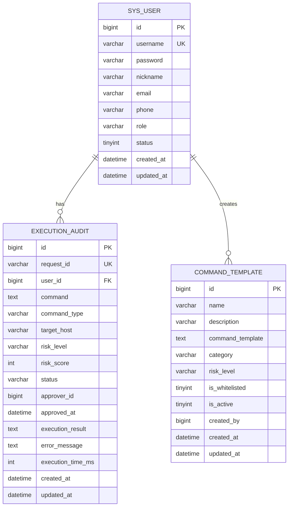
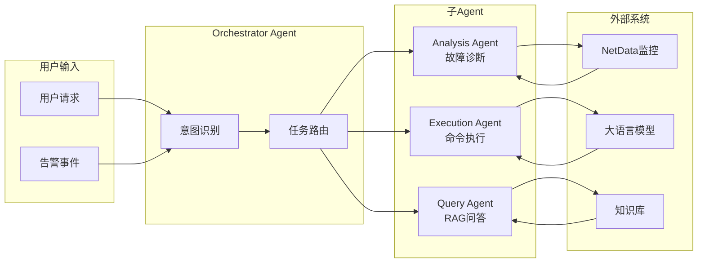
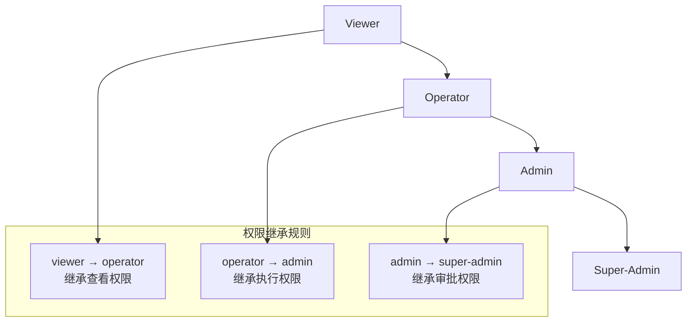
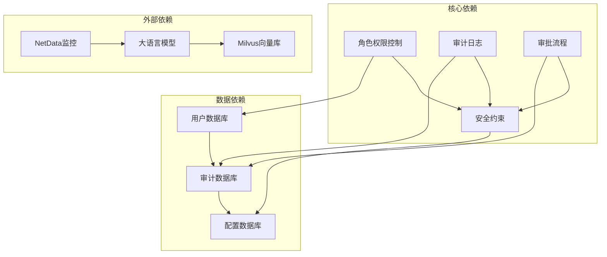

# 角色权限矩阵

<cite>
**本文档引用的文件**
- [init.sql](file://sql/init.sql)
- [shared-safety-constraints.md](file://docs/prompts/shared-safety-constraints.md)
- [execution-agent-system-prompt.md](file://docs/prompts/execution-agent-system-prompt.md)
- [docker-compose.yml](file://docker-compose.yml)
- [PROJECT_CONTEXT.md](file://PROJECT_CONTEXT.md)
</cite>

## 目录
1. [简介](#简介)
2. [项目结构](#项目结构)
3. [核心组件](#核心组件)
4. [架构概览](#架构概览)
5. [详细组件分析](#详细组件分析)
6. [依赖关系分析](#依赖关系分析)
7. [性能考虑](#性能考虑)
8. [故障排除指南](#故障排除指南)
9. [结论](#结论)

## 简介

本文档为智能运维系统创建了完整的角色权限矩阵，详细说明了系统中各个角色的定义和职责，包括viewer、operator、admin等角色的权限范围。解释了权限继承关系和权限组合规则，提供了角色权限分配的最佳实践和权限最小化原则的应用。

## 项目结构

智能运维系统采用多层架构设计，结合多Agent协同的工作模式，实现感知-分析-决策的闭环自动化运维流程。

```mermaid
graph TB
subgraph "前端层"
UI[用户界面<br/>微信/企业微信]
Chat[聊天界面]
Dashboard[运维仪表板]
end
subgraph "应用层"
Orchestrator[Orchestrator Agent<br/>任务路由]
QueryAgent[Query Agent<br/>RAG问答]
AnalysisAgent[Analysis Agent<br/>故障诊断]
ExecutionAgent[Execution Agent<br/>命令执行]
end
subgraph "数据层"
MySQL[(MySQL)<br/>用户管理]
Milvus[(Milvus)<br/>知识库]
Redis[(Redis)<br/>缓存]
Neo4j[(Neo4j)<br/>知识图谱]
end
subgraph "基础设施"
NetData[NetData监控]
Ollama[LLM推理]
PythonServices[Python服务]
end
UI --> Orchestrator
Orchestrator --> QueryAgent
Orchestrator --> AnalysisAgent
Orchestrator --> ExecutionAgent
QueryAgent --> Milvus
AnalysisAgent --> MySQL
ExecutionAgent --> MySQL
ExecutionAgent --> Redis
NetData --> PythonServices
PythonServices --> MySQL
PythonServices --> Milvus
Ollama --> QueryAgent
```

**图表来源**
- [docker-compose.yml:23-357](file://docker-compose.yml#L23-L357)
- [PROJECT_CONTEXT.md:120-149](file://PROJECT_CONTEXT.md#L120-L149)

**章节来源**
- [PROJECT_CONTEXT.md:1-166](file://PROJECT_CONTEXT.md#L1-L166)
- [docker-compose.yml:1-357](file://docker-compose.yml#L1-L357)

## 核心组件

### 用户管理系统

系统采用基于角色的访问控制（RBAC）模型，用户表定义了角色字段和状态管理。



**图表来源**
- [init.sql:26-41](file://init.sql#L26-L41)
- [init.sql:115-138](file://init.sql#L115-L138)
- [init.sql:144-159](file://init.sql#L144-L159)

**章节来源**
- [init.sql:25-170](file://init.sql#L25-L170)

### 审批流程系统

系统实现了多层级的审批流程，根据命令的风险等级自动路由到相应的审批人。

```mermaid
flowchart TD
Start([收到命令请求]) --> BlacklistCheck["黑名单检查"]
BlacklistCheck --> IsBlacklisted{"是否在黑名单?"}
IsBlacklisted --> |是| Block["拒绝执行"]
IsBlacklisted --> |否| WhitelistCheck["白名单检查"]
WhitelistCheck --> IsWhitelisted{"是否在白名单?"}
IsWhitelisted --> |是| AutoExec["自动执行"]
IsWhitelisted --> |否| RiskAssessment["风险评估"]
RiskAssessment --> ScoreCalc["计算风险分数<br/>1-10分"]
ScoreCalc --> RiskLevel{"风险等级"}
RiskLevel --> |LOW (1-3)| AutoExec
RiskLevel --> |MEDIUM (4-6)| PendingApproval["等待审批"]
RiskLevel --> |HIGH (7-8)| DoubleApproval["双重审批"]
RiskLevel --> |CRITICAL (9-10)| Block
PendingApproval --> Approve{"审批通过?"}
Approve --> |是| ExecCmd["执行命令"]
Approve --> |否| NotifyUser["通知用户"]
DoubleApproval --> Approve1["一级审批"]
DoubleApproval --> Approve2["二级审批"]
Approve1 --> Approve2
Approve2 --> ExecCmd
AutoExec --> LogAudit["记录审计日志"]
ExecCmd --> LogAudit
Block --> LogAudit
NotifyUser --> LogAudit
LogAudit --> End([流程结束])
```

**图表来源**
- [execution-agent-system-prompt.md:62-95](file://execution-agent-system-prompt.md#L62-L95)
- [execution-agent-system-prompt.md:101-118](file://execution-agent-system-prompt.md#L101-L118)

**章节来源**
- [execution-agent-system-prompt.md:1-377](file://execution-agent-system-prompt.md#L1-L377)

## 架构概览

系统采用Orchestrator-Subagent模式，实现多Agent协同的智能运维平台。



**图表来源**
- [PROJECT_CONTEXT.md:47-55](file://PROJECT_CONTEXT.md#L47-L55)

**章节来源**
- [PROJECT_CONTEXT.md:43-61](file://PROJECT_CONTEXT.md#L43-L61)

## 详细组件分析

### 角色权限矩阵

系统定义了四种角色，每种角色具有不同的权限范围和职责。

| 角色 | 权限范围 | 职责描述 | 审批权限 |
|------|----------|----------|----------|
| **viewer** | 知识问答、故障诊断 | 只能查看和查询信息，无法执行任何操作 | ❌ 无审批权限 |
| **operator** | 知识问答、故障诊断、自动执行命令 | 可以执行低风险命令，需要审批中高风险命令 | ✅ 审批中风险命令 |
| **admin** | 知识问答、故障诊断、自动执行命令、审批执行命令 | 可以审批所有命令，包括高风险命令 | ✅ 审批高风险命令 |
| **super-admin** | 所有权限 + 越权审批 | 拥有最高权限，可以越权审批任何命令 | ✅ 越权审批 |

**章节来源**
- [shared-safety-constraints.md:235-244](file://shared-safety-constraints.md#L235-L244)

### 权限继承关系



**图表来源**
- [shared-safety-constraints.md:235-244](file://shared-safety-constraints.md#L235-L244)

### 命令分类与风险等级

系统将命令分为三个类别，每个类别对应不同的风险等级和处理方式：

#### 黑名单（绝对禁止）
- 系统销毁：`rm -rf /`, `mkfs`, `dd if=/dev/zero`
- 权限提升：`chmod 777 /`, `chown -R root /`
- 网络开放：`iptables -F`, 打开所有端口
- 密码操作：修改root密码、删除用户
- 内核操作：`sysctl` 修改核心参数
- 关机重启：`shutdown`, `reboot`, `init 0/6`

#### 白名单（可自动执行）
- 信息查询：`top`, `ps aux`, `netstat -tlnp`
- 日志查看：`tail -f`, `grep`, `journalctl`
- 服务查询：`systemctl status`, `docker ps`
- 磁盘清理：`rm -rf /tmp/*`, 清理临时文件
- 服务重启：`systemctl restart nginx`
- 磁盘空间：`df -h`, `du -sh`
- 内存查看：`free -m`, `vmstat`

#### 灰名单（需人工审批）
- 服务启停：`systemctl stop`, `docker restart`
- 配置修改：修改配置文件、环境变量
- 网络操作：修改防火墙规则、路由
- 数据操作：数据库命令、文件移动
- 进程操作：`kill -9`, `pkill`

**章节来源**
- [execution-agent-system-prompt.md:19-57](file://execution-agent-system-prompt.md#L19-L57)

### 风险评估算法

系统使用加权评分算法对命令进行风险评估，总分范围1-10分。

| 评估维度 | 权重 | 评分标准 | 风险等级 |
|----------|------|----------|----------|
| **命令类型** | 40% | 删除(10)、修改(7)、查询(2)、只读(1) | 1-3: LOW<br/>4-6: MEDIUM<br/>7-8: HIGH<br/>9-10: CRITICAL |
| **影响范围** | 30% | 全局(10)、单机(7)、单服务(4)、单文件(2) | |
| **可逆性** | 20% | 不可逆(10)、难恢复(7)、可恢复(3)、易恢复(1) | |
| **执行频率** | 10% | 首次(10)、罕见(7)、偶尔(4)、频繁(1) | |

**章节来源**
- [execution-agent-system-prompt.md:99-118](file://execution-agent-system-prompt.md#L99-L118)

## 依赖关系分析



**图表来源**
- [init.sql:26-41](file://init.sql#L26-L41)
- [init.sql:115-138](file://init.sql#L115-L138)
- [init.sql:223-233](file://init.sql#L223-L233)

**章节来源**
- [init.sql:1-274](file://init.sql#L1-L274)

## 性能考虑

### 权限检查优化

系统通过数据库索引优化权限检查性能：

- 用户表：按角色建立索引，支持快速权限查询
- 审计表：按状态、风险等级建立复合索引，支持快速统计
- 配置表：按配置键建立唯一索引，支持快速配置读取

### 审批流程优化

- 异步审批：审批请求异步处理，避免阻塞用户操作
- 批量处理：支持批量命令审批，提高处理效率
- 缓存机制：热门命令模板和配置缓存，减少数据库访问

## 故障排除指南

### 常见权限问题

1. **权限不足错误**
   - 检查用户角色是否正确
   - 验证命令是否在用户权限范围内
   - 确认审批流程是否完成

2. **审批超时**
   - 检查审批人是否在线
   - 验证审批超时配置
   - 确认审批流程是否被阻塞

3. **审计日志缺失**
   - 检查审计表连接状态
   - 验证日志记录配置
   - 确认数据库权限设置

**章节来源**
- [shared-safety-constraints.md:326-356](file://shared-safety-constraints.md#L326-L356)

## 结论

智能运维系统的角色权限矩阵设计遵循了最小权限原则和纵深防御策略，通过多层级的权限控制和审批流程，确保了系统的安全性和可控性。系统的核心特点包括：

1. **清晰的角色定义**：viewer、operator、admin、super-admin四个角色层次分明
2. **严格的权限控制**：基于命令类型的黑白灰名单机制
3. **完善的审批流程**：根据风险等级自动路由到相应审批人
4. **全面的审计日志**：记录所有操作的完整生命周期
5. **灵活的配置管理**：支持动态调整权限和安全策略

该权限矩阵为系统的安全运营提供了坚实的基础，既保证了运维效率，又确保了操作的安全性。