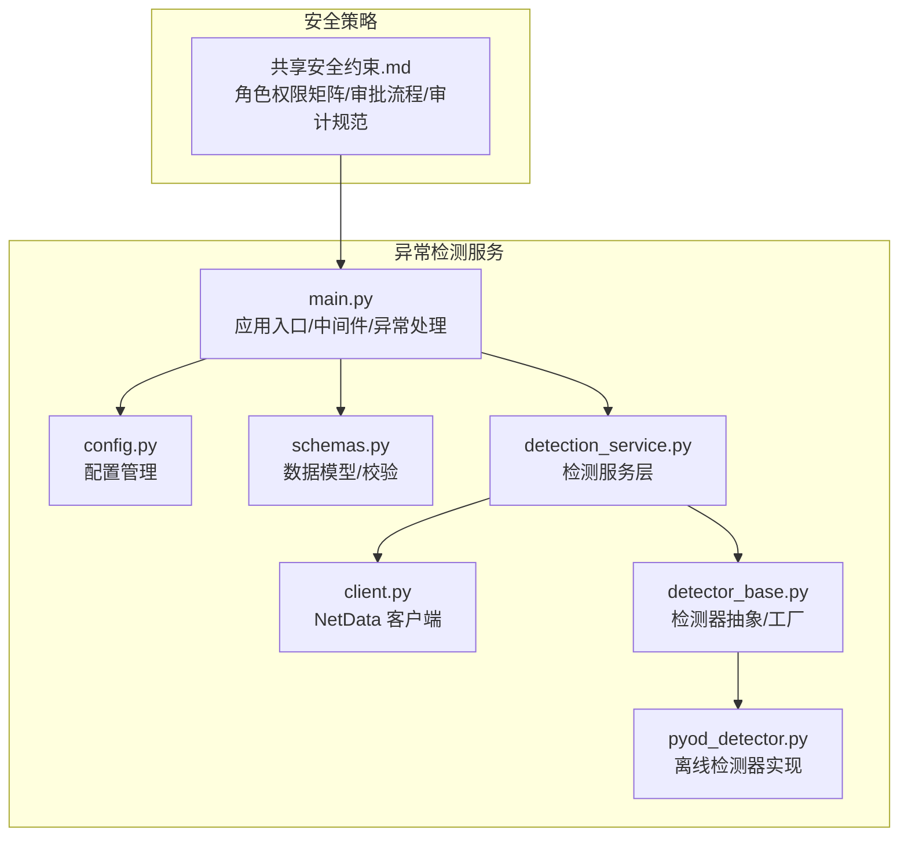
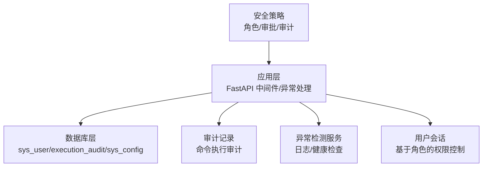
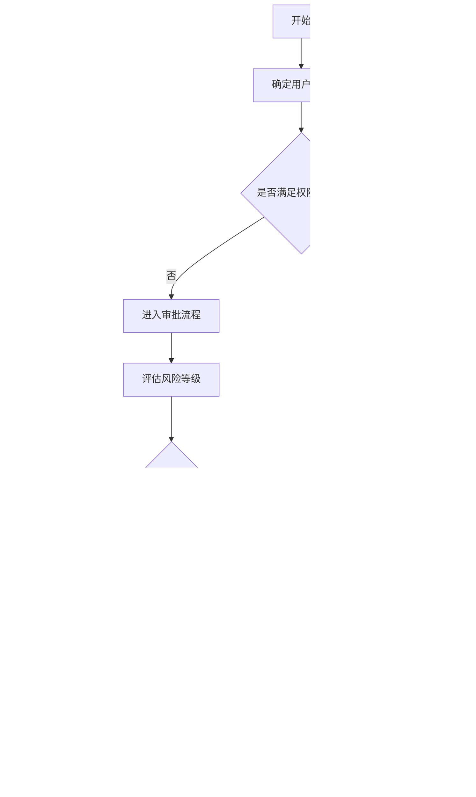
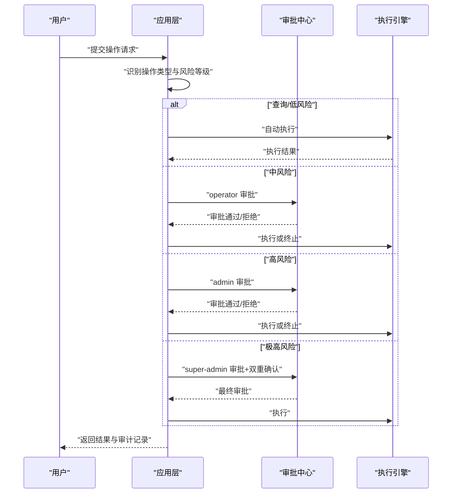
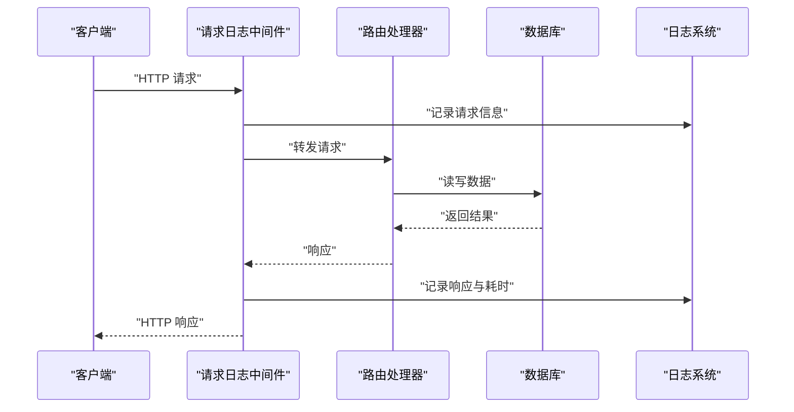
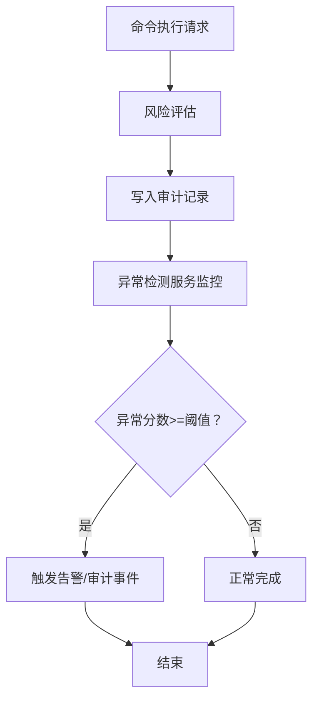
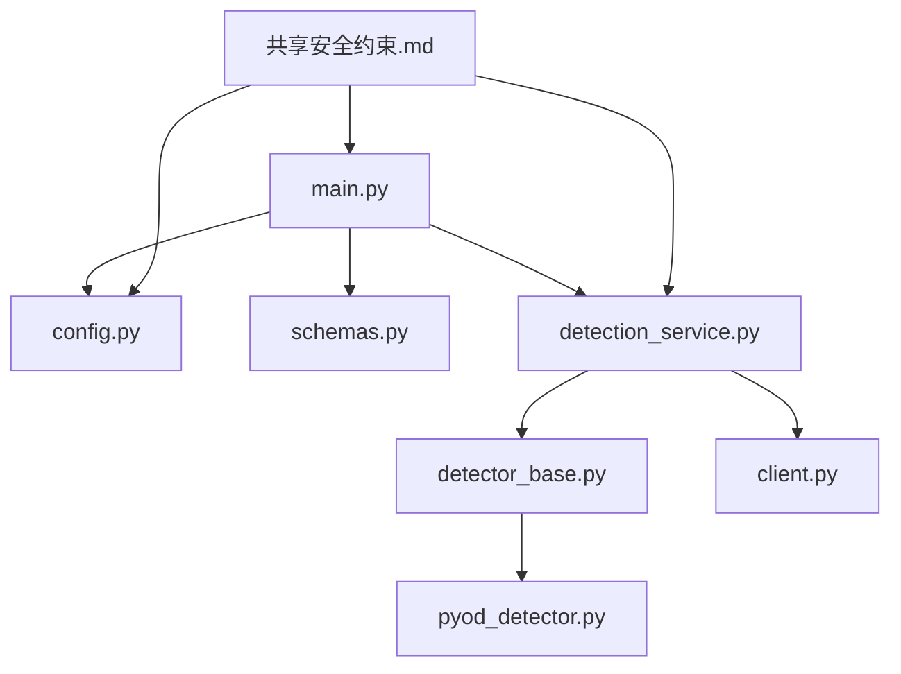

# 访问控制管理

<cite>
**本文档引用的文件**
- [共享安全约束.md](file://docs/prompts/shared-safety-constraints.md)
- [init.sql](file://sql/init.sql)
- [main.py](file://anomaly-detection-service/app/main.py)
- [config.py](file://anomaly-detection-service/app/config.py)
- [schemas.py](file://anomaly-detection-service/app/models/schemas.py)
- [detection_service.py](file://anomaly-detection-service/app/services/detection_service.py)
- [client.py](file://anomaly-detection-service/app/netdata/client.py)
- [detector_base.py](file://anomaly-detection-service/app/core/detector_base.py)
- [pyod_detector.py](file://anomaly-detection-service/app/core/pyod_detector.py)
</cite>

## 目录
1. [简介](#简介)
2. [项目结构](#项目结构)
3. [核心组件](#核心组件)
4. [架构总览](#架构总览)
5. [详细组件分析](#详细组件分析)
6. [依赖分析](#依赖分析)
7. [性能考虑](#性能考虑)
8. [故障排查指南](#故障排查指南)
9. [结论](#结论)
10. [附录](#附录)

## 简介
本文件面向智能运维系统中的访问控制管理，围绕角色权限矩阵、操作审批流程、身份认证与授权、权限验证、权限审计与异常检测等方面进行系统化说明。文档以仓库中现有的安全约束文档、数据库初始化脚本以及异常检测服务代码为基础，结合运维场景对访问控制进行落地设计与实现指导。

## 项目结构
本项目包含两部分与访问控制密切相关的内容：
- 安全约束与权限策略：位于 docs/prompts/shared-safety-constraints.md，定义了角色权限矩阵、审批流程、审计日志规范等。
- 异常检测服务：位于 anomaly-detection-service/，提供基于 PyOD/PySAD 的异常检测能力，具备中间件、异常处理、配置管理等通用安全实践，可作为访问控制的基础设施支撑。



**图表来源**
- [共享安全约束.md:1-396](file://docs/prompts/shared-safety-constraints.md#L1-L396)
- [main.py:1-217](file://anomaly-detection-service/app/main.py#L1-L217)
- [config.py:1-183](file://anomaly-detection-service/app/config.py#L1-L183)
- [schemas.py:1-329](file://anomaly-detection-service/app/models/schemas.py#L1-L329)
- [detection_service.py:1-334](file://anomaly-detection-service/app/services/detection_service.py#L1-L334)
- [client.py:1-301](file://anomaly-detection-service/app/netdata/client.py#L1-L301)
- [detector_base.py:1-339](file://anomaly-detection-service/app/core/detector_base.py#L1-L339)
- [pyod_detector.py:1-287](file://anomaly-detection-service/app/core/pyod_detector.py#L1-L287)

**章节来源**
- [共享安全约束.md:1-396](file://docs/prompts/shared-safety-constraints.md#L1-L396)
- [main.py:1-217](file://anomaly-detection-service/app/main.py#L1-L217)

## 核心组件
- 角色权限矩阵与审批流程：由安全约束文档定义，明确 viewer、operator、admin、super-admin 的权限边界与越权审批机制。
- 用户与会话：数据库初始化脚本定义了 sys_user 表，包含角色字段 role，支持基于角色的权限控制；会话管理可结合应用中间件实现。
- 权限验证：通过 FastAPI 中间件与异常处理机制，统一拦截与记录权限相关事件。
- 审计与异常检测：执行审计表 execution_audit 记录命令执行全过程；异常检测服务提供日志与健康检查能力，辅助访问控制的可观测性。

**章节来源**
- [共享安全约束.md:233-324](file://docs/prompts/shared-safety-constraints.md#L233-L324)
- [init.sql:22-41](file://sql/init.sql#L22-L41)
- [main.py:118-172](file://anomaly-detection-service/app/main.py#L118-L172)
- [init.sql:112-138](file://sql/init.sql#L112-L138)

## 架构总览
下图展示了访问控制在系统中的位置与交互关系：安全策略定义权限与审批，应用层通过中间件与异常处理实现权限验证与审计，数据库层存储用户、命令审计与配置，异常检测服务提供可观测性支撑。



**图表来源**
- [共享安全约束.md:233-324](file://docs/prompts/shared-safety-constraints.md#L233-L324)
- [main.py:118-172](file://anomaly-detection-service/app/main.py#L118-L172)
- [init.sql:22-41](file://sql/init.sql#L22-L41)
- [init.sql:112-138](file://sql/init.sql#L112-L138)

## 详细组件分析

### 角色权限矩阵与越权审批
- 角色定义：viewer、operator、admin、super-admin。
- 权限分配：知识问答、故障诊断、自动执行命令、审批执行命令四类操作按角色开放。
- 越权审批：super-admin 拥有“越权审批”能力，可在极高风险操作场景下进行双重确认。



**图表来源**
- [共享安全约束.md:233-258](file://docs/prompts/shared-safety-constraints.md#L233-L258)

**章节来源**
- [共享安全约束.md:233-258](file://docs/prompts/shared-safety-constraints.md#L233-L258)

### 操作审批流程与条件
- 查询类操作：直接执行。
- 低风险操作：自动执行。
- 中风险操作：operator 审批。
- 高风险操作：admin 审批。
- 极高风险操作：super-admin 审批 + 双重确认。



**图表来源**
- [共享安全约束.md:244-258](file://docs/prompts/shared-safety-constraints.md#L244-L258)

**章节来源**
- [共享安全约束.md:244-258](file://docs/prompts/shared-safety-constraints.md#L244-L258)

### 用户身份认证与授权机制
- 认证：sys_user 表包含 username/password/nickname/email/phone/role/status 等字段，支持 BCrypt 密码存储与角色字段。
- 授权：基于角色的权限控制，结合应用中间件实现统一鉴权与审计。
- 会话管理：可通过 FastAPI 中间件实现会话跟踪与超时控制。

```mermaid
classDiagram
class SysUser {
+bigint id
+string username
+string password
+string nickname
+string email
+string phone
+string role
+tinyint status
+datetime created_at
+datetime updated_at
}
class ExecutionAudit {
+bigint id
+string request_id
+bigint user_id
+text command
+string command_type
+string target_host
+string risk_level
+int risk_score
+string status
+bigint approver_id
+datetime approved_at
+text execution_result
+text error_message
+int execution_time_ms
+datetime created_at
+datetime updated_at
}
class SysConfig {
+bigint id
+string config_key
+text config_value
+string config_type
+string description
+bigint updated_by
+datetime updated_at
}
SysUser ||--o{ ExecutionAudit : "产生"
SysConfig --> ExecutionAudit : "配置审批策略"
```

**图表来源**
- [init.sql:22-41](file://sql/init.sql#L22-L41)
- [init.sql:112-138](file://sql/init.sql#L112-L138)
- [init.sql:220-233](file://sql/init.sql#L220-L233)

**章节来源**
- [init.sql:22-41](file://sql/init.sql#L22-L41)
- [init.sql:112-138](file://sql/init.sql#L112-L138)
- [init.sql:220-233](file://sql/init.sql#L220-L233)

### 权限验证与中间件实现
- 请求日志中间件：记录请求与响应，便于审计与追踪。
- 全局异常处理：统一捕获异常并返回标准化错误信息，避免敏感信息泄露。
- 配置管理：集中管理应用配置，支持环境变量覆盖，保证部署一致性。



**图表来源**
- [main.py:118-139](file://anomaly-detection-service/app/main.py#L118-L139)
- [config.py:1-183](file://anomaly-detection-service/app/config.py#L1-L183)

**章节来源**
- [main.py:118-172](file://anomaly-detection-service/app/main.py#L118-L172)
- [config.py:1-183](file://anomaly-detection-service/app/config.py#L1-L183)

### 权限审计与异常检测
- 审计日志：execution_audit 记录命令执行全过程，包含风险等级、审批人、执行结果与耗时等。
- 审计规范：日志格式与事件清单由安全约束文档定义，确保可追溯性与合规性。
- 异常检测：异常检测服务提供健康检查、日志记录与阈值判断，辅助识别访问控制异常与系统风险。



**图表来源**
- [shared-safety-constraints.md:296-324](file://docs/prompts/shared-safety-constraints.md#L296-L324)
- [init.sql:112-138](file://sql/init.sql#L112-L138)
- [detection_service.py:76-118](file://anomaly-detection-service/app/services/detection_service.py#L76-L118)

**章节来源**
- [shared-safety-constraints.md:296-324](file://docs/prompts/shared-safety-constraints.md#L296-L324)
- [init.sql:112-138](file://sql/init.sql#L112-L138)
- [detection_service.py:76-118](file://anomaly-detection-service/app/services/detection_service.py#L76-L118)

## 依赖分析
- 应用层依赖：main.py 依赖 config.py 进行配置加载，依赖 schemas.py 进行数据校验，依赖 detection_service.py 提供检测能力，依赖 client.py 访问 NetData。
- 检测器依赖：detection_service.py 通过工厂模式创建离线/在线检测器，pyod_detector.py 封装 PyOD 算法，detector_base.py 提供抽象与工具。
- 安全策略依赖：共享安全约束文档为角色权限矩阵、审批流程与审计规范提供权威依据。



**图表来源**
- [main.py:1-217](file://anomaly-detection-service/app/main.py#L1-L217)
- [config.py:1-183](file://anomaly-detection-service/app/config.py#L1-L183)
- [schemas.py:1-329](file://anomaly-detection-service/app/models/schemas.py#L1-L329)
- [detection_service.py:1-334](file://anomaly-detection-service/app/services/detection_service.py#L1-L334)
- [detector_base.py:1-339](file://anomaly-detection-service/app/core/detector_base.py#L1-L339)
- [pyod_detector.py:1-287](file://anomaly-detection-service/app/core/pyod_detector.py#L1-L287)
- [client.py:1-301](file://anomaly-detection-service/app/netdata/client.py#L1-L301)
- [共享安全约束.md:1-396](file://docs/prompts/shared-safety-constraints.md#L1-L396)

**章节来源**
- [main.py:1-217](file://anomaly-detection-service/app/main.py#L1-L217)
- [detection_service.py:1-334](file://anomaly-detection-service/app/services/detection_service.py#L1-L334)
- [detector_base.py:1-339](file://anomaly-detection-service/app/core/detector_base.py#L1-L339)
- [pyod_detector.py:1-287](file://anomaly-detection-service/app/core/pyod_detector.py#L1-L287)
- [client.py:1-301](file://anomaly-detection-service/app/netdata/client.py#L1-L301)
- [共享安全约束.md:1-396](file://docs/prompts/shared-safety-constraints.md#L1-L396)

## 性能考虑
- 中间件开销：请求日志中间件与异常处理应避免重复 IO 与昂贵计算，确保低延迟。
- 检测性能：批量检测与流式检测的阈值与算法参数需结合实际数据规模调优，减少异常分数计算与归一化开销。
- 配置缓存：使用 LRU 缓存加载配置，降低重复解析成本。

## 故障排查指南
- 审计缺失：检查 execution_audit 表索引与写入逻辑，确保命令执行全流程被记录。
- 权限异常：通过 sys_user 表与角色字段核对用户权限，结合中间件日志定位越权请求。
- 异常检测误报：调整异常分数阈值与告警阈值，结合历史数据训练离线检测器。
- 服务不可用：利用健康检查接口与日志系统定位网络、数据库或第三方 API（NetData）问题。

**章节来源**
- [init.sql:112-138](file://sql/init.sql#L112-L138)
- [main.py:145-172](file://anomaly-detection-service/app/main.py#L145-L172)
- [config.py:130-146](file://anomaly-detection-service/app/config.py#L130-L146)
- [client.py:250-266](file://anomaly-detection-service/app/netdata/client.py#L250-L266)

## 结论
本访问控制管理文档以安全约束为纲、以数据库与应用层为体，构建了角色权限矩阵、审批流程、身份认证与授权、权限验证、审计与异常检测的完整闭环。通过中间件与异常处理实现统一的安全控制，借助 execution_audit 与异常检测服务提升系统的可观测性与安全性，为智能运维系统的稳定运行提供保障。

## 附录
- 角色权限矩阵（摘自安全约束文档）
  - viewer：知识问答、故障诊断；自动执行命令、审批执行命令 ❌
  - operator/admin：知识问答、故障诊断、自动执行命令、审批执行命令
  - super-admin：同上 + 越权审批
- 审计日志字段（摘自数据库初始化脚本）
  - request_id、user_id、command、command_type、target_host、risk_level、risk_score、status、approver_id、approved_at、execution_result、error_message、execution_time_ms、created_at、updated_at

**章节来源**
- [共享安全约束.md:233-243](file://docs/prompts/shared-safety-constraints.md#L233-L243)
- [init.sql:112-138](file://sql/init.sql#L112-L138)