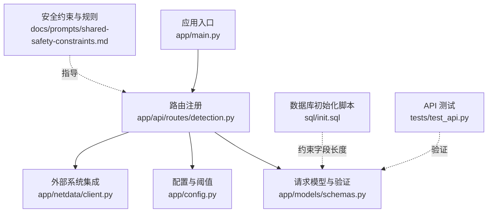
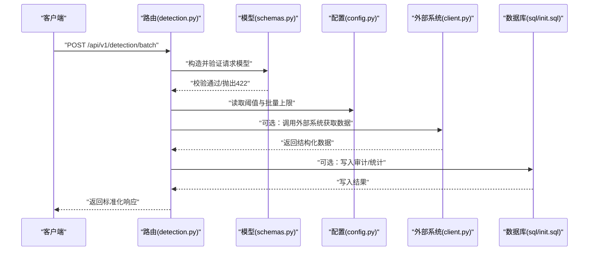
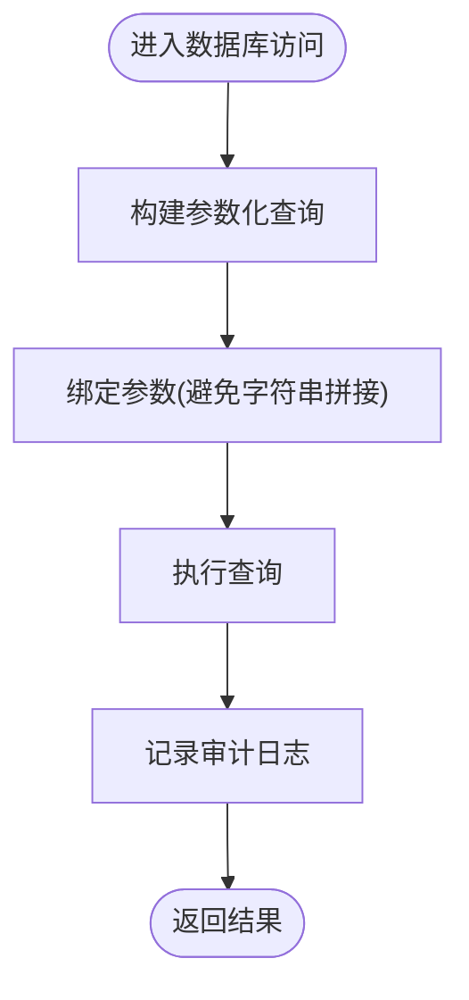
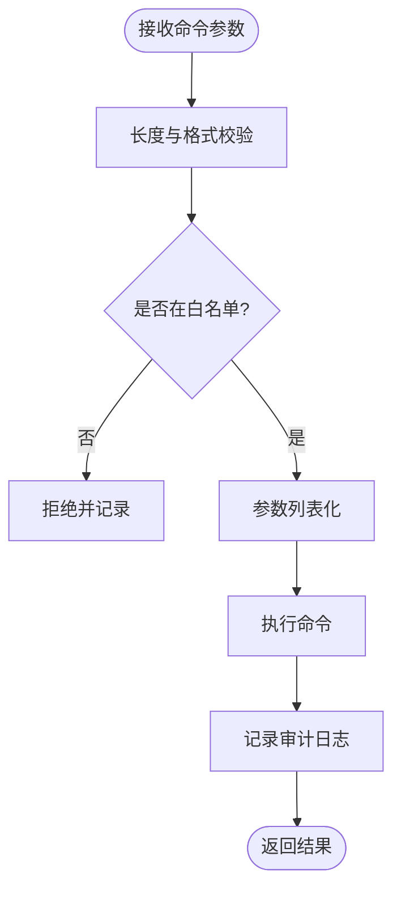
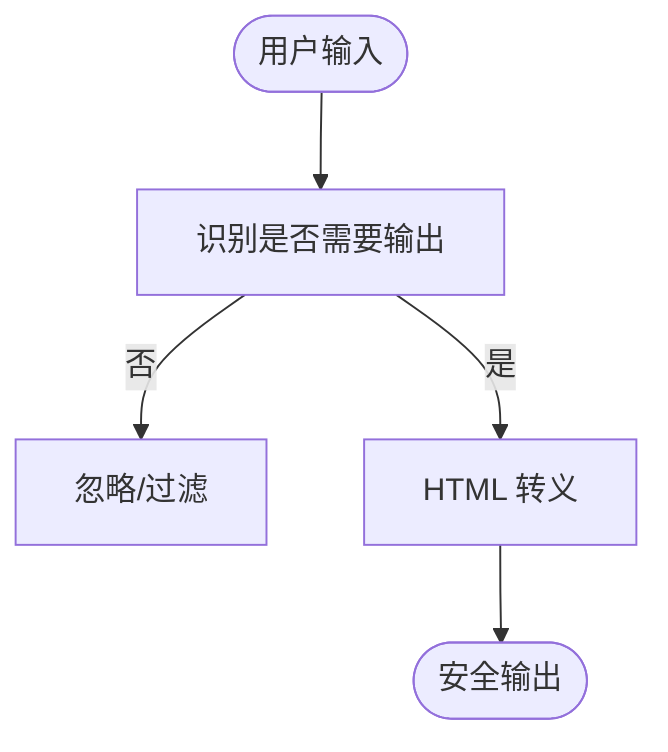
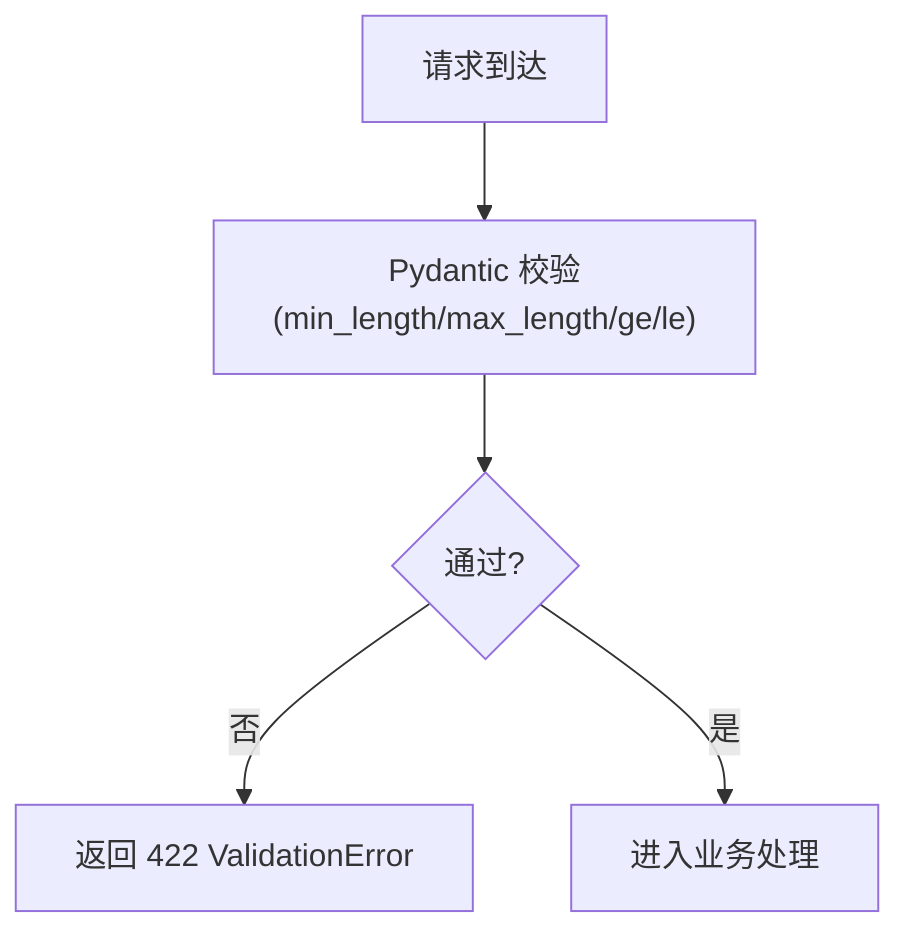
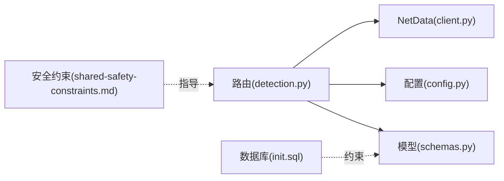

# 输入验证安全

<cite>
**本文引用的文件**
- [shared-safety-constraints.md](file://docs/prompts/shared-safety-constraints.md)
- [init.sql](file://sql/init.sql)
- [main.py](file://anomaly-detection-service/app/main.py)
- [detection.py](file://anomaly-detection-service/app/api/routes/detection.py)
- [schemas.py](file://anomaly-detection-service/app/models/schemas.py)
- [config.py](file://anomaly-detection-service/app/config.py)
- [client.py](file://anomaly-detection-service/app/netdata/client.py)
- [test_api.py](file://anomaly-detection-service/tests/test_api.py)
</cite>

## 目录
1. [简介](#简介)
2. [项目结构](#项目结构)
3. [核心组件](#核心组件)
4. [架构总览](#架构总览)
5. [详细组件分析](#详细组件分析)
6. [依赖分析](#依赖分析)
7. [性能考虑](#性能考虑)
8. [故障排查指南](#故障排查指南)
9. [结论](#结论)
10. [附录](#附录)

## 简介
本文件聚焦于智能运维系统中的“输入验证安全”，围绕三大核心威胁提供防护机制与实现方法：
- SQL 注入防护：通过参数化查询与最小权限策略降低风险
- 命令注入防护：通过安全函数调用与白名单/黑名单策略避免危险命令执行
- XSS 攻击防护：通过 HTML 转义与安全输出策略减少前端脚本注入风险

同时，文档给出输入长度限制与格式验证规则、安全测试方法以及漏洞检测与修复指南，帮助读者在工程实践中构建健壮的输入验证体系。

## 项目结构
本仓库包含智能运维系统的 Prompt 安全约束文档、数据库初始化脚本，以及一个异常检测微服务（FastAPI）。与输入验证安全直接相关的关键位置如下：
- 安全约束与规则：docs/prompts/shared-safety-constraints.md
- 数据库表结构与字段长度：sql/init.sql
- API 路由与请求模型：anomaly-detection-service/app/api/routes/detection.py、app/models/schemas.py
- 应用入口与异常处理：anomaly-detection-service/app/main.py
- 配置与阈值：anomaly-detection-service/app/config.py
- 外部系统集成（NetData）：anomaly-detection-service/app/netdata/client.py
- API 测试用例：anomaly-detection-service/tests/test_api.py

**图表来源**
- [main.py:176-188](file://anomaly-detection-service/app/main.py#L176-L188)
- [detection.py:55-378](file://anomaly-detection-service/app/api/routes/detection.py#L55-L378)
- [schemas.py:63-214](file://anomaly-detection-service/app/models/schemas.py#L63-L214)
- [config.py:28-183](file://anomaly-detection-service/app/config.py#L28-L183)
- [client.py:30-301](file://anomaly-detection-service/app/netdata/client.py#L30-L301)
- [shared-safety-constraints.md:199-230](file://docs/prompts/shared-safety-constraints.md#L199-L230)
- [init.sql:26-244](file://sql/init.sql#L26-L244)
- [test_api.py:74-172](file://anomaly-detection-service/tests/test_api.py#L74-L172)

**章节来源**
- [main.py:176-188](file://anomaly-detection-service/app/main.py#L176-L188)
- [detection.py:55-378](file://anomaly-detection-service/app/api/routes/detection.py#L55-L378)
- [schemas.py:63-214](file://anomaly-detection-service/app/models/schemas.py#L63-L214)
- [config.py:28-183](file://anomaly-detection-service/app/config.py#L28-L183)
- [client.py:30-301](file://anomaly-detection-service/app/netdata/client.py#L30-L301)
- [shared-safety-constraints.md:199-230](file://docs/prompts/shared-safety-constraints.md#L199-L230)
- [init.sql:26-244](file://sql/init.sql#L26-L244)
- [test_api.py:74-172](file://anomaly-detection-service/tests/test_api.py#L74-L172)

## 核心组件
- 请求模型与验证：通过 Pydantic 模型定义字段长度、数值范围与必填项，自动拦截非法输入
- 路由与业务逻辑：在路由层集中处理输入校验与安全策略，避免将校验分散到各处
- 配置与阈值：集中管理异常阈值、告警阈值与批量上限，便于统一策略
- 外部系统集成：对第三方 API 的输入进行严格校验与白名单控制
- 安全约束文档：提供 SQL 注入、命令注入、XSS 的防护指导与输入长度限制

**章节来源**
- [schemas.py:63-214](file://anomaly-detection-service/app/models/schemas.py#L63-L214)
- [detection.py:55-378](file://anomaly-detection-service/app/api/routes/detection.py#L55-L378)
- [config.py:108-146](file://anomaly-detection-service/app/config.py#L108-L146)
- [client.py:84-198](file://anomaly-detection-service/app/netdata/client.py#L84-L198)
- [shared-safety-constraints.md:199-230](file://docs/prompts/shared-safety-constraints.md#L199-L230)

## 架构总览
下图展示了输入从 API 到业务处理的路径，以及在各环节的验证与防护要点：

**图表来源**
- [detection.py:55-378](file://anomaly-detection-service/app/api/routes/detection.py#L55-L378)
- [schemas.py:95-183](file://anomaly-detection-service/app/models/schemas.py#L95-L183)
- [config.py:108-146](file://anomaly-detection-service/app/config.py#L108-L146)
- [client.py:138-198](file://anomaly-detection-service/app/netdata/client.py#L138-L198)
- [init.sql:114-170](file://sql/init.sql#L114-L170)

## 详细组件分析

### SQL 注入防护
- 防护策略
  - 参数化查询：在数据库访问层使用参数化语句，避免字符串拼接
  - 最小权限原则：数据库账号仅授予必要权限，避免高危操作
  - 表结构与字段长度：通过数据库脚本约束字段长度，降低超长输入风险
- 实施要点
  - 在路由或服务层进行参数化查询封装
  - 对用户可控的查询条件进行白名单映射
  - 审计日志记录敏感操作
- 安全约束参考
  - SQL 注入防护示例与输入长度限制见安全约束文档

**图表来源**
- [shared-safety-constraints.md:206-220](file://docs/prompts/shared-safety-constraints.md#L206-L220)
- [init.sql:26-244](file://sql/init.sql#L26-L244)

**章节来源**
- [shared-safety-constraints.md:206-220](file://docs/prompts/shared-safety-constraints.md#L206-L220)
- [init.sql:26-244](file://sql/init.sql#L26-L244)

### 命令注入防护
- 防护策略
  - 使用参数列表而非字符串拼接调用系统命令
  - 命令白名单/黑名单：仅允许受控命令，拒绝高危命令
  - 输入长度限制与格式校验：防止超长与非法字符
- 实施要点
  - 在路由层对命令参数进行严格校验
  - 对外部系统调用（如 NetData）进行参数白名单与范围控制
  - 审计日志记录命令生成与执行
- 安全约束参考
  - 命令注入防护示例与命令清单见安全约束文档

**图表来源**
- [shared-safety-constraints.md:211-214](file://docs/prompts/shared-safety-constraints.md#L211-L214)
- [client.py:138-198](file://anomaly-detection-service/app/netdata/client.py#L138-L198)

**章节来源**
- [shared-safety-constraints.md:211-214](file://docs/prompts/shared-safety-constraints.md#L211-L214)
- [client.py:138-198](file://anomaly-detection-service/app/netdata/client.py#L138-L198)

### XSS 攻击防护
- 防护策略
  - HTML 转义：对用户可控输出进行 HTML 特殊字符转义
  - 内容安全策略（CSP）：在前端或网关层设置 CSP 头
  - 输出最小化：仅输出必要信息，避免将原始输入直接回显
- 实施要点
  - 在响应层对用户输入进行转义处理
  - 对日志与审计输出进行脱敏
- 安全约束参考
  - XSS 防护示例见安全约束文档

**图表来源**
- [shared-safety-constraints.md:216-219](file://docs/prompts/shared-safety-constraints.md#L216-L219)

**章节来源**
- [shared-safety-constraints.md:216-219](file://docs/prompts/shared-safety-constraints.md#L216-L219)

### 输入验证实现方法
- 参数化查询
  - 在数据库访问层统一使用参数化语句
  - 对用户输入进行类型转换与范围校验
- 安全函数调用
  - 使用参数列表调用系统命令
  - 对外部 API 的参数进行白名单与范围控制
- HTML 转义处理
  - 对输出到页面的内容进行 HTML 转义
  - 对日志与审计信息进行脱敏

**章节来源**
- [shared-safety-constraints.md:206-219](file://docs/prompts/shared-safety-constraints.md#L206-L219)
- [client.py:138-198](file://anomaly-detection-service/app/netdata/client.py#L138-L198)

### 输入长度限制与格式验证规则
- 输入长度限制（摘自安全约束文档）
  - 用户问题：10000 字符
  - 命令参数：1000 字符
  - 文件路径：500 字符
  - 主机名：100 字符
- 字段长度与范围（来自数据库脚本）
  - 用户名、昵称、邮箱、标题等字段具有明确长度上限
  - 配置键与值、命令模板等字段长度受限
- Pydantic 模型约束
  - 数据点数量最小值与最大值
  - 阈值范围（0.0-1.0）
  - 指标名称、主机名等长度限制

**图表来源**
- [schemas.py:102-129](file://anomaly-detection-service/app/models/schemas.py#L102-L129)
- [schemas.py:162-182](file://anomaly-detection-service/app/models/schemas.py#L162-L182)
- [schemas.py:70-92](file://anomaly-detection-service/app/models/schemas.py#L70-L92)
- [shared-safety-constraints.md:222-229](file://docs/prompts/shared-safety-constraints.md#L222-L229)

**章节来源**
- [shared-safety-constraints.md:222-229](file://docs/prompts/shared-safety-constraints.md#L222-L229)
- [schemas.py:102-129](file://anomaly-detection-service/app/models/schemas.py#L102-L129)
- [schemas.py:162-182](file://anomaly-detection-service/app/models/schemas.py#L162-L182)
- [schemas.py:70-92](file://anomaly-detection-service/app/models/schemas.py#L70-L92)
- [init.sql:26-244](file://sql/init.sql#L26-L244)

### 安全测试方法
- 单元测试与集成测试
  - 使用 FastAPI TestClient 验证路由响应与错误处理
  - 针对无效输入触发 422 校验错误
- 场景测试
  - 超长输入、边界值、非法字符、空值等
  - 外部系统参数注入场景（NetData）
- 自动化测试
  - 在 CI 中加入 OpenAPI 文档校验与响应一致性检查

**章节来源**
- [test_api.py:74-172](file://anomaly-detection-service/tests/test_api.py#L74-L172)
- [main.py:145-172](file://anomaly-detection-service/app/main.py#L145-L172)

## 依赖分析
- 路由依赖模型：路由层依赖 Pydantic 模型进行输入验证
- 模型依赖配置：模型在运行时读取配置中的阈值与批量上限
- 外部系统依赖：NetData 客户端对参数进行白名单与范围控制
- 安全约束依赖：整体安全策略由安全约束文档指导

**图表来源**
- [detection.py:55-378](file://anomaly-detection-service/app/api/routes/detection.py#L55-L378)
- [schemas.py:95-183](file://anomaly-detection-service/app/models/schemas.py#L95-L183)
- [config.py:108-146](file://anomaly-detection-service/app/config.py#L108-L146)
- [client.py:138-198](file://anomaly-detection-service/app/netdata/client.py#L138-L198)
- [shared-safety-constraints.md:199-230](file://docs/prompts/shared-safety-constraints.md#L199-L230)
- [init.sql:26-244](file://sql/init.sql#L26-L244)

**章节来源**
- [detection.py:55-378](file://anomaly-detection-service/app/api/routes/detection.py#L55-L378)
- [schemas.py:95-183](file://anomaly-detection-service/app/models/schemas.py#L95-L183)
- [config.py:108-146](file://anomaly-detection-service/app/config.py#L108-L146)
- [client.py:138-198](file://anomaly-detection-service/app/netdata/client.py#L138-L198)
- [shared-safety-constraints.md:199-230](file://docs/prompts/shared-safety-constraints.md#L199-L230)
- [init.sql:26-244](file://sql/init.sql#L26-L244)

## 性能考虑
- 输入验证的性能开销主要集中在路由层与模型校验，建议：
  - 将阈值与批量上限配置化，避免硬编码带来的重复判断
  - 对外部系统调用设置合理的超时与重试策略
  - 使用缓存与批量处理降低重复校验成本

[本节为通用建议，无需具体文件引用]

## 故障排查指南
- 常见问题
  - 输入超长导致 422：检查模型中的 max_length 与安全约束中的长度限制
  - 阈值越界导致异常：检查配置中的 ge/le 与安全约束中的阈值范围
  - 外部系统调用失败：检查 NetData 参数与网络连通性
- 审计与日志
  - 记录命令生成、风险评估、审批决策与执行结果
  - 对敏感信息进行脱敏处理，避免日志泄露

**章节来源**
- [schemas.py:102-129](file://anomaly-detection-service/app/models/schemas.py#L102-L129)
- [config.py:132-136](file://anomaly-detection-service/app/config.py#L132-L136)
- [client.py:250-265](file://anomaly-detection-service/app/netdata/client.py#L250-L265)
- [shared-safety-constraints.md:262-292](file://docs/prompts/shared-safety-constraints.md#L262-L292)

## 结论
通过在路由层集中进行输入验证、在模型层使用 Pydantic 约束、在配置层统一阈值与批量上限，并结合安全约束文档中的防护策略与外部系统参数控制，本系统能够有效降低 SQL 注入、命令注入与 XSS 攻击的风险。配合完善的测试与审计机制，可进一步提升系统的安全性与可维护性。

[本节为总结，无需具体文件引用]

## 附录
- 输入验证检查清单（摘自安全约束文档）
  - 输入是否验证？
  - 是否防 SQL 注入？
  - 是否防命令注入？
  - 是否防 XSS？
  - 长度是否超限？

**章节来源**
- [shared-safety-constraints.md:348-356](file://docs/prompts/shared-safety-constraints.md#L348-L356)