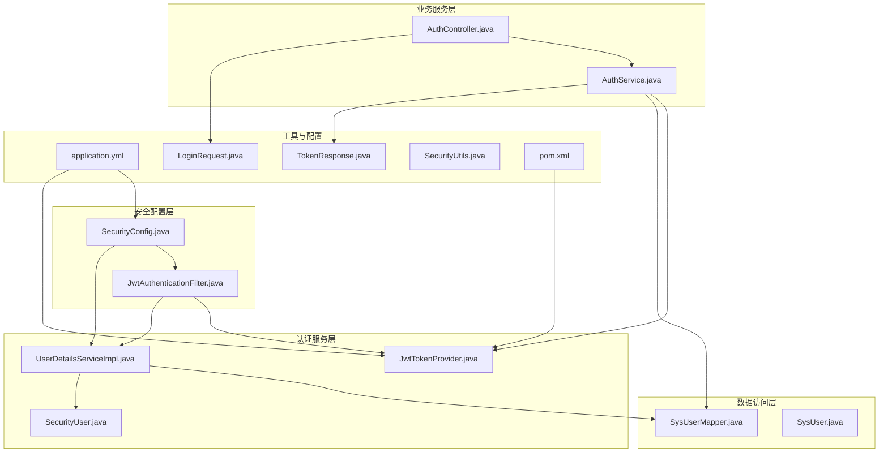
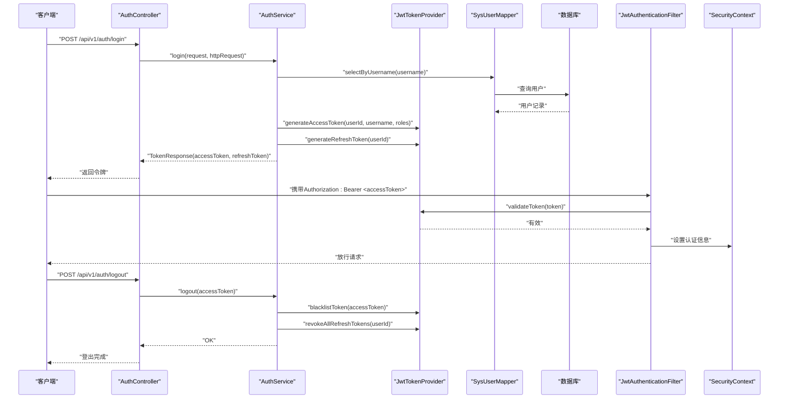
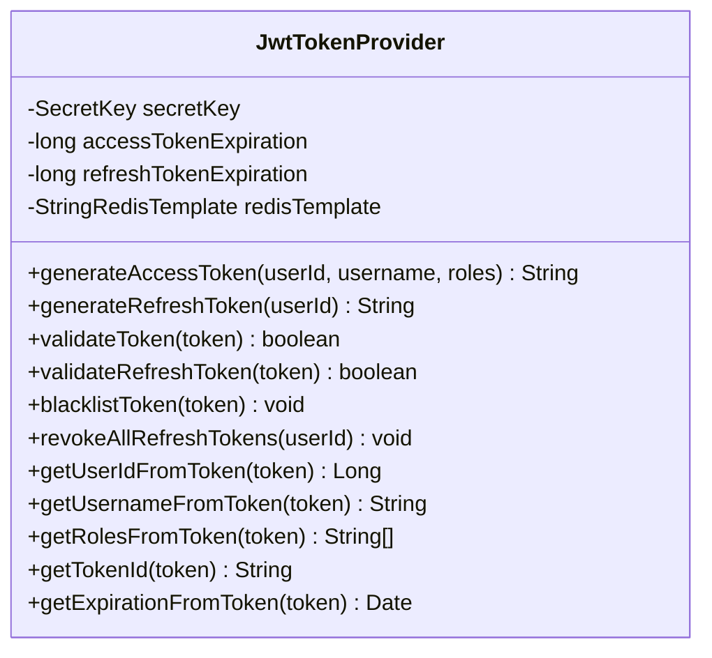
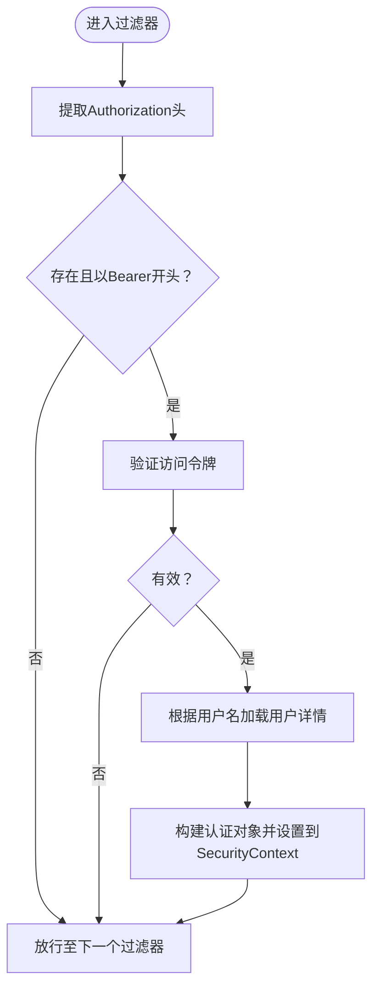
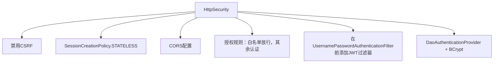
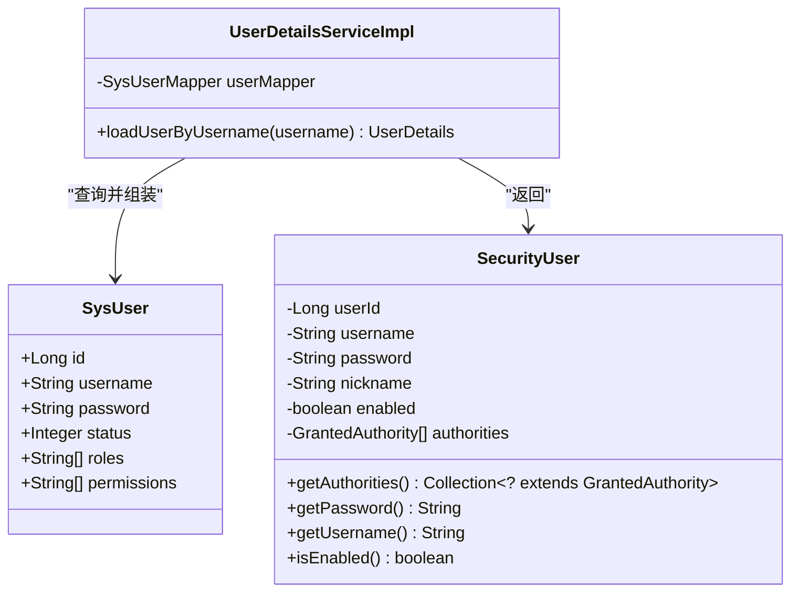
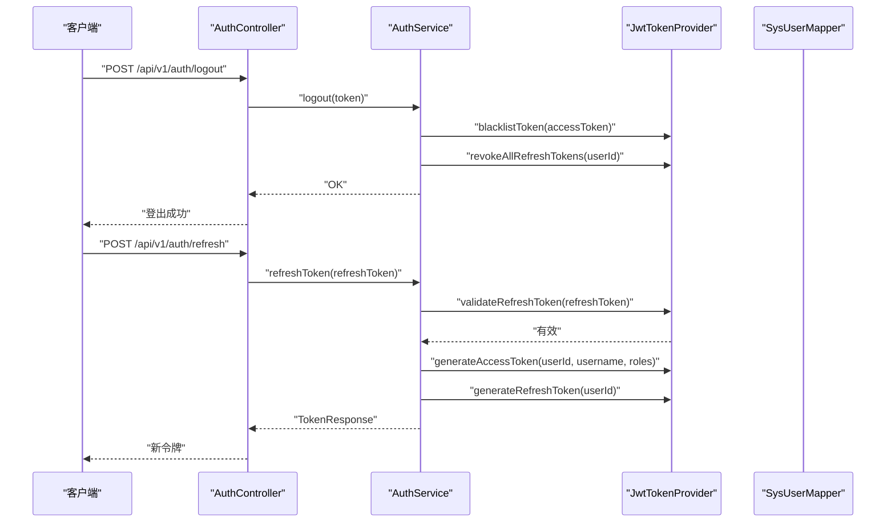
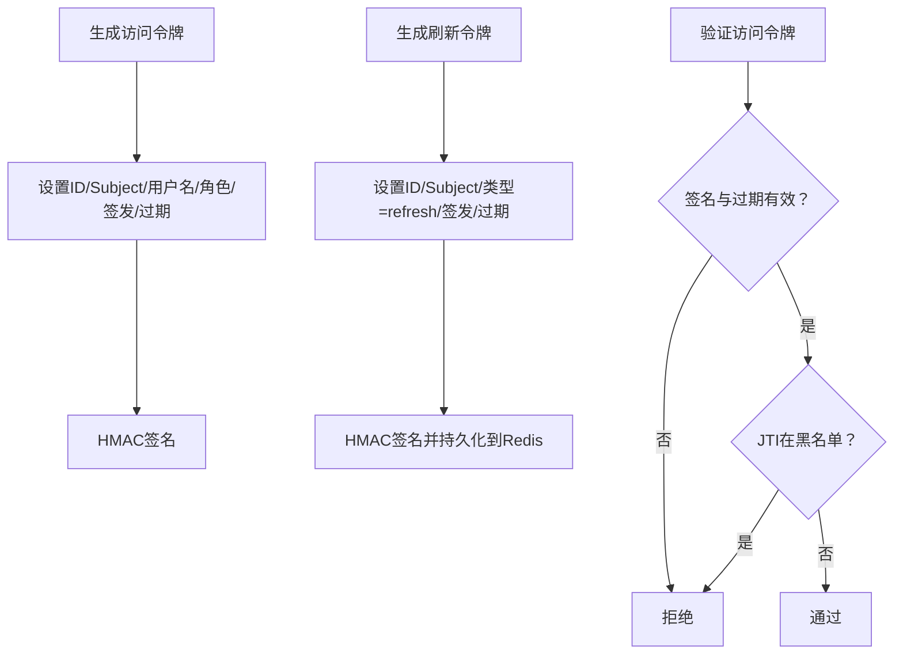
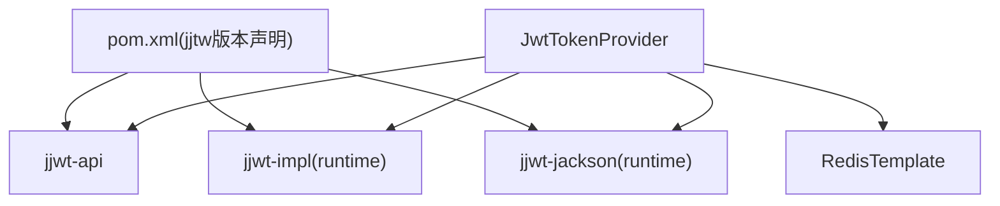

# JWT认证机制

<cite>
**本文引用的文件**
- [JwtTokenProvider.java](file://netdata-ai-backend/src/main/java/com/netdata/ops/security/JwtTokenProvider.java)
- [JwtAuthenticationFilter.java](file://netdata-ai-backend/src/main/java/com/netdata/ops/security/JwtAuthenticationFilter.java)
- [SecurityConfig.java](file://netdata-ai-backend/src/main/java/com/netdata/ops/config/SecurityConfig.java)
- [UserDetailsServiceImpl.java](file://netdata-ai-backend/src/main/java/com/netdata/ops/security/UserDetailsServiceImpl.java)
- [SecurityUser.java](file://netdata-ai-backend/src/main/java/com/netdata/ops/security/SecurityUser.java)
- [AuthService.java](file://netdata-ai-backend/src/main/java/com/netdata/ops/service/AuthService.java)
- [AuthController.java](file://netdata-ai-backend/src/main/java/com/netdata/ops/controller/AuthController.java)
- [application.yml](file://netdata-ai-backend/src/main/resources/application.yml)
- [TokenResponse.java](file://netdata-ai-backend/src/main/java/com/netdata/ops/dto/response/TokenResponse.java)
- [LoginRequest.java](file://netdata-ai-backend/src/main/java/com/netdata/ops/dto/request/LoginRequest.java)
- [SysUser.java](file://netdata-ai-backend/src/main/java/com/netdata/ops/entity/SysUser.java)
- [SysUserMapper.java](file://netdata-ai-backend/src/main/java/com/netdata/ops/mapper/SysUserMapper.java)
- [SecurityUtils.java](file://netdata-ai-backend/src/main/java/com/netdata/ops/util/SecurityUtils.java)
- [pom.xml](file://netdata-ai-backend/pom.xml)
</cite>

## 目录
1. [简介](#简介)
2. [项目结构](#项目结构)
3. [核心组件](#核心组件)
4. [架构总览](#架构总览)
5. [详细组件分析](#详细组件分析)
6. [依赖分析](#依赖分析)
7. [性能考虑](#性能考虑)
8. [故障排查指南](#故障排查指南)
9. [结论](#结论)
10. [附录](#附录)

## 简介
本文件围绕后端系统的JWT认证机制进行系统化技术文档整理，涵盖以下关键主题：
- JWT令牌的生成、验证与刷新策略：包括令牌结构、签名算法、过期时间管理与黑名单机制
- JWT过滤器的实现原理：请求拦截、令牌解析与用户身份注入流程
- 无状态认证设计理念与实现：如何在RESTful API中实现完全无状态的会话管理
- JWT配置最佳实践：密钥管理、令牌存储与安全传输
- 与Spring Security的集成方式：认证失败与令牌过期的处理策略
- 控制器中使用@AuthenticationPrincipal获取当前用户信息的示例路径

## 项目结构
后端采用Spring Boot + Spring Security + JWT + Redis的组合实现，认证相关代码集中在security、config、service、controller等包中；配置通过application.yml集中管理。

**图表来源**
- [SecurityConfig.java:44-77](file://netdata-ai-backend/src/main/java/com/netdata/ops/config/SecurityConfig.java#L44-L77)
- [JwtAuthenticationFilter.java:35-62](file://netdata-ai-backend/src/main/java/com/netdata/ops/security/JwtAuthenticationFilter.java#L35-L62)
- [JwtTokenProvider.java:47-84](file://netdata-ai-backend/src/main/java/com/netdata/ops/security/JwtTokenProvider.java#L47-L84)
- [UserDetailsServiceImpl.java:27-55](file://netdata-ai-backend/src/main/java/com/netdata/ops/security/UserDetailsServiceImpl.java#L27-L55)
- [AuthService.java:52-106](file://netdata-ai-backend/src/main/java/com/netdata/ops/service/AuthService.java#L52-L106)
- [AuthController.java:30-68](file://netdata-ai-backend/src/main/java/com/netdata/ops/controller/AuthController.java#L30-L68)
- [application.yml:193-202](file://netdata-ai-backend/src/main/resources/application.yml#L193-L202)
- [TokenResponse.java:13-32](file://netdata-ai-backend/src/main/java/com/netdata/ops/dto/response/TokenResponse.java#L13-L32)
- [LoginRequest.java:11-20](file://netdata-ai-backend/src/main/java/com/netdata/ops/dto/request/LoginRequest.java#L11-L20)
- [SysUser.java:13-56](file://netdata-ai-backend/src/main/java/com/netdata/ops/entity/SysUser.java#L13-L56)
- [SysUserMapper.java:14-32](file://netdata-ai-backend/src/main/java/com/netdata/ops/mapper/SysUserMapper.java#L14-L32)
- [SecurityUtils.java:17-39](file://netdata-ai-backend/src/main/java/com/netdata/ops/util/SecurityUtils.java#L17-L39)
- [pom.xml:76-92](file://netdata-ai-backend/pom.xml#L76-L92)

**章节来源**
- [SecurityConfig.java:44-77](file://netdata-ai-backend/src/main/java/com/netdata/ops/config/SecurityConfig.java#L44-L77)
- [application.yml:193-202](file://netdata-ai-backend/src/main/resources/application.yml#L193-L202)

## 核心组件
- JwtTokenProvider：负责JWT的生成、验证、解析、黑名单与刷新令牌校验，使用HMAC签名算法，结合Redis存储刷新令牌与黑名单
- JwtAuthenticationFilter：从请求头提取Bearer Token，调用UserDetailsService加载用户，构建Spring Security认证对象并写入上下文
- SecurityConfig：无状态安全配置，禁用CSRF与Session，配置白名单路径与JWT过滤器位置
- UserDetailsServiceImpl：从数据库加载用户信息与权限，构建SecurityUser
- AuthService：登录、登出、刷新Token的业务逻辑，整合JwtTokenProvider与数据库
- AuthController：对外暴露登录、登出、刷新与获取当前用户信息接口
- application.yml：集中配置JWT密钥、过期时间、Redis连接等
- TokenResponse/LoginRequest：登录响应与请求参数的数据结构
- SecurityUtils：从SecurityContext中便捷获取当前用户信息

**章节来源**
- [JwtTokenProvider.java:25-42](file://netdata-ai-backend/src/main/java/com/netdata/ops/security/JwtTokenProvider.java#L25-L42)
- [JwtAuthenticationFilter.java:29-33](file://netdata-ai-backend/src/main/java/com/netdata/ops/security/JwtAuthenticationFilter.java#L29-L33)
- [SecurityConfig.java:44-77](file://netdata-ai-backend/src/main/java/com/netdata/ops/config/SecurityConfig.java#L44-L77)
- [UserDetailsServiceImpl.java:27-55](file://netdata-ai-backend/src/main/java/com/netdata/ops/security/UserDetailsServiceImpl.java#L27-L55)
- [AuthService.java:52-106](file://netdata-ai-backend/src/main/java/com/netdata/ops/service/AuthService.java#L52-L106)
- [AuthController.java:30-68](file://netdata-ai-backend/src/main/java/com/netdata/ops/controller/AuthController.java#L30-L68)
- [application.yml:193-202](file://netdata-ai-backend/src/main/resources/application.yml#L193-L202)
- [TokenResponse.java:13-32](file://netdata-ai-backend/src/main/java/com/netdata/ops/dto/response/TokenResponse.java#L13-L32)
- [LoginRequest.java:11-20](file://netdata-ai-backend/src/main/java/com/netdata/ops/dto/request/LoginRequest.java#L11-L20)
- [SecurityUtils.java:17-39](file://netdata-ai-backend/src/main/java/com/netdata/ops/util/SecurityUtils.java#L17-L39)

## 架构总览
下图展示了JWT认证在系统中的整体交互流程：客户端发起登录请求，服务端生成访问与刷新令牌并返回；后续请求携带访问令牌，过滤器解析令牌并注入认证信息；登出时将访问令牌加入黑名单并撤销刷新令牌；刷新令牌用于换取新的访问令牌。

**图表来源**
- [AuthController.java:30-68](file://netdata-ai-backend/src/main/java/com/netdata/ops/controller/AuthController.java#L30-L68)
- [AuthService.java:52-106](file://netdata-ai-backend/src/main/java/com/netdata/ops/service/AuthService.java#L52-L106)
- [JwtTokenProvider.java:47-84](file://netdata-ai-backend/src/main/java/com/netdata/ops/security/JwtTokenProvider.java#L47-L84)
- [JwtAuthenticationFilter.java:39-61](file://netdata-ai-backend/src/main/java/com/netdata/ops/security/JwtAuthenticationFilter.java#L39-L61)

## 详细组件分析

### 组件A：JwtTokenProvider（令牌提供者）
- 令牌生成
  - 访问令牌：包含用户ID、用户名、角色列表、签发时间与过期时间，使用HMAC签名
  - 刷新令牌：包含用户ID、类型标记“refresh”、签发时间与过期时间，同时持久化到Redis以支持主动注销
- 令牌验证
  - 验证签名与过期时间；同时检查JTI是否在黑名单中
  - 刷新令牌验证：确认类型为“refresh”，并匹配Redis中保存的用户+令牌ID
- 黑名单与撤销
  - 登出时将访问令牌的JTI加入黑名单，存活时间为剩余有效期
  - 登出同时撤销该用户的全部刷新令牌
- 辅助方法：从令牌解析用户ID、用户名、角色、过期时间与JTI

**图表来源**
- [JwtTokenProvider.java:25-42](file://netdata-ai-backend/src/main/java/com/netdata/ops/security/JwtTokenProvider.java#L25-L42)
- [JwtTokenProvider.java:47-84](file://netdata-ai-backend/src/main/java/com/netdata/ops/security/JwtTokenProvider.java#L47-L84)
- [JwtTokenProvider.java:89-107](file://netdata-ai-backend/src/main/java/com/netdata/ops/security/JwtTokenProvider.java#L89-L107)
- [JwtTokenProvider.java:169-184](file://netdata-ai-backend/src/main/java/com/netdata/ops/security/JwtTokenProvider.java#L169-L184)
- [JwtTokenProvider.java:153-164](file://netdata-ai-backend/src/main/java/com/netdata/ops/security/JwtTokenProvider.java#L153-L164)

**章节来源**
- [JwtTokenProvider.java:47-84](file://netdata-ai-backend/src/main/java/com/netdata/ops/security/JwtTokenProvider.java#L47-L84)
- [JwtTokenProvider.java:89-107](file://netdata-ai-backend/src/main/java/com/netdata/ops/security/JwtTokenProvider.java#L89-L107)
- [JwtTokenProvider.java:153-164](file://netdata-ai-backend/src/main/java/com/netdata/ops/security/JwtTokenProvider.java#L153-L164)
- [JwtTokenProvider.java:169-184](file://netdata-ai-backend/src/main/java/com/netdata/ops/security/JwtTokenProvider.java#L169-L184)

### 组件B：JwtAuthenticationFilter（JWT认证过滤器）
- 请求拦截：从Authorization头提取Bearer Token
- 令牌验证：委托JwtTokenProvider验证访问令牌有效性
- 用户加载：根据用户名从UserDetailsService加载用户详情
- 认证注入：构建UsernamePasswordAuthenticationToken并写入SecurityContext

**图表来源**
- [JwtAuthenticationFilter.java:35-62](file://netdata-ai-backend/src/main/java/com/netdata/ops/security/JwtAuthenticationFilter.java#L35-L62)
- [JwtAuthenticationFilter.java:67-73](file://netdata-ai-backend/src/main/java/com/netdata/ops/security/JwtAuthenticationFilter.java#L67-L73)

**章节来源**
- [JwtAuthenticationFilter.java:35-62](file://netdata-ai-backend/src/main/java/com/netdata/ops/security/JwtAuthenticationFilter.java#L35-L62)
- [JwtAuthenticationFilter.java:67-73](file://netdata-ai-backend/src/main/java/com/netdata/ops/security/JwtAuthenticationFilter.java#L67-L73)

### 组件C：SecurityConfig（Spring Security配置）
- 无状态策略：禁用CSRF与Session，配合STATELESS策略
- 授权规则：白名单路径无需认证，其余路径均需认证
- 过滤器链：在UsernamePasswordAuthenticationFilter之前添加JWT过滤器
- 认证提供者：基于UserDetailsService与BCryptPasswordEncoder

**图表来源**
- [SecurityConfig.java:44-77](file://netdata-ai-backend/src/main/java/com/netdata/ops/config/SecurityConfig.java#L44-L77)
- [SecurityConfig.java:82-88](file://netdata-ai-backend/src/main/java/com/netdata/ops/config/SecurityConfig.java#L82-L88)
- [SecurityConfig.java:109-121](file://netdata-ai-backend/src/main/java/com/netdata/ops/config/SecurityConfig.java#L109-L121)

**章节来源**
- [SecurityConfig.java:44-77](file://netdata-ai-backend/src/main/java/com/netdata/ops/config/SecurityConfig.java#L44-L77)
- [SecurityConfig.java:82-88](file://netdata-ai-backend/src/main/java/com/netdata/ops/config/SecurityConfig.java#L82-L88)
- [SecurityConfig.java:109-121](file://netdata-ai-backend/src/main/java/com/netdata/ops/config/SecurityConfig.java#L109-L121)

### 组件D：UserDetailsServiceImpl与SecurityUser（用户详情与封装）
- UserDetailsServiceImpl：从SysUserMapper加载用户与权限，构建SecurityUser
- SecurityUser：实现UserDetails，封装用户ID、用户名、密码、启用状态与权限集合

**图表来源**
- [UserDetailsServiceImpl.java:27-55](file://netdata-ai-backend/src/main/java/com/netdata/ops/security/UserDetailsServiceImpl.java#L27-L55)
- [SecurityUser.java:16-37](file://netdata-ai-backend/src/main/java/com/netdata/ops/security/SecurityUser.java#L16-L37)
- [SysUser.java:13-56](file://netdata-ai-backend/src/main/java/com/netdata/ops/entity/SysUser.java#L13-L56)

**章节来源**
- [UserDetailsServiceImpl.java:27-55](file://netdata-ai-backend/src/main/java/com/netdata/ops/security/UserDetailsServiceImpl.java#L27-L55)
- [SecurityUser.java:16-37](file://netdata-ai-backend/src/main/java/com/netdata/ops/security/SecurityUser.java#L16-L37)
- [SysUser.java:13-56](file://netdata-ai-backend/src/main/java/com/netdata/ops/entity/SysUser.java#L13-L56)

### 组件E：AuthService与AuthController（登录/登出/刷新）
- 登录：校验用户、密码，累计失败次数并可能锁定账户，生成访问与刷新令牌
- 登出：将访问令牌加入黑名单并撤销该用户的全部刷新令牌
- 刷新：校验刷新令牌有效性，重新生成访问与刷新令牌
- 控制器：提供登录、登出、刷新与获取当前用户信息接口

**图表来源**
- [AuthController.java:38-57](file://netdata-ai-backend/src/main/java/com/netdata/ops/controller/AuthController.java#L38-L57)
- [AuthService.java:111-153](file://netdata-ai-backend/src/main/java/com/netdata/ops/service/AuthService.java#L111-L153)
- [JwtTokenProvider.java:169-184](file://netdata-ai-backend/src/main/java/com/netdata/ops/security/JwtTokenProvider.java#L169-L184)
- [JwtTokenProvider.java:47-84](file://netdata-ai-backend/src/main/java/com/netdata/ops/security/JwtTokenProvider.java#L47-L84)

**章节来源**
- [AuthController.java:38-57](file://netdata-ai-backend/src/main/java/com/netdata/ops/controller/AuthController.java#L38-L57)
- [AuthService.java:111-153](file://netdata-ai-backend/src/main/java/com/netdata/ops/service/AuthService.java#L111-L153)

### 组件F：令牌结构、签名算法与过期时间管理
- 令牌结构：访问令牌包含用户ID、用户名、角色列表、签发与过期时间；刷新令牌包含用户ID、类型标记与过期时间
- 签名算法：HMAC（基于对称密钥），密钥由配置文件提供
- 过期时间：访问令牌与刷新令牌的过期时间通过配置项控制
- 黑名单机制：访问令牌在Redis中以JTI为键加入黑名单，存活时间为剩余有效期

**图表来源**
- [JwtTokenProvider.java:47-60](file://netdata-ai-backend/src/main/java/com/netdata/ops/security/JwtTokenProvider.java#L47-L60)
- [JwtTokenProvider.java:65-84](file://netdata-ai-backend/src/main/java/com/netdata/ops/security/JwtTokenProvider.java#L65-L84)
- [JwtTokenProvider.java:89-107](file://netdata-ai-backend/src/main/java/com/netdata/ops/security/JwtTokenProvider.java#L89-L107)
- [JwtTokenProvider.java:153-164](file://netdata-ai-backend/src/main/java/com/netdata/ops/security/JwtTokenProvider.java#L153-L164)

**章节来源**
- [JwtTokenProvider.java:47-60](file://netdata-ai-backend/src/main/java/com/netdata/ops/security/JwtTokenProvider.java#L47-L60)
- [JwtTokenProvider.java:65-84](file://netdata-ai-backend/src/main/java/com/netdata/ops/security/JwtTokenProvider.java#L65-L84)
- [JwtTokenProvider.java:89-107](file://netdata-ai-backend/src/main/java/com/netdata/ops/security/JwtTokenProvider.java#L89-L107)
- [JwtTokenProvider.java:153-164](file://netdata-ai-backend/src/main/java/com/netdata/ops/security/JwtTokenProvider.java#L153-L164)

### 组件G：无状态认证设计与实现
- 设计理念：不使用Session，所有状态由客户端持有令牌并在每次请求中携带
- 实现要点：禁用CSRF与Session，白名单路径放行，JWT过滤器在标准认证过滤器之前执行
- 结果：RESTful API完全无状态，便于水平扩展与跨域部署

**章节来源**
- [SecurityConfig.java:44-77](file://netdata-ai-backend/src/main/java/com/netdata/ops/config/SecurityConfig.java#L44-L77)

### 组件H：JWT配置最佳实践
- 密钥管理：通过环境变量注入JWT密钥，避免硬编码
- 令牌存储：刷新令牌与黑名单持久化至Redis，支持主动注销与过期清理
- 安全传输：建议在HTTPS环境下传输，避免令牌在传输过程中被窃取
- 过期时间：合理设置访问令牌与刷新令牌的过期时间，平衡安全性与用户体验

**章节来源**
- [application.yml:193-202](file://netdata-ai-backend/src/main/resources/application.yml#L193-L202)
- [JwtTokenProvider.java:33-42](file://netdata-ai-backend/src/main/java/com/netdata/ops/security/JwtTokenProvider.java#L33-L42)
- [JwtTokenProvider.java:79-83](file://netdata-ai-backend/src/main/java/com/netdata/ops/security/JwtTokenProvider.java#L79-L83)
- [JwtTokenProvider.java:93-98](file://netdata-ai-backend/src/main/java/com/netdata/ops/security/JwtTokenProvider.java#L93-L98)

### 组件I：在控制器中使用@AuthenticationPrincipal获取当前用户信息
- 当前用户工具：SecurityUtils提供getCurrentUser/getCurrentUserId/getCurrentUsername等静态方法
- 使用场景：在控制器中通过SecurityUtils.getCurrentUserId()或SecurityUtils.getCurrentUser()获取当前用户信息
- 示例路径：[AuthController.java:60-68](file://netdata-ai-backend/src/main/java/com/netdata/ops/controller/AuthController.java#L60-L68)、[SecurityUtils.java:17-39](file://netdata-ai-backend/src/main/java/com/netdata/ops/util/SecurityUtils.java#L17-L39)

**章节来源**
- [AuthController.java:60-68](file://netdata-ai-backend/src/main/java/com/netdata/ops/controller/AuthController.java#L60-L68)
- [SecurityUtils.java:17-39](file://netdata-ai-backend/src/main/java/com/netdata/ops/util/SecurityUtils.java#L17-L39)

### 组件J：与Spring Security的集成与错误处理
- 集成方式：通过SecurityConfig配置过滤器链、认证提供者与授权规则
- 错误处理：登录失败累计失败次数并可能锁定账户；刷新令牌无效时抛出业务异常；令牌过期或无效时过滤器直接放行，交由后续授权逻辑处理

**章节来源**
- [SecurityConfig.java:44-77](file://netdata-ai-backend/src/main/java/com/netdata/ops/config/SecurityConfig.java#L44-L77)
- [AuthService.java:181-191](file://netdata-ai-backend/src/main/java/com/netdata/ops/service/AuthService.java#L181-L191)
- [AuthService.java:121-124](file://netdata-ai-backend/src/main/java/com/netdata/ops/service/AuthService.java#L121-L124)
- [JwtAuthenticationFilter.java:57-59](file://netdata-ai-backend/src/main/java/com/netdata/ops/security/JwtAuthenticationFilter.java#L57-L59)

## 依赖分析
- JWT依赖：使用jjwt-api/jjwt-impl/jjwt-jackson，版本在pom.xml中统一声明
- Redis：用于存储刷新令牌与黑名单，提升注销与风控能力
- Spring Security：提供认证与授权基础设施，配合无状态策略

**图表来源**
- [pom.xml:76-92](file://netdata-ai-backend/pom.xml#L76-L92)
- [JwtTokenProvider.java:3-15](file://netdata-ai-backend/src/main/java/com/netdata/ops/security/JwtTokenProvider.java#L3-L15)

**章节来源**
- [pom.xml:76-92](file://netdata-ai-backend/pom.xml#L76-L92)
- [JwtTokenProvider.java:3-15](file://netdata-ai-backend/src/main/java/com/netdata/ops/security/JwtTokenProvider.java#L3-L15)

## 性能考虑
- 令牌验证：HMAC验证开销极低，适合高并发场景
- Redis访问：刷新令牌与黑名单操作为短生命周期键，建议使用合适的Redis连接池与超时配置
- 无状态设计：避免Session带来的内存与序列化开销，有利于横向扩展
- 过期时间：合理设置访问令牌过期时间，减少频繁刷新带来的压力

## 故障排查指南
- 认证失败
  - 检查用户名是否存在与账户状态是否正常
  - 密码不匹配将触发失败计数与可能的账户锁定
- 令牌过期或无效
  - 访问令牌过期或签名无效时，过滤器会记录日志并放行，后续授权规则判定为未认证
  - 刷新令牌无效时，服务端抛出业务异常
- 主动注销
  - 登出后访问令牌会被加入黑名单，无法再用于认证
  - 同时撤销该用户的全部刷新令牌

**章节来源**
- [UserDetailsServiceImpl.java:34-42](file://netdata-ai-backend/src/main/java/com/netdata/ops/security/UserDetailsServiceImpl.java#L34-L42)
- [AuthService.java:181-191](file://netdata-ai-backend/src/main/java/com/netdata/ops/service/AuthService.java#L181-L191)
- [JwtAuthenticationFilter.java:57-59](file://netdata-ai-backend/src/main/java/com/netdata/ops/security/JwtAuthenticationFilter.java#L57-L59)
- [AuthService.java:121-124](file://netdata-ai-backend/src/main/java/com/netdata/ops/service/AuthService.java#L121-L124)
- [JwtTokenProvider.java:93-98](file://netdata-ai-backend/src/main/java/com/netdata/ops/security/JwtTokenProvider.java#L93-L98)
- [AuthService.java:111-116](file://netdata-ai-backend/src/main/java/com/netdata/ops/service/AuthService.java#L111-L116)

## 结论
本系统采用JWT+Redis+Spring Security实现了完全无状态的RESTful认证方案。通过访问令牌与刷新令牌的双令牌策略、黑名单机制与合理的过期时间管理，既保证了安全性，又提升了用户体验。配合白名单路径与无状态策略，系统具备良好的可扩展性与跨域部署能力。

## 附录
- 配置项参考
  - JWT密钥：security.jwt.secret
  - 访问令牌过期时间：security.jwt.access-token-expiration（毫秒）
  - 刷新令牌过期时间：security.jwt.refresh-token-expiration（毫秒）
- 关键实现路径
  - 令牌生成与验证：[JwtTokenProvider.java](file://netdata-ai-backend/src/main/java/com/netdata/ops/security/JwtTokenProvider.java)
  - 请求拦截与认证注入：[JwtAuthenticationFilter.java](file://netdata-ai-backend/src/main/java/com/netdata/ops/security/JwtAuthenticationFilter.java)
  - 安全配置与过滤器链：[SecurityConfig.java](file://netdata-ai-backend/src/main/java/com/netdata/ops/config/SecurityConfig.java)
  - 用户详情加载与封装：[UserDetailsServiceImpl.java](file://netdata-ai-backend/src/main/java/com/netdata/ops/security/UserDetailsServiceImpl.java)、[SecurityUser.java](file://netdata-ai-backend/src/main/java/com/netdata/ops/security/SecurityUser.java)
  - 登录/登出/刷新业务逻辑：[AuthService.java](file://netdata-ai-backend/src/main/java/com/netdata/ops/service/AuthService.java)
  - 对外接口：[AuthController.java](file://netdata-ai-backend/src/main/java/com/netdata/ops/controller/AuthController.java)
  - 配置文件：[application.yml](file://netdata-ai-backend/src/main/resources/application.yml)
  - 数据模型与映射：[SysUser.java](file://netdata-ai-backend/src/main/java/com/netdata/ops/entity/SysUser.java)、[SysUserMapper.java](file://netdata-ai-backend/src/main/java/com/netdata/ops/mapper/SysUserMapper.java)
  - 工具类：[SecurityUtils.java](file://netdata-ai-backend/src/main/java/com/netdata/ops/util/SecurityUtils.java)
  - 依赖声明：[pom.xml](file://netdata-ai-backend/pom.xml)