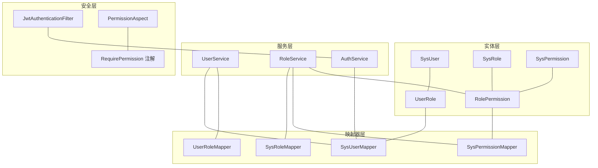
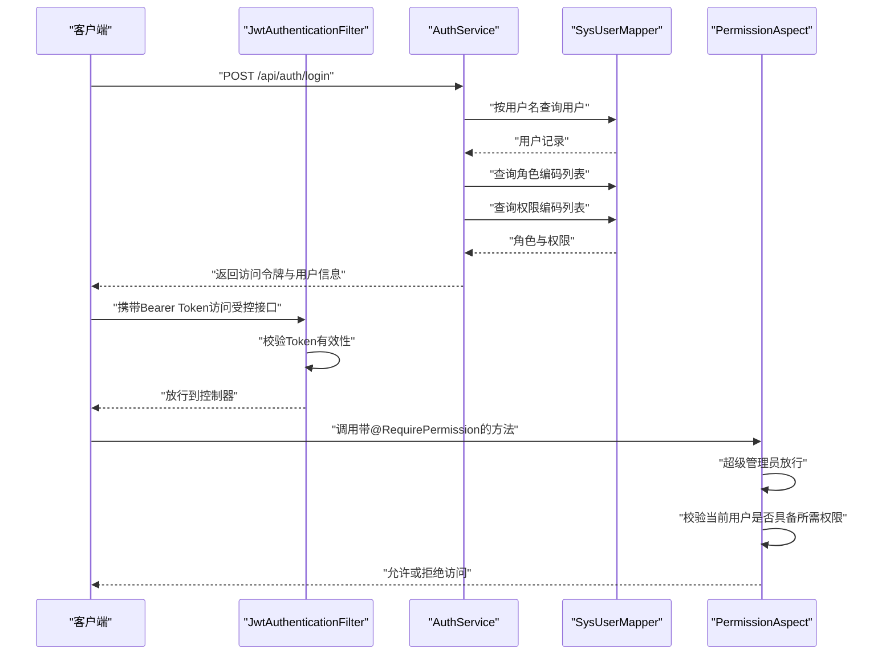
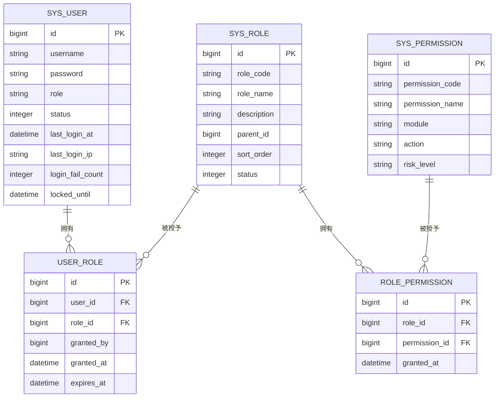
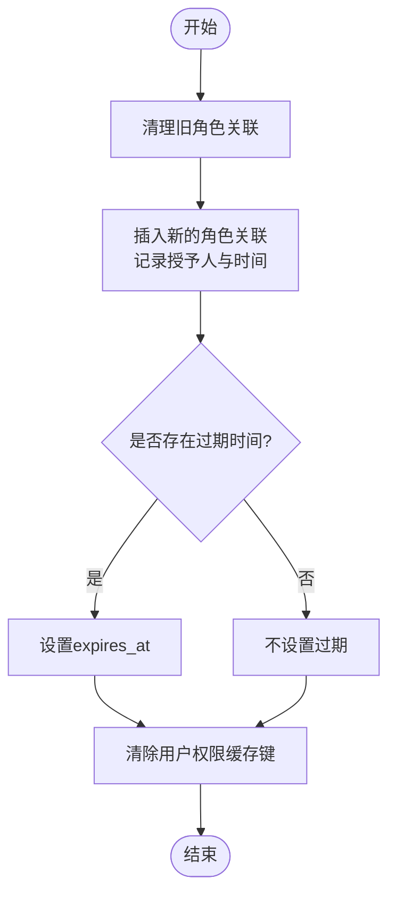
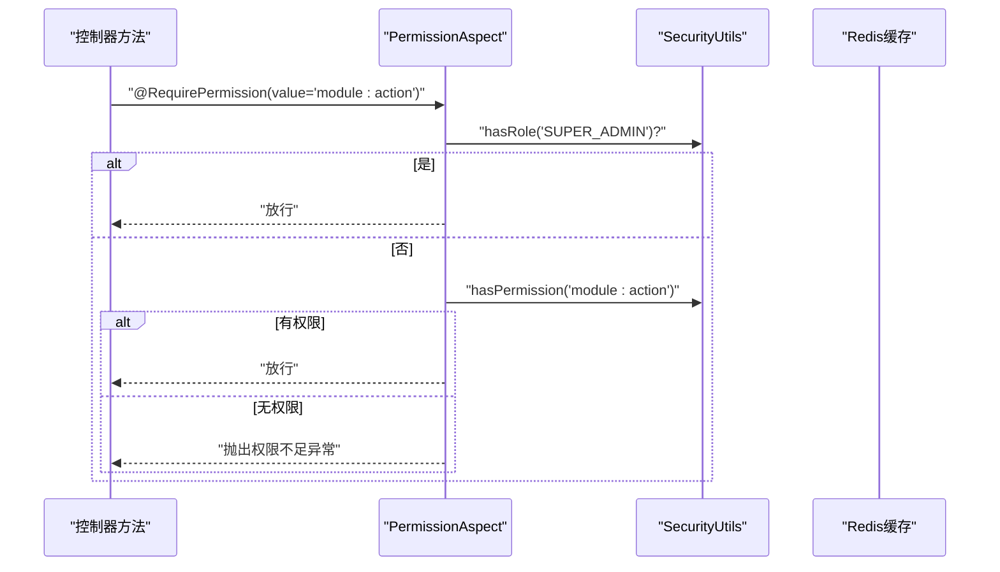
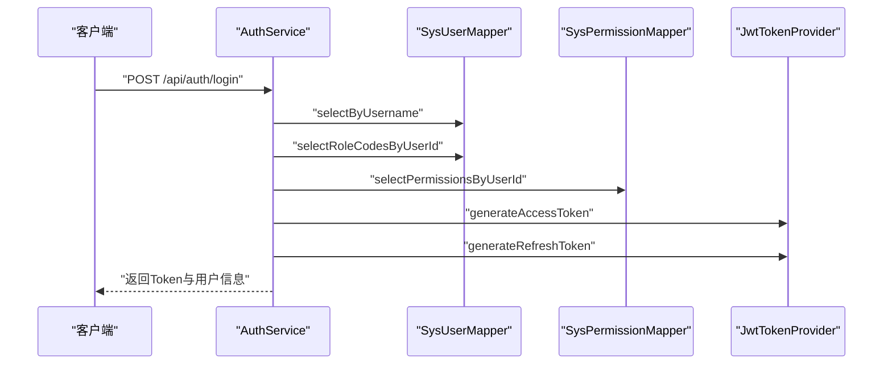
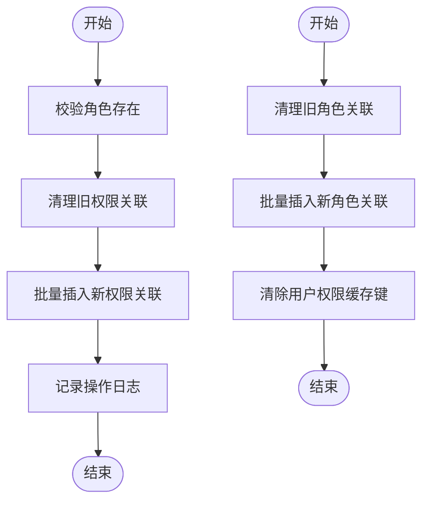
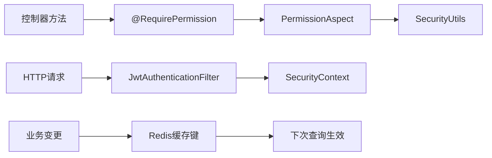

# RBAC权限系统

<cite>
**本文引用的文件**
- [SysUser.java](file://netdata-ai-backend/src/main/java/com/netdata/ops/entity/SysUser.java)
- [SysRole.java](file://netdata-ai-backend/src/main/java/com/netdata/ops/entity/SysRole.java)
- [SysPermission.java](file://netdata-ai-backend/src/main/java/com/netdata/ops/entity/SysPermission.java)
- [UserRole.java](file://netdata-ai-backend/src/main/java/com/netdata/ops/entity/UserRole.java)
- [RolePermission.java](file://netdata-ai-backend/src/main/java/com/netdata/ops/entity/RolePermission.java)
- [SysUserMapper.java](file://netdata-ai-backend/src/main/java/com/netdata/ops/mapper/SysUserMapper.java)
- [SysRoleMapper.java](file://netdata-ai-backend/src/main/java/com/netdata/ops/mapper/SysRoleMapper.java)
- [SysPermissionMapper.java](file://netdata-ai-backend/src/main/java/com/netdata/ops/mapper/SysPermissionMapper.java)
- [UserRoleMapper.java](file://netdata-ai-backend/src/main/java/com/netdata/ops/mapper/UserRoleMapper.java)
- [UserService.java](file://netdata-ai-backend/src/main/java/com/netdata/ops/service/UserService.java)
- [RoleService.java](file://netdata-ai-backend/src/main/java/com/netdata/ops/service/RoleService.java)
- [AuthService.java](file://netdata-ai-backend/src/main/java/com/netdata/ops/service/AuthService.java)
- [JwtAuthenticationFilter.java](file://netdata-ai-backend/src/main/java/com/netdata/ops/security/JwtAuthenticationFilter.java)
- [RequirePermission.java](file://netdata-ai-backend/src/main/java/com/netdata/ops/annotation/RequirePermission.java)
- [PermissionAspect.java](file://netdata-ai-backend/src/main/java/com/netdata/ops/aspect/PermissionAspect.java)
</cite>

## 目录
1. [引言](#引言)
2. [项目结构](#项目结构)
3. [核心组件](#核心组件)
4. [架构总览](#架构总览)
5. [详细组件分析](#详细组件分析)
6. [依赖分析](#依赖分析)
7. [性能考虑](#性能考虑)
8. [故障排查指南](#故障排查指南)
9. [结论](#结论)
10. [附录](#附录)

## 引言
本文件为基于角色的访问控制（RBAC）权限系统的技术文档，围绕用户、角色与权限三元模型展开，系统化阐述权限矩阵设计、角色继承与权限叠加、动态权限检查与缓存策略、以及扩展性与最佳实践。文档以后端Java代码库为依据，结合实体类、映射器、服务层与安全过滤器，给出可操作的实现路径与可视化图示。

## 项目结构
RBAC相关代码集中在后端模块的实体、映射器、服务与安全包中，采用分层架构：
- 实体层：定义用户、角色、权限及关联关系
- 映射器层：提供基于MyBatis的SQL查询接口
- 服务层：封装业务流程（用户角色分配、角色权限分配、登录鉴权）
- 安全层：JWT过滤器与权限切面，拦截并校验请求权限



图表来源
- [SysUser.java:1-57](file://netdata-ai-backend/src/main/java/com/netdata/ops/entity/SysUser.java#L1-L57)
- [SysRole.java:1-39](file://netdata-ai-backend/src/main/java/com/netdata/ops/entity/SysRole.java#L1-L39)
- [SysPermission.java:1-46](file://netdata-ai-backend/src/main/java/com/netdata/ops/entity/SysPermission.java#L1-L46)
- [UserRole.java:1-34](file://netdata-ai-backend/src/main/java/com/netdata/ops/entity/UserRole.java#L1-L34)
- [RolePermission.java:1-24](file://netdata-ai-backend/src/main/java/com/netdata/ops/entity/RolePermission.java#L1-L24)
- [SysUserMapper.java:1-34](file://netdata-ai-backend/src/main/java/com/netdata/ops/mapper/SysUserMapper.java#L1-L34)
- [SysRoleMapper.java:1-20](file://netdata-ai-backend/src/main/java/com/netdata/ops/mapper/SysRoleMapper.java#L1-L20)
- [SysPermissionMapper.java:1-26](file://netdata-ai-backend/src/main/java/com/netdata/ops/mapper/SysPermissionMapper.java#L1-L26)
- [UserRoleMapper.java:1-10](file://netdata-ai-backend/src/main/java/com/netdata/ops/mapper/UserRoleMapper.java#L1-L10)
- [UserService.java:1-253](file://netdata-ai-backend/src/main/java/com/netdata/ops/service/UserService.java#L1-L253)
- [RoleService.java:1-136](file://netdata-ai-backend/src/main/java/com/netdata/ops/service/RoleService.java#L1-L136)
- [AuthService.java:1-193](file://netdata-ai-backend/src/main/java/com/netdata/ops/service/AuthService.java#L1-L193)
- [JwtAuthenticationFilter.java:1-75](file://netdata-ai-backend/src/main/java/com/netdata/ops/security/JwtAuthenticationFilter.java#L1-L75)
- [RequirePermission.java:1-20](file://netdata-ai-backend/src/main/java/com/netdata/ops/annotation/RequirePermission.java#L1-L20)
- [PermissionAspect.java:1-40](file://netdata-ai-backend/src/main/java/com/netdata/ops/aspect/PermissionAspect.java#L1-L40)

章节来源
- [SysUser.java:1-57](file://netdata-ai-backend/src/main/java/com/netdata/ops/entity/SysUser.java#L1-L57)
- [SysRole.java:1-39](file://netdata-ai-backend/src/main/java/com/netdata/ops/entity/SysRole.java#L1-L39)
- [SysPermission.java:1-46](file://netdata-ai-backend/src/main/java/com/netdata/ops/entity/SysPermission.java#L1-L46)
- [UserRole.java:1-34](file://netdata-ai-backend/src/main/java/com/netdata/ops/entity/UserRole.java#L1-L34)
- [RolePermission.java:1-24](file://netdata-ai-backend/src/main/java/com/netdata/ops/entity/RolePermission.java#L1-L24)

## 核心组件
- 用户实体：承载用户基本信息与状态字段，包含兼容旧角色字段
- 角色实体：角色编码、名称、描述、父节点、排序与状态
- 权限实体：权限编码（module:action）、模块、动作、描述与风险等级
- 关联实体：用户-角色（user_role）与角色-权限（role_permission），支持临时授权过期时间
- 映射器接口：提供按用户查询角色与权限、按角色查询权限等SQL接口
- 服务层：用户角色分配、角色权限分配、登录鉴权与Token发放
- 安全层：JWT过滤器解析与校验Token，权限切面拦截标注@RequirePermission的方法并执行权限校验

章节来源
- [SysUser.java:1-57](file://netdata-ai-backend/src/main/java/com/netdata/ops/entity/SysUser.java#L1-L57)
- [SysRole.java:1-39](file://netdata-ai-backend/src/main/java/com/netdata/ops/entity/SysRole.java#L1-L39)
- [SysPermission.java:1-46](file://netdata-ai-backend/src/main/java/com/netdata/ops/entity/SysPermission.java#L1-L46)
- [UserRole.java:1-34](file://netdata-ai-backend/src/main/java/com/netdata/ops/entity/UserRole.java#L1-L34)
- [RolePermission.java:1-24](file://netdata-ai-backend/src/main/java/com/netdata/ops/entity/RolePermission.java#L1-L24)
- [SysUserMapper.java:1-34](file://netdata-ai-backend/src/main/java/com/netdata/ops/mapper/SysUserMapper.java#L1-L34)
- [SysRoleMapper.java:1-20](file://netdata-ai-backend/src/main/java/com/netdata/ops/mapper/SysRoleMapper.java#L1-L20)
- [SysPermissionMapper.java:1-26](file://netdata-ai-backend/src/main/java/com/netdata/ops/mapper/SysPermissionMapper.java#L1-L26)
- [UserService.java:1-253](file://netdata-ai-backend/src/main/java/com/netdata/ops/service/UserService.java#L1-L253)
- [RoleService.java:1-136](file://netdata-ai-backend/src/main/java/com/netdata/ops/service/RoleService.java#L1-L136)
- [AuthService.java:1-193](file://netdata-ai-backend/src/main/java/com/netdata/ops/service/AuthService.java#L1-L193)
- [JwtAuthenticationFilter.java:1-75](file://netdata-ai-backend/src/main/java/com/netdata/ops/security/JwtAuthenticationFilter.java#L1-L75)
- [RequirePermission.java:1-20](file://netdata-ai-backend/src/main/java/com/netdata/ops/annotation/RequirePermission.java#L1-L20)
- [PermissionAspect.java:1-40](file://netdata-ai-backend/src/main/java/com/netdata/ops/aspect/PermissionAspect.java#L1-L40)

## 架构总览
下图展示了RBAC权限系统的关键交互：用户登录获取角色与权限，JWT过滤器在请求进入业务前完成身份设置，控制器方法通过@RequirePermission注解触发权限切面校验。



图表来源
- [AuthService.java:51-106](file://netdata-ai-backend/src/main/java/com/netdata/ops/service/AuthService.java#L51-L106)
- [SysUserMapper.java:20-32](file://netdata-ai-backend/src/main/java/com/netdata/ops/mapper/SysUserMapper.java#L20-L32)
- [JwtAuthenticationFilter.java:35-62](file://netdata-ai-backend/src/main/java/com/netdata/ops/security/JwtAuthenticationFilter.java#L35-L62)
- [RequirePermission.java:12-19](file://netdata-ai-backend/src/main/java/com/netdata/ops/annotation/RequirePermission.java#L12-L19)
- [PermissionAspect.java:22-38](file://netdata-ai-backend/src/main/java/com/netdata/ops/aspect/PermissionAspect.java#L22-L38)

## 详细组件分析

### 数据模型与关系
RBAC三层关系通过以下实体与关联表实现：
- 用户（SysUser）与角色（SysRole）：多对多，user_role中间表存储授予人、授予时间与过期时间
- 角色（SysRole）与权限（SysPermission）：多对多，role_permission中间表存储授予时间
- 权限编码采用“模块:动作”格式，便于权限树与查询优化



图表来源
- [SysUser.java:1-57](file://netdata-ai-backend/src/main/java/com/netdata/ops/entity/SysUser.java#L1-L57)
- [SysRole.java:1-39](file://netdata-ai-backend/src/main/java/com/netdata/ops/entity/SysRole.java#L1-L39)
- [SysPermission.java:1-46](file://netdata-ai-backend/src/main/java/com/netdata/ops/entity/SysPermission.java#L1-L46)
- [UserRole.java:1-34](file://netdata-ai-backend/src/main/java/com/netdata/ops/entity/UserRole.java#L1-L34)
- [RolePermission.java:1-24](file://netdata-ai-backend/src/main/java/com/netdata/ops/entity/RolePermission.java#L1-L24)

章节来源
- [SysUser.java:1-57](file://netdata-ai-backend/src/main/java/com/netdata/ops/entity/SysUser.java#L1-L57)
- [SysRole.java:1-39](file://netdata-ai-backend/src/main/java/com/netdata/ops/entity/SysRole.java#L1-L39)
- [SysPermission.java:1-46](file://netdata-ai-backend/src/main/java/com/netdata/ops/entity/SysPermission.java#L1-L46)
- [UserRole.java:1-34](file://netdata-ai-backend/src/main/java/com/netdata/ops/entity/UserRole.java#L1-L34)
- [RolePermission.java:1-24](file://netdata-ai-backend/src/main/java/com/netdata/ops/entity/RolePermission.java#L1-L24)

### 用户角色分配机制
- 角色继承与叠加：通过user_role中间表维护用户的角色集合；SysRole的parentId字段用于表达层级关系，查询时可通过递归或一次性查询构建角色树
- 动态权限更新：当用户角色变更或角色权限变更时，清除用户权限缓存键，确保下次查询即时生效
- 临时授权：user_role的expires_at支持临时授权场景，查询时需过滤未过期的授权



图表来源
- [UserService.java:166-187](file://netdata-ai-backend/src/main/java/com/netdata/ops/service/UserService.java#L166-L187)
- [SysUserMapper.java:20-25](file://netdata-ai-backend/src/main/java/com/netdata/ops/mapper/SysUserMapper.java#L20-L25)
- [UserRole.java:29-32](file://netdata-ai-backend/src/main/java/com/netdata/ops/entity/UserRole.java#L29-L32)

章节来源
- [UserService.java:166-187](file://netdata-ai-backend/src/main/java/com/netdata/ops/service/UserService.java#L166-L187)
- [SysUserMapper.java:20-32](file://netdata-ai-backend/src/main/java/com/netdata/ops/mapper/SysUserMapper.java#L20-L32)
- [UserRole.java:1-34](file://netdata-ai-backend/src/main/java/com/netdata/ops/entity/UserRole.java#L1-L34)

### 权限矩阵设计与实现
- 权限标识符：采用“模块:动作”格式，如“user:write”，便于统一管理与查询
- 权限树结构：SysRole的parentId形成角色树，从而实现权限的层次化继承
- 查询优化：SysUserMapper与SysPermissionMapper提供按用户/角色直接查询权限列表的SQL，避免在应用层做复杂拼接

```mermaid
classDiagram
class SysPermission {
+long id
+string permissionCode
+string module
+string action
+string riskLevel
}
class SysRole {
+long id
+string roleCode
+string roleName
+Long parentId
+Integer sortOrder
+Integer status
}
class RolePermission {
+long id
+long roleId
+long permissionId
+datetime grantedAt
}
SysRole ||--o{ RolePermission : "拥有"
SysPermission ||--o{ RolePermission : "被授予"
```

图表来源
- [SysPermission.java:1-46](file://netdata-ai-backend/src/main/java/com/netdata/ops/entity/SysPermission.java#L1-L46)
- [SysRole.java:1-39](file://netdata-ai-backend/src/main/java/com/netdata/ops/entity/SysRole.java#L1-L39)
- [RolePermission.java:1-24](file://netdata-ai-backend/src/main/java/com/netdata/ops/entity/RolePermission.java#L1-L24)

章节来源
- [SysPermission.java:1-46](file://netdata-ai-backend/src/main/java/com/netdata/ops/entity/SysPermission.java#L1-L46)
- [SysRole.java:1-39](file://netdata-ai-backend/src/main/java/com/netdata/ops/entity/SysRole.java#L1-L39)
- [RolePermission.java:1-24](file://netdata-ai-backend/src/main/java/com/netdata/ops/entity/RolePermission.java#L1-L24)
- [SysPermissionMapper.java:14-24](file://netdata-ai-backend/src/main/java/com/netdata/ops/mapper/SysPermissionMapper.java#L14-L24)

### 动态权限检查机制
- 运行时验证：控制器方法标注@RequirePermission，权限切面在方法执行前校验当前用户是否具备所需权限
- 缓存策略：UserService在用户角色/权限变更时清除Redis中的用户权限缓存键，保证一致性
- 性能优化：SysUserMapper与SysPermissionMapper提供直接SQL查询，减少JOIN与重复计算



图表来源
- [RequirePermission.java:12-19](file://netdata-ai-backend/src/main/java/com/netdata/ops/annotation/RequirePermission.java#L12-L19)
- [PermissionAspect.java:22-38](file://netdata-ai-backend/src/main/java/com/netdata/ops/aspect/PermissionAspect.java#L22-L38)
- [UserService.java:229-231](file://netdata-ai-backend/src/main/java/com/netdata/ops/service/UserService.java#L229-L231)

章节来源
- [RequirePermission.java:1-20](file://netdata-ai-backend/src/main/java/com/netdata/ops/annotation/RequirePermission.java#L1-L20)
- [PermissionAspect.java:1-40](file://netdata-ai-backend/src/main/java/com/netdata/ops/aspect/PermissionAspect.java#L1-L40)
- [UserService.java:229-231](file://netdata-ai-backend/src/main/java/com/netdata/ops/service/UserService.java#L229-L231)

### 登录与鉴权流程
- 登录：AuthService根据用户名查询用户，校验状态与锁定状态，验证密码后查询用户角色与权限，生成访问与刷新Token
- 鉴权：JwtAuthenticationFilter从请求头提取Bearer Token，校验有效性后将用户信息写入SecurityContext，供后续权限校验使用



图表来源
- [AuthService.java:51-106](file://netdata-ai-backend/src/main/java/com/netdata/ops/service/AuthService.java#L51-L106)
- [SysUserMapper.java:20-32](file://netdata-ai-backend/src/main/java/com/netdata/ops/mapper/SysUserMapper.java#L20-L32)
- [SysPermissionMapper.java:19-24](file://netdata-ai-backend/src/main/java/com/netdata/ops/mapper/SysPermissionMapper.java#L19-L24)

章节来源
- [AuthService.java:1-193](file://netdata-ai-backend/src/main/java/com/netdata/ops/service/AuthService.java#L1-L193)
- [JwtAuthenticationFilter.java:1-75](file://netdata-ai-backend/src/main/java/com/netdata/ops/security/JwtAuthenticationFilter.java#L1-L75)

### 角色权限分配与持久化
- 角色权限分配：RoleService在分配前清理旧权限，再批量插入新权限，日志记录操作人
- 角色查询：SysRoleMapper提供按用户查询角色列表的SQL，支持状态与过期时间过滤



图表来源
- [RoleService.java:104-127](file://netdata-ai-backend/src/main/java/com/netdata/ops/service/RoleService.java#L104-L127)
- [SysRoleMapper.java:14-18](file://netdata-ai-backend/src/main/java/com/netdata/ops/mapper/SysRoleMapper.java#L14-L18)
- [UserService.java:166-187](file://netdata-ai-backend/src/main/java/com/netdata/ops/service/UserService.java#L166-L187)

章节来源
- [RoleService.java:1-136](file://netdata-ai-backend/src/main/java/com/netdata/ops/service/RoleService.java#L1-L136)
- [SysRoleMapper.java:1-20](file://netdata-ai-backend/src/main/java/com/netdata/ops/mapper/SysRoleMapper.java#L1-L20)
- [UserService.java:166-187](file://netdata-ai-backend/src/main/java/com/netdata/ops/service/UserService.java#L166-L187)

## 依赖分析
- 低耦合高内聚：实体仅定义字段与注解，映射器专注SQL查询，服务层负责业务编排，安全层独立于业务逻辑
- 关键依赖链：
  - 控制器方法 → @RequirePermission → PermissionAspect → SecurityUtils.hasPermission
  - 请求 → JwtAuthenticationFilter → SecurityContext → 控制器
  - 用户/角色/权限变更 → UserService.clearPermissionCache → 下次查询即时生效



图表来源
- [RequirePermission.java:12-19](file://netdata-ai-backend/src/main/java/com/netdata/ops/annotation/RequirePermission.java#L12-L19)
- [PermissionAspect.java:22-38](file://netdata-ai-backend/src/main/java/com/netdata/ops/aspect/PermissionAspect.java#L22-L38)
- [JwtAuthenticationFilter.java:35-62](file://netdata-ai-backend/src/main/java/com/netdata/ops/security/JwtAuthenticationFilter.java#L35-L62)
- [UserService.java:229-231](file://netdata-ai-backend/src/main/java/com/netdata/ops/service/UserService.java#L229-L231)

章节来源
- [RequirePermission.java:1-20](file://netdata-ai-backend/src/main/java/com/netdata/ops/annotation/RequirePermission.java#L1-L20)
- [PermissionAspect.java:1-40](file://netdata-ai-backend/src/main/java/com/netdata/ops/aspect/PermissionAspect.java#L1-L40)
- [JwtAuthenticationFilter.java:1-75](file://netdata-ai-backend/src/main/java/com/netdata/ops/security/JwtAuthenticationFilter.java#L1-L75)
- [UserService.java:229-231](file://netdata-ai-backend/src/main/java/com/netdata/ops/service/UserService.java#L229-L231)

## 性能考虑
- SQL层面：通过Mapper提供的直接查询接口，避免在应用层做复杂的权限聚合，降低CPU与内存开销
- 缓存层面：用户权限缓存键在角色/权限变更时主动失效，确保一致性的同时减少重复查询
- 连接与事务：服务层方法标注@Transactional，保证角色/权限分配的原子性，避免脏读

## 故障排查指南
- 权限不足异常：PermissionAspect在权限不足时抛出业务异常，建议检查用户角色与权限分配是否正确
- 登录失败与账户锁定：AuthService在密码错误时累计失败次数并可能锁定账户，需检查登录策略与用户状态
- Token无效：JwtAuthenticationFilter在Token无效或过期时不会设置SecurityContext，需确认前端携带正确的Bearer Token

章节来源
- [PermissionAspect.java:32-35](file://netdata-ai-backend/src/main/java/com/netdata/ops/aspect/PermissionAspect.java#L32-L35)
- [AuthService.java:181-191](file://netdata-ai-backend/src/main/java/com/netdata/ops/service/AuthService.java#L181-L191)
- [JwtAuthenticationFilter.java:35-62](file://netdata-ai-backend/src/main/java/com/netdata/ops/security/JwtAuthenticationFilter.java#L35-L62)

## 结论
该RBAC系统以清晰的数据模型与分层架构为基础，结合注解驱动的权限校验与JWT鉴权，实现了灵活的角色继承、权限叠加与动态权限更新。通过SQL直连查询与缓存失效策略，兼顾了性能与一致性。建议在生产环境中配合审计日志与权限回收策略，持续完善权限治理。

## 附录
- 最小权限原则：仅授予完成任务所需的最小权限集合，避免过度授权
- 权限审计：记录权限变更与访问行为，定期复核敏感权限
- 权限回收：及时撤销离职或转岗用户的权限，确保权限与职责匹配
- 扩展性设计：支持自定义权限类型（新增模块与动作）与权限规则（如条件权限），通过SysPermission的module与action字段扩展