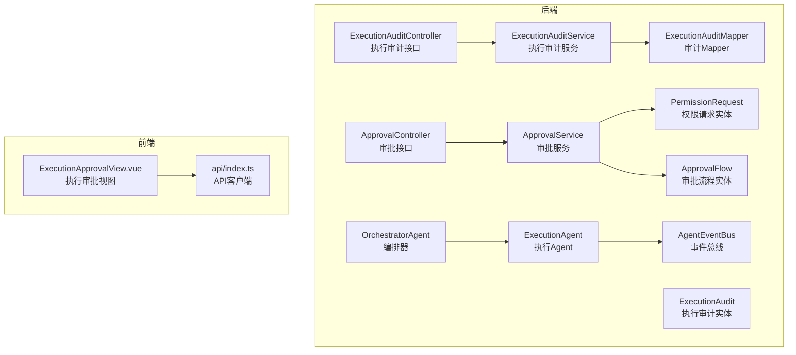
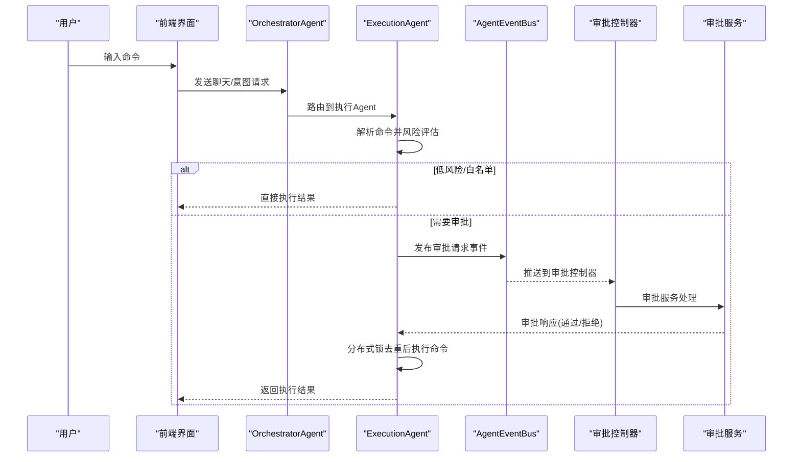
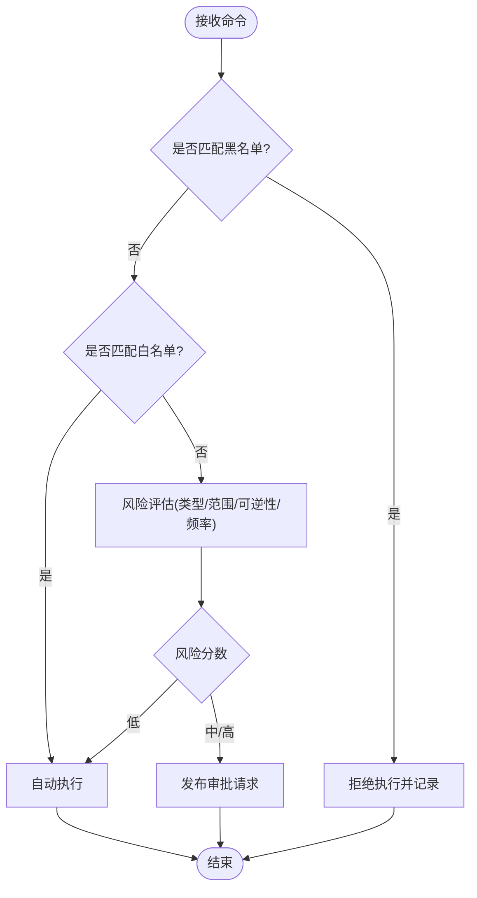
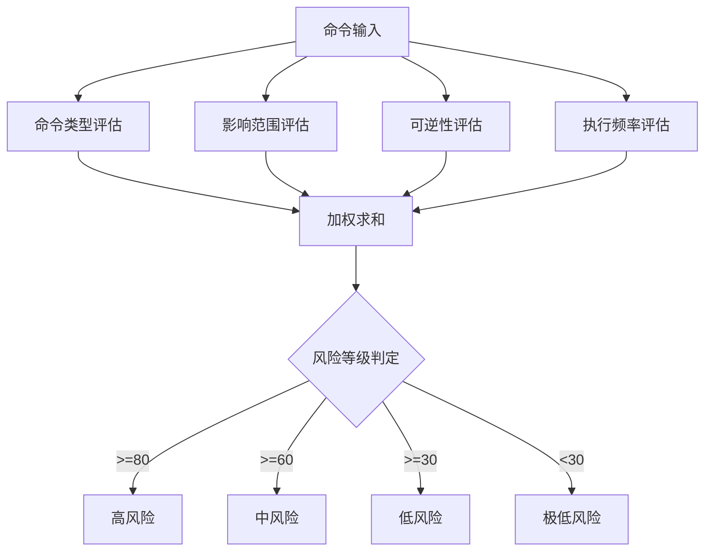
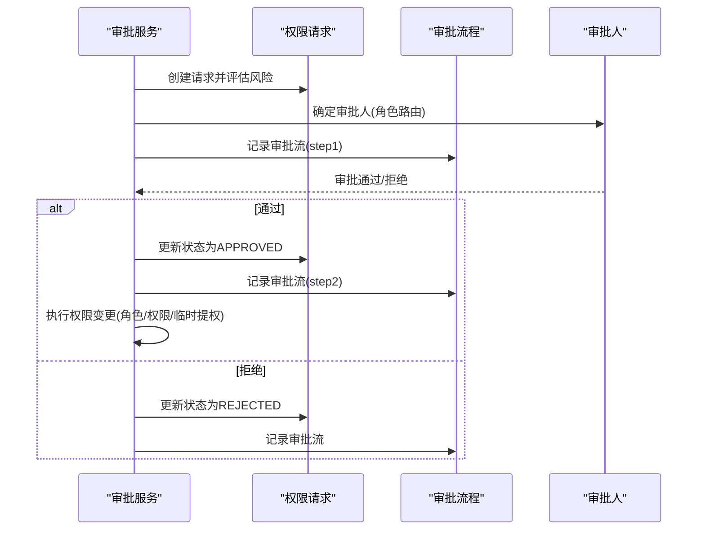
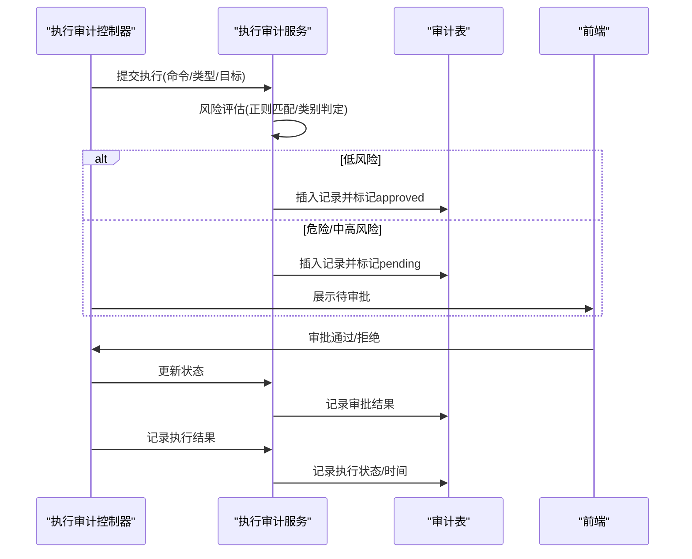
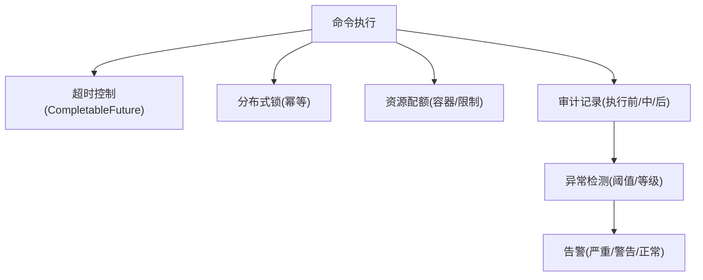
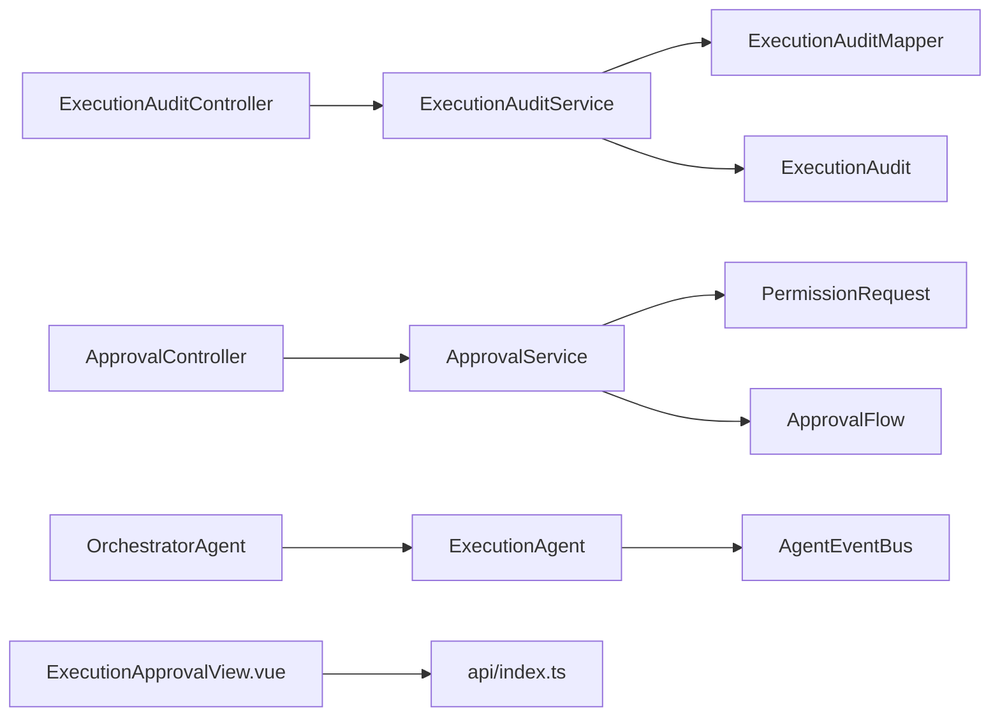

# 命令执行安全

<cite>
**本文引用的文件**
- [ExecutionAuditController.java](file://netdata-ai-backend/src/main/java/com/netdata/ops/controller/ExecutionAuditController.java)
- [ExecutionAuditService.java](file://netdata-ai-backend/src/main/java/com/netdata/ops/service/ExecutionAuditService.java)
- [ExecutionAudit.java](file://netdata-ai-backend/src/main/java/com/netdata/ops/entity/ExecutionAudit.java)
- [ExecutionAuditMapper.java](file://netdata-ai-backend/src/main/java/com/netdata/ops/mapper/ExecutionAuditMapper.java)
- [ApprovalController.java](file://netdata-ai-backend/src/main/java/com/netdata/ops/controller/ApprovalController.java)
- [ApprovalService.java](file://netdata-ai-backend/src/main/java/com/netdata/ops/service/ApprovalService.java)
- [PermissionRequest.java](file://netdata-ai-backend/src/main/java/com/netdata/ops/entity/PermissionRequest.java)
- [ApprovalFlow.java](file://netdata-ai-backend/src/main/java/com/netdata/ops/entity/ApprovalFlow.java)
- [ExecutionAgent.java](file://netdata-ai-backend/src/main/java/com/netdata/ops/core/agent/ExecutionAgent.java)
- [OrchestratorAgent.java](file://netdata-ai-backend/src/main/java/com/netdata/ops/core/agent/OrchestratorAgent.java)
- [BaseAgent.java](file://netdata-ai-backend/src/main/java/com/netdata/ops/core/agent/BaseAgent.java)
- [AgentEventBus.java](file://netdata-ai-backend/src/main/java/com/netdata/ops/core/agent/event/AgentEventBus.java)
- [ExecutionApprovalView.vue](file://netdata-ai-frontend/src/views/ExecutionApprovalView.vue)
- [index.ts](file://netdata-ai-frontend/src/api/index.ts)
- [shared-safety-constraints.md](file://docs/prompts/shared-safety-constraints.md)
- [deployment_guide.md](file://docs/deployment_guide.md)
</cite>

## 目录
1. [简介](#简介)
2. [项目结构](#项目结构)
3. [核心组件](#核心组件)
4. [架构总览](#架构总览)
5. [详细组件分析](#详细组件分析)
6. [依赖分析](#依赖分析)
7. [性能考虑](#性能考虑)
8. [故障排查指南](#故障排查指南)
9. [结论](#结论)
10. [附录](#附录)

## 简介
本技术文档围绕“命令执行安全系统”展开，聚焦以下关键能力：
- 危险命令识别机制：白名单、黑名单策略与命令参数验证
- 风险评分算法设计与实现：命令类型权重、历史执行记录分析与实时风险评估
- 人工审批流程：审批节点配置、审批人选择算法与审批状态管理
- 命令执行安全审计：执行前验证、执行中监控与执行后记录
- 隔离与限制措施：沙箱环境、资源配额与超时控制
- 监控与告警：系统运行指标、异常检测与应急处置

系统采用前后端分离架构，后端基于 Java/Spring Boot，前端基于 Vue3/Element Plus，AI Agent 采用事件总线驱动的人机协作模式。

## 项目结构
后端模块中与命令执行安全直接相关的关键目录与文件如下：
- 控制器层：执行审计控制器与审批控制器
- 服务层：执行审计服务与审批服务
- 实体与映射：执行审计与权限审批相关实体及 MyBatis Mapper
- AI Agent 层：编排器、执行器与事件总线
- 前端模块：执行审批页面与 API 客户端

**图表来源**
- [ExecutionAuditController.java:18-94](file://netdata-ai-backend/src/main/java/com/netdata/ops/controller/ExecutionAuditController.java#L18-L94)
- [ExecutionAuditService.java:24-297](file://netdata-ai-backend/src/main/java/com/netdata/ops/service/ExecutionAuditService.java#L24-L297)
- [ExecutionAudit.java:11-54](file://netdata-ai-backend/src/main/java/com/netdata/ops/entity/ExecutionAudit.java#L11-L54)
- [ExecutionAuditMapper.java:1-10](file://netdata-ai-backend/src/main/java/com/netdata/ops/mapper/ExecutionAuditMapper.java#L1-L10)
- [ApprovalController.java:18-111](file://netdata-ai-backend/src/main/java/com/netdata/ops/controller/ApprovalController.java#L18-L111)
- [ApprovalService.java:24-501](file://netdata-ai-backend/src/main/java/com/netdata/ops/service/ApprovalService.java#L24-L501)
- [PermissionRequest.java:11-69](file://netdata-ai-backend/src/main/java/com/netdata/ops/entity/PermissionRequest.java#L11-L69)
- [ApprovalFlow.java:11-36](file://netdata-ai-backend/src/main/java/com/netdata/ops/entity/ApprovalFlow.java#L11-L36)
- [OrchestratorAgent.java:36-261](file://netdata-ai-backend/src/main/java/com/netdata/ops/core/agent/OrchestratorAgent.java#L36-L261)
- [ExecutionAgent.java:39-425](file://netdata-ai-backend/src/main/java/com/netdata/ops/core/agent/ExecutionAgent.java#L39-L425)
- [AgentEventBus.java:30-155](file://netdata-ai-backend/src/main/java/com/netdata/ops/core/agent/event/AgentEventBus.java#L30-L155)
- [ExecutionApprovalView.vue:1-200](file://netdata-ai-frontend/src/views/ExecutionApprovalView.vue#L1-L200)
- [index.ts:1-290](file://netdata-ai-frontend/src/api/index.ts#L1-L290)

**章节来源**
- [ExecutionAuditController.java:18-94](file://netdata-ai-backend/src/main/java/com/netdata/ops/controller/ExecutionAuditController.java#L18-L94)
- [ApprovalController.java:18-111](file://netdata-ai-backend/src/main/java/com/netdata/ops/controller/ApprovalController.java#L18-L111)
- [ExecutionAgent.java:39-425](file://netdata-ai-backend/src/main/java/com/netdata/ops/core/agent/ExecutionAgent.java#L39-L425)
- [OrchestratorAgent.java:36-261](file://netdata-ai-backend/src/main/java/com/netdata/ops/core/agent/OrchestratorAgent.java#L36-L261)
- [AgentEventBus.java:30-155](file://netdata-ai-backend/src/main/java/com/netdata/ops/core/agent/event/AgentEventBus.java#L30-L155)
- [ExecutionApprovalView.vue:1-200](file://netdata-ai-frontend/src/views/ExecutionApprovalView.vue#L1-L200)
- [index.ts:1-290](file://netdata-ai-frontend/src/api/index.ts#L1-L290)

## 核心组件
- 执行审计控制器与服务：负责命令提交、风险评估、审批状态流转与结果记录
- 审批控制器与服务：负责权限申请、审批人路由、二级审批与执行权限变更
- AI Agent 执行器：基于意图识别与风险评估，触发人工审批或自动执行
- 事件总线：在 Agent 间解耦通信，支撑审批事件的异步处理
- 前端审批界面与 API 客户端：提供审批列表、状态更新与错误处理

**章节来源**
- [ExecutionAuditController.java:26-92](file://netdata-ai-backend/src/main/java/com/netdata/ops/controller/ExecutionAuditController.java#L26-L92)
- [ExecutionAuditService.java:65-173](file://netdata-ai-backend/src/main/java/com/netdata/ops/service/ExecutionAuditService.java#L65-L173)
- [ApprovalController.java:26-109](file://netdata-ai-backend/src/main/java/com/netdata/ops/controller/ApprovalController.java#L26-L109)
- [ApprovalService.java:39-130](file://netdata-ai-backend/src/main/java/com/netdata/ops/service/ApprovalService.java#L39-L130)
- [ExecutionAgent.java:149-198](file://netdata-ai-backend/src/main/java/com/netdata/ops/core/agent/ExecutionAgent.java#L149-L198)
- [AgentEventBus.java:69-133](file://netdata-ai-backend/src/main/java/com/netdata/ops/core/agent/event/AgentEventBus.java#L69-L133)
- [ExecutionApprovalView.vue:1-200](file://netdata-ai-frontend/src/views/ExecutionApprovalView.vue#L1-L200)
- [index.ts:194-215](file://netdata-ai-frontend/src/api/index.ts#L194-L215)

## 架构总览
系统采用“意图识别—风险评估—人工审批—执行”的闭环流程。编排器根据用户输入识别意图，执行器进行命令解析与风险评估，必要时通过事件总线发布审批请求，审批通过后执行器执行命令并记录结果。

**图表来源**
- [OrchestratorAgent.java:105-112](file://netdata-ai-backend/src/main/java/com/netdata/ops/core/agent/OrchestratorAgent.java#L105-L112)
- [ExecutionAgent.java:108-145](file://netdata-ai-backend/src/main/java/com/netdata/ops/core/agent/ExecutionAgent.java#L108-L145)
- [AgentEventBus.java:96-133](file://netdata-ai-backend/src/main/java/com/netdata/ops/core/agent/event/AgentEventBus.java#L96-L133)
- [ApprovalController.java:42-56](file://netdata-ai-backend/src/main/java/com/netdata/ops/controller/ApprovalController.java#L42-L56)
- [ApprovalService.java:99-130](file://netdata-ai-backend/src/main/java/com/netdata/ops/service/ApprovalService.java#L99-L130)

## 详细组件分析

### 危险命令识别与黑白名单策略
- 黑名单：绝对禁止执行的高危命令，如系统销毁、权限开放、防火墙清空、系统关机/重启、Fork 炸弹等
- 白名单：可自动执行的安全命令，如状态查询、日志查看、基础系统信息命令
- 灰名单：需要人工审批的中高风险命令，如服务启停、进程终止、配置修改、数据操作、网络策略变更等

**图表来源**
- [ExecutionAgent.java:163-198](file://netdata-ai-backend/src/main/java/com/netdata/ops/core/agent/ExecutionAgent.java#L163-L198)
- [shared-safety-constraints.md:31-95](file://docs/prompts/shared-safety-constraints.md#L31-L95)

**章节来源**
- [ExecutionAgent.java:48-83](file://netdata-ai-backend/src/main/java/com/netdata/ops/core/agent/ExecutionAgent.java#L48-L83)
- [shared-safety-constraints.md:31-95](file://docs/prompts/shared-safety-constraints.md#L31-L95)

### 风险评分算法设计与实现
- 命令类型权重：40%
- 影响范围权重：30%
- 可逆性权重：20%
- 执行频率权重：10%
- 风险阈值：低(<30)、中(≥30 且 <60)、高(≥60 且 <80)、极高(≥80)

**图表来源**
- [ExecutionAgent.java:232-297](file://netdata-ai-backend/src/main/java/com/netdata/ops/core/agent/ExecutionAgent.java#L232-L297)

**章节来源**
- [ExecutionAgent.java:232-297](file://netdata-ai-backend/src/main/java/com/netdata/ops/core/agent/ExecutionAgent.java#L232-L297)

### 人工审批流程实现原理
- 审批节点配置：基于风险等级路由至不同审批人角色
  - 低风险：任意管理员
  - 中风险：管理员
  - 高风险：超级管理员，必要时二级审批
- 审批人选择算法：优先选择具备所需角色且非申请人的用户，若不可得则回退至超级管理员
- 审批状态管理：PENDING/REVIEWING/APPROVED/REJECTED/EXPIRED
- 权限变更执行：角色分配、权限授予、临时提权到期

**图表来源**
- [ApprovalService.java:39-130](file://netdata-ai-backend/src/main/java/com/netdata/ops/service/ApprovalService.java#L39-L130)
- [ApprovalService.java:337-371](file://netdata-ai-backend/src/main/java/com/netdata/ops/service/ApprovalService.java#L337-L371)
- [ApprovalService.java:376-414](file://netdata-ai-backend/src/main/java/com/netdata/ops/service/ApprovalService.java#L376-L414)
- [ApprovalService.java:419-466](file://netdata-ai-backend/src/main/java/com/netdata/ops/service/ApprovalService.java#L419-L466)

**章节来源**
- [ApprovalService.java:307-329](file://netdata-ai-backend/src/main/java/com/netdata/ops/service/ApprovalService.java#L307-L329)
- [ApprovalService.java:337-371](file://netdata-ai-backend/src/main/java/com/netdata/ops/service/ApprovalService.java#L337-L371)
- [ApprovalService.java:376-414](file://netdata-ai-backend/src/main/java/com/netdata/ops/service/ApprovalService.java#L376-L414)
- [ApprovalService.java:419-466](file://netdata-ai-backend/src/main/java/com/netdata/ops/service/ApprovalService.java#L419-L466)

### 命令执行的安全审计机制
- 执行前验证：命令解析、黑白名单、风险评估、审批状态检查
- 执行中监控：分布式锁防重复执行、超时控制、链路追踪(MDC TraceId)
- 执行后记录：结果状态、执行时间、审计统计

**图表来源**
- [ExecutionAuditController.java:26-58](file://netdata-ai-backend/src/main/java/com/netdata/ops/controller/ExecutionAuditController.java#L26-L58)
- [ExecutionAuditService.java:65-103](file://netdata-ai-backend/src/main/java/com/netdata/ops/service/ExecutionAuditService.java#L65-L103)
- [ExecutionAuditService.java:108-173](file://netdata-ai-backend/src/main/java/com/netdata/ops/service/ExecutionAuditService.java#L108-L173)
- [ExecutionAudit.java:11-54](file://netdata-ai-backend/src/main/java/com/netdata/ops/entity/ExecutionAudit.java#L11-L54)

**章节来源**
- [ExecutionAuditController.java:26-92](file://netdata-ai-backend/src/main/java/com/netdata/ops/controller/ExecutionAuditController.java#L26-L92)
- [ExecutionAuditService.java:65-173](file://netdata-ai-backend/src/main/java/com/netdata/ops/service/ExecutionAuditService.java#L65-L173)
- [ExecutionAudit.java:11-54](file://netdata-ai-backend/src/main/java/com/netdata/ops/entity/ExecutionAudit.java#L11-L54)

### 命令执行的隔离与限制措施
- 沙箱环境：建议在容器或受限环境中执行命令，避免直接宿主执行
- 资源配额：限制 CPU/内存/IO，防止资源滥用
- 超时控制：Agent 基类内置超时与重试机制，避免长时间阻塞
- 分布式锁：防止重复执行同一命令
- 审计与告警：记录执行全过程，结合异常检测服务进行实时告警

**图表来源**
- [BaseAgent.java:281-303](file://netdata-ai-backend/src/main/java/com/netdata/ops/core/agent/BaseAgent.java#L281-L303)
- [ExecutionAgent.java:122-136](file://netdata-ai-backend/src/main/java/com/netdata/ops/core/agent/ExecutionAgent.java#L122-L136)
- [shared-safety-constraints.md:296-325](file://docs/prompts/shared-safety-constraints.md#L296-L325)

**章节来源**
- [BaseAgent.java:89-226](file://netdata-ai-backend/src/main/java/com/netdata/ops/core/agent/BaseAgent.java#L89-L226)
- [ExecutionAgent.java:122-136](file://netdata-ai-backend/src/main/java/com/netdata/ops/core/agent/ExecutionAgent.java#L122-L136)
- [shared-safety-constraints.md:296-325](file://docs/prompts/shared-safety-constraints.md#L296-L325)

### 代码示例路径（实现命令安全评估与审批流程）
- 命令风险评估与自动执行/审批分流
  - [ExecutionAgent.doExecute:149-198](file://netdata-ai-backend/src/main/java/com/netdata/ops/core/agent/ExecutionAgent.java#L149-L198)
  - [ExecutionAgent.assessRisk:232-257](file://netdata-ai-backend/src/main/java/com/netdata/ops/core/agent/ExecutionAgent.java#L232-L257)
- 审批请求创建与事件发布
  - [ExecutionAgent.createApprovalRequest:342-395](file://netdata-ai-backend/src/main/java/com/netdata/ops/core/agent/ExecutionAgent.java#L342-L395)
  - [AgentEventBus.publish:73-92](file://netdata-ai-backend/src/main/java/com/netdata/ops/core/agent/event/AgentEventBus.java#L73-L92)
- 审批响应处理与执行
  - [ExecutionAgent.handle(APPROVAL_RESPONSE):108-145](file://netdata-ai-backend/src/main/java/com/netdata/ops/core/agent/ExecutionAgent.java#L108-L145)
  - [ApprovalService.approve/reject:99-152](file://netdata-ai-backend/src/main/java/com/netdata/ops/service/ApprovalService.java#L99-L152)
- 执行审计与结果记录
  - [ExecutionAuditService.submitExecution:65-103](file://netdata-ai-backend/src/main/java/com/netdata/ops/service/ExecutionAuditService.java#L65-L103)
  - [ExecutionAuditService.recordResult:159-173](file://netdata-ai-backend/src/main/java/com/netdata/ops/service/ExecutionAuditService.java#L159-L173)

**章节来源**
- [ExecutionAgent.java:149-198](file://netdata-ai-backend/src/main/java/com/netdata/ops/core/agent/ExecutionAgent.java#L149-L198)
- [AgentEventBus.java:73-92](file://netdata-ai-backend/src/main/java/com/netdata/ops/core/agent/event/AgentEventBus.java#L73-L92)
- [ApprovalService.java:99-152](file://netdata-ai-backend/src/main/java/com/netdata/ops/service/ApprovalService.java#L99-L152)
- [ExecutionAuditService.java:65-173](file://netdata-ai-backend/src/main/java/com/netdata/ops/service/ExecutionAuditService.java#L65-L173)

## 依赖分析
- 控制器依赖服务：执行审计控制器与审批控制器分别依赖对应服务
- 服务依赖实体与映射：审计服务依赖审计实体与 Mapper；审批服务依赖权限请求与审批流程实体
- Agent 依赖事件总线：执行 Agent 通过事件总线发布/订阅审批事件
- 前端依赖 API 客户端：审批页面通过 API 客户端调用后端接口

**图表来源**
- [ExecutionAuditController.java:24-24](file://netdata-ai-backend/src/main/java/com/netdata/ops/controller/ExecutionAuditController.java#L24-L24)
- [ExecutionAuditService.java:29-29](file://netdata-ai-backend/src/main/java/com/netdata/ops/service/ExecutionAuditService.java#L29-L29)
- [ExecutionAuditMapper.java:1-10](file://netdata-ai-backend/src/main/java/com/netdata/ops/mapper/ExecutionAuditMapper.java#L1-L10)
- [ExecutionAudit.java:11-54](file://netdata-ai-backend/src/main/java/com/netdata/ops/entity/ExecutionAudit.java#L11-L54)
- [ApprovalController.java:24-24](file://netdata-ai-backend/src/main/java/com/netdata/ops/controller/ApprovalController.java#L24-L24)
- [ApprovalService.java:29-35](file://netdata-ai-backend/src/main/java/com/netdata/ops/service/ApprovalService.java#L29-L35)
- [PermissionRequest.java:11-69](file://netdata-ai-backend/src/main/java/com/netdata/ops/entity/PermissionRequest.java#L11-L69)
- [ApprovalFlow.java:11-36](file://netdata-ai-backend/src/main/java/com/netdata/ops/entity/ApprovalFlow.java#L11-L36)
- [ExecutionAgent.java:84-93](file://netdata-ai-backend/src/main/java/com/netdata/ops/core/agent/ExecutionAgent.java#L84-L93)
- [AgentEventBus.java:34-51](file://netdata-ai-backend/src/main/java/com/netdata/ops/core/agent/event/AgentEventBus.java#L34-L51)
- [OrchestratorAgent.java:59-71](file://netdata-ai-backend/src/main/java/com/netdata/ops/core/agent/OrchestratorAgent.java#L59-L71)
- [ExecutionApprovalView.vue:1-200](file://netdata-ai-frontend/src/views/ExecutionApprovalView.vue#L1-L200)
- [index.ts:194-215](file://netdata-ai-frontend/src/api/index.ts#L194-L215)

**章节来源**
- [ExecutionAuditController.java:24-24](file://netdata-ai-backend/src/main/java/com/netdata/ops/controller/ExecutionAuditController.java#L24-L24)
- [ApprovalController.java:24-24](file://netdata-ai-backend/src/main/java/com/netdata/ops/controller/ApprovalController.java#L24-L24)
- [ExecutionAgent.java:84-93](file://netdata-ai-backend/src/main/java/com/netdata/ops/core/agent/ExecutionAgent.java#L84-L93)
- [AgentEventBus.java:34-51](file://netdata-ai-backend/src/main/java/com/netdata/ops/core/agent/event/AgentEventBus.java#L34-L51)
- [OrchestratorAgent.java:59-71](file://netdata-ai-backend/src/main/java/com/netdata/ops/core/agent/OrchestratorAgent.java#L59-L71)
- [ExecutionApprovalView.vue:1-200](file://netdata-ai-frontend/src/views/ExecutionApprovalView.vue#L1-L200)
- [index.ts:194-215](file://netdata-ai-frontend/src/api/index.ts#L194-L215)

## 性能考虑
- 超时与重试：Agent 基类内置超时控制与可配置重试，避免阻塞与雪崩
- 异步事件：事件总线异步处理审批事件，降低耦合并提升吞吐
- 分页与索引：审计与审批查询使用分页与条件过滤，数据库层面建立必要索引
- 资源隔离：容器化执行与资源配额限制，避免单命令影响整体性能

**章节来源**
- [BaseAgent.java:281-303](file://netdata-ai-backend/src/main/java/com/netdata/ops/core/agent/BaseAgent.java#L281-L303)
- [AgentEventBus.java:96-133](file://netdata-ai-backend/src/main/java/com/netdata/ops/core/agent/event/AgentEventBus.java#L96-L133)
- [ExecutionAuditService.java:178-196](file://netdata-ai-backend/src/main/java/com/netdata/ops/service/ExecutionAuditService.java#L178-L196)
- [ApprovalService.java:227-242](file://netdata-ai-backend/src/main/java/com/netdata/ops/service/ApprovalService.java#L227-L242)

## 故障排查指南
- 审批异常
  - 症状：审批状态不可更新、审批人非当前用户
  - 排查：检查审批状态校验与当前审批人字段
  - 参考路径：[ApprovalService.getAndValidateRequest:468-480](file://netdata-ai-backend/src/main/java/com/netdata/ops/service/ApprovalService.java#L468-L480)
- 执行重复
  - 症状：命令重复执行
  - 排查：检查分布式锁是否正确加锁/解锁
  - 参考路径：[ExecutionAgent.handle(APPROVAL_RESPONSE):122-136](file://netdata-ai-backend/src/main/java/com/netdata/ops/core/agent/ExecutionAgent.java#L122-L136)
- 前端错误
  - 症状：401/403/429 等错误提示
  - 排查：检查 Token 刷新与拦截器逻辑
  - 参考路径：[api/index.ts 响应拦截器:44-112](file://netdata-ai-frontend/src/api/index.ts#L44-L112)

**章节来源**
- [ApprovalService.java:468-480](file://netdata-ai-backend/src/main/java/com/netdata/ops/service/ApprovalService.java#L468-L480)
- [ExecutionAgent.java:122-136](file://netdata-ai-backend/src/main/java/com/netdata/ops/core/agent/ExecutionAgent.java#L122-L136)
- [index.ts:44-112](file://netdata-ai-frontend/src/api/index.ts#L44-L112)

## 结论
本系统通过“黑白名单+风险评分+人工审批+事件总线+审计记录”的组合，实现了对命令执行的全生命周期安全管控。AI Agent 负责意图识别与风险评估，后端服务负责审批与执行，前端提供直观的审批界面。配合超时控制、分布式锁与容器化隔离，系统在安全性与可用性之间取得平衡。建议在生产环境进一步完善沙箱与资源配额策略，并接入异常检测服务实现智能化告警。

## 附录
- 部署参考：后端、前端、Milvus、MySQL、Redis 的部署与健康检查
  - [deployment_guide.md:62-564](file://docs/deployment_guide.md#L62-L564)

**章节来源**
- [deployment_guide.md:62-564](file://docs/deployment_guide.md#L62-L564)