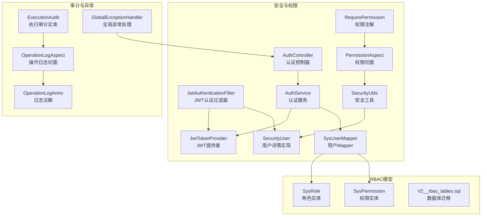
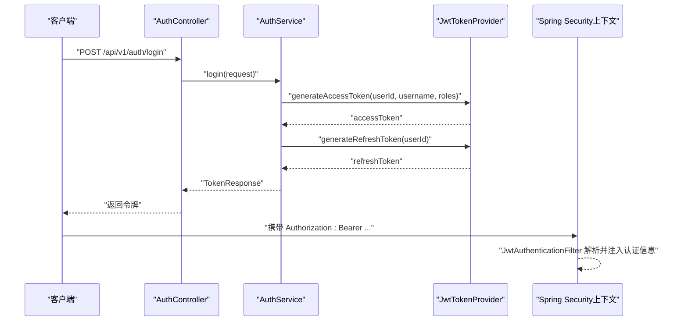
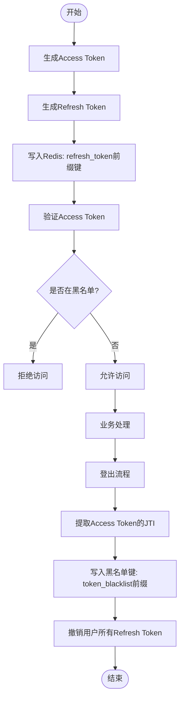
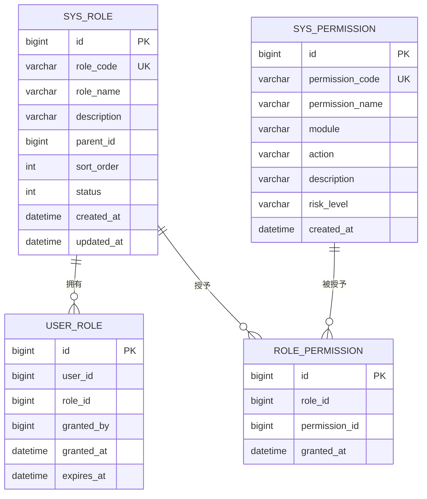
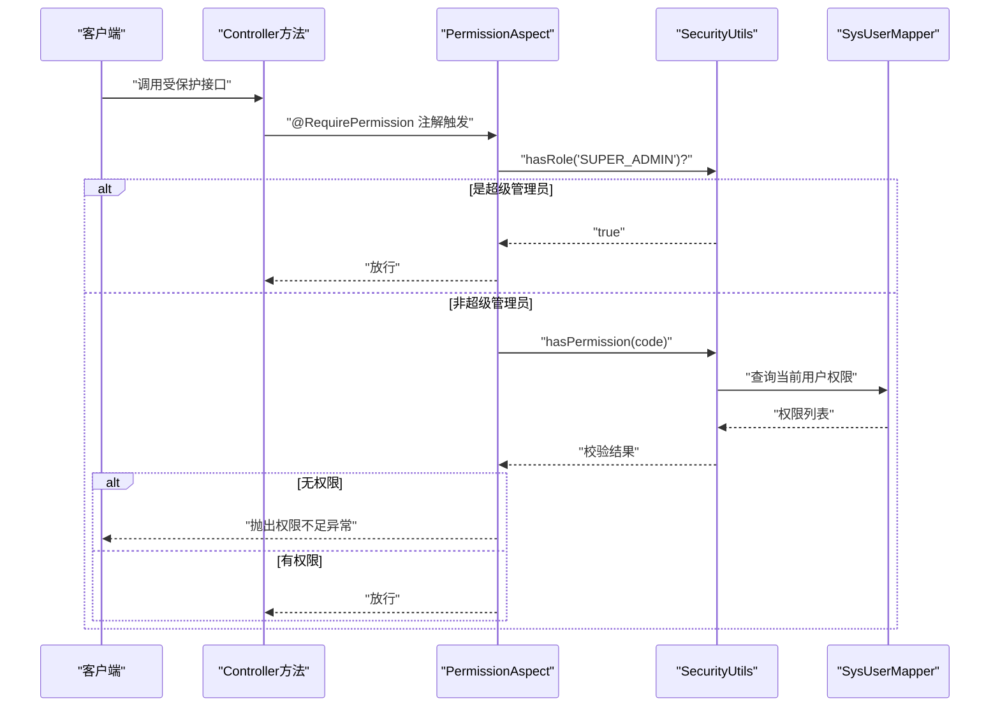
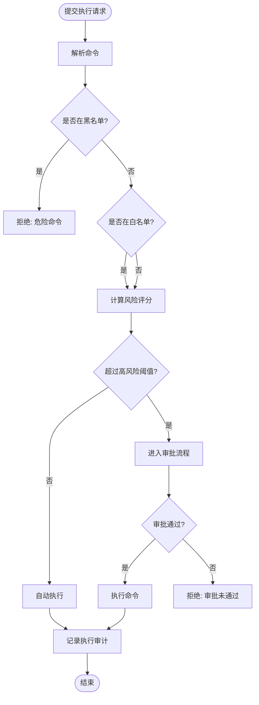
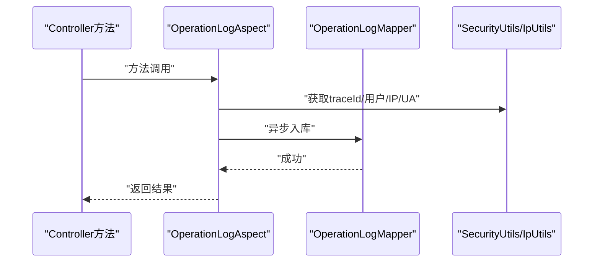
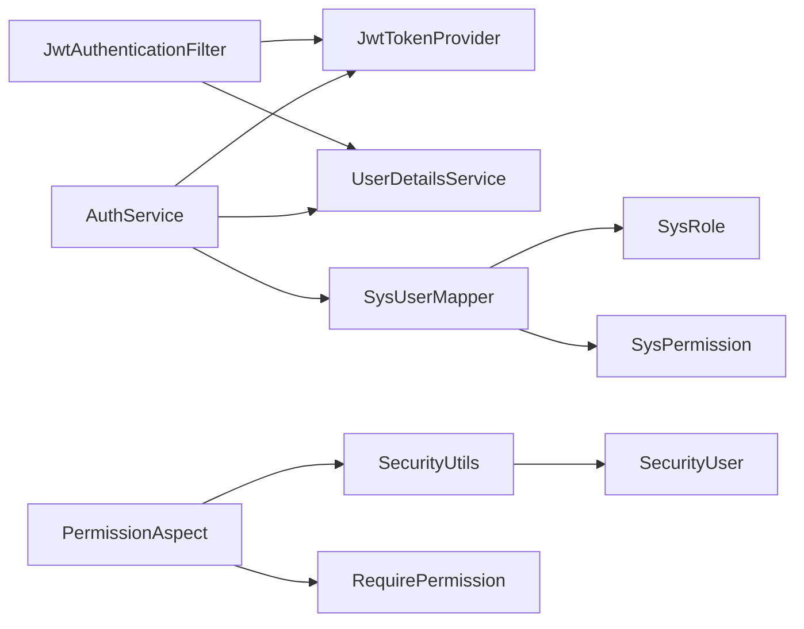

# 安全与权限管理

<cite>
**本文引用的文件**
- [JwtTokenProvider.java](file://netdata-ai-backend/src/main/java/com/netdata/ops/security/JwtTokenProvider.java)
- [JwtAuthenticationFilter.java](file://netdata-ai-backend/src/main/java/com/netdata/ops/security/JwtAuthenticationFilter.java)
- [AuthService.java](file://netdata-ai-backend/src/main/java/com/netdata/ops/service/AuthService.java)
- [AuthController.java](file://netdata-ai-backend/src/main/java/com/netdata/ops/controller/AuthController.java)
- [RequirePermission.java](file://netdata-ai-backend/src/main/java/com/netdata/ops/annotation/RequirePermission.java)
- [PermissionAspect.java](file://netdata-ai-backend/src/main/java/com/netdata/ops/aspect/PermissionAspect.java)
- [SecurityUtils.java](file://netdata-ai-backend/src/main/java/com/netdata/ops/util/SecurityUtils.java)
- [SecurityUser.java](file://netdata-ai-backend/src/main/java/com/netdata/ops/security/SecurityUser.java)
- [SysUserMapper.java](file://netdata-ai-backend/src/main/java/com/netdata/ops/mapper/SysUserMapper.java)
- [SysRole.java](file://netdata-ai-backend/src/main/java/com/netdata/ops/entity/SysRole.java)
- [SysPermission.java](file://netdata-ai-backend/src/main/java/com/netdata/ops/entity/SysPermission.java)
- [OperationLogAnno.java](file://netdata-ai-backend/src/main/java/com/netdata/ops/annotation/OperationLogAnno.java)
- [OperationLogAspect.java](file://netdata-ai-backend/src/main/java/com/netdata/ops/aspect/OperationLogAspect.java)
- [ExecutionAudit.java](file://netdata-ai-backend/src/main/java/com/netdata/ops/entity/ExecutionAudit.java)
- [application.yml](file://netdata-ai-backend/src/main/resources/application.yml)
- [V2__rbac_tables.sql](file://sql/V2__rbac_tables.sql)
- [GlobalExceptionHandler.java](file://netdata-ai-backend/src/main/java/com/netdata/ops/exception/GlobalExceptionHandler.java)
</cite>

## 目录
1. [引言](#引言)
2. [项目结构](#项目结构)
3. [核心组件](#核心组件)
4. [架构总览](#架构总览)
5. [详细组件分析](#详细组件分析)
6. [依赖分析](#依赖分析)
7. [性能考虑](#性能考虑)
8. [故障排查指南](#故障排查指南)
9. [结论](#结论)
10. [附录](#附录)

## 引言
本文件聚焦于系统的安全与权限管理，涵盖以下主题：
- JWT 令牌认证机制：生成、验证与刷新策略，结合 Redis 实现主动注销与黑名单。
- 基于角色的访问控制（RBAC）：角色、权限、用户角色与角色权限映射，动态权限检查。
- 权限拦截器：注解驱动的权限控制与 AOP 切面编程应用。
- 命令执行安全评估：危险命令识别、风险评分与人工审批流程。
- 安全配置最佳实践：密码策略、会话管理、速率限制。
- 安全审计日志：设计与实现，以及安全事件监控与响应。
- 安全漏洞预防与应急处理。

## 项目结构
后端采用 Spring Boot + Spring Security + MyBatis-Plus 架构，安全相关代码集中在 security、aspect、annotation、util、mapper、entity 等包中；RBAC 数据模型位于 SQL 迁移脚本；全局异常处理统一输出标准响应。

图表来源
- [JwtTokenProvider.java:1-204](file://netdata-ai-backend/src/main/java/com/netdata/ops/security/JwtTokenProvider.java#L1-L204)
- [JwtAuthenticationFilter.java:1-75](file://netdata-ai-backend/src/main/java/com/netdata/ops/security/JwtAuthenticationFilter.java#L1-L75)
- [AuthService.java:1-193](file://netdata-ai-backend/src/main/java/com/netdata/ops/service/AuthService.java#L1-L193)
- [AuthController.java:1-78](file://netdata-ai-backend/src/main/java/com/netdata/ops/controller/AuthController.java#L1-L78)
- [PermissionAspect.java:1-40](file://netdata-ai-backend/src/main/java/com/netdata/ops/aspect/PermissionAspect.java#L1-L40)
- [RequirePermission.java:1-20](file://netdata-ai-backend/src/main/java/com/netdata/ops/annotation/RequirePermission.java#L1-L20)
- [SecurityUtils.java:1-61](file://netdata-ai-backend/src/main/java/com/netdata/ops/util/SecurityUtils.java#L1-L61)
- [SecurityUser.java:1-69](file://netdata-ai-backend/src/main/java/com/netdata/ops/security/SecurityUser.java#L1-L69)
- [SysUserMapper.java:1-34](file://netdata-ai-backend/src/main/java/com/netdata/ops/mapper/SysUserMapper.java#L1-L34)
- [SysRole.java:1-39](file://netdata-ai-backend/src/main/java/com/netdata/ops/entity/SysRole.java#L1-L39)
- [SysPermission.java:1-46](file://netdata-ai-backend/src/main/java/com/netdata/ops/entity/SysPermission.java#L1-L46)
- [OperationLogAspect.java:1-127](file://netdata-ai-backend/src/main/java/com/netdata/ops/aspect/OperationLogAspect.java#L1-L127)
- [OperationLogAnno.java:1-29](file://netdata-ai-backend/src/main/java/com/netdata/ops/annotation/OperationLogAnno.java#L1-L29)
- [ExecutionAudit.java:1-54](file://netdata-ai-backend/src/main/java/com/netdata/ops/entity/ExecutionAudit.java#L1-L54)
- [GlobalExceptionHandler.java:1-140](file://netdata-ai-backend/src/main/java/com/netdata/ops/exception/GlobalExceptionHandler.java#L1-L140)
- [V2__rbac_tables.sql:1-256](file://sql/V2__rbac_tables.sql#L1-L256)

章节来源
- [application.yml:183-194](file://netdata-ai-backend/src/main/resources/application.yml#L183-L194)

## 核心组件
- JWT 提供者：负责 Access Token 与 Refresh Token 的生成、验证、解析、黑名单与主动注销。
- JWT 认证过滤器：从请求头提取 Bearer Token 并注入 Spring Security 上下文。
- 认证服务：登录、登出、刷新 Token，并集成账户锁定与失败计数。
- 权限注解与切面：通过注解声明权限要求，AOP 动态校验当前用户是否具备相应权限。
- 安全工具：从 SecurityContext 中便捷获取当前用户、角色与权限。
- RBAC 实体与 Mapper：角色、权限、用户角色与角色权限映射查询。
- 审计日志与异常处理：统一记录操作日志与异常响应。

章节来源
- [JwtTokenProvider.java:1-204](file://netdata-ai-backend/src/main/java/com/netdata/ops/security/JwtTokenProvider.java#L1-L204)
- [JwtAuthenticationFilter.java:1-75](file://netdata-ai-backend/src/main/java/com/netdata/ops/security/JwtAuthenticationFilter.java#L1-L75)
- [AuthService.java:1-193](file://netdata-ai-backend/src/main/java/com/netdata/ops/service/AuthService.java#L1-L193)
- [RequirePermission.java:1-20](file://netdata-ai-backend/src/main/java/com/netdata/ops/annotation/RequirePermission.java#L1-L20)
- [PermissionAspect.java:1-40](file://netdata-ai-backend/src/main/java/com/netdata/ops/aspect/PermissionAspect.java#L1-L40)
- [SecurityUtils.java:1-61](file://netdata-ai-backend/src/main/java/com/netdata/ops/util/SecurityUtils.java#L1-L61)
- [SysUserMapper.java:1-34](file://netdata-ai-backend/src/main/java/com/netdata/ops/mapper/SysUserMapper.java#L1-L34)
- [OperationLogAspect.java:1-127](file://netdata-ai-backend/src/main/java/com/netdata/ops/aspect/OperationLogAspect.java#L1-L127)
- [GlobalExceptionHandler.java:1-140](file://netdata-ai-backend/src/main/java/com/netdata/ops/exception/GlobalExceptionHandler.java#L1-L140)

## 架构总览
系统通过 Spring Security 的过滤器链接入 JWT 认证，认证成功后将用户权限注入上下文；业务层通过注解与切面进行权限校验；RBAC 数据模型支撑权限矩阵；操作日志与异常处理保障可观测性与一致性。

图表来源
- [AuthController.java:1-78](file://netdata-ai-backend/src/main/java/com/netdata/ops/controller/AuthController.java#L1-L78)
- [AuthService.java:1-193](file://netdata-ai-backend/src/main/java/com/netdata/ops/service/AuthService.java#L1-L193)
- [JwtTokenProvider.java:1-204](file://netdata-ai-backend/src/main/java/com/netdata/ops/security/JwtTokenProvider.java#L1-L204)
- [JwtAuthenticationFilter.java:1-75](file://netdata-ai-backend/src/main/java/com/netdata/ops/security/JwtAuthenticationFilter.java#L1-L75)

## 详细组件分析

### JWT 令牌认证机制
- 令牌生成
  - Access Token：包含用户标识、用户名、角色列表、签发时间与过期时间，签名算法为 HMAC-SHA。
  - Refresh Token：包含用户标识、类型标记“refresh”、签发时间与过期时间，签名算法同上。
- 令牌验证
  - Access Token：解析签名并校验黑名单；若在黑名单则判定无效。
  - Refresh Token：校验类型与主体，同时检查 Redis 中是否存在对应键值以确认未被撤销。
- 主动注销与黑名单
  - 登出时将 Access Token 的 JTI 加入黑名单，存活时长与 Token 过期时间一致。
  - 支持撤销用户所有 Refresh Token，确保会话完全失效。
- 会话与配置
  - Access Token 默认有效期与 Refresh Token 默认有效期由配置文件提供。
  - 密钥通过环境变量注入，建议生产环境强制覆盖默认密钥。

图表来源
- [JwtTokenProvider.java:47-84](file://netdata-ai-backend/src/main/java/com/netdata/ops/security/JwtTokenProvider.java#L47-L84)
- [JwtTokenProvider.java:89-107](file://netdata-ai-backend/src/main/java/com/netdata/ops/security/JwtTokenProvider.java#L89-L107)
- [JwtTokenProvider.java:153-194](file://netdata-ai-backend/src/main/java/com/netdata/ops/security/JwtTokenProvider.java#L153-L194)

章节来源
- [JwtTokenProvider.java:1-204](file://netdata-ai-backend/src/main/java/com/netdata/ops/security/JwtTokenProvider.java#L1-L204)
- [JwtAuthenticationFilter.java:1-75](file://netdata-ai-backend/src/main/java/com/netdata/ops/security/JwtAuthenticationFilter.java#L1-L75)
- [AuthService.java:1-193](file://netdata-ai-backend/src/main/java/com/netdata/ops/service/AuthService.java#L1-L193)
- [AuthController.java:1-78](file://netdata-ai-backend/src/main/java/com/netdata/ops/controller/AuthController.java#L1-L78)
- [application.yml:183-194](file://netdata-ai-backend/src/main/resources/application.yml#L183-L194)

### 基于角色的访问控制（RBAC）
- 角色与权限
  - 角色实体包含角色编码、名称、描述、状态与层级关系。
  - 权限实体包含权限编码（module:action）、模块、操作类型与风险等级。
- 用户权限映射
  - 用户-角色：user_role 表，支持角色过期时间与授权人。
  - 角色-权限：role_permission 表，支持角色继承与权限聚合。
  - 查询接口：根据用户 ID 返回角色编码与权限编码列表。
- 权限矩阵与继承
  - 初始化默认角色与权限，并建立角色到权限的映射，形成权限矩阵。
  - 支持角色层级（父角色），上级角色天然继承下级权限。

图表来源
- [SysRole.java:1-39](file://netdata-ai-backend/src/main/java/com/netdata/ops/entity/SysRole.java#L1-L39)
- [SysPermission.java:1-46](file://netdata-ai-backend/src/main/java/com/netdata/ops/entity/SysPermission.java#L1-L46)
- [SysUserMapper.java:20-32](file://netdata-ai-backend/src/main/java/com/netdata/ops/mapper/SysUserMapper.java#L20-L32)
- [V2__rbac_tables.sql:38-155](file://sql/V2__rbac_tables.sql#L38-L155)

章节来源
- [SysRole.java:1-39](file://netdata-ai-backend/src/main/java/com/netdata/ops/entity/SysRole.java#L1-L39)
- [SysPermission.java:1-46](file://netdata-ai-backend/src/main/java/com/netdata/ops/entity/SysPermission.java#L1-L46)
- [SysUserMapper.java:1-34](file://netdata-ai-backend/src/main/java/com/netdata/ops/mapper/SysUserMapper.java#L1-L34)
- [V2__rbac_tables.sql:188-256](file://sql/V2__rbac_tables.sql#L188-L256)

### 权限拦截器与注解驱动
- 注解 RequirePermission：标注在 Controller 方法上，声明所需权限编码（module:action）。
- 切面 PermissionAspect：环绕拦截带注解的方法，优先放行 SUPER_ADMIN，再调用 SecurityUtils 校验当前用户是否具备该权限。
- 安全工具 SecurityUtils：从 SecurityContext 获取当前用户，提供 hasPermission 与 hasRole 辅助方法。

图表来源
- [RequirePermission.java:1-20](file://netdata-ai-backend/src/main/java/com/netdata/ops/annotation/RequirePermission.java#L1-L20)
- [PermissionAspect.java:1-40](file://netdata-ai-backend/src/main/java/com/netdata/ops/aspect/PermissionAspect.java#L1-L40)
- [SecurityUtils.java:1-61](file://netdata-ai-backend/src/main/java/com/netdata/ops/util/SecurityUtils.java#L1-L61)
- [SysUserMapper.java:20-32](file://netdata-ai-backend/src/main/java/com/netdata/ops/mapper/SysUserMapper.java#L20-L32)

章节来源
- [RequirePermission.java:1-20](file://netdata-ai-backend/src/main/java/com/netdata/ops/annotation/RequirePermission.java#L1-L20)
- [PermissionAspect.java:1-40](file://netdata-ai-backend/src/main/java/com/netdata/ops/aspect/PermissionAspect.java#L1-L40)
- [SecurityUtils.java:1-61](file://netdata-ai-backend/src/main/java/com/netdata/ops/util/SecurityUtils.java#L1-L61)
- [SysUserMapper.java:1-34](file://netdata-ai-backend/src/main/java/com/netdata/ops/mapper/SysUserMapper.java#L1-L34)

### 命令执行安全评估机制
- 危险命令识别
  - 在配置文件中维护黑名单命令集合，命中即直接拒绝。
  - 维护白名单命令集合，仅允许白名单内的命令执行。
- 风险评分与阈值
  - 配置低、中、高风险阈值，用于动态评估命令风险得分。
- 审计与审批
  - 执行审计实体记录请求 ID、用户、命令、目标主机、风险等级、状态、审批人等。
  - 审批流程贯穿“发起 → 审批 → 执行/失败”的闭环，支持多级审批与过期控制。

图表来源
- [application.yml:149-181](file://netdata-ai-backend/src/main/resources/application.yml#L149-L181)
- [ExecutionAudit.java:1-54](file://netdata-ai-backend/src/main/java/com/netdata/ops/entity/ExecutionAudit.java#L1-L54)

章节来源
- [application.yml:149-181](file://netdata-ai-backend/src/main/resources/application.yml#L149-L181)
- [ExecutionAudit.java:1-54](file://netdata-ai-backend/src/main/java/com/netdata/ops/entity/ExecutionAudit.java#L1-L54)

### 安全配置最佳实践
- 密码策略
  - 使用强密码编码器（如 BCrypt）存储密码，登录时进行匹配校验。
- 会话管理
  - Access Token 短期有效，Refresh Token 长期有效但可主动撤销；登出时加入黑名单并撤销 Refresh Token。
- 速率限制
  - 配置默认、聊天与登录的速率限制，防止暴力破解与滥用。
- CSRF 防护
  - 当前实现基于 Token 的无状态认证，未见传统 CSRF 防护（如 CSRF Token）。建议在前端表单场景引入 CSRF Token 或采用 SameSite Cookie 策略（需在网关或过滤器层补充）。

章节来源
- [AuthService.java:1-193](file://netdata-ai-backend/src/main/java/com/netdata/ops/service/AuthService.java#L1-L193)
- [JwtTokenProvider.java:1-204](file://netdata-ai-backend/src/main/java/com/netdata/ops/security/JwtTokenProvider.java#L1-L204)
- [application.yml:183-194](file://netdata-ai-backend/src/main/resources/application.yml#L183-L194)

### 安全审计日志与事件监控
- 操作日志
  - 注解 OperationLogAnno 与切面 OperationLogAspect 自动记录模块、动作、描述、耗时、请求参数、状态与错误信息。
  - 异步落库，避免阻塞主流程。
- 异常监控
  - 全局异常处理器统一捕获认证、权限、参数等异常，输出标准化响应。
- 链路追踪
  - 日志模式包含 traceId，便于跨服务串联定位问题。

图表来源
- [OperationLogAnno.java:1-29](file://netdata-ai-backend/src/main/java/com/netdata/ops/annotation/OperationLogAnno.java#L1-L29)
- [OperationLogAspect.java:1-127](file://netdata-ai-backend/src/main/java/com/netdata/ops/aspect/OperationLogAspect.java#L1-L127)
- [GlobalExceptionHandler.java:1-140](file://netdata-ai-backend/src/main/java/com/netdata/ops/exception/GlobalExceptionHandler.java#L1-L140)

章节来源
- [OperationLogAspect.java:1-127](file://netdata-ai-backend/src/main/java/com/netdata/ops/aspect/OperationLogAspect.java#L1-L127)
- [OperationLogAnno.java:1-29](file://netdata-ai-backend/src/main/java/com/netdata/ops/annotation/OperationLogAnno.java#L1-L29)
- [GlobalExceptionHandler.java:1-140](file://netdata-ai-backend/src/main/java/com/netdata/ops/exception/GlobalExceptionHandler.java#L1-L140)
- [application.yml:228-239](file://netdata-ai-backend/src/main/resources/application.yml#L228-L239)

## 依赖分析
- 组件耦合
  - JwtAuthenticationFilter 依赖 JwtTokenProvider 与 UserDetailsService，负责将用户信息注入 SecurityContext。
  - AuthService 依赖 JwtTokenProvider、PasswordEncoder 与 SysUserMapper，协调认证与会话生命周期。
  - PermissionAspect 依赖 SecurityUtils 与注解 RequirePermission，实现运行时权限校验。
  - SysUserMapper 提供 RBAC 查询能力，支撑权限矩阵。
- 外部依赖
  - Redis：存储 Refresh Token 与黑名单键，支持主动注销与黑名单校验。
  - MySQL：RBAC 数据模型与审计日志持久化。
  - Jackson：序列化请求参数以便记录。

图表来源
- [JwtAuthenticationFilter.java:1-75](file://netdata-ai-backend/src/main/java/com/netdata/ops/security/JwtAuthenticationFilter.java#L1-L75)
- [JwtTokenProvider.java:1-204](file://netdata-ai-backend/src/main/java/com/netdata/ops/security/JwtTokenProvider.java#L1-L204)
- [AuthService.java:1-193](file://netdata-ai-backend/src/main/java/com/netdata/ops/service/AuthService.java#L1-L193)
- [PermissionAspect.java:1-40](file://netdata-ai-backend/src/main/java/com/netdata/ops/aspect/PermissionAspect.java#L1-L40)
- [SecurityUtils.java:1-61](file://netdata-ai-backend/src/main/java/com/netdata/ops/util/SecurityUtils.java#L1-L61)
- [SysUserMapper.java:1-34](file://netdata-ai-backend/src/main/java/com/netdata/ops/mapper/SysUserMapper.java#L1-L34)

章节来源
- [JwtAuthenticationFilter.java:1-75](file://netdata-ai-backend/src/main/java/com/netdata/ops/security/JwtAuthenticationFilter.java#L1-L75)
- [JwtTokenProvider.java:1-204](file://netdata-ai-backend/src/main/java/com/netdata/ops/security/JwtTokenProvider.java#L1-L204)
- [AuthService.java:1-193](file://netdata-ai-backend/src/main/java/com/netdata/ops/service/AuthService.java#L1-L193)
- [PermissionAspect.java:1-40](file://netdata-ai-backend/src/main/java/com/netdata/ops/aspect/PermissionAspect.java#L1-L40)
- [SecurityUtils.java:1-61](file://netdata-ai-backend/src/main/java/com/netdata/ops/util/SecurityUtils.java#L1-L61)
- [SysUserMapper.java:1-34](file://netdata-ai-backend/src/main/java/com/netdata/ops/mapper/SysUserMapper.java#L1-L34)

## 性能考虑
- Redis 缓存
  - Refresh Token 与黑名单键均使用 TTL 控制，避免内存泄漏；建议监控键空间与过期策略。
- 异步日志
  - 操作日志切面采用异步入库，降低对主流程的影响。
- 速率限制
  - 配置合理的限流阈值，避免突发流量导致系统抖动。
- 查询优化
  - RBAC 查询使用内连接与索引字段（角色状态、过期时间、模块与风险等级），建议在高并发场景下开启连接池与慢查询日志。

## 故障排查指南
- 认证失败
  - 检查用户名/密码是否正确，关注账户锁定与失败计数。
  - 确认 JWT 密钥与过期时间配置是否一致。
- 权限不足
  - 确认用户角色与权限映射是否正确，检查 SUPER_ADMIN 是否放行。
  - 核对注解权限编码格式（module:action）。
- Token 无效或过期
  - 检查黑名单键是否存在，确认登出流程是否正确执行。
  - 校验 Refresh Token 是否存在且未过期。
- 审计缺失
  - 检查 OperationLogAspect 是否生效，确认注解使用与切点表达式。
  - 关注异步入库异常与日志级别。

章节来源
- [AuthService.java:1-193](file://netdata-ai-backend/src/main/java/com/netdata/ops/service/AuthService.java#L1-L193)
- [JwtTokenProvider.java:1-204](file://netdata-ai-backend/src/main/java/com/netdata/ops/security/JwtTokenProvider.java#L1-L204)
- [PermissionAspect.java:1-40](file://netdata-ai-backend/src/main/java/com/netdata/ops/aspect/PermissionAspect.java#L1-L40)
- [OperationLogAspect.java:1-127](file://netdata-ai-backend/src/main/java/com/netdata/ops/aspect/OperationLogAspect.java#L1-L127)
- [GlobalExceptionHandler.java:1-140](file://netdata-ai-backend/src/main/java/com/netdata/ops/exception/GlobalExceptionHandler.java#L1-L140)

## 结论
本系统通过 JWT 无状态认证与 RBAC 权限模型实现了细粒度的访问控制，并借助注解与 AOP 实现了声明式的权限拦截。配合 Redis 的主动注销与黑名单机制、完善的审计日志与全局异常处理，形成了较为完整的安全体系。建议在后续增强 CSRF 防护与更细粒度的资源级权限控制，以进一步提升安全性与合规性。

## 附录
- 配置要点
  - JWT 密钥、Access/Refresh 过期时间、速率限制阈值均在配置文件中集中管理。
- 数据模型
  - RBAC 表结构清晰，支持角色继承与权限矩阵，初始化数据覆盖常见模块与风险等级。
- 审计范围
  - 操作日志覆盖模块、动作、耗时、请求参数与错误信息，便于事后追溯。

章节来源
- [application.yml:149-194](file://netdata-ai-backend/src/main/resources/application.yml#L149-L194)
- [V2__rbac_tables.sql:188-256](file://sql/V2__rbac_tables.sql#L188-L256)