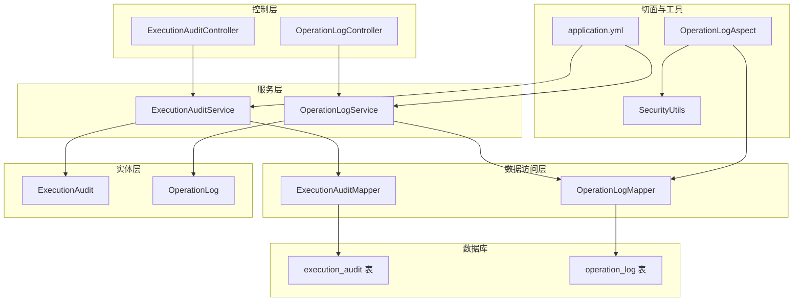
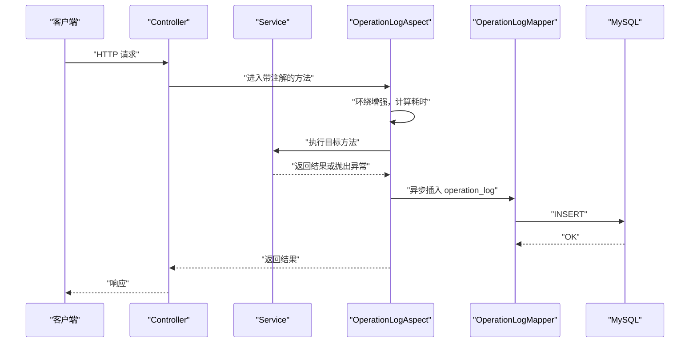
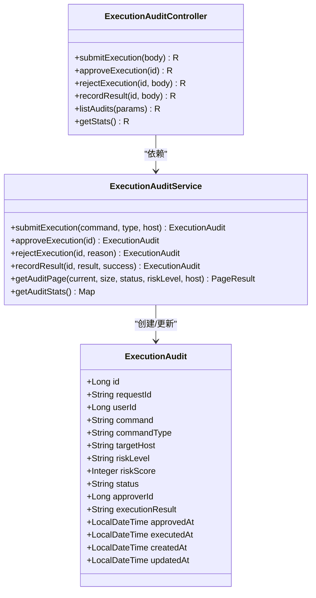
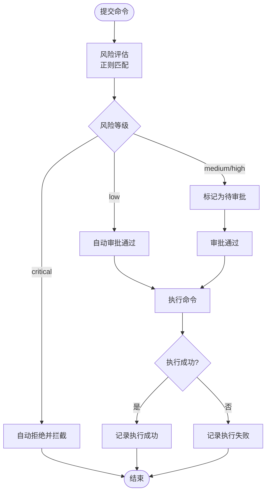
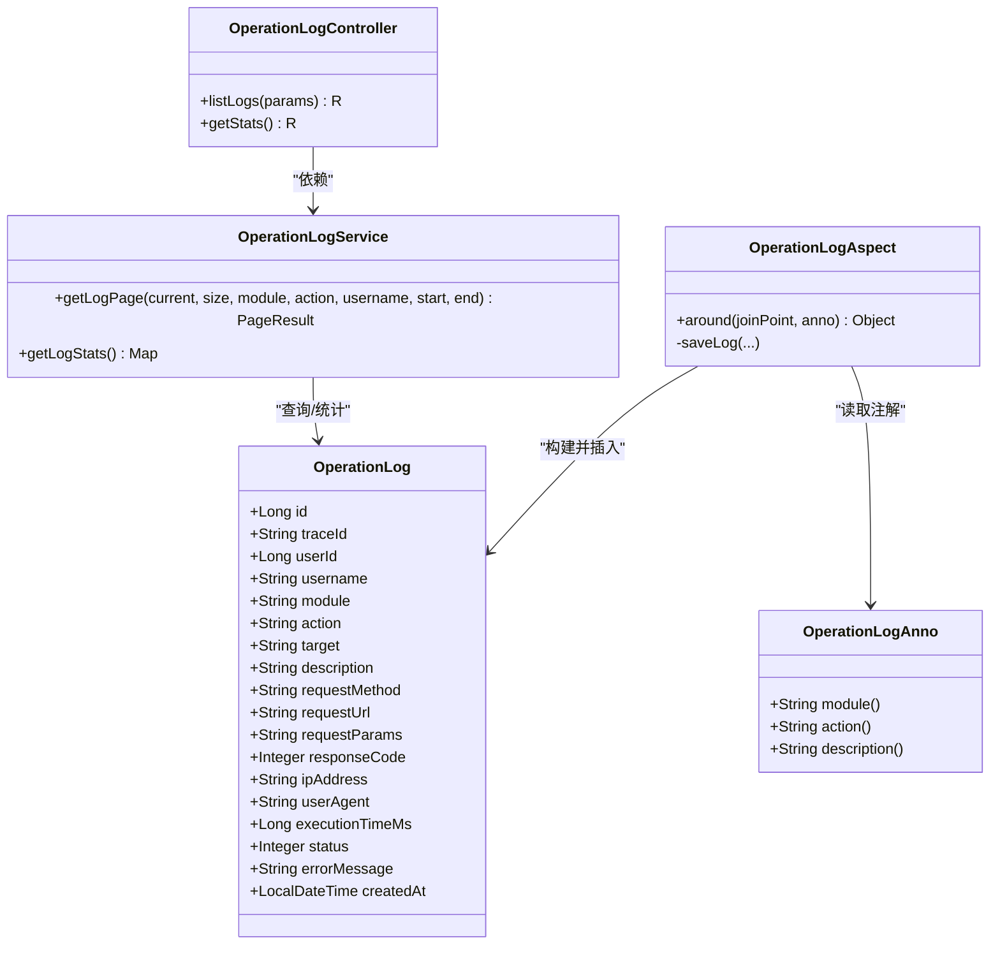
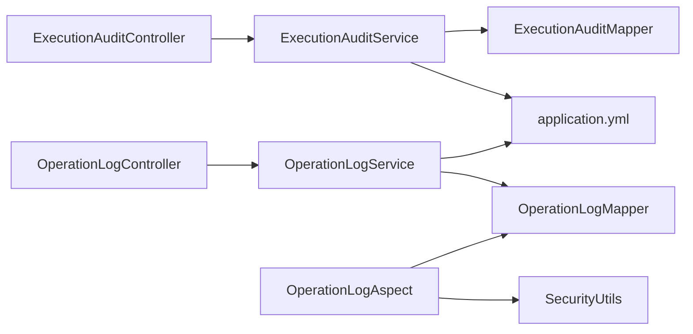

# 安全审计日志

<cite>
**本文引用的文件**   
- [ExecutionAudit.java](file://netdata-ai-backend/src/main/java/com/netdata/ops/entity/ExecutionAudit.java)
- [OperationLog.java](file://netdata-ai-backend/src/main/java/com/netdata/ops/entity/OperationLog.java)
- [ExecutionAuditService.java](file://netdata-ai-backend/src/main/java/com/netdata/ops/service/ExecutionAuditService.java)
- [OperationLogService.java](file://netdata-ai-backend/src/main/java/com/netdata/ops/service/OperationLogService.java)
- [ExecutionAuditController.java](file://netdata-ai-backend/src/main/java/com/netdata/ops/controller/ExecutionAuditController.java)
- [OperationLogController.java](file://netdata-ai-backend/src/main/java/com/netdata/ops/controller/OperationLogController.java)
- [ExecutionAuditMapper.java](file://netdata-ai-backend/src/main/java/com/netdata/ops/mapper/ExecutionAuditMapper.java)
- [OperationLogMapper.java](file://netdata-ai-backend/src/main/java/com/netdata/ops/mapper/OperationLogMapper.java)
- [OperationLogAspect.java](file://netdata-ai-backend/src/main/java/com/netdata/ops/aspect/OperationLogAspect.java)
- [OperationLogAnno.java](file://netdata-ai-backend/src/main/java/com/netdata/ops/annotation/OperationLogAnno.java)
- [SecurityUtils.java](file://netdata-ai-backend/src/main/java/com/netdata/ops/util/SecurityUtils.java)
- [application.yml](file://netdata-ai-backend/src/main/resources/application.yml)
- [init.sql](file://sql/init.sql)
- [NetDataOpsApplication.java](file://netdata-ai-backend/src/main/java/com/netdata/ops/NetDataOpsApplication.java)
- [AgentAuditLogger.java](file://netdata-ai-backend/src/main/java/com/netdata/ops/core/agent/AgentAuditLogger.java)
- [shared-safety-constraints.md](file://docs/prompts/shared-safety-constraints.md)
</cite>

## 目录
1. [简介](#简介)
2. [项目结构](#项目结构)
3. [核心组件](#核心组件)
4. [架构总览](#架构总览)
5. [详细组件分析](#详细组件分析)
6. [依赖分析](#依赖分析)
7. [性能考量](#性能考量)
8. [故障排查指南](#故障排查指南)
9. [结论](#结论)
10. [附录](#附录)

## 简介
本技术文档围绕“安全审计日志系统”展开，聚焦于以下目标：
- 设计原则：日志完整性、不可否认性、可追溯性
- 操作日志记录机制：用户操作跟踪、系统事件记录、异常行为监控
- 执行审计实现：命令执行记录、权限变更审计、敏感操作审计
- 数据结构设计：字段定义、数据类型、索引策略
- 查询与分析：日志检索、统计分析、报表生成
- 存储与归档：持久化策略、备份与恢复方案
- 实践示例：在业务逻辑中记录审计日志、批量写入与异步处理

系统以 Spring Boot 为基础，结合 AOP 自动采集操作日志，提供 REST 接口查询与统计；同时内置命令执行审计能力，支持风险评估、审批流与结果记录。

## 项目结构
后端采用分层架构：控制层（Controller）、服务层（Service）、数据访问层（Mapper）、实体层（Entity）、切面与工具（Aspect/Util）。

图表来源
- [ExecutionAuditController.java:1-94](file://netdata-ai-backend/src/main/java/com/netdata/ops/controller/ExecutionAuditController.java#L1-L94)
- [OperationLogController.java:1-49](file://netdata-ai-backend/src/main/java/com/netdata/ops/controller/OperationLogController.java#L1-L49)
- [ExecutionAuditService.java:1-297](file://netdata-ai-backend/src/main/java/com/netdata/ops/service/ExecutionAuditService.java#L1-L297)
- [OperationLogService.java:1-80](file://netdata-ai-backend/src/main/java/com/netdata/ops/service/OperationLogService.java#L1-L80)
- [ExecutionAuditMapper.java:1-10](file://netdata-ai-backend/src/main/java/com/netdata/ops/mapper/ExecutionAuditMapper.java#L1-L10)
- [OperationLogMapper.java:1-10](file://netdata-ai-backend/src/main/java/com/netdata/ops/mapper/OperationLogMapper.java#L1-L10)
- [ExecutionAudit.java:1-54](file://netdata-ai-backend/src/main/java/com/netdata/ops/entity/ExecutionAudit.java#L1-L54)
- [OperationLog.java:1-56](file://netdata-ai-backend/src/main/java/com/netdata/ops/entity/OperationLog.java#L1-L56)
- [OperationLogAspect.java:1-127](file://netdata-ai-backend/src/main/java/com/netdata/ops/aspect/OperationLogAspect.java#L1-L127)
- [SecurityUtils.java:1-61](file://netdata-ai-backend/src/main/java/com/netdata/ops/util/SecurityUtils.java#L1-L61)
- [application.yml:1-314](file://netdata-ai-backend/src/main/resources/application.yml#L1-L314)

章节来源
- [NetDataOpsApplication.java:1-36](file://netdata-ai-backend/src/main/java/com/netdata/ops/NetDataOpsApplication.java#L1-L36)
- [application.yml:1-314](file://netdata-ai-backend/src/main/resources/application.yml#L1-L314)

## 核心组件
- 执行审计实体与服务：负责命令风险评估、审批流、执行结果记录与统计
- 操作日志实体与服务：负责自动采集用户操作日志、分页查询与统计
- 控制器：提供 REST 接口，统一鉴权与权限校验
- 切面：基于注解的 AOP 自动记录操作日志，异步落库
- 工具：安全上下文工具类，提供当前用户信息与权限判断
- 配置：数据源、MyBatis-Plus、日志、执行安全策略等

章节来源
- [ExecutionAudit.java:1-54](file://netdata-ai-backend/src/main/java/com/netdata/ops/entity/ExecutionAudit.java#L1-L54)
- [OperationLog.java:1-56](file://netdata-ai-backend/src/main/java/com/netdata/ops/entity/OperationLog.java#L1-L56)
- [ExecutionAuditService.java:1-297](file://netdata-ai-backend/src/main/java/com/netdata/ops/service/ExecutionAuditService.java#L1-L297)
- [OperationLogService.java:1-80](file://netdata-ai-backend/src/main/java/com/netdata/ops/service/OperationLogService.java#L1-L80)
- [ExecutionAuditController.java:1-94](file://netdata-ai-backend/src/main/java/com/netdata/ops/controller/ExecutionAuditController.java#L1-L94)
- [OperationLogController.java:1-49](file://netdata-ai-backend/src/main/java/com/netdata/ops/controller/OperationLogController.java#L1-L49)
- [OperationLogAspect.java:1-127](file://netdata-ai-backend/src/main/java/com/netdata/ops/aspect/OperationLogAspect.java#L1-L127)
- [SecurityUtils.java:1-61](file://netdata-ai-backend/src/main/java/com/netdata/ops/util/SecurityUtils.java#L1-L61)

## 架构总览
系统通过注解驱动的 AOP 切面自动采集操作日志，写入 operation_log 表；执行审计通过专用服务与控制器管理命令风险评估、审批与结果记录，写入 execution_audit 表。所有写入均通过 MyBatis-Plus Mapper 进行，配合 Spring Async 实现异步落库，降低对主流程的影响。

图表来源
- [OperationLogAspect.java:37-53](file://netdata-ai-backend/src/main/java/com/netdata/ops/aspect/OperationLogAspect.java#L37-L53)
- [OperationLogAspect.java:55-109](file://netdata-ai-backend/src/main/java/com/netdata/ops/aspect/OperationLogAspect.java#L55-L109)
- [OperationLogMapper.java:1-10](file://netdata-ai-backend/src/main/java/com/netdata/ops/mapper/OperationLogMapper.java#L1-L10)
- [OperationLogController.java:28-40](file://netdata-ai-backend/src/main/java/com/netdata/ops/controller/OperationLogController.java#L28-L40)

## 详细组件分析

### 执行审计（命令执行审计）
- 功能要点
  - 风险评估：内置正则规则匹配高危、中危、低危命令，输出风险等级与分数
  - 审批流：低风险自动通过，高危直接拦截，中高风险进入审批队列
  - 结果记录：支持记录执行成功/失败、审批人、审批时间、执行时间等
  - 统计分析：提供状态分布、风险分布、总量等统计接口
- 关键流程
  - 提交执行 → 风险评估 → 状态判定（自动/待审批/拒绝）→ 审批/执行 → 结果记录
- 数据模型
  - 表名：execution_audit
  - 关键字段：request_id、user_id、command、command_type、target_host、risk_level、risk_score、status、approver_id、approved_at、execution_result、created_at、updated_at
  - 索引：唯一索引（request_id）、普通索引（user_id、status、risk_level、created_at）

图表来源
- [ExecutionAudit.java:1-54](file://netdata-ai-backend/src/main/java/com/netdata/ops/entity/ExecutionAudit.java#L1-L54)
- [ExecutionAuditService.java:65-103](file://netdata-ai-backend/src/main/java/com/netdata/ops/service/ExecutionAuditService.java#L65-L103)
- [ExecutionAuditService.java:108-173](file://netdata-ai-backend/src/main/java/com/netdata/ops/service/ExecutionAuditService.java#L108-L173)
- [ExecutionAuditController.java:26-77](file://netdata-ai-backend/src/main/java/com/netdata/ops/controller/ExecutionAuditController.java#L26-L77)

图表来源
- [ExecutionAuditService.java:65-103](file://netdata-ai-backend/src/main/java/com/netdata/ops/service/ExecutionAuditService.java#L65-L103)
- [ExecutionAuditService.java:108-173](file://netdata-ai-backend/src/main/java/com/netdata/ops/service/ExecutionAuditService.java#L108-L173)
- [ExecutionAuditService.java:237-275](file://netdata-ai-backend/src/main/java/com/netdata/ops/service/ExecutionAuditService.java#L237-L275)

章节来源
- [ExecutionAuditService.java:1-297](file://netdata-ai-backend/src/main/java/com/netdata/ops/service/ExecutionAuditService.java#L1-L297)
- [ExecutionAuditController.java:1-94](file://netdata-ai-backend/src/main/java/com/netdata/ops/controller/ExecutionAuditController.java#L1-L94)
- [init.sql:112-138](file://sql/init.sql#L112-L138)

### 操作日志（用户操作跟踪）
- 功能要点
  - 自动采集：通过 @OperationLogAnno 注解与 OperationLogAspect 切面自动记录
  - 异步写入：避免阻塞主业务流程
  - 字段丰富：包含 traceId、用户信息、请求方法/URL/IP/User-Agent、请求参数、执行耗时、结果状态、错误信息等
  - 查询统计：支持按模块/动作/用户名/时间范围分页查询与今日统计
- 数据模型
  - 表名：operation_log
  - 关键字段：traceId、userId、username、module、action、target、description、requestMethod、requestUrl、requestParams、responseCode、ipAddress、userAgent、executionTimeMs、status、errorMessage、createdAt
  - 索引：traceId、userId、module+action、created_at

图表来源
- [OperationLog.java:1-56](file://netdata-ai-backend/src/main/java/com/netdata/ops/entity/OperationLog.java#L1-L56)
- [OperationLogService.java:29-55](file://netdata-ai-backend/src/main/java/com/netdata/ops/service/OperationLogService.java#L29-L55)
- [OperationLogController.java:28-47](file://netdata-ai-backend/src/main/java/com/netdata/ops/controller/OperationLogController.java#L28-L47)
- [OperationLogAspect.java:37-53](file://netdata-ai-backend/src/main/java/com/netdata/ops/aspect/OperationLogAspect.java#L37-L53)
- [OperationLogAspect.java:55-109](file://netdata-ai-backend/src/main/java/com/netdata/ops/aspect/OperationLogAspect.java#L55-L109)
- [OperationLogAnno.java:1-29](file://netdata-ai-backend/src/main/java/com/netdata/ops/annotation/OperationLogAnno.java#L1-L29)

章节来源
- [OperationLogService.java:1-80](file://netdata-ai-backend/src/main/java/com/netdata/ops/service/OperationLogService.java#L1-L80)
- [OperationLogController.java:1-49](file://netdata-ai-backend/src/main/java/com/netdata/ops/controller/OperationLogController.java#L1-L49)
- [OperationLogAspect.java:1-127](file://netdata-ai-backend/src/main/java/com/netdata/ops/aspect/OperationLogAspect.java#L1-L127)
- [OperationLogAnno.java:1-29](file://netdata-ai-backend/src/main/java/com/netdata/ops/annotation/OperationLogAnno.java#L1-L29)
- [init.sql:165-185](file://sql/init.sql#L165-L185)

### 权限与安全工具
- SecurityUtils：从 Spring Security 上下文中获取当前用户 ID/用户名与权限集合，用于日志与审计记录
- 应用配置：application.yml 中定义了数据源、MyBatis-Plus、日志格式、执行安全策略（黑名单/白名单/风险阈值）等

章节来源
- [SecurityUtils.java:1-61](file://netdata-ai-backend/src/main/java/com/netdata/ops/util/SecurityUtils.java#L1-L61)
- [application.yml:159-189](file://netdata-ai-backend/src/main/resources/application.yml#L159-L189)

### Agent 审计日志（扩展能力）
- AgentAuditLogger：为 Agent 执行提供结构化审计日志，支持异步写入 SLF4J JSON 与 MySQL，满足合规审计与性能分析需求
- 设计原则：双通道写入、异步非阻塞、线程安全、字段完备（traceId、userId、toolCalls、durationMs、success、errorMessage、timestamp）

章节来源
- [AgentAuditLogger.java:1-140](file://netdata-ai-backend/src/main/java/com/netdata/ops/core/agent/AgentAuditLogger.java#L1-L140)
- [shared-safety-constraints.md:296-325](file://docs/prompts/shared-safety-constraints.md#L296-L325)

## 依赖分析
- 控制器依赖服务：通过构造注入方式依赖对应 Service
- 服务依赖 Mapper：通过 MyBatis-Plus 接口完成 CRUD
- 切面依赖 Mapper 与工具类：自动采集并异步写入
- 配置依赖：application.yml 提供数据源、MyBatis-Plus、日志与执行安全策略

图表来源
- [ExecutionAuditController.java:24-24](file://netdata-ai-backend/src/main/java/com/netdata/ops/controller/ExecutionAuditController.java#L24-L24)
- [OperationLogController.java:26-26](file://netdata-ai-backend/src/main/java/com/netdata/ops/controller/OperationLogController.java#L26-L26)
- [ExecutionAuditService.java:29-29](file://netdata-ai-backend/src/main/java/com/netdata/ops/service/ExecutionAuditService.java#L29-L29)
- [OperationLogService.java:24-24](file://netdata-ai-backend/src/main/java/com/netdata/ops/service/OperationLogService.java#L24-L24)
- [OperationLogAspect.java:34-35](file://netdata-ai-backend/src/main/java/com/netdata/ops/aspect/OperationLogAspect.java#L34-L35)
- [SecurityUtils.java:17-39](file://netdata-ai-backend/src/main/java/com/netdata/ops/util/SecurityUtils.java#L17-L39)
- [application.yml:31-42](file://netdata-ai-backend/src/main/resources/application.yml#L31-L42)

章节来源
- [ExecutionAuditController.java:1-94](file://netdata-ai-backend/src/main/java/com/netdata/ops/controller/ExecutionAuditController.java#L1-L94)
- [OperationLogController.java:1-49](file://netdata-ai-backend/src/main/java/com/netdata/ops/controller/OperationLogController.java#L1-L49)
- [ExecutionAuditService.java:1-297](file://netdata-ai-backend/src/main/java/com/netdata/ops/service/ExecutionAuditService.java#L1-L297)
- [OperationLogService.java:1-80](file://netdata-ai-backend/src/main/java/com/netdata/ops/service/OperationLogService.java#L1-L80)
- [OperationLogAspect.java:1-127](file://netdata-ai-backend/src/main/java/com/netdata/ops/aspect/OperationLogAspect.java#L1-L127)
- [SecurityUtils.java:1-61](file://netdata-ai-backend/src/main/java/com/netdata/ops/util/SecurityUtils.java#L1-L61)
- [application.yml:1-314](file://netdata-ai-backend/src/main/resources/application.yml#L1-L314)

## 性能考量
- 异步写入：OperationLogAspect 使用异步写入，避免阻塞主业务流程
- 参数截断：对请求参数与错误信息进行长度截断，防止超长文本导致写入失败或性能下降
- 索引优化：execution_audit 与 operation_log 均建立常用查询字段索引，提升分页与过滤效率
- 连接池：HikariCP 连接池参数合理配置，保障并发写入稳定性
- 日志轮转：application.yml 中配置日志文件大小与保留天数，避免磁盘压力

章节来源
- [OperationLogAspect.java:104-125](file://netdata-ai-backend/src/main/java/com/netdata/ops/aspect/OperationLogAspect.java#L104-L125)
- [application.yml:36-42](file://netdata-ai-backend/src/main/resources/application.yml#L36-L42)
- [init.sql:134-137](file://sql/init.sql#L134-L137)
- [init.sql:181-184](file://sql/init.sql#L181-L184)

## 故障排查指南
- 操作日志未记录
  - 检查方法是否标注 @OperationLogAnno 注解
  - 确认切面已启用（@EnableAspectJAutoProxy 或 Spring Boot 自动装配）
  - 查看日志中是否有“操作日志保存失败”的告警
- 审计记录缺失
  - 确认 Mapper 是否正确注入与 SQL 映射
  - 检查数据库连接与表结构是否一致
- 风险评估异常
  - 检查命令是否命中黑名单/白名单规则
  - 核对正则表达式是否覆盖预期场景
- 权限不足
  - 确认接口上的权限注解与用户权限是否匹配
  - 检查 SecurityUtils 是否能正确解析当前用户

章节来源
- [OperationLogAspect.java:106-108](file://netdata-ai-backend/src/main/java/com/netdata/ops/aspect/OperationLogAspect.java#L106-L108)
- [ExecutionAuditService.java:113-118](file://netdata-ai-backend/src/main/java/com/netdata/ops/service/ExecutionAuditService.java#L113-L118)
- [SecurityUtils.java:44-49](file://netdata-ai-backend/src/main/java/com/netdata/ops/util/SecurityUtils.java#L44-L49)

## 结论
本系统通过注解驱动的 AOP 自动采集操作日志，结合执行审计服务实现命令风险评估与审批闭环，满足日志完整性、不可否认性与可追溯性的设计目标。配合完善的索引策略与异步写入机制，兼顾性能与可靠性。建议在生产环境中持续优化规则库、完善权限体系，并定期进行日志归档与备份演练。

## 附录

### 数据结构设计与索引策略
- execution_audit 表
  - 字段：id、request_id（唯一）、user_id、command、command_type、target_host、risk_level、risk_score、status、approver_id、approved_at、execution_result、error_message、execution_time_ms、created_at、updated_at
  - 索引：uk_request_id、idx_user_id、idx_status、idx_risk_level、idx_created_at
- operation_log 表
  - 字段：id、traceId、userId、username、module、action、target、description、requestMethod、requestUrl、requestParams、responseCode、ipAddress、userAgent、executionTimeMs、status、errorMessage、createdAt
  - 索引：idx_trace_id、idx_user_id、idx_module_action、idx_created_at

章节来源
- [init.sql:112-138](file://sql/init.sql#L112-L138)
- [init.sql:165-185](file://sql/init.sql#L165-L185)

### 查询与分析功能
- 执行审计查询
  - 支持按状态、风险等级、目标主机分页查询
  - 提供统计接口：各状态计数、风险分布、总量
- 操作日志查询
  - 支持按模块、动作、用户名、时间范围分页查询
  - 提供统计接口：今日操作数、今日失败数、总量

章节来源
- [ExecutionAuditService.java:177-196](file://netdata-ai-backend/src/main/java/com/netdata/ops/service/ExecutionAuditService.java#L177-L196)
- [OperationLogService.java:29-55](file://netdata-ai-backend/src/main/java/com/netdata/ops/service/OperationLogService.java#L29-L55)
- [ExecutionAuditController.java:60-77](file://netdata-ai-backend/src/main/java/com/netdata/ops/controller/ExecutionAuditController.java#L60-L77)
- [OperationLogController.java:42-47](file://netdata-ai-backend/src/main/java/com/netdata/ops/controller/OperationLogController.java#L42-L47)

### 存储策略与归档机制
- 持久化：MySQL InnoDB 表，MyBatis-Plus ORM
- 归档建议：基于 created_at 建立分区或冷热分离，定期将历史数据迁移至归档库
- 备份与恢复：建议采用数据库快照/逻辑备份策略，结合只读副本进行灾备演练

章节来源
- [application.yml:31-42](file://netdata-ai-backend/src/main/resources/application.yml#L31-L42)
- [init.sql:112-138](file://sql/init.sql#L112-L138)
- [init.sql:165-185](file://sql/init.sql#L165-L185)

### 代码示例（路径指引）
- 在业务逻辑中记录操作日志
  - 在 Controller 方法上添加 @OperationLogAnno 注解，切面将自动采集并异步写入
  - 示例路径：[OperationLogAnno.java:1-29](file://netdata-ai-backend/src/main/java/com/netdata/ops/annotation/OperationLogAnno.java#L1-L29)，[OperationLogAspect.java:37-53](file://netdata-ai-backend/src/main/java/com/netdata/ops/aspect/OperationLogAspect.java#L37-L53)
- 实现日志的批量写入与异步处理
  - 切面内部使用异步写入，避免阻塞主流程
  - 示例路径：[OperationLogAspect.java:104-109](file://netdata-ai-backend/src/main/java/com/netdata/ops/aspect/OperationLogAspect.java#L104-L109)
- 记录执行审计
  - 提交执行 → 风险评估 → 审批/执行 → 结果记录
  - 示例路径：[ExecutionAuditService.java:65-103](file://netdata-ai-backend/src/main/java/com/netdata/ops/service/ExecutionAuditService.java#L65-L103)，[ExecutionAuditController.java:26-58](file://netdata-ai-backend/src/main/java/com/netdata/ops/controller/ExecutionAuditController.java#L26-L58)