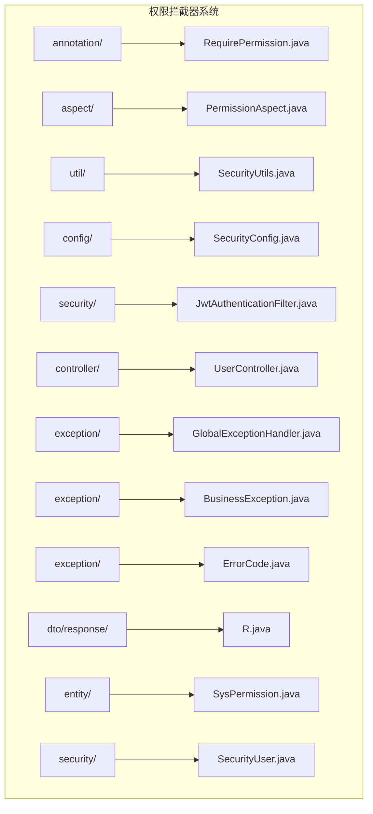
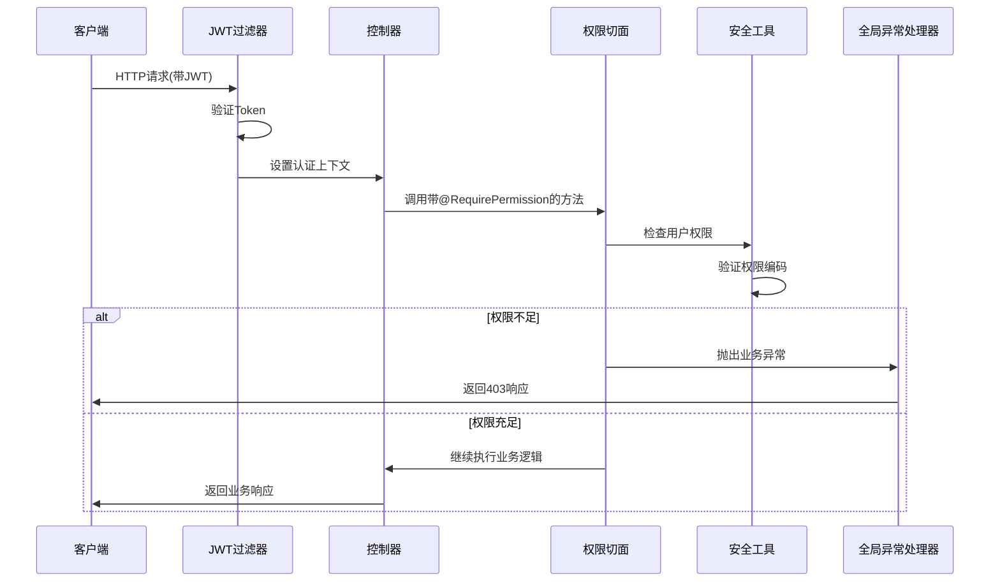
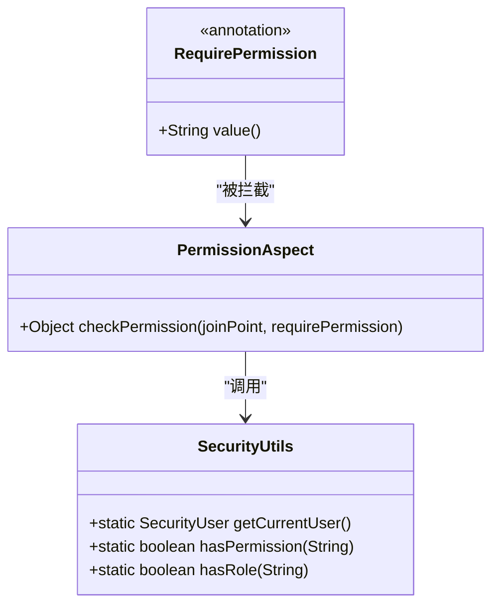
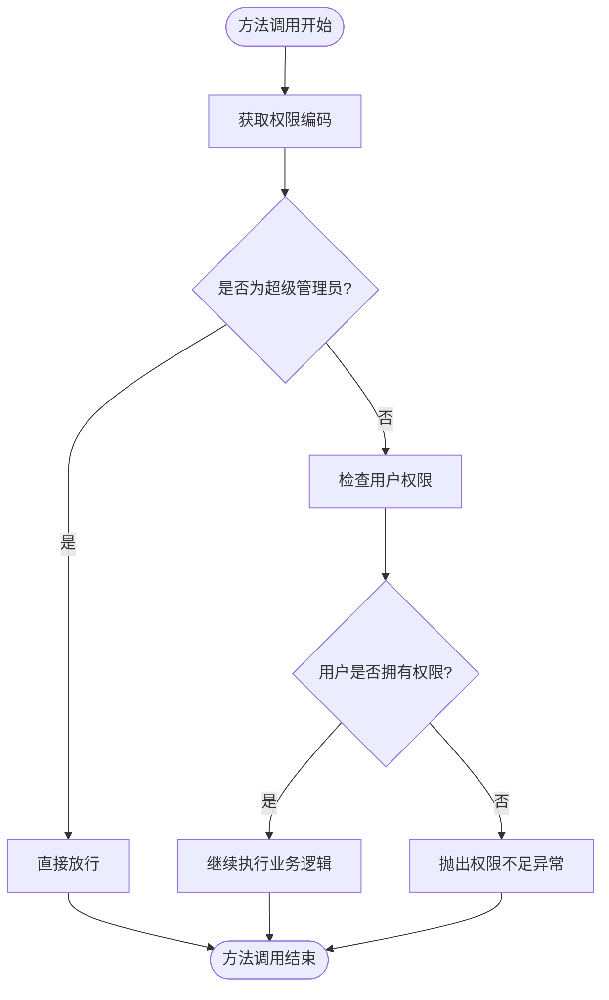
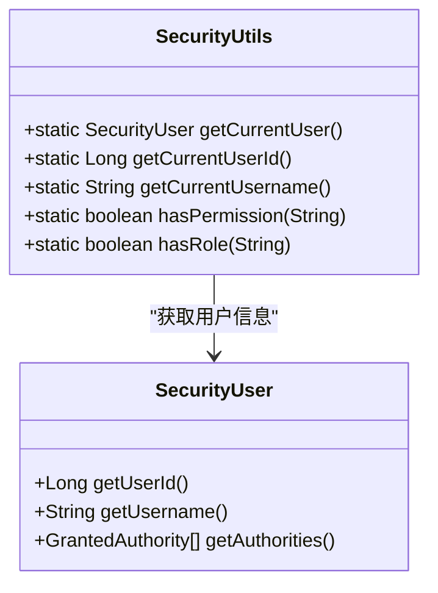
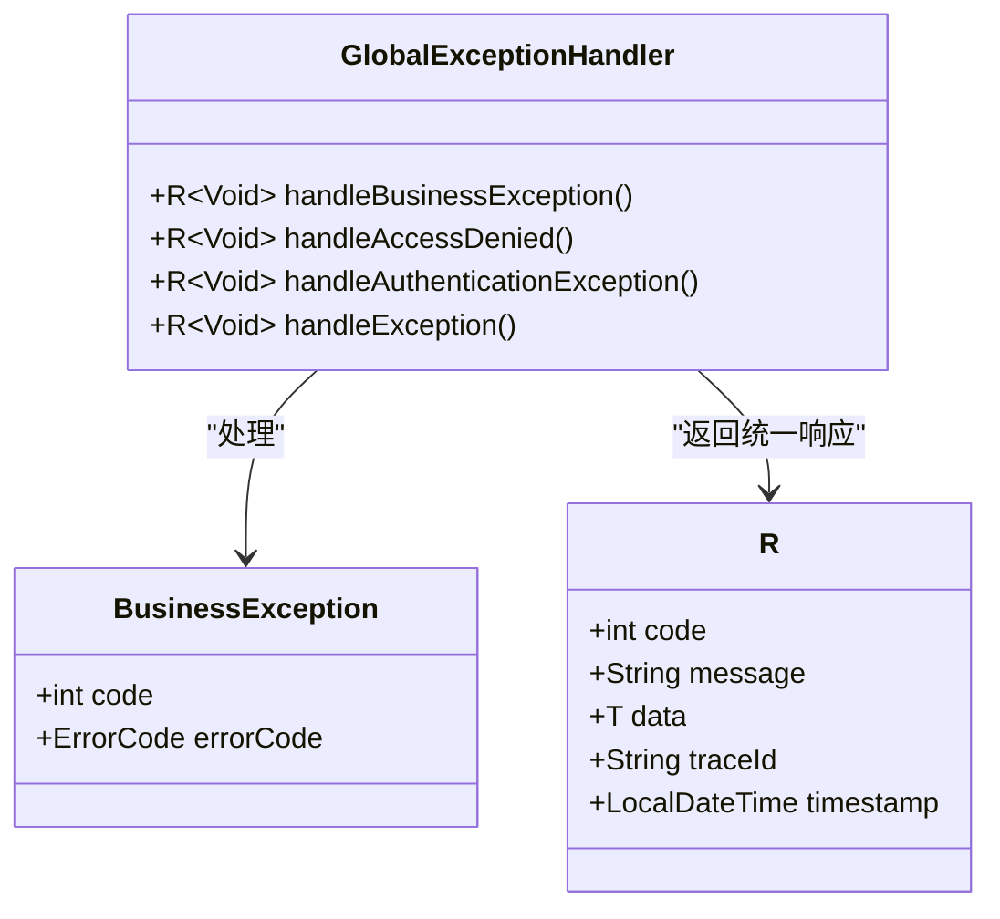
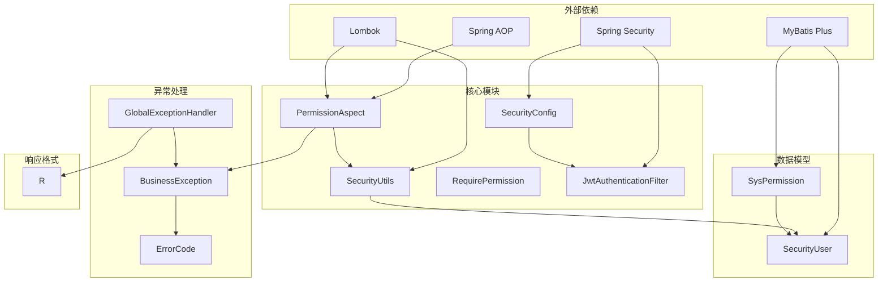

# 权限拦截器

<cite>
**本文档引用的文件**
- [RequirePermission.java](file://netdata-ai-backend/src/main/java/com/netdata/ops/annotation/RequirePermission.java)
- [PermissionAspect.java](file://netdata-ai-backend/src/main/java/com/netdata/ops/aspect/PermissionAspect.java)
- [SecurityUtils.java](file://netdata-ai-backend/src/main/java/com/netdata/ops/util/SecurityUtils.java)
- [SecurityConfig.java](file://netdata-ai-backend/src/main/java/com/netdata/ops/config/SecurityConfig.java)
- [JwtAuthenticationFilter.java](file://netdata-ai-backend/src/main/java/com/netdata/ops/security/JwtAuthenticationFilter.java)
- [UserController.java](file://netdata-ai-backend/src/main/java/com/netdata/ops/controller/UserController.java)
- [GlobalExceptionHandler.java](file://netdata-ai-backend/src/main/java/com/netdata/ops/exception/GlobalExceptionHandler.java)
- [BusinessException.java](file://netdata-ai-backend/src/main/java/com/netdata/ops/exception/BusinessException.java)
- [ErrorCode.java](file://netdata-ai-backend/src/main/java/com/netdata/ops/exception/ErrorCode.java)
- [R.java](file://netdata-ai-backend/src/main/java/com/netdata/ops/dto/response/R.java)
- [SysPermission.java](file://netdata-ai-backend/src/main/java/com/netdata/ops/entity/SysPermission.java)
- [SecurityUser.java](file://netdata-ai-backend/src/main/java/com/netdata/ops/security/SecurityUser.java)
- [application.yml](file://netdata-ai-backend/src/main/resources/application.yml)
</cite>

## 目录
1. [简介](#简介)
2. [项目结构](#项目结构)
3. [核心组件](#核心组件)
4. [架构概览](#架构概览)
5. [详细组件分析](#详细组件分析)
6. [依赖关系分析](#依赖关系分析)
7. [性能考虑](#性能考虑)
8. [故障排除指南](#故障排除指南)
9. [结论](#结论)

## 简介

权限拦截器系统是基于AOP（面向切面编程）的权限控制机制，通过注解驱动的方式实现细粒度的权限验证。该系统采用Spring AOP框架，在方法执行前后自动拦截带有@RequirePermission注解的控制器方法，确保只有具备相应权限的用户才能访问受保护的资源。

系统的核心特点包括：
- 基于注解的声明式权限控制
- 支持超级管理员特权模式
- 统一的异常处理和响应格式
- 与Spring Security无缝集成
- 可扩展的权限检查逻辑

## 项目结构

权限拦截器系统主要分布在以下包结构中：



**图表来源**
- [RequirePermission.java:1-20](file://netdata-ai-backend/src/main/java/com/netdata/ops/annotation/RequirePermission.java#L1-L20)
- [PermissionAspect.java:1-40](file://netdata-ai-backend/src/main/java/com/netdata/ops/aspect/PermissionAspect.java#L1-L40)
- [SecurityUtils.java:1-61](file://netdata-ai-backend/src/main/java/com/netdata/ops/util/SecurityUtils.java#L1-L61)

**章节来源**
- [RequirePermission.java:1-20](file://netdata-ai-backend/src/main/java/com/netdata/ops/annotation/RequirePermission.java#L1-L20)
- [PermissionAspect.java:1-40](file://netdata-ai-backend/src/main/java/com/netdata/ops/aspect/PermissionAspect.java#L1-L40)
- [SecurityUtils.java:1-61](file://netdata-ai-backend/src/main/java/com/netdata/ops/util/SecurityUtils.java#L1-L61)

## 核心组件

### 注解定义组件

权限注解@RequirePermission用于在控制器方法上声明权限要求，支持模块化权限编码格式。

### 切面组件

PermissionAspect实现了环绕通知，负责拦截带有权限注解的方法调用，执行权限验证逻辑。

### 工具组件

SecurityUtils提供了静态方法来获取当前用户信息和执行权限检查，简化了权限验证过程。

### 配置组件

SecurityConfig配置了Spring Security过滤器链，启用了方法级别的安全控制。

**章节来源**
- [RequirePermission.java:9-18](file://netdata-ai-backend/src/main/java/com/netdata/ops/annotation/RequirePermission.java#L9-L18)
- [PermissionAspect.java:13-38](file://netdata-ai-backend/src/main/java/com/netdata/ops/aspect/PermissionAspect.java#L13-L38)
- [SecurityUtils.java:10-59](file://netdata-ai-backend/src/main/java/com/netdata/ops/util/SecurityUtils.java#L10-L59)
- [SecurityConfig.java:32-77](file://netdata-ai-backend/src/main/java/com/netdata/ops/config/SecurityConfig.java#L32-L77)

## 架构概览

权限拦截器系统采用分层架构设计，结合AOP和Spring Security实现完整的权限控制机制：



**图表来源**
- [JwtAuthenticationFilter.java:35-62](file://netdata-ai-backend/src/main/java/com/netdata/ops/security/JwtAuthenticationFilter.java#L35-L62)
- [PermissionAspect.java:22-38](file://netdata-ai-backend/src/main/java/com/netdata/ops/aspect/PermissionAspect.java#L22-L38)
- [GlobalExceptionHandler.java:94-100](file://netdata-ai-backend/src/main/java/com/netdata/ops/exception/GlobalExceptionHandler.java#L94-L100)

## 详细组件分析

### 权限注解系统

@RequirePermission注解定义了权限控制的基本单位，支持模块化的权限编码格式。



**图表来源**
- [RequirePermission.java:12-18](file://netdata-ai-backend/src/main/java/com/netdata/ops/annotation/RequirePermission.java#L12-L18)
- [PermissionAspect.java:22-38](file://netdata-ai-backend/src/main/java/com/netdata/ops/aspect/PermissionAspect.java#L22-L38)
- [SecurityUtils.java:17-59](file://netdata-ai-backend/src/main/java/com/netdata/ops/util/SecurityUtils.java#L17-L59)

#### 注解特性
- **目标类型**: 仅作用于方法级别
- **保留策略**: 运行时可见
- **权限编码格式**: `module:action`（如"user:read"）
- **使用场景**: 在控制器方法上声明权限要求

#### 使用示例
在UserController中，多个方法使用@RequirePermission注解：
- 用户查询权限: `@RequirePermission("user:read")`
- 用户创建权限: `@RequirePermission("user:write")`
- 用户删除权限: `@RequirePermission("user:delete")`

**章节来源**
- [RequirePermission.java:5-18](file://netdata-ai-backend/src/main/java/com/netdata/ops/annotation/RequirePermission.java#L5-L18)
- [UserController.java:33-64](file://netdata-ai-backend/src/main/java/com/netdata/ops/controller/UserController.java#L33-L64)

### 权限切面实现

PermissionAspect实现了环绕通知，负责拦截带有权限注解的方法调用。



**图表来源**
- [PermissionAspect.java:22-38](file://netdata-ai-backend/src/main/java/com/netdata/ops/aspect/PermissionAspect.java#L22-L38)

#### 执行流程
1. **权限编码提取**: 从注解中获取权限编码
2. **超级管理员检查**: 检查是否为SUPER_ADMIN角色
3. **权限验证**: 使用SecurityUtils验证用户权限
4. **异常处理**: 权限不足时抛出业务异常
5. **正常执行**: 权限验证通过后继续执行业务逻辑

#### 特殊处理
- **超级管理员特权**: SUPER_ADMIN角色拥有所有权限
- **日志记录**: 权限不足时记录详细的审计日志
- **异常转换**: 将权限验证失败转换为统一的业务异常

**章节来源**
- [PermissionAspect.java:13-38](file://netdata-ai-backend/src/main/java/com/netdata/ops/aspect/PermissionAspect.java#L13-L38)

### 安全工具类

SecurityUtils提供了静态方法来获取当前用户信息和执行权限检查。



**图表来源**
- [SecurityUtils.java:10-59](file://netdata-ai-backend/src/main/java/com/netdata/ops/util/SecurityUtils.java#L10-L59)
- [SecurityUser.java:15-32](file://netdata-ai-backend/src/main/java/com/netdata/ops/security/SecurityUser.java#L15-L32)

#### 核心功能
- **用户信息获取**: 提供静态方法获取当前登录用户信息
- **权限检查**: 验证用户是否拥有指定权限编码
- **角色检查**: 验证用户是否拥有指定角色
- **线程安全**: 基于SecurityContextHolder的线程本地存储

#### 权限验证逻辑
- **权限匹配**: 检查用户权限集合中是否存在匹配的权限编码
- **角色匹配**: 自动添加"ROLE_"前缀进行角色验证
- **空值处理**: 对null用户返回false

**章节来源**
- [SecurityUtils.java:14-59](file://netdata-ai-backend/src/main/java/com/netdata/ops/util/SecurityUtils.java#L14-L59)

### Spring Security集成

系统通过@EnableMethodSecurity启用方法级别的权限控制，并配置了完整的安全过滤器链。

```mermaid
graph TB
subgraph "Spring Security配置"
A[SecurityConfig] --> B[JWT过滤器链]
A --> C[方法安全控制]
A --> D[CORS配置]
B --> E[JWT认证过滤器]
B --> F[无状态会话管理]
C --> G[基于注解的权限控制]
end
subgraph "白名单路径"
H[/api/v1/auth/*]
I[/api/v1/health]
J[/swagger-ui/**]
K[/v3/api-docs/**]
end
B -.-> H
B -.-> I
B -.-> J
B -.-> K
```

**图表来源**
- [SecurityConfig.java:32-77](file://netdata-ai-backend/src/main/java/com/netdata/ops/config/SecurityConfig.java#L32-L77)
- [JwtAuthenticationFilter.java:24-75](file://netdata-ai-backend/src/main/java/com/netdata/ops/security/JwtAuthenticationFilter.java#L24-L75)

#### 安全配置特性
- **无状态认证**: 禁用Session，使用JWT令牌
- **方法级安全**: 启用@EnableMethodSecurity进行注解驱动的权限控制
- **CORS支持**: 配置跨域资源共享
- **白名单机制**: 公开接口无需认证

#### 过滤器链配置
- **JWT过滤器**: 从请求头提取Bearer Token并设置认证上下文
- **认证提供者**: 使用DaoAuthenticationProvider进行用户认证
- **密码编码**: 使用BCryptPasswordEncoder进行密码加密

**章节来源**
- [SecurityConfig.java:38-77](file://netdata-ai-backend/src/main/java/com/netdata/ops/config/SecurityConfig.java#L38-L77)
- [JwtAuthenticationFilter.java:35-62](file://netdata-ai-backend/src/main/java/com/netdata/ops/security/JwtAuthenticationFilter.java#L35-L62)

### 异常处理机制

系统提供了统一的异常处理机制，确保权限相关的异常得到一致的处理和响应。



**图表来源**
- [GlobalExceptionHandler.java:25-139](file://netdata-ai-backend/src/main/java/com/netdata/ops/exception/GlobalExceptionHandler.java#L25-L139)
- [BusinessException.java:8-27](file://netdata-ai-backend/src/main/java/com/netdata/ops/exception/BusinessException.java#L8-L27)
- [R.java:12-81](file://netdata-ai-backend/src/main/java/com/netdata/ops/dto/response/R.java#L12-L81)

#### 异常处理策略
- **业务异常**: BusinessException转换为统一的业务响应格式
- **权限异常**: AccessDeniedException返回403 Forbidden
- **认证异常**: AuthenticationException返回401 Unauthorized
- **兜底异常**: 其他异常返回500 Internal Server Error

#### 统一响应格式
- **响应结构**: 包含code、message、data、traceId、timestamp字段
- **状态码映射**: 业务异常映射到错误码，HTTP状态码保持不变
- **追踪ID**: 通过MDC传递traceId便于问题追踪

**章节来源**
- [GlobalExceptionHandler.java:29-100](file://netdata-ai-backend/src/main/java/com/netdata/ops/exception/GlobalExceptionHandler.java#L29-L100)
- [R.java:14-80](file://netdata-ai-backend/src/main/java/com/netdata/ops/dto/response/R.java#L14-L80)

## 依赖关系分析

权限拦截器系统的依赖关系体现了清晰的分层架构和职责分离：



**图表来源**
- [PermissionAspect.java:3-11](file://netdata-ai-backend/src/main/java/com/netdata/ops/aspect/PermissionAspect.java#L3-L11)
- [SecurityConfig.java:3-23](file://netdata-ai-backend/src/main/java/com/netdata/ops/config/SecurityConfig.java#L3-L23)
- [GlobalExceptionHandler.java:3-17](file://netdata-ai-backend/src/main/java/com/netdata/ops/exception/GlobalExceptionHandler.java#L3-L17)

### 内部依赖关系

系统内部各组件之间的依赖关系清晰明确：

- **PermissionAspect** 依赖 **RequirePermission** 和 **SecurityUtils**
- **SecurityUtils** 依赖 **SecurityContextHolder** 和 **SecurityUser**
- **GlobalExceptionHandler** 依赖 **BusinessException** 和 **R** 响应格式
- **SecurityConfig** 依赖 **JwtAuthenticationFilter** 和 **UserDetailsService**

### 外部依赖关系

系统对外部框架的依赖主要体现在：

- **Spring AOP**: 提供注解拦截和环绕通知功能
- **Spring Security**: 提供认证、授权和过滤器链功能
- **Lombok**: 简化Java代码，减少样板代码
- **MyBatis Plus**: 提供ORM功能和实体映射

**章节来源**
- [PermissionAspect.java:3-11](file://netdata-ai-backend/src/main/java/com/netdata/ops/aspect/PermissionAspect.java#L3-L11)
- [SecurityConfig.java:3-23](file://netdata-ai-backend/src/main/java/com/netdata/ops/config/SecurityConfig.java#L3-L23)
- [GlobalExceptionHandler.java:3-17](file://netdata-ai-backend/src/main/java/com/netdata/ops/exception/GlobalExceptionHandler.java#L3-L17)

## 性能考虑

权限拦截器系统在设计时充分考虑了性能优化和最佳实践：

### AOP性能优化

- **切点选择**: 使用@annotation切点精确匹配带注解的方法，避免不必要的拦截
- **缓存策略**: SecurityUtils中的用户信息通过SecurityContextHolder缓存
- **短路逻辑**: 超级管理员检查优先执行，避免不必要的权限验证

### Spring Security优化

- **无状态设计**: 禁用Session减少服务器内存占用
- **过滤器链优化**: 合理配置过滤器顺序，减少不必要的处理步骤
- **连接池配置**: 数据库连接池参数经过优化配置

### 异常处理优化

- **异常分类**: 不同类型的异常采用不同的处理策略
- **日志级别**: 权限不足时使用WARN级别日志，避免过多调试信息
- **响应格式**: 统一的响应格式减少序列化开销

### 最佳实践建议

1. **权限编码规范**: 使用模块化权限编码格式，便于维护和扩展
2. **注解使用**: 仅在必要的方法上使用@RequirePermission注解
3. **异常处理**: 业务异常应该包含有意义的错误码和消息
4. **日志记录**: 权限验证失败应该记录详细的审计信息
5. **性能监控**: 建议添加权限验证的性能监控指标

## 故障排除指南

### 常见问题及解决方案

#### 权限验证失败

**问题描述**: 用户无法访问受保护的资源，返回403 Forbidden

**可能原因**:
- 用户没有相应的权限编码
- 权限编码格式不正确
- 用户角色配置错误

**排查步骤**:
1. 检查用户是否拥有正确的权限编码
2. 验证权限编码格式是否符合`module:action`规范
3. 确认用户角色是否包含相应的权限

#### 超级管理员权限问题

**问题描述**: SUPER_ADMIN角色无法访问某些功能

**可能原因**:
- 角色名称配置不正确
- 权限检查逻辑异常

**排查步骤**:
1. 检查SecurityUtils.hasRole方法中的角色前缀
2. 验证数据库中角色配置
3. 确认权限检查逻辑的执行顺序

#### JWT认证问题

**问题描述**: 用户登录后仍然无法访问受保护资源

**可能原因**:
- JWT Token无效或过期
- 请求头格式不正确
- 过滤器链配置错误

**排查步骤**:
1. 验证JWT Token的有效性
2. 检查Authorization请求头格式
3. 确认JwtAuthenticationFilter的配置

#### 异常处理问题

**问题描述**: 权限异常没有按照预期处理

**可能原因**:
- 全局异常处理器配置错误
- BusinessException类型不正确
- 响应格式不符合预期

**排查步骤**:
1. 检查GlobalExceptionHandler的异常处理方法
2. 验证BusinessException的错误码配置
3. 确认R响应格式的字段设置

### 调试技巧

1. **启用详细日志**: 在application.yml中调整日志级别
2. **使用断点调试**: 在PermissionAspect.checkPermission方法中设置断点
3. **检查SecurityContext**: 验证用户认证信息是否正确设置
4. **验证权限编码**: 确保数据库中的权限编码与注解一致

**章节来源**
- [GlobalExceptionHandler.java:94-100](file://netdata-ai-backend/src/main/java/com/netdata/ops/exception/GlobalExceptionHandler.java#L94-L100)
- [SecurityUtils.java:44-59](file://netdata-ai-backend/src/main/java/com/netdata/ops/util/SecurityUtils.java#L44-L59)
- [JwtAuthenticationFilter.java:35-62](file://netdata-ai-backend/src/main/java/com/netdata/ops/security/JwtAuthenticationFilter.java#L35-L62)

## 结论

权限拦截器系统通过AOP和Spring Security的有机结合，实现了灵活、可扩展的权限控制机制。系统的主要优势包括：

1. **声明式权限控制**: 通过@RequirePermission注解实现简洁的权限声明
2. **统一异常处理**: 提供一致的错误响应格式和处理策略
3. **无状态设计**: 基于JWT的无状态认证方案
4. **可扩展性**: 支持自定义权限检查逻辑和异常处理
5. **性能优化**: 通过合理的架构设计和配置优化系统性能

该系统为NetData智能运维平台提供了坚实的安全基础，支持复杂的权限管理和审计需求。通过遵循本文档的最佳实践和配置指南，可以确保系统的安全性、稳定性和可维护性。