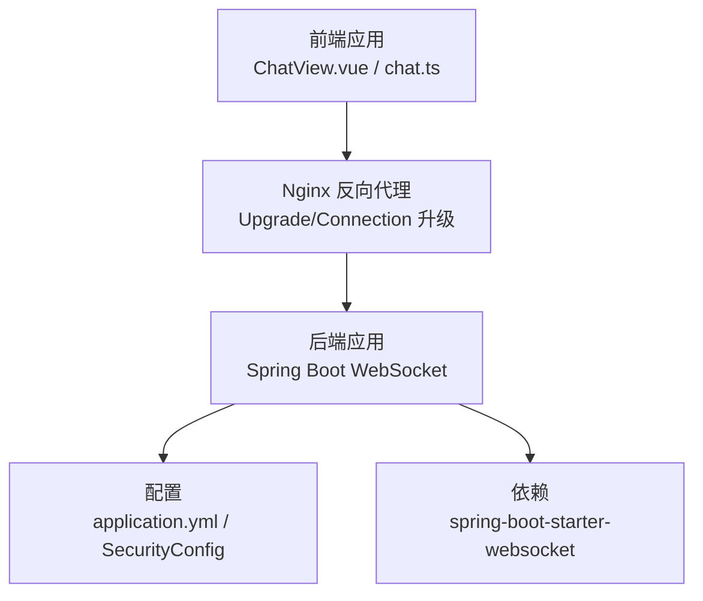
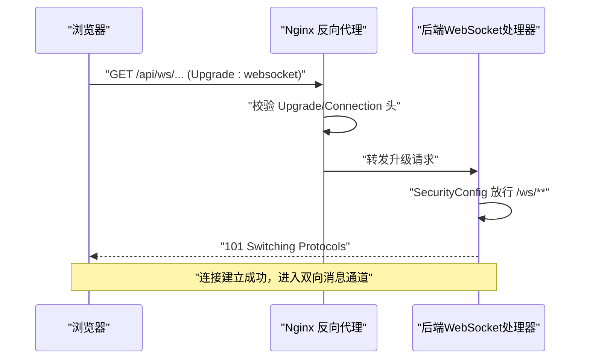
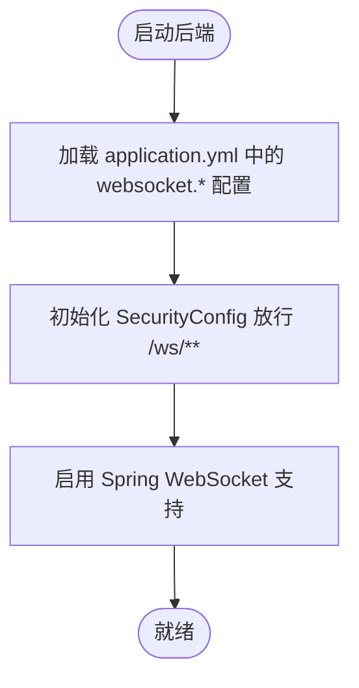
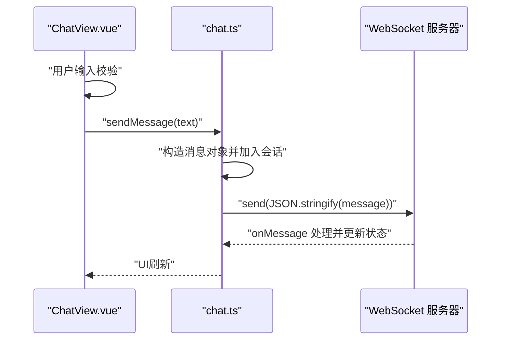
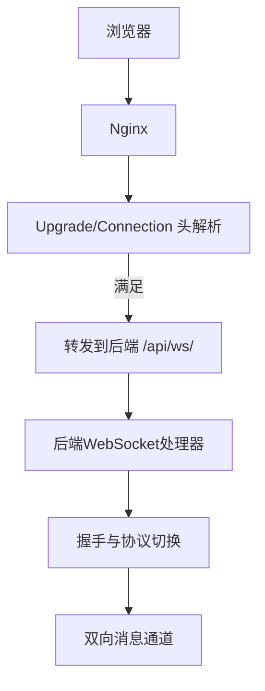
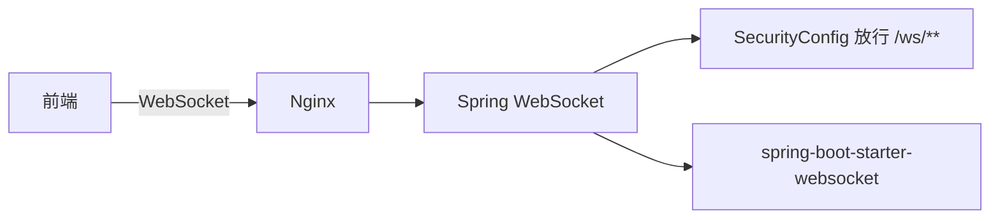

# WebSocket架构设计

<cite>
**本文引用的文件**
- [application.yml](file://netdata-ai-backend/src/main/resources/application.yml)
- [pom.xml](file://netdata-ai-backend/pom.xml)
- [SecurityConfig.java](file://netdata-ai-backend/src/main/java/com/netdata/ops/config/SecurityConfig.java)
- [deployment_guide.md](file://docs/deployment_guide.md)
- [chat.ts](file://netdata-ai-frontend/src/stores/chat.ts)
- [ChatView.vue](file://netdata-ai-frontend/src/views/ChatView.vue)
</cite>

## 目录
1. [引言](#引言)
2. [项目结构](#项目结构)
3. [核心组件](#核心组件)
4. [架构总览](#架构总览)
5. [详细组件分析](#详细组件分析)
6. [依赖关系分析](#依赖关系分析)
7. [性能考虑](#性能考虑)
8. [故障排除指南](#故障排除指南)
9. [结论](#结论)
10. [附录](#附录)

## 引言
本技术文档围绕WebSocket在本项目的整体架构设计展开，重点覆盖以下方面：
- 连接建立流程：握手协议、连接参数配置与Nginx代理升级
- 消息传输机制：文本消息与二进制消息的处理流程及序列化策略
- 连接管理策略：生命周期、心跳检测与断线重连
- 配置参数详解：超时、缓冲区大小、并发连接限制等
- 性能优化技巧：连接复用、消息压缩与带宽控制
- 实战示例与常见问题解决方案

本项目后端采用Spring Boot Starter WebSocket，前端通过浏览器原生WebSocket进行通信；Nginx负责反向代理与HTTP到WebSocket的协议升级。

## 项目结构
后端与前端的WebSocket相关模块分布如下：
- 后端
  - 配置层：application.yml中定义WebSocket路径与跨域策略
  - 安全层：SecurityConfig对/ws/**路径放行，确保WebSocket握手可通行
  - 依赖层：pom.xml引入spring-boot-starter-websocket
  - 部署层：deployment_guide.md提供Nginx代理WebSocket的配置要点
- 前端
  - chat.ts：聊天状态管理与消息发送逻辑
  - ChatView.vue：视图层触发发送、滚动与交互

图表来源
- [application.yml:250-255](file://netdata-ai-backend/src/main/resources/application.yml#L250-L255)
- [SecurityConfig.java:60-60](file://netdata-ai-backend/src/main/java/com/netdata/ops/config/SecurityConfig.java#L60-L60)
- [pom.xml:50-53](file://netdata-ai-backend/pom.xml#L50-L53)
- [deployment_guide.md:337-344](file://docs/deployment_guide.md#L337-L344)

章节来源
- [application.yml:250-255](file://netdata-ai-backend/src/main/resources/application.yml#L250-L255)
- [SecurityConfig.java:60-60](file://netdata-ai-backend/src/main/java/com/netdata/ops/config/SecurityConfig.java#L60-L60)
- [pom.xml:50-53](file://netdata-ai-backend/pom.xml#L50-L53)
- [deployment_guide.md:337-344](file://docs/deployment_guide.md#L337-L344)
- [chat.ts:82-99](file://netdata-ai-frontend/src/stores/chat.ts#L82-L99)
- [ChatView.vue:127-138](file://netdata-ai-frontend/src/views/ChatView.vue#L127-L138)

## 核心组件
- 后端WebSocket配置
  - 路径与跨域：websocket.path与websocket.allowed-origins
  - 安全放行：/ws/**不经过Spring Security拦截
  - 依赖：spring-boot-starter-websocket
- 前端WebSocket客户端
  - chat.ts封装消息发送与状态管理
  - ChatView.vue触发发送与UI交互
- Nginx代理
  - 支持HTTP/1.1与Upgrade/Connection头，转发至后端WebSocket端点

章节来源
- [application.yml:250-255](file://netdata-ai-backend/src/main/resources/application.yml#L250-L255)
- [SecurityConfig.java:60-60](file://netdata-ai-backend/src/main/java/com/netdata/ops/config/SecurityConfig.java#L60-L60)
- [pom.xml:50-53](file://netdata-ai-backend/pom.xml#L50-L53)
- [deployment_guide.md:337-344](file://docs/deployment_guide.md#L337-L344)
- [chat.ts:82-99](file://netdata-ai-frontend/src/stores/chat.ts#L82-L99)
- [ChatView.vue:127-138](file://netdata-ai-frontend/src/views/ChatView.vue#L127-L138)

## 架构总览
下图展示从浏览器到后端的WebSocket端到端流程，包括Nginx代理与后端安全放行：

图表来源
- [deployment_guide.md:337-344](file://docs/deployment_guide.md#L337-L344)
- [SecurityConfig.java:60-60](file://netdata-ai-backend/src/main/java/com/netdata/ops/config/SecurityConfig.java#L60-L60)

## 详细组件分析

### 后端WebSocket配置与安全放行
- 配置项
  - websocket.path：WebSocket服务端点路径
  - websocket.allowed-origins：允许的跨域来源
- 安全策略
  - /ws/**不走Spring Security拦截，保证握手与后续通信顺畅
- 依赖声明
  - spring-boot-starter-websocket用于启用WebSocket支持

图表来源
- [application.yml:250-255](file://netdata-ai-backend/src/main/resources/application.yml#L250-L255)
- [SecurityConfig.java:60-60](file://netdata-ai-backend/src/main/java/com/netdata/ops/config/SecurityConfig.java#L60-L60)
- [pom.xml:50-53](file://netdata-ai-backend/pom.xml#L50-L53)

章节来源
- [application.yml:250-255](file://netdata-ai-backend/src/main/resources/application.yml#L250-L255)
- [SecurityConfig.java:60-60](file://netdata-ai-backend/src/main/java/com/netdata/ops/config/SecurityConfig.java#L60-L60)
- [pom.xml:50-53](file://netdata-ai-backend/pom.xml#L50-L53)

### 前端消息发送与界面交互
- chat.ts
  - sendMessage：构建用户消息并推入当前会话
  - 与后端约定的消息格式与序列化策略由后端统一处理
- ChatView.vue
  - handleSend：输入校验、调用store发送、滚动到底部

图表来源
- [chat.ts:82-99](file://netdata-ai-frontend/src/stores/chat.ts#L82-L99)
- [ChatView.vue:127-138](file://netdata-ai-frontend/src/views/ChatView.vue#L127-L138)

章节来源
- [chat.ts:82-99](file://netdata-ai-frontend/src/stores/chat.ts#L82-L99)
- [ChatView.vue:127-138](file://netdata-ai-frontend/src/views/ChatView.vue#L127-L138)

### Nginx代理与协议升级
- 关键配置
  - proxy_http_version 1.1
  - proxy_set_header Upgrade $http_upgrade
  - proxy_set_header Connection "upgrade"
  - 将 /api/ws/ 转发到后端WebSocket端点
- 作用
  - 使浏览器HTTP升级请求被正确传递给后端
  - 保持长连接与低延迟

图表来源
- [deployment_guide.md:337-344](file://docs/deployment_guide.md#L337-L344)

章节来源
- [deployment_guide.md:337-344](file://docs/deployment_guide.md#L337-L344)

## 依赖关系分析
- 后端依赖
  - spring-boot-starter-websocket：提供WebSocket端点与消息编解码能力
- 安全依赖
  - SecurityConfig对/ws/**放行，避免认证拦截导致握手失败
- 前端依赖
  - 浏览器原生WebSocket API，配合store与视图层完成消息收发

图表来源
- [pom.xml:50-53](file://netdata-ai-backend/pom.xml#L50-L53)
- [SecurityConfig.java:60-60](file://netdata-ai-backend/src/main/java/com/netdata/ops/config/SecurityConfig.java#L60-L60)
- [deployment_guide.md:337-344](file://docs/deployment_guide.md#L337-L344)

章节来源
- [pom.xml:50-53](file://netdata-ai-backend/pom.xml#L50-L53)
- [SecurityConfig.java:60-60](file://netdata-ai-backend/src/main/java/com/netdata/ops/config/SecurityConfig.java#L60-L60)
- [deployment_guide.md:337-344](file://docs/deployment_guide.md#L337-L344)

## 性能考虑
- 连接复用
  - 前端单页应用内复用同一WebSocket实例，减少握手开销
  - 后端通过连接池与线程模型处理多路复用
- 消息压缩
  - 在应用层可启用压缩策略（例如GZIP），降低带宽占用
- 带宽控制
  - 合理设置消息大小上限与队列长度，避免内存压力
- 心跳与保活
  - 建议在应用层定期发送ping/pong，维持长连接稳定
- 并发与限流
  - 结合后端线程池与前端重试策略，避免过载

## 故障排除指南
- 握手失败或返回404
  - 检查Nginx是否正确转发Upgrade/Connection头
  - 确认后端WebSocket路径与前端一致
- 跨域错误
  - 校验websocket.allowed-origins配置
  - 确保前端访问域名与后端允许列表匹配
- 断线频繁
  - 增加心跳检测频率，优化网络质量
  - 前端实现指数退避重连策略
- 性能抖动
  - 控制消息大小与发送频率，启用压缩
  - 后端调整线程池与队列参数

## 结论
本项目通过清晰的前后端分工与标准的WebSocket协议实现，结合Nginx代理与Spring Security放行策略，构建了可靠的实时通信通道。建议在生产环境中进一步完善心跳保活、断线重连与消息压缩等机制，以提升稳定性与用户体验。

## 附录

### WebSocket配置参数说明
- 路径与跨域
  - websocket.path：WebSocket服务端点路径
  - websocket.allowed-origins：允许的跨域来源
- 超时设置
  - 建议在应用层设置连接超时与读写超时，避免资源泄露
- 缓冲区大小
  - 根据消息体量与峰值流量设定接收/发送缓冲区，防止溢出
- 并发连接限制
  - 后端可通过线程池与队列容量限制并发，前端应避免同时打开过多连接

章节来源
- [application.yml:250-255](file://netdata-ai-backend/src/main/resources/application.yml#L250-L255)

### 完整连接示例（步骤说明）
- 前端
  - 初始化WebSocket实例，监听open、message、error、close事件
  - 用户输入后，将消息序列化为JSON并通过send发送
- 后端
  - 配置WebSocket端点与消息处理器，解析JSON并路由到业务逻辑
  - 对异常连接进行清理与日志记录
- Nginx
  - 正确设置Upgrade/Connection头，转发到后端WebSocket端点

章节来源
- [chat.ts:82-99](file://netdata-ai-frontend/src/stores/chat.ts#L82-L99)
- [ChatView.vue:127-138](file://netdata-ai-frontend/src/views/ChatView.vue#L127-L138)
- [deployment_guide.md:337-344](file://docs/deployment_guide.md#L337-L344)