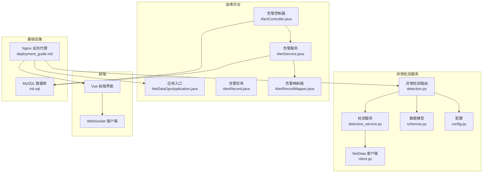
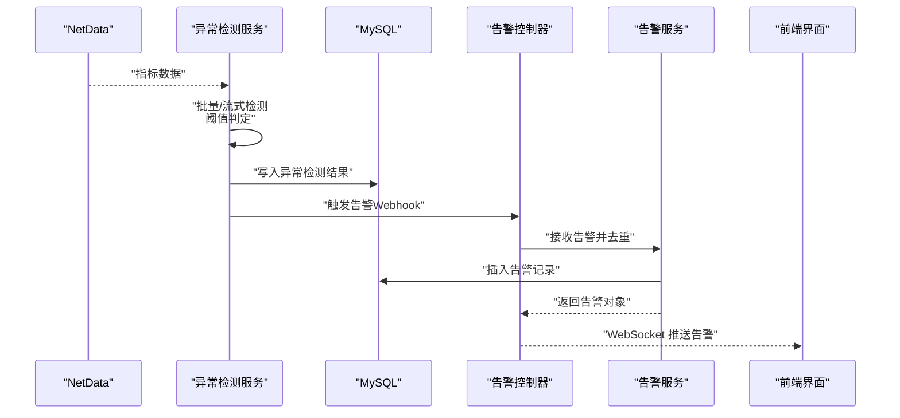
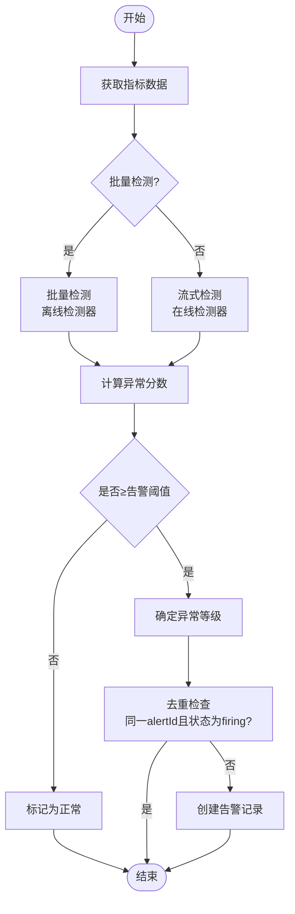
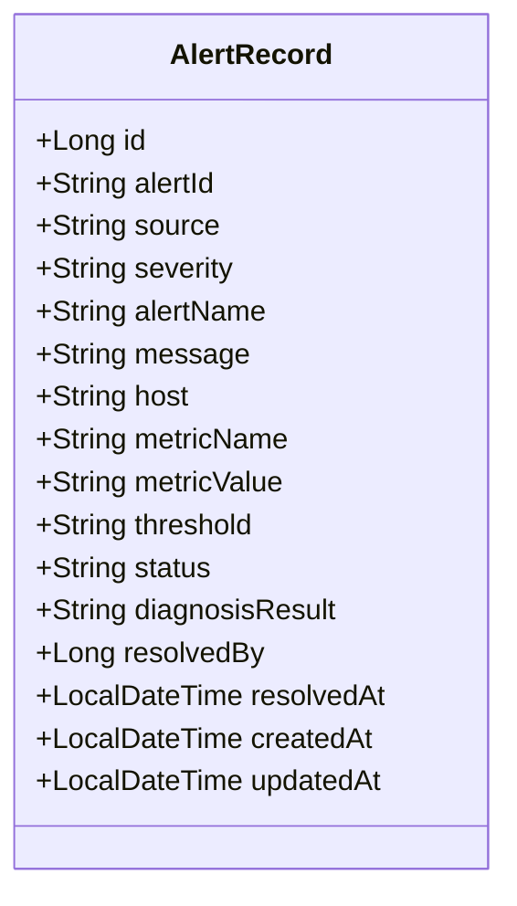
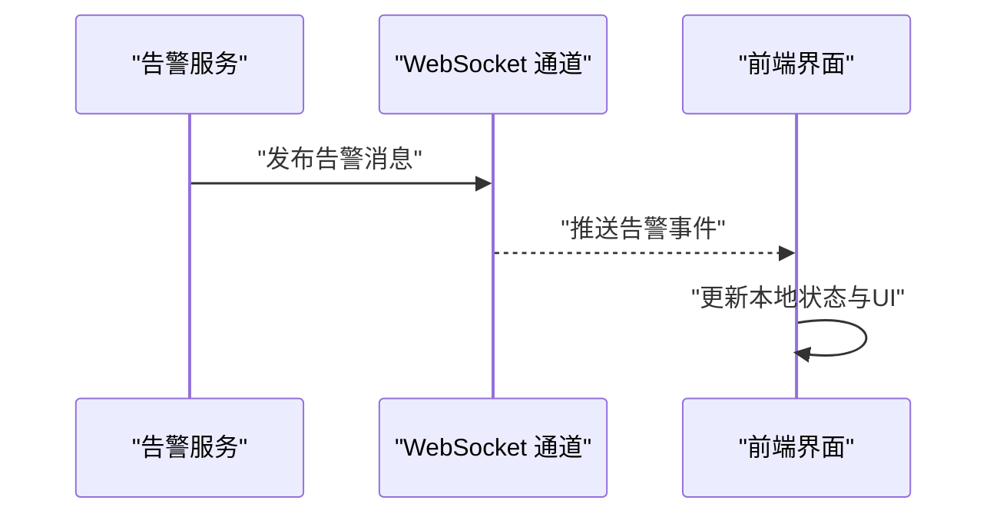
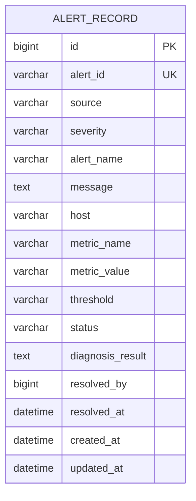
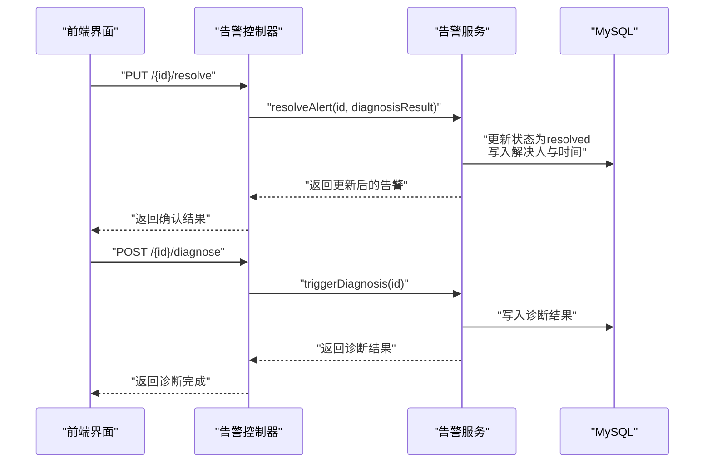
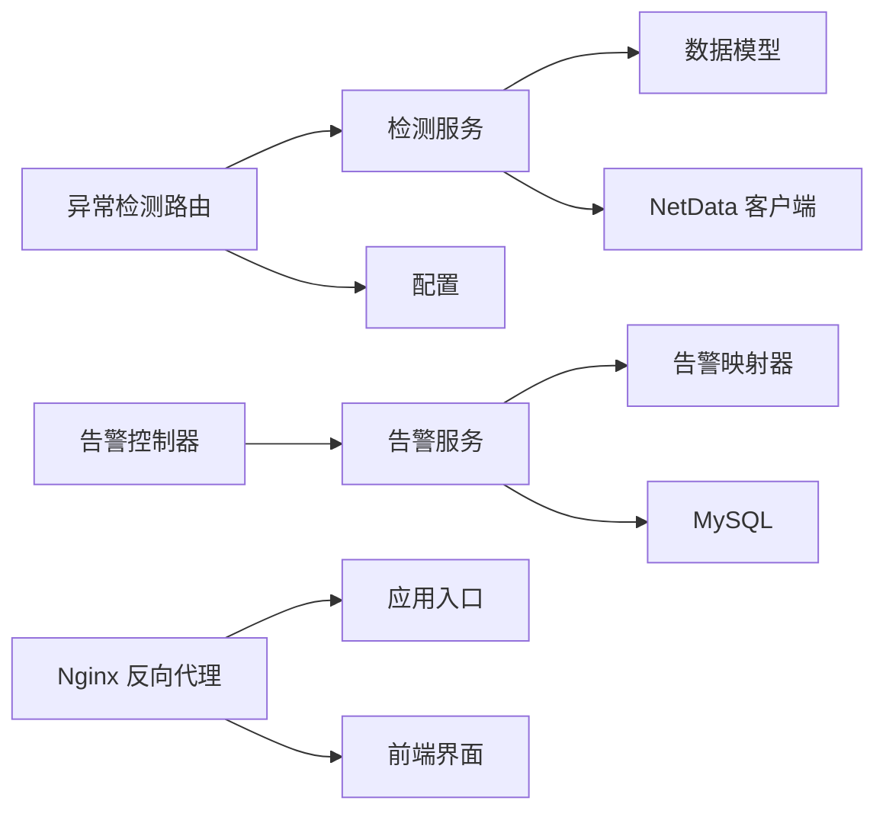

# 实时告警推送系统

<cite>
**本文档引用的文件**
- [AlertController.java](file://netdata-ai-backend/src/main/java/com/netdata/ops/controller/AlertController.java)
- [AlertService.java](file://netdata-ai-backend/src/main/java/com/netdata/ops/service/AlertService.java)
- [AlertRecord.java](file://netdata-ai-backend/src/main/java/com/netdata/ops/entity/AlertRecord.java)
- [AlertRecordMapper.java](file://netdata-ai-backend/src/main/java/com/netdata/ops/mapper/AlertRecordMapper.java)
- [NetDataOpsApplication.java](file://netdata-ai-backend/src/main/java/com/netdata/ops/NetDataOpsApplication.java)
- [detection.py](file://anomaly-detection-service/app/api/routes/detection.py)
- [detection_service.py](file://anomaly-detection-service/app/services/detection_service.py)
- [schemas.py](file://anomaly-detection-service/app/models/schemas.py)
- [client.py](file://anomaly-detection-service/app/netdata/client.py)
- [config.py](file://anomaly-detection-service/app/config.py)
- [init.sql](file://sql/init.sql)
- [deployment_guide.md](file://docs/deployment_guide.md)
</cite>

## 目录
1. [简介](#简介)
2. [项目结构](#项目结构)
3. [核心组件](#核心组件)
4. [架构总览](#架构总览)
5. [详细组件分析](#详细组件分析)
6. [依赖关系分析](#依赖关系分析)
7. [性能考虑](#性能考虑)
8. [故障排查指南](#故障排查指南)
9. [结论](#结论)
10. [附录](#附录)

## 简介
本系统是一个面向 NetData 监控数据的实时告警推送平台，结合异常检测服务与运维后台，实现从异常检测、告警规则匹配、告警级别确定，到告警消息构建、历史记录存储与查询、以及前端实时推送的完整闭环。系统通过异常检测服务对监控指标进行批量/流式检测，当检测到异常达到告警阈值时，将告警信息写入后台数据库；后台提供 REST API 查询、统计与诊断能力，并通过 WebSocket 实现实时推送至前端界面。

## 项目结构
系统主要分为三个部分：
- 异常检测服务（Python FastAPI）：负责异常检测、阈值判断、规则匹配与结果输出。
- 运维后台（Java Spring Boot）：负责告警接收、去重、存储、查询、统计与诊断。
- 前端界面（Vue）：通过 WebSocket 实时接收告警推送，展示告警列表与趋势。

**图表来源**
- [detection.py:1-378](file://anomaly-detection-service/app/api/routes/detection.py#L1-L378)
- [detection_service.py:1-334](file://anomaly-detection-service/app/services/detection_service.py#L1-L334)
- [schemas.py:1-329](file://anomaly-detection-service/app/models/schemas.py#L1-L329)
- [client.py:1-301](file://anomaly-detection-service/app/netdata/client.py#L1-L301)
- [config.py:1-183](file://anomaly-detection-service/app/config.py#L1-L183)
- [NetDataOpsApplication.java:1-36](file://netdata-ai-backend/src/main/java/com/netdata/ops/NetDataOpsApplication.java#L1-L36)
- [AlertController.java:1-108](file://netdata-ai-backend/src/main/java/com/netdata/ops/controller/AlertController.java#L1-L108)
- [AlertService.java:1-237](file://netdata-ai-backend/src/main/java/com/netdata/ops/service/AlertService.java#L1-L237)
- [AlertRecord.java:1-56](file://netdata-ai-backend/src/main/java/com/netdata/ops/entity/AlertRecord.java#L1-L56)
- [AlertRecordMapper.java:1-25](file://netdata-ai-backend/src/main/java/com/netdata/ops/mapper/AlertRecordMapper.java#L1-L25)
- [init.sql:173-196](file://sql/init.sql#L173-L196)
- [deployment_guide.md:304-365](file://docs/deployment_guide.md#L304-L365)

**章节来源**
- [detection.py:1-378](file://anomaly-detection-service/app/api/routes/detection.py#L1-L378)
- [AlertController.java:1-108](file://netdata-ai-backend/src/main/java/com/netdata/ops/controller/AlertController.java#L1-L108)
- [AlertService.java:1-237](file://netdata-ai-backend/src/main/java/com/netdata/ops/service/AlertService.java#L1-L237)
- [AlertRecord.java:1-56](file://netdata-ai-backend/src/main/java/com/netdata/ops/entity/AlertRecord.java#L1-L56)
- [AlertRecordMapper.java:1-25](file://netdata-ai-backend/src/main/java/com/netdata/ops/mapper/AlertRecordMapper.java#L1-L25)
- [NetDataOpsApplication.java:1-36](file://netdata-ai-backend/src/main/java/com/netdata/ops/NetDataOpsApplication.java#L1-L36)
- [init.sql:173-196](file://sql/init.sql#L173-L196)
- [deployment_guide.md:304-365](file://docs/deployment_guide.md#L304-L365)

## 核心组件
- 异常检测路由与服务：提供批量检测、流式检测、模型训练与 NetData 数据获取接口，基于阈值与异常分数判定异常等级（正常/警告/严重）。
- 告警控制器与服务：提供告警查询、详情、确认/解决、批量解决、Webhook 接收、统计与趋势分析、AI 诊断触发等能力。
- 数据模型与配置：定义检测请求/响应、异常等级、检测状态等模型，集中管理阈值、检测器参数与服务配置。
- 数据库与索引：提供告警记录表及统计视图，支撑查询、统计与趋势分析。
- 前端与反向代理：通过 Nginx 将 WebSocket 升级代理到后端，前端通过 WebSocket 实时接收告警推送。

**章节来源**
- [detection.py:55-218](file://anomaly-detection-service/app/api/routes/detection.py#L55-L218)
- [detection_service.py:76-153](file://anomaly-detection-service/app/services/detection_service.py#L76-L153)
- [schemas.py:44-58](file://anomaly-detection-service/app/models/schemas.py#L44-L58)
- [AlertController.java:27-106](file://netdata-ai-backend/src/main/java/com/netdata/ops/controller/AlertController.java#L27-L106)
- [AlertService.java:97-235](file://netdata-ai-backend/src/main/java/com/netdata/ops/service/AlertService.java#L97-L235)
- [AlertRecord.java:18-44](file://netdata-ai-backend/src/main/java/com/netdata/ops/entity/AlertRecord.java#L18-L44)
- [init.sql:173-196](file://sql/init.sql#L173-L196)
- [deployment_guide.md:337-344](file://docs/deployment_guide.md#L337-L344)

## 架构总览
系统采用“异常检测服务 + 运维后台 + 前端界面”的分层架构。异常检测服务负责实时/离线检测并将结果写入后台数据库；后台提供 REST API 与 WebSocket 推送，前端通过反向代理访问后端并建立 WebSocket 连接。

**图表来源**
- [detection.py:285-378](file://anomaly-detection-service/app/api/routes/detection.py#L285-L378)
- [AlertController.java:69-85](file://netdata-ai-backend/src/main/java/com/netdata/ops/controller/AlertController.java#L69-L85)
- [AlertService.java:97-128](file://netdata-ai-backend/src/main/java/com/netdata/ops/service/AlertService.java#L97-L128)
- [init.sql:173-196](file://sql/init.sql#L173-L196)

## 详细组件分析

### 异常检测与告警触发机制
- 批量检测：接收多条时序数据，使用离线检测器（隔离森林、LOF、KNN）进行检测，根据异常分数与阈值判断是否异常，并按分数区间确定异常等级（严重/警告/正常）。
- 流式检测：对单条数据进行实时检测，使用在线检测器（半空间树、xStream），返回异常分数与等级。
- 阈值与规则：通过配置中的异常阈值与告警阈值进行规则匹配，达到告警阈值即触发告警。
- 告警去重：当同一 alertId 的告警状态仍为 firing 时，不再重复创建。

**图表来源**
- [detection.py:55-218](file://anomaly-detection-service/app/api/routes/detection.py#L55-L218)
- [detection_service.py:76-153](file://anomaly-detection-service/app/services/detection_service.py#L76-L153)
- [config.py:132-137](file://anomaly-detection-service/app/config.py#L132-L137)
- [AlertService.java:101-109](file://netdata-ai-backend/src/main/java/com/netdata/ops/service/AlertService.java#L101-L109)

**章节来源**
- [detection.py:55-218](file://anomaly-detection-service/app/api/routes/detection.py#L55-L218)
- [detection_service.py:76-153](file://anomaly-detection-service/app/services/detection_service.py#L76-L153)
- [config.py:132-137](file://anomaly-detection-service/app/config.py#L132-L137)
- [AlertService.java:101-128](file://netdata-ai-backend/src/main/java/com/netdata/ops/service/AlertService.java#L101-L128)

### 告警消息构建与格式化
- 告警内容结构：包含告警唯一标识、来源、严重级别、告警名称、消息、主机、指标名称、指标值、阈值、状态、诊断结果、解决人与时间等字段。
- 时间戳处理：创建与更新时间自动填充，解决时间在确认/解决时写入。
- 状态标识：初始状态为 firing，确认/解决后更新为 resolved，并记录解决人与时间。

**图表来源**
- [AlertRecord.java:18-54](file://netdata-ai-backend/src/main/java/com/netdata/ops/entity/AlertRecord.java#L18-L54)

**章节来源**
- [AlertRecord.java:18-54](file://netdata-ai-backend/src/main/java/com/netdata/ops/entity/AlertRecord.java#L18-L54)
- [AlertService.java:74-92](file://netdata-ai-backend/src/main/java/com/netdata/ops/service/AlertService.java#L74-L92)

### 告警推送实现机制
- 消息广播与订阅：通过 WebSocket 实现消息广播，前端建立连接后可订阅告警推送。
- 订阅管理：反向代理配置中启用 WebSocket 升级头，确保连接升级成功。
- 服务端推送：后端在创建告警或解决告警时，通过 WebSocket 广播最新告警状态，前端实时更新界面。

**图表来源**
- [deployment_guide.md:337-344](file://docs/deployment_guide.md#L337-L344)

**章节来源**
- [deployment_guide.md:337-344](file://docs/deployment_guide.md#L337-L344)

### 告警历史记录存储与查询
- 数据模型：告警记录表包含主键、唯一告警标识、来源、严重级别、告警名称、消息、主机、指标名称、指标值、阈值、状态、诊断结果、解决人与时间、创建/更新时间等字段。
- 查询接口：提供分页查询、详情查询、按严重级别/状态/主机/关键词过滤，支持排序与统计。
- 统计分析：提供告警总数、当日解决数、按严重级别分布、按主机受影响数量等统计；提供最近7天趋势（按天聚合）。

**图表来源**
- [init.sql:173-196](file://sql/init.sql#L173-L196)

**章节来源**
- [AlertController.java:27-99](file://netdata-ai-backend/src/main/java/com/netdata/ops/controller/AlertController.java#L27-L99)
- [AlertService.java:34-57](file://netdata-ai-backend/src/main/java/com/netdata/ops/service/AlertService.java#L34-L57)
- [AlertService.java:155-202](file://netdata-ai-backend/src/main/java/com/netdata/ops/service/AlertService.java#L155-L202)
- [AlertRecordMapper.java:14-23](file://netdata-ai-backend/src/main/java/com/netdata/ops/mapper/AlertRecordMapper.java#L14-L23)

### 错误处理与重试机制
- 异常检测：捕获检测过程中的异常并返回标准 HTTP 500 错误，包含详细错误信息。
- 告警创建：对重复 firing 状态的告警进行去重，避免重复入库；对不存在的告警抛出业务异常。
- 重试策略：建议在上游（如 NetData webhook）采用指数退避重试，后端对幂等接口（如重复 Webhook）进行去重处理。

**章节来源**
- [detection.py:147-152](file://anomaly-detection-service/app/api/routes/detection.py#L147-L152)
- [AlertService.java:101-109](file://netdata-ai-backend/src/main/java/com/netdata/ops/service/AlertService.java#L101-L109)

### 告警确认与处理流程
- 单条确认：根据告警 ID 更新状态为 resolved，记录诊断结果、解决人与时间。
- 批量解决：对多个告警 ID 批量更新状态为 resolved，返回解决数量。
- AI 诊断：触发智能诊断，生成诊断内容并回写到告警记录。

**图表来源**
- [AlertController.java:47-106](file://netdata-ai-backend/src/main/java/com/netdata/ops/controller/AlertController.java#L47-L106)
- [AlertService.java:74-92](file://netdata-ai-backend/src/main/java/com/netdata/ops/service/AlertService.java#L74-L92)
- [AlertService.java:207-235](file://netdata-ai-backend/src/main/java/com/netdata/ops/service/AlertService.java#L207-L235)

**章节来源**
- [AlertController.java:47-106](file://netdata-ai-backend/src/main/java/com/netdata/ops/controller/AlertController.java#L47-L106)
- [AlertService.java:74-92](file://netdata-ai-backend/src/main/java/com/netdata/ops/service/AlertService.java#L74-L92)
- [AlertService.java:207-235](file://netdata-ai-backend/src/main/java/com/netdata/ops/service/AlertService.java#L207-L235)

## 依赖关系分析
- 异常检测服务依赖检测器工厂与具体检测器实现，通过配置管理阈值与参数。
- 告警服务依赖 MyBatis-Plus 映射器访问数据库，提供事务性操作与统计查询。
- 前端通过 Nginx 反向代理访问后端 API 与 WebSocket，实现实时推送。

**图表来源**
- [detection.py:42-49](file://anomaly-detection-service/app/api/routes/detection.py#L42-L49)
- [detection_service.py:214-261](file://anomaly-detection-service/app/services/detection_service.py#L214-L261)
- [schemas.py:31-42](file://anomaly-detection-service/app/models/schemas.py#L31-L42)
- [client.py:44-64](file://anomaly-detection-service/app/netdata/client.py#L44-L64)
- [config.py:28-47](file://anomaly-detection-service/app/config.py#L28-L47)
- [AlertController.java](file://netdata-ai-backend/src/main/java/com/netdata/ops/controller/AlertController.java#L25)
- [AlertService.java](file://netdata-ai-backend/src/main/java/com/netdata/ops/service/AlertService.java#L29)
- [AlertRecordMapper.java](file://netdata-ai-backend/src/main/java/com/netdata/ops/mapper/AlertRecordMapper.java#L12)
- [NetDataOpsApplication.java](file://netdata-ai-backend/src/main/java/com/netdata/ops/NetDataOpsApplication.java#L28)
- [deployment_guide.md:337-344](file://docs/deployment_guide.md#L337-L344)

**章节来源**
- [detection.py:42-49](file://anomaly-detection-service/app/api/routes/detection.py#L42-L49)
- [detection_service.py:214-261](file://anomaly-detection-service/app/services/detection_service.py#L214-L261)
- [AlertController.java](file://netdata-ai-backend/src/main/java/com/netdata/ops/controller/AlertController.java#L25)
- [AlertService.java](file://netdata-ai-backend/src/main/java/com/netdata/ops/service/AlertService.java#L29)
- [AlertRecordMapper.java](file://netdata-ai-backend/src/main/java/com/netdata/ops/mapper/AlertRecordMapper.java#L12)
- [NetDataOpsApplication.java](file://netdata-ai-backend/src/main/java/com/netdata/ops/NetDataOpsApplication.java#L28)
- [deployment_guide.md:337-344](file://docs/deployment_guide.md#L337-L344)

## 性能考虑
- 批量推送：前端可合并多次告警事件，在短时间内一次性渲染，减少 DOM 更新开销。
- 去重处理：后端对同一 alertId 且状态为 firing 的告警进行去重，避免重复入库与推送。
- 延迟控制：WebSocket 连接通过反向代理升级，确保低延迟推送；异常检测服务限制批量大小与缓存 TTL，提升响应速度。
- 索引优化：数据库为告警表的关键字段建立索引（严重级别、状态、创建时间等），提升查询与统计性能。

**章节来源**
- [AlertService.java:101-109](file://netdata-ai-backend/src/main/java/com/netdata/ops/service/AlertService.java#L101-L109)
- [config.py:142-146](file://anomaly-detection-service/app/config.py#L142-L146)
- [init.sql:193-195](file://sql/init.sql#L193-L195)

## 故障排查指南
- 异常检测失败：检查异常检测服务日志，确认阈值与检测器参数配置是否合理；验证 NetData API 可达性。
- 告警未入库：确认 Webhook 请求体字段是否完整；检查去重逻辑是否命中已存在的 firing 告警。
- WebSocket 推送失败：检查 Nginx 反向代理配置中 WebSocket 升级头设置；确认后端 WebSocket 端点可达。
- 查询与统计异常：核对数据库索引是否存在；检查统计 SQL 与视图定义是否正确。

**章节来源**
- [detection.py:147-152](file://anomaly-detection-service/app/api/routes/detection.py#L147-L152)
- [AlertController.java:69-85](file://netdata-ai-backend/src/main/java/com/netdata/ops/controller/AlertController.java#L69-L85)
- [deployment_guide.md:337-344](file://docs/deployment_guide.md#L337-L344)
- [init.sql:249-259](file://sql/init.sql#L249-L259)

## 结论
本系统通过异常检测服务与运维后台的协同，实现了从异常检测、规则匹配、级别确定到告警存储、查询与实时推送的完整流程。系统具备良好的扩展性与可维护性，通过配置驱动的阈值与检测器参数、完善的去重与统计能力，以及 WebSocket 实时推送，满足了实时告警场景下的高可用需求。

## 附录
- 关键接口与字段参考见“告警历史记录存储与查询”与“告警消息构建与格式化”章节。
- 部署与反向代理配置参考“部署指南”。