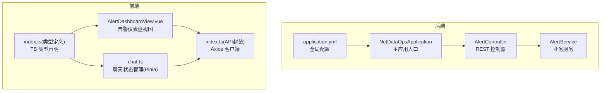
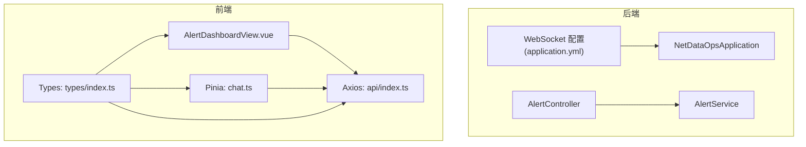
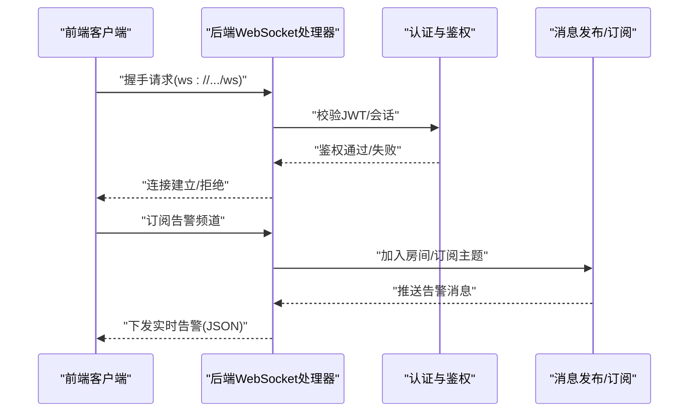
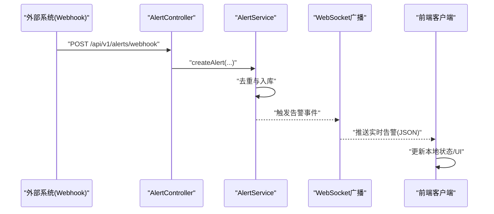
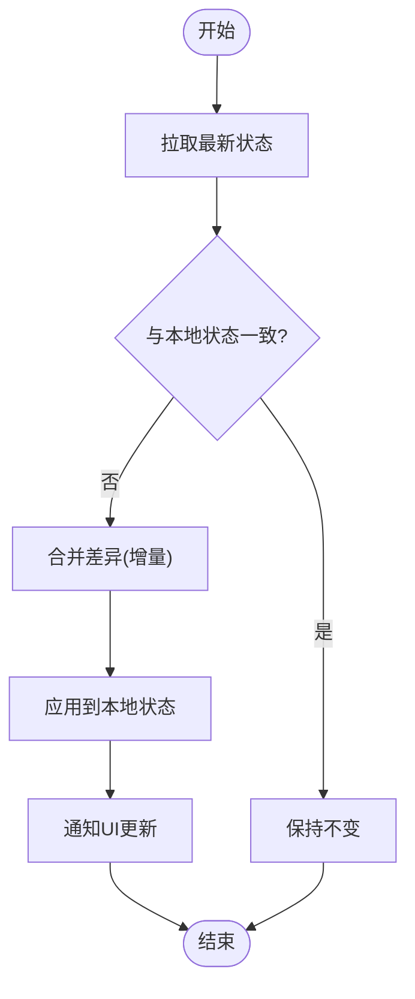
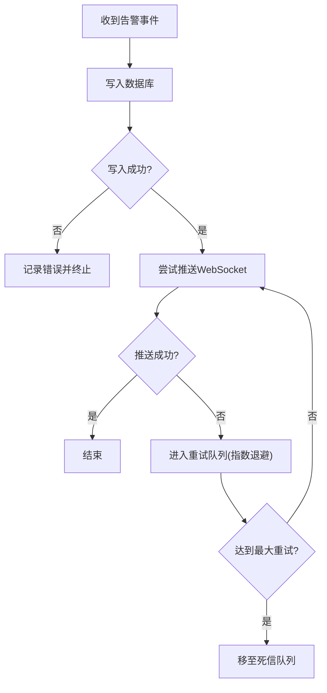
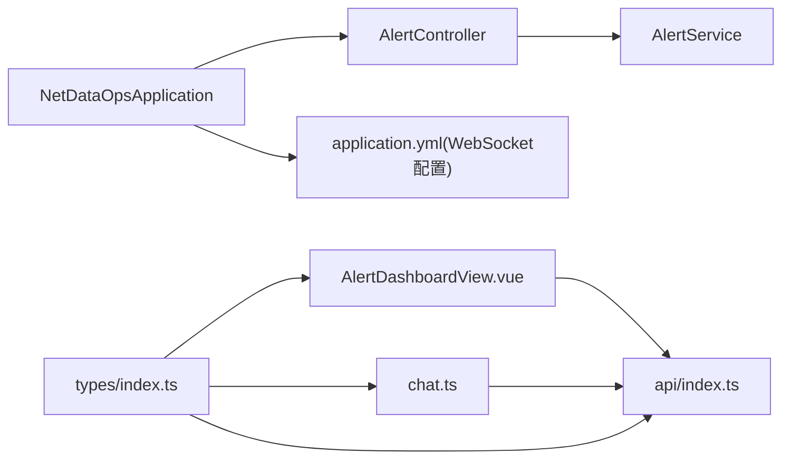

# 实时通信系统

<cite>
**本文引用的文件**
- [application.yml](file://netdata-ai-backend/src/main/resources/application.yml)
- [NetDataOpsApplication.java](file://netdata-ai-backend/src/main/java/com/netdata/ops/NetDataOpsApplication.java)
- [AlertController.java](file://netdata-ai-backend/src/main/java/com/netdata/ops/controller/AlertController.java)
- [AlertService.java](file://netdata-ai-backend/src/main/java/com/netdata/ops/service/AlertService.java)
- [index.ts](file://netdata-ai-frontend/src/types/index.ts)
- [index.ts](file://netdata-ai-frontend/src/api/index.ts)
- [chat.ts](file://netdata-ai-frontend/src/stores/chat.ts)
- [AlertDashboardView.vue](file://netdata-ai-frontend/src/views/AlertDashboardView.vue)
</cite>

## 目录
1. [引言](#引言)
2. [项目结构](#项目结构)
3. [核心组件](#核心组件)
4. [架构总览](#架构总览)
5. [详细组件分析](#详细组件分析)
6. [依赖分析](#依赖分析)
7. [性能考虑](#性能考虑)
8. [故障排查指南](#故障排查指南)
9. [结论](#结论)
10. [附录](#附录)

## 引言
本技术文档围绕“实时通信系统”的设计与实现展开，重点覆盖以下方面：
- WebSocket 架构设计：连接建立、消息传输与连接管理机制
- 实时告警推送：告警事件触发、消息格式与客户端接收处理
- 状态同步：前后端状态一致性与冲突解决策略
- 消息队列方案：消息持久化、重试与死信处理
- 安全性：连接认证、消息加密与防刷机制
- 性能优化：连接池、心跳检测与断线重连
- 完整流程示例与调试方法

在当前仓库中，后端通过 Spring Boot 提供 REST API 与配置项，前端采用 Vue + Pinia + Element Plus 构建，整体以 HTTP API 为主；实时通信能力在配置中预留了 WebSocket 路径与跨域设置，但未发现后端 WebSocket 处理器与前端 WebSocket 客户端实现。因此，本文在“实时通信”部分将以“现有能力 + 设计建议”的方式呈现，帮助读者在现有基础上扩展 WebSocket 实时能力。

## 项目结构
后端与前端分别位于 netdata-ai-backend 与 netdata-ai-frontend 目录，采用典型的 Spring Boot + Vue 前端工程组织方式。后端通过 application.yml 提供全局配置，前端通过 Pinia 管理状态并通过 Axios 封装 API 客户端。

**图表来源**
- [NetDataOpsApplication.java:1-36](file://netdata-ai-backend/src/main/java/com/netdata/ops/NetDataOpsApplication.java#L1-36)
- [AlertController.java:1-108](file://netdata-ai-backend/src/main/java/com/netdata/ops/controller/AlertController.java#L1-108)
- [AlertService.java:1-237](file://netdata-ai-backend/src/main/java/com/netdata/ops/service/AlertService.java#L1-237)
- [application.yml:250-256](file://netdata-ai-backend/src/main/resources/application.yml#L250-L256)
- [AlertDashboardView.vue:1-235](file://netdata-ai-frontend/src/views/AlertDashboardView.vue#L1-235)
- [chat.ts:1-210](file://netdata-ai-frontend/src/stores/chat.ts#L1-210)
- [index.ts:1-290](file://netdata-ai-frontend/src/api/index.ts#L1-290)
- [index.ts:1-169](file://netdata-ai-frontend/src/types/index.ts#L1-169)

**章节来源**
- [NetDataOpsApplication.java:1-36](file://netdata-ai-backend/src/main/java/com/netdata/ops/NetDataOpsApplication.java#L1-36)
- [application.yml:250-256](file://netdata-ai-backend/src/main/resources/application.yml#L250-L256)

## 核心组件
- 后端 REST 控制器与服务
  - AlertController：提供告警查询、确认、统计、趋势与触发诊断等接口
  - AlertService：负责告警记录的分页查询、去重入库、批量解决、统计与趋势计算
- 前端状态与 API
  - Pinia 聊天状态管理：对话创建、消息发送、加载状态与会话标识
  - Axios API 客户端：统一请求拦截、401 刷新、错误提示与接口封装
  - 类型定义：明确消息、告警、审批等数据结构

**章节来源**
- [AlertController.java:1-108](file://netdata-ai-backend/src/main/java/com/netdata/ops/controller/AlertController.java#L1-108)
- [AlertService.java:1-237](file://netdata-ai-backend/src/main/java/com/netdata/ops/service/AlertService.java#L1-237)
- [chat.ts:1-210](file://netdata-ai-frontend/src/stores/chat.ts#L1-210)
- [index.ts:1-290](file://netdata-ai-frontend/src/api/index.ts#L1-290)
- [index.ts:1-169](file://netdata-ai-frontend/src/types/index.ts#L1-169)

## 架构总览
下图展示了当前系统在“实时通信”方面的现状与扩展点。后端已预留 WebSocket 路径与跨域配置，前端具备状态管理与 API 封装能力，但尚未实现 WebSocket 处理器与客户端。

**图表来源**
- [application.yml:250-256](file://netdata-ai-backend/src/main/resources/application.yml#L250-L256)
- [AlertController.java:1-108](file://netdata-ai-backend/src/main/java/com/netdata/ops/controller/AlertController.java#L1-108)
- [AlertService.java:1-237](file://netdata-ai-backend/src/main/java/com/netdata/ops/service/AlertService.java#L1-237)
- [NetDataOpsApplication.java:1-36](file://netdata-ai-backend/src/main/java/com/netdata/ops/NetDataOpsApplication.java#L1-36)
- [AlertDashboardView.vue:1-235](file://netdata-ai-frontend/src/views/AlertDashboardView.vue#L1-235)
- [chat.ts:1-210](file://netdata-ai-frontend/src/stores/chat.ts#L1-210)
- [index.ts:1-290](file://netdata-ai-frontend/src/api/index.ts#L1-290)
- [index.ts:1-169](file://netdata-ai-frontend/src/types/index.ts#L1-169)

## 详细组件分析

### WebSocket 架构设计（设计建议）
- 连接建立
  - 后端通过 application.yml 中的 websocket.path 与 allowed-origins 配置暴露 WebSocket 路径与跨域策略
  - 建议在后端新增 WebSocket 配置类与处理器，基于路径进行用户鉴权与会话绑定
- 消息传输
  - 建议采用 JSON 格式消息，包含消息类型、目标用户/房间、内容与时间戳
  - 对于告警场景，消息应包含告警ID、级别、主机、指标与阈值等字段
- 连接管理
  - 建议引入连接池与心跳检测，定期校验活跃连接
  - 断线重连采用指数退避策略，避免雪崩效应

**图表来源**
- [application.yml:250-256](file://netdata-ai-backend/src/main/resources/application.yml#L250-L256)

**章节来源**
- [application.yml:250-256](file://netdata-ai-backend/src/main/resources/application.yml#L250-L256)

### 实时告警推送系统（当前能力与扩展）
- 告警事件触发
  - 后端提供 /api/v1/alerts/webhook 接口接收外部告警，内部通过 AlertService 去重入库
  - 建议在入库后触发 WebSocket 广播，向订阅该主机/指标的客户端推送实时告警
- 消息格式定义
  - 前端类型定义中包含 Alert 接口，建议后端推送消息结构与之对齐
- 客户端接收处理
  - 前端可通过 Axios 获取告警列表，若需实时更新，可在 WebSocket 建立后订阅并更新本地状态

**图表来源**
- [AlertController.java:69-85](file://netdata-ai-backend/src/main/java/com/netdata/ops/controller/AlertController.java#L69-L85)
- [AlertService.java:96-128](file://netdata-ai-backend/src/main/java/com/netdata/ops/service/AlertService.java#L96-L128)
- [index.ts:109-124](file://netdata-ai-frontend/src/types/index.ts#L109-L124)

**章节来源**
- [AlertController.java:1-108](file://netdata-ai-backend/src/main/java/com/netdata/ops/controller/AlertController.java#L1-108)
- [AlertService.java:1-237](file://netdata-ai-backend/src/main/java/com/netdata/ops/service/AlertService.java#L1-237)
- [index.ts:109-124](file://netdata-ai-frontend/src/types/index.ts#L109-L124)

### 状态同步机制（设计建议）
- 前后端状态一致性
  - 前端使用 Pinia 管理会话与消息列表；后端通过数据库持久化告警状态
  - 建议在 WebSocket 广播中携带状态变更摘要，前端根据增量更新本地状态
- 冲突解决策略
  - 对于并发更新，采用“最后写入获胜(LWW)”或“向量时钟”策略
  - 对于 UI 交互导致的状态变更，先本地乐观更新，再等待后端确认

**图表来源**
- [chat.ts:1-210](file://netdata-ai-frontend/src/stores/chat.ts#L1-210)

**章节来源**
- [chat.ts:1-210](file://netdata-ai-frontend/src/stores/chat.ts#L1-210)

### 消息队列实现方案（设计建议）
- 消息持久化
  - 告警入库采用数据库事务保障一致性；WebSocket 广播前确保消息落库
- 重试机制
  - 对外推播失败进行指数退避重试，最大重试次数与超时时间可配置
- 死信处理
  - 超过最大重试次数后进入死信队列，记录失败原因与上下文，便于人工干预

**图表来源**
- [AlertService.java:96-128](file://netdata-ai-backend/src/main/java/com/netdata/ops/service/AlertService.java#L96-L128)

**章节来源**
- [AlertService.java:1-237](file://netdata-ai-backend/src/main/java/com/netdata/ops/service/AlertService.java#L1-237)

### 安全考虑（设计建议）
- 连接认证
  - WebSocket 握手阶段校验 JWT 或会话令牌，仅授权用户可订阅敏感频道
- 消息加密
  - 建议启用 WSS(WebSocket Secure)，传输层 TLS 保护
- 防刷机制
  - 结合后端限流与前端节流，限制单用户/单IP的订阅与推送频率

**章节来源**
- [application.yml:250-256](file://netdata-ai-backend/src/main/resources/application.yml#L250-L256)

### 性能优化策略（设计建议）
- 连接池管理
  - 后端配置合理的最大连接数与空闲超时，避免资源耗尽
- 心跳检测
  - 前端与后端均实现心跳包，超时未响应则判定断线
- 断线重连
  - 指数退避重连，避免同时大量重连造成拥塞

**章节来源**
- [application.yml:250-256](file://netdata-ai-backend/src/main/resources/application.yml#L250-L256)

### 完整实时通信流程示例与调试方法
- 流程示例
  - 外部系统触发告警 → 后端接收并入库 → 触发 WebSocket 广播 → 前端订阅并更新 UI
- 调试方法
  - 后端开启 DEBUG 日志，观察告警入库与广播日志
  - 前端打开浏览器开发者工具，查看网络面板中的 WebSocket 握手与消息收发
  - 使用 curl 或 Postman 验证 REST 接口可用性与鉴权

**章节来源**
- [AlertController.java:69-85](file://netdata-ai-backend/src/main/java/com/netdata/ops/controller/AlertController.java#L69-L85)
- [AlertService.java:96-128](file://netdata-ai-backend/src/main/java/com/netdata/ops/service/AlertService.java#L96-L128)
- [index.ts:1-290](file://netdata-ai-frontend/src/api/index.ts#L1-290)

## 依赖分析
- 后端模块
  - NetDataOpsApplication 作为启动入口，启用异步支持
  - AlertController 依赖 AlertService 提供业务能力
  - application.yml 提供 WebSocket 路径与跨域配置
- 前端模块
  - AlertDashboardView.vue 依赖类型定义与 API 封装
  - chat.ts 通过 Axios 与后端交互，管理会话与消息状态

**图表来源**
- [NetDataOpsApplication.java:1-36](file://netdata-ai-backend/src/main/java/com/netdata/ops/NetDataOpsApplication.java#L1-36)
- [AlertController.java:1-108](file://netdata-ai-backend/src/main/java/com/netdata/ops/controller/AlertController.java#L1-108)
- [AlertService.java:1-237](file://netdata-ai-backend/src/main/java/com/netdata/ops/service/AlertService.java#L1-237)
- [application.yml:250-256](file://netdata-ai-backend/src/main/resources/application.yml#L250-L256)
- [AlertDashboardView.vue:1-235](file://netdata-ai-frontend/src/views/AlertDashboardView.vue#L1-235)
- [chat.ts:1-210](file://netdata-ai-frontend/src/stores/chat.ts#L1-210)
- [index.ts:1-290](file://netdata-ai-frontend/src/api/index.ts#L1-290)
- [index.ts:1-169](file://netdata-ai-frontend/src/types/index.ts#L1-169)

**章节来源**
- [NetDataOpsApplication.java:1-36](file://netdata-ai-backend/src/main/java/com/netdata/ops/NetDataOpsApplication.java#L1-36)
- [AlertController.java:1-108](file://netdata-ai-backend/src/main/java/com/netdata/ops/controller/AlertController.java#L1-108)
- [AlertService.java:1-237](file://netdata-ai-backend/src/main/java/com/netdata/ops/service/AlertService.java#L1-237)
- [application.yml:250-256](file://netdata-ai-backend/src/main/resources/application.yml#L250-L256)
- [AlertDashboardView.vue:1-235](file://netdata-ai-frontend/src/views/AlertDashboardView.vue#L1-235)
- [chat.ts:1-210](file://netdata-ai-frontend/src/stores/chat.ts#L1-210)
- [index.ts:1-290](file://netdata-ai-frontend/src/api/index.ts#L1-290)
- [index.ts:1-169](file://netdata-ai-frontend/src/types/index.ts#L1-169)

## 性能考虑
- 连接与资源
  - 合理设置连接池大小与空闲超时，避免高并发下的连接抖动
- 消息体积
  - 告警消息尽量精简，必要字段通过类型定义约束
- 前端渲染
  - 使用虚拟滚动与懒加载减少大列表渲染压力

[本节为通用指导，无需列出具体文件来源]

## 故障排查指南
- WebSocket 无法连接
  - 检查 application.yml 中 websocket.path 与 allowed-origins 配置
  - 确认前端访问地址与后端配置一致
- 认证失败
  - 确认前端请求头是否包含有效的 Authorization
  - 检查后端拦截器与 JWT 配置
- 告警未推送
  - 检查 AlertService 的去重逻辑与入库日志
  - 确认 WebSocket 广播是否被触发

**章节来源**
- [application.yml:250-256](file://netdata-ai-backend/src/main/resources/application.yml#L250-L256)
- [index.ts:29-112](file://netdata-ai-frontend/src/api/index.ts#L29-L112)
- [AlertService.java:96-128](file://netdata-ai-backend/src/main/java/com/netdata/ops/service/AlertService.java#L96-L128)

## 结论
当前系统以 REST API 为核心，具备完善的告警接收、存储与统计能力；在配置层面预留了 WebSocket 支持。建议在此基础上补充 WebSocket 处理器与客户端，结合现有类型定义与状态管理，构建完整的实时通信体系。通过合理的消息队列、重试与死信处理，以及认证、加密与防刷机制，可进一步提升系统的可靠性与安全性。

[本节为总结性内容，无需列出具体文件来源]

## 附录
- 关键配置项
  - websocket.path：WebSocket 路径
  - websocket.allowed-origins：允许的来源
- 前端类型参考
  - Alert：告警数据结构
  - ChatRequest/ChatResponse：聊天请求与响应结构

**章节来源**
- [application.yml:250-256](file://netdata-ai-backend/src/main/resources/application.yml#L250-L256)
- [index.ts:109-124](file://netdata-ai-frontend/src/types/index.ts#L109-L124)
- [index.ts:84-99](file://netdata-ai-frontend/src/types/index.ts#L84-L99)