# 消息队列处理

<cite>
**本文引用的文件**
- [AgentEventBus.java](file://netdata-ai-backend/src/main/java/com/netdata/ops/core/agent/event/AgentEventBus.java)
- [AgentMessage.java](file://netdata-ai-backend/src/main/java/com/netdata/ops/core/agent/event/AgentMessage.java)
- [AgentMessageHandler.java](file://netdata-ai-backend/src/main/java/com/netdata/ops/core/agent/event/AgentMessageHandler.java)
- [AgentEventConfig.java](file://netdata-ai-backend/src/main/java/com/netdata/ops/core/agent/event/AgentEventConfig.java)
- [ExecutionAgent.java](file://netdata-ai-backend/src/main/java/com/netdata/ops/core/agent/ExecutionAgent.java)
- [AnalysisAgent.java](file://netdata-ai-backend/src/main/java/com/netdata/ops/core/agent/AnalysisAgent.java)
- [application.yml](file://netdata-ai-backend/src/main/resources/application.yml)
- [AgentMetrics.java](file://netdata-ai-backend/src/main/java/com/netdata/ops/core/agent/AgentMetrics.java)
- [ResilientWebClientWrapper.java](file://netdata-ai-backend/src/main/java/com/netdata/ops/core/ai/ResilientWebClientWrapper.java)
- [RateLimitInterceptor.java](file://netdata-ai-backend/src/main/java/com/netdata/ops/interceptor/RateLimitInterceptor.java)
</cite>

## 目录
1. [引言](#引言)
2. [项目结构](#项目结构)
3. [核心组件](#核心组件)
4. [架构总览](#架构总览)
5. [详细组件分析](#详细组件分析)
6. [依赖分析](#依赖分析)
7. [性能考虑](#性能考虑)
8. [故障排除指南](#故障排除指南)
9. [结论](#结论)
10. [附录](#附录)

## 引言
本技术文档围绕“消息队列处理系统”的实现进行深入解析，结合仓库中的 Agent 事件总线与相关组件，系统阐述消息生产、存储、分发与消费的完整流程，并扩展到消息持久化、重试与熔断、路由与负载均衡、性能监控与优化、安全机制以及运维排障等方面。文档以代码为依据，辅以可视化图表帮助读者理解整体架构与关键路径。

## 项目结构
本项目采用 Spring Boot 架构，消息队列处理能力通过“事件总线 + 处理器接口 + 异步线程池”的组合实现，核心位于后端模块的 Agent 子系统中。关键文件组织如下：
- 事件总线与消息模型：AgentEventBus、AgentMessage、AgentMessageHandler
- 事件总线异步配置：AgentEventConfig
- 具体 Agent 实现：ExecutionAgent（审批与执行）、AnalysisAgent（诊断）
- 应用配置：application.yml（包含限流、安全、监控等配置）
- 指标与可观测性：AgentMetrics
- 容错与降级：ResilientWebClientWrapper
- 安全与防刷：RateLimitInterceptor

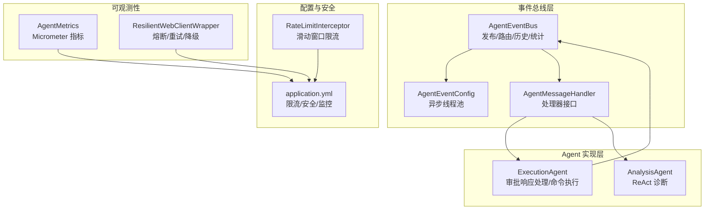

**图表来源**
- [AgentEventBus.java:1-155](file://netdata-ai-backend/src/main/java/com/netdata/ops/core/agent/event/AgentEventBus.java#L1-L155)
- [AgentEventConfig.java:1-34](file://netdata-ai-backend/src/main/java/com/netdata/ops/core/agent/event/AgentEventConfig.java#L1-L34)
- [AgentMessageHandler.java:1-20](file://netdata-ai-backend/src/main/java/com/netdata/ops/core/agent/event/AgentMessageHandler.java#L1-L20)
- [ExecutionAgent.java:1-425](file://netdata-ai-backend/src/main/java/com/netdata/ops/core/agent/ExecutionAgent.java#L1-L425)
- [AnalysisAgent.java:1-261](file://netdata-ai-backend/src/main/java/com/netdata/ops/core/agent/AnalysisAgent.java#L1-L261)
- [application.yml:1-314](file://netdata-ai-backend/src/main/resources/application.yml#L1-L314)
- [AgentMetrics.java:1-113](file://netdata-ai-backend/src/main/java/com/netdata/ops/core/agent/AgentMetrics.java#L1-L113)
- [ResilientWebClientWrapper.java:1-262](file://netdata-ai-backend/src/main/java/com/netdata/ops/core/ai/ResilientWebClientWrapper.java#L1-L262)
- [RateLimitInterceptor.java:1-100](file://netdata-ai-backend/src/main/java/com/netdata/ops/interceptor/RateLimitInterceptor.java#L1-L100)

**章节来源**
- [AgentEventBus.java:1-155](file://netdata-ai-backend/src/main/java/com/netdata/ops/core/agent/event/AgentEventBus.java#L1-L155)
- [AgentEventConfig.java:1-34](file://netdata-ai-backend/src/main/java/com/netdata/ops/core/agent/event/AgentEventConfig.java#L1-L34)
- [application.yml:190-237](file://netdata-ai-backend/src/main/resources/application.yml#L190-L237)

## 核心组件
- 事件总线（AgentEventBus）：负责消息发布、路由（点对点/广播）、异步处理、历史记录与统计。
- 消息模型（AgentMessage）：定义消息字段（ID、源/目标 Agent、类型、负载、优先级、时间戳等）。
- 处理器接口（AgentMessageHandler）：统一的处理契约，按消息类型与目标进行路由。
- 异步配置（AgentEventConfig）：独立线程池，避免阻塞主线程。
- 具体 Agent（ExecutionAgent、AnalysisAgent）：实现消息处理逻辑与业务流程。
- 指标与监控（AgentMetrics）：基于 Micrometer 的执行耗时、成功/失败计数、超时、并发数等。
- 容错与降级（ResilientWebClientWrapper）：集成 Resilience4j 的熔断、重试、超时限制与降级策略。
- 安全与防刷（RateLimitInterceptor）：基于 Redis 的滑动窗口限流，防止接口滥用。

**章节来源**
- [AgentEventBus.java:15-155](file://netdata-ai-backend/src/main/java/com/netdata/ops/core/agent/event/AgentEventBus.java#L15-L155)
- [AgentMessage.java:8-54](file://netdata-ai-backend/src/main/java/com/netdata/ops/core/agent/event/AgentMessage.java#L8-L54)
- [AgentMessageHandler.java:3-20](file://netdata-ai-backend/src/main/java/com/netdata/ops/core/agent/event/AgentMessageHandler.java#L3-L20)
- [AgentEventConfig.java:10-33](file://netdata-ai-backend/src/main/java/com/netdata/ops/core/agent/event/AgentEventConfig.java#L10-L33)
- [AgentMetrics.java:12-113](file://netdata-ai-backend/src/main/java/com/netdata/ops/core/agent/AgentMetrics.java#L12-L113)
- [ResilientWebClientWrapper.java:31-262](file://netdata-ai-backend/src/main/java/com/netdata/ops/core/ai/ResilientWebClientWrapper.java#L31-L262)
- [RateLimitInterceptor.java:18-100](file://netdata-ai-backend/src/main/java/com/netdata/ops/interceptor/RateLimitInterceptor.java#L18-L100)

## 架构总览
消息队列处理系统采用“事件驱动 + 异步处理 + 路由分发”的架构。消息生产者通过事件总线发布消息，总线根据目标 Agent 与消息类型进行路由，异步线程池并发处理，处理器完成业务逻辑后可继续发布新消息，形成闭环。

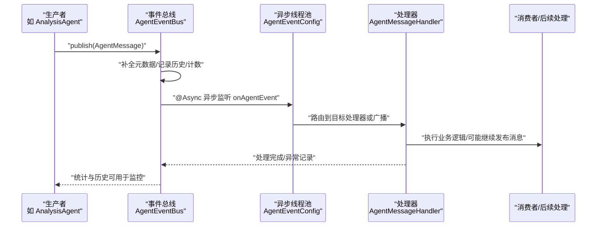

**图表来源**
- [AgentEventBus.java:69-133](file://netdata-ai-backend/src/main/java/com/netdata/ops/core/agent/event/AgentEventBus.java#L69-L133)
- [AgentEventConfig.java:22-32](file://netdata-ai-backend/src/main/java/com/netdata/ops/core/agent/event/AgentEventConfig.java#L22-L32)
- [AgentMessageHandler.java:12-19](file://netdata-ai-backend/src/main/java/com/netdata/ops/core/agent/event/AgentMessageHandler.java#L12-L19)

## 详细组件分析

### 事件总线与消息模型
- 事件总线职责：发布消息、异步监听、点对点/广播路由、消息历史与统计。
- 消息模型：包含消息 ID、源/目标 Agent、类型枚举、负载、优先级、时间戳等。
- 路由策略：目标存在则点对点投递，否则广播给所有支持该类型的消息处理器。
- 异步处理：通过注解启用异步，使用独立线程池，拒绝策略采用调用者运行策略，避免丢消息但可能短暂阻塞调用线程。

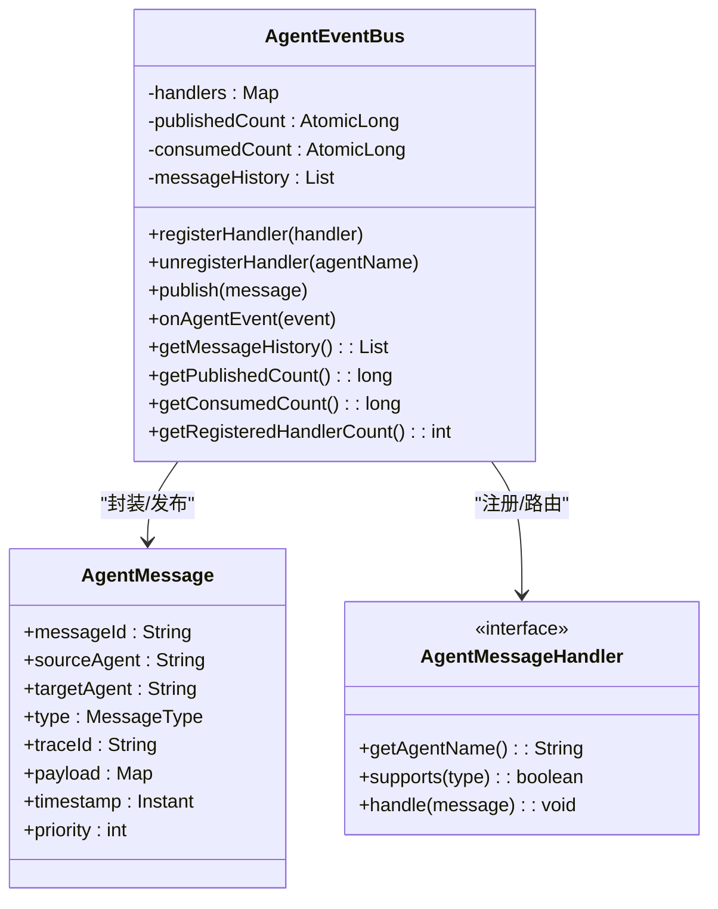

**图表来源**
- [AgentEventBus.java:34-154](file://netdata-ai-backend/src/main/java/com/netdata/ops/core/agent/event/AgentEventBus.java#L34-L154)
- [AgentMessage.java:19-52](file://netdata-ai-backend/src/main/java/com/netdata/ops/core/agent/event/AgentMessage.java#L19-L52)
- [AgentMessageHandler.java:12-19](file://netdata-ai-backend/src/main/java/com/netdata/ops/core/agent/event/AgentMessageHandler.java#L12-L19)

**章节来源**
- [AgentEventBus.java:67-133](file://netdata-ai-backend/src/main/java/com/netdata/ops/core/agent/event/AgentEventBus.java#L67-L133)
- [AgentMessage.java:8-54](file://netdata-ai-backend/src/main/java/com/netdata/ops/core/agent/event/AgentMessage.java#L8-L54)
- [AgentEventConfig.java:18-33](file://netdata-ai-backend/src/main/java/com/netdata/ops/core/agent/event/AgentEventConfig.java#L18-L33)

### 执行代理（ExecutionAgent）与审批流程
- 职责：解析用户命令、风险评估、生成审批请求、审批通过后的执行、审计日志。
- 安全机制：黑名单（禁止执行）、白名单（自动执行）、灰名单（需要审批）。
- 审批流程：创建审批请求并持久化，发布 APPROVAL_REQUEST 消息到事件总线；收到 APPROVAL_RESPONSE 后执行或拒绝。
- 分布式锁：防止重复执行同一命令。

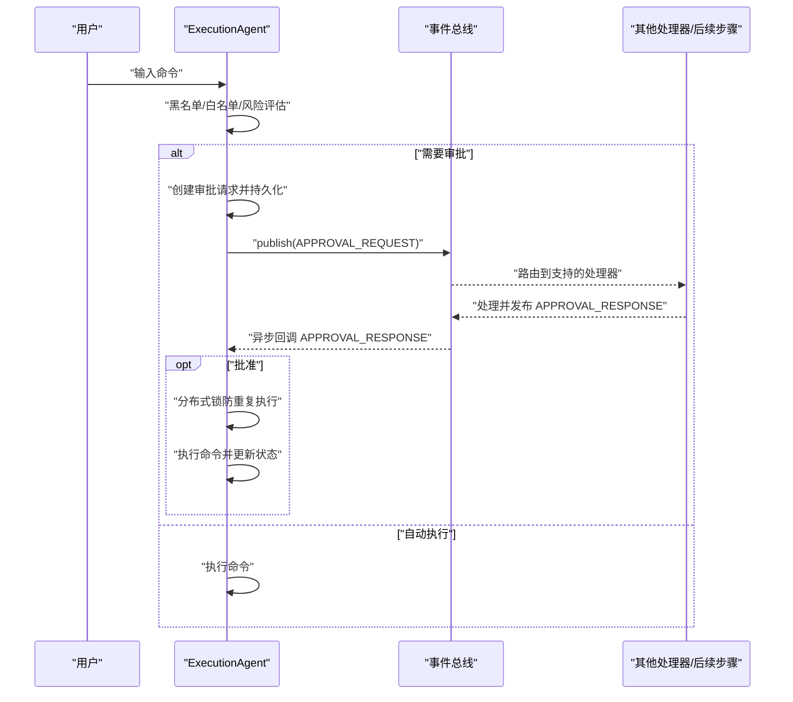

**图表来源**
- [ExecutionAgent.java:95-145](file://netdata-ai-backend/src/main/java/com/netdata/ops/core/agent/ExecutionAgent.java#L95-L145)
- [ExecutionAgent.java:342-395](file://netdata-ai-backend/src/main/java/com/netdata/ops/core/agent/ExecutionAgent.java#L342-L395)
- [AgentEventBus.java:96-133](file://netdata-ai-backend/src/main/java/com/netdata/ops/core/agent/event/AgentEventBus.java#L96-L133)

**章节来源**
- [ExecutionAgent.java:18-198](file://netdata-ai-backend/src/main/java/com/netdata/ops/core/agent/ExecutionAgent.java#L18-L198)
- [ExecutionAgent.java:342-395](file://netdata-ai-backend/src/main/java/com/netdata/ops/core/agent/ExecutionAgent.java#L342-L395)

### 诊断代理（AnalysisAgent）与 ReAct 流程
- 职责：委托 ReActEngine 执行 LLM 推理循环，动态决策工具选择，转换为 AgentResult。
- 上下文构建：整合用户意图、置信度、历史对话、附加元数据等。
- 输出：诊断报告、命令建议、工具调用历史，支持较长超时时间。

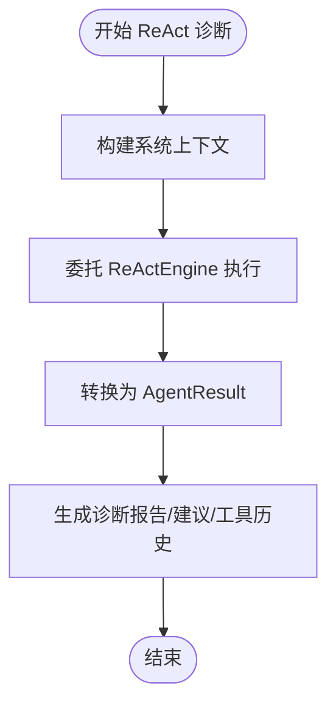

**图表来源**
- [AnalysisAgent.java:47-133](file://netdata-ai-backend/src/main/java/com/netdata/ops/core/agent/AnalysisAgent.java#L47-L133)

**章节来源**
- [AnalysisAgent.java:12-103](file://netdata-ai-backend/src/main/java/com/netdata/ops/core/agent/AnalysisAgent.java#L12-L103)
- [AnalysisAgent.java:105-133](file://netdata-ai-backend/src/main/java/com/netdata/ops/core/agent/AnalysisAgent.java#L105-L133)

### 消息持久化与存储策略
- 审批请求持久化：ExecutionAgent 在创建审批请求时调用状态管理器进行持久化，确保消息处理状态可恢复。
- 消息历史：事件总线维护最近 100 条消息历史，便于审计与调试。
- 存储介质：应用配置中使用 MySQL 与 Redis，可作为持久化与缓存的基础。

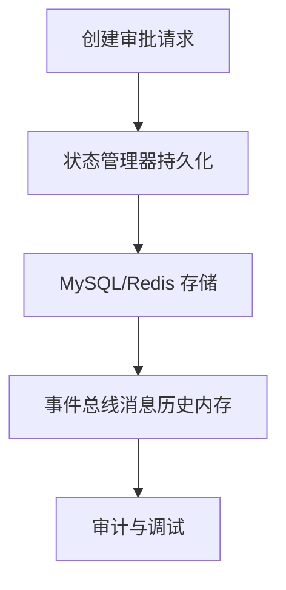

**图表来源**
- [ExecutionAgent.java:345-351](file://netdata-ai-backend/src/main/java/com/netdata/ops/core/agent/ExecutionAgent.java#L345-L351)
- [AgentEventBus.java:137-147](file://netdata-ai-backend/src/main/java/com/netdata/ops/core/agent/event/AgentEventBus.java#L137-L147)
- [application.yml:31-42](file://netdata-ai-backend/src/main/resources/application.yml#L31-L42)

**章节来源**
- [ExecutionAgent.java:345-351](file://netdata-ai-backend/src/main/java/com/netdata/ops/core/agent/ExecutionAgent.java#L345-L351)
- [AgentEventBus.java:135-147](file://netdata-ai-backend/src/main/java/com/netdata/ops/core/agent/event/AgentEventBus.java#L135-L147)
- [application.yml:31-59](file://netdata-ai-backend/src/main/resources/application.yml#L31-L59)

### 重试与熔断、降级与死信处理
- 重试与熔断：通过 ResilientWebClientWrapper 集成 Resilience4j 的 Retry 与 CircuitBreaker，对外部服务调用进行容错。
- 降级：当外部服务不可用或熔断打开时，返回降级结果（如阈值判断），并标记降级状态。
- 死信处理：当前代码未显式实现专用死信队列；可通过以下方式扩展：将多次重试失败的消息转存至专用队列或表，配合定时任务或后台作业进行兜底处理与人工干预。

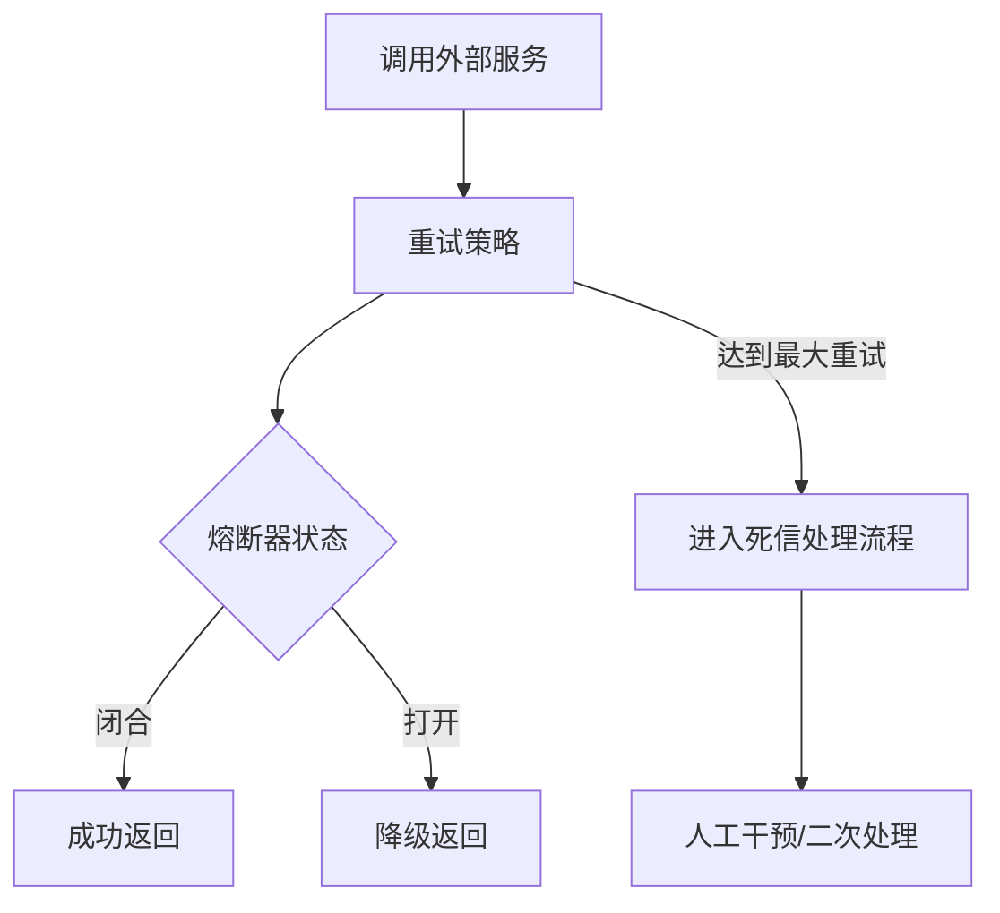

**图表来源**
- [ResilientWebClientWrapper.java:55-63](file://netdata-ai-backend/src/main/java/com/netdata/ops/core/ai/ResilientWebClientWrapper.java#L55-L63)
- [application.yml:152-155](file://netdata-ai-backend/src/main/resources/application.yml#L152-L155)

**章节来源**
- [ResilientWebClientWrapper.java:31-262](file://netdata-ai-backend/src/main/java/com/netdata/ops/core/ai/ResilientWebClientWrapper.java#L31-L262)
- [application.yml:148-155](file://netdata-ai-backend/src/main/resources/application.yml#L148-L155)

### 消息路由与负载均衡
- 路由规则：事件总线根据消息目标 Agent 与处理器支持的消息类型进行点对点或广播路由。
- 负载均衡：异步线程池（核心/最大线程、队列容量、拒绝策略）实现处理端的并发负载均衡；处理器注册数量决定广播分发的负载。
- 扩展建议：若需跨节点分发，可在现有事件总线基础上引入外部消息中间件（如 Kafka/RabbitMQ），并通过适配器接入。

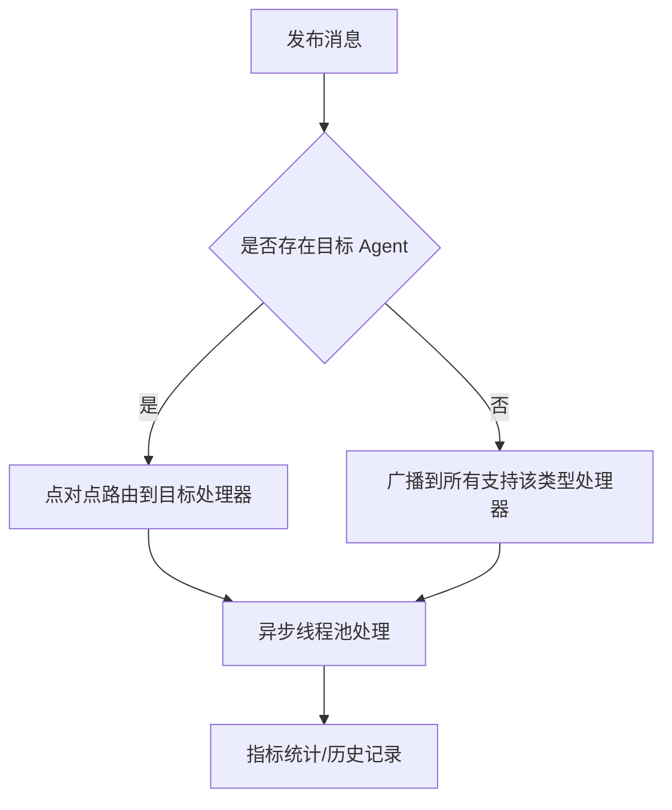

**图表来源**
- [AgentEventBus.java:96-133](file://netdata-ai-backend/src/main/java/com/netdata/ops/core/agent/event/AgentEventBus.java#L96-L133)
- [AgentEventConfig.java:22-32](file://netdata-ai-backend/src/main/java/com/netdata/ops/core/agent/event/AgentEventConfig.java#L22-L32)

**章节来源**
- [AgentEventBus.java:94-133](file://netdata-ai-backend/src/main/java/com/netdata/ops/core/agent/event/AgentEventBus.java#L94-L133)
- [AgentEventConfig.java:22-32](file://netdata-ai-backend/src/main/java/com/netdata/ops/core/agent/event/AgentEventConfig.java#L22-L32)

### 性能监控与优化
- 指标体系：执行耗时（Timer）、成功/失败计数（Counter）、超时计数（Counter）、活跃执行数（Gauge）。
- 监控暴露：Actuator 暴露健康检查、指标、Prometheus 端点，Resilience4j 指标集成。
- 优化建议：
  - 调整异步线程池大小与队列容量，平衡吞吐与延迟。
  - 为高优先级消息（如审批响应）设置更高优先级并在路由时优先处理。
  - 使用指标驱动的自适应限流与熔断阈值调整。

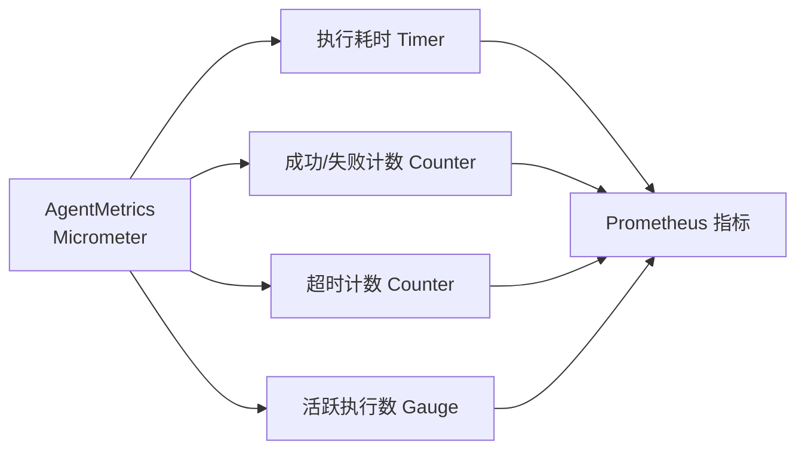

**图表来源**
- [AgentMetrics.java:52-111](file://netdata-ai-backend/src/main/java/com/netdata/ops/core/agent/AgentMetrics.java#L52-L111)
- [application.yml:206-236](file://netdata-ai-backend/src/main/resources/application.yml#L206-L236)

**章节来源**
- [AgentMetrics.java:12-113](file://netdata-ai-backend/src/main/java/com/netdata/ops/core/agent/AgentMetrics.java#L12-L113)
- [application.yml:206-236](file://netdata-ai-backend/src/main/resources/application.yml#L206-L236)

### 安全机制
- 访问控制：JWT 认证配置，令牌有效期与刷新策略。
- 防刷保护：基于 Redis 的滑动窗口限流，支持按用户或 IP 维度限流。
- 命令安全：ExecutionAgent 的黑名单/白名单与风险评估，防止高危命令执行。

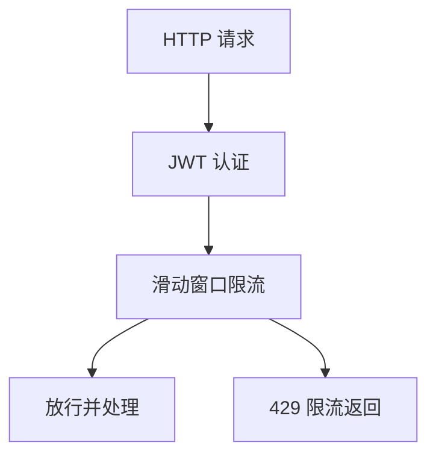

**图表来源**
- [application.yml:191-202](file://netdata-ai-backend/src/main/resources/application.yml#L191-L202)
- [RateLimitInterceptor.java:35-68](file://netdata-ai-backend/src/main/java/com/netdata/ops/interceptor/RateLimitInterceptor.java#L35-L68)
- [ExecutionAgent.java:48-82](file://netdata-ai-backend/src/main/java/com/netdata/ops/core/agent/ExecutionAgent.java#L48-L82)

**章节来源**
- [application.yml:191-202](file://netdata-ai-backend/src/main/resources/application.yml#L191-L202)
- [RateLimitInterceptor.java:18-100](file://netdata-ai-backend/src/main/java/com/netdata/ops/interceptor/RateLimitInterceptor.java#L18-L100)
- [ExecutionAgent.java:25-82](file://netdata-ai-backend/src/main/java/com/netdata/ops/core/agent/ExecutionAgent.java#L25-L82)

## 依赖分析
- 组件耦合：事件总线与处理器接口解耦，处理器通过接口注册；ExecutionAgent 与 AnalysisAgent 分别实现不同业务场景。
- 外部依赖：Spring ApplicationEvent、Micrometer、Resilience4j、Redis、MySQL。
- 潜在风险：当前未发现循环依赖；异步线程池容量与任务队列长度需与业务峰值匹配，避免积压。

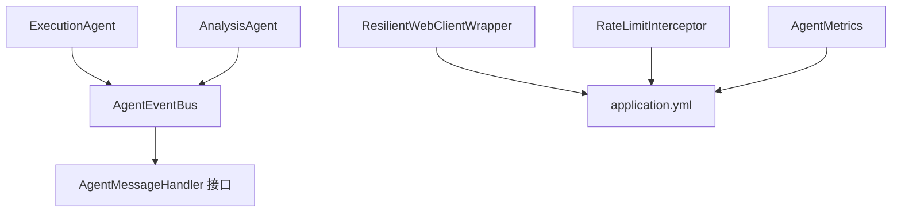

**图表来源**
- [AgentEventBus.java:34-154](file://netdata-ai-backend/src/main/java/com/netdata/ops/core/agent/event/AgentEventBus.java#L34-L154)
- [AgentMessageHandler.java:12-19](file://netdata-ai-backend/src/main/java/com/netdata/ops/core/agent/event/AgentMessageHandler.java#L12-L19)
- [ExecutionAgent.java:84-93](file://netdata-ai-backend/src/main/java/com/netdata/ops/core/agent/ExecutionAgent.java#L84-L93)
- [AnalysisAgent.java:38-45](file://netdata-ai-backend/src/main/java/com/netdata/ops/core/agent/AnalysisAgent.java#L38-L45)
- [application.yml:1-314](file://netdata-ai-backend/src/main/resources/application.yml#L1-L314)
- [AgentMetrics.java:31-113](file://netdata-ai-backend/src/main/java/com/netdata/ops/core/agent/AgentMetrics.java#L31-L113)
- [ResilientWebClientWrapper.java:55-63](file://netdata-ai-backend/src/main/java/com/netdata/ops/core/ai/ResilientWebClientWrapper.java#L55-L63)
- [RateLimitInterceptor.java:24-33](file://netdata-ai-backend/src/main/java/com/netdata/ops/interceptor/RateLimitInterceptor.java#L24-L33)

**章节来源**
- [AgentEventBus.java:34-154](file://netdata-ai-backend/src/main/java/com/netdata/ops/core/agent/event/AgentEventBus.java#L34-L154)
- [AgentMessageHandler.java:12-19](file://netdata-ai-backend/src/main/java/com/netdata/ops/core/agent/event/AgentMessageHandler.java#L12-L19)
- [ExecutionAgent.java:84-93](file://netdata-ai-backend/src/main/java/com/netdata/ops/core/agent/ExecutionAgent.java#L84-L93)
- [AnalysisAgent.java:38-45](file://netdata-ai-backend/src/main/java/com/netdata/ops/core/agent/AnalysisAgent.java#L38-L45)
- [application.yml:1-314](file://netdata-ai-backend/src/main/resources/application.yml#L1-L314)

## 性能考虑
- 吞吐量：通过异步线程池与合理的队列容量提升并发处理能力；根据业务峰值调整核心/最大线程数。
- 延迟优化：优先处理高优先级消息；减少处理器内部同步阻塞；合理设置超时与重试间隔。
- 资源调度：利用 Micrometer 指标与 Actuator 监控，动态扩缩容或调整线程池参数；结合限流策略避免雪崩。

## 故障排除指南
- 事件未被消费：检查处理器是否正确注册、supports 是否匹配消息类型、异步线程池是否饱和。
- 消息重复：ExecutionAgent 使用分布式锁避免重复执行；若仍出现，检查锁粒度与释放逻辑。
- 外部服务异常：查看 ResilientWebClientWrapper 的熔断状态与降级标志，确认阈值与重试策略。
- 限流触发：检查 RateLimitInterceptor 的 Redis 计数与窗口清理，确认用户/IP 维度键生成是否正确。
- 指标缺失：确认 Actuator 暴露端点与 Micrometer 配置，检查标签与指标命名一致性。

**章节来源**
- [AgentEventBus.java:96-133](file://netdata-ai-backend/src/main/java/com/netdata/ops/core/agent/event/AgentEventBus.java#L96-L133)
- [ExecutionAgent.java:122-136](file://netdata-ai-backend/src/main/java/com/netdata/ops/core/agent/ExecutionAgent.java#L122-L136)
- [ResilientWebClientWrapper.java:242-261](file://netdata-ai-backend/src/main/java/com/netdata/ops/core/ai/ResilientWebClientWrapper.java#L242-L261)
- [RateLimitInterceptor.java:35-68](file://netdata-ai-backend/src/main/java/com/netdata/ops/interceptor/RateLimitInterceptor.java#L35-L68)
- [application.yml:206-236](file://netdata-ai-backend/src/main/resources/application.yml#L206-L236)

## 结论
本消息队列处理系统以事件总线为核心，结合异步线程池、处理器接口与消息模型，实现了清晰的消息生产、路由与消费闭环。通过持久化、监控与限流等机制，系统具备良好的可运维性与安全性。建议在现有基础上引入外部消息中间件以支持水平扩展与跨节点分发，并完善死信处理与重试策略，以满足更高可用性与可靠性需求。

## 附录
- 配置要点参考：application.yml 中的限流、安全、监控与数据源配置。
- 指标端点：Actuator 暴露 metrics、prometheus 等端点，便于对接监控系统。

**章节来源**
- [application.yml:190-236](file://netdata-ai-backend/src/main/resources/application.yml#L190-L236)