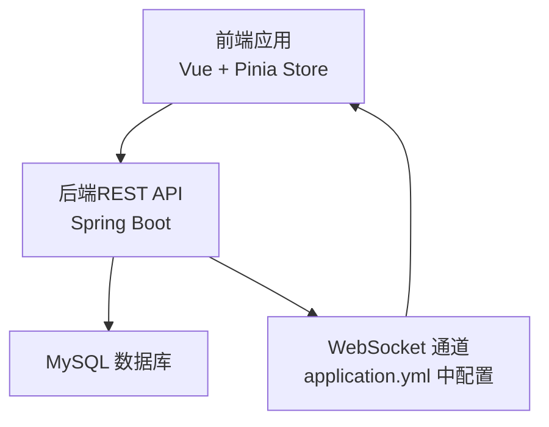
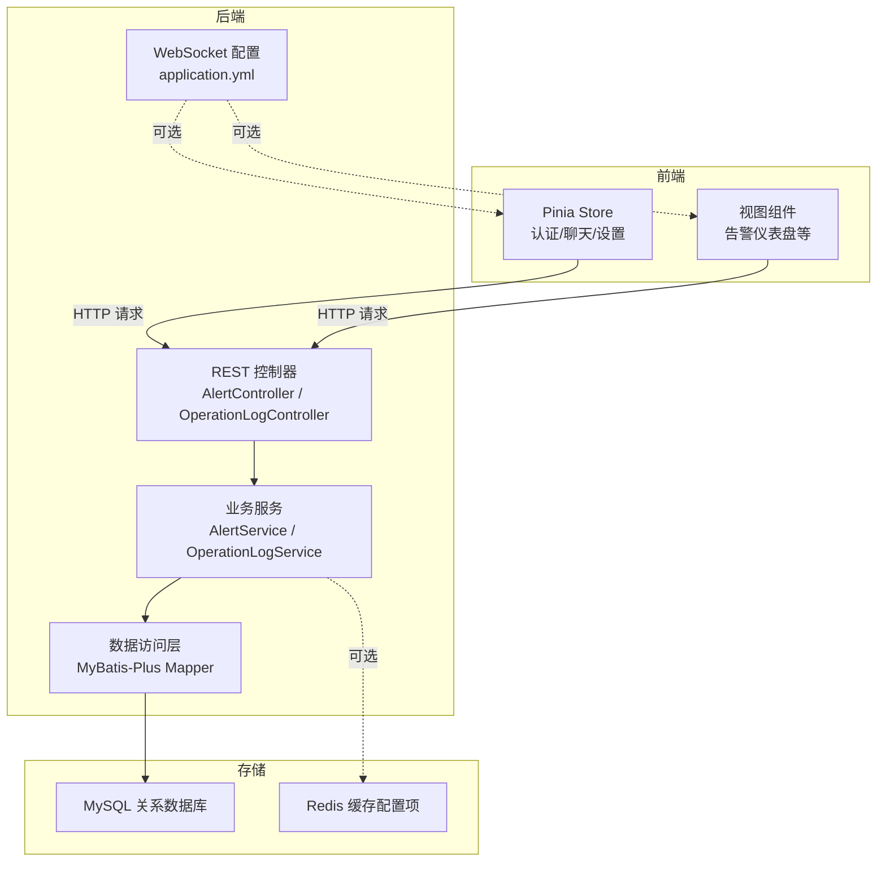
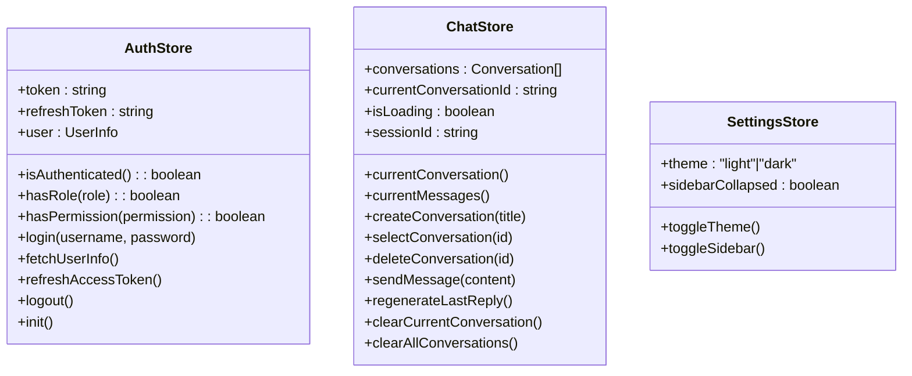
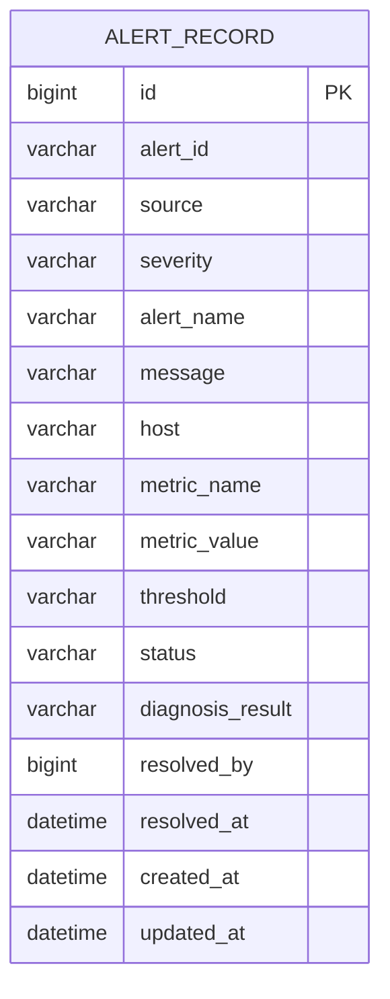
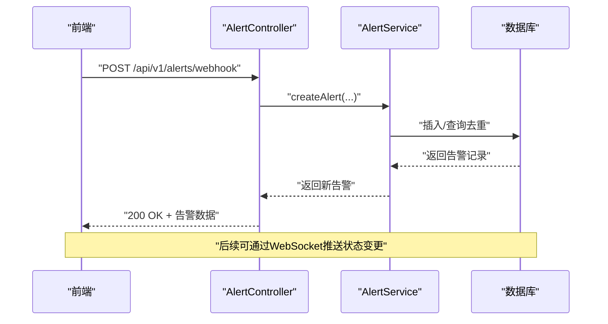
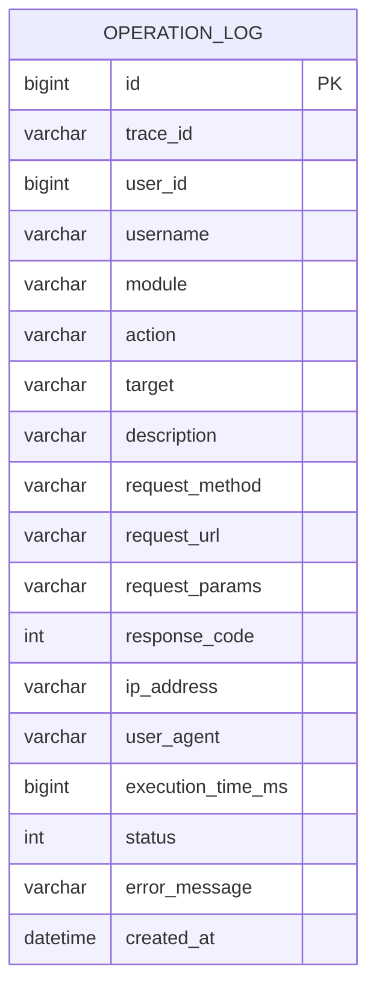
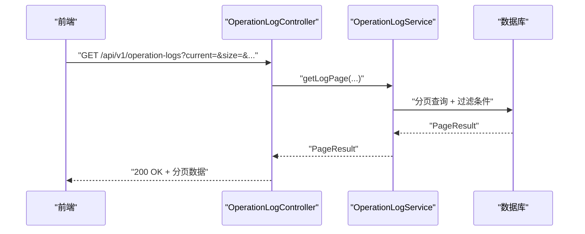
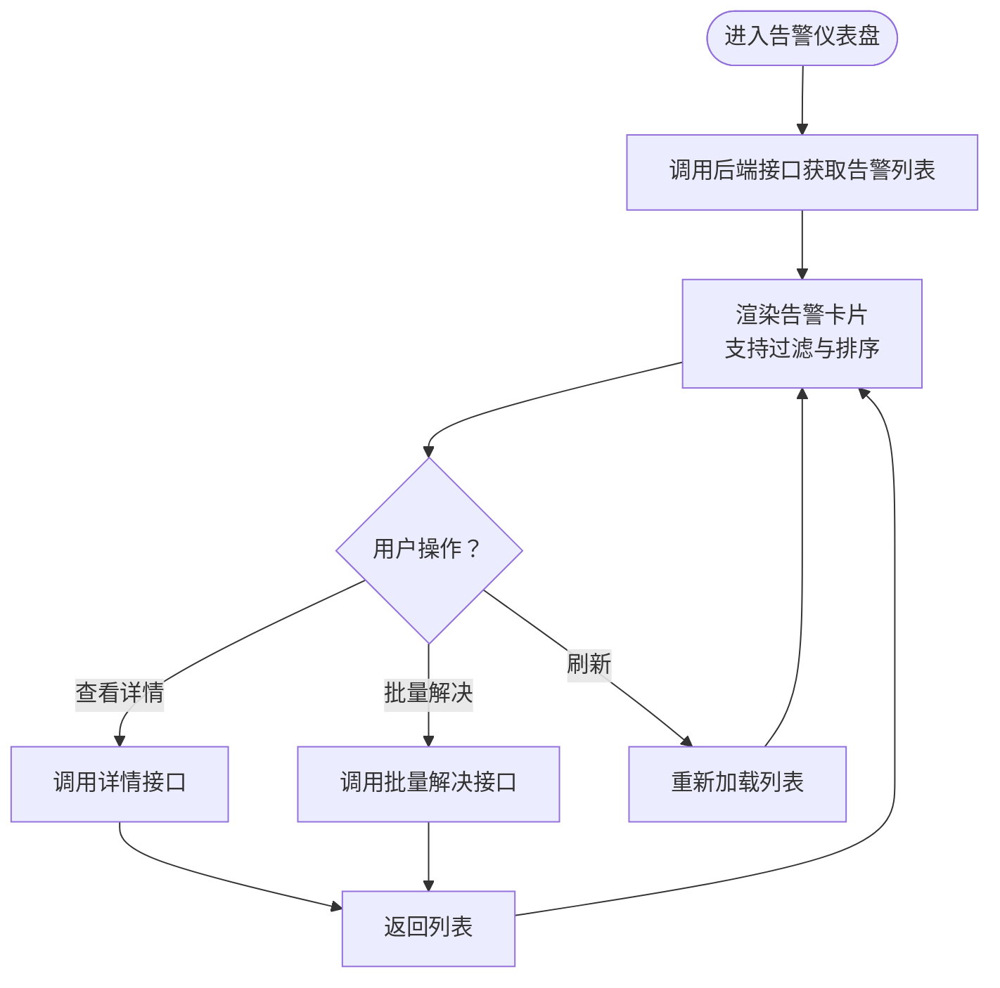
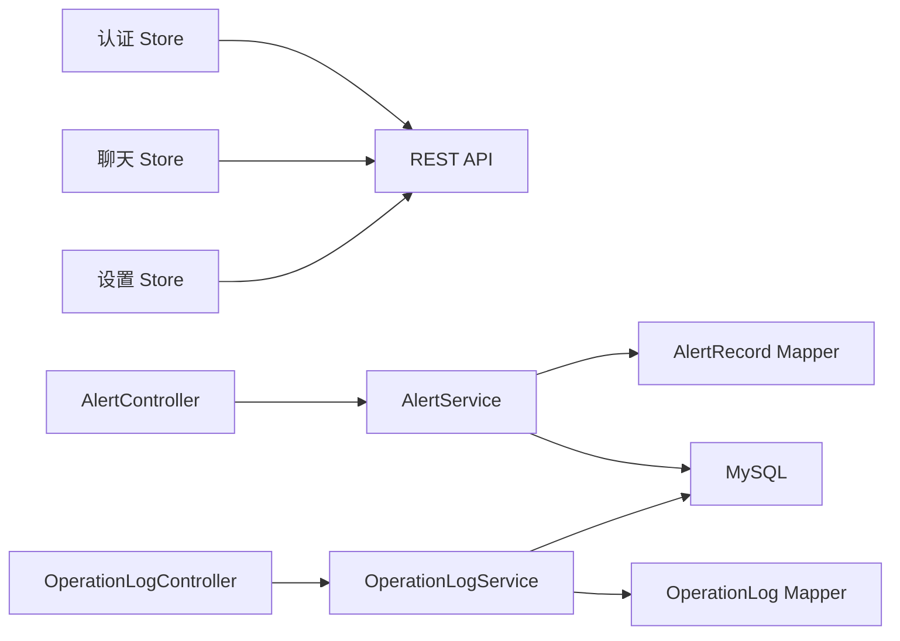

# 状态同步机制

<cite>
**本文引用的文件**
- [netdata-ai-frontend/src/stores/index.ts](file://netdata-ai-frontend/src/stores/index.ts)
- [netdata-ai-frontend/src/stores/auth.ts](file://netdata-ai-frontend/src/stores/auth.ts)
- [netdata-ai-frontend/src/stores/chat.ts](file://netdata-ai-frontend/src/stores/chat.ts)
- [netdata-ai-frontend/src/stores/settings.ts](file://netdata-ai-frontend/src/stores/settings.ts)
- [netdata-ai-frontend/src/types/index.ts](file://netdata-ai-frontend/src/types/index.ts)
- [netdata-ai-frontend/src/views/AlertDashboardView.vue](file://netdata-ai-frontend/src/views/AlertDashboardView.vue)
- [netdata-ai-backend/src/main/resources/application.yml](file://netdata-ai-backend/src/main/resources/application.yml)
- [netdata-ai-backend/src/main/java/com/netdata/ops/controller/AlertController.java](file://netdata-ai-backend/src/main/java/com/netdata/ops/controller/AlertController.java)
- [netdata-ai-backend/src/main/java/com/netdata/ops/service/AlertService.java](file://netdata-ai-backend/src/main/java/com/netdata/ops/service/AlertService.java)
- [netdata-ai-backend/src/main/java/com/netdata/ops/entity/AlertRecord.java](file://netdata-ai-backend/src/main/java/com/netdata/ops/entity/AlertRecord.java)
- [netdata-ai-backend/src/main/java/com/netdata/ops/controller/OperationLogController.java](file://netdata-ai-backend/src/main/java/com/netdata/ops/controller/OperationLogController.java)
- [netdata-ai-backend/src/main/java/com/netdata/ops/service/OperationLogService.java](file://netdata-ai-backend/src/main/java/com/netdata/ops/service/OperationLogService.java)
- [netdata-ai-backend/src/main/java/com/netdata/ops/entity/OperationLog.java](file://netdata-ai-backend/src/main/java/com/netdata/ops/entity/OperationLog.java)
</cite>

## 目录
1. [引言](#引言)
2. [项目结构](#项目结构)
3. [核心组件](#核心组件)
4. [架构总览](#架构总览)
5. [详细组件分析](#详细组件分析)
6. [依赖分析](#依赖分析)
7. [性能考虑](#性能考虑)
8. [故障排查指南](#故障排查指南)
9. [结论](#结论)
10. [附录](#附录)

## 引言
本文件围绕“状态同步机制”展开，目标是系统性阐述前后端如何在多类业务场景中保持状态一致性，包括状态变更检测、版本控制、冲突解决、数据模型设计、实时更新策略（增量/全量/回滚）、性能优化（缓存/批量/延迟合并）、错误处理与恢复（网络中断、数据不一致修复、手动同步），以及在告警状态、操作日志、用户会话状态等场景中的具体应用。

## 项目结构
本项目采用前后端分离架构：
- 前端基于 Vue + Pinia，通过 Store 管理应用状态，包括认证、聊天、设置等模块。
- 后端基于 Spring Boot，提供 REST API，包含告警管理、操作日志等业务接口，并在配置中启用 WebSocket 路径以支持实时推送。

图表来源
- [netdata-ai-backend/src/main/resources/application.yml:250-255](file://netdata-ai-backend/src/main/resources/application.yml#L250-L255)
- [netdata-ai-frontend/src/stores/index.ts:1-4](file://netdata-ai-frontend/src/stores/index.ts#L1-L4)

章节来源
- [netdata-ai-frontend/src/stores/index.ts:1-4](file://netdata-ai-frontend/src/stores/index.ts#L1-L4)
- [netdata-ai-backend/src/main/resources/application.yml:250-255](file://netdata-ai-backend/src/main/resources/application.yml#L250-L255)

## 核心组件
- 前端状态管理（Pinia Store）
  - 认证状态：登录、刷新令牌、登出、初始化用户信息。
  - 聊天状态：对话列表、当前对话、消息发送、重新生成、清空对话。
  - 设置状态：主题切换、侧边栏折叠。
- 后端业务服务
  - 告警服务：分页查询、创建、批量解决、统计、趋势、触发诊断。
  - 操作日志服务：分页查询、统计。
- 实时通信
  - WebSocket 路径在配置中声明，可用于向客户端推送状态变更（如告警状态变化）。

章节来源
- [netdata-ai-frontend/src/stores/auth.ts:22-118](file://netdata-ai-frontend/src/stores/auth.ts#L22-L118)
- [netdata-ai-frontend/src/stores/chat.ts:12-209](file://netdata-ai-frontend/src/stores/chat.ts#L12-L209)
- [netdata-ai-frontend/src/stores/settings.ts:7-31](file://netdata-ai-frontend/src/stores/settings.ts#L7-L31)
- [netdata-ai-backend/src/main/java/com/netdata/ops/controller/AlertController.java:23-107](file://netdata-ai-backend/src/main/java/com/netdata/ops/controller/AlertController.java#L23-L107)
- [netdata-ai-backend/src/main/java/com/netdata/ops/service/AlertService.java:27-236](file://netdata-ai-backend/src/main/java/com/netdata/ops/service/AlertService.java#L27-L236)
- [netdata-ai-backend/src/main/java/com/netdata/ops/controller/OperationLogController.java:24-48](file://netdata-ai-backend/src/main/java/com/netdata/ops/controller/OperationLogController.java#L24-L48)
- [netdata-ai-backend/src/main/java/com/netdata/ops/service/OperationLogService.java:22-79](file://netdata-ai-backend/src/main/java/com/netdata/ops/service/OperationLogService.java#L22-L79)
- [netdata-ai-backend/src/main/resources/application.yml:250-255](file://netdata-ai-backend/src/main/resources/application.yml#L250-L255)

## 架构总览
下图展示从前端到后端再到数据库的整体流程，以及可选的 WebSocket 实时推送路径。

图表来源
- [netdata-ai-frontend/src/stores/auth.ts:22-118](file://netdata-ai-frontend/src/stores/auth.ts#L22-L118)
- [netdata-ai-frontend/src/stores/chat.ts:12-209](file://netdata-ai-frontend/src/stores/chat.ts#L12-L209)
- [netdata-ai-backend/src/main/java/com/netdata/ops/controller/AlertController.java:23-107](file://netdata-ai-backend/src/main/java/com/netdata/ops/controller/AlertController.java#L23-L107)
- [netdata-ai-backend/src/main/java/com/netdata/ops/service/AlertService.java:27-236](file://netdata-ai-backend/src/main/java/com/netdata/ops/service/AlertService.java#L27-L236)
- [netdata-ai-backend/src/main/java/com/netdata/ops/controller/OperationLogController.java:24-48](file://netdata-ai-backend/src/main/java/com/netdata/ops/controller/OperationLogController.java#L24-L48)
- [netdata-ai-backend/src/main/java/com/netdata/ops/service/OperationLogService.java:22-79](file://netdata-ai-backend/src/main/java/com/netdata/ops/service/OperationLogService.java#L22-L79)
- [netdata-ai-backend/src/main/resources/application.yml:250-255](file://netdata-ai-backend/src/main/resources/application.yml#L250-L255)

## 详细组件分析

### 前端状态管理（Pinia Store）
- 认证状态（useAuthStore）
  - 状态：访问令牌、刷新令牌、用户信息。
  - 行为：登录、刷新访问令牌、获取用户信息、登出、初始化。
  - 一致性保障：登录成功后持久化令牌；刷新令牌失败时触发登出，避免本地状态与服务端状态不一致。
- 聊天状态（useChatStore）
  - 状态：对话列表、当前对话 ID、加载状态、会话 ID。
  - 行为：创建/选择/删除对话；发送消息（含占位助手消息与加载态）；重新生成；清空对话。
  - 一致性保障：消息发送前确保存在当前对话；更新对话标题与更新时间；异常时设置错误标记；最终以后端响应为准。
- 设置状态（useSettingsStore）
  - 状态：主题、侧边栏折叠。
  - 行为：切换主题与侧边栏状态。
  - 一致性保障：直接在本地生效，适合非持久化 UI 状态。

图表来源
- [netdata-ai-frontend/src/stores/auth.ts:22-118](file://netdata-ai-frontend/src/stores/auth.ts#L22-L118)
- [netdata-ai-frontend/src/stores/chat.ts:12-209](file://netdata-ai-frontend/src/stores/chat.ts#L12-L209)
- [netdata-ai-frontend/src/stores/settings.ts:7-31](file://netdata-ai-frontend/src/stores/settings.ts#L7-L31)

章节来源
- [netdata-ai-frontend/src/stores/auth.ts:22-118](file://netdata-ai-frontend/src/stores/auth.ts#L22-L118)
- [netdata-ai-frontend/src/stores/chat.ts:12-209](file://netdata-ai-frontend/src/stores/chat.ts#L12-L209)
- [netdata-ai-frontend/src/stores/settings.ts:7-31](file://netdata-ai-frontend/src/stores/settings.ts#L7-L31)

### 后端业务服务与数据模型

#### 告警状态同步
- 数据模型（AlertRecord）
  - 关键字段：告警标识、来源、严重级别、告警名称、消息、主机、指标名、指标值、阈值、状态、诊断结果、解决人、解决时间、创建/更新时间。
  - 状态字段：firing（触发中）、resolved（已解决）。
- 业务行为
  - 接收外部告警：去重逻辑（同一 alertId 且状态为 firing 的不再重复创建）。
  - 解决告警：状态转换、写入诊断结果、记录解决人与时间。
  - 批量解决：逐条校验状态并更新。
  - 统计与趋势：按严重级别分布、按日聚合趋势。
- 实时推送
  - 配置中声明 WebSocket 路径，可用于将告警状态变化推送给前端。

图表来源
- [netdata-ai-backend/src/main/java/com/netdata/ops/entity/AlertRecord.java:13-55](file://netdata-ai-backend/src/main/java/com/netdata/ops/entity/AlertRecord.java#L13-L55)

图表来源
- [netdata-ai-backend/src/main/java/com/netdata/ops/controller/AlertController.java:69-85](file://netdata-ai-backend/src/main/java/com/netdata/ops/controller/AlertController.java#L69-L85)
- [netdata-ai-backend/src/main/java/com/netdata/ops/service/AlertService.java:97-128](file://netdata-ai-backend/src/main/java/com/netdata/ops/service/AlertService.java#L97-L128)

章节来源
- [netdata-ai-backend/src/main/java/com/netdata/ops/entity/AlertRecord.java:13-55](file://netdata-ai-backend/src/main/java/com/netdata/ops/entity/AlertRecord.java#L13-L55)
- [netdata-ai-backend/src/main/java/com/netdata/ops/controller/AlertController.java:69-85](file://netdata-ai-backend/src/main/java/com/netdata/ops/controller/AlertController.java#L69-L85)
- [netdata-ai-backend/src/main/java/com/netdata/ops/service/AlertService.java:97-128](file://netdata-ai-backend/src/main/java/com/netdata/ops/service/AlertService.java#L97-L128)

#### 操作日志状态同步
- 数据模型（OperationLog）
  - 关键字段：追踪 ID、用户、模块、动作、目标、描述、请求方法/URL/参数、响应码、IP、UA、耗时、结果、错误信息、创建时间。
- 业务行为
  - 分页查询：支持模块、动作、用户名、时间范围过滤。
  - 统计：今日操作数、今日失败数、总计。
- 实时推送
  - 可通过 WebSocket 将重要审计事件推送给前端（若后续扩展）。

图表来源
- [netdata-ai-backend/src/main/java/com/netdata/ops/entity/OperationLog.java:13-55](file://netdata-ai-backend/src/main/java/com/netdata/ops/entity/OperationLog.java#L13-L55)

图表来源
- [netdata-ai-backend/src/main/java/com/netdata/ops/controller/OperationLogController.java:28-40](file://netdata-ai-backend/src/main/java/com/netdata/ops/controller/OperationLogController.java#L28-L40)
- [netdata-ai-backend/src/main/java/com/netdata/ops/service/OperationLogService.java:29-55](file://netdata-ai-backend/src/main/java/com/netdata/ops/service/OperationLogService.java#L29-L55)

章节来源
- [netdata-ai-backend/src/main/java/com/netdata/ops/entity/OperationLog.java:13-55](file://netdata-ai-backend/src/main/java/com/netdata/ops/entity/OperationLog.java#L13-L55)
- [netdata-ai-backend/src/main/java/com/netdata/ops/controller/OperationLogController.java:28-40](file://netdata-ai-backend/src/main/java/com/netdata/ops/controller/OperationLogController.java#L28-L40)
- [netdata-ai-backend/src/main/java/com/netdata/ops/service/OperationLogService.java:29-55](file://netdata-ai-backend/src/main/java/com/netdata/ops/service/OperationLogService.java#L29-L55)

### 前端视图与状态联动（告警仪表盘）
- 视图层维护本地告警列表，支持按状态/严重级别过滤、格式化时间显示。
- 与后端交互：通过 REST API 获取分页告警列表、详情、统计与趋势。
- 实时联动：可结合 WebSocket 推送实现状态变更的即时更新（若已接入）。

图表来源
- [netdata-ai-frontend/src/views/AlertDashboardView.vue:143-162](file://netdata-ai-frontend/src/views/AlertDashboardView.vue#L143-L162)
- [netdata-ai-backend/src/main/java/com/netdata/ops/controller/AlertController.java:27-38](file://netdata-ai-backend/src/main/java/com/netdata/ops/controller/AlertController.java#L27-L38)

章节来源
- [netdata-ai-frontend/src/views/AlertDashboardView.vue:143-162](file://netdata-ai-frontend/src/views/AlertDashboardView.vue#L143-L162)
- [netdata-ai-backend/src/main/java/com/netdata/ops/controller/AlertController.java:27-38](file://netdata-ai-backend/src/main/java/com/netdata/ops/controller/AlertController.java#L27-L38)

## 依赖分析
- 前端 Store 之间低耦合，通过 API 间接依赖后端服务。
- 后端控制器依赖对应服务，服务依赖 Mapper 访问数据库。
- WebSocket 路径在配置中声明，便于后续扩展实时推送能力。

图表来源
- [netdata-ai-frontend/src/stores/auth.ts:22-118](file://netdata-ai-frontend/src/stores/auth.ts#L22-L118)
- [netdata-ai-frontend/src/stores/chat.ts:12-209](file://netdata-ai-frontend/src/stores/chat.ts#L12-L209)
- [netdata-ai-frontend/src/stores/settings.ts:7-31](file://netdata-ai-frontend/src/stores/settings.ts#L7-L31)
- [netdata-ai-backend/src/main/java/com/netdata/ops/controller/AlertController.java:23-107](file://netdata-ai-backend/src/main/java/com/netdata/ops/controller/AlertController.java#L23-L107)
- [netdata-ai-backend/src/main/java/com/netdata/ops/service/AlertService.java:27-236](file://netdata-ai-backend/src/main/java/com/netdata/ops/service/AlertService.java#L27-L236)
- [netdata-ai-backend/src/main/java/com/netdata/ops/controller/OperationLogController.java:24-48](file://netdata-ai-backend/src/main/java/com/netdata/ops/controller/OperationLogController.java#L24-L48)
- [netdata-ai-backend/src/main/java/com/netdata/ops/service/OperationLogService.java:22-79](file://netdata-ai-backend/src/main/java/com/netdata/ops/service/OperationLogService.java#L22-L79)

章节来源
- [netdata-ai-frontend/src/stores/index.ts:1-4](file://netdata-ai-frontend/src/stores/index.ts#L1-L4)
- [netdata-ai-backend/src/main/resources/application.yml:250-255](file://netdata-ai-backend/src/main/resources/application.yml#L250-L255)

## 性能考虑
- 状态缓存
  - 前端：Pinia Store 本地缓存对话、用户信息、设置等，减少重复请求。
  - 后端：Redis 缓存热点数据（如配置、近期统计），降低数据库压力。
- 批量更新
  - 后端：批量解决告警、批量统计，减少事务开销。
- 延迟合并
  - 前端：消息发送采用占位加载态，合并多次 UI 更新，避免频繁重绘。
- 分页与过滤
  - 后端：分页查询 + 多字段过滤，避免一次性传输大量数据。
- WebSocket 实时推送
  - 配置中声明 WebSocket 路径，可在状态发生变更时推送增量更新，降低轮询成本。

章节来源
- [netdata-ai-frontend/src/stores/chat.ts:120-138](file://netdata-ai-frontend/src/stores/chat.ts#L120-L138)
- [netdata-ai-backend/src/main/java/com/netdata/ops/service/AlertService.java:133-150](file://netdata-ai-backend/src/main/java/com/netdata/ops/service/AlertService.java#L133-L150)
- [netdata-ai-backend/src/main/resources/application.yml:47-59](file://netdata-ai-backend/src/main/resources/application.yml#L47-L59)

## 故障排查指南
- 网络中断处理
  - 前端：在消息发送与用户信息获取中捕获异常，设置错误标记或提示，避免 UI 卡死。
  - 后端：通过 Resilience4j 指标暴露与健康检查，定位慢调用与熔断情况。
- 数据不一致修复
  - 告警去重：接收外部告警时按 alertId 与状态进行去重，避免重复创建。
  - 状态校验：解决告警前校验状态，防止重复解决。
- 手动同步功能
  - 前端：提供“重新加载/刷新”入口，触发重新拉取最新状态。
  - 后端：提供统计与趋势接口，辅助核对与修复。

章节来源
- [netdata-ai-frontend/src/stores/chat.ts:132-138](file://netdata-ai-frontend/src/stores/chat.ts#L132-L138)
- [netdata-ai-backend/src/main/java/com/netdata/ops/service/AlertService.java:101-109](file://netdata-ai-backend/src/main/java/com/netdata/ops/service/AlertService.java#L101-L109)
- [netdata-ai-backend/src/main/java/com/netdata/ops/service/AlertService.java:79-81](file://netdata-ai-backend/src/main/java/com/netdata/ops/service/AlertService.java#L79-L81)
- [netdata-ai-backend/src/main/resources/application.yml:204-237](file://netdata-ai-backend/src/main/resources/application.yml#L204-L237)

## 结论
本项目通过 Pinia Store 管理前端状态、REST API 提供后端能力、MyBatis-Plus 访问数据库，并在配置中预留 WebSocket 实时通道。在告警与操作日志等场景中，已具备去重、状态校验、批量处理与统计分析等基础能力，可进一步结合 WebSocket 实现实时推送与更完善的冲突解决策略，从而在多业务场景中实现高可靠的状态同步。

## 附录
- 业务场景映射
  - 告警状态：firing/resolved 状态机，去重与批量解决。
  - 操作日志：审计轨迹与统计，支持分页与过滤。
  - 用户会话状态：认证令牌与用户信息的本地持久化与刷新。
- 类型定义参考
  - 前端类型：认证、聊天、告警、审批、知识库等类型定义，统一前后端契约。

章节来源
- [netdata-ai-frontend/src/types/index.ts:10-169](file://netdata-ai-frontend/src/types/index.ts#L10-L169)
- [netdata-ai-frontend/src/views/AlertDashboardView.vue:143-162](file://netdata-ai-frontend/src/views/AlertDashboardView.vue#L143-L162)