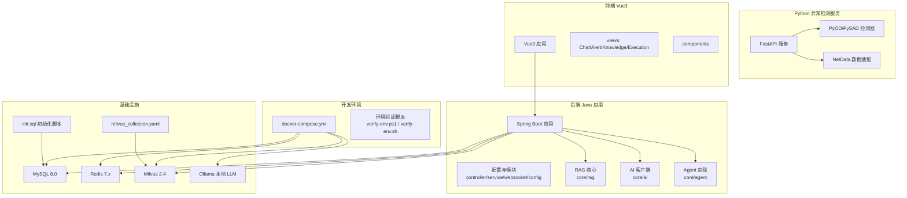
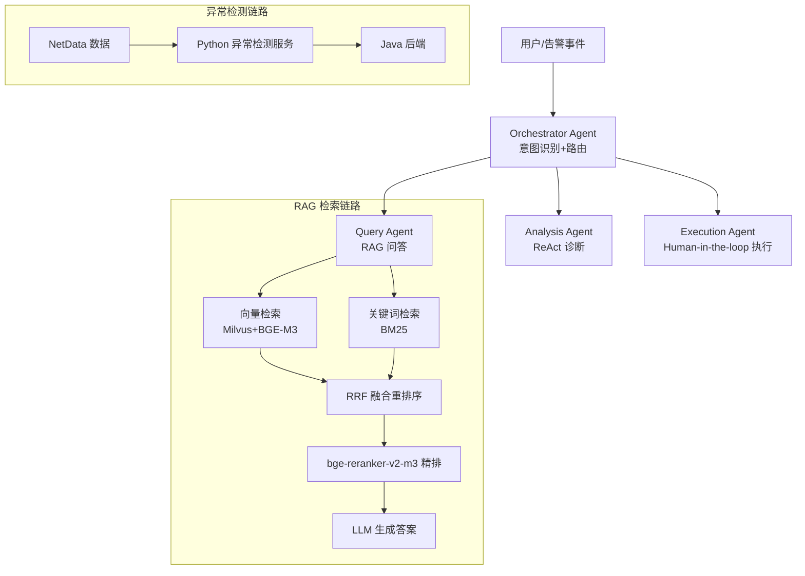
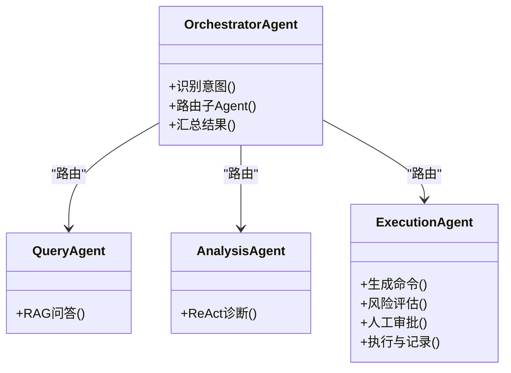
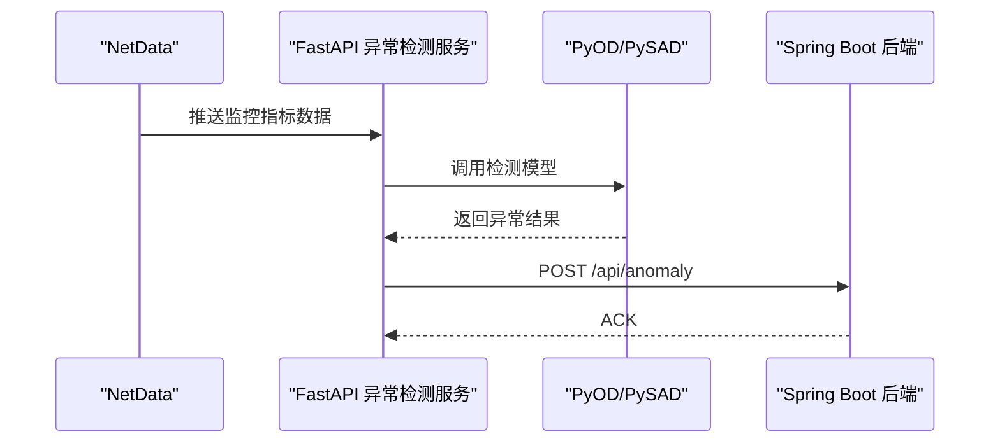
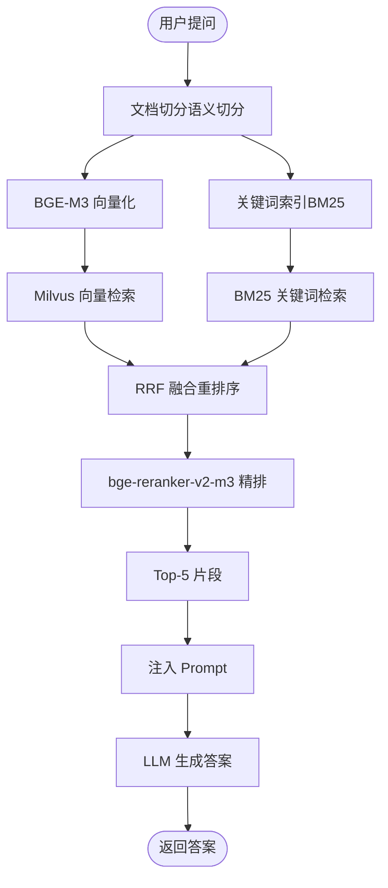
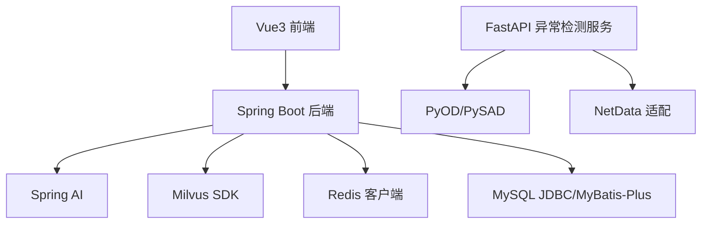
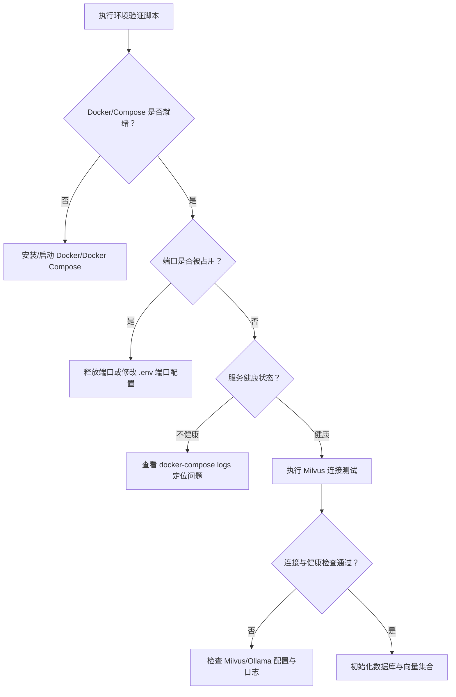

# 开发指南

<cite>
**本文档引用的文件**
- [PROJECT_CONTEXT.md](file://PROJECT_CONTEXT.md)
- [开题报告_精简版.md](file://开题报告_精简版.md)
- [docker-compose.yml](file://docker-compose.yml)
- [config/milvus_collection.yaml](file://config/milvus_collection.yaml)
- [scripts/init_milvus.py](file://scripts/init_milvus.py)
- [sql/init.sql](file://sql/init.sql)
- [scripts/verify-env.ps1](file://scripts/verify-env.ps1)
- [scripts/verify-env.sh](file://scripts/verify-env.sh)
- [tests/test_milvus_connection.py](file://tests/test_milvus_connection.py)
- [docs/prompts/orchestrator-system-prompt.md](file://docs/prompts/orchestrator-system-prompt.md)
- [docs/prompts/shared-safety-constraints.md](file://docs/prompts/shared-safety-constraints.md)
</cite>

## 目录
1. [简介](#简介)
2. [项目结构](#项目结构)
3. [核心组件](#核心组件)
4. [架构总览](#架构总览)
5. [详细组件分析](#详细组件分析)
6. [依赖分析](#依赖分析)
7. [性能考虑](#性能考虑)
8. [故障排除指南](#故障排除指南)
9. [结论](#结论)
10. [附录](#附录)

## 简介
本指南面向智能运维系统（面向 NetData 监控数据的智能运维问答与执行系统）的开发者，提供从环境搭建、代码规范、模块划分、开发流程到技术栈最佳实践的全流程指导。系统采用 Python+Java 混合架构，后端基于 Spring Boot 3.x，前端基于 Vue 3，向量数据库采用 Milvus 2.4，异常检测服务使用 Python FastAPI + PyOD/PySAD，AI 框架使用 Spring AI 1.0.x。

## 项目结构
项目采用多模块分层组织，包含后端 Java 应用、Python 异常检测服务、Vue3 前端、Docker 编排与基础设施脚本、数据库初始化脚本以及 Prompt 管理文档。

**图表来源**
- [docker-compose.yml:23-357](file://docker-compose.yml#L23-L357)
- [PROJECT_CONTEXT.md:120-149](file://PROJECT_CONTEXT.md#L120-L149)

**章节来源**
- [PROJECT_CONTEXT.md:120-149](file://PROJECT_CONTEXT.md#L120-L149)
- [开题报告_精简版.md:118-152](file://开题报告_精简版.md#L118-L152)

## 核心组件
- 后端 Java 应用：提供 REST API、WebSocket 实时通信、业务逻辑与 Agent 协同编排，集成 Spring AI 与 Milvus。
- Python 异常检测服务：基于 FastAPI，封装 PyOD/PySAD，提供异常检测接口并与 Java 后端通信。
- Vue3 前端：提供聊天界面、告警看板、知识库浏览与执行审批界面。
- 基础设施：Docker Compose 编排 MySQL、Redis、Milvus、Ollama；init.sql 初始化数据库；milvus_collection.yaml 定义向量集合结构。
- Prompt 管理：orchestrator-system-prompt.md 与 shared-safety-constraints.md 管理编排 Agent 的系统提示与安全约束。

**章节来源**
- [PROJECT_CONTEXT.md:25-40](file://PROJECT_CONTEXT.md#L25-L40)
- [PROJECT_CONTEXT.md:120-149](file://PROJECT_CONTEXT.md#L120-L149)
- [开题报告_精简版.md:95-117](file://开题报告_精简版.md#L95-L117)

## 架构总览
系统采用“Orchestrator-Subagent”模式，用户输入或告警事件经编排代理识别意图后路由到 Query/Analysis/Execution 子 Agent，并汇总结果。RAG 检索采用混合检索（向量 + BM25）+ RRF 融合 + reranker 精排，向量数据库为 Milvus 2.4，Embedding 使用 BGE-M3（1024 维）。

**图表来源**
- [PROJECT_CONTEXT.md:43-61](file://PROJECT_CONTEXT.md#L43-L61)
- [PROJECT_CONTEXT.md:64-82](file://PROJECT_CONTEXT.md#L64-L82)
- [开题报告_精简版.md:191-221](file://开题报告_精简版.md#L191-L221)

## 详细组件分析

### 后端 Java 应用（Spring Boot）
- 模块划分：controller、service、websocket、config、core/agent、core/ai、core/rag。
- 关键职责：REST API、WebSocket 实时通信、Agent 编排、RAG 检索、AI 客户端集成。
- 配置管理：通过 Profile 切换 LLM 提供商（DeepSeek API/Ollama），Prompt 通过 @Value 或专门类管理，避免硬编码。

**图表来源**
- [PROJECT_CONTEXT.md:43-61](file://PROJECT_CONTEXT.md#L43-L61)

**章节来源**
- [PROJECT_CONTEXT.md:25-40](file://PROJECT_CONTEXT.md#L25-L40)
- [开题报告_精简版.md:223-266](file://开题报告_精简版.md#L223-L266)

### Python 异常检测服务（FastAPI + PyOD/PySAD）
- 功能：接收 NetData 指标数据，使用 Isolation Forest、PySAD 等算法进行异常检测，将结果通过 REST API 发送至 Java 后端。
- 通信：Java 端需设置合理超时与重试，避免大数据时 REST 超时。
- 部署：独立容器，通过 docker-compose 编排。

**图表来源**
- [开题报告_精简版.md:163-189](file://开题报告_精简版.md#L163-L189)
- [开题报告_精简版.md:170-189](file://开题报告_精简版.md#L170-L189)

**章节来源**
- [开题报告_精简版.md:99-111](file://开题报告_精简版.md#L99-L111)
- [开题报告_精简版.md:163-189](file://开题报告_精简版.md#L163-L189)

### Vue3 前端
- 视图：Chat、AlertDashboard、KnowledgeBase、ExecutionApproval。
- 交互：与后端 REST API 通信，WebSocket 接收实时告警与审批状态。
- 技术：Vue3 + Element Plus，适配国内生态（微信/企业微信）。

**章节来源**
- [PROJECT_CONTEXT.md:35-35](file://PROJECT_CONTEXT.md#L35-L35)
- [PROJECT_CONTEXT.md:141-145](file://PROJECT_CONTEXT.md#L141-L145)

### 向量数据库与 RAG
- Milvus 2.4：Collection ops_knowledge_base，BGE-M3 1024 维向量，COSINE 相似度，IVF_FLAT 索引。
- RAG 流程：向量检索 + BM25 + RRF 融合 + reranker 精排 + Top-K 注入 Prompt + LLM 生成。
- 初始化：init_milvus.py 脚本创建 Collection、索引、加载、插入测试数据与搜索验证。

**图表来源**
- [PROJECT_CONTEXT.md:64-82](file://PROJECT_CONTEXT.md#L64-L82)
- [config/milvus_collection.yaml:19-101](file://config/milvus_collection.yaml#L19-L101)
- [scripts/init_milvus.py:133-242](file://scripts/init_milvus.py#L133-L242)

**章节来源**
- [config/milvus_collection.yaml:19-186](file://config/milvus_collection.yaml#L19-L186)
- [scripts/init_milvus.py:1-516](file://scripts/init_milvus.py#L1-L516)

### 数据库与配置
- MySQL 8.0：init.sql 初始化用户、对话、执行审计、命令模板、告警记录、异常检测结果、系统配置等表。
- Redis 7.x：会话缓存、RAG 结果缓存、分布式锁、实时告警去重。
- 配置切换：application.yml 通过 Profile 切换 LLM 提供商（DeepSeek API/Ollama）。

**章节来源**
- [sql/init.sql:1-274](file://sql/init.sql#L1-L274)
- [docker-compose.yml:163-208](file://docker-compose.yml#L163-L208)
- [docker-compose.yml:218-246](file://docker-compose.yml#L218-L246)

### Prompt 与安全约束
- Orchestrator System Prompt：定义意图识别、路由决策、实体抽取、紧急程度评估与输出格式。
- Shared Safety Constraints：命令黑名单、审批规则、数据脱敏、权限矩阵、审计日志规范、应急响应流程。

**章节来源**
- [docs/prompts/orchestrator-system-prompt.md:1-291](file://docs/prompts/orchestrator-system-prompt.md#L1-L291)
- [docs/prompts/shared-safety-constraints.md:1-396](file://docs/prompts/shared-safety-constraints.md#L1-L396)

## 依赖分析
- 后端依赖：Spring Boot 3.3.x、Spring AI 1.0.x、MyBatis-Plus、Milvus SDK、Redis 客户端、WebSocket。
- Python 依赖：FastAPI、PyOD、PySAD、pymilvus、NumPy。
- 前端依赖：Vue3、Element Plus、WebSocket 客户端。
- 基础设施：Docker Compose、MySQL、Redis、Milvus、Ollama。

**图表来源**
- [PROJECT_CONTEXT.md:25-40](file://PROJECT_CONTEXT.md#L25-L40)
- [开题报告_精简版.md:95-117](file://开题报告_精简版.md#L95-L117)

**章节来源**
- [PROJECT_CONTEXT.md:25-40](file://PROJECT_CONTEXT.md#L25-L40)
- [开题报告_精简版.md:95-117](file://开题报告_精简版.md#L95-L117)

## 性能考虑
- 向量检索性能：根据数据规模选择合适索引（IVF_FLAT/HNSW），nlist 与 nprobe 参数平衡精度与速度；Milvus 2.4 内存占用较大，开发环境建议分配至少 8GB。
- Python-Java 通信：PyOD 处理大数据时 REST 可能超时，Java 端需设置合理超时与重试；消息队列可作为异步通信备选方案。
- LLM 切换：通过 Profile 切换提供商，避免硬编码；生产环境使用 DeepSeek API，开发调试使用 Ollama。
- Prompt 管理：集中管理 Prompt，避免硬编码；Prompt 变更需灰度发布与 A/B 测试。

**章节来源**
- [PROJECT_CONTEXT.md:110-117](file://PROJECT_CONTEXT.md#L110-L117)
- [config/milvus_collection.yaml:54-69](file://config/milvus_collection.yaml#L54-L69)
- [config/milvus_collection.yaml:175-184](file://config/milvus_collection.yaml#L175-L184)

## 故障排除指南
- 环境验证：使用 verify-env.ps1（Windows）或 verify-env.sh（Linux/macOS）检查 Docker、端口占用、配置文件、数据目录与服务健康状态。
- Milvus 连接测试：使用 test_milvus_connection.py 验证 gRPC 连接与健康检查端点。
- Docker Compose：按需调整资源限制与端口映射，确保 Milvus 与 Ollama 足够内存。
- 数据库初始化：首次启动自动执行 init.sql；如需手动执行，使用提供的 SQL 脚本。

**图表来源**
- [scripts/verify-env.ps1:34-197](file://scripts/verify-env.ps1#L34-L197)
- [scripts/verify-env.sh:63-260](file://scripts/verify-env.sh#L63-L260)
- [tests/test_milvus_connection.py:33-116](file://tests/test_milvus_connection.py#L33-L116)

**章节来源**
- [scripts/verify-env.ps1:1-251](file://scripts/verify-env.ps1#L1-L251)
- [scripts/verify-env.sh:1-318](file://scripts/verify-env.sh#L1-L318)
- [tests/test_milvus_connection.py:1-148](file://tests/test_milvus_connection.py#L1-L148)

## 结论
本开发指南提供了从环境搭建到模块实现、从性能优化到故障排除的完整路径。建议新开发者先完成环境验证与基础设施启动，再逐步实现各模块功能，并严格遵循 Prompt 管理与安全约束，确保系统稳定与安全。

## 附录

### 开发环境搭建步骤
- 安装 Docker 与 Docker Compose，确保内存分配充足（建议 ≥8GB）。
- 复制并编辑 .env 配置文件，设置数据库、Redis、Milvus、Ollama 的密码与端口。
- 启动服务：docker-compose up -d，使用 verify-env.ps1/verify-env.sh 检查健康状态。
- 初始化数据库：首次启动自动执行 init.sql；后续可手动执行。
- 初始化 Milvus：运行 init_milvus.py 创建 Collection、索引、加载与测试数据。
- 启动后端、前端与异常检测服务，进行联调。

**章节来源**
- [docker-compose.yml:11-21](file://docker-compose.yml#L11-L21)
- [scripts/verify-env.ps1:135-139](file://scripts/verify-env.ps1#L135-L139)
- [scripts/verify-env.sh:179-185](file://scripts/verify-env.sh#L179-L185)
- [sql/init.sql:10-12](file://sql/init.sql#L10-L12)
- [scripts/init_milvus.py:457-512](file://scripts/init_milvus.py#L457-L512)

### 代码规范与最佳实践
- 编码风格：统一使用 UTF-8，类与方法命名清晰，注释解释“为什么这么做”。
- 错误处理：集中捕获异常，记录详细日志并返回用户友好的错误信息；避免在日志中泄露敏感信息。
- 性能优化：合理设置 Milvus 索引参数与 nprobe；Python 与 Java 通信设置超时与重试；缓存热点数据（RAG 结果、会话）。
- Prompt 管理：使用 @Value 或专门类管理 Prompt，避免硬编码；版本化管理 Prompt。
- LLM 切换：通过 Profile 切换提供商，避免修改代码；生产与开发环境分离。

**章节来源**
- [PROJECT_CONTEXT.md:110-117](file://PROJECT_CONTEXT.md#L110-L117)
- [docs/prompts/shared-safety-constraints.md:262-292](file://docs/prompts/shared-safety-constraints.md#L262-L292)

### 目录结构与模块划分
- 后端 Java：src/main/java/com/netdata/ops 下按 core/agent、core/ai、core/rag、controller、service、websocket、config 组织。
- Python 异常检测服务：app/api、app/core、app/netdata。
- 前端 Vue3：src/views、src/components。
- 基础设施：docker-compose.yml、config/milvus_collection.yaml、sql/init.sql。
- 文档：docs/prompts 下的系统提示与安全约束。

**章节来源**
- [PROJECT_CONTEXT.md:120-149](file://PROJECT_CONTEXT.md#L120-L149)

### 开发流程规范
- 分支管理：master/main 保护分支，feature/* 开发分支，release/* 发布分支，hotfix/* 紧急修复分支。
- 提交规范：type(scope): subject，如 feat(agent): 添加编排 Agent 路由逻辑。
- 版本发布：语义化版本，变更日志记录重大改动；发布前执行环境验证与回归测试。

**章节来源**
- [PROJECT_CONTEXT.md:96-107](file://PROJECT_CONTEXT.md#L96-L107)

### 技术栈最佳实践
- Spring Boot：使用 Spring AI ChatClient，避免使用已废弃的 AiClient；通过 Profile 切换 LLM 提供商。
- Vue3：组件化开发，状态管理集中化；WebSocket 与 REST API 并用，区分实时与批量数据。
- Python：异常检测模型封装与接口化，统一返回结构；与 Java 通信使用 REST 或消息队列。
- Milvus：Collection 创建后维度不可变，早期固定 BGE-M3（1024 维）；索引参数按数据规模调优。

**章节来源**
- [PROJECT_CONTEXT.md:110-117](file://PROJECT_CONTEXT.md#L110-L117)
- [config/milvus_collection.yaml:11-13](file://config/milvus_collection.yaml#L11-L13)
- [开题报告_精简版.md:223-266](file://开题报告_精简版.md#L223-L266)

### 常见问题与调试技巧
- Milvus 连接失败：检查 gRPC 端口（19530）、健康检查端口（9091），查看容器日志；使用 test_milvus_connection.py 进行端到端验证。
- 端口冲突：使用 verify-env.ps1/verify-env.sh 检查端口占用，修改 .env 中端口配置或释放占用进程。
- Python 与 Java 通信超时：在 Java 端设置合理超时与重试；必要时引入消息队列。
- Prompt 与安全：严格遵守 shared-safety-constraints.md 的安全规则，避免执行高危命令；对用户输入进行验证与脱敏。

**章节来源**
- [tests/test_milvus_connection.py:33-116](file://tests/test_milvus_connection.py#L33-L116)
- [scripts/verify-env.ps1:82-106](file://scripts/verify-env.ps1#L82-L106)
- [scripts/verify-env.sh:123-150](file://scripts/verify-env.sh#L123-L150)
- [docs/prompts/shared-safety-constraints.md:28-129](file://docs/prompts/shared-safety-constraints.md#L28-L129)