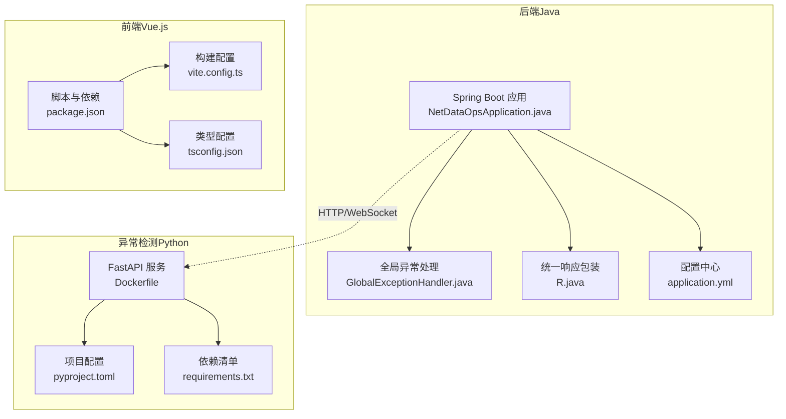
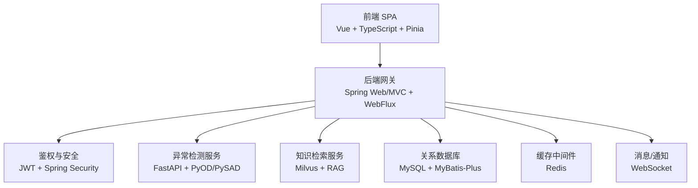
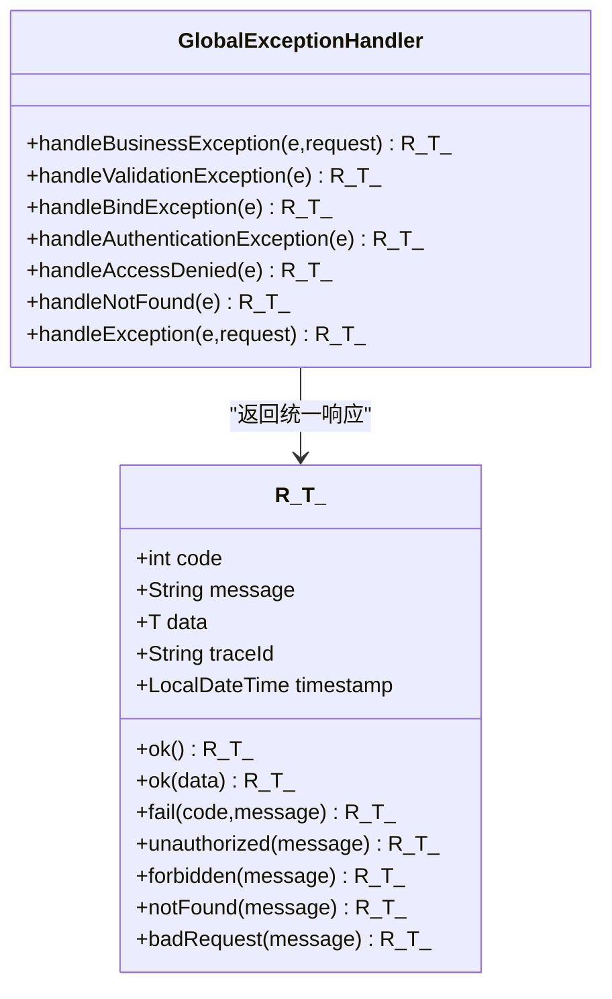
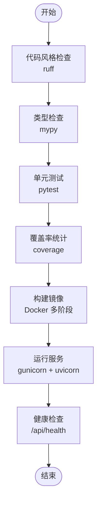
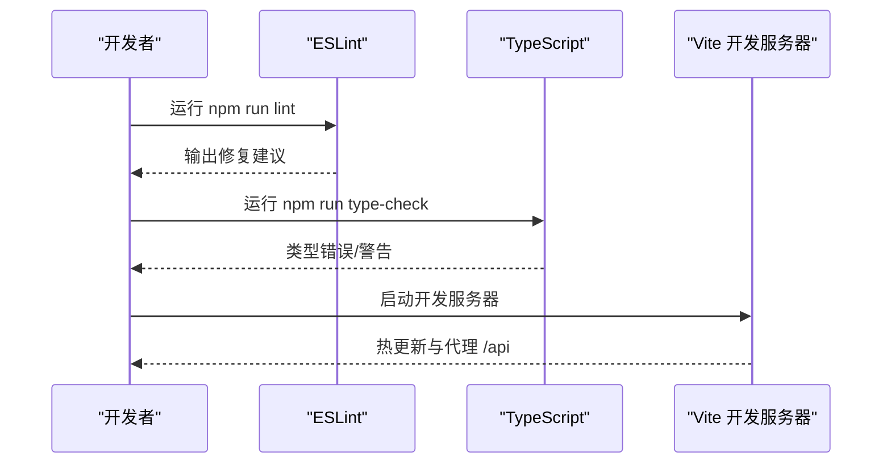
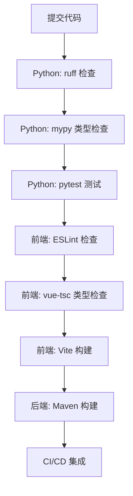
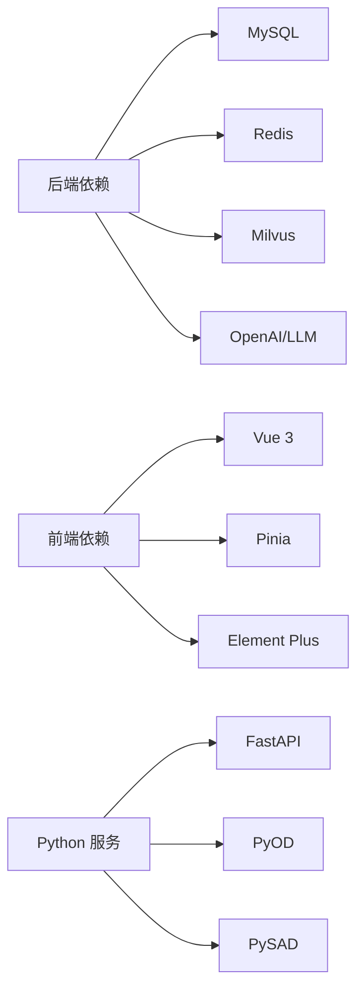

# 代码规范与约定

<cite>
**本文引用的文件**
- [NetDataOpsApplication.java](file://netdata-ai-backend/src/main/java/com/netdata/ops/NetDataOpsApplication.java)
- [GlobalExceptionHandler.java](file://netdata-ai-backend/src/main/java/com/netdata/ops/exception/GlobalExceptionHandler.java)
- [R.java](file://netdata-ai-backend/src/main/java/com/netdata/ops/dto/response/R.java)
- [application.yml](file://netdata-ai-backend/src/main/resources/application.yml)
- [pom.xml](file://netdata-ai-backend/pom.xml)
- [Dockerfile（异常检测服务）](file://anomaly-detection-service/Dockerfile)
- [pyproject.toml（异常检测服务）](file://anomaly-detection-service/pyproject.toml)
- [requirements.txt（异常检测服务）](file://anomaly-detection-service/requirements.txt)
- [package.json（前端）](file://netdata-ai-frontend/package.json)
- [tsconfig.json（前端）](file://netdata-ai-frontend/tsconfig.json)
- [vite.config.ts（前端）](file://netdata-ai-frontend/vite.config.ts)
- [.gitignore（根目录）](file://.gitignore)
- [.gitignore（前端）](file://netdata-ai-frontend/.gitignore)
</cite>

## 目录
1. [引言](#引言)
2. [项目结构](#项目结构)
3. [核心组件](#核心组件)
4. [架构总览](#架构总览)
5. [详细组件分析](#详细组件分析)
6. [依赖分析](#依赖分析)
7. [性能考虑](#性能考虑)
8. [故障排查指南](#故障排查指南)
9. [结论](#结论)
10. [附录](#附录)

## 引言
本文件旨在制定并说明本项目的代码规范与约定标准，覆盖以下方面：
- Java 后端：命名约定、类设计原则、注释标准、异常处理模式
- Python 微服务：PEP8 规范、模块组织与函数设计原则
- Vue.js 前端：TypeScript 编码规范、组件设计模式与状态管理约定
- Git 提交信息规范、分支命名约定与代码审查标准
- 代码格式化工具配置与自动化检查流程

本规范以现有代码库为依据，结合实际工程实践，形成统一、可执行、可持续演进的工程标准。

## 项目结构
项目由三部分组成：
- Java 后端（Spring Boot）：负责统一鉴权、RAG、AI 对话、知识检索、命令审批与执行、WebSocket 实时推送等
- Python 异常检测微服务：提供 FastAPI 接口，封装 PyOD/PySAD 算法，供后端调用
- Vue.js 前端：基于 Vite + TypeScript + Vue 3 + Pinia + Element Plus 的单页应用

图表来源
- [NetDataOpsApplication.java:1-36](file://netdata-ai-backend/src/main/java/com/netdata/ops/NetDataOpsApplication.java#L1-L36)
- [GlobalExceptionHandler.java:1-140](file://netdata-ai-backend/src/main/java/com/netdata/ops/exception/GlobalExceptionHandler.java#L1-L140)
- [R.java:1-81](file://netdata-ai-backend/src/main/java/com/netdata/ops/dto/response/R.java#L1-L81)
- [application.yml:1-314](file://netdata-ai-backend/src/main/resources/application.yml#L1-L314)
- [Dockerfile（异常检测服务）:1-95](file://anomaly-detection-service/Dockerfile#L1-L95)
- [pyproject.toml（异常检测服务）:1-55](file://anomaly-detection-service/pyproject.toml#L1-L55)
- [requirements.txt（异常检测服务）:1-94](file://anomaly-detection-service/requirements.txt#L1-L94)
- [vite.config.ts（前端）:1-52](file://netdata-ai-frontend/vite.config.ts#L1-L52)
- [tsconfig.json（前端）:1-35](file://netdata-ai-frontend/tsconfig.json#L1-L35)
- [package.json（前端）:1-37](file://netdata-ai-frontend/package.json#L1-L37)

章节来源
- [NetDataOpsApplication.java:1-36](file://netdata-ai-backend/src/main/java/com/netdata/ops/NetDataOpsApplication.java#L1-L36)
- [application.yml:1-314](file://netdata-ai-backend/src/main/resources/application.yml#L1-L314)
- [Dockerfile（异常检测服务）:1-95](file://anomaly-detection-service/Dockerfile#L1-L95)
- [pyproject.toml（异常检测服务）:1-55](file://anomaly-detection-service/pyproject.toml#L1-L55)
- [requirements.txt（异常检测服务）:1-94](file://anomaly-detection-service/requirements.txt#L1-L94)
- [vite.config.ts（前端）:1-52](file://netdata-ai-frontend/vite.config.ts#L1-L52)
- [tsconfig.json（前端）:1-35](file://netdata-ai-frontend/tsconfig.json#L1-L35)
- [package.json（前端）:1-37](file://netdata-ai-frontend/package.json#L1-L37)

## 核心组件
本节聚焦于后端统一响应、全局异常处理与前端类型配置，作为规范制定的参考基线。

- 统一响应包装 R<T>
  - 设计目标：统一 API 响应结构，便于前端消费与错误处理
  - 关键字段：状态码、消息、数据、追踪 ID、时间戳
  - 工具方法：ok/fail/unauthorized/forbidden/notFound/badRequest 等静态工厂方法
  - 章节来源
    - [R.java:1-81](file://netdata-ai-backend/src/main/java/com/netdata/ops/dto/response/R.java#L1-L81)

- 全局异常处理 GlobalExceptionHandler
  - 覆盖范围：业务异常、参数校验、请求体解析、认证/授权、404、方法不支持、非法参数、兜底异常
  - 返回策略：统一通过 R<T> 包装，设置对应 HTTP 状态码
  - 章节来源
    - [GlobalExceptionHandler.java:1-140](file://netdata-ai-backend/src/main/java/com/netdata/ops/exception/GlobalExceptionHandler.java#L1-L140)

- 前端 TypeScript 严格配置
  - 严格模式、未使用局部变量/参数、switch 穷举检查
  - 路径别名映射 @/* -> src/*
  - 章节来源
    - [tsconfig.json（前端）:1-35](file://netdata-ai-frontend/tsconfig.json#L1-L35)

章节来源
- [R.java:1-81](file://netdata-ai-backend/src/main/java/com/netdata/ops/dto/response/R.java#L1-L81)
- [GlobalExceptionHandler.java:1-140](file://netdata-ai-backend/src/main/java/com/netdata/ops/exception/GlobalExceptionHandler.java#L1-L140)
- [tsconfig.json（前端）:1-35](file://netdata-ai-frontend/tsconfig.json#L1-L35)

## 架构总览
系统采用“后端统一网关 + 微服务拆分 + 前端 SPA”的分层架构。后端通过 HTTP/WebSocket 与异常检测服务交互，并集成 RAG、AI 对话、RBAC、缓存与向量检索等能力。

图表来源
- [NetDataOpsApplication.java:1-36](file://netdata-ai-backend/src/main/java/com/netdata/ops/NetDataOpsApplication.java#L1-L36)
- [application.yml:1-314](file://netdata-ai-backend/src/main/resources/application.yml#L1-L314)
- [Dockerfile（异常检测服务）:1-95](file://anomaly-detection-service/Dockerfile#L1-L95)
- [pom.xml:1-270](file://netdata-ai-backend/pom.xml#L1-L270)

## 详细组件分析

### Java 后端：编码规范与约定
- 命名约定
  - 包名：全小写，采用反向域名风格 com.netdata.ops
  - 类名：帕斯卡命名；接口以 I 开头或抽象类以 Base 开头
  - 方法/字段：驼峰命名；常量全大写下划线
  - 注解与枚举：全大写
  - 章节来源
    - [NetDataOpsApplication.java:1-36](file://netdata-ai-backend/src/main/java/com/netdata/ops/NetDataOpsApplication.java#L1-L36)

- 类设计原则
  - 控制器：职责单一，仅做参数接收与转发；复杂逻辑下沉至 Service
  - DTO/VO：纯数据载体，避免业务逻辑；使用构造/工厂方法保证不可变性
  - 异常：自定义 BusinessException，携带业务码与消息；全局异常处理器统一兜底
  - 章节来源
    - [GlobalExceptionHandler.java:1-140](file://netdata-ai-backend/src/main/java/com/netdata/ops/exception/GlobalExceptionHandler.java#L1-L140)
    - [R.java:1-81](file://netdata-ai-backend/src/main/java/com/netdata/ops/dto/response/R.java#L1-L81)

- 注释标准
  - 类/方法注释：说明用途、输入输出、异常与注意事项
  - 字段注释：对关键配置项进行解释
  - 章节来源
    - [NetDataOpsApplication.java:7-27](file://netdata-ai-backend/src/main/java/com/netdata/ops/NetDataOpsApplication.java#L7-L27)

- 异常处理模式
  - 显式捕获与转换：在 Service/Controller 层捕获具体异常，转为 BusinessException
  - 全局兜底：GlobalExceptionHandler 将异常映射为 R<T>，记录日志并返回统一结构
  - 章节来源
    - [GlobalExceptionHandler.java:22-139](file://netdata-ai-backend/src/main/java/com/netdata/ops/exception/GlobalExceptionHandler.java#L22-L139)
    - [R.java:42-75](file://netdata-ai-backend/src/main/java/com/netdata/ops/dto/response/R.java#L42-L75)

- 配置与运行
  - Profile 分离：dev/prod 通过 spring.profiles.active 切换
  - 环境变量：敏感配置从环境变量注入，避免硬编码
  - 章节来源
    - [application.yml:25-314](file://netdata-ai-backend/src/main/resources/application.yml#L25-L314)

图表来源
- [R.java:1-81](file://netdata-ai-backend/src/main/java/com/netdata/ops/dto/response/R.java#L1-L81)
- [GlobalExceptionHandler.java:1-140](file://netdata-ai-backend/src/main/java/com/netdata/ops/exception/GlobalExceptionHandler.java#L1-L140)

章节来源
- [R.java:1-81](file://netdata-ai-backend/src/main/java/com/netdata/ops/dto/response/R.java#L1-L81)
- [GlobalExceptionHandler.java:1-140](file://netdata-ai-backend/src/main/java/com/netdata/ops/exception/GlobalExceptionHandler.java#L1-L140)
- [application.yml:1-314](file://netdata-ai-backend/src/main/resources/application.yml#L1-L314)

### Python 微服务：PEP8 规范与模块组织
- PEP8 规范
  - 行宽：ruff 配置 line-length=100
  - 导入顺序：isort 规范，known-first-party 指定 app
  - 忽略规则：如 E501（行过长）、B008（默认参数为函数调用）
  - 章节来源
    - [pyproject.toml（异常检测服务）:10-26](file://anomaly-detection-service/pyproject.toml#L10-L26)

- 模块组织
  - 核心算法导出：通过 __all__ 明确公开接口，便于上层调用
  - 章节来源
    - [app/__init__.py（异常检测服务）:1-50](file://anomaly-detection-service/app/__init__.py#L1-L50)

- 函数设计原则
  - 单一职责：每个函数只做一件事；复杂流程拆分为多个小函数
  - 输入输出：明确参数类型与返回值；必要时添加类型注解
  - 错误处理：抛出明确异常或返回错误码；避免静默失败
  - 章节来源
    - [pyproject.toml（异常检测服务）:31-36](file://anomaly-detection-service/pyproject.toml#L31-L36)

- 依赖与测试
  - 依赖：FastAPI、PyOD、PySAD、HTTPX、NumPy/SciPy、pytest、ruff、mypy
  - 测试：pytest 配置 testpaths/python_files/python_functions/addopts
  - 章节来源
    - [requirements.txt（异常检测服务）:1-94](file://anomaly-detection-service/requirements.txt#L1-L94)
    - [pyproject.toml（异常检测服务）:37-42](file://anomaly-detection-service/pyproject.toml#L37-L42)

- 部署与健康检查
  - Docker 多阶段构建，非 root 用户运行
  - gunicorn + uvicorn worker，健康检查指向 /api/health
  - 章节来源
    - [Dockerfile（异常检测服务）:1-95](file://anomaly-detection-service/Dockerfile#L1-L95)

图表来源
- [pyproject.toml（异常检测服务）:10-55](file://anomaly-detection-service/pyproject.toml#L10-L55)
- [requirements.txt（异常检测服务）:1-94](file://anomaly-detection-service/requirements.txt#L1-L94)
- [Dockerfile（异常检测服务）:78-95](file://anomaly-detection-service/Dockerfile#L78-L95)

章节来源
- [pyproject.toml（异常检测服务）:1-55](file://anomaly-detection-service/pyproject.toml#L1-L55)
- [requirements.txt（异常检测服务）:1-94](file://anomaly-detection-service/requirements.txt#L1-L94)
- [Dockerfile（异常检测服务）:1-95](file://anomaly-detection-service/Dockerfile#L1-L95)

### Vue.js 前端：TypeScript 编码规范与状态管理
- TypeScript 编码规范
  - 严格模式：开启 strict/noUnusedLocals/noUnusedParameters/noFallthroughCasesInSwitch
  - 路径别名：@/* 指向 src，提升可维护性
  - 章节来源
    - [tsconfig.json（前端）:1-35](file://netdata-ai-frontend/tsconfig.json#L1-L35)

- 组件设计模式
  - 单文件组件：视图与逻辑分离，保持组件粒度适中
  - 组合式 API：优先使用 <script setup> 语法，减少样板代码
  - 章节来源
    - [vite.config.ts（前端）:1-52](file://netdata-ai-frontend/vite.config.ts#L1-L52)

- 状态管理约定（Pinia）
  - Store 分层：按领域划分模块（auth/chat/settings），避免全局臃肿
  - 状态与动作：纯状态 + 纯函数式动作；避免在 Store 中直接发起网络请求
  - 章节来源
    - [package.json（前端）:13-23](file://netdata-ai-frontend/package.json#L13-L23)

- 构建与开发体验
  - ESLint 自动修复：npm run lint
  - 类型检查：npm run type-check
  - 代理后端 API：/api 代理到 http://localhost:8080
  - 章节来源
    - [package.json（前端）:6-12](file://netdata-ai-frontend/package.json#L6-L12)
    - [vite.config.ts（前端）:28-37](file://netdata-ai-frontend/vite.config.ts#L28-L37)

图表来源
- [package.json（前端）:6-12](file://netdata-ai-frontend/package.json#L6-L12)
- [tsconfig.json（前端）:17-22](file://netdata-ai-frontend/tsconfig.json#L17-L22)
- [vite.config.ts（前端）:28-37](file://netdata-ai-frontend/vite.config.ts#L28-L37)

章节来源
- [tsconfig.json（前端）:1-35](file://netdata-ai-frontend/tsconfig.json#L1-L35)
- [package.json（前端）:1-37](file://netdata-ai-frontend/package.json#L1-L37)
- [vite.config.ts（前端）:1-52](file://netdata-ai-frontend/vite.config.ts#L1-L52)

### Git 提交信息规范、分支命名与代码审查
- 提交信息规范
  - 格式：类型(scope): 概要
  - 类型：feat、fix、docs、style、refactor、perf、test、build、ci、chore
  - 示例：feat(backend): 添加用户登录接口
  - 章节来源
    - [.gitignore（根目录）:1-177](file://.gitignore#L1-L177)

- 分支命名约定
  - develop：主开发分支
  - feature/xxx：新功能
  - fix/xxx：缺陷修复
  - hotfix/xxx：紧急修复
  - refactor/xxx：重构
  - 章节来源
    - [.gitignore（根目录）:1-177](file://.gitignore#L1-L177)

- 代码审查标准
  - 必须通过 Lint/Type Check/测试
  - 变更需有明确动机与影响范围说明
  - Reviewer 至少 1 人，涉及安全/鉴权/数据库变更需双 Review
  - 章节来源
    - [pyproject.toml（异常检测服务）:37-42](file://anomaly-detection-service/pyproject.toml#L37-L42)
    - [tsconfig.json（前端）:17-22](file://netdata-ai-frontend/tsconfig.json#L17-L22)

章节来源
- [.gitignore（根目录）:1-177](file://.gitignore#L1-L177)
- [pyproject.toml（异常检测服务）:37-42](file://anomaly-detection-service/pyproject.toml#L37-L42)
- [tsconfig.json（前端）:17-22](file://netdata-ai-frontend/tsconfig.json#L17-L22)

### 代码格式化工具与自动化检查流程
- Java 后端
  - 依赖管理：Maven（pom.xml）集中管理版本与插件
  - 章节来源
    - [pom.xml:1-270](file://netdata-ai-backend/pom.xml#L1-L270)

- Python 微服务
  - 格式化与检查：ruff（lint + import sort）
  - 类型检查：mypy
  - 测试：pytest
  - 覆盖率：coverage
  - 章节来源
    - [pyproject.toml（异常检测服务）:10-55](file://anomaly-detection-service/pyproject.toml#L10-L55)
    - [requirements.txt（异常检测服务）:78-82](file://anomaly-detection-service/requirements.txt#L78-L82)

- 前端
  - 格式化与检查：ESLint（npm run lint）
  - 类型检查：vue-tsc（npm run type-check）
  - 构建：Vite（npm run build）
  - 章节来源
    - [package.json（前端）:6-12](file://netdata-ai-frontend/package.json#L6-L12)
    - [tsconfig.json（前端）:17-22](file://netdata-ai-frontend/tsconfig.json#L17-L22)

图表来源
- [pyproject.toml（异常检测服务）:10-55](file://anomaly-detection-service/pyproject.toml#L10-L55)
- [package.json（前端）:6-12](file://netdata-ai-frontend/package.json#L6-L12)
- [tsconfig.json（前端）:17-22](file://netdata-ai-frontend/tsconfig.json#L17-L22)
- [pom.xml:240-255](file://netdata-ai-backend/pom.xml#L240-L255)

章节来源
- [pyproject.toml（异常检测服务）:10-55](file://anomaly-detection-service/pyproject.toml#L10-L55)
- [package.json（前端）:6-12](file://netdata-ai-frontend/package.json#L6-L12)
- [tsconfig.json（前端）:17-22](file://netdata-ai-frontend/tsconfig.json#L17-L22)
- [pom.xml:240-255](file://netdata-ai-backend/pom.xml#L240-L255)

## 依赖分析
- 后端依赖
  - Web/MVC、Security、Actuator、OpenAPI、WebFlux、Resilience4j、MyBatis-Plus、MySQL、Redis、Milvus、Jackson、Hutool、Lombok
  - 章节来源
    - [pom.xml:41-238](file://netdata-ai-backend/pom.xml#L41-L238)

- 前端依赖
  - Vue 3、Vue Router、Pinia、Element Plus、Axios、Sass、ESLint、Vite、TypeScript
  - 章节来源
    - [package.json（前端）:13-35](file://netdata-ai-frontend/package.json#L13-L35)

- 微服务依赖
  - FastAPI、PyOD、PySAD、HTTPX、NumPy/SciPy、PyTest、Ruff、MyPy
  - 章节来源
    - [requirements.txt（异常检测服务）:17-94](file://anomaly-detection-service/requirements.txt#L17-L94)

图表来源
- [pom.xml:41-238](file://netdata-ai-backend/pom.xml#L41-L238)
- [package.json（前端）:13-35](file://netdata-ai-frontend/package.json#L13-L35)
- [requirements.txt（异常检测服务）:17-94](file://anomaly-detection-service/requirements.txt#L17-L94)

章节来源
- [pom.xml:41-238](file://netdata-ai-backend/pom.xml#L41-L238)
- [package.json（前端）:13-35](file://netdata-ai-frontend/package.json#L13-L35)
- [requirements.txt（异常检测服务）:17-94](file://anomaly-detection-service/requirements.txt#L17-L94)

## 性能考虑
- 后端
  - 连接池与超时：HikariCP、Redis 连接池参数已配置
  - 缓存：Redis 缓存热点数据，降低数据库压力
  - 限流与熔断：Resilience4j 集成，Actuator 暴露指标
  - 章节来源
    - [application.yml:36-58](file://netdata-ai-backend/src/main/resources/application.yml#L36-L58)
    - [application.yml:224-237](file://netdata-ai-backend/src/main/resources/application.yml#L224-L237)

- 前端
  - 代码分割：手动分包 element-plus 与 vue-vendor
  - 构建优化：关闭 sourcemap，限制 chunk 警告阈值
  - 章节来源
    - [vite.config.ts（前端）:38-50](file://netdata-ai-frontend/vite.config.ts#L38-L50)

- 微服务
  - 多阶段构建，非 root 用户运行，减小镜像体积与攻击面
  - 健康检查，便于容器编排与弹性伸缩
  - 章节来源
    - [Dockerfile（异常检测服务）:55-95](file://anomaly-detection-service/Dockerfile#L55-L95)

## 故障排查指南
- 后端
  - 统一响应与日志：R<T> + MDC traceId，异常处理器记录 URI 与堆栈
  - Actuator 指标：Prometheus 暴露，便于监控与告警
  - 章节来源
    - [R.java:19-25](file://netdata-ai-backend/src/main/java/com/netdata/ops/dto/response/R.java#L19-L25)
    - [GlobalExceptionHandler.java:133-139](file://netdata-ai-backend/src/main/java/com/netdata/ops/exception/GlobalExceptionHandler.java#L133-L139)
    - [application.yml:206-237](file://netdata-ai-backend/src/main/resources/application.yml#L206-L237)

- 前端
  - ESLint/类型检查先行，避免运行期错误
  - 代理配置 /api，确保后端端口一致
  - 章节来源
    - [package.json（前端）:6-12](file://netdata-ai-frontend/package.json#L6-L12)
    - [vite.config.ts（前端）:28-37](file://netdata-ai-frontend/vite.config.ts#L28-L37)

- 微服务
  - 健康检查失败：确认 /api/health 可达与端口映射
  - 依赖冲突：锁定 NumPy/SciPy 版本，避免与 PySAD 冲突
  - 章节来源
    - [Dockerfile（异常检测服务）:78-95](file://anomaly-detection-service/Dockerfile#L78-L95)
    - [requirements.txt（异常检测服务）:34-50](file://anomaly-detection-service/requirements.txt#L34-L50)

章节来源
- [R.java:19-25](file://netdata-ai-backend/src/main/java/com/netdata/ops/dto/response/R.java#L19-L25)
- [GlobalExceptionHandler.java:133-139](file://netdata-ai-backend/src/main/java/com/netdata/ops/exception/GlobalExceptionHandler.java#L133-L139)
- [application.yml:206-237](file://netdata-ai-backend/src/main/resources/application.yml#L206-L237)
- [package.json（前端）:6-12](file://netdata-ai-frontend/package.json#L6-L12)
- [vite.config.ts（前端）:28-37](file://netdata-ai-frontend/vite.config.ts#L28-L37)
- [Dockerfile（异常检测服务）:78-95](file://anomaly-detection-service/Dockerfile#L78-L95)
- [requirements.txt（异常检测服务）:34-50](file://anomaly-detection-service/requirements.txt#L34-L50)

## 结论
本规范以现有代码库为基础，明确了 Java 后端、Python 微服务与 Vue.js 前端的编码与工程实践标准，并配套了 Git 规范与自动化检查流程。建议团队在日常开发中严格执行，持续改进，确保代码质量与交付效率。

## 附录
- 敏感信息与忽略规则
  - .env/.env.*.local、日志、Docker 数据目录、IDE 文件等纳入 .gitignore
  - 章节来源
    - [.gitignore（根目录）:10-177](file://.gitignore#L10-L177)
    - [.gitignore（前端）:1-29](file://netdata-ai-frontend/.gitignore#L1-L29)