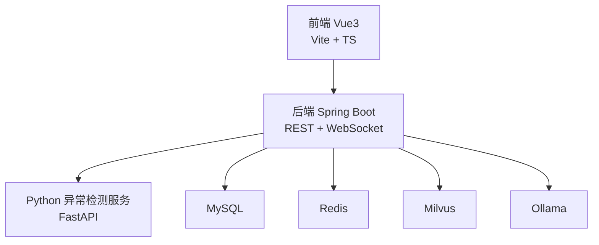
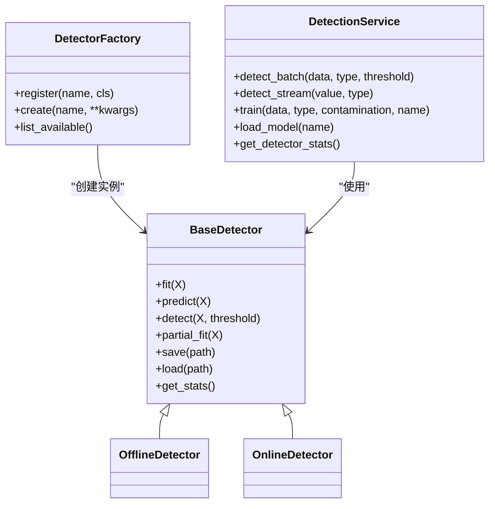
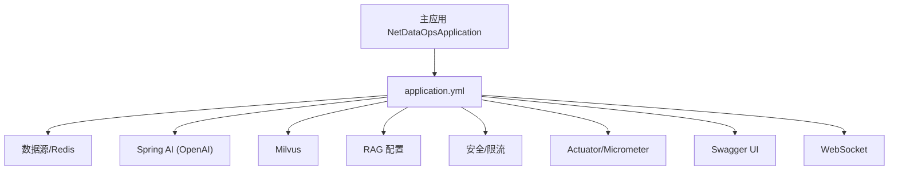
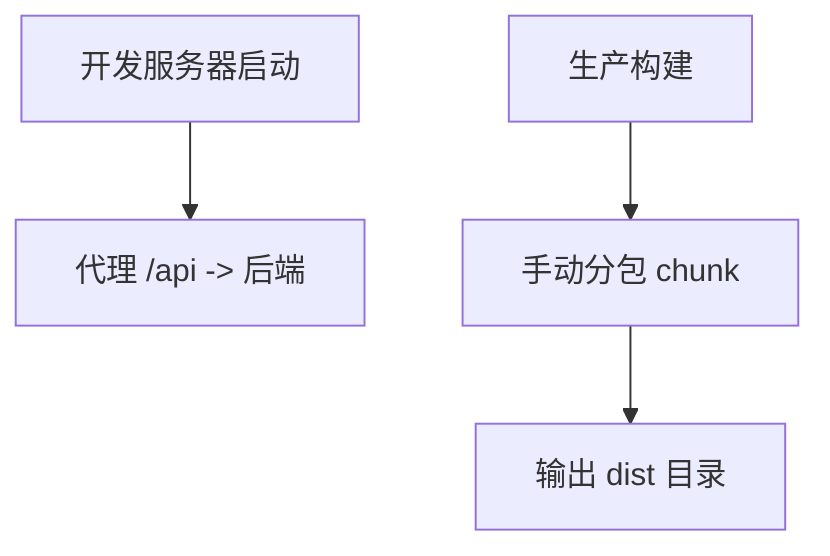
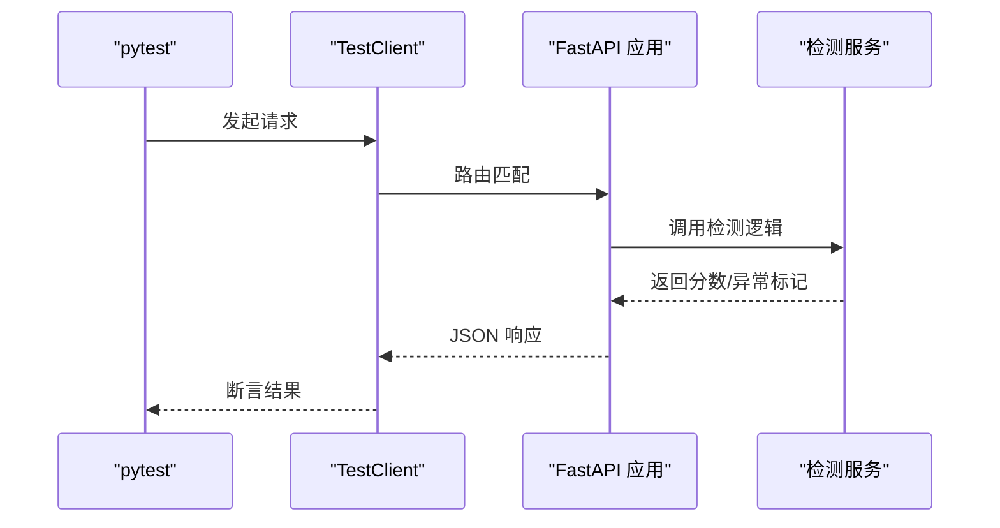
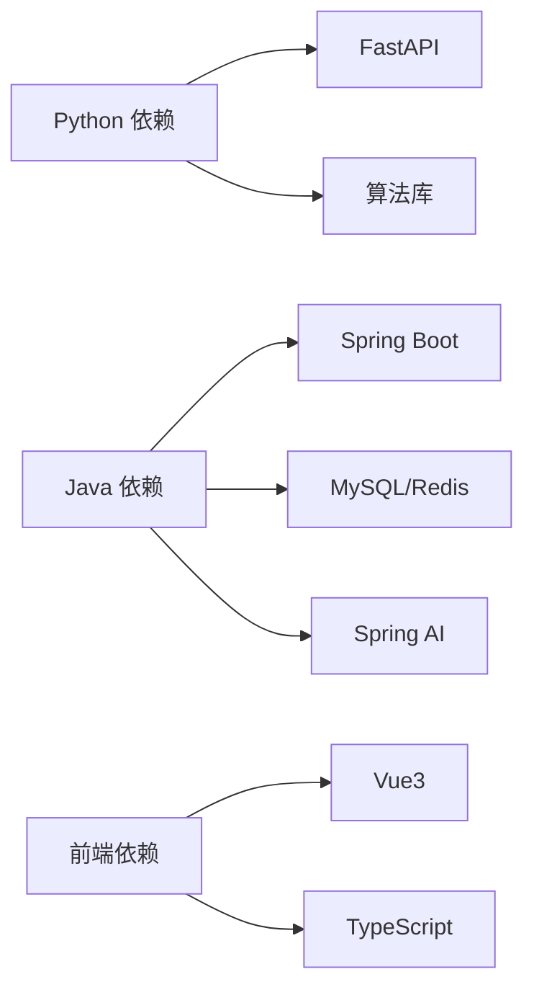

# 开发指南

<cite>
**本文引用的文件**
- [anomaly-detection-service/pyproject.toml](file://anomaly-detection-service/pyproject.toml)
- [anomaly-detection-service/requirements.txt](file://anomaly-detection-service/requirements.txt)
- [anomaly-detection-service/Dockerfile](file://anomaly-detection-service/Dockerfile)
- [anomaly-detection-service/tests/test_api.py](file://anomaly-detection-service/tests/test_api.py)
- [anomaly-detection-service/tests/test_detectors.py](file://anomaly-detection-service/tests/test_detectors.py)
- [anomaly-detection-service/app/main.py](file://anomaly-detection-service/app/main.py)
- [anomaly-detection-service/app/config.py](file://anomaly-detection-service/app/config.py)
- [anomaly-detection-service/app/core/detector_base.py](file://anomaly-detection-service/app/core/detector_base.py)
- [anomaly-detection-service/app/services/detection_service.py](file://anomaly-detection-service/app/services/detection_service.py)
- [netdata-ai-backend/pom.xml](file://netdata-ai-backend/pom.xml)
- [netdata-ai-backend/src/main/java/com/netdata/ops/NetDataOpsApplication.java](file://netdata-ai-backend/src/main/java/com/netdata/ops/NetDataOpsApplication.java)
- [netdata-ai-backend/src/main/resources/application.yml](file://netdata-ai-backend/src/main/resources/application.yml)
- [netdata-ai-frontend/package.json](file://netdata-ai-frontend/package.json)
- [netdata-ai-frontend/vite.config.ts](file://netdata-ai-frontend/vite.config.ts)
- [netdata-ai-frontend/tsconfig.json](file://netdata-ai-frontend/tsconfig.json)
- [docker-compose.yml](file://docker-compose.yml)
- [scripts/verify-env.sh](file://scripts/verify-env.sh)
- [scripts/verify-env.ps1](file://scripts/verify-env.ps1)
</cite>

## 目录
1. [简介](#简介)
2. [项目结构](#项目结构)
3. [核心组件](#核心组件)
4. [架构总览](#架构总览)
5. [详细组件分析](#详细组件分析)
6. [依赖分析](#依赖分析)
7. [性能考虑](#性能考虑)
8. [故障排查指南](#故障排查指南)
9. [结论](#结论)
10. [附录](#附录)

## 简介
本指南面向开发者，提供从环境搭建、代码规范、测试策略、调试技巧到版本管理与 CI/CD 的全流程开发指导。项目采用多语言技术栈：Python FastAPI 异常检测服务、Java Spring Boot AI 后端、Vue3 TypeScript 前端，并通过 Docker Compose 统一编排，结合 Milvus、MySQL、Redis、Ollama 等基础设施，形成“监控数据采集—AI 智能问答—异常检测—命令执行”的闭环。

## 项目结构
项目由四个主要子系统组成：
- 异常检测服务（Python/FastAPI）：提供批量与流式异常检测能力，支持多种算法与模型持久化。
- AI 后端（Java/Spring Boot）：负责自然语言问答、RAG 知识检索、命令执行审批与安全控制。
- 前端（Vue3/Vite/TypeScript）：提供用户交互界面，对接后端 API。
- 基础设施与编排（Docker Compose）：统一管理 MySQL、Redis、Milvus、Ollama 等服务。

```mermaid
graph TB
subgraph "前端"
FE["Vue3 前端<br/>Vite + TypeScript"]
end
subgraph "后端"
BE["Spring Boot 后端<br/>Java"]
PY["Python 异常检测服务<br/>FastAPI"]
end
subgraph "基础设施"
DB["MySQL"]
CACHE["Redis"]
MILVUS["Milvus 向量库"]
OLLAMA["Ollama 本地 LLM"]
end
FE --> BE
BE <- --> PY
BE --> DB
BE --> CACHE
BE --> MILVUS
BE --> OLLAMA
```

图表来源
- [docker-compose.yml:23-358](file://docker-compose.yml#L23-L358)
- [netdata-ai-backend/src/main/resources/application.yml:14-314](file://netdata-ai-backend/src/main/resources/application.yml#L14-L314)
- [anomaly-detection-service/Dockerfile:15-95](file://anomaly-detection-service/Dockerfile#L15-L95)

章节来源
- [docker-compose.yml:1-358](file://docker-compose.yml#L1-L358)
- [anomaly-detection-service/Dockerfile:1-95](file://anomaly-detection-service/Dockerfile#L1-L95)
- [netdata-ai-backend/pom.xml:1-270](file://netdata-ai-backend/pom.xml#L1-L270)
- [netdata-ai-frontend/package.json:1-37](file://netdata-ai-frontend/package.json#L1-L37)

## 核心组件
- 异常检测服务（Python/FastAPI）
  - 应用入口与生命周期管理、中间件与异常处理、路由注册与文档。
  - 配置中心：集中管理端口、阈值、缓存、日志等。
  - 检测器抽象与工厂：统一离线/在线检测器接口，支持多种算法。
  - 检测服务层：协调检测器、批量/流式检测、模型持久化与统计。
- AI 后端（Java/Spring Boot）
  - 主应用入口、多 Profile 配置（dev/prod）、数据源与 Redis、MyBatis-Plus、Spring AI、Milvus、RAG、命令执行安全策略、安全与限流、Actuator 指标、WebSocket。
- 前端（Vue3/Vite/TypeScript）
  - 构建脚本、自动导入、组件解析、代理后端 API、打包优化与别名路径映射。
- 基础设施与编排
  - Docker Compose 统一编排 MySQL、Redis、Milvus、Ollama；环境验证脚本（Bash/PowerShell）辅助检查与快速连接。

章节来源
- [anomaly-detection-service/app/main.py:1-217](file://anomaly-detection-service/app/main.py#L1-L217)
- [anomaly-detection-service/app/config.py:1-183](file://anomaly-detection-service/app/config.py#L1-L183)
- [anomaly-detection-service/app/core/detector_base.py:1-339](file://anomaly-detection-service/app/core/detector_base.py#L1-L339)
- [anomaly-detection-service/app/services/detection_service.py:1-334](file://anomaly-detection-service/app/services/detection_service.py#L1-L334)
- [netdata-ai-backend/src/main/java/com/netdata/ops/NetDataOpsApplication.java:1-36](file://netdata-ai-backend/src/main/java/com/netdata/ops/NetDataOpsApplication.java#L1-L36)
- [netdata-ai-backend/src/main/resources/application.yml:1-314](file://netdata-ai-backend/src/main/resources/application.yml#L1-L314)
- [netdata-ai-frontend/package.json:1-37](file://netdata-ai-frontend/package.json#L1-L37)
- [netdata-ai-frontend/vite.config.ts:1-52](file://netdata-ai-frontend/vite.config.ts#L1-L52)
- [netdata-ai-frontend/tsconfig.json:1-35](file://netdata-ai-frontend/tsconfig.json#L1-L35)

## 架构总览
系统采用前后端分离与微服务化思路：
- 前端通过代理访问后端 API；后端通过 HTTP 客户端调用 Python 异常检测服务。
- 后端集成 Milvus 进行 RAG 检索，结合 MySQL/Redis 提供鉴权、会话、缓存与审计。
- Docker Compose 将各服务解耦并统一编排，便于开发与部署。



图表来源
- [netdata-ai-backend/src/main/resources/application.yml:149-155](file://netdata-ai-backend/src/main/resources/application.yml#L149-L155)
- [netdata-ai-frontend/vite.config.ts:30-36](file://netdata-ai-frontend/vite.config.ts#L30-L36)
- [docker-compose.yml:23-358](file://docker-compose.yml#L23-L358)

## 详细组件分析

### 异常检测服务（Python/FastAPI）
- 应用入口与生命周期
  - 使用 lifespan 管理启动/关闭阶段，配置日志、预加载默认检测器。
  - 注册健康检查、文档端点与 CORS 中间件。
- 配置中心
  - 使用 Pydantic Settings 管理环境变量、默认值与类型校验，提供属性化访问。
- 检测器抽象与工厂
  - 抽象基类定义统一接口与工具方法；离线/在线检测器分类；工厂注册与创建。
- 检测服务层
  - 实例池管理离线/在线检测器；批量/流式检测；模型持久化与统计信息导出。



图表来源
- [anomaly-detection-service/app/core/detector_base.py:31-339](file://anomaly-detection-service/app/core/detector_base.py#L31-L339)
- [anomaly-detection-service/app/services/detection_service.py:37-334](file://anomaly-detection-service/app/services/detection_service.py#L37-L334)

章节来源
- [anomaly-detection-service/app/main.py:32-217](file://anomaly-detection-service/app/main.py#L32-L217)
- [anomaly-detection-service/app/config.py:28-183](file://anomaly-detection-service/app/config.py#L28-L183)
- [anomaly-detection-service/app/core/detector_base.py:31-339](file://anomaly-detection-service/app/core/detector_base.py#L31-L339)
- [anomaly-detection-service/app/services/detection_service.py:37-334](file://anomaly-detection-service/app/services/detection_service.py#L37-L334)

### AI 后端（Java/Spring Boot）
- 主应用入口与多 Profile
  - dev 使用本地 Ollama，prod 使用 DeepSeek API；统一配置文件与环境变量。
- 核心配置
  - 数据源、Redis、Jackson、MyBatis-Plus、Spring AI、Milvus、RAG、LLM 降级、异常检测服务调用、命令执行黑名单白名单、安全与限流、Actuator 指标、Swagger 文档、WebSocket。
- 安全与容错
  - JWT 认证、权限注解与切面、Resilience4j 容错（熔断、重试、舱壁、限时）。



图表来源
- [netdata-ai-backend/src/main/java/com/netdata/ops/NetDataOpsApplication.java:1-36](file://netdata-ai-backend/src/main/java/com/netdata/ops/NetDataOpsApplication.java#L1-L36)
- [netdata-ai-backend/src/main/resources/application.yml:1-314](file://netdata-ai-backend/src/main/resources/application.yml#L1-L314)

章节来源
- [netdata-ai-backend/pom.xml:1-270](file://netdata-ai-backend/pom.xml#L1-L270)
- [netdata-ai-backend/src/main/resources/application.yml:1-314](file://netdata-ai-backend/src/main/resources/application.yml#L1-L314)

### 前端（Vue3/Vite/TypeScript）
- 构建与开发
  - Vite + Vue 插件、自动导入 Element Plus、组件自动解析、路径别名映射。
- 代理与构建
  - 本地代理后端 API，开发端口 3000；生产构建输出 dist，分包优化。
- 类型与严格性
  - TypeScript 严格模式、路径映射、类型声明文件生成。



图表来源
- [netdata-ai-frontend/vite.config.ts:28-51](file://netdata-ai-frontend/vite.config.ts#L28-L51)
- [netdata-ai-frontend/package.json:6-12](file://netdata-ai-frontend/package.json#L6-L12)

章节来源
- [netdata-ai-frontend/package.json:1-37](file://netdata-ai-frontend/package.json#L1-L37)
- [netdata-ai-frontend/vite.config.ts:1-52](file://netdata-ai-frontend/vite.config.ts#L1-L52)
- [netdata-ai-frontend/tsconfig.json:1-35](file://netdata-ai-frontend/tsconfig.json#L1-L35)

### 测试策略
- Python 异常检测服务
  - API 端到端测试：健康检查、根路径、批量/流式检测、训练、OpenAPI 文档。
  - 单元测试：检测器工厂、具体算法（Isolation Forest、LOF、KNN）、在线检测器、枚举与边界条件。
- 测试配置
  - pytest、TestClient、覆盖率与报告排除规则、异步支持。



图表来源
- [anomaly-detection-service/tests/test_api.py:1-172](file://anomaly-detection-service/tests/test_api.py#L1-L172)
- [anomaly-detection-service/tests/test_detectors.py:1-231](file://anomaly-detection-service/tests/test_detectors.py#L1-L231)
- [anomaly-detection-service/app/services/detection_service.py:76-153](file://anomaly-detection-service/app/services/detection_service.py#L76-L153)

章节来源
- [anomaly-detection-service/tests/test_api.py:1-172](file://anomaly-detection-service/tests/test_api.py#L1-L172)
- [anomaly-detection-service/tests/test_detectors.py:1-231](file://anomaly-detection-service/tests/test_detectors.py#L1-L231)
- [anomaly-detection-service/pyproject.toml:37-55](file://anomaly-detection-service/pyproject.toml#L37-L55)

## 依赖分析
- Python 异常检测服务
  - Web 框架：FastAPI、Uvicorn、Pydantic、Pydantic Settings。
  - HTTP 客户端：httpx、aiohttp。
  - 数据与算法：NumPy、Pandas、SciPy、PyOD、PySAD、Scikit-learn、Joblib。
  - 日志与配置：Loguru、python-dotenv、PyYAML。
  - 测试与质量：pytest、pytest-asyncio、pytest-cov、httpx、Ruff、MyPy。
- Java 后端
  - Spring Boot 3.3.x、Spring AI、MyBatis-Plus、MySQL Connector、Redis、Milvus SDK、Resilience4j、Micrometer、Swagger。
- 前端
  - Vue 3、Vue Router、Pinia、Element Plus、Axios、Sass、ESLint、TypeScript。



图表来源
- [anomaly-detection-service/requirements.txt:1-94](file://anomaly-detection-service/requirements.txt#L1-L94)
- [netdata-ai-backend/pom.xml:41-238](file://netdata-ai-backend/pom.xml#L41-L238)
- [netdata-ai-frontend/package.json:13-35](file://netdata-ai-frontend/package.json#L13-L35)

章节来源
- [anomaly-detection-service/requirements.txt:1-94](file://anomaly-detection-service/requirements.txt#L1-L94)
- [netdata-ai-backend/pom.xml:1-270](file://netdata-ai-backend/pom.xml#L1-L270)
- [netdata-ai-frontend/package.json:1-37](file://netdata-ai-frontend/package.json#L1-L37)

## 性能考虑
- Python 异常检测服务
  - Dockerfile 使用多阶段构建与非 root 用户，减少镜像体积与权限风险；健康检查与 gunicorn + uvicorn worker 提升生产稳定性。
  - 配置中心提供阈值、缓存 TTL、批处理上限等参数，便于调优。
- Java 后端
  - HikariCP 连接池、Resilience4j 容错、Micrometer 指标、Actuator 健康检查，保障高并发与可观测性。
- 前端
  - Vite 构建、手动分包 chunk、关闭 sourcemap 以减小体积与提升构建速度。

章节来源
- [anomaly-detection-service/Dockerfile:54-95](file://anomaly-detection-service/Dockerfile#L54-L95)
- [anomaly-detection-service/app/config.py:139-146](file://anomaly-detection-service/app/config.py#L139-L146)
- [netdata-ai-backend/src/main/resources/application.yml:36-42](file://netdata-ai-backend/src/main/resources/application.yml#L36-L42)
- [netdata-ai-frontend/vite.config.ts:38-50](file://netdata-ai-frontend/vite.config.ts#L38-L50)

## 故障排查指南
- 环境验证脚本
  - Bash/PowerShell 脚本检查 Docker、Compose、端口占用、配置文件、数据目录、服务健康状态与快速连接命令。
- 常见问题定位
  - Docker 资源不足导致 Milvus 启动缓慢或失败；端口冲突导致服务无法启动；.env 缺失或配置错误导致连接失败；Python 依赖版本冲突（如 PySAD 与 NumPy 版本）。
- 日志与监控
  - Python 使用 Loguru 输出到文件；Spring Boot 控制台与文件日志、Actuator 暴露指标；前端代理后端 API，便于联调。

章节来源
- [scripts/verify-env.sh:64-318](file://scripts/verify-env.sh#L64-L318)
- [scripts/verify-env.ps1:35-251](file://scripts/verify-env.ps1#L35-L251)
- [anomaly-detection-service/app/main.py:46-53](file://anomaly-detection-service/app/main.py#L46-L53)
- [netdata-ai-backend/src/main/resources/application.yml:259-270](file://netdata-ai-backend/src/main/resources/application.yml#L259-L270)

## 结论
本指南提供了从环境搭建到测试、调试、版本管理与 CI/CD 的完整开发路径。通过 Docker Compose 统一编排、多 Profile 的配置策略与严格的测试体系，项目具备良好的可维护性与扩展性。建议在团队协作中遵循统一的代码规范与审查流程，并结合 CI/CD 实现自动化构建与部署。

## 附录

### 开发环境搭建流程
- Python 异常检测服务
  - 安装 Python 3.10+，创建虚拟环境，安装依赖与开发工具。
  - 使用 Docker Compose 启动基础设施（MySQL、Redis、Milvus、Ollama），或使用环境验证脚本检查。
  - 运行 FastAPI 应用与 Gunicorn/Uvicorn。
- Java 后端
  - 安装 JDK 17+、Maven，配置环境变量，启动应用。
  - 根据 Profile 切换本地 Ollama 或生产 DeepSeek API。
- 前端
  - 安装 Node.js，安装依赖，启动开发服务器，配置代理指向后端。

章节来源
- [anomaly-detection-service/requirements.txt:5-14](file://anomaly-detection-service/requirements.txt#L5-L14)
- [anomaly-detection-service/Dockerfile:15-23](file://anomaly-detection-service/Dockerfile#L15-L23)
- [docker-compose.yml:11-21](file://docker-compose.yml#L11-L21)
- [netdata-ai-backend/pom.xml:20-25](file://netdata-ai-backend/pom.xml#L20-L25)
- [netdata-ai-frontend/package.json:6-12](file://netdata-ai-frontend/package.json#L6-L12)

### 代码规范与约定
- Python
  - 使用 Ruff 进行风格检查与导入排序，配置行宽、目标版本与忽略规则。
  - 使用 MyPy 进行类型检查，启用严格模式与缺失导入忽略。
  - 使用 Pydantic Settings 管理配置，类型安全与默认值。
- Java
  - Spring Boot 配置文件按 Profile 分离，敏感信息从环境变量读取。
- 前端
  - ESLint 自动修复，TypeScript 严格模式，路径别名与类型声明。

章节来源
- [anomaly-detection-service/pyproject.toml:10-55](file://anomaly-detection-service/pyproject.toml#L10-L55)
- [anomaly-detection-service/app/config.py:28-47](file://anomaly-detection-service/app/config.py#L28-L47)
- [netdata-ai-backend/src/main/resources/application.yml:25-26](file://netdata-ai-backend/src/main/resources/application.yml#L25-L26)
- [netdata-ai-frontend/package.json:10-11](file://netdata-ai-frontend/package.json#L10-L11)
- [netdata-ai-frontend/tsconfig.json:17-21](file://netdata-ai-frontend/tsconfig.json#L17-L21)

### 测试策略
- 单元测试：检测器工厂、具体算法、枚举与边界条件。
- 集成测试：检测服务层的批量/流式检测、模型持久化。
- 端到端测试：API 健康检查、根路径、OpenAPI 文档与请求验证。
- 覆盖率：配置覆盖率源与分支开关，排除特定行。

章节来源
- [anomaly-detection-service/tests/test_detectors.py:1-231](file://anomaly-detection-service/tests/test_detectors.py#L1-L231)
- [anomaly-detection-service/tests/test_api.py:1-172](file://anomaly-detection-service/tests/test_api.py#L1-L172)
- [anomaly-detection-service/pyproject.toml:37-55](file://anomaly-detection-service/pyproject.toml#L37-L55)

### 调试技巧与工具
- Python
  - 使用 Loguru 输出结构化日志；在开发模式下启用 reload；使用 TestClient 进行端到端调试。
- Java
  - 使用 Actuator 暴露健康与指标；日志级别按 Profile 调整；Resilience4j 监控与指标集成。
- 前端
  - Vite 开发服务器与代理；浏览器开发者工具；TypeScript 类型提示。

章节来源
- [anomaly-detection-service/app/main.py:118-139](file://anomaly-detection-service/app/main.py#L118-L139)
- [netdata-ai-backend/src/main/resources/application.yml:206-237](file://netdata-ai-backend/src/main/resources/application.yml#L206-L237)
- [netdata-ai-frontend/vite.config.ts:28-37](file://netdata-ai-frontend/vite.config.ts#L28-L37)

### 版本管理最佳实践
- 分支策略：采用功能分支与主干保护，发布前通过 PR 合并。
- 合并流程：提交信息清晰、变更描述明确、关联 Issue。
- 发布管理：语义化版本号、变更日志、Docker 镜像标签与 Compose 版本锁定。

章节来源
- [docker-compose.yml:17-21](file://docker-compose.yml#L17-L21)

### 代码审查标准与流程
- 覆盖范围：新增/修改的模块、配置变更、依赖升级、测试补充。
- 审查要点：代码可读性、健壮性、性能、安全性、可维护性与文档一致性。
- 工具：IDE 代码检查、静态分析（Ruff/MyPy/ESLint）、单元/集成测试通过。

章节来源
- [anomaly-detection-service/pyproject.toml:10-36](file://anomaly-detection-service/pyproject.toml#L10-L36)
- [netdata-ai-frontend/package.json:10-11](file://netdata-ai-frontend/package.json#L10-L11)

### CI/CD 配置方法
- Python 服务
  - 使用 Pydantic Settings 与 Ruff/MyPy/pytest；Dockerfile 多阶段构建；Compose 编排。
- Java 服务
  - Maven 构建与依赖管理；Spring Boot 插件；Resilience4j 与 Micrometer 指标。
- 前端
  - Vite 构建、类型检查、ESLint 修复；产物部署至 Nginx 或静态托管。

章节来源
- [anomaly-detection-service/Dockerfile:15-95](file://anomaly-detection-service/Dockerfile#L15-L95)
- [netdata-ai-backend/pom.xml:240-255](file://netdata-ai-backend/pom.xml#L240-L255)
- [netdata-ai-frontend/package.json:6-12](file://netdata-ai-frontend/package.json#L6-L12)

### 开发工具推荐与效率提升
- IDE 与编辑器：启用格式化、类型检查、代码补全与调试器。
- 插件与扩展：Python（Ruff、MyPy、pytest）、Java（Spring Assistant、Lombok）、前端（ESLint、Prettier、Vue Devtools）。
- 调试与分析：Python（日志与断点）、Java（JVM 监控与堆栈分析）、前端（Network/Console）。
- 性能分析：后端 Micrometer + Prometheus；前端构建分析与分包优化。
- 内存泄漏检测：前端关注事件监听与定时器清理；后端关注连接池与缓存 TTL。

章节来源
- [anomaly-detection-service/pyproject.toml:10-36](file://anomaly-detection-service/pyproject.toml#L10-L36)
- [netdata-ai-backend/src/main/resources/application.yml:206-237](file://netdata-ai-backend/src/main/resources/application.yml#L206-L237)
- [netdata-ai-frontend/vite.config.ts:38-50](file://netdata-ai-frontend/vite.config.ts#L38-L50)