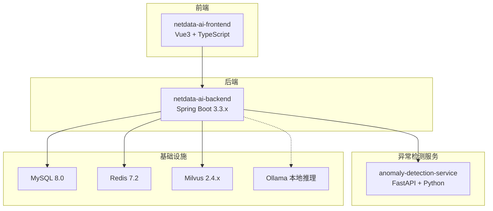
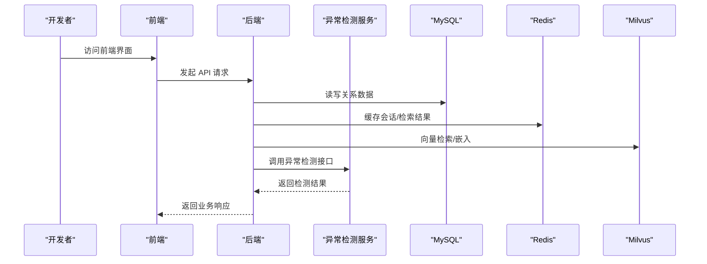

# 开发环境搭建

<cite>
**本文引用的文件**
- [docker-compose.yml](file://docker-compose.yml)
- [verify-env.sh](file://scripts/verify-env.sh)
- [verify-env.ps1](file://scripts/verify-env.ps1)
- [application.yml](file://netdata-ai-backend/src/main/resources/application.yml)
- [pom.xml](file://netdata-ai-backend/pom.xml)
- [Dockerfile（异常检测服务）](file://anomaly-detection-service/Dockerfile)
- [pyproject.toml（异常检测服务）](file://anomaly-detection-service/pyproject.toml)
- [requirements.txt（异常检测服务）](file://anomaly-detection-service/requirements.txt)
- [package.json（前端）](file://netdata-ai-frontend/package.json)
- [milvus_collection.yaml](file://config/milvus_collection.yaml)
- [init.sql](file://sql/init.sql)
- [V2__rbac_tables.sql](file://sql/V2__rbac_tables.sql)
- [deployment_guide.md](file://docs/deployment_guide.md)
</cite>

## 目录
1. [简介](#简介)
2. [项目结构](#项目结构)
3. [核心组件](#核心组件)
4. [架构总览](#架构总览)
5. [详细组件分析](#详细组件分析)
6. [依赖分析](#依赖分析)
7. [性能考虑](#性能考虑)
8. [故障排查指南](#故障排查指南)
9. [结论](#结论)
10. [附录](#附录)

## 简介
本指南面向开发者，提供从零搭建本项目的开发环境的完整步骤，覆盖以下方面：
- 技术栈版本要求（Java 17+、Python 3.10+、Node.js 20+ 等）
- IDE 配置（IntelliJ IDEA、VS Code 插件与配置建议）
- Docker 环境搭建与容器编排
- 数据库、向量数据库、缓存服务的本地部署
- 环境变量配置、依赖安装与项目初始化
- 常见环境问题排查与解决方案

## 项目结构
项目采用多模块架构，包含后端（Spring Boot）、前端（Vue3 + TypeScript）、异常检测（FastAPI + Python）以及向量数据库、关系数据库、缓存等基础设施。

图表来源
- [docker-compose.yml:23-358](file://docker-compose.yml#L23-L358)
- [application.yml:14-314](file://netdata-ai-backend/src/main/resources/application.yml#L14-L314)

章节来源
- [docker-compose.yml:1-358](file://docker-compose.yml#L1-L358)
- [application.yml:1-314](file://netdata-ai-backend/src/main/resources/application.yml#L1-L314)

## 核心组件
- 后端服务（Spring Boot 3.3.x，Java 17+）
- 前端（Vue3 + TypeScript，Node.js 20+）
- 异常检测服务（FastAPI + Python 3.10+）
- 数据库（MySQL 8.0）
- 缓存（Redis 7.2）
- 向量数据库（Milvus 2.4.x）
- 本地推理（Ollama）

章节来源
- [pom.xml:33-39](file://netdata-ai-backend/pom.xml#L33-L39)
- [package.json:1-37](file://netdata-ai-frontend/package.json#L1-L37)
- [pyproject.toml:7-7](file://anomaly-detection-service/pyproject.toml#L7-L7)
- [docker-compose.yml:23-358](file://docker-compose.yml#L23-L358)

## 架构总览
系统通过 Docker Compose 编排，后端通过环境变量连接数据库、缓存与 Milvus；前端通过后端 API 提供交互；异常检测服务独立运行并通过 HTTP 与后端通信。

图表来源
- [docker-compose.yml:23-358](file://docker-compose.yml#L23-L358)
- [application.yml:31-155](file://netdata-ai-backend/src/main/resources/application.yml#L31-L155)

## 详细组件分析

### 技术栈与版本要求
- Java 17+：后端使用 Spring Boot 3.3.x，对应 Java 17+
- Python 3.10+：异常检测服务要求 Python 3.10+，Dockerfile 使用 Python 3.11
- Node.js 20+：前端使用 Vite 5 + TypeScript 5.4
- Docker 24+、Docker Compose 2.20+：容器化与编排
- Git 2.40+

章节来源
- [pom.xml:33-39](file://netdata-ai-backend/pom.xml#L33-L39)
- [pyproject.toml:7-7](file://anomaly-detection-service/pyproject.toml#L7-L7)
- [package.json:27-27](file://netdata-ai-frontend/package.json#L27-L27)
- [deployment_guide.md:14-24](file://docs/deployment_guide.md#L14-L24)

### IDE 配置建议

#### IntelliJ IDEA（后端）
- 插件推荐
  - Lombok（简化实体类）
  - MyBatis Log（SQL 日志）
  - Rainbow CSV（配置文件高亮）
  - EditorConfig（统一缩进风格）
- 语言级别与编译级别
  - Language Level: 17
  - Project SDK: JDK 17
  - Project bytecode version: 17
- Maven 设置
  - 使用项目内嵌 Maven Wrapper 或本地 Maven 3.9+
  - 配置 Spring Boot 运行配置（NetDataOpsApplication）
- 运行参数
  - VM Options：如需调试可添加 -Dspring.profiles.active=dev
- 代码规范
  - 使用 Spotless 或 EditorConfig 统一格式

章节来源
- [pom.xml:20-39](file://netdata-ai-backend/pom.xml#L20-L39)

#### VS Code（前端）
- 插件推荐
  - Vue Language Features (Volar)
  - ESLint
  - TypeScript Importer
  - Path Intellisense
  - Bracket Pair Colorizer
- 设置建议
  - editor.formatOnSave: true
  - editor.codeActionsOnSave: { "source.fixAll.eslint": true }
  - typescript.preferences.importModuleSpecifier: "relative"
- 运行任务
  - 使用 Tasks 配置 npm run dev
  - 终端集成到侧边栏，便于查看日志

章节来源
- [package.json:6-12](file://netdata-ai-frontend/package.json#L6-L12)

### Docker 环境搭建与容器编排
- 安装 Docker 与 Docker Compose
  - Linux：参考官方仓库安装
  - Windows/macOS：安装 Docker Desktop
- 启动服务
  - 在项目根目录执行：docker-compose up -d
  - 查看状态：docker-compose ps
  - 查看日志：docker-compose logs -f
- 停止与清理
  - 停止：docker-compose down
  - 清理数据：docker-compose down -v

章节来源
- [docker-compose.yml:11-21](file://docker-compose.yml#L11-L21)
- [deployment_guide.md:66-98](file://docs/deployment_guide.md#L66-L98)

### 数据库、向量数据库与缓存服务本地部署
- MySQL（关系数据库）
  - 端口：3306（可配置）
  - 初始化：首次启动自动执行 sql/init.sql
  - 用户与权限：使用 ops_user 连接，初始密码在 .env 中配置
- Redis（缓存）
  - 端口：6379（可配置）
  - 持久化：AOF（appendonly yes）
- Milvus（向量数据库）
  - 端口：19531（gRPC），9091（Metrics）
  - Standalone 模式，适合开发
  - 集合结构与索引在 config/milvus_collection.yaml 中定义
- Ollama（本地推理）
  - 端口：11434
  - 作为 LLM 降级方案，开发环境使用本地模型

章节来源
- [docker-compose.yml:164-291](file://docker-compose.yml#L164-L291)
- [milvus_collection.yaml:22-186](file://config/milvus_collection.yaml#L22-L186)

### 环境变量配置
- 后端（Spring Boot）
  - 数据源：MYSQL_HOST、MYSQL_PORT、MYSQL_DATABASE、MYSQL_USER、MYSQL_PASSWORD
  - 缓存：REDIS_HOST、REDIS_PORT、REDIS_PASSWORD、REDIS_DB
  - Milvus：MILVUS_HOST、MILVUS_GRPC_PORT
  - LLM：DEEPSEEK_API_KEY、DEEPSEEK_API_URL（生产）；OLLAMA_BASE_URL、OLLAMA_MODEL（开发）
  - 安全：JWT_SECRET
  - Actuator/监控：暴露健康检查与 Prometheus 指标
- 前端
  - 通过后端代理访问 API，无需本地环境变量
- 异常检测服务
  - ANOMALY_SERVICE_URL（后端调用地址）
- Docker Compose
  - 通过 .env 文件集中管理端口与凭据

章节来源
- [application.yml:31-155](file://netdata-ai-backend/src/main/resources/application.yml#L31-L155)
- [docker-compose.yml:173-177](file://docker-compose.yml#L173-L177)

### 依赖安装与项目初始化
- 后端（Spring Boot）
  - 使用 Maven 构建：./mvnw clean package -DskipTests
  - 或使用 Dockerfile 构建镜像
- 前端（Vue3 + TypeScript）
  - 安装依赖：npm install
  - 启动开发：npm run dev
  - 构建生产：npm run build
- 异常检测服务（FastAPI + Python）
  - 安装依赖：pip install -r requirements.txt
  - 启动服务：uvicorn app.main:app --reload --port 8001
  - Docker 构建：docker build -t netdata-ops-anomaly:latest .

章节来源
- [pom.xml:240-255](file://netdata-ai-backend/pom.xml#L240-L255)
- [package.json:6-12](file://netdata-ai-frontend/package.json#L6-L12)
- [requirements.txt:1-94](file://anomaly-detection-service/requirements.txt#L1-L94)
- [Dockerfile（异常检测服务）:1-95](file://anomaly-detection-service/Dockerfile#L1-L95)

### 数据库初始化与权限模型
- 初始化 SQL
  - 初始脚本：sql/init.sql，包含用户、知识库、对话、执行审计、告警、系统配置等表
  - RBAC 迁移：sql/V2__rbac_tables.sql，新增角色、权限、审批与操作审计表
- 默认数据
  - admin 账户（BCrypt 密码：admin123）
  - 命令模板与系统配置
- 视图
  - 告警统计视图与执行统计视图，便于报表与监控

章节来源
- [init.sql:45-46](file://sql/init.sql#L45-L46)
- [V2__rbac_tables.sql:189-253](file://sql/V2__rbac_tables.sql#L189-L253)

## 依赖分析
- 后端依赖
  - Spring Web/WebFlux、Security、Actuator、OpenAPI/Swagger
  - MyBatis-Plus、MySQL Connector、Redis Starter
  - Spring AI OpenAI、Milvus Java SDK、Resilience4j
- 前端依赖
  - Vue3、Vue Router、Pinia、Element Plus、Axios、markdown-it、highlight.js
- 异常检测服务
  - FastAPI、Uvicorn、PyOD、PySAD、Scikit-learn、NumPy/SciPy、Loguru、Pydantic

章节来源
- [pom.xml:41-238](file://netdata-ai-backend/pom.xml#L41-L238)
- [package.json:13-35](file://netdata-ai-frontend/package.json#L13-L35)
- [requirements.txt:19-94](file://anomaly-detection-service/requirements.txt#L19-L94)

## 性能考虑
- Docker 资源
  - 建议分配至少 8GB 内存给 Docker，Milvus 与 Ollama 对内存敏感
- Milvus 索引与检索
  - 向量维度固定为 1024（BGE-M3），索引类型与 nlist/nprobe 需根据数据规模调整
- Redis
  - 合理设置连接池大小与持久化策略
- 后端
  - Actuator + Prometheus 指标监控，结合 Resilience4j 限流/熔断

章节来源
- [verify-env.sh:109-121](file://scripts/verify-env.sh#L109-L121)
- [milvus_collection.yaml:70-185](file://config/milvus_collection.yaml#L70-L185)
- [application.yml:206-237](file://netdata-ai-backend/src/main/resources/application.yml#L206-L237)

## 故障排查指南
- 环境检查脚本
  - Bash：./scripts/verify-env.sh（Linux/macOS）
  - PowerShell：.\scripts\verify-env.ps1（Windows）
  - 功能：检查 Docker、端口占用、配置文件、数据目录、服务健康状态
- 常见问题
  - Docker 未安装/未运行：安装 Docker Desktop 并启动
  - 端口被占用：修改 .env 中端口映射或释放占用端口
  - MySQL/Redis/Milvus 不健康：查看对应容器日志，确认凭据与网络连通
  - Ollama 启动慢：首次拉取模型需要时间，等待健康检查通过
  - 前端无法访问后端：确认后端已启动且端口映射正确
- 快速定位
  - docker-compose logs -f 查看实时日志
  - docker-compose ps 查看容器状态
  - curl http://localhost:9091/healthz 验证 Milvus
  - curl http://localhost:11434/api/tags 验证 Ollama

章节来源
- [verify-env.sh:68-97](file://scripts/verify-env.sh#L68-L97)
- [verify-env.ps1:39-71](file://scripts/verify-env.ps1#L39-L71)
- [docker-compose.yml:133-139](file://docker-compose.yml#L133-L139)

## 结论
通过本指南，开发者可以快速完成多技术栈的开发环境搭建，并借助 Docker Compose 将数据库、缓存、向量数据库与本地推理服务整合到本地开发环境中。建议在启动前先运行环境检查脚本，确保端口、资源与配置正确，再进行后续开发与调试。

## 附录

### 端口与服务一览
- 前端：80（Nginx/容器暴露）
- 后端：8080
- 异常检测：8001
- MySQL：3306
- Redis：6379
- Milvus gRPC：19531
- Milvus Metrics：9091
- MinIO API：9000
- MinIO Console：9001
- Ollama：11434

章节来源
- [deployment_guide.md:51-58](file://docs/deployment_guide.md#L51-L58)
- [docker-compose.yml:124-128](file://docker-compose.yml#L124-L128)