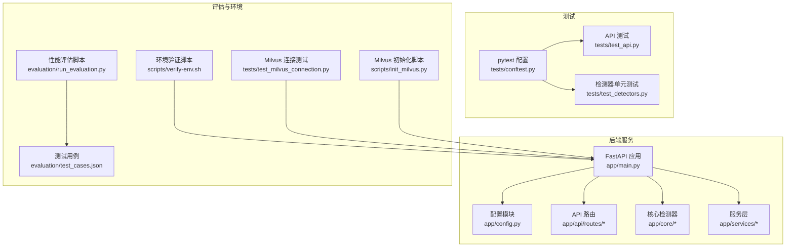
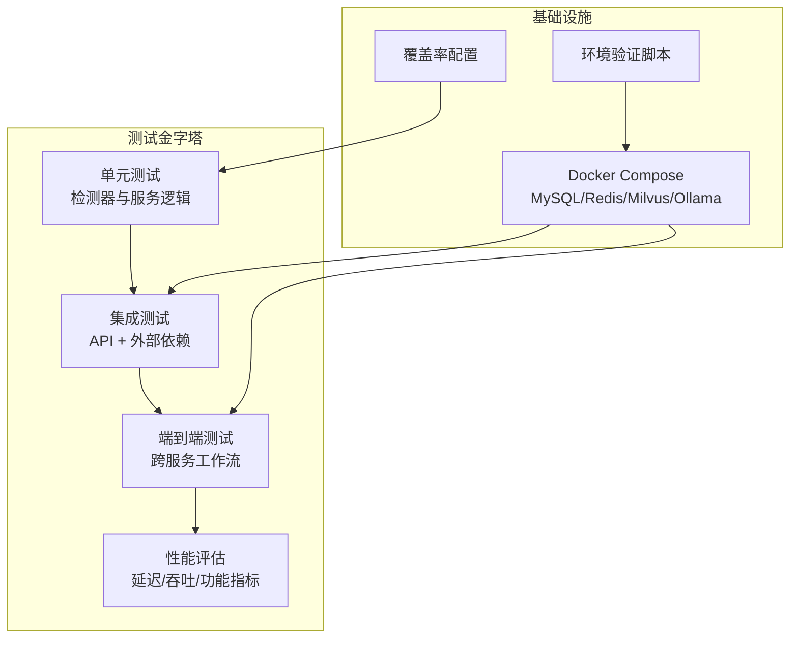
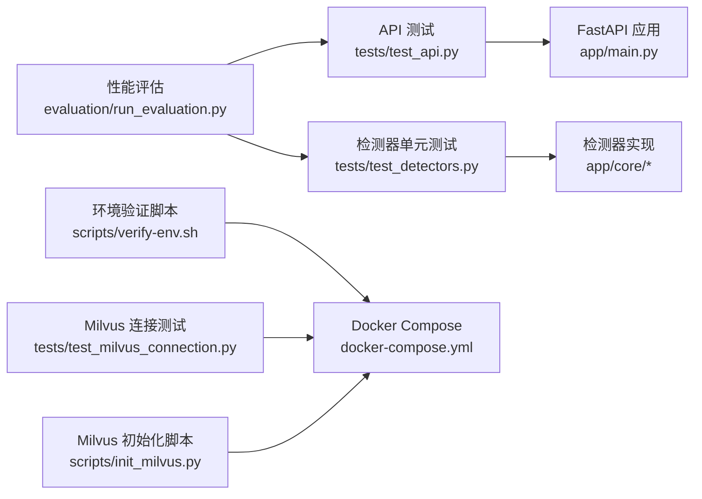

# 测试策略与实施

<cite>
**本文引用的文件**
- [anomaly-detection-service/tests/conftest.py](file://anomaly-detection-service/tests/conftest.py)
- [anomaly-detection-service/tests/test_api.py](file://anomaly-detection-service/tests/test_api.py)
- [anomaly-detection-service/tests/test_detectors.py](file://anomaly-detection-service/tests/test_detectors.py)
- [anomaly-detection-service/pyproject.toml](file://anomaly-detection-service/pyproject.toml)
- [anomaly-detection-service/requirements.txt](file://anomaly-detection-service/requirements.txt)
- [anomaly-detection-service/app/main.py](file://anomaly-detection-service/app/main.py)
- [anomaly-detection-service/app/config.py](file://anomaly-detection-service/app/config.py)
- [docker-compose.yml](file://docker-compose.yml)
- [scripts/verify-env.sh](file://scripts/verify-env.sh)
- [tests/test_milvus_connection.py](file://tests/test_milvus_connection.py)
- [scripts/init_milvus.py](file://scripts/init_milvus.py)
- [config/milvus_collection.yaml](file://config/milvus_collection.yaml)
- [evaluation/run_evaluation.py](file://evaluation/run_evaluation.py)
- [evaluation/test_cases.json](file://evaluation/test_cases.json)
</cite>

## 目录
1. [简介](#简介)
2. [项目结构](#项目结构)
3. [核心组件](#核心组件)
4. [架构总览](#架构总览)
5. [详细组件分析](#详细组件分析)
6. [依赖分析](#依赖分析)
7. [性能考虑](#性能考虑)
8. [故障排查指南](#故障排查指南)
9. [结论](#结论)
10. [附录](#附录)

## 简介
本文件面向“智能运维异常检测服务”子项目，构建一套完整的测试策略与实施方法，涵盖单元测试、集成测试、端到端测试、性能评估与回归测试，并配套测试环境搭建、测试数据管理与持续集成中的测试执行流程。目标是在保证质量的同时，提升开发效率与系统稳定性。

## 项目结构
本项目采用分层与功能模块结合的组织方式：
- 后端服务位于 anomaly-detection-service，包含 FastAPI 应用、核心检测器实现、API 路由与配置模块。
- 测试位于 tests 目录，包含 pytest 配置、API 测试与检测器单元测试。
- 评估与环境验证位于 evaluation 与 scripts 目录，提供性能评估脚本与环境检查脚本。
- 集成测试涉及 Milvus、MySQL、Redis、Ollama 等外部依赖，通过 docker-compose 统一编排。

**图表来源**
- [anomaly-detection-service/app/main.py:1-217](file://anomaly-detection-service/app/main.py#L1-L217)
- [anomaly-detection-service/app/config.py:1-183](file://anomaly-detection-service/app/config.py#L1-L183)
- [anomaly-detection-service/tests/conftest.py:1-22](file://anomaly-detection-service/tests/conftest.py#L1-L22)
- [anomaly-detection-service/tests/test_api.py:1-172](file://anomaly-detection-service/tests/test_api.py#L1-L172)
- [anomaly-detection-service/tests/test_detectors.py:1-231](file://anomaly-detection-service/tests/test_detectors.py#L1-L231)
- [evaluation/run_evaluation.py:1-528](file://evaluation/run_evaluation.py#L1-L528)
- [evaluation/test_cases.json:1-241](file://evaluation/test_cases.json#L1-L241)
- [scripts/verify-env.sh:1-318](file://scripts/verify-env.sh#L1-L318)
- [tests/test_milvus_connection.py:1-148](file://tests/test_milvus_connection.py#L1-L148)
- [scripts/init_milvus.py:1-525](file://scripts/init_milvus.py#L1-L525)

**章节来源**
- [anomaly-detection-service/app/main.py:1-217](file://anomaly-detection-service/app/main.py#L1-L217)
- [anomaly-detection-service/app/config.py:1-183](file://anomaly-detection-service/app/config.py#L1-L183)
- [anomaly-detection-service/tests/conftest.py:1-22](file://anomaly-detection-service/tests/conftest.py#L1-L22)
- [anomaly-detection-service/tests/test_api.py:1-172](file://anomaly-detection-service/tests/test_api.py#L1-L172)
- [anomaly-detection-service/tests/test_detectors.py:1-231](file://anomaly-detection-service/tests/test_detectors.py#L1-L231)
- [evaluation/run_evaluation.py:1-528](file://evaluation/run_evaluation.py#L1-L528)
- [evaluation/test_cases.json:1-241](file://evaluation/test_cases.json#L1-L241)
- [scripts/verify-env.sh:1-318](file://scripts/verify-env.sh#L1-L318)
- [tests/test_milvus_connection.py:1-148](file://tests/test_milvus_connection.py#L1-L148)
- [scripts/init_milvus.py:1-525](file://scripts/init_milvus.py#L1-L525)

## 核心组件
- 测试框架与配置
  - pytest 配置与标记：慢测试、集成测试标记。
  - pytest 选项：测试路径、文件/函数命名规则、输出与异步模式。
  - 覆盖率配置：源码目录、分支覆盖率。
- API 测试
  - 健康检查、就绪检查、存活检查端点。
  - 根路径与 OpenAPI 文档端点。
  - 批量检测、流式检测、训练检测接口。
- 单元测试
  - 检测器工厂、隔离森林、LOF、KNN 检测器。
  - 在线检测器（条件性测试）。
  - 枚举与类型校验。
- 性能评估
  - 异步 HTTP 客户端测量延迟、吞吐量。
  - 功能指标：意图识别、RAG、异常检测 F1。
- 环境与外部依赖
  - docker-compose 编排 MySQL、Redis、Milvus、Ollama。
  - 环境验证脚本检查 Docker、端口、配置与健康状态。
  - Milvus 连接与初始化脚本。

**章节来源**
- [anomaly-detection-service/tests/conftest.py:14-22](file://anomaly-detection-service/tests/conftest.py#L14-L22)
- [anomaly-detection-service/pyproject.toml:37-55](file://anomaly-detection-service/pyproject.toml#L37-L55)
- [anomaly-detection-service/tests/test_api.py:1-172](file://anomaly-detection-service/tests/test_api.py#L1-L172)
- [anomaly-detection-service/tests/test_detectors.py:1-231](file://anomaly-detection-service/tests/test_detectors.py#L1-L231)
- [evaluation/run_evaluation.py:1-528](file://evaluation/run_evaluation.py#L1-L528)
- [scripts/verify-env.sh:1-318](file://scripts/verify-env.sh#L1-L318)
- [tests/test_milvus_connection.py:1-148](file://tests/test_milvus_connection.py#L1-L148)
- [scripts/init_milvus.py:1-525](file://scripts/init_milvus.py#L1-L525)

## 架构总览
测试体系围绕“单元测试-集成测试-端到端测试-性能评估”的金字塔展开，配合覆盖率与回归策略，形成闭环质量保障。

**图表来源**
- [anomaly-detection-service/tests/test_detectors.py:1-231](file://anomaly-detection-service/tests/test_detectors.py#L1-L231)
- [anomaly-detection-service/tests/test_api.py:1-172](file://anomaly-detection-service/tests/test_api.py#L1-L172)
- [docker-compose.yml:1-358](file://docker-compose.yml#L1-L358)
- [scripts/verify-env.sh:1-318](file://scripts/verify-env.sh#L1-L318)
- [anomaly-detection-service/pyproject.toml:44-55](file://anomaly-detection-service/pyproject.toml#L44-L55)
- [evaluation/run_evaluation.py:1-528](file://evaluation/run_evaluation.py#L1-L528)

## 详细组件分析

### 单元测试设计与实施
- 设计原则
  - 隔离性：通过 fixture 生成测试数据，避免外部依赖。
  - 可重复性：固定随机种子，确保结果可复现。
  - 全面性：覆盖训练、预测、异常阈值、边界条件与错误处理。
- Mock 使用
  - 使用 pytest fixture 替代外部依赖；对在线检测器使用条件性测试标记。
  - 对检测器内部状态与返回值进行断言，避免直接依赖第三方模型。
- 测试数据准备
  - 使用 numpy 生成正态分布与异常值混合数据，模拟真实场景。
  - 通过固定 seed 保证不同运行间的一致性。
- 断言策略
  - 形状与范围断言（如 scores 在 [0,1]）。
  - 语义断言（正常数据异常概率低，异常数据概率高）。
  - 异常断言（未训练预测抛出运行时错误）。
- 代码级示例路径
  - [检测器工厂与创建:32-58](file://anomaly-detection-service/tests/test_detectors.py#L32-L58)
  - [隔离森林训练与预测:60-131](file://anomaly-detection-service/tests/test_detectors.py#L60-L131)
  - [LOF 与 KNN 预测:133-190](file://anomaly-detection-service/tests/test_detectors.py#L133-L190)
  - [在线检测器（条件性）:192-215](file://anomaly-detection-service/tests/test_detectors.py#L192-L215)
  - [枚举与类型校验:217-231](file://anomaly-detection-service/tests/test_detectors.py#L217-L231)

**章节来源**
- [anomaly-detection-service/tests/test_detectors.py:1-231](file://anomaly-detection-service/tests/test_detectors.py#L1-L231)

### API 接口测试
- 覆盖范围
  - 健康检查、就绪检查、存活检查。
  - 根路径与 OpenAPI 文档端点。
  - 批量检测、流式检测、训练接口。
- 测试策略
  - 使用 TestClient 发起请求，断言状态码与响应结构。
  - 对无效输入（如数据点过少）断言 422。
  - 对训练接口断言 201 与返回字段。
- 代码级示例路径
  - [健康检查端点测试:32-58](file://anomaly-detection-service/tests/test_api.py#L32-L58)
  - [根路径测试:60-72](file://anomaly-detection-service/tests/test_api.py#L60-L72)
  - [批量检测与无效数据:74-113](file://anomaly-detection-service/tests/test_api.py#L74-L113)
  - [流式检测:114-131](file://anomaly-detection-service/tests/test_api.py#L114-L131)
  - [训练检测:132-155](file://anomaly-detection-service/tests/test_api.py#L132-L155)
  - [OpenAPI 文档:157-172](file://anomaly-detection-service/tests/test_api.py#L157-L172)

**章节来源**
- [anomaly-detection-service/tests/test_api.py:1-172](file://anomaly-detection-service/tests/test_api.py#L1-L172)

### 集成测试实施方案
- 服务间通信测试
  - 通过 docker-compose 启动 MySQL、Redis、Milvus、Ollama。
  - 使用 httpx 异步客户端调用后端 API，断言延迟与吞吐。
- 数据库操作测试
  - 使用环境验证脚本检查端口与健康状态。
  - 通过 SQL 初始化脚本与配置文件准备数据库。
- 外部依赖测试
  - Milvus 连接测试脚本验证 gRPC 与健康检查端点。
  - Milvus 初始化脚本创建 Collection、索引、加载与搜索验证。
- 代码级示例路径
  - [Docker Compose 编排:1-358](file://docker-compose.yml#L1-L358)
  - [环境验证脚本:1-318](file://scripts/verify-env.sh#L1-L318)
  - [Milvus 连接测试:1-148](file://tests/test_milvus_connection.py#L1-L148)
  - [Milvus 初始化脚本:1-525](file://scripts/init_milvus.py#L1-L525)
  - [Milvus Collection 配置:1-186](file://config/milvus_collection.yaml#L1-L186)

**章节来源**
- [docker-compose.yml:1-358](file://docker-compose.yml#L1-L358)
- [scripts/verify-env.sh:1-318](file://scripts/verify-env.sh#L1-L318)
- [tests/test_milvus_connection.py:1-148](file://tests/test_milvus_connection.py#L1-L148)
- [scripts/init_milvus.py:1-525](file://scripts/init_milvus.py#L1-L525)
- [config/milvus_collection.yaml:1-186](file://config/milvus_collection.yaml#L1-L186)

### 端到端测试场景设计与自动化执行
- 场景设计
  - CPU 飙升诊断全流程：意图识别 → 诊断代理 → 指标获取 → 异常检测 → 案例检索 → 报告生成。
  - 知识问答全流程：意图识别 → 查询代理 → RAG 检索 → LLM 生成 → 返回答案与来源。
  - 命令执行审批全流程：意图识别 → 执行代理 → 风险评估 → 审批请求 → 返回审批信息。
- 自动化执行
  - 使用性能评估脚本统一发起请求，收集延迟与功能指标。
  - 通过测试用例 JSON 维护期望意图、期望结果与阈值。
- 代码级示例路径
  - [端到端场景定义:194-241](file://evaluation/test_cases.json#L194-L241)
  - [性能评估主流程:440-528](file://evaluation/run_evaluation.py#L440-L528)
  - [异常检测评估:329-376](file://evaluation/run_evaluation.py#L329-L376)

**章节来源**
- [evaluation/test_cases.json:1-241](file://evaluation/test_cases.json#L1-L241)
- [evaluation/run_evaluation.py:1-528](file://evaluation/run_evaluation.py#L1-L528)

### 测试覆盖率要求
- 覆盖率配置
  - 源码目录：app。
  - 分支覆盖率：开启。
  - 排除行：装饰器、repr、未实现、主入口等。
- 落地建议
  - 单元测试覆盖率：≥80%。
  - 关键路径覆盖率：≥90%。
  - 集成测试覆盖率：重点覆盖 API 路由与外部依赖交互。
- 代码级示例路径
  - [覆盖率配置:44-55](file://anomaly-detection-service/pyproject.toml#L44-L55)

**章节来源**
- [anomaly-detection-service/pyproject.toml:44-55](file://anomaly-detection-service/pyproject.toml#L44-L55)

### 性能测试方法
- 方法概述
  - 异步 HTTP 客户端测量延迟（P50/P90/P99/Avg）与吞吐量。
  - 功能指标：意图识别准确率、RAG 召回率、异常检测 F1。
- 实施步骤
  - 生成测试数据（批量检测使用固定长度序列）。
  - 多轮次采样，排除异常请求，计算统计指标。
  - 保存评估结果 JSON，便于趋势分析。
- 代码级示例路径
  - [性能评估器:133-252](file://evaluation/run_evaluation.py#L133-L252)
  - [功能评估器:257-435](file://evaluation/run_evaluation.py#L257-L435)

**章节来源**
- [evaluation/run_evaluation.py:1-528](file://evaluation/run_evaluation.py#L1-L528)

### 回归测试策略
- 策略要点
  - 每次提交运行单元测试与关键集成测试。
  - 大版本变更运行全量 API 与端到端测试。
  - 依赖升级（如检测器库）运行专项回归。
- 标记与过滤
  - 使用 pytest 标记 slow 与 integration，CI 中按需选择运行。
- 代码级示例路径
  - [pytest 标记配置:14-22](file://anomaly-detection-service/tests/conftest.py#L14-L22)

**章节来源**
- [anomaly-detection-service/tests/conftest.py:14-22](file://anomaly-detection-service/tests/conftest.py#L14-L22)

### 测试环境搭建与测试数据管理
- 环境搭建
  - 使用 docker-compose 一键启动 MySQL、Redis、Milvus、Ollama。
  - 使用环境验证脚本检查 Docker、端口、配置与健康状态。
- 测试数据管理
  - Milvus：通过初始化脚本创建 Collection、索引、加载与测试数据插入。
  - API 测试：使用 TestClient 与固定请求体，避免外部依赖。
  - 性能评估：使用测试用例 JSON 统一维护场景与期望。
- 代码级示例路径
  - [Docker Compose:1-358](file://docker-compose.yml#L1-L358)
  - [环境验证脚本:1-318](file://scripts/verify-env.sh#L1-L318)
  - [Milvus 初始化脚本:1-525](file://scripts/init_milvus.py#L1-L525)
  - [Milvus Collection 配置:1-186](file://config/milvus_collection.yaml#L1-L186)
  - [测试用例 JSON:1-241](file://evaluation/test_cases.json#L1-L241)

**章节来源**
- [docker-compose.yml:1-358](file://docker-compose.yml#L1-L358)
- [scripts/verify-env.sh:1-318](file://scripts/verify-env.sh#L1-L318)
- [scripts/init_milvus.py:1-525](file://scripts/init_milvus.py#L1-L525)
- [config/milvus_collection.yaml:1-186](file://config/milvus_collection.yaml#L1-L186)
- [evaluation/test_cases.json:1-241](file://evaluation/test_cases.json#L1-L241)

### 测试工具链配置与持续集成
- 工具链
  - pytest：测试执行与标记。
  - pytest-cov：覆盖率。
  - ruff/mypy：代码质量与类型检查。
  - httpx：异步 HTTP 客户端。
- CI 建议流程
  - 安装依赖（requirements.txt）。
  - 启动 docker-compose。
  - 运行 pytest（含覆盖率）。
  - 运行性能评估脚本。
  - 上传覆盖率报告与评估结果。
- 代码级示例路径
  - [requirements.txt:1-94](file://anomaly-detection-service/requirements.txt#L1-L94)
  - [pyproject.toml:1-55](file://anomaly-detection-service/pyproject.toml#L1-L55)

**章节来源**
- [anomaly-detection-service/requirements.txt:1-94](file://anomaly-detection-service/requirements.txt#L1-L94)
- [anomaly-detection-service/pyproject.toml:1-55](file://anomaly-detection-service/pyproject.toml#L1-L55)

## 依赖分析
- 组件耦合
  - API 测试依赖 FastAPI 应用与 TestClient。
  - 单元测试依赖检测器工厂与 numpy。
  - 性能评估依赖 httpx 与测试用例 JSON。
- 外部依赖
  - MySQL/Redis/Milvus/Ollama 通过 docker-compose 提供。
  - 环境验证脚本与 Milvus 连接测试辅助外部依赖验证。
- 循环依赖
  - 当前结构清晰，未见循环依赖迹象。

**图表来源**
- [anomaly-detection-service/tests/test_api.py:1-172](file://anomaly-detection-service/tests/test_api.py#L1-L172)
- [anomaly-detection-service/app/main.py:1-217](file://anomaly-detection-service/app/main.py#L1-L217)
- [anomaly-detection-service/tests/test_detectors.py:1-231](file://anomaly-detection-service/tests/test_detectors.py#L1-L231)
- [evaluation/run_evaluation.py:1-528](file://evaluation/run_evaluation.py#L1-L528)
- [scripts/verify-env.sh:1-318](file://scripts/verify-env.sh#L1-L318)
- [docker-compose.yml:1-358](file://docker-compose.yml#L1-L358)
- [tests/test_milvus_connection.py:1-148](file://tests/test_milvus_connection.py#L1-L148)
- [scripts/init_milvus.py:1-525](file://scripts/init_milvus.py#L1-L525)

**章节来源**
- [anomaly-detection-service/tests/test_api.py:1-172](file://anomaly-detection-service/tests/test_api.py#L1-L172)
- [anomaly-detection-service/tests/test_detectors.py:1-231](file://anomaly-detection-service/tests/test_detectors.py#L1-L231)
- [evaluation/run_evaluation.py:1-528](file://evaluation/run_evaluation.py#L1-L528)
- [scripts/verify-env.sh:1-318](file://scripts/verify-env.sh#L1-L318)
- [docker-compose.yml:1-358](file://docker-compose.yml#L1-L358)
- [tests/test_milvus_connection.py:1-148](file://tests/test_milvus_connection.py#L1-L148)
- [scripts/init_milvus.py:1-525](file://scripts/init_milvus.py#L1-L525)

## 性能考虑
- 延迟与吞吐
  - 使用异步 HTTP 客户端减少阻塞，提高并发测量准确性。
  - 多轮次采样与统计指标（P50/P90/P99/Avg/Throughput）。
- 资源占用
  - 通过 docker-compose 限制资源，避免测试期间资源争用。
- 数据规模
  - 批量检测使用固定长度序列，保证可比性。
- 评估维度
  - 功能评估：意图识别准确率、RAG 召回率、异常检测 F1。
  - 性能评估：延迟、吞吐量、资源占用。
- 代码级示例路径
  - [性能评估器:133-252](file://evaluation/run_evaluation.py#L133-L252)
  - [功能评估器:257-435](file://evaluation/run_evaluation.py#L257-L435)

**章节来源**
- [evaluation/run_evaluation.py:1-528](file://evaluation/run_evaluation.py#L1-L528)

## 故障排查指南
- 环境问题
  - 使用环境验证脚本检查 Docker、端口占用、配置文件与健康状态。
  - 若 Milvus 不健康，查看容器日志并确认 gRPC 与健康检查端点可达。
- API 问题
  - 使用 API 测试用例定位路由与参数错误。
  - 检查全局异常处理器与中间件日志。
- 外部依赖问题
  - 使用 Milvus 连接测试脚本验证连接与健康检查。
  - 使用初始化脚本验证 Collection、索引与搜索流程。
- 代码级示例路径
  - [环境验证脚本:1-318](file://scripts/verify-env.sh#L1-L318)
  - [Milvus 连接测试:1-148](file://tests/test_milvus_connection.py#L1-L148)
  - [Milvus 初始化脚本:1-525](file://scripts/init_milvus.py#L1-L525)
  - [FastAPI 异常处理与中间件:145-172](file://anomaly-detection-service/app/main.py#L145-L172)

**章节来源**
- [scripts/verify-env.sh:1-318](file://scripts/verify-env.sh#L1-L318)
- [tests/test_milvus_connection.py:1-148](file://tests/test_milvus_connection.py#L1-L148)
- [scripts/init_milvus.py:1-525](file://scripts/init_milvus.py#L1-L525)
- [anomaly-detection-service/app/main.py:145-172](file://anomaly-detection-service/app/main.py#L145-L172)

## 结论
本测试策略以 pytest 为核心，结合单元测试、集成测试与性能评估，形成从代码到端到端的完整质量保障体系。通过 docker-compose 编排外部依赖、环境验证脚本与 Milvus 初始化脚本，确保测试环境稳定可靠。建议在 CI 中按需运行慢测试与集成测试，并持续完善端到端场景与覆盖率目标，以支撑系统的长期演进与高质量交付。

## 附录
- 关键配置与工具
  - pytest 配置与标记：[pytest 配置:14-22](file://anomaly-detection-service/tests/conftest.py#L14-L22)
  - 覆盖率配置：[覆盖率配置:44-55](file://anomaly-detection-service/pyproject.toml#L44-L55)
  - 依赖清单：[依赖清单:1-94](file://anomaly-detection-service/requirements.txt#L1-L94)
- 测试用例与场景
  - 端到端场景：[测试用例 JSON:194-241](file://evaluation/test_cases.json#L194-L241)
  - 性能评估脚本：[性能评估:1-528](file://evaluation/run_evaluation.py#L1-L528)
- 外部依赖与环境
  - Docker Compose：[编排配置:1-358](file://docker-compose.yml#L1-L358)
  - 环境验证脚本：[环境验证:1-318](file://scripts/verify-env.sh#L1-L318)
  - Milvus 连接与初始化：[连接测试:1-148](file://tests/test_milvus_connection.py#L1-L148)，[初始化脚本:1-525](file://scripts/init_milvus.py#L1-L525)，[Collection 配置:1-186](file://config/milvus_collection.yaml#L1-L186)