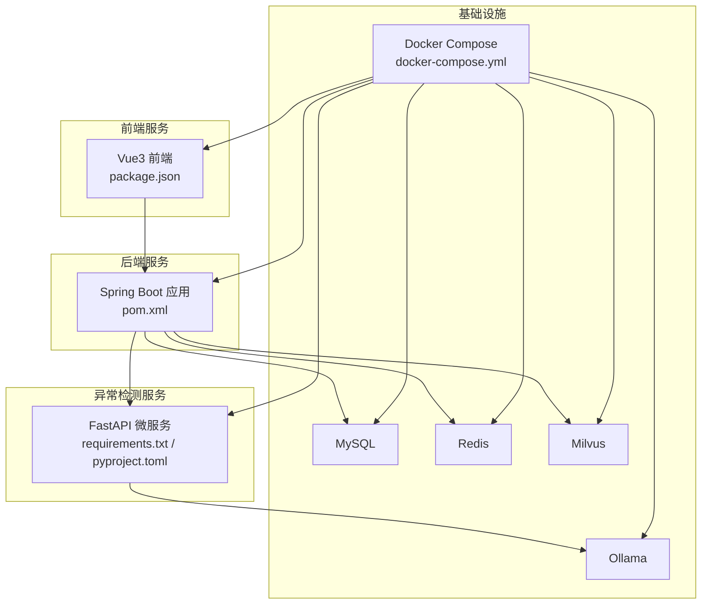
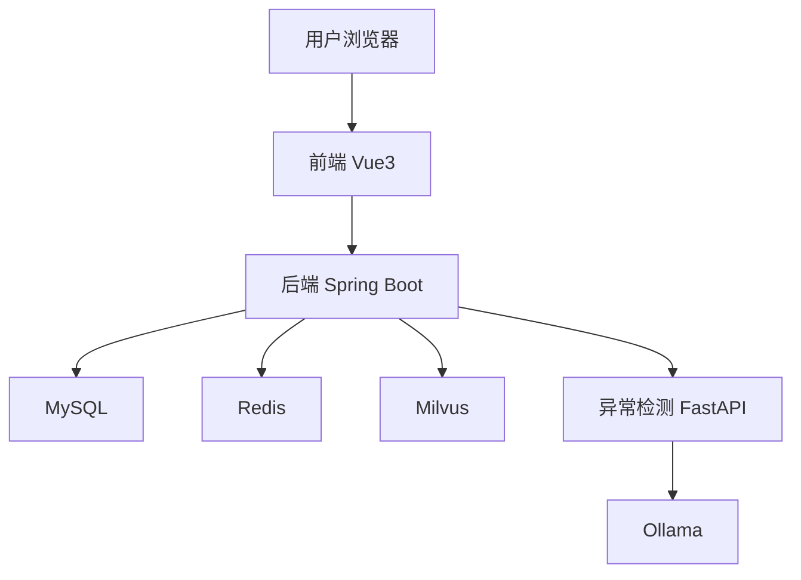
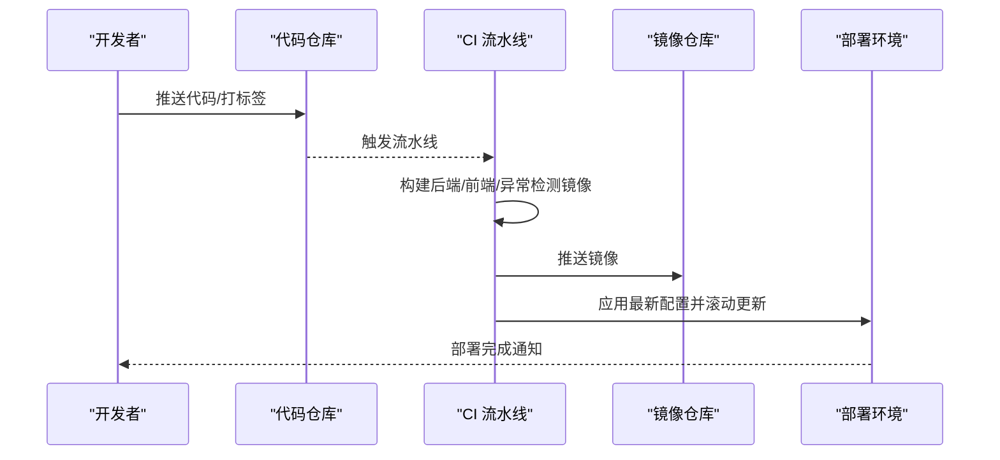
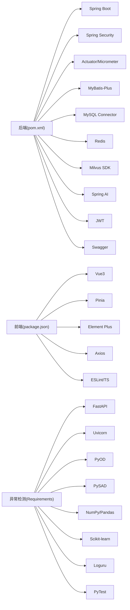

# 版本管理与协作

<cite>
**本文引用的文件**
- [anomaly-detection-service/pyproject.toml](file://anomaly-detection-service/pyproject.toml)
- [anomaly-detection-service/requirements.txt](file://anomaly-detection-service/requirements.txt)
- [netdata-ai-backend/pom.xml](file://netdata-ai-backend/pom.xml)
- [netdata-ai-frontend/package.json](file://netdata-ai-frontend/package.json)
- [docker-compose.yml](file://docker-compose.yml)
- [PROJECT_CONTEXT.md](file://PROJECT_CONTEXT.md)
- [docs/deployment_guide.md](file://docs/deployment_guide.md)
- [docs/thesis_outline.md](file://docs/thesis_outline.md)
- [anomaly-detection-service/Dockerfile](file://anomaly-detection-service/Dockerfile)
- [netdata-ai-backend/src/main/resources/application.yml](file://netdata-ai-backend/src/main/resources/application.yml)
</cite>

## 目录
1. [简介](#简介)
2. [项目结构](#项目结构)
3. [核心组件](#核心组件)
4. [架构总览](#架构总览)
5. [详细组件分析](#详细组件分析)
6. [依赖分析](#依赖分析)
7. [性能考虑](#性能考虑)
8. [故障排查指南](#故障排查指南)
9. [结论](#结论)
10. [附录](#附录)

## 简介
本文件旨在建立完善的版本管理和协作流程，覆盖以下方面：
- Git 分支策略：主分支保护、功能分支开发、热修复流程
- 代码审查标准与流程：Pull Request 模板、审查清单、合并策略
- 版本标签管理、发布流程与变更日志维护
- 依赖版本管理：Maven 版本管理、npm 包管理、Python 依赖锁定
- 冲突解决策略与团队协作最佳实践
- CI/CD 流水线配置与自动化部署

本项目采用多模块架构（后端 Java、前端 Vue、异常检测 Python 微服务、容器编排），并已在部署文档中给出完整的镜像构建与运行流程，便于落地版本发布与自动化部署。

## 项目结构
项目由四个主要部分组成：
- 后端服务（Spring Boot）：负责 API、鉴权、RAG、Agent 协调等
- 前端服务（Vue3）：负责用户交互、聊天、告警、知识库与审批
- 异常检测服务（Python FastAPI）：负责离线/在线异常检测
- 容器编排（Docker Compose）：一键启动所有基础设施与服务

图表来源
- [docker-compose.yml:1-358](file://docker-compose.yml#L1-L358)
- [netdata-ai-backend/pom.xml:1-270](file://netdata-ai-backend/pom.xml#L1-L270)
- [netdata-ai-frontend/package.json:1-37](file://netdata-ai-frontend/package.json#L1-L37)
- [anomaly-detection-service/requirements.txt:1-94](file://anomaly-detection-service/requirements.txt#L1-L94)

章节来源
- [PROJECT_CONTEXT.md:120-149](file://PROJECT_CONTEXT.md#L120-L149)
- [docker-compose.yml:1-358](file://docker-compose.yml#L1-L358)

## 核心组件
- 后端（Java/Spring Boot）
  - 版本号：父 POM 指定版本为 1.0.0-SNAPSHOT
  - 依赖管理：集中于 pom.xml，包含 Spring AI、MyBatis-Plus、Milvus SDK、Resilience4j 等
- 前端（Vue3）
  - 版本号：package.json 中 version 字段为 1.0.0
  - 依赖管理：通过 package.json 管理依赖与脚本
- 异常检测服务（Python）
  - 版本号：pyproject.toml 中 project.version 为 1.0.0
  - 依赖管理：requirements.txt 锁定版本，pyproject.toml 配置测试、覆盖率、类型检查等工具
- 容器编排（Docker Compose）
  - docker-compose.yml 定义了 Milvus、MySQL、Redis、Ollama 等服务的镜像、端口、健康检查与资源限制

章节来源
- [netdata-ai-backend/pom.xml:27-31](file://netdata-ai-backend/pom.xml#L27-L31)
- [netdata-ai-frontend/package.json:1-37](file://netdata-ai-frontend/package.json#L1-L37)
- [anomaly-detection-service/pyproject.toml:1-55](file://anomaly-detection-service/pyproject.toml#L1-L55)
- [anomaly-detection-service/requirements.txt:1-94](file://anomaly-detection-service/requirements.txt#L1-L94)
- [docker-compose.yml:1-358](file://docker-compose.yml#L1-L358)

## 架构总览
系统采用“前端-后端-API网关-多Agent协调层-核心服务层-数据存储层”的分层架构，并通过 Docker Compose 实现本地开发环境的一键启动。后端与异常检测服务之间通过 REST/WebSocket 通信，后端与 MySQL、Redis、Milvus 等外部组件通过配置文件进行连接。

图表来源
- [docs/deployment_guide.md:3-25](file://docs/deployment_guide.md#L3-L25)
- [docker-compose.yml:1-358](file://docker-compose.yml#L1-L358)

## 详细组件分析

### Git 分支策略
- 主分支保护
  - master/main 分支启用保护规则：禁止直接推送、强制 PR 合并、必需 CI 通过、必需批准者
  - 关键分支（如 release/*、hotfix/*）启用保护，仅允许特定角色合并
- 功能分支开发
  - 命名规范：feature/xxx、feat/xxx、chore/xxx
  - 开发流程：从 develop 拉取新分支，提交 PR 合并至 develop，周期性同步主干
- 热修复流程
  - 命名规范：hotfix/xxx
  - 从 master 拉出分支，修复后同时合并回 master 与 develop，并打补丁标签

章节来源
- [PROJECT_CONTEXT.md:85-107](file://PROJECT_CONTEXT.md#L85-L107)

### 代码审查标准与流程
- Pull Request 模板
  - 标题：类型/模块/简要描述（如 feat(backend): 新增鉴权接口）
  - 描述：需求背景、改动内容、影响范围、测试要点、风险评估
  - 关联：关联 Issue/需求卡片编号
- 审查清单
  - 代码质量：是否通过 lint、格式化、单元测试
  - 安全性：敏感信息脱敏、权限校验、输入校验
  - 兼容性：接口变更是否向后兼容、数据库迁移脚本
  - 文档：README 更新、API 文档更新
- 合并策略
  - 必须通过 CI、至少一名批准者
  - Squash 合并以保持提交历史整洁；Hotfix 可直并

章节来源
- [PROJECT_CONTEXT.md:85-107](file://PROJECT_CONTEXT.md#L85-L107)

### 版本标签管理与发布流程
- 版本号策略
  - 后端：pom.xml 中 version 为 1.0.0-SNAPSHOT，发布时改为正式版本并打 tag
  - 前端：package.json 中 version 为 1.0.0，发布时更新并打 tag
  - 异常检测服务：pyproject.toml 中 version 为 1.0.0，发布时更新并打 tag
- 发布流程
  - 步骤：更新版本号 → 生成变更日志 → 打 tag → 触发 CI 构建镜像 → 推送镜像 → 发布公告
  - 变更日志：遵循约定式提交，按 breaking change、feat、fix、perf、docs、refactor 分类
- 变更日志维护
  - 使用工具（如 conventional-changelog）自动生成
  - 里程碑与标签：release/vX.Y.Z、hotfix/vX.Y.Z

章节来源
- [netdata-ai-backend/pom.xml:27-31](file://netdata-ai-backend/pom.xml#L27-L31)
- [netdata-ai-frontend/package.json:1-37](file://netdata-ai-frontend/package.json#L1-L37)
- [anomaly-detection-service/pyproject.toml:1-55](file://anomaly-detection-service/pyproject.toml#L1-L55)

### 依赖版本管理
- Maven（后端）
  - 使用 spring-boot-starter-parent 统一版本，第三方依赖通过属性集中管理
  - 关键依赖：Spring Boot 3.3.x、Spring AI 1.0.x、Milvus SDK 2.4.x、JWT、Swagger、MyBatis-Plus、Resilience4j
- npm（前端）
  - 通过 package.json 管理依赖与脚本，使用 lock 文件保证一致性
  - 关键依赖：Vue3、Element Plus、Pinia、Axios、ESLint、TypeScript
- Python（异常检测服务）
  - 使用 requirements.txt 锁定版本，pyproject.toml 配置测试、覆盖率、类型检查
  - 关键依赖：FastAPI、Uvicorn、PyOD、PySAD、NumPy、Pandas、Scikit-learn、Loguru、PyTest

章节来源
- [netdata-ai-backend/pom.xml:33-39](file://netdata-ai-backend/pom.xml#L33-L39)
- [netdata-ai-frontend/package.json:13-35](file://netdata-ai-frontend/package.json#L13-L35)
- [anomaly-detection-service/requirements.txt:1-94](file://anomaly-detection-service/requirements.txt#L1-L94)
- [anomaly-detection-service/pyproject.toml:1-55](file://anomaly-detection-service/pyproject.toml#L1-L55)

### 冲突解决策略与团队协作最佳实践
- 冲突解决
  - 频繁 rebase 主干，减少长链分支
  - 小步提交、清晰提交信息，必要时拆分 PR
  - 代码审查中优先解决结构性问题（设计、架构）
- 协作最佳实践
  - 约定式提交、统一代码风格、统一错误码与日志格式
  - 接口变更提前沟通，提供迁移指南
  - 故障复盘与根因分析（RCA）纳入流程

章节来源
- [PROJECT_CONTEXT.md:110-117](file://PROJECT_CONTEXT.md#L110-L117)

### CI/CD 流水线配置与自动化部署
- 构建与测试
  - 后端：Maven 构建 JAR，跳过测试（可选）或执行测试
  - 前端：npm ci → npm run build → 产物打包为 Nginx 镜像
  - 异常检测：pip 安装依赖 → 构建 Docker 镜像
- 镜像与部署
  - docker-compose.yml 定义各服务镜像、端口映射、健康检查、资源限制
  - 生产环境可使用 Kubernetes 部署（Deployment/Service/Ingress/ConfigMap/Secret）
- 自动化发布
  - 触发条件：push tag 或 merge main
  - 步骤：构建镜像 → 推送 registry → 更新 compose/k8s 配置 → 滚动更新

图表来源
- [docs/deployment_guide.md:398-563](file://docs/deployment_guide.md#L398-L563)
- [docker-compose.yml:400-563](file://docker-compose.yml#L400-L563)

章节来源
- [docs/deployment_guide.md:3-25](file://docs/deployment_guide.md#L3-L25)
- [docs/deployment_guide.md:398-563](file://docs/deployment_guide.md#L398-L563)
- [docker-compose.yml:1-358](file://docker-compose.yml#L1-L358)

## 依赖分析
- 后端依赖
  - Spring 生态：Web、Security、Validation、AOP、Actuator、Micrometer
  - 第三方：MyBatis-Plus、MySQL Connector、Redis、Milvus SDK、Spring AI、JWT、Swagger
- 前端依赖
  - Vue3、Router、Pinia、Element Plus、Axios、ESLint、TypeScript
- 异常检测依赖
  - FastAPI、Uvicorn、PyOD、PySAD、NumPy、Pandas、Scikit-learn、Loguru、PyTest

图表来源
- [netdata-ai-backend/pom.xml:41-238](file://netdata-ai-backend/pom.xml#L41-L238)
- [netdata-ai-frontend/package.json:13-35](file://netdata-ai-frontend/package.json#L13-L35)
- [anomaly-detection-service/requirements.txt:1-94](file://anomaly-detection-service/requirements.txt#L1-L94)

章节来源
- [netdata-ai-backend/pom.xml:41-238](file://netdata-ai-backend/pom.xml#L41-L238)
- [netdata-ai-frontend/package.json:13-35](file://netdata-ai-frontend/package.json#L13-L35)
- [anomaly-detection-service/requirements.txt:1-94](file://anomaly-detection-service/requirements.txt#L1-L94)

## 性能考虑
- 容器资源限制：为 Milvus、Ollama 等内存密集型服务设置合理的内存上限与预留
- 健康检查：为各服务配置健康检查，确保快速发现与自动重启
- 缓存与索引：Redis 用于会话与检索缓存；Milvus 使用合适的索引类型与向量维度
- 网络与存储：使用命名卷提升跨平台兼容性与性能；网络隔离避免冲突

章节来源
- [docker-compose.yml:57-155](file://docker-compose.yml#L57-L155)
- [docker-compose.yml:241-291](file://docker-compose.yml#L241-L291)

## 故障排查指南
- 服务启动失败
  - 检查健康检查配置与日志输出
  - 核对环境变量与端口占用
- 数据库连接问题
  - 校验凭据与初始化脚本
  - 确认字符集与时区设置
- 向量检索异常
  - 校验 Milvus 配置与集合 Schema
  - 确认 Embedding 维度与模型一致
- 前后端联调
  - 核对代理配置与 CORS 设置
  - 检查 WebSocket 连接与消息格式

章节来源
- [docs/deployment_guide.md:135-148](file://docs/deployment_guide.md#L135-L148)
- [docker-compose.yml:133-139](file://docker-compose.yml#L133-L139)
- [netdata-ai-backend/src/main/resources/application.yml](file://netdata-ai-backend/src/main/resources/application.yml)

## 结论
通过明确的分支策略、严格的代码审查流程、规范的版本标签与发布流程、以及完善的依赖版本管理，本项目能够实现高质量的持续交付。配合 Docker Compose 与部署指南，可快速完成本地开发与生产部署，保障系统的稳定性与可维护性。

## 附录
- 论文大纲与系统设计：用于指导版本演进与功能迭代
- 部署指南：涵盖开发与生产环境的部署步骤与配置

章节来源
- [docs/thesis_outline.md:1-407](file://docs/thesis_outline.md#L1-L407)
- [docs/deployment_guide.md:1-909](file://docs/deployment_guide.md#L1-L909)